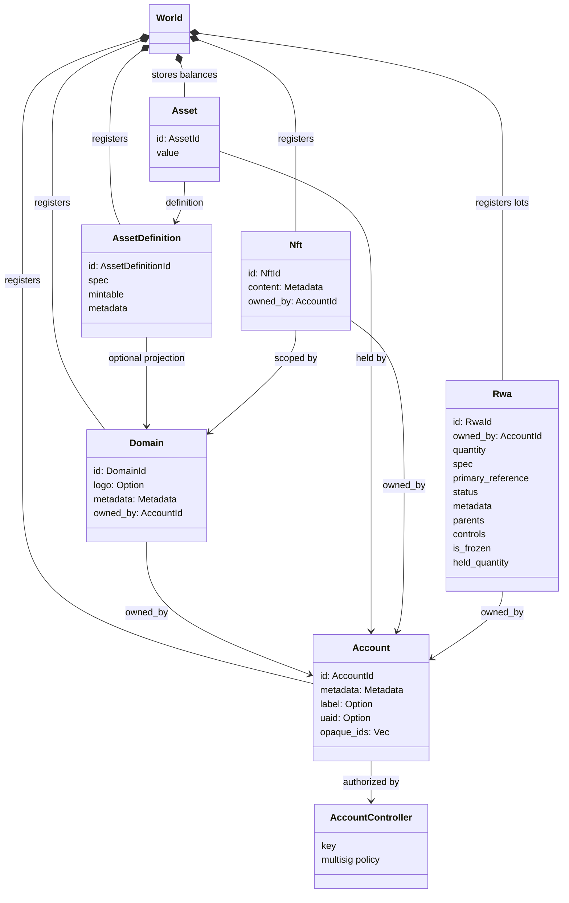
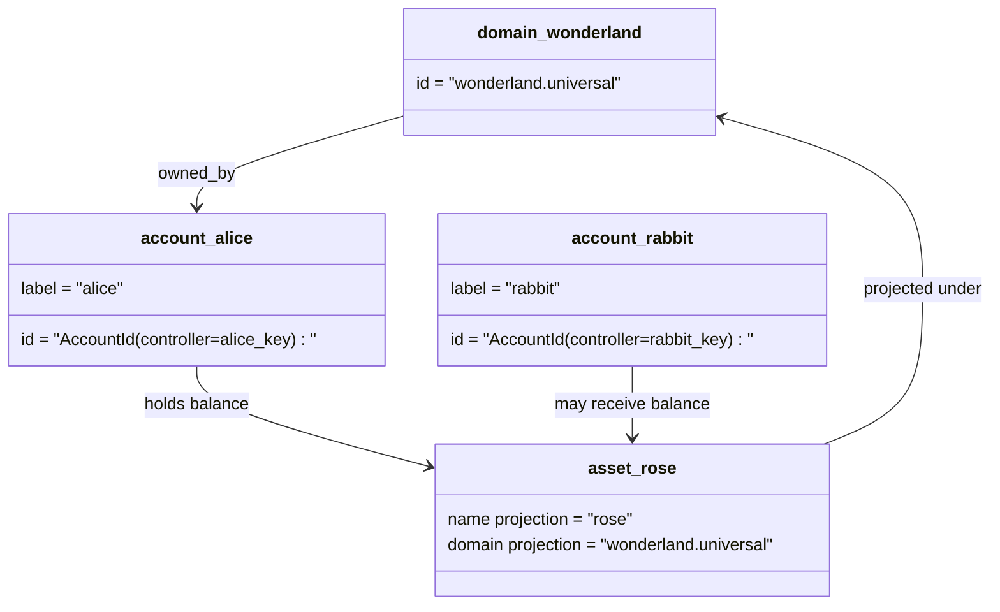

# የመረጃ ሞዴል {#data-model}

Iroha በ `World` ውስጥ ዋና መለያ ሁኔታን ያከማቻል። የመጀመሪያ ጊዜ የመረጃ ሞዴሉ የሚከተሉትን የካኖኒክ ማንነቶች እና አካላት ይጠቀማል:

- ጎራዎች የመረጃ ቦታ ብቁ ናቸው, ለምሳሌ `payments.universal`
- ሂሳቦች ካኖኒክ እና ጎራ የሌላቸው ናቸው; ሂሳቡ ID ከሂሳብ አስተዳዳሪ የተገኘ ነው
- የንብረት ትርጓሜዎች የጎራ / ስም ትንበያ መያዝ ይችላሉ ፣ ግን የእነሱ ቀኖናዊ ጽሑፍ አድራሻ ግልጽ ያልሆነ Base58 መታወቂያ ነው።
- ንብረቶች ለተወሰነ የንብረት ማብራሪያ በሂሳብ የተያዙ ሚዛኖች ናቸው
- NFTs ጎራ ብቃት ያለው IDs እና ሜታዳታ ይዘት ያላቸው ብቸኛ ባለቤትነት ያላቸው መዝገቦች ናቸው
- RWAs የሚመነጩ- ID ንብረቶችን ከአሁኑ ባለቤት ፣ ብዛት ፣ አመጣጥ ፣ ሜታዳታ ፣ መያዣዎች ፣ ማቀዝቀዣዎች እና የህይወት ዑደት ቁጥሮች ጋር ከሰንሰለት ውጭ ያሉ ንብረቶችን የሚያመለክቱ ሎት ናቸው

## ምሳሌ {#example}

በ Iroha 3 አውታረመረብ ውስጥ, `wonderland.universal` በ `universal` የውሂብ ቦታ ውስጥ አንድ ጎራ ነው. በዚህ ምሳሌ ውስጥ ያሉት የካኖኒካል መለያዎች በእነሱ ቁልፎች ወይም ፖሊሲዎች ቁጥጥር ይደረግባቸዋል እና እንደ ጎራ የሌለው I105 መለያ IDs ተዘግተዋል. እንደ `alice@wonderland.universal` ያሉ ሊነበቡ የሚችሉ መለያዎች ለእነዚያ IDs የተገናኙ የተለያዩ ቅጽል ስሞች ናቸው. በፕሮጀክቱ ላይ የተጠቀሰው የንብረት መወሰኛ አድራሻ የሚመነጨው Base58 አድራሻ ሲሆን `wonderland.universal` ውስጥ እንደ `rose` ያሉ የጎራ እና ስም አሁንም ሊገነባ ይችላል.

## ስያሜዎች {#aliases}

ቅጽል ስሞች በ API, CLI, በኪስ ቦርሳ እና በአሰሳ ወሰን ላይ ጠቃሚ ናቸው, ነገር ግን ቀኖናዊ IDs በጥብቅ መቁጠሪያ መስኮች ውስጥ የተከማቹ የተረጋጋ መታወቂያዎች ሆነው ይቆያሉ.

| ግብ|ቀኖኒካዊ ግብ|^ ቃል በቃል ^|የጀርባ ሞዴል |
| -------------- | --------------------------------------------------- | ------------------------------------------------------ | ----------------------------------------------------------------------------- |
|የተጠቃሚ መለያ |የጎራ የሌለው `AccountId` እንደ I105 አድራሻ የተቀየሰ |`name@domain.dataspace` ወይም `name@dataspace` |`AccountAlias`፤ ዋና ስያሜው `Account.label` ሲሆን ተጨማሪ ስያሜዎችም አስገዳጅ ናቸው |
|የንብረት ትርጉም |`AssetDefinitionId` Base58 አድራሻ |`name#domain.dataspace` ወይም `name#dataspace` |`AssetDefinitionAlias` ለንብረቱ ትርጉም የተገደበ ነው |
|ውል |ቀኖናዊ Bech32m `ContractAddress` |`name::domain.dataspace` ወይም `name::dataspace` |`ContractAlias` ከተሰማራ የውል አድራሻ ጋር የተያያዘ ነው |
|የጎራ ስም |`DomainId` በ `domain.dataspace` ቅጽ |`domain.dataspace` |SNS `domain` የስም ቦታ መዝገብ |
|የመረጃ ቋት ስም |በ Nexus ንቁ ካታሎግ ውስጥ ቁጥር ያለው `DataSpaceId` |እንደ `universal` ፣ `paynet` ወይም `zk` ያሉ የመረጃ ቦታ ቅጽል ስሞች።|SNS `dataspace` የስም ቦታ መዝገብ እና ንቁ የመረጃ ቦታ ካታሎግ |

የሂሳብ ስያሜዎች ለተጠቃሚው የተጋለጡ የመለያ ስሞች ናቸው ። ስያሜዎቹ ወደ ንቁ መለያ የሚያመለክቱ በመሆናቸው የመለያ መልሶ ማቋቋም ይቀጥላሉ። ID በመላው ዓለም የስቴት ኢንዴክሶች እና በሂሳብ ሪኬይ መዝገቦች በኩል። `SetPrimaryAccountAlias` ለሂሳቡ ዋና መለያ፣ `SetAccountAliasBinding` ተጨማሪ ዋና ያልሆኑ ቅጽል ስሞች፣ እና `FindAccountByAlias` ወይም `FindAliasesByAccountId` የሂሳብ ስያሜዎች በተለምዶ ንቁ SNS የሂሳብ ስምምነቶች ኪራይ ከ `AcquireAccountAliasLease` እና የታደሰ `RenewAccountAliasLease`.

የንብረት ስያሜዎች የአክሲዮን ትርፍ መግለጫዎች እንጂ የግለሰብ ሂሳብ ቀሪዎች አይደሉም ። የንብረት ስም እና የውል ስያሜ ከማንበብ የሚችል ስም ወደ ነባር የካኖኒካል ዒላማ ቀጥተኛ ግዴታዎች ናቸው ። የንብረት ስም ቅጽል ስሞች በ `SetAssetDefinitionAlias` ይዘጋጃሉ; የቅጽል ስም ስም ክፍል ከንብረት ትርጉም ማሳያ ስም ወይም ከተነደፈው የግንዛቤ ስም ጋር የሚመሳሰል መሆን አለበት. የውል ስም ቅጽል ስም በ `SetContractAlias` ይዘጋጃል; የቅጽ ስም የውሂብ ቦታው በውል አድራሻ ውስጥ የተመዘገበውን የውሂብ ክልል ማዛመድ አለበት. ሁለቱም ትስስሮች `lease_expiry_ms` ሊይዙ ይችላሉ; ከተጠናቀቁ በኋላ የችሮታ መስኮቱ ሲያበቃ መፍታት ያቆማሉ እና ከዓለም-አገር ማውጫዎች ይጣላሉ ።

ጎራዎች የተለዩ የላቸውም `DomainAlias` አንድ የጎራ መታወቂያ ቀድሞውኑ እንደ የመረጃ ቦታ ብቃት ያለው ስም ነው `payments.universal`. SNS ትራኮች በ ውስጥ የጎራ ስሞች የሊዝ ባለቤትነት `domain` የስም ቦታ እና የውሂብ ቦታ ስያሜዎች ውስጥ `dataspace` የስም ቦታ። `universal` የውሂብ ቦታ ስያሜዎች ተለይተው መቆየት አለባቸው።

## ተዛማጅ ሰነዶች {#related-docs}

|ርዕስ |የት መሄድ |
| -------------------------------------- | ------------------------------------------- |
|ጎራዎች | [ጎራዎች](/am/blockchain/domains.md) |
|መለያዎች | [መለያዎች](/am/blockchain/accounts.md) |
|ንብረቶች | [ንብረት](/am/blockchain/assets.md) |
|NFTs | [NFTs](/am/blockchain/nfts.md) |
|የእውነተኛ ዓለም ንብረቶች | [የእውነተኛ ዓለም ሀብቶች](/am/blockchain/rwas.md) |
|ሜታዳታ | [ሜታ መረጃዎች](/am/blockchain/metadata.md) |
|የምዝገባ እና የማስተላለፍ መመሪያ | [መመሪያዎች](/am/blockchain/instructions.md) |
|የመሮጫ ጊዜ ፍቃዶች | [ፈቃድ](/am/blockchain/permissions.md) |
|የስም አሰጣጥ ደንቦች| [የመሰየም ደንቦች](/am/reference/naming.md) |
