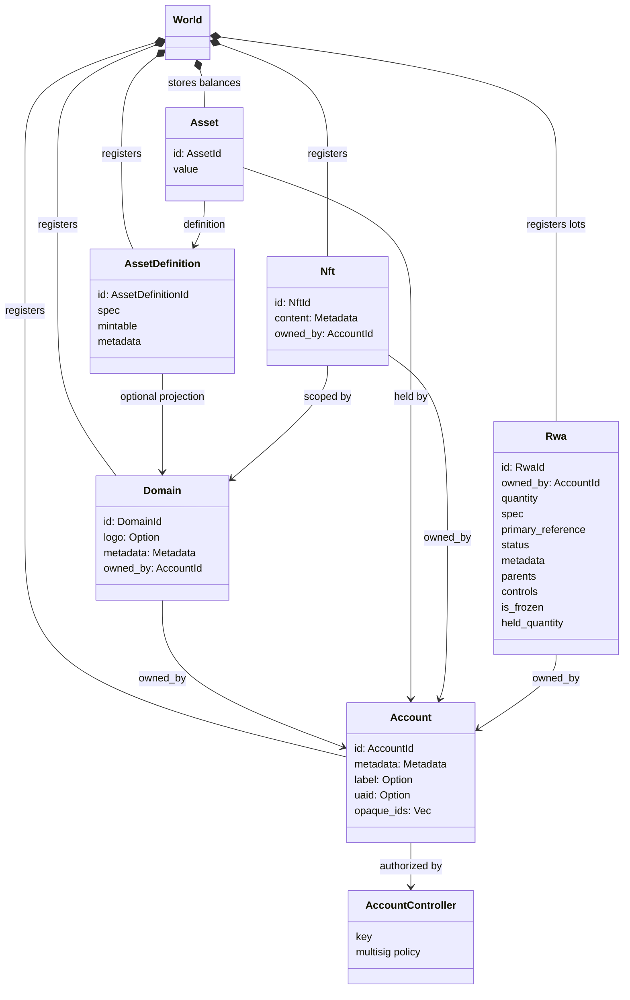
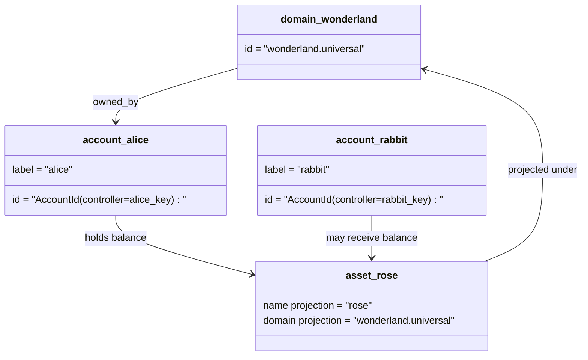

# የውሂብ ሞዴል {#data-model}

Iroha የብሎክቼይን መዝገብ ሁኔታን በ`World` ውስጥ ያከማቻል። የመጀመሪያ የተለቀቀው የውሂብ ሞዴሉ የሚከተሉትን ነጠላ ፕሮቶኮል-መደበኛ ማንነቶችን እና አካላትን ይጠቀማል -

- ጎራዎች ለዳታ ቦታ ብቁ ናቸው፣ ለምሳሌ `payments.universal`
- መለያዎች ነጠላ ፕሮቶኮል-መደበኛ እና ጎራ የሌላቸው ናቸው; የመለያ መታወቂያው የተገኘው ከመለያ ተቆጣጣሪው ነው
- የንብረት ፍቺዎች የጎራ/ስም ትንበያ ሊይዙ ይችላሉ፣ ነገር ግን ነጠላ ፕሮቶኮል-መደበኛ የጽሑፍ አድራሻቸው ግልጽ ያልሆነ Base58 መለያ ነው
- ንብረቶች ለአንድ የተወሰነ የንብረት ፍቺ በሂሳቦች የተያዙ ቀሪ ሂሳቦች ናቸው
- NFTs ለጎራ ብቁ መታወቂያዎች እና ሜታዳታ ይዘት ያላቸው ልዩ መዝገቦች ናቸው
- RWAs ከሰንሰለት ውጪ ያሉ ንብረቶችን አሁን ባለቤት፣ ብዛት፣ አመጣጥ፣ ሜታዳታ፣ መያዣዎች፣ በረዶዎች እና የህይወት ኡደት መቆጣጠሪያዎችን የሚወክሉ የመነጩ መታወቂያ ዕጣዎች ናቸው

## ምሳሌ {#example}

በ Iroha 3 አውታረ መረብ ውስጥ፣ `wonderland.universal` በ`universal` የውሂብ ቦታ ውስጥ ያለ ጎራ ነው። በዚህ ምሳሌ ውስጥ ያሉት ነጠላ ፕሮቶኮል-መደበኛ መለያዎች በቁልፎቻቸው ወይም በፖሊሲዎቻቸው ቁጥጥር ይደረግባቸዋል እና እንደ ጎራ አልባ I105 መለያ መታወቂያዎች ተቀምጠዋል። እንደ `alice@wonderland.universal` ያሉ ሊነበቡ የሚችሉ መለያዎች ከእነዚያ መታወቂያዎች ጋር የተሳሰሩ የተለዩ ተለዋጭ ስሞች ናቸው። የታቀደ የንብረት ፍቺ አሁንም ከጎራ እና ስም ሊገነባ ይችላል እንደ `rose` በ`wonderland.universal`፣ በፕሮቶኮል ስርጭት ውስጥ ጥቅም ላይ የሚውለው ነጠላ ፕሮቶኮል-መደበኛ የንብረት ፍቺ አድራሻ የመነጨ Base58 አድራሻ ነው።

## ተለዋጭ ስሞች {#aliases}

ተለዋጭ ስሞች በነጠላ ፕሮቶኮል-መደበኛ የብሎክቼይን መዝገብ መለያዎች ላይ የተቀመጡ ሰው ሊነበቡ የሚችሉ ስሞች ናቸው። በ API፣ CLI፣ የኪስ ቦርሳ እና አሳሽ መገናኛዎች ላይ ጠቃሚ ናቸው፣ ነገር ግን ነጠላ ፕሮቶኮል-መደበኛ መታወቂያዎች ጥብቅ በሆነው የብሎክቼይን መዝገብ መስኮች ውስጥ የተከማቹ የተረጋጋ መለያዎች ሆነው ይቆያሉ።

|ዒላማ|ነጠላ ፕሮቶኮል-መደበኛ ዒላማ|ተለዋጭ ስም ቃል በቃል|የድጋፍ ሞዴል|
| -------------- | --------------------------------------------------- | ------------------------------------------------------ | ----------------------------------------------------------------------------- |
|የተጠቃሚ መለያ|ጎራ አልባ `AccountId` እንደ I105 አድራሻ የተመሰጠረ|`name@domain.dataspace` ወይም `name@dataspace`|`AccountAlias`; ዋናው ተለዋጭ ስም `Account.label` ነው፣ ተጨማሪ ተለዋጭ ስሞች ማሰሪያዎች ናቸው|
|የንብረት ፍቺ|ነጠላ ፕሮቶኮል-መደበኛ `AssetDefinitionId` Base58 አድራሻ|`name#domain.dataspace` ወይም `name#dataspace`|`AssetDefinitionAlias` ከንብረት ፍቺ ጋር የተያያዘ|
|ውል|ነጠላ ፕሮቶኮል-መደበኛ Bech32m `ContractAddress`|`name::domain.dataspace` ወይም `name::dataspace`|`ContractAlias` ከተሰማራ የኮንትራት አድራሻ ጋር የታሰረ|
|የጎራ ስም|`DomainId` በ `domain.dataspace` ቅጽ|`domain.dataspace`|SNS `domain` የስም ቦታ መዝገብ|
|የ ዳታ ቦታ ስም|ቁጥር `DataSpaceId` ከ ገባሪው Nexus ካታሎግ|እንደ `universal`፣ `paynet`፣ ወይንም `zk` ያሉ የውሂብ ቦታ ተለዋጭ ስያሜዎች|SNS `dataspace` የስም ቦታ መዝገብ እና የነቃ የውሂብ ቦታ ካታሎግ|

የመለያ ተለዋጭ ስሞች ተጠቃሚን የሚመለከቱ የመለያ ስሞች ናቸው። ተለዋጭ ስሙ በአለም-ሁኔታ ኢንዴክሶች እና የመለያ ቁልፍ መዝገቦች በኩል ወደ ንቁ መለያ መታወቂያ ስለሚያመለክት ከመለያ ዳግም ቁልፍ ይተርፋሉ። ለመለያው ዋና መለያ `SetPrimaryAccountAlias`፣ `SetAccountAliasBinding` ለተጨማሪ ዋና ያልሆኑ ተለዋጭ ስሞች፣ እና `FindAccountByAlias` ወይም `FindAliasesByAccountId`ን ለማንበብ ይጠቀሙ። የመለያ ተለዋጭ ስሞች በመደበኛነት በ`AcquireAccountAliasLease` የተገኘ እና በ`RenewAccountAliasLease` የታደሰ ንቁ SNS መለያ-ተለዋጭ የሊዝ ውል ያስፈልጋቸዋል።

የንብረት ተለዋጭ ስሞች የስም የንብረት ፍቺዎች እንጂ የግለሰብ መለያ ቀሪ ሒሳቦች አይደሉም። የንብረት ተለዋጭ ስሞች እና የኮንትራት ተለዋጭ ስሞች ከሚነበብ ስም ወደ ነባር ነጠላ ፕሮቶኮል-መደበኛ ኢላማ ቀጥተኛ ማሰሪያዎች ናቸው። የንብረት ተለዋጭ ስሞች በ `SetAssetDefinitionAlias` ተዘጋጅተዋል; ተለዋጭ ስም ክፍሉ ከንብረት ፍቺ ማሳያ ስም ወይንም ከታቀደው የ ፍቺ ስም ጋር መዛመድ አለበት። የኮንትራት ተለዋጭ ስሞች በ `SetContractAlias` ተዘጋጅተዋል; ተለዋጭ ስም ዳታ ቦታ በኮንትራቱ አድራሻ ውስጥ ከተመሰጠረው የውሂብ ቦታ ጋር መዛመድ አለበት። ሁለቱም ማሰሪያዎች `lease_expiry_ms` ሊሸከሙ ይችላሉ; ጊዜው ካለፈ በኋላ፣ የጸጋ መስኮቱ ሲያልቅ እና ከአለም ሁኔታ ኢንዴክሶች ሲወገዱ መፍታት ያቆማሉ።

ጎራዎች የተለየ `DomainAlias` ነገር የላቸውም። የጎራ መለያ አስቀድሞ እንደ `payments.universal` ያለ የውሂብ ቦታ ብቁ የሆነ ስም ነው። SNS የሊዝ ባለቤትነትን ይከታተላል በ `domain` የስም ቦታ ውስጥ ላሉ የጎራ ስሞች እና በ `dataspace` የስም ቦታ ውስጥ ለዳታ ቦታ ተለዋጭ ስሞች። የተያዘው `universal` የውሂብ ቦታ ተለዋጭ ስም የተገለጸ ሆኖ መቆየት አለበት።

## ተዛማጅ ሰነዶች {#related-docs}

|ርዕስ|የት መሄድ|
| -------------------------------------- | ------------------------------------------- |
|ጎራዎች|[ጎራዎች](/am/blockchain/domains.md)|
|መለያዎች|[መለያዎች](/am/blockchain/accounts.md)|
|ንብረቶች|[ንብረቶች](/am/blockchain/assets.md)|
|NFTs|[NFTs](/am/blockchain/nfts.md)|
|የገሃዱ ዓለም ንብረቶች|[የገሃዱ ዓለም ንብረቶች](/am/blockchain/rwas.md)|
|ሜዳዳታ|[ሜዳዳታ](/am/blockchain/metadata.md)|
|የምዝገባ እና የማስተላለፍ መመሪያዎች|[መመሪያዎች](/am/blockchain/instructions.md)|
|የሶፍትዌር ማስፈጸሚያ አካባቢ ፈቃዶች|[ፈቃዶች](/am/blockchain/permissions.md)|
|ደንቦችን መሰየም|[ደንቦችን መሰየም](/am/reference/naming.md)|
