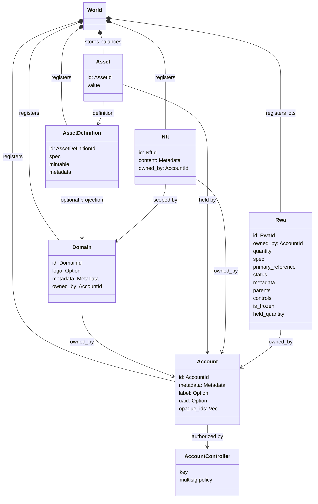
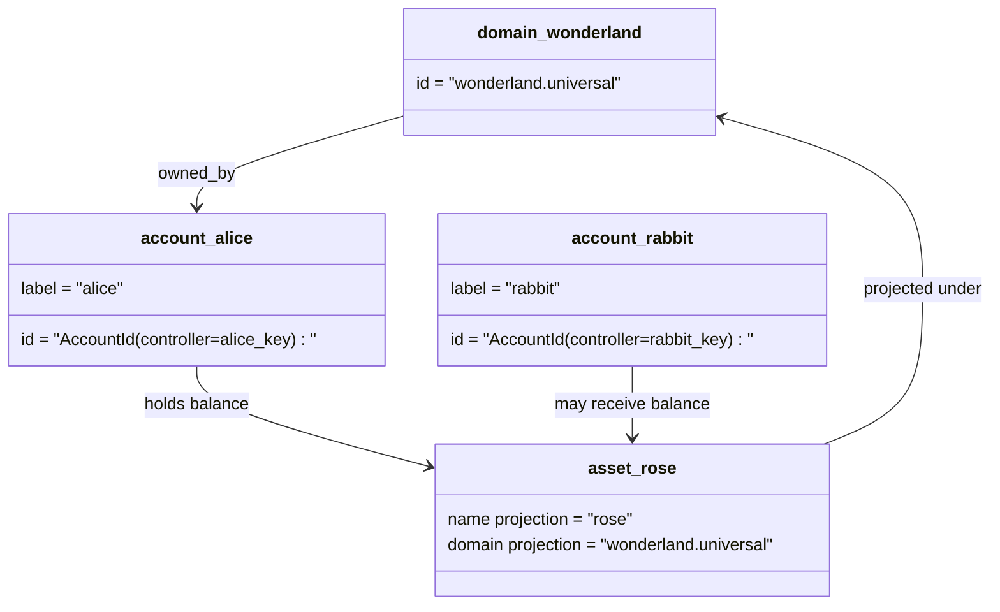

# የመረጃ ሞዴል {#data-model}

Iroha በመንግስት ውስጥ የሚገኙት የመረጃ ቋቶች `World`. የመጀመሪያ ልቀት ያለው የውሂብ ሞዴሉ ይጠቀማል
የሚከተሉትን የካኖኒክ ማንነቶች እና አካላት:

- ጎራዎች ለምሳሌ የመረጃ ቦታ ብቃት ያላቸው ናቸው `payments.universal`
- ሂሳቦች ካኖኒክ እና ጎራ የሌላቸው ናቸው ID ከ
  የሂሳብ ተቆጣጣሪ
- የንብረት ትርጓሜዎች የጎራ / ስም ትንበያ ሊጠብቁ ይችላሉ ፣ ግን የእነሱ መደበኛ
  የጽሑፍ አድራሻ ግልጽ ያልሆነ Base58 መታወቂያ ነው
- ንብረቶች ለተወሰነ የንብረት ማብራሪያ በሂሳብ የተያዙ ቀሪዎች ናቸው
- NFTs ጎራ ብቁ የሆኑ ብቸኛ ባለቤትነት ያላቸው መዝገቦች ናቸው IDs እና ሜታዳታ
  ይዘት
- RWAs የሚመነጩት-ID ከአሁኑ ጋር ከሰንሰለት ውጭ ያሉ ንብረቶችን የሚወክሉ እቃዎች
  ባለቤት፣ ብዛት፣ መነሻ፣ ሜታዳታ፣ መያዣዎች፣ ማቀዝቀዣዎች እና የሕይወት ዑደት
  ቁጥጥር

## ምሳሌ {#example}

በአንድ Iroha 3 አውታረ መረብ፣ `wonderland.universal` በ ውስጥ አንድ ጎራ ነው
`universal` በዚህ ምሳሌ ውስጥ ካኖኒካል መለያዎች ቁጥጥር ናቸው
በቁልፍዎቻቸው ወይም ፖሊሲዎቻቸው እና እንደ ጎራ የሌለው ኮድ I105 ሂሳብ IDs. ሊነበብ የሚችል
መለያዎች `alice@wonderland.universal` ለነዚህ ተያያዥነት ያላቸው የተለያዩ ስሞች ናቸው
IDs. አንድ የታቀደ ንብረት ትርጉም አሁንም ቢሆን ከጎራ እና
ስም እንደ `rose` ውስጥ `wonderland.universal`, የካኖኒክ ንብረት
በሽቦው ላይ ጥቅም ላይ የዋለው የመግለጫ አድራሻ የተፈጠረው Base58 አድራሻ ነው።

## የአባል ስሞች {#aliases}

ቅጽል ስሞች በካኖኒካል መለያዎች ላይ የተሸፈኑ ለሰው ፊት ለፊት የሚጣሉ ስሞች ናቸው።
እነሱ ጠቃሚ ናቸው API, CLI, የኪስ ቦርሳ, እና ተመራማሪዎች ድንበሮች, ነገር ግን ቀኖናዊ
IDs በጥብቅ መቁጠሪያ መስኮች ውስጥ የተከማቹ ቋሚ መታወቂያዎች ሆነው ይቆያሉ።

| ግብ         | ቀኖናዊ ግብ                                    | ፊደላት                                          | የድጋፍ ሞዴል                                                                 |
| -------------- | --------------------------------------------------- | ------------------------------------------------------ | ----------------------------------------------------------------------------- |
| የተጠቃሚ መለያ   | ጎራ የሌለው `AccountId` እንደ አንድ ኮድ I105 አድራሻ   | `name@domain.dataspace` ወይም `name@dataspace`            | `AccountAlias`; ዋና ስያሜው `Account.label`, ተጨማሪ ቅጽል ስሞች ተያያዥነት አላቸው  |
| የንብረት ትርጉም | ቀኖናዊ `AssetDefinitionId` Base58 አድራሻ     | `name#domain.dataspace` ወይም `name#dataspace`            | `AssetDefinitionAlias` በንብረት መገለጫ የተገደበ                           |
| ውል       | የካኖኒክ Bech32m `ContractAddress`                 | `name::domain.dataspace` ወይም `name::dataspace`          | `ContractAlias` ከተሰማራ የውል አድራሻ ጋር የተያያዘ                          |
| የጎራ ስም    | `DomainId` ውስጥ `domain.dataspace` ቅጽ               | `domain.dataspace`                                    | SNS `domain` የስም ቦታ መዝገብ                                                 |
| የመረጃ ቋት ስም | ቁጥር `DataSpaceId` ከዋናው Nexus ካታሎግ | የመረጃ ቦታ ቅጽል ስሞች ለምሳሌ `universal`, `paynet`, ወይም `zk` | SNS `dataspace` የስም ቦታ መዝገብ እና ንቁ የውሂብ ቦታ ካታሎግ            |

የሂሳብ ስያሜዎች የተጠቃሚዎችን የሚመለከቱ የመለያ ስሞች ናቸው
ዳግም መለያ መስጠት ምክንያቱም ስያሜው ወደ አክቲቭ ሂሳብ የሚያመለክት ስለሆነ ID በዓለም-መንግስት በኩል
መረጃ ጠቋሚዎች እና የሂሳብ መዝገቦች። `SetPrimaryAccountAlias` ለ
የሂሳብ ዋና መለያ፣ `SetAccountAliasBinding` ተጨማሪ የመጀመሪያ ደረጃ ያልሆነ
ቅጽል ስሞች፣ እና `FindAccountByAlias` ወይም `FindAliasesByAccountId` ለአንባቢዎች።
የሂሳብ ስያሜዎች በተለምዶ ንቁ SNS የተገኘ የሂሳብ ስምምነት ኪራይ
ጋር `AcquireAccountAliasLease` እና በ `RenewAccountAliasLease`.

የንብረት ስያሜዎች የአክሲዮን ትርፍ መግለጫዎች እንጂ የግለሰብ ሂሳብ ቀሪዎች አይደሉም።
ስያሜዎች እና የውል ስያሜዎችን ከማንበብ የሚችል ስም ወደ አንድ ቀጥተኛ ትስስር ናቸው
የንብረት ስሞች በ `SetAssetDefinitionAlias`;
የስም ስም ክፍሉ ከንብረቱ ትርጉም ማሳያ ስም ጋር ይዛመዳል ወይም
የውል ቅጽል ስሞች በ `SetContractAlias`;
የስም ዳታስፔስ በውል አድራሻው ውስጥ የተመሰጠረውን የውሂብ ቦታ ማዛመድ አለበት.
ሁለቱም ማያዣዎች ሊሸከሙ ይችላሉ `lease_expiry_ms`; ማብቂያ ካለፈ በኋላ መፍታት ያቆማሉ
የጸጋ መስኮቱ ሲያልፍ እና ከዓለም-ሀገር ማውጫዎች ሲሰረዝ።

ጎራዎች ለየት ያለ ቦታ የላቸውም `DomainAlias` አንድ ጎራ መታወቂያ ነው
ቀድሞውኑ እንደ የመረጃ ቦታ ብቁ የሆነ ስም `payments.universal`. SNS ትራኮች
የዶሜን ስሞች በኪራይ ባለቤትነት `domain` የስም ቦታ እና የውሂብ ቦታ
በ `dataspace` የስም ቦታ። `universal` የውሂብ መዳረሻ ስያሜዎች
መወሰን አለበት ።

## ተዛማጅ ሰነዶች {#related-docs}

| ርዕሰ ጉዳይ                                  | የት መሄድ አለብኝ                                 |
| -------------------------------------- | ------------------------------------------- |
| ጎራዎች                                | [ጎራዎች](/am/blockchain/domains.md)           |
| ሂሳቦች                               | [ሂሳቦች](/am/blockchain/accounts.md)         |
| ንብረቶች                                 | [ንብረቶች](/am/blockchain/assets.md)             |
| NFTs                                   | [NFTs](/am/blockchain/nfts.md)                 |
| በእውነተኛ ዓለም ውስጥ ያሉ ንብረቶች                      | [በእውነተኛ ዓለም ውስጥ ያሉ ንብረቶች](/am/blockchain/rwas.md)    |
| ሜታዳታ                               | [ሜታዳታ](/am/blockchain/metadata.md)         |
| የምዝገባና የማስተላለፍ መመሪያ | [መመሪያ](/am/blockchain/instructions.md) |
| የአፈፃፀም ጊዜ ፍቃዶች                    | [ፍቃዶች](/am/blockchain/permissions.md)   |
| የስም አሰጣጥ ደንቦች                           | [የስም አሰጣጥ ደንቦች](/am/reference/naming.md)        |
