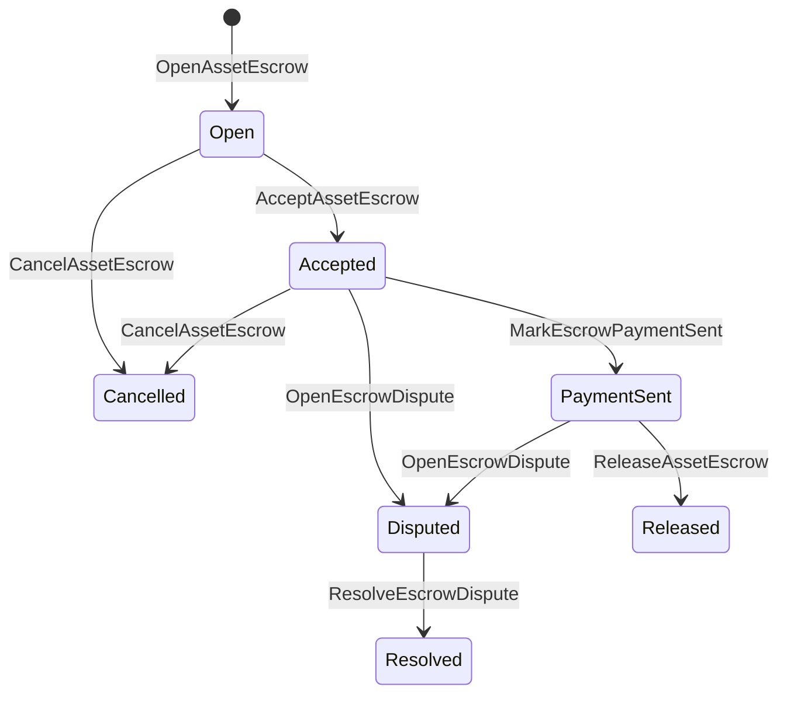

# የአገር ውስጥ ንብረት ማስከበሪያ {#native-asset-escrow}

የአገር ውስጥ ዋስትና በቁጥር ንብረቶች ላይ በመዝገብ የሚተዳደረ የመጠባበቂያ ዘዴ ነው.
አክሲዮኖችን ወደ ማመልከቻው ባለቤትነት የተያዘ አካውንት ከመላክ ይልቅ
ያንን ሂሳብ ለመጠበቅ የማመልከቻ ኮድ ፣ ኤስሮ ISIs እሴት ወደ
የዲተሪሚኒስት ፕሮቶኮል ጥበቃ ሂሳብ እና በኤስሮው የሕይወት ዑደት መዝገብ
የዓለም መንግስት።

የገበያ ቦታን ለማስተካከል የተፈጥሮ ኤስሮውን ይጠቀሙ ፣ የአይታይ ዘይቤ ከሰንሰለት ውጭ ክፍያ
የስራ ፍሰቶች
በሪጀር የሚታየው የሕይወት ዑደት ሁኔታ።

## ጽንሰ ሐሳቦች {#concepts}

| ጽንሰ ሐሳብ | መግለጫ |
| --- | --- |
| `EscrowId` | በተጠቃሚው የተመረጠው መታወቂያ ሃሽን በማሸግ ላይ። ግልጽ እና የማይታወቁ ኤስሮዎች መካከል ልዩ መሆን አለበት. |
| `AssetEscrowRecord` | ግልፅ ቁጥራዊ የንብረት መዝገብ ወይም መቆለፊያ መዝገብ። |
| `AnonymousAssetEscrowRecord` | የተጠበቁ የዋስትና መዝገቦች በከንቱነት, ግዴታዎች እና ማስረጃ ማያዣዎች የተደገፉ ናቸው. |
| የጥበቃ ሂሳብ | ከሰንሰለት የተገኘ የዲተሪሚኒስት ፕሮቶኮል መለያ ID, የዋስትና ማረጋገጫ ID, እና የንብረት ማብራሪያ። |
| የምስክርነት ሃሽ | የሂሳብ መጠየቂያዎች፣ የፍርድ ውሳኔዎች፣ መልዕክቶች፣ የማከማቻ ማኒፌስቶዎች ወይም ሌሎች ከሰንሰለት ውጭ ያሉ ማስረጃዎች። |

ግልፅ መዝገቦች ሻጩን፣ አማራጭ ገዢን፣ የንብረት ማረጋገጫን ይዘዋል፤
ጠቅላላ መጠን፣ የጥበቃ ሂሳብ፣ የህይወት ዑደት ሁኔታ፣ ባህሪ ዓይነት፣ የቀረው
መጠን፣ አማራጭ የመልቀቂያ ስልጣን፣ አማራጭ የጊዜ ማብቂያ ማህተም፣ ማስረጃ
ሃሽስ፣ የጊዜ ማህተሞች እና አማራጭ ጥራት ዝርዝሮች።

የኤስሮው መጠን አዎንታዊ ቁጥራዊ የአክሲዮን ብዛት መሆን አለበት እና
የአክሲዮን ትርጉም የቁጥር ዝርዝር መግለጫ። ኤስሮ ወይም መቆለፊያ ሲሠራ፣
አጠቃላይ የንብረት ዝውውሮች የመጠባበቂያ ሂሳቡን ሊያጠፉ አይችሉም; የመጠባበቂያው መውጫ
መንገዶቹ ዋስትና ናቸው ISIs ከዚህ በታች ተገልጿል።

## የገበያ ቦታ ኤስኮር {#marketplace-escrow}

የገበያ ቦታ ኤስሮ በሰንሰለት ላይ ያለውን ንብረት ከሰንሰለት ውጭ ካለው ጋር በማስተባበር ይለቀቃል
የክፍያ ወይም የመላኪያ የሥራ ፍሰት።



| ISI | ማን ያቀርባል | ተጽእኖ |
| --- | --- | --- |
| `OpenAssetEscrow` | ሻጭ | በፕሮቶኮል ጥበቃ ውስጥ የሻጩን ቁጥርያዊ ንብረት ይዘጋል እና `Open` የገበያ መዝገብ። |
| `AcceptAssetEscrow` | ገዢ | ገዢውን መዝገብ እና እንቅስቃሴዎች `Open` ወደ `Accepted`. ሻጩ የራሱን የዋስትና ተቀባይነት መቀበል አይችልም። |
| `MarkEscrowPaymentSent` | ተቀባይነት ያለው ገዢ | እንቅስቃሴዎች `Accepted` ወደ `PaymentSent` ገዢው ከሰንሰለት ውጭ ክፍያውን ከተላከ በኋላ። |
| `ReleaseAssetEscrow` | ሻጭ | እንቅስቃሴዎች `PaymentSent` ወደ `Released` ሙሉውን የተከፈለበት ገንዘብ ለገዢው ያስተላልፋል። |
| `CancelAssetEscrow` | ሻጭ | እንቅስቃሴዎች `Open` ወይም `Accepted` ወደ `Cancelled` እና ክፍያ ከመታወቁ በፊት ለሻጩ ተመላሽ ያደርጋል። |
| `OpenEscrowDispute` | ሻጭ ወይም ተቀባይነት ያለው ገዢ | እንቅስቃሴዎች `Accepted` ወይም `PaymentSent` ወደ `Disputed` እና ማስረጃ ሃሽስ ይጨምራል. |
| `ResolveEscrowDispute` | ሂሳብ `CanResolveEscrowDispute` | እንቅስቃሴዎች `Disputed` ወደ `Resolved` እና ገዢና ሻጭ መካከል መጠን ይከፋፈላል. |

የክርክር መፍቻ መጠን አሉታዊ መሆን የለበትም ፣ እና
`buyer_amount + seller_amount` የኤስሮው መጠን እኩል መሆን አለበት።
እግሮች ይፈቀዳሉ ፣ ግን መላው ክፍፍል የተቆለፈውን ሚዛን ማካተት አለበት ።

### Rust ምሳሌ {#rust-example}

ይህ ምሳሌ የሻጭ እና ገዢ ሂሳቦች ቀድሞውኑ አሉ, ንብረቱ
ትርጉም በቁጥር ተመዝግቧል እናም ሻጩ በቂ ሚዛን አለው።

```rust
use iroha::{
    client::Client,
    data_model::{
        isi::escrow::{
            AcceptAssetEscrow, MarkEscrowPaymentSent, OpenAssetEscrow,
            ReleaseAssetEscrow,
        },
        prelude::*,
    },
};
use iroha_crypto::Hash;

fn release_marketplace_escrow(
    seller_client: &Client,
    buyer_client: &Client,
    asset_definition_id: AssetDefinitionId,
) -> eyre::Result<()> {
    let escrow_id = EscrowId::new(Hash::new("docs-marketplace-escrow-001"));

    seller_client.submit_blocking(OpenAssetEscrow::with_evidence_hashes(
        escrow_id,
        asset_definition_id,
        Numeric::from(40_u64),
        vec![Hash::new("invoice:2026-001")],
    ))?;

    buyer_client.submit_blocking(AcceptAssetEscrow::new(escrow_id))?;
    buyer_client.submit_blocking(MarkEscrowPaymentSent::new(escrow_id))?;
    seller_client.submit_blocking(ReleaseAssetEscrow::new(escrow_id))?;

    let record = seller_client.query_single(FindAssetEscrowById::new(escrow_id))?;
    assert_eq!(record.status, AssetEscrowStatus::Released);
    assert_eq!(record.remaining_amount, Numeric::zero());

    Ok(())
}
```

## አጠቃላይ የንብረት መቆለፊያዎች {#generic-asset-locks}

የንብረት መቆለፊያዎች ተመሳሳይ የጥበቃ መዝገብ አይነት ይጠቀማሉ ፣ ግን ገዢ-ሻጭ አይደሉም
ለወደፊት ሂሳብ ገንዘብን ያቆማሉ እና አማራጭ
ገንዘብን ለማውጣት የተለዩ የማልቀቂያ ባለሥልጣናት።

| ISI | ማን ያቀርባል | ተጽእኖ |
| --- | --- | --- |
| `OpenAssetLock` | ምንጭ ሂሳብ | አዎንታዊ መጠን ይዘጋል፣ መድረሻውን እንደ መዝገብ ገዢ ያስቀምጣል፣ እና ሁኔታውን ወደ `Locked`. |
| `DrawdownAssetLock` | የመልቀቂያ ባለሥልጣን ወይም የመድረሻ ቦታ ምንም ዓይነት የመልቀቅ ባለሥልጣናት ካልተቀመጡ | የተቀረው የቁጥጥር ክፍል ወይም ሙሉ በሙሉ ወደ መድረሻው ይተላለፋል ። |
| `CancelAssetLock` | መቆለፊያ መክፈቻ | ንቁ መቆለፊያውን ይሰርዛል እና ቀሪውን መጠን ለከፈቱት ተመላሽ ያደርጋል። |
| `ExpireAssetLock` | ማንኛውም የግብይት ባለስልጣን ከጊዜ ገደቡ በኋላ | አንድ መቆለፊያ ጋር ያበቃል `expires_at_ms` ባለፉት ጊዜያት የተከፈለውን ገንዘብ ለፈጣሪው ተመላሽ ያደርጋል። |

`DrawdownAssetLock` መዝገቡን ያስቀምጣል `Locked` የተወሰነ መጠን ሲቀረው።
የቀረው መጠን ዜሮ ሲደርስ ሁኔታው ይሆናል `DrawnDown` እና
መዝገቡ ተዘግቷል።

```rust
use iroha::{
    client::Client,
    data_model::{
        isi::escrow::{CancelAssetLock, DrawdownAssetLock, ExpireAssetLock, OpenAssetLock},
        prelude::*,
    },
};
use iroha_crypto::Hash;

fn drawdown_and_close_asset_locks(
    opener_client: &Client,
    destination_client: &Client,
    release_authority_client: &Client,
    asset_definition_id: AssetDefinitionId,
    destination: AccountId,
    release_authority: AccountId,
) -> eyre::Result<()> {
    let trusted_lock_id = EscrowId::new(Hash::new("docs-asset-lock-trusted"));

    opener_client.submit_blocking(OpenAssetLock::with_options(
        trusted_lock_id,
        asset_definition_id.clone(),
        destination.clone(),
        Numeric::from(40_u64),
        Some(release_authority),
        None,
        vec![Hash::new("milestone-plan-v1")],
    ))?;

    release_authority_client.submit_blocking(DrawdownAssetLock::new(
        trusted_lock_id,
        Numeric::from(15_u64),
    ))?;

    let partially_drawn =
        opener_client.query_single(FindAssetEscrowById::new(trusted_lock_id))?;
    assert_eq!(partially_drawn.status, AssetEscrowStatus::Locked);
    assert_eq!(partially_drawn.remaining_amount, Numeric::from(25_u64));

    opener_client.submit_blocking(CancelAssetLock::new(trusted_lock_id))?;
    let cancelled = opener_client.query_single(FindAssetEscrowById::new(trusted_lock_id))?;
    assert_eq!(cancelled.status, AssetEscrowStatus::Cancelled);

    let expiring_lock_id = EscrowId::new(Hash::new("docs-asset-lock-expiring"));
    opener_client.submit_blocking(OpenAssetLock::with_options(
        expiring_lock_id,
        asset_definition_id,
        destination,
        Numeric::from(10_u64),
        None,
        Some(0),
        Vec::new(),
    ))?;

    destination_client.submit_blocking(ExpireAssetLock::new(expiring_lock_id))?;
    let expired = opener_client.query_single(FindAssetEscrowById::new(expiring_lock_id))?;
    assert_eq!(expired.status, AssetEscrowStatus::Expired);

    Ok(())
}
```

Python በአሁኑ ጊዜ ለጄኔሪክ መቆለፊያዎች ከፍተኛ ደረጃ ያላቸው ረዳቶችን ያጋልጣል-
`open_asset_lock`, `drawdown_asset_lock`, `cancel_asset_lock`, እና
`expire_asset_lock`. ለገበያ ቦታ እና ለስም አልባ ዋስትና ከ Python, አጠቃቀም
ቀኖናዊ `InstructionBox` JSON በ SDK ነው JSON የበረራ መውጫ ማያዣ ወይም ማስገባት
በ SDK ይህም የመጀመሪያ ደረጃ የዋስትና ገንቢዎችን ያጋልጣል።

## አለመግባባት {#disputes}

የገበያ ቦታ ኤስኮር ከ `Accepted` ወይም `PaymentSent`.
ክርክሩን ሊከፍት የሚችለው የተመዘገበው ሻጭ ወይም ገዢ ብቻ ነው።
`CanResolveEscrowDispute`, በቀጥታ ለፈጣሪ ሂሳብ የተሰጠው
ወይም በተወሰነ ሚና የተወረስነው።

```rust
use iroha::{
    client::Client,
    data_model::{
        isi::escrow::{OpenEscrowDispute, ResolveEscrowDispute},
        prelude::*,
    },
};
use iroha_crypto::Hash;
use iroha_executor_data_model::permission::escrow::CanResolveEscrowDispute;

fn resolve_disputed_escrow(
    admin_client: &Client,
    buyer_client: &Client,
    court_client: &Client,
    court: AccountId,
    escrow_id: EscrowId,
) -> eyre::Result<()> {
    admin_client.submit_blocking(Grant::account_permission(
        Permission::from(CanResolveEscrowDispute),
        court,
    ))?;

    buyer_client.submit_blocking(OpenEscrowDispute::with_evidence_hashes(
        escrow_id,
        vec![Hash::new("buyer-payment-receipt")],
    ))?;

    court_client.submit_blocking(ResolveEscrowDispute::with_evidence_hashes(
        escrow_id,
        Numeric::from(30_u64),
        Numeric::from(10_u64),
        vec![Hash::new("court-judgement-001")],
    ))?;

    let record = admin_client.query_single(FindAssetEscrowById::new(escrow_id))?;
    assert_eq!(record.status, AssetEscrowStatus::Resolved);
    assert_eq!(
        record.resolution.as_ref().map(|resolution| resolution.buyer_amount.clone()),
        Some(Numeric::from(30_u64)),
    );

    Ok(())
}
```

## የማይታወቁ ኤስኮር {#anonymous-escrow}

የማይታወቁ ኤስሮ ተመሳሳይ የገበያ የህይወት ዑደት ይጠቀማል, ነገር ግን የገንዘብ እና
የሕዝብ መዝገብ አሁንም ሻጩን ይይዛል፣
ገዢ, ሁኔታ, ማስረጃ ሃሽስ, የጊዜ ማህተሞች, እና ማስረጃ ጋር የተገናኘ እንቅስቃሴ
በመረጃ የተጠበቁ ማስታወሻዎች ውስጥ የሚገኙት መጠን እና ተቀባዮች በ
ግዴታዎች፣ መሰረዝ እና ማስረጃ ማያዣዎች።

| ግልጽነት ISI | ስም አልባ ISI |
| --- | --- |
| `OpenAssetEscrow` | `OpenAnonymousAssetEscrow` |
| `AcceptAssetEscrow` | `AcceptAnonymousAssetEscrow` |
| `MarkEscrowPaymentSent` | `MarkAnonymousEscrowPaymentSent` |
| `ReleaseAssetEscrow` | `ReleaseAnonymousAssetEscrow` |
| `CancelAssetEscrow` | `CancelAnonymousAssetEscrow` |
| `OpenEscrowDispute` | `OpenAnonymousEscrowDispute` |
| `ResolveEscrowDispute` | `ResolveAnonymousEscrowDispute` |

የኪስ ቦርሳ ወይም የፕሮቨር መሳሪያዎች የማረጋገጫ ማያዣውን እና የህዝብ ግብዓቶችን መገንባት አለባቸው ።
የመክፈቻው አንድ ዋስትና ግዴታ ይፈጥራል.
የግጭት መፍትሄ በትክክል አንድ የኤስሮ ግዴታ ማውጣት እና
በድርጊቱ የሚጠየቁ ገዢ፣ ሻጭ ወይም የተከፋፈሉ የውጤት ግዴታዎች።

```rust
use iroha::{
    client::Client,
    data_model::{
        isi::escrow::{
            AcceptAnonymousAssetEscrow, MarkAnonymousEscrowPaymentSent,
            OpenAnonymousAssetEscrow,
        },
        prelude::*,
        proof::ProofAttachment,
    },
};
use iroha_crypto::Hash;

fn open_anonymous_escrow(
    seller_client: &Client,
    buyer_client: &Client,
    escrow_id: EscrowId,
    asset_definition_id: AssetDefinitionId,
    funding_nullifiers: Vec<[u8; 32]>,
    escrow_commitment: [u8; 32],
    proof: ProofAttachment,
    root_hint: Option<[u8; 32]>,
) -> eyre::Result<()> {
    seller_client.submit_blocking(OpenAnonymousAssetEscrow::with_evidence_hashes(
        escrow_id,
        asset_definition_id,
        funding_nullifiers,
        escrow_commitment,
        proof,
        root_hint,
        vec![Hash::new("shielded-invoice")],
    ))?;

    buyer_client.submit_blocking(AcceptAnonymousAssetEscrow::new(escrow_id))?;
    buyer_client.submit_blocking(MarkAnonymousEscrowPaymentSent::new(escrow_id))?;

    Ok(())
}
```

ስለ ዋናው የተከበበ የግብይት ሞዴል ተመልከት
[ስም አልባ ግብይቶች](/am/blockchain/anonymous-transactions.md).

## SDK አጠቃቀም {#sdk-usage}

የኤስክሮው ድጋፍ በሀገር ውስጥ በተለያየ መንገድ ተለይቷል SDKs. Rust የካኖኒክ
የተጻፈ የውሂብ ሞዴል. Python በአሁኑ ጊዜ የጋራ ንብረቶች መቆለፊያ ረዳቶችን ያጋልጣል ።
JavaScript እና TypeScript አጠቃቀም Kotodama አስተናጋጅ ጥሪዎችን ያረጋግጡ. Kotlin/JVM እና Swift
ለገበያ ቦታ እና ስም አልባ ኤስሮው የሚሆን የቴፕ የተሰራ ጥቅማጥቅሞች አምራቾች ያቅርቡ.

| SDK | ይህንን ገጽ ይጠቀሙ | የሥራ መስክ |
| --- | --- | --- |
| [Rust](#rust-sdk) | `iroha::data_model::isi::escrow` | የገበያ ቦታ ማስከበሪያ፣ አጠቃላይ መቆለፊያዎች፣ የማይታወቁ ማስከበሪያዎች፣ መጠይቆች እና ክስተቶች። |
| [Python](#python-asset-locks) | `Instruction.open_asset_lock`, `TransactionDraft.open_asset_lock`, እና ደንበኛ `*_and_wait` ረዳቶች | የገበያ ቦታ እና ስም አልባ የዋስትና ረዳቶች የመጀመሪያ ደረጃ አይደሉም Python ዘዴዎች ገና. |
| [JavaScript / TypeScript](#javascript-and-typescript-kotodama) | `compileKotodamaProgram` ከ `@iroha/iroha-js/kotodama-compiler` | የኤስኮር አስተናጋጅ ውስጡን ይደውላል Kotodama ኮንትራት። |
| [Kotlin / JVM](#kotlin-and-jvm) | `InstructionTemplate` ውስጥ ክፍሎች `org.hyperledger.iroha.sdk.core.model.instructions` | የገበያ ቦታ እና የማይታወቁ የኤስሮው ብጁ መመሪያ አብነቶች። |
| [Swift / iOS](#swift-and-ios) | `NativeEscrowInstructionBuilders` እና `IrohaSDK.build*Escrow*` ረዳቶች | የገበያ ቦታና ስም አልባ የዋስትና ማረጋገጫ Norito JSON የትምህርት ጥቅማጥቅሞች። |

ከዚህ በታች ያሉት ምሳሌዎች የትምህርት ግንባታ ላይ ያተኩራሉ።
ፊርማ አስተዳደር, እና ግብይት ማቅረቢያ ለ መደበኛ ፍሰት ይከተላል
እያንዳንዱ SDK.

### Rust SDK {#rust-sdk}

ይጠቀሙ Rust SDK የተሟላ የአገር ውስጥ ሽፋን ወይም የጥያቄ / ክስተት ድጋፍ ሲያስፈልግዎት ።
ከላይ የተጠቀሱት ምሳሌዎች የገበያ ክፍተትን፣ አጠቃላይ መቆለፊያዎችን፣ አለመግባባቶችን ያሳያሉ።
የሽያጭ ማረጋገጫ, እና ስም አልባ ኤስኮር ግንባታ
`iroha::data_model::isi::escrow`.

```rust
use iroha::{
    client::Client,
    data_model::{isi::escrow::OpenAssetEscrow, prelude::*},
};
use iroha_crypto::Hash;

fn open_and_read(
    client: &Client,
    asset_definition_id: AssetDefinitionId,
) -> eyre::Result<AssetEscrowRecord> {
    let escrow_id = EscrowId::new(Hash::new("docs-rust-sdk-escrow"));

    client.submit_blocking(OpenAssetEscrow::new(
        escrow_id,
        asset_definition_id,
        Numeric::from(10_u64),
    ))?;

    client.query_single(FindAssetEscrowById::new(escrow_id))
}
```

### Python የሀብት መቆለፊያዎች {#python-asset-locks}

የ Python SDK የጀነሪክ አክሲዮን መቆለፊያዎችን ለማግኘት የመጀመሪያ ደረጃ ረዳቶችን ያጋልጣል።
ለዝግጅት ክፍያዎች፣ በፈቃደኝነት ባለሥልጣን የተደረጉ ገንዘብ ማውጣት
መክፈቻ እና የማረፊያ ጊዜ ተመላሽ ገንዘብ።

```python
client.open_asset_lock_and_wait(
    chain_id="dev-chain",
    authority="<source-account-id>",
    private_key_hex="<source-private-key-hex>",
    escrow_id="merchant-lock-001",
    asset_definition_id="<asset-definition-base58>",
    destination="<destination-account-id>",
    amount="2500",
    release_authority="<trusted-release-account-id>",
    expires_at_ms=1_704_000_000_000,
)

client.drawdown_asset_lock_and_wait(
    chain_id="dev-chain",
    authority="<trusted-release-account-id>",
    private_key_hex="<trusted-release-private-key-hex>",
    escrow_id="merchant-lock-001",
    amount="1000",
)

client.expire_asset_lock_and_wait(
    chain_id="dev-chain",
    authority="<any-account-id>",
    private_key_hex="<any-private-key-hex>",
    escrow_id="merchant-lock-001",
)
```

ለሁለት ወገኖች መቆለፊያ, ማስወገድ `release_authority`; የመድረሻ ሂሳቡ
ከዚያም ያቅርቡ `drawdown_asset_lock`.

### JavaScript እና TypeScript Kotodama {#javascript-and-typescript-kotodama}

የ JavaScript SDK በአሁኑ ጊዜ ቀጥተኛ ተወላጅ ኤስሮው ግብይትን አያጋልጥም
ግንበኞች JavaScript ወይም TypeScript የሚተገበሩ መተግበሪያዎች Kotodama
ኮንትራቶች, የኤስሮው አስተናጋጅ ጥሪዎች Kotodama አዘጋጅ።

የተፈጥሮ የኤስሮው አስተናጋጅ ጥሪዎች ግልጽ መዳረሻ ጥቆማዎችን ይፈልጋሉ ምክንያቱም አዘጋጁ
ለኦፓካር ኤስሮው ጠባብ መዳረሻ ስብስቦችን ማመንጨት አይችሉም ISIs. በ ላይ አሻንጉሊቶች ይጠቀሙ
ጥሪ የሚያቀርቡት ወደ ውጭ የሚላኩ መግቢያ ቦታዎች `escrow_*` የተገነቡት.

```js
import { compileKotodamaProgram } from "@iroha/iroha-js/kotodama-compiler";

const source = `
seiyaku MarketplaceEscrow {
  meta { abi_version: 1; }

  #[access(read="*", write="*")]
  kotoage fn run() permission(Admin) {
    let asset = asset_definition("62Fk4FPcMuLvW5QjDGNF2a4jAmjM");
    let offer = name("aitai_offer");
    let evidence = norito_bytes("00");

    call escrow_open_offer(offer, asset, 10, evidence);
    call escrow_accept(offer);
    call escrow_mark_payment_sent(offer);
    call escrow_release(offer);
  }
}
`;

const compiled = compileKotodamaProgram(source, {
  sourceName: "escrow.ko",
});

if (compiled.diagnostics.length > 0) {
  throw new Error(compiled.diagnostics.map((item) => item.message).join("\n"));
}
```

ለክርክር አጠቃቀም `escrow_open_dispute(offer, evidence)` እና
`escrow_resolve_dispute(offer, buyer_amount, seller_amount, evidence)`.
የማይታወቁ ኤስሮው አስተናጋጅ ጥሪዎችን ይቀበላሉ Norito ለምሳሌ የፍጆታ ጭነት ባይቶችን ይጠይቁ
`anonymous_escrow_open_offer(request)`.

### Kotlin እና JVM {#kotlin-and-jvm}

የ Kotlin/JVM SDK የተፈጥሮ ማስከበሪያ እንደ ብጁ መመሪያ አብነቶች ሞዴሎች.
አብነት የሚፈለገውን መስክ ያረጋግጣል እንዲሁም የተጠቀመውን የካኖኒካል የአርግመንት ካርታ ያሳያል
በግብይት ገንቢው.

```kotlin
import org.hyperledger.iroha.sdk.core.model.escrow.NativeEscrowPermissions
import org.hyperledger.iroha.sdk.core.model.instructions.AcceptAssetEscrowInstruction
import org.hyperledger.iroha.sdk.core.model.instructions.MarkEscrowPaymentSentInstruction
import org.hyperledger.iroha.sdk.core.model.instructions.OpenAssetEscrowInstruction
import org.hyperledger.iroha.sdk.core.model.instructions.ReleaseAssetEscrowInstruction
import org.hyperledger.iroha.sdk.core.model.instructions.ResolveEscrowDisputeInstruction

val open = OpenAssetEscrowInstruction(
    escrowId = "escrow-hash",
    assetDefinition = "xor#wonderland",
    amount = "42.5",
    evidenceHashes = listOf("invoice-hash"),
)
val accept = AcceptAssetEscrowInstruction("escrow-hash")
val paid = MarkEscrowPaymentSentInstruction("escrow-hash")
val release = ReleaseAssetEscrowInstruction("escrow-hash")
val resolve = ResolveEscrowDisputeInstruction(
    escrowId = "escrow-hash",
    buyerAmount = "30",
    sellerAmount = "12.5",
    evidenceHashes = listOf("judgement-hash"),
)

println(open.arguments)
println(NativeEscrowPermissions.CAN_RESOLVE_ESCROW_DISPUTE)
```

ስም አልባ አብነቶች እንደ
`OpenAnonymousAssetEscrowInstruction`, `AcceptAnonymousAssetEscrowInstruction`,
`MarkAnonymousEscrowPaymentSentInstruction`,
`ReleaseAnonymousAssetEscrowInstruction`,
`CancelAnonymousAssetEscrowInstruction`,
`OpenAnonymousEscrowDisputeInstruction`, እና
`ResolveAnonymousEscrowDisputeInstruction`. Android የጃቫ ጥሪዎችን መጠቀም ይችላሉ
ማመሳሰል `NativeEscrowInstructions.*` የግንባታ ሠራተኞች Android የጥንት ዕቃ።

### Swift እና iOS {#swift-and-ios}

የ Swift SDK የኤስኮር መመሪያዎችን እንደ Norito JSON አጠቃቀም
`NativeEscrowInstructionBuilders` በቀጥታ ወይም ተመጣጣኝ ጥሪ
`IrohaSDK.build*Escrow*` የእርስዎ መተግበሪያ ቀድሞውኑ አንድ ይዞ ጊዜ ረዳት `IrohaSDK`
ለምሳሌ.

```swift
import IrohaSwift

let open = try NativeEscrowInstructionBuilders.openAssetEscrow(
    escrowId: "escrow-hash",
    assetDefinition: "xor#wonderland",
    amount: "42.5",
    evidenceHashes: ["invoice-hash"]
)
let accept = try NativeEscrowInstructionBuilders.acceptAssetEscrow(
    escrowId: "escrow-hash"
)
let paid = try NativeEscrowInstructionBuilders.markEscrowPaymentSent(
    escrowId: "escrow-hash"
)
let release = try NativeEscrowInstructionBuilders.releaseAssetEscrow(
    escrowId: "escrow-hash"
)
let resolve = try NativeEscrowInstructionBuilders.resolveEscrowDispute(
    escrowId: "escrow-hash",
    buyerAmount: "30",
    sellerAmount: "12.5",
    evidenceHashes: ["judgement-hash"]
)
```

ስም አልባ Swift ገንቢዎች የሽርሽር ዝርዝሮችን ፣ የውጤት ግዴታ ዝርዝሮችን፣ ማረጋገጫ ይወስዳሉ
መዝገበ ቃላት እና አማራጭ `rootHint` የክርክር መፍቻ ፈቃድ
ቶከን እንደ `NativeEscrowPermissions.canResolveEscrowDispute`.

## ጥያቄዎችና ክስተቶች {#queries-and-events}

የደረጃ ገጾችን፣ የማስተካከያ ስራዎችን እና የመደገፍ መሳሪያዎችን ለማግኘት የኤስሮው ጥያቄዎችን ይጠቀሙ:

| ጥያቄ | ዓላማ |
| --- | --- |
| `FindAssetEscrowById` | አንድ ግልፅ ማስከበሪያ አንብብ ወይም መዝጋት `EscrowId`. |
| `FindAssetEscrows` | ግልፅ የሆነ የዋስትና እና የመቆለፊያ መዝገቦችን ይዘርዝሩ። |
| `FindAssetEscrowsBySeller` | አንድ ሻጭ ወይም መቆለፊያ መክፈቻ በከፈተ መዝገብ ዝርዝር. |
| `FindAssetEscrowsByBuyer` | የገበያ ቦታ ገዢው የተቀበለውን ዋስትና ወይም መድረሻን ያነጣጠረ መዝጊያ ይዘርዝሩ። |
| `FindAssetEscrowsByStatus` | መዝገቦችን በዝርዝር ይመዝገቡ `AssetEscrowStatus`. |
| `FindAnonymousAssetEscrowById` | አንድ ማንነት የሌለው ተቀማጭ ገንዘብን አንብብ `EscrowId`. |
| `FindAnonymousAssetEscrows*` | ስም አልባ የሆኑትን የዋስትና ባለቤቶች በመላው መዝገብ፣ በሻጩ፣ በአገልጋዩ ወይም በሁኔታው ይዘርዝሩ። |

`EscrowEventFilter` ለግልፅ ተወላጅ የዋስትና እና መቆለፊያ መመዝገብ ይችላሉ
በኤስሮው የተከናወኑ ክስተቶች ID, ሻጭ፣ ገዢ፣ ሁኔታ እና ክስተት ማስክ።
ቤተሰብ ያካትታል `Opened`, `Accepted`, `PaymentSent`, `Released`,
`Cancelled`, `Expired`, `Disputed`, እና `Resolved`. የማይታወቁ አደራዎች
መዝገቦቹ በስም አልባ በሆነ የኤስሮው መጠይቆች አማካኝነት ይመረመራሉ።

## የአሠራር ማስታወሻዎች {#operational-notes}

- ትልቅ ደረሰኞችን፣ የውይይት መዝገቦችን፣ የፍርድ ውሳኔዎችን ወይም የኦዲት ጥቅሎችን ከአውቶቡስ ውጭ ያስቀምጡ
  የኤስኮር መዝገብ እና እንደ ማስረጃ ያላቸውን ሃሽስ ያያይዙ.
- የተረጋጋ አጠቃቀም `EscrowId` በማመልከቻዎች ውስጥ ውርደት ስለዚህ ዳግም ሙከራዎች መፍጠር አይችሉም
  ተመሳሳይ ቅናሽ ለማግኘት ሁለት እጥፍ ዋስትናዎች።
- ግራንት `CanResolveEscrowDispute` ብቻ ወደ ሂሳቦች ወይም ሚናዎች የሚንቀሳቀሱ
  የክርክር ሂደት።
- ከሰንሰለት ውጭ የክፍያ ማረጋገጫ እንደ ማመልከቻ ፖሊሲ ይያዙ። Iroha መዝገቦች
  የእንክብካቤ እና የህይወት ዑደት ሽግግሮች; የፊያት ወይም የውጭ ማረጋገጫ አይሰጥም
  የክፍያ መስመሮች በራሳቸው.
