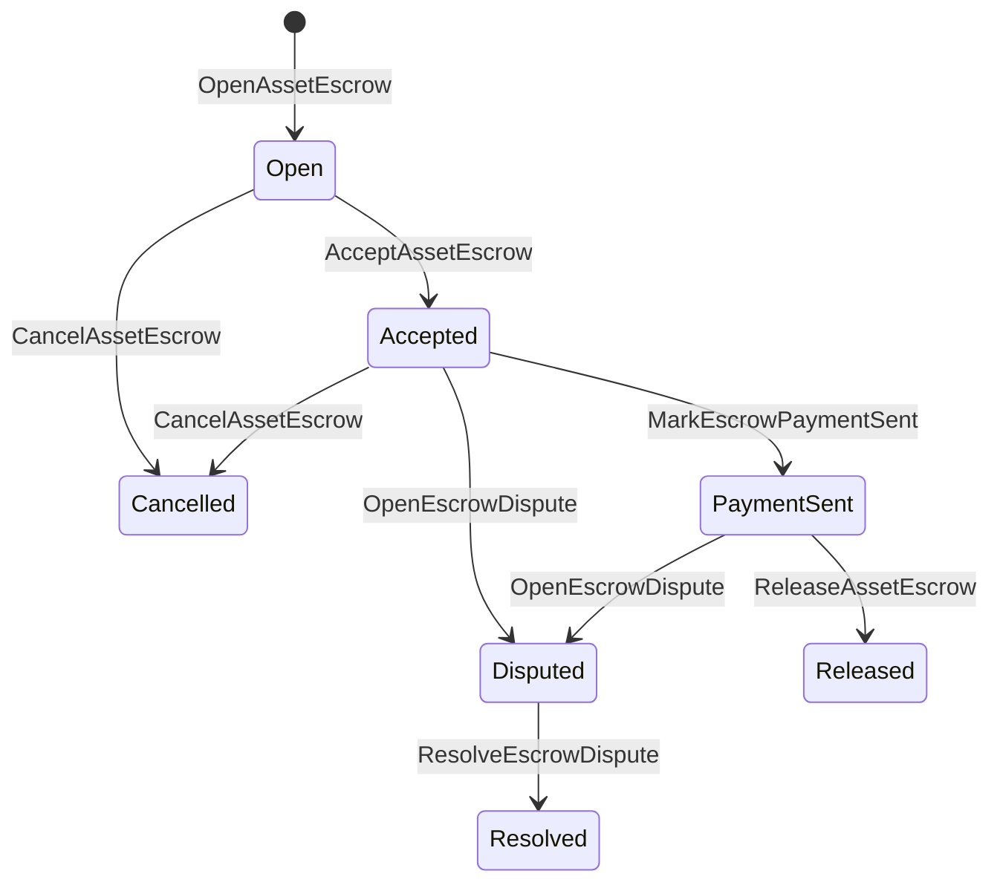

# የአገር ውስጥ ንብረት ማስከበሪያ {#native-asset-escrow}

Native escrow ለቁጥር ንብረቶች በመዝገብ የሚተዳደር የማከማቻ ዘዴ ነው። ንብረቶችን ወደ ትግበራ ባለቤትነት ባለው ሂሳብ ከመላክ ይልቅ እና ያንን ሂሳብ ለመጠበቅ በአፕሊኬሽን ኮድ ላይ በመተማመን ፣ ኤስሮው ISIs ዋጋውን ወደ ተወሰነ ፕሮቶኮል ጥበቃ ሂሳብ ያስተላልፋል እና የኤስሮው የሕይወት ዑደት በዓለም ሁኔታ ውስጥ ይመዝግባል።

ለገበያ ቦታ የማስተካከያ ፣ የአይታይ ዘይቤ ከሰንሰለት ውጭ የክፍያ ማስተባበሪያ ፣ የእግረኞች ቁልፎች እና በሊጅ ውስጥ የሚታዩ የሕይወት ዑደት ሁኔታዎችን የሚጠይቁ የተጠበቁ የኤስኮሮ ሥራ ፍሰቶችን ለመጠቀም ።

## ጽንሰ ሐሳቦች {#concepts}

|ጽንሰ ሐሳብ|መግለጫ |
| --- | --- |
|`EscrowId` |በተጠቃሚው የተመረጠው መታወቂያ ሃሽን በማሸግ ላይ። ግልጽ እና የማይታወቁ ኤስሮዎች መካከል ልዩ መሆን አለበት ። |
|`AssetEscrowRecord` |ግልፅ የቁጥር ንብረቶች ማስከበሪያ ወይም መቆለፊያ መዝገብ።|
|`AnonymousAssetEscrowRecord` |በከንቱነት, ግዴታዎች, እና ማስረጃ ማያዣዎች የተደገፈ የተጠበቀ የሂሳብ መዝገብ. |
|የጥበቃ ሂሳብ |ከሰንሰለት ID ፣ ኤስሮው ID እና የንብረት ትርጉም የተወሰደ የፍቺ ፕሮቶኮል ሂሳብ። |
|ማስረጃዎች |የምስክር ወረቀቶች ሂሳቦችን ፣ ፍርዶችን ፣ መልዕክቶችን ፣ የማከማቻ ማኒፌሶችን ወይም ሌሎች ከሰንሰለት ውጭ ያሉ ማስረጃዎችን መለየት ይችላሉ ። የመረጃ ጭነት ራሱ በኤስሮው መዝገብ ውስጥ አይቀመጥም። |

ግልፅ መዝገቦች ሻጩን ፣ አማራጭ ገዢን ፣ የንብረትን ትርጉም ፣ ጠቅላላ መጠን ፣ የጥበቃ ሂሳብ ፣ የሕይወት ዑደት ሁኔታ ፣ ባህሪ ዓይነት ፣ የቀረው መጠን ፣ አማራጭ የመልቀቂያ ስልጣን ፣ አማራጭ የማጠናቀቂያ ጊዜ ማህተም ፣ የምስክር ወረቀት ሃሽዎች ፣ የጊዜ ማህተሞች እና አማራጭ የውሳኔ ሃሳብ ዝርዝሮችን ይይዛሉ።

የኤስሮው መጠኖች አዎንታዊ ቁጥራዊ የንብረት መጠን መሆን አለባቸው እና በንብረት ትርጓሜ ውስጥ ከቁጥር ዝርዝሩ ጋር ይጣጣማሉ። ኤስሮው ወይም መቆለፊያ በሚሠራበት ጊዜ አጠቃላይ የንብረት ዝውውሮች የመጠባበቂያ ሂሳቡን ሊያጠፉ አይችሉም; የመጠባበቂያው መውጫ መንገዶች ከዚህ በታች የተገለጹት ኤስሮ ISIs ናቸው ።

## የገበያ ቦታ ኤስኮር {#marketplace-escrow}

የገበያ ቦታ ኤስሮ በሰንሰለት ላይ ያለውን ንብረት መለቀቅ ከሰንሰለት ውጭ ካለው የክፍያ ወይም የመላኪያ ሥራ ፍሰት ጋር ያስተባብራል ።



|ISI |ማን ያቀረበው ?|ውጤቱ|
| --- | --- | --- |
|`OpenAssetEscrow` |ሻጭ |የሽያጩን ቁጥራዊ ንብረት በፕሮቶኮል ጥበቃ ውስጥ ይዘጋል እናም `Open` የገበያ መዝገብ ይፈጥራል ። |
|`AcceptAssetEscrow` |ገዢ |ገዢውን በመመዝገብ `Open` ወደ `Accepted` ይዛ ይሄዳል፤ ሻጩ የራሱን ዋስትና መቀበል አይችልም። |
|`MarkEscrowPaymentSent` |ተቀባይነት ያለው ገዢ |`Accepted` ወደ `PaymentSent` የሚዛወረው ገዢው ከሰንሰለት ውጭ ክፍያ ከተላከ በኋላ ነው። |
|`ReleaseAssetEscrow` |ሻጭ |`PaymentSent` ወደ `Released` የሚዛወር ሲሆን ሙሉውን የተከፈለ ገንዘብ ለገዢው ያስተላልፋል። |
|`CancelAssetEscrow` |ሻጭ |`Open` ወይም `Accepted` ወደ `Cancelled` ይዛወራል እና ክፍያ ከመታወቁ በፊት ለሻጩ ተመላሽ ያደርጋል። |
|`OpenEscrowDispute` |ሻጭ ወይም ተቀባይነት ያለው ገዢ |`Accepted` ወይም `PaymentSent` ወደ `Disputed` ይዛወራል እና የምስክርነት ሃሽዎችን ያክላል ። |
|`ResolveEscrowDispute` |ከ `CanResolveEscrowDispute` ጋር ያለው ሂሳብ|`Disputed` ወደ `Resolved` ይንቀሳቀሳል እናም በገዢ እና በሽያጭ መካከል የሚከፈልበትን መጠን ይከፍላል ። |

የክርክር መፍቻ መጠኖች አሉታዊ ያልሆኑ መሆን አለባቸው ፣ እና `buyer_amount + seller_amount` የመጠባበቂያ መጠን ጋር እኩል መሆን አለበት ። ዜሮ ዋጋ ያላቸው እግሮች ይፈቀዳሉ ፣ ግን መላው ክፍፍል የተቆለፈውን ቀሪ ሂሳብ ማካተት አለበት።

### Rust ምሳሌ {#rust-example}

ይህ ምሳሌ የሽያጭ እና የገዢ ሂሳቦች ቀድሞውኑ መኖራቸውን ፣ የአክሲዮን ትርጉሙ በቁጥር ተመዝግቧል ፣ እናም ሻጩ በቂ ሚዛን አለው የሚል ግምት ይሰጣል ።

```rust
use iroha::{
    client::Client,
    data_model::{
        isi::escrow::{
            AcceptAssetEscrow, MarkEscrowPaymentSent, OpenAssetEscrow,
            ReleaseAssetEscrow,
        },
        prelude::*,
    },
};
use iroha_crypto::Hash;

fn release_marketplace_escrow(
    seller_client: &Client,
    buyer_client: &Client,
    asset_definition_id: AssetDefinitionId,
) -> eyre::Result<()> {
    let escrow_id = EscrowId::new(Hash::new("docs-marketplace-escrow-001"));

    seller_client.submit_blocking(OpenAssetEscrow::with_evidence_hashes(
        escrow_id,
        asset_definition_id,
        Numeric::from(40_u64),
        vec![Hash::new("invoice:2026-001")],
    ))?;

    buyer_client.submit_blocking(AcceptAssetEscrow::new(escrow_id))?;
    buyer_client.submit_blocking(MarkEscrowPaymentSent::new(escrow_id))?;
    seller_client.submit_blocking(ReleaseAssetEscrow::new(escrow_id))?;

    let record = seller_client.query_single(FindAssetEscrowById::new(escrow_id))?;
    assert_eq!(record.status, AssetEscrowStatus::Released);
    assert_eq!(record.remaining_amount, Numeric::zero());

    Ok(())
}
```

## አጠቃላይ ሀብት መቆለፊያዎች {#generic-asset-locks}

የንብረት መቆለፊያዎች ተመሳሳይ የጥበቃ መዝገብ ዓይነት ይጠቀማሉ ፣ ግን እነሱ ገዢ-ሸማች ቅናሾች አይደሉም ። ለወደፊት ሂሳብ ገንዘብን ያቆልፋሉ እና አማራጭም ገንዘብ ለመውሰድ የተለየ የመልቀቂያ ባለስልጣን ይጠይቃል።

|ISI |ማን ያቀረበው ?|ውጤቱ|
| --- | --- | --- |
|`OpenAssetLock` |ምንጭ መለያ |አዎንታዊ መጠን ይዘጋል ፣ መድረሻውን እንደ መዝገብ ገዢ ይመዘግባል ፣ እና ሁኔታውን ወደ `Locked` ያዘጋጃል።|
|`DrawdownAssetLock` |የመልቀቂያ ባለሥልጣን ወይም የመድረሻ ቦታ ምንም ዓይነት የመልቀቅ ባለስልጣን ካልተቀመጠ |ቀሪውን ጥበቃ ሙሉ በሙሉ ወይም በከፊል ወደ መድረሻው ያስተላልፋል።|
|`CancelAssetLock` |መቆለፊያ መክፈቻ |ንቁ መቆለፊያ ይሰርዛል እና ቀሪውን መጠን ለከፈቱት ይመልሳል ። |
|`ExpireAssetLock` |ማንኛውም የግብይት ባለስልጣን ከጊዜ ገደቡ በኋላ |ያለፈውን `expires_at_ms` መዝጊያ ያበቃል እና ቀሪውን መጠን ለከፊተኛው ተመላሽ ያደርጋል። |

`DrawdownAssetLock` መዝገቡን በ `Locked` ውስጥ ይይዛል ፣ የተወሰነ መጠን ይቀራል ። የቀረው መጠን ዜሮ ሲደርስ ፣ ሁኔታው `DrawnDown` ይሆናል እናም መዝገብ ይዘጋል።

```rust
use iroha::{
    client::Client,
    data_model::{
        isi::escrow::{CancelAssetLock, DrawdownAssetLock, ExpireAssetLock, OpenAssetLock},
        prelude::*,
    },
};
use iroha_crypto::Hash;

fn drawdown_and_close_asset_locks(
    opener_client: &Client,
    destination_client: &Client,
    release_authority_client: &Client,
    asset_definition_id: AssetDefinitionId,
    destination: AccountId,
    release_authority: AccountId,
) -> eyre::Result<()> {
    let trusted_lock_id = EscrowId::new(Hash::new("docs-asset-lock-trusted"));

    opener_client.submit_blocking(OpenAssetLock::with_options(
        trusted_lock_id,
        asset_definition_id.clone(),
        destination.clone(),
        Numeric::from(40_u64),
        Some(release_authority),
        None,
        vec![Hash::new("milestone-plan-v1")],
    ))?;

    release_authority_client.submit_blocking(DrawdownAssetLock::new(
        trusted_lock_id,
        Numeric::from(15_u64),
    ))?;

    let partially_drawn =
        opener_client.query_single(FindAssetEscrowById::new(trusted_lock_id))?;
    assert_eq!(partially_drawn.status, AssetEscrowStatus::Locked);
    assert_eq!(partially_drawn.remaining_amount, Numeric::from(25_u64));

    opener_client.submit_blocking(CancelAssetLock::new(trusted_lock_id))?;
    let cancelled = opener_client.query_single(FindAssetEscrowById::new(trusted_lock_id))?;
    assert_eq!(cancelled.status, AssetEscrowStatus::Cancelled);

    let expiring_lock_id = EscrowId::new(Hash::new("docs-asset-lock-expiring"));
    opener_client.submit_blocking(OpenAssetLock::with_options(
        expiring_lock_id,
        asset_definition_id,
        destination,
        Numeric::from(10_u64),
        None,
        Some(0),
        Vec::new(),
    ))?;

    destination_client.submit_blocking(ExpireAssetLock::new(expiring_lock_id))?;
    let expired = opener_client.query_single(FindAssetEscrowById::new(expiring_lock_id))?;
    assert_eq!(expired.status, AssetEscrowStatus::Expired);

    Ok(())
}
```

Python በአሁኑ ጊዜ ለጄኔሪክ መቆለፊያዎች ከፍተኛ ደረጃ ያላቸው ረዳቶችን ያጋልጣል- `open_asset_lock`, `drawdown_asset_lock`, `cancel_asset_lock`, እና `expire_asset_lock`. ለገበያ ቦታ እና ለስም አልባ ዋስትና ከ Python, አጠቃቀም ካኖኒካል `InstructionBox` JSON በ SDK እሱ ነው JSON ማምለጫ በር, ወይም አንድ በኩል ማስገባት SDK ይህም የመጀመሪያ ደረጃ የዋስትና ገንቢዎችን ያጋልጣል.

## አለመግባባት {#disputes}

የገበያ ቦታ ዋስትና `Accepted` ወይም `PaymentSent` ላይ ክርክር ማስገባት ይችላል ። ክርክሩን መክፈት የሚችለው የተመዘገበ ሻጭ ወይም ገዢ ብቻ ነው። መፍትሄው በቀጥታ ወደ ተሟጋች ሂሳብ የተሰጠው ወይም በተወሳሰበ ሚና በኩል የተወረሰው `CanResolveEscrowDispute` ይጠይቃል ።

```rust
use iroha::{
    client::Client,
    data_model::{
        isi::escrow::{OpenEscrowDispute, ResolveEscrowDispute},
        prelude::*,
    },
};
use iroha_crypto::Hash;
use iroha_executor_data_model::permission::escrow::CanResolveEscrowDispute;

fn resolve_disputed_escrow(
    admin_client: &Client,
    buyer_client: &Client,
    court_client: &Client,
    court: AccountId,
    escrow_id: EscrowId,
) -> eyre::Result<()> {
    admin_client.submit_blocking(Grant::account_permission(
        Permission::from(CanResolveEscrowDispute),
        court,
    ))?;

    buyer_client.submit_blocking(OpenEscrowDispute::with_evidence_hashes(
        escrow_id,
        vec![Hash::new("buyer-payment-receipt")],
    ))?;

    court_client.submit_blocking(ResolveEscrowDispute::with_evidence_hashes(
        escrow_id,
        Numeric::from(30_u64),
        Numeric::from(10_u64),
        vec![Hash::new("court-judgement-001")],
    ))?;

    let record = admin_client.query_single(FindAssetEscrowById::new(escrow_id))?;
    assert_eq!(record.status, AssetEscrowStatus::Resolved);
    assert_eq!(
        record.resolution.as_ref().map(|resolution| resolution.buyer_amount.clone()),
        Some(Numeric::from(30_u64)),
    );

    Ok(())
}
```

## አናኒም ኤስኮር {#anonymous-escrow}

አናኒም ኤስሮው ተመሳሳይ የገበያ የሕይወት ዑደት ይጠቀማል ፣ ግን የፋይናንስ እና የመዝጊያ ንብረት እንቅስቃሴ የተጠበቀ ነው ። የህዝብ መዝገብ አሁንም ሻጩን ፣ ገዢውን ፣ ሁኔታን ፣ የምስክር ወረቀቶችን ሃሽዎችን ፣ የጊዜ ማህተሞችን እና ከመስክሮች ጋር የተገናኙትን የእንቅስቃሴ መዝገቦችን ያስቀምጣል ። በተጠበቁ ማስታወሻዎች ውስጥ ያሉ መጠኖችና ተቀባዮች በቃል ኪዳኔዎች፣ በማጣቀሻዎች እና በምስክርነት ማያዣዎች የተወከሉ ናቸው።

|ግልጽነት ISI |ስም አልባ ISI |
| --- | --- |
|`OpenAssetEscrow` |`OpenAnonymousAssetEscrow` |
|`AcceptAssetEscrow` |`AcceptAnonymousAssetEscrow` |
|`MarkEscrowPaymentSent` |`MarkAnonymousEscrowPaymentSent` |
|`ReleaseAssetEscrow` |`ReleaseAnonymousAssetEscrow` |
|`CancelAssetEscrow` |`CancelAnonymousAssetEscrow` |
|`OpenEscrowDispute` |`OpenAnonymousEscrowDispute` |
|`ResolveEscrowDispute` |`ResolveAnonymousEscrowDispute` |

Wallet ወይም prover መሳሪያ ማስረጃ ማያዣ እና የህዝብ ግብዓቶች መገንባት አለባቸው። መክፈቻ አንድ ኤስሮ ግዴታ ይፈጥራል ። መለቀቅ ፣ መሰረዝ እና ማንነት የጎደለው አለመግባባት መፍታት በትክክል አንድ ኤስሮም ግዴታ ማውጣት እና በድርጊቱ የሚፈለገውን ገዢ ፣ ሻጭ ወይም የተከፋፈሉ የውጤት ግዴታዎች መፍጠር አለባቸው ።

```rust
use iroha::{
    client::Client,
    data_model::{
        isi::escrow::{
            AcceptAnonymousAssetEscrow, MarkAnonymousEscrowPaymentSent,
            OpenAnonymousAssetEscrow,
        },
        prelude::*,
        proof::ProofAttachment,
    },
};
use iroha_crypto::Hash;

fn open_anonymous_escrow(
    seller_client: &Client,
    buyer_client: &Client,
    escrow_id: EscrowId,
    asset_definition_id: AssetDefinitionId,
    funding_nullifiers: Vec<[u8; 32]>,
    escrow_commitment: [u8; 32],
    proof: ProofAttachment,
    root_hint: Option<[u8; 32]>,
) -> eyre::Result<()> {
    seller_client.submit_blocking(OpenAnonymousAssetEscrow::with_evidence_hashes(
        escrow_id,
        asset_definition_id,
        funding_nullifiers,
        escrow_commitment,
        proof,
        root_hint,
        vec![Hash::new("shielded-invoice")],
    ))?;

    buyer_client.submit_blocking(AcceptAnonymousAssetEscrow::new(escrow_id))?;
    buyer_client.submit_blocking(MarkAnonymousEscrowPaymentSent::new(escrow_id))?;

    Ok(())
}
```

ስለ ዋናው የተጠበቀ የግብይት ሞዴል [Anonymous Transactions ](/am/blockchain/anonymous-transactions.md) ይመልከቱ።

## SDK አጠቃቀም {#sdk-usage}

የኤስክሮው ድጋፎች በመላው ዓለም በተለያየ ሁኔታ ይገለጻሉ SDKs. Rust በካኖኒካል የተጻፈ የመረጃ ሞዴል አለው. Python በአሁኑ ጊዜ አጠቃላይ የንብረት መቆለፊያ ረዳቶችን ያጋልጣል ። JavaScript እና TypeScript አጠቃቀም Kotodama የድር አስተናጋጅ ጥሪዎችን ያስቀምጡ. Kotlin/JVM እና Swift ለገበያ ቦታ እና ስም አልባ ኤስሮው የሚሆን የተጻፈ የፍጆታ ጭነት ገንቢዎችን ያቅርቡ.

|SDK |ይህንን ገጽ ይጠቀሙ ።|ተደራሽነት|
| --- | --- | --- |
| [Rust](#rust-sdk) |`iroha::data_model::isi::escrow` |የገበያ ቦታ ማስከበሪያ፣ አጠቃላይ መቆለፊያዎች፣ የማይታወቁ ማስከበሪያዎች፣ መጠይቆች እና ክስተቶች።|
| [Python](#python-asset-locks) |`Instruction.open_asset_lock` ፣ `TransactionDraft.open_asset_lock`፣ እና የደንበኛ `*_and_wait` ረዳቶች |የገበያ ቦታ እና የማይታወቁ የኤስሮይ ረዳቶች ገና የመጀመሪያ ደረጃ Python ዘዴዎች አይደሉም ። |
| [JavaScript /TypeScript ](#javascript-and-typescript-kotodama) |`compileKotodamaProgram` ከ `@iroha/iroha-js/kotodama-compiler` |Kotodama ኮንትራቶች ውስጥ የኤስኮር አስተናጋጅ ጥሪዎችን.|
| [Kotlin /JVM ](#kotlin-and-jvm) |`InstructionTemplate` ክፍሎች በ `org.hyperledger.iroha.sdk.core.model.instructions` |የገበያ ቦታ እና የማይታወቁ የኤስሮው ብጁ መመሪያ አብነቶች።|
| [Swift / iOS](#swift-and-ios) |`NativeEscrowInstructionBuilders` እና `IrohaSDK.build*Escrow*` ረዳት |የገበያ ቦታ እና የማይታወቁ ኤስሮ Norito JSON መመሪያ ጥቅማጥቅሞች። |

ከዚህ በታች የተጠቀሱት ምሳሌዎች በትምህርቶች ግንባታ ላይ ያተኩራሉ ። የሂሳብ ፋይናንስ ፣ ፊርማ አስተዳደር እና የግብይት አቅርቦት ለእያንዳንዱ SDK መደበኛ ፍሰት ይከተላሉ ።

### Rust SDK {#rust-sdk}

ሙሉ ተወላጅ ሽፋን ወይም ጥያቄ / ክስተት ድጋፍ በሚፈልጉበት ጊዜ Rust SDK ን ይጠቀሙ። ከላይ ያሉት ምሳሌዎች የገበያ ልቀት ፣ አጠቃላይ መቆለፊያ ማውጣት ፣ አለመግባባት መፍታት እና የማይታወቁ የኤስኮር ግንባታ ከ `iroha::data_model::isi::escrow` ጋር ያሳያሉ።

```rust
use iroha::{
    client::Client,
    data_model::{isi::escrow::OpenAssetEscrow, prelude::*},
};
use iroha_crypto::Hash;

fn open_and_read(
    client: &Client,
    asset_definition_id: AssetDefinitionId,
) -> eyre::Result<AssetEscrowRecord> {
    let escrow_id = EscrowId::new(Hash::new("docs-rust-sdk-escrow"));

    client.submit_blocking(OpenAssetEscrow::new(
        escrow_id,
        asset_definition_id,
        Numeric::from(10_u64),
    ))?;

    client.query_single(FindAssetEscrowById::new(escrow_id))
}
```

### Python የንብረት መቆለፊያዎች {#python-asset-locks}

Python SDK ለጄኔሪክ ሀብት መቆለፊያዎች የመጀመሪያ ደረጃ ረዳቶችን ያጋልጣል ። እነሱን ለመድረክ ክፍያዎች ፣ በመልቀቂያ ባለሥልጣን የሚወሰዱትን ገንዘብ ማውጣት ፣ በከፊተኛው የተሰረዙትን እና የማጠናቀቂያ ጊዜ ተመላሽ ገንዘብ ለማግኘት ይጠቀሙባቸው።

```python
client.open_asset_lock_and_wait(
    chain_id="dev-chain",
    authority="<source-account-id>",
    private_key_hex="<source-private-key-hex>",
    escrow_id="merchant-lock-001",
    asset_definition_id="<asset-definition-base58>",
    destination="<destination-account-id>",
    amount="2500",
    release_authority="<trusted-release-account-id>",
    expires_at_ms=1_704_000_000_000,
)

client.drawdown_asset_lock_and_wait(
    chain_id="dev-chain",
    authority="<trusted-release-account-id>",
    private_key_hex="<trusted-release-private-key-hex>",
    escrow_id="merchant-lock-001",
    amount="1000",
)

client.expire_asset_lock_and_wait(
    chain_id="dev-chain",
    authority="<any-account-id>",
    private_key_hex="<any-private-key-hex>",
    escrow_id="merchant-lock-001",
)
```

ለሁለት ወገን መቆለፊያ `release_authority` ያስወግዱ፤ ከዚያም የመድረሻ ሂሳብ `drawdown_asset_lock` ማቅረብ ይችላል።

### JavaScript እና TypeScript Kotodama {#javascript-and-typescript-kotodama}

JavaScript SDK በአሁኑ ጊዜ ቀጥተኛ ተወላጅ የኤስሮው ግብይት ገንቢዎችን አያጋልጥም ። Kotodama ኮንትራቶችን የሚያሰማሩ ለ JavaScript ወይም TypeScript መተግበሪያዎች ፣ በ Kotodama ማጠናከሪያ አማካኝነት ኤስሮው አስተናጋጅ ጥሪዎችን ያዘጋጁ።

የአገር ውስጥ ኤስኮር አስተናጋጅ ጥሪዎች ግልፅ የመዳረሻ ፍንጮችን ይጠይቃሉ ምክንያቱም ተሰብሳቢው ለማይታዩ ኤስኮሮች ISIs ጠባብ መዳረሻ ስብስቦችን ማመንጨት አይችልም ። ወደ ውጭ በሚላኩ መግቢያ ነጥቦች ላይ `escrow_*` ገንብሮችን የሚጠሩ የዊልድ ካርድ ፍንጮቶችን ይጠቀሙ።

```js
import { compileKotodamaProgram } from "@iroha/iroha-js/kotodama-compiler";

const source = `
seiyaku MarketplaceEscrow {
  meta { abi_version: 1; }

  #[access(read="*", write="*")]
  kotoage fn run() permission(Admin) {
    let asset = asset_definition("62Fk4FPcMuLvW5QjDGNF2a4jAmjM");
    let offer = name("aitai_offer");
    let evidence = norito_bytes("00");

    call escrow_open_offer(offer, asset, 10, evidence);
    call escrow_accept(offer);
    call escrow_mark_payment_sent(offer);
    call escrow_release(offer);
  }
}
`;

const compiled = compileKotodamaProgram(source, {
  sourceName: "escrow.ko",
});

if (compiled.diagnostics.length > 0) {
  throw new Error(compiled.diagnostics.map((item) => item.message).join("\n"));
}
```

ለክርክር አጠቃቀም `escrow_open_dispute(offer, evidence)` እና `escrow_resolve_dispute(offer, buyer_amount, seller_amount, evidence)`. የማይታወቁ ኤስሮው አስተናጋጅ ጥሪዎችን ይቀበላሉ Norito ለምሳሌ የፍጆታ ጭነት ባይቶችን ይጠይቁ `anonymous_escrow_open_offer(request)`.

### Kotlin እና JVM {#kotlin-and-jvm}

የ Kotlin/JVM SDK ሞዴሎች ተወላጅ ማስከበሪያ እንደ ብጁ መመሪያ አብነቶች. እያንዳንዱ አብነት የሚፈለገውን መስኮች ያረጋግጣል እና የግብይት ገንቢ ጥቅም ላይ የዋለውን የካኖኒካል የአርግመንት ካርታ ያሳያል.

```kotlin
import org.hyperledger.iroha.sdk.core.model.escrow.NativeEscrowPermissions
import org.hyperledger.iroha.sdk.core.model.instructions.AcceptAssetEscrowInstruction
import org.hyperledger.iroha.sdk.core.model.instructions.MarkEscrowPaymentSentInstruction
import org.hyperledger.iroha.sdk.core.model.instructions.OpenAssetEscrowInstruction
import org.hyperledger.iroha.sdk.core.model.instructions.ReleaseAssetEscrowInstruction
import org.hyperledger.iroha.sdk.core.model.instructions.ResolveEscrowDisputeInstruction

val open = OpenAssetEscrowInstruction(
    escrowId = "escrow-hash",
    assetDefinition = "xor#wonderland",
    amount = "42.5",
    evidenceHashes = listOf("invoice-hash"),
)
val accept = AcceptAssetEscrowInstruction("escrow-hash")
val paid = MarkEscrowPaymentSentInstruction("escrow-hash")
val release = ReleaseAssetEscrowInstruction("escrow-hash")
val resolve = ResolveEscrowDisputeInstruction(
    escrowId = "escrow-hash",
    buyerAmount = "30",
    sellerAmount = "12.5",
    evidenceHashes = listOf("judgement-hash"),
)

println(open.arguments)
println(NativeEscrowPermissions.CAN_RESOLVE_ESCROW_DISPUTE)
```

የማይታወቁ አብነቶች እንደ `OpenAnonymousAssetEscrowInstruction`, `AcceptAnonymousAssetEscrowInstruction`, `MarkAnonymousEscrowPaymentSentInstruction`, `ReleaseAnonymousAssetEscrowInstruction`, `CancelAnonymousAssetEscrowInstruction`, `OpenAnonymousEscrowDisputeInstruction`, እና `ResolveAnonymousEscrowDisputeInstruction`. Android የጃቫ ጥሪዎችን ማመሳሰል መጠቀም ይችላሉ `NativeEscrowInstructions.*` የግንባታ ከ Android የጥንት ዕቃ።

### Swift እና iOS {#swift-and-ios}

የ Swift SDK የኤስኮር መመሪያዎችን እንደ Norito JSON አጠቃቀም `NativeEscrowInstructionBuilders` በቀጥታ፣ ወይም ተመጣጣኝ ጥሪ `IrohaSDK.build*Escrow*` የእርስዎ መተግበሪያ ቀድሞውኑ አንድ ይዟል ጊዜ ረዳት `IrohaSDK` ምሳሌ።

```swift
import IrohaSwift

let open = try NativeEscrowInstructionBuilders.openAssetEscrow(
    escrowId: "escrow-hash",
    assetDefinition: "xor#wonderland",
    amount: "42.5",
    evidenceHashes: ["invoice-hash"]
)
let accept = try NativeEscrowInstructionBuilders.acceptAssetEscrow(
    escrowId: "escrow-hash"
)
let paid = try NativeEscrowInstructionBuilders.markEscrowPaymentSent(
    escrowId: "escrow-hash"
)
let release = try NativeEscrowInstructionBuilders.releaseAssetEscrow(
    escrowId: "escrow-hash"
)
let resolve = try NativeEscrowInstructionBuilders.resolveEscrowDispute(
    escrowId: "escrow-hash",
    buyerAmount: "30",
    sellerAmount: "12.5",
    evidenceHashes: ["judgement-hash"]
)
```

የማይታወቁ Swift ገንቢዎች የማጣቀሻ ዝርዝሮችን ፣ የውጤት ግዴታ ዝርዝሮችን፣ የማረጋገጫ መዝገበ ቃላት እና አማራጭ `rootHint` እሴቶችን ይወስዳሉ። የግጭት መፍቻ ፈቃድ ምልክት እንደ `NativeEscrowPermissions.canResolveEscrowDispute` ይገኛል ።

## ጥያቄዎችና ክስተቶች {#queries-and-events}

የደረጃ ገጾችን፣ የማመቻቸት ስራዎችን እና የመደገፍ መሳሪያዎችን ለማግኘት የኤስሮው ጥያቄዎችን ይጠቀሙ:

|ጥያቄ |ዓላማ|
| --- | --- |
|`FindAssetEscrowById` |`EscrowId` ላይ አንድ ግልፅ ዋስትና ወይም መቆለፊያ ያንብቡ. |
|`FindAssetEscrows` |ግልፅ የሆነ የዋስትና እና የመቆለፊያ መዝገቦችን ጻፍ። |
|`FindAssetEscrowsBySeller` |አንድ ሻጭ ወይም መቆለፊያ መክፈቻ በመክፈት የተከፈቱ መዝገቦችን ይዘርዝሩ።|
|`FindAssetEscrowsByBuyer` |በገዢ ተቀባይነት ያላቸውን የገበያ ማስከበሪያዎችን ወይም ወደ መድረሻ የሚመሩ መዝጊያዎችን ይዘርዝሩ። |
|`FindAssetEscrowsByStatus` |የዝርዝር መዝገቦች በ `AssetEscrowStatus`። |
|`FindAnonymousAssetEscrowById` |በ `EscrowId` በኩል አንድ ስም አልባ ዋስትና ያንብቡ.|
|`FindAnonymousAssetEscrows*` |ሁሉንም መዝገቦች፣ ሻጭ፣ ገዢ ወይም ሁኔታ መሠረት ስም አልባ አስከሬኖችን ጻፍ። |

`EscrowEventFilter` ለግልፅ ተወላጅ ኤስኮር እና በኤስኮር ዝግጅቶች መመዝገብ ይችላሉ ID, ሻጭ፣ ገዢ፣ ሁኔታ እና ክስተት ስብስብ ጭምብል። `Opened`, `Accepted`, `PaymentSent`, `Released`, `Cancelled`, `Expired`, `Disputed`, እና `Resolved`. የማይታወቁ የኤስኮር መዝገቦች በማይታወቁ ኤስኮር መጠይቆች በኩል ይመረመራሉ ።

## የስራ ማስታወሻዎች {#operational-notes}

- ትላልቅ ደረሰኞችን፣ የውይይት መዝገቦችን፣ የፍርድ ውሳኔዎችን ወይም የኦዲት ጥቅሎችን ከኤስሮው መዝገብ ውጭ ያስቀምጡ እና እንደ ማስረጃ የእነሱን ሃሽዎች ያያይዙ።
- በተግባሮች ውስጥ የተረጋጋ `EscrowId` ማመንጨት ይጠቀሙ ስለዚህ በድጋሚ ሙከራዎች ለተመሳሳይ አቅርቦት ሁለት እጥፍ ዋስትናዎችን መፍጠር አይችሉም።
- `CanResolveEscrowDispute` የክርክር ሂደቱን ለሚያስተዳድሩ አካውንቶች ወይም ሚናዎች ብቻ የሚሰጥ ነው።
- ከሰንሰለት ውጭ የክፍያ ማረጋገጫ እንደ መተግበሪያ ፖሊሲ ይይዛል። Iroha የጥበቃ እና የሕይወት ዑደት ሽግግሮችን ይመዘግባል; በራሱ የፊያት ወይም የውጭ ክፍያ መስመርን አያረጋግጥም.
