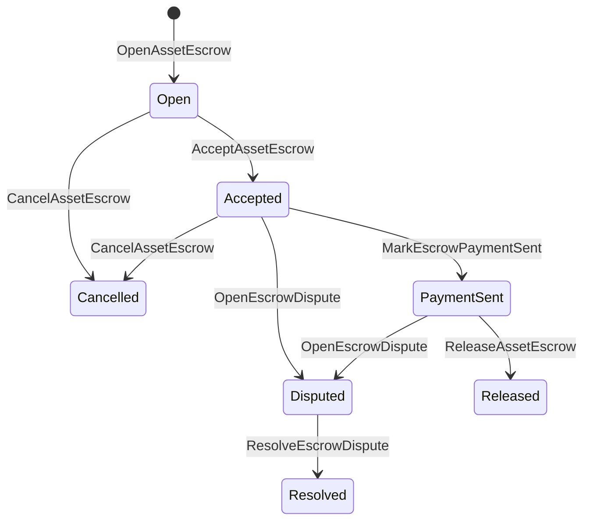

# ቤተኛ ንብረት Escrow {#native-asset-escrow}

ቤተኛ escrow በብሎክቼይን መዝገብ ለሚተዳደሩ የቁጥር ንብረቶች የጥበቃ ዘዴ ነው። ንብረቶችን ወደ መተግበሪያው ባለቤትነት የተያዘ መለያ ከመላክ እና በ ላይ ከመተማመን ይልቅ ያንን መለያ ለመጠበቅ የመተግበሪያ ኮድ፣ escrow ISIs እሴትን ወደ ዲተርሚኒስቲክ የፕሮቶኮል ጥበቃ መለያ ያንቀሳቅሱ እና በአለም ሁኔታ ውስጥ ያለውን የ escrow የሕይወት ዑደት ይመዝግቡ።

በብሎክቼይን መዝገብ ውስጥ የሚታይ የህይወት ኡደት ሁኔታን የሚጠይቁ ለገበያ ቦታ የፋይናንሺያል ግብይት ማጠናቀቂያ፣ የአይታይ አይነት ከሰንሰለት ውጪ የክፍያ ቅንጅት፣ ወሳኝ መቆለፊያዎች እና የተከለሉ የዋስትና የስራ ፍሰቶች ቤተኛ escrow ይጠቀሙ።

## ጽንሰ-ሐሳቦች {#concepts}

|ጽንሰ-ሐሳብ|መግለጫ|
| --- | --- |
|`EscrowId`|ምስጠራ ሃሽ የሚያጠቃልል በደንበኛ የተመረጠ መለያን መጠየቅ። ግልጽ እና ማንነታቸው ባልታወቁ escrows ላይ ልዩ መሆን አለበት።|
|`AssetEscrowRecord`|ግልጽ የቁጥር ንብረት ማስያዣ ወይም የመቆለፊያ መዝገብ።|
|`AnonymousAssetEscrowRecord`|በናሊፋየሮች፣ በክሪፕቶግራፊያዊ ኮሚትመንቶች እና በማረጋገጫ አባሪዎች የተደገፈ የተከለለ የማስያዣ መዝገብ።|
|የማሳደጊያ መለያ|ከሰንሰለት መታወቂያ፣ የዋስትና መታወቂያ እና የንብረት ፍቺ የተገኘ ዲተርሚኒስቲክ ፕሮቶኮል መለያ።|
|ማስረጃ ምስጠራ ሃሽዎች|ማስረጃ ምስጠራ ሃሽ ደረሰኞችን፣ ፍርዶችን፣ መልዕክቶችን፣ የማከማቻ ቴክኒካል ማኒፌስቶችን ወይም ሌሎች ከሰንሰለት ውጪ ማስረጃዎችን መለየት ይችላል። የማስረጃው ጭነት ራሱ በ escrow መዝገብ ውስጥ አይከማችም።|

ግልጽ መዝገቦች ሻጩን፣ አማራጭ ገዢውን፣ የንብረት ፍቺን፣ ጠቅላላ መጠን፣ የጥበቃ ሂሳብን፣ የህይወት ኡደት ሁኔታን፣ የባህሪ አይነትን፣ የቀረውን መጠን፣ አማራጭ የመልቀቂያ ፍቃድ ርእሰ መምህራን፣ አማራጭ የማብቂያ ጊዜ ማህተም፣ ማስረጃ ምስጠራ ሃሽዎችን፣ የጊዜ ማህተሞችን እና አማራጭ የመፍትሄ ዝርዝሮችን ይይዛሉ።

የማስያዣ መጠኖች አወንታዊ የቁጥር ንብረት መጠኖች መሆን አለባቸው እና ከንብረቱ ፍቺ የቁጥር ዝርዝር መግለጫ ጋር መዛመድ አለባቸው። ማስያዣ ወይም መቆለፊያ ንቁ በሚሆንበት ጊዜ፣ አጠቃላይ የንብረት ዝውውሮች የጥበቃ ሂሳቡን ማፍሰስ አይችሉም። የጥበቃ መውጫ መንገዶች ከዚህ በታች የተገለጹት escrow ISIs ናቸው።

## የገበያ ቦታ Escrow {#marketplace-escrow}

የገበያ ቦታ escrow በሰንሰለት ላይ ያለውን የንብረት መለቀቅ ከሰንሰለት ውጪ ክፍያ ወይም የመላኪያ የስራ ሂደት ጋር ያስተባብራል።



|ISI|ማን ያቀርበዋል|ውጤት|
| --- | --- | --- |
|`OpenAssetEscrow`|ሻጭ|የሻጩን የቁጥር ንብረት በፕሮቶኮል ጥበቃ ውስጥ ይቆልፋል እና `Open` የገበያ ቦታ መዝገብ ይፈጥራል።|
|`AcceptAssetEscrow`|ገዢ|ገዢውን ይመዘግባል እና `Open` ወደ `Accepted` ይንቀሳቀሳል። ሻጩ የራሱን መያዣ መቀበል አይችልም።|
|`MarkEscrowPaymentSent`|ተቀባይነት ያለው ገዢ|ገዢው ከሰንሰለት ውጪ ክፍያውን ከላከ በኋላ `Accepted` ወደ `PaymentSent` ይንቀሳቀሳል።|
|`ReleaseAssetEscrow`|ሻጭ|`PaymentSent` ወደ `Released` ያንቀሳቅሳል እና ሙሉውን የተያዘውን መጠን ለገዢው ያስተላልፋል።|
|`CancelAssetEscrow`|ሻጭ|`Open` ወይም `Accepted` ወደ `Cancelled` ይንቀሳቀሳል እና ክፍያ ምልክት ከመደረጉ በፊት ሻጩን ይመልሳል።|
|`OpenEscrowDispute`|ሻጭ ወይም ተቀባይነት ያለው ገዢ|`Accepted` ወይም `PaymentSent` ወደ `Disputed` ያንቀሳቅሳል እና ማስረጃ ምስጠራ hashs ያያይዛል።|
|`ResolveEscrowDispute`|መለያ ከ `CanResolveEscrowDispute`|`Disputed` ወደ `Resolved` ያንቀሳቅሳል እና መጠኑን በገዢ እና በሻጭ መካከል ይከፋፍላል።|

የክርክር አፈታት መጠኖች አሉታዊ ያልሆኑ መሆን አለባቸው፣ እና `buyer_amount + seller_amount` ከ escrow መጠን ጋር እኩል መሆን አለበት። ዜሮ ዋጋ ያላቸው የፋይናንስ ማስተላለፊያ ክፍሎች ይፈቀዳሉ፣ ነገር ግን አጠቃላይ ክፍፍሉ የተቆለፈውን ቀሪ ሂሳብ ግምት ውስጥ ማስገባት አለበት።

### Rust ምሳሌ {#rust-example}

ይህ ምሳሌ የሻጩ እና የገዢ መለያዎች ቀድሞውኑ እንዳሉ ይገምታል፣ የንብረቱ ፍቺ እንደ ቁጥር ተመዝግቧል፣ እና ሻጩ በቂ ቀሪ ሂሳብ አለው።

```rust
use iroha::{
    client::Client,
    data_model::{
        isi::escrow::{
            AcceptAssetEscrow, MarkEscrowPaymentSent, OpenAssetEscrow,
            ReleaseAssetEscrow,
        },
        prelude::*,
    },
};
use iroha_crypto::Hash;

fn release_marketplace_escrow(
    seller_client: &Client,
    buyer_client: &Client,
    asset_definition_id: AssetDefinitionId,
) -> eyre::Result<()> {
    let escrow_id = EscrowId::new(Hash::new("docs-marketplace-escrow-001"));

    seller_client.submit_blocking(OpenAssetEscrow::with_evidence_hashes(
        escrow_id,
        asset_definition_id,
        Numeric::from(40_u64),
        vec![Hash::new("invoice:2026-001")],
    ))?;

    buyer_client.submit_blocking(AcceptAssetEscrow::new(escrow_id))?;
    buyer_client.submit_blocking(MarkEscrowPaymentSent::new(escrow_id))?;
    seller_client.submit_blocking(ReleaseAssetEscrow::new(escrow_id))?;

    let record = seller_client.query_single(FindAssetEscrowById::new(escrow_id))?;
    assert_eq!(record.status, AssetEscrowStatus::Released);
    assert_eq!(record.remaining_amount, Numeric::zero());

    Ok(())
}
```

## አጠቃላይ የንብረት መቆለፊያዎች {#generic-asset-locks}

የንብረት መቆለፊያዎች አንድ አይነት የጥበቃ መዝገብ አይነት ይጠቀማሉ፣ ነገር ግን የገዢ-ሻጭ ቅናሾች አይደሉም። ለመድረሻ መለያ ገንዘቦችን ይቆልፋሉ እና እንደ አማራጭ ገንዘቦችን ወደ ታች ለማውጣት የተለየ የመልቀቂያ የፈቃድ ባለቤት ያስፈልጋቸዋል።

|ISI|ማን ያቀርበዋል|ውጤት|
| --- | --- | --- |
|`OpenAssetLock`|የምንጭ መለያ|አወንታዊ መጠንን ይቆልፋል፣ መድረሻውን እንደ ሪከርድ ገዢ ይመዘግባል እና ሁኔታን ወደ `Locked` ያዘጋጃል።|
|`DrawdownAssetLock`|የመልቀቂያ ፈቃድ ዋና ወይም መድረሻ ምንም የመልቀቂያ ፍቃድ ዋና ካልተዘጋጀ|የቀረውን የጥበቃ ክፍል ወይም በሙሉ ወደ መድረሻው ያስተላልፋል።|
|`CancelAssetLock`|የመቆለፊያ መክፈቻ|ገባሪ መቆለፊያን ይሰርዛል እና የቀረውን መጠን ወደ መክፈቻው ይመልሳል።|
|`ExpireAssetLock`|ማንኛውም የግብይት ፈቃድ ከቀነ-ገደቡ በኋላ ዋና|ከዚህ በፊት ከ `expires_at_ms` ጋር መቆለፊያ ጊዜው ያበቃል እና የቀረውን ገንዘብ ወደ መክፈቻው ይመልሳል።|

`DrawdownAssetLock` የተወሰነ መጠን ሲቀር መዝገቡን በ `Locked` ውስጥ ያስቀምጣል። ቀሪው መጠን ዜሮ ሲደርስ ሁኔታው `DrawnDown` ይሆናል እና መዝገቡ ይዘጋል።

```rust
use iroha::{
    client::Client,
    data_model::{
        isi::escrow::{CancelAssetLock, DrawdownAssetLock, ExpireAssetLock, OpenAssetLock},
        prelude::*,
    },
};
use iroha_crypto::Hash;

fn drawdown_and_close_asset_locks(
    opener_client: &Client,
    destination_client: &Client,
    release_authority_client: &Client,
    asset_definition_id: AssetDefinitionId,
    destination: AccountId,
    release_authority: AccountId,
) -> eyre::Result<()> {
    let trusted_lock_id = EscrowId::new(Hash::new("docs-asset-lock-trusted"));

    opener_client.submit_blocking(OpenAssetLock::with_options(
        trusted_lock_id,
        asset_definition_id.clone(),
        destination.clone(),
        Numeric::from(40_u64),
        Some(release_authority),
        None,
        vec![Hash::new("milestone-plan-v1")],
    ))?;

    release_authority_client.submit_blocking(DrawdownAssetLock::new(
        trusted_lock_id,
        Numeric::from(15_u64),
    ))?;

    let partially_drawn =
        opener_client.query_single(FindAssetEscrowById::new(trusted_lock_id))?;
    assert_eq!(partially_drawn.status, AssetEscrowStatus::Locked);
    assert_eq!(partially_drawn.remaining_amount, Numeric::from(25_u64));

    opener_client.submit_blocking(CancelAssetLock::new(trusted_lock_id))?;
    let cancelled = opener_client.query_single(FindAssetEscrowById::new(trusted_lock_id))?;
    assert_eq!(cancelled.status, AssetEscrowStatus::Cancelled);

    let expiring_lock_id = EscrowId::new(Hash::new("docs-asset-lock-expiring"));
    opener_client.submit_blocking(OpenAssetLock::with_options(
        expiring_lock_id,
        asset_definition_id,
        destination,
        Numeric::from(10_u64),
        None,
        Some(0),
        Vec::new(),
    ))?;

    destination_client.submit_blocking(ExpireAssetLock::new(expiring_lock_id))?;
    let expired = opener_client.query_single(FindAssetEscrowById::new(expiring_lock_id))?;
    assert_eq!(expired.status, AssetEscrowStatus::Expired);

    Ok(())
}
```

Python በአሁኑ ጊዜ ከፍተኛ ደረጃ ረዳቶችን ለአጠቃላይ መቆለፊያዎች ያጋልጣል `open_asset_lock`፣ `drawdown_asset_lock`፣ `cancel_asset_lock` እና `expire_asset_lock`። ለገበያ ቦታ እና ስም-አልባ ማስያዣ ከ Python፣ ነጠላ ፕሮቶኮል-ስታንዳርድ `InstructionBox` JSON በ SDK JSON የማምለጫ መፈልፈያ ይጠቀሙ ወይም አንደኛ ደረጃ escrow ግንበኞችን በሚያጋልጥ SDK በኩል ያስገቡ።

## አለመግባባቶች {#disputes}

የገበያ ቦታ ማስያዣ ከ`Accepted` ወይም `PaymentSent` ክርክር ውስጥ ሊገባ ይችላል። አለመግባባቱን መክፈት የሚችለው የተመዘገበው ሻጭ ወይም ገዢ ብቻ ነው። መፍትሄው `CanResolveEscrowDispute`ን ይጠይቃል፣ ወይ በቀጥታ ለመፍትሔው መለያ የተሰጠ ወይም በሚና የተወረሰ።

```rust
use iroha::{
    client::Client,
    data_model::{
        isi::escrow::{OpenEscrowDispute, ResolveEscrowDispute},
        prelude::*,
    },
};
use iroha_crypto::Hash;
use iroha_executor_data_model::permission::escrow::CanResolveEscrowDispute;

fn resolve_disputed_escrow(
    admin_client: &Client,
    buyer_client: &Client,
    court_client: &Client,
    court: AccountId,
    escrow_id: EscrowId,
) -> eyre::Result<()> {
    admin_client.submit_blocking(Grant::account_permission(
        Permission::from(CanResolveEscrowDispute),
        court,
    ))?;

    buyer_client.submit_blocking(OpenEscrowDispute::with_evidence_hashes(
        escrow_id,
        vec![Hash::new("buyer-payment-receipt")],
    ))?;

    court_client.submit_blocking(ResolveEscrowDispute::with_evidence_hashes(
        escrow_id,
        Numeric::from(30_u64),
        Numeric::from(10_u64),
        vec![Hash::new("court-judgement-001")],
    ))?;

    let record = admin_client.query_single(FindAssetEscrowById::new(escrow_id))?;
    assert_eq!(record.status, AssetEscrowStatus::Resolved);
    assert_eq!(
        record.resolution.as_ref().map(|resolution| resolution.buyer_amount.clone()),
        Some(Numeric::from(30_u64)),
    );

    Ok(())
}
```

## ስም-አልባ Escrow {#anonymous-escrow}

ስም-አልባ escrow ተመሳሳይ የገበያ ቦታ የሕይወት ዑደት ይጠቀማል፣ ነገር ግን የገንዘብ ድጋፍ እና የመዝጊያ ንብረት እንቅስቃሴ የተጠበቀ ነው። የህዝብ መዝገብ አሁንም ሻጭ፣ ገዢ፣ ሁኔታ፣ ማስረጃ ምስጠራ ሃሽዎች፣ የጊዜ ማህተሞች እና ከማረጋገጫ ጋር የተገናኙ የእንቅስቃሴ መዝገቦች። በተከለሉ ማስታወሻዎች ውስጥ ያሉ መጠኖች እና ተቀባዮች በክሪፕቶግራፊያዊ ኮሚትመንቶች፣ ናሊፋየሮች እና በማረጋገጫ አባሪዎች ይወከላሉ።

|ግልጽ ISI|ስም የለሽ ISI|
| --- | --- |
|`OpenAssetEscrow`|`OpenAnonymousAssetEscrow`|
|`AcceptAssetEscrow`|`AcceptAnonymousAssetEscrow`|
|`MarkEscrowPaymentSent`|`MarkAnonymousEscrowPaymentSent`|
|`ReleaseAssetEscrow`|`ReleaseAnonymousAssetEscrow`|
|`CancelAssetEscrow`|`CancelAnonymousAssetEscrow`|
|`OpenEscrowDispute`|`OpenAnonymousEscrowDispute`|
|`ResolveEscrowDispute`|`ResolveAnonymousEscrowDispute`|

የኪስ ቦርሳ ወይም የማረጋገጫ መሳሪያዎች የማረጋገጫ አባሪ እና የህዝብ ግብዓቶችን መገንባት አለባቸው። መክፈት አንድ የ escrow ክሪፕቶግራፊያዊ ኮሚትመንት ይፈጥራል። መልቀቅ፣ መሰረዝ፣ እና ስም-አልባ የክርክር አፈታት በትክክል አንድ የ escrow cryptographic ኮሚትመንት ማውጣት እና በድርጊቱ የሚፈለጉትን ገዢ፣ ሻጭ ወይም የተከፈለ የውጤት ክሪፕቶግራፊያዊ ኮሚትመንቶችን መፍጠር አለበት።

```rust
use iroha::{
    client::Client,
    data_model::{
        isi::escrow::{
            AcceptAnonymousAssetEscrow, MarkAnonymousEscrowPaymentSent,
            OpenAnonymousAssetEscrow,
        },
        prelude::*,
        proof::ProofAttachment,
    },
};
use iroha_crypto::Hash;

fn open_anonymous_escrow(
    seller_client: &Client,
    buyer_client: &Client,
    escrow_id: EscrowId,
    asset_definition_id: AssetDefinitionId,
    funding_nullifiers: Vec<[u8; 32]>,
    escrow_commitment: [u8; 32],
    proof: ProofAttachment,
    root_hint: Option<[u8; 32]>,
) -> eyre::Result<()> {
    seller_client.submit_blocking(OpenAnonymousAssetEscrow::with_evidence_hashes(
        escrow_id,
        asset_definition_id,
        funding_nullifiers,
        escrow_commitment,
        proof,
        root_hint,
        vec![Hash::new("shielded-invoice")],
    ))?;

    buyer_client.submit_blocking(AcceptAnonymousAssetEscrow::new(escrow_id))?;
    buyer_client.submit_blocking(MarkAnonymousEscrowPaymentSent::new(escrow_id))?;

    Ok(())
}
```

ለመሠረታዊው የተከለለ ግብይት ሞዴል [ስም-አልባ ግብይቶች](/am/blockchain/anonymous-transactions.md)ን ይመልከቱ።

## SDK አጠቃቀም {#sdk-usage}

የ Escrow ድጋፍ በ SDKs ላይ በተለየ መንገድ ተጋልጧል። Rust ነጠላ ፕሮቶኮል-መደበኛ የተተየበ የውሂብ ሞዴል አለው።. Python በአሁኑ ጊዜ አጠቃላይ የንብረት-መቆለፊያ ረዳቶችን ያጋልጣል. JavaScript እና TypeScript Kotodama escrow አስተናጋጅ-ተግባር ጥሪዎችን ይጠቀማሉ። Kotlin/JVM እና Swift ለገበያ ቦታ እና ስም-አልባ escrow የተተየቡ ጭነት ግንበኞችን ያቀርባሉ።

|SDK|ይህን ገጽ ተጠቀም|አድማስ|
| --- | --- | --- |
|[Rust](#rust-sdk)|`iroha::data_model::isi::escrow`|የገበያ ቦታ escrow፣ አጠቃላይ መቆለፊያዎች፣ ስም-አልባ escrow፣ መጠይቆች እና ክስተቶች።|
|[Python](#python-asset-locks)|`Instruction.open_asset_lock`፣ `TransactionDraft.open_asset_lock` እና ደንበኛ `*_and_wait` ረዳቶች|አጠቃላይ የንብረት መቆለፊያዎች። የገበያ ቦታ እና ማንነታቸው ያልታወቁ የዋስትና ረዳቶች ገና አንደኛ ደረጃ Python ዘዴዎች አይደሉም።|
|[JavaScript / TypeScript](#javascript-and-typescript-kotodama)|`compileKotodamaProgram` ከ `@iroha/iroha-js/kotodama-compiler`|በ Kotodama ኮንትራቶች ውስጥ የማስያዣ አስተናጋጅ-ተግባር ጥሪዎች።|
|[Kotlin / JVM](#kotlin-and-jvm)|`InstructionTemplate` ክፍሎች በ `org.hyperledger.iroha.sdk.core.model.instructions`|የገበያ ቦታ እና ስም-አልባ escrow ብጁ መመሪያ አብነቶች።|
|[Swift / iOS](#swift-and-ios)|`NativeEscrowInstructionBuilders` እና `IrohaSDK.build*Escrow*` ረዳቶች|የገበያ ቦታ እና ስም-አልባ escrow Norito JSON የመመሪያ ጭነቶች።|

ከዚህ በታች ያሉት ምሳሌዎች በመመሪያ ግንባታ ላይ ያተኩራሉ. የመለያ የገንዘብ ድጋፍ፣ የፊርማ አስተዳደር እና የግብይት ማስረከብ ለእያንዳንዱ SDK መደበኛውን ፍሰት ይከተላሉ።

### Rust SDK {#rust-sdk}

ሙሉ ቤተኛ ሽፋን ወይም የጥያቄ/የክስተት ድጋፍ ሲፈልጉ Rust SDK ን ይጠቀሙ። ከላይ ያሉት ምሳሌዎች የገበያ ቦታ መለቀቅ፣ አጠቃላይ የመቆለፊያ መውደቅ፣ የክርክር አፈታት እና ስም-አልባ የዋስትና ግንባታ ከ`iroha::data_model::isi::escrow` ጋር ያሳያሉ።

```rust
use iroha::{
    client::Client,
    data_model::{isi::escrow::OpenAssetEscrow, prelude::*},
};
use iroha_crypto::Hash;

fn open_and_read(
    client: &Client,
    asset_definition_id: AssetDefinitionId,
) -> eyre::Result<AssetEscrowRecord> {
    let escrow_id = EscrowId::new(Hash::new("docs-rust-sdk-escrow"));

    client.submit_blocking(OpenAssetEscrow::new(
        escrow_id,
        asset_definition_id,
        Numeric::from(10_u64),
    ))?;

    client.query_single(FindAssetEscrowById::new(escrow_id))
}
```

### Python የንብረት መቆለፊያዎች {#python-asset-locks}

Python SDK ለአጠቃላይ የንብረት መቆለፊያዎች አንደኛ ደረጃ ረዳቶችን ይሰጣል። ለወሳኝ ክፍያዎች፣ ለመልቀቂያ የፈቃድ ባለቤት ውድቀቶች፣ በመክፈቻው መሰረዝ እና ጊዜው ያለፈበት ተመላሽ ገንዘብ ይጠቀሙባቸው።

```python
client.open_asset_lock_and_wait(
    chain_id="dev-chain",
    authority="<source-account-id>",
    private_key_hex="<source-private-key-hex>",
    escrow_id="merchant-lock-001",
    asset_definition_id="<asset-definition-base58>",
    destination="<destination-account-id>",
    amount="2500",
    release_authority="<trusted-release-account-id>",
    expires_at_ms=1_704_000_000_000,
)

client.drawdown_asset_lock_and_wait(
    chain_id="dev-chain",
    authority="<trusted-release-account-id>",
    private_key_hex="<trusted-release-private-key-hex>",
    escrow_id="merchant-lock-001",
    amount="1000",
)

client.expire_asset_lock_and_wait(
    chain_id="dev-chain",
    authority="<any-account-id>",
    private_key_hex="<any-private-key-hex>",
    escrow_id="merchant-lock-001",
)
```

ለሁለት ወገን መቆለፊያ `release_authority`ን ይተዉት; የመድረሻ መለያው `drawdown_asset_lock` ማስገባት ይችላል።

### JavaScript እና TypeScript Kotodama {#javascript-and-typescript-kotodama}

የ JavaScript SDK በአሁኑ ጊዜ ቀጥተኛ ቤተኛ escrow ግብይት ገንቢዎችን አያጋልጥም። ለ JavaScript ወይም TypeScript የሚያሰማሩ መተግበሪያዎች Kotodama ኮንትራቶች፣ የ ESCROW አስተናጋጅ-ተግባር ጥሪዎችን ከ ጋር ያጠናቅቁ Kotodama አቀናባሪ።

ቤተኛ የማስያዣ አስተናጋጅ-ተግባር ጥሪዎች ግልጽ የመዳረሻ ፍንጮችን ይፈልጋሉ ምክንያቱም አቀናባሪው ግልጽ ያልሆነ escrow ISIs ጠባብ የመዳረሻ ስብስቦችን ማግኘት አይችልም። ቴክኒካል ጥሪ `escrow_*` አብሮገነብ በሚላኩ የመግቢያ ነጥቦች ላይ የዱር ካርድ ፍንጮችን ይጠቀሙ።

```js
import { compileKotodamaProgram } from "@iroha/iroha-js/kotodama-compiler";

const source = `
seiyaku MarketplaceEscrow {
  meta { abi_version: 1; }

  #[access(read="*", write="*")]
  kotoage fn run() permission(Admin) {
    let asset = asset_definition("62Fk4FPcMuLvW5QjDGNF2a4jAmjM");
    let offer = name("aitai_offer");
    let evidence = norito_bytes("00");

    call escrow_open_offer(offer, asset, 10, evidence);
    call escrow_accept(offer);
    call escrow_mark_payment_sent(offer);
    call escrow_release(offer);
  }
}
`;

const compiled = compileKotodamaProgram(source, {
  sourceName: "escrow.ko",
});

if (compiled.diagnostics.length > 0) {
  throw new Error(compiled.diagnostics.map((item) => item.message).join("\n"));
}
```

ለአለመግባባቶች፣ `escrow_open_dispute(offer, evidence)` እና `escrow_resolve_dispute(offer, buyer_amount, seller_amount, evidence)` ይጠቀሙ። ስም-አልባ የማስያዣ አስተናጋጅ-ተግባር ጥሪዎች Norito የጭነት ባይት ጥያቄን ይቀበላሉ፣ ለምሳሌ `anonymous_escrow_open_offer(request)`።

### Kotlin እና JVM {#kotlin-and-jvm}

የ Kotlin/JVM SDK ቤተኛ escrow እንደ ብጁ መመሪያ አብነቶች ሞዴሎች። እያንዳንዱ አብነት የሚፈለጉትን መስኮች ያረጋግጣል እና በግብይት ገንቢው ጥቅም ላይ የሚውለውን ነጠላ ፕሮቶኮል-መደበኛ የክርክር ካርታ ያጋልጣል።

```kotlin
import org.hyperledger.iroha.sdk.core.model.escrow.NativeEscrowPermissions
import org.hyperledger.iroha.sdk.core.model.instructions.AcceptAssetEscrowInstruction
import org.hyperledger.iroha.sdk.core.model.instructions.MarkEscrowPaymentSentInstruction
import org.hyperledger.iroha.sdk.core.model.instructions.OpenAssetEscrowInstruction
import org.hyperledger.iroha.sdk.core.model.instructions.ReleaseAssetEscrowInstruction
import org.hyperledger.iroha.sdk.core.model.instructions.ResolveEscrowDisputeInstruction

val open = OpenAssetEscrowInstruction(
    escrowId = "escrow-hash",
    assetDefinition = "xor#wonderland",
    amount = "42.5",
    evidenceHashes = listOf("invoice-hash"),
)
val accept = AcceptAssetEscrowInstruction("escrow-hash")
val paid = MarkEscrowPaymentSentInstruction("escrow-hash")
val release = ReleaseAssetEscrowInstruction("escrow-hash")
val resolve = ResolveEscrowDisputeInstruction(
    escrowId = "escrow-hash",
    buyerAmount = "30",
    sellerAmount = "12.5",
    evidenceHashes = listOf("judgement-hash"),
)

println(open.arguments)
println(NativeEscrowPermissions.CAN_RESOLVE_ESCROW_DISPUTE)
```

ማንነታቸው ያልታወቁ አብነቶች እንደ `OpenAnonymousAssetEscrowInstruction`፣ `AcceptAnonymousAssetEscrowInstruction`፣ `MarkAnonymousEscrowPaymentSentInstruction`፣ `ReleaseAnonymousAssetEscrowInstruction`፣ `CancelAnonymousAssetEscrowInstruction`፣ `OpenAnonymousEscrowDisputeInstruction` እና `ResolveAnonymousEscrowDisputeInstruction` ይገኛሉ። Android ጃቫ ደንበኞችን የሚጠይቁ ተጓዳኝ `NativeEscrowInstructions.*` ግንበኞችን ከ Android አርቲፋክት መጠቀም ይችላሉ።

### Swift እና iOS {#swift-and-ios}

የ Swift SDK የዋስትና መመሪያዎችን እንደ Norito JSON ጭነቶች ይገነባል። `NativeEscrowInstructionBuilders`ን በቀጥታ ይጠቀሙ ወይም መተግበሪያዎ አስቀድሞ የ`IrohaSDK` ምሳሌ ሲይዝ ተመጣጣኝ `IrohaSDK.build*Escrow*` ረዳት ይጥራ።

```swift
import IrohaSwift

let open = try NativeEscrowInstructionBuilders.openAssetEscrow(
    escrowId: "escrow-hash",
    assetDefinition: "xor#wonderland",
    amount: "42.5",
    evidenceHashes: ["invoice-hash"]
)
let accept = try NativeEscrowInstructionBuilders.acceptAssetEscrow(
    escrowId: "escrow-hash"
)
let paid = try NativeEscrowInstructionBuilders.markEscrowPaymentSent(
    escrowId: "escrow-hash"
)
let release = try NativeEscrowInstructionBuilders.releaseAssetEscrow(
    escrowId: "escrow-hash"
)
let resolve = try NativeEscrowInstructionBuilders.resolveEscrowDispute(
    escrowId: "escrow-hash",
    buyerAmount: "30",
    sellerAmount: "12.5",
    evidenceHashes: ["judgement-hash"]
)
```

ስም-አልባ Swift ግንበኞች የዋጋ ዝርዝሮችን፣ የውጤት ክሪፕቶግራፊያዊ ኮሚትመንት ዝርዝሮችን፣ የማረጋገጫ መዝገበ ቃላትን እና አማራጭ `rootHint` እሴቶችን ይወስዳሉ። የክርክር ፈቺ ፍቃድ ቶከን እንደ `NativeEscrowPermissions.canResolveEscrowDispute` ይገኛል።

## ጥያቄዎች እና ኩነቶች {#queries-and-events}

ለሁኔታ ገፆች፣ የማስታረቅ ስራዎች እና የድጋፍ መሳሪያዎች የዋስትና መጠይቆችን ይጠቀሙ -

|መጠይቅ|ዓላማ|
| --- | --- |
|`FindAssetEscrowById`|አንድ ግልጽ escrow ወይም መቆለፊያ በ`EscrowId` ያንብቡ።|
|`FindAssetEscrows`|ግልጽ የ ማስያዣ እና የመቆለፊያ መዝገቦችን ይዘርዝሩ።|
|`FindAssetEscrowsBySeller`|በሻጭ ወይም በመቆለፊያ መክፈቻ የተከፈቱ መዝገቦችን ይዘርዝሩ።|
|`FindAssetEscrowsByBuyer`|በገዢ ተቀባይነት ያላቸውን የገበያ ቦታ ማስያዣዎች ወይም መድረሻን ያነጣጠሩ መቆለፊያዎችን ይዘርዝሩ።|
|`FindAssetEscrowsByStatus`|መዝገቦችን በ `AssetEscrowStatus` ይዘርዝሩ።|
|`FindAnonymousAssetEscrowById`|አንድ ማንነቱ ያልታወቀ ማስያዣ በ`EscrowId` ያንብቡ።|
|`FindAnonymousAssetEscrows*`|በሁሉም መዝገቦች፣ ሻጭ፣ ገዢ ወይም ሁኔታ ማንነታቸው ያልታወቁ escrows ይዘርዝሩ።|

`EscrowEventFilter` ለግልጽ ቤተኛ ማስያዣ መመዝገብ እና ክስተቶችን በ escrow መታወቂያ፣ ሻጭ፣ ገዢ፣ ሁኔታ እና በክስተት ስብስብ ጭንብል መመዝገብ ይችላል። የክስተቱ ቤተሰብ `Opened`ን ያካትታል። `Accepted`፣ `PaymentSent`፣ `Released`፣ `Cancelled`፣ `Expired`፣ `Disputed` እና `Resolved`። ማንነታቸው ያልታወቁ የ escrow መዝገቦች በማይታወቁ የ escrow መጠይቆች በኩል ይመረመራሉ።

## የአሠራር ማስታወሻዎች {#operational-notes}

- ትላልቅ ደረሰኞችን፣ የውይይት ምዝግብ ማስታወሻዎችን፣ ፍርዶችን ወይም የኦዲት ጥቅሎችን ከ escrow መዝገብ ውጭ ያከማቹ እና ምስጠራ ሃሽዎቻቸውን እንደ ማስረጃ ያያይዙ።
- በመተግበሪያዎች ውስጥ የተረጋጋ `EscrowId` አመጣጥን ይጠቀሙ ስለዚህ ድጋሚ ሙከራዎች ለተመሳሳይ አቅርቦት የተባዙ escrows መፍጠር አይችሉም።
- `CanResolveEscrowDispute` የክርክር ሂደቱን ለሚያካሂዱ መለያዎች ወይም ሚናዎች ብቻ ይስጡ።
- ከሰንሰለት ውጪ የክፍያ ማረጋገጫን እንደ ማመልከቻ ፖሊሲ ይያዙ። Iroha የጥበቃ እና የህይወት ኡደት ሽግግሮችን ይመዘግባል; የ fiat ወይም የውጭ ክፍያ ሀዲዶችን በራሱ አያረጋግጥም።
