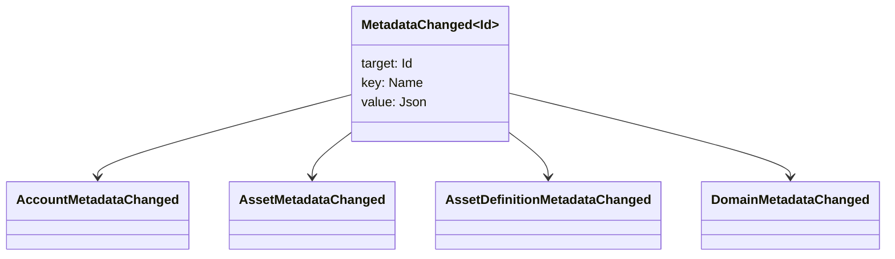

# ሜታዳታ {#metadata}

ሜታዳታ በሪጀር ዕቃዎች ላይ የተያያዘ የተረጋገጠ ቁልፍ-ዋጋ ካርታ ነው። ቁልፎች የ `Name` እሴቶች እና እሴቶች የ JSON (`Json`) ጥቅማጥቅሞች ናቸው።

የሚከተሉት ዕቃዎች ሜታዳታ ሊይዙ ይችላሉ-

- ጎራዎች
- ሂሳቦች
- ንብረቶች
- የአክሲዮን ትርጉሞች
- NFTs
- RWAs
- ማነቃቂያዎች
- ግብይቶች

በመዝገብ ሁኔታ ውስጥ ለሚገኙ ትናንሽ መግለጫ ወይም ኢንዴክስ መስኮች ሜታዳታ ይጠቀሙ WSV በተቃራኒው የተጠቀሰበት፣ URI, ወይም SoraFS መንገድ.

ሜታዳታዎችን፣ ንብረቶችን, NFTs, RWAs, ወይም ከሰንሰለት ውጭ ማከማቻ ፣ ተመልከት [ሜታዳታ እና መቁጠሪያ ማከማቻ አማራጮች](/am/guide/configure/metadata-and-store-assets.md).

## Taira ላይ ይሞክሩት {#try-it-on-taira}

ሜታዳታ በተለመደው የመረጃ ምንጭ ንባብ በኩል ይታያል ። ይህ ትዕዛዝ በአሁኑ ጊዜ ሜታዳታ ያላቸው Taira ንብረቶች ትርጓሜዎችን ያቀርባል:

```bash
curl -fsS 'https://taira.sora.org/v1/assets/definitions?limit=100' \
  | jq '.items[]
    | select((.metadata | length) > 0)
    | {id, name, metadata}'
```

ጎራዎች እና መለያዎች ተመሳሳይ ንድፍ ይጠቀሙ:

```bash
curl -fsS 'https://taira.sora.org/v1/domains?limit=20' \
  | jq '.items[] | select((.metadata // {} | length) > 0)'

curl -fsS 'https://taira.sora.org/v1/accounts?limit=20' \
  | jq '.items[] | select((.metadata // {} | length) > 0)'
```

ባዶ ውፅዓት እንደ ትክክለኛ ውጤት ይቆጥቡ. ይህ ማለት የአሁኑ ገጽ Taira ዕቃዎች ሜታዳታ የላቸውም ማለት ነው, የመጨረሻው ነጥብ አልተሳካም ማለት አይደለም.

## ሜታዳታዎችን ማዘመን {#updating-metadata}

ሜታዳታ በ Iroha ልዩ መመሪያ ተለውጧል

- [`SetKeyValue`](/am/blockchain/instructions.md#setkeyvalue-removekeyvalue) ቁልፍን ያስገባል ወይም ይተካል።
- [`RemoveKeyValue`](/am/blockchain/instructions.md#setkeyvalue-removekeyvalue) አንድ ቁልፍ ያስወግዳል

ግብይቱን የሚያቀርብ ባለሥልጣን በ Active Runtime Validator የሚጠየቀው ፈቃድ ሊኖረው ይገባል። ለነባሪ ፍቃድ ገጽ, [Permission Tokens](/am/reference/permissions.md) ን ይመልከቱ።

## ክስተቶች {#events}

የመረጃ ክስተቶች የሚለቀቁት ሜታዳታ ሲለወጥ ነው። የጄኔሪክ ክስተት ተጠቃሚነት `MetadataChanged<Id>`:



[የመረጃ ክስተት ማጣሪያዎችን ](/am/blockchain/filters.md#data-event-filters) በመጠቀም ለአንድ ውህደት አስፈላጊ ለሆነው የድርጅት አይነት ወይም ነገር ID ሜታዳታ ክስተቶችን ብቻ ለመመዝገብ።

## ጥያቄዎች {#queries}

ለምሳሌ [`FindAccountById`](/am/reference/queries.md#accounts-and-permissions), [`FindDomainById`](/am/reference/queries.md#domains-and-peers)፣ ወይም [`FindAssetDefinitionById`](/am/reference/queries.md#assets-nfts-and-rwas) ይጠቀሙ. [`FindNfts`](/am/reference/queries.md#assets-nfts-and-rwas) ወይም [`FindNftsByAccountId`](/am/reference/queries.md#assets-nfts-and-rwas) ን ለ NFTs ይጠቀሙ ፣ እና [`FindRwas`](/am/reference/queries.md#assets-nfts-and-rwas) ን ለ RWA ጭነቶች ይጠቀሙ። ከዚያ የዕቃውን ሜታዳታ መስክ ያንብቡ። NFT የጥያቄ ምላሾች የ NFT `content` ካርታን እንደ መዝገብ ሜታዳታ ያሳያሉ ።

የሜታዳታ ቁልፎች የመጽሐፉ ሁኔታ አካል ናቸው ፣ ስለሆነም ያንን ስሪት በግልፅ ሊይዝ በሚችልበት ጊዜ JSON ዋጋ ወደ ቁልፍ ስም በመተግበሪያ-ተኮር ስሪት ኮድ ከማድረግ ይቆጠቡ ።
