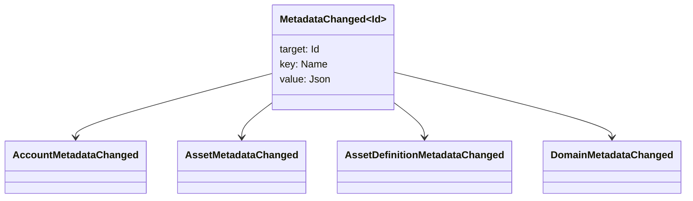

# ሜታዳታ {#metadata}

ሜታዳታ በሊጅር ዕቃዎች ላይ የተያያዘ የተረጋገጠ ቁልፍ-ዋጋ ካርታ ነው. ቁልፎች ናቸው
`Name` እሴቶች እና እሴቶች ናቸው JSON (`Json`) ጥቅማጥቅም ጭነቶች.

የሚከተሉት ዕቃዎች ሜታዳታ ይዘዋል:

- ጎራዎች
- ሂሳቦች
- ንብረቶች
- የአክሲዮን ትርጉሞች
- NFTs
- RWAs
- ተነሳሽነት
- ግብይቶች

በዋና መለያ ውስጥ ለሚገኙ ትናንሽ መግለጫ ወይም ኢንዴክሰሪንግ መስኮች ሜታዳታ ይጠቀሙ
ግዙፍ ጥቅማጥቅሞች ከኤሌክትሮኒክ ማቀነባበሪያዎች ውጭ መቀመጥ አለባቸው WSV እና የተጠቀሰው
የማቃጠል፣ URI, ወይም SoraFS መንገድ.

ሜታዳታዎችን፣ ንብረቶችን፣ NFTs, RWAs, ወይም ከሰንሰለት ውጭ
ማከማቻ፣ ተመልከት
[ሜታዳታ እና መቁጠሪያ ማከማቻ አማራጮች](/am/guide/configure/metadata-and-store-assets.md).

## ሞክር Taira {#try-it-on-taira}

ሜታዳታ በመደበኛ ሀብት ንባብ በኩል ይታያል. Taira
በአሁኑ ጊዜ ሜታዳታ ያላቸው የንብረት ትርጓሜዎች

```bash
curl -fsS 'https://taira.sora.org/v1/assets/definitions?limit=100' \
  | jq '.items[]
    | select((.metadata | length) > 0)
    | {id, name, metadata}'
```

ጎራዎች እና መለያዎች ተመሳሳይ ንድፍ ይጠቀሙ:

```bash
curl -fsS 'https://taira.sora.org/v1/domains?limit=20' \
  | jq '.items[] | select((.metadata // {} | length) > 0)'

curl -fsS 'https://taira.sora.org/v1/accounts?limit=20' \
  | jq '.items[] | select((.metadata // {} | length) > 0)'
```

ባዶ ውፅዓት እንደ ትክክለኛ ውጤት ይቆጥቡ. Taira
ዕቃዎች ሜታዳታ አያያዙም ፣ ማለቂያ ነጥብ አልተሳካም ማለት አይደለም ።

## ሜታዳታዎችን ማዘመን {#updating-metadata}

ሜታዳታ የሚለውጠው በ Iroha ልዩ መመሪያዎች

- [`SetKeyValue`](/am/blockchain/instructions.md#setkeyvalue-removekeyvalue)
  ቁልፍን ያስገባል ወይም ይተካል።
- [`RemoveKeyValue`](/am/blockchain/instructions.md#setkeyvalue-removekeyvalue)
  ቁልፍን ያስወግዳል

ግብይቱን የሚያቀርብ ባለሥልጣን የተጠየቀውን ፈቃድ ሊኖረው ይገባል
ለነባሪ ፍቃድ ገጽ, ተመልከት
[የመፍቀድ ምልክት](/am/reference/permissions.md).

## ክስተቶች {#events}

የመረጃ ክስተቶች ሜታዳታ ሲለወጡ ይለቀቃሉ
`MetadataChanged<Id>`:



አጠቃቀም [የመረጃ ክስተት ማጣሪያዎች](/am/blockchain/filters.md#data-event-filters) ወደ
ለድርጅቱ አይነት ወይም ነገር የሚደረጉ ሜታዳታ ክስተቶች ብቻ ይመዝገቡ ID ይህ
ለኢንቴግሬሽን አስፈላጊ ነው.

## ጥያቄዎች {#queries}

ሜታዳታ የተጠየቀው ነገር አካል ሆኖ ይመለሳል
[`FindAccountById`](/am/reference/queries.md#accounts-and-permissions),
[`FindDomainById`](/am/reference/queries.md#domains-and-peers), ወይም
[`FindAssetDefinitionById`](/am/reference/queries.md#assets-nfts-and-rwas).
አጠቃቀም [`FindNfts`](/am/reference/queries.md#assets-nfts-and-rwas) ወይም
[`FindNftsByAccountId`](/am/reference/queries.md#assets-nfts-and-rwas) ለ
NFTs, እና [`FindRwas`](/am/reference/queries.md#assets-nfts-and-rwas) ለ RWA
ከዚያም የዕቃው ሜታዳታ መስክ ያንብቡ. NFT የጥያቄ መልሶች
NFT `content` ካርታ እንደ መዝገብ ሜታዳታ.

የሜታዳታ ቁልፎች የመረጃ ቋት ግዛት አካል ናቸው, ስለዚህ እነርሱ የተረጋጋ ጠብቁ እና ለማስወገድ
መተግበሪያ-ተኮር ስሪት ኮዲንግ ቁልፍ ስም ወደ ቸርስ ጊዜ JSON
እሴት ያንን ስሪት በግልጽ ሊሸከም ይችላል።
