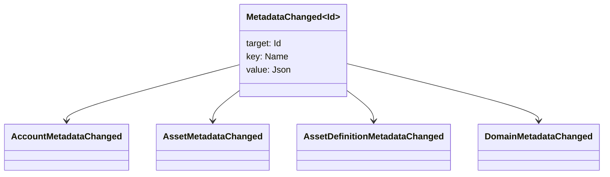

# ሜዳዳታ {#metadata}

ሜታዳታ ከብሎክቼይን መዝገብ ነገሮች ጋር የተያያዘ የተፈተሸ የቁልፍ እሴት ካርታ ነው። ቁልፎች `Name` እሴቶች እና እሴቶች JSON (`Json`) ጭነቶች ናቸው።

የሚከተሉት እቃዎች ሜታዳታ ሊይዙ ይችላሉ

- ጎራዎች
- መለያዎች
- ንብረቶች
- የንብረት ፍቺዎች
- NFTs
- RWAs
- ቀስቅሴዎች
- ግብይቶች

በብሎክቼይን መዝገብ ሁኔታ ውስጥ ላሉ ትናንሽ ገላጭ ወይም መረጃ ጠቋሚ መስኮች ሜታዳታ ይጠቀሙ። ትላልቅ ጭነቶች ከ WSV ውጭ መቀመጥ እና በምስጠራ ዳይጀስት እሴት፣ URI ወይም SoraFS መንገድ መጠቀስ አለባቸው።

ሜታዳታ፣ ንብረቶች፣ NFTs፣ RWAs ወይም ከሰንሰለት ውጪ ማከማቻን ስለመምረጥ መመሪያ ለማግኘት [ሜታዳታ እና blockchain መዝገብ ማከማቻ ምርጫዎች](/am/guide/configure/metadata-and-store-assets.md) ይመልከቱ።

## ይህንን የስራ ፍሰት በ Taira ላይ ያሂዱ {#try-it-on-taira}

ሜታዳታ በመደበኛ የሃብት ንባብ በኩል ይታያል። ይህ ትዕዛዝ በአሁኑ ጊዜ ሜታዳታ ያላቸውን Taira የንብረት ፍቺዎችን ይዘረዝራል -

```bash
curl -fsS 'https://taira.sora.org/v1/assets/definitions?limit=100' \
  | jq '.items[]
    | select((.metadata | length) > 0)
    | {id, name, metadata}'
```

ለጎራዎች እና መለያዎች ተመሳሳይ ስርዓተ-ጥለት ይጠቀሙ -

```bash
curl -fsS 'https://taira.sora.org/v1/domains?limit=20' \
  | jq '.items[] | select((.metadata // {} | length) > 0)'

curl -fsS 'https://taira.sora.org/v1/accounts?limit=20' \
  | jq '.items[] | select((.metadata // {} | length) > 0)'
```

ባዶ ውፅዓትን እንደ ትክክለኛ ውጤት ይያዙ። ይህ ማለት የአሁኑ የ Taira ነገሮች ገጽ ሜታዳታ አይይዝም እንጂ የ API የመጨረሻ ነጥብ አልተሳካም ማለት አይደለም።

## ሜታዳታ በማዘመን ላይ {#updating-metadata}

ሜታዳታ በ Iroha ተቀይሯል የመመሪያ ስራዎች -

- [`SetKeyValue`](/am/blockchain/instructions.md#setkeyvalue-removekeyvalue) ቁልፍ ማስገቢያ ወይንም ይተካል
- [`RemoveKeyValue`](/am/blockchain/instructions.md#setkeyvalue-removekeyvalue) ቁልፍ ያስወግዳል

ግብይቱን የሚያቀርበው የፈቃድ ባለቤት በነቃ የሶፍትዌር ማስፈጸሚያ አካባቢ አረጋጋጭ የሚፈለገው ፈቃድ ሊኖረው ይገባል። ለነባሪው የፍቃድ ገጽ፣ [የፍቃድ ቶከኖች](/am/reference/permissions.md) ይመልከቱ።

## ክስተቶች {#events}

ሜታዳታ ሲቀየር የውሂብ ክስተቶች ይለቀቃሉ። አጠቃላይ የክስተት ጭነት `MetadataChanged<Id>` ነው -



ለውህደት አስፈላጊ ለሆነው የአካል አካል አይነት ወይም የነገር መታወቂያ ለሜታዳታ ክስተቶች ብቻ ለመመዝገብ [የውሂብ ክስተት ማጣሪያዎች](/am/blockchain/filters.md#data-event-filters)ን ይጠቀሙ።

## መጠይቆች {#queries}

ሜታዳታ ይመለሳል እንደ የተጠየቀው እቃ አካል ለምሳሌ ይጠቀሙ [`FindAccountById`](/am/reference/queries.md#accounts-and-permissions), [`FindDomainById`](/am/reference/queries.md#domains-and-peers), ወይም [`FindAssetDefinitionById`](/am/reference/queries.md#assets-nfts-and-rwas). ጥቅም [`FindNfts`](/am/reference/queries.md#assets-nfts-and-rwas) ወይም [`FindNftsByAccountId`](/am/reference/queries.md#assets-nfts-and-rwas) ለ NFTs, እና [`FindRwas`](/am/reference/queries.md#assets-nfts-and-rwas) ለ RWA ብዙ። ከዚያ የእቃውን ሜታዳታ መስክ ያንብቡ። NFT የጥያቄ ምላሾች ያጋልጣሉ NFT `content` ካርታው እንደ መዝገብ ሜታዳታ።

የሜታዳታ ቁልፎች የብሎክቼይን መዝገብ ሁኔታ አካል ናቸው፣ ስለዚህ የተረጋጉ ያቆዩዋቸው እና የ JSON እሴት ያንን ስሪት በግልፅ ሊሸከም በሚችልበት ጊዜ መተግበሪያ-ተኮር የስሪት ለውጦችን ወደ ቁልፍ ስም ከመቀየርን ያስወግዱ።
