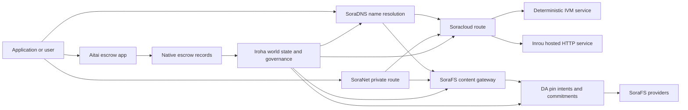

# SORA Nexus አገልግሎቶች {#sora-nexus-services}

SORA Nexus ዙሪያ መተግበሪያ-ተኮር አገልግሎት አውሮፕላኖች ያክላል Iroha 3. እነዚህ አገልግሎቶች የተለዩ መለያዎች አይደሉም ። Iroha የዓለም መንግስት፣ Norito መገለጫዎች፣ የአስተዳደር መዝገቦች እና Torii የጉዞ ቤተሰቦች።

ተደራሽነት በአገናኝ ግንባታ እና በአውታረ መረብ መገለጫ ላይ የተመሠረተ ነው ። [`/openapi`](/am/reference/torii-endpoints.md#app-and-sora-route-families) በዒላማው አገናኝ ላይ እንደ የተፈቀዱ መስመሮች ስልጣን ያለው ዝርዝር ይጠቀሙ።

## አካላት ካርታ {#component-map}

|አካል |ሚና |ዋናው ገጽታ |
| ---------------------- | ------------------------------------------------------------------------------------------------------------------------------------------- | ---------------------------------------------------------------------------------------- |
|Soracloud |የመተግበሪያ ማሰማራት፣ የተስተናገዱ አገልግሎቶች፣ የግል ሞዴል/የስራ ሰዓት ሁኔታ እና የአገልግሎት የሕይወት ዑደት ቁጥጥር። |`/v1/soracloud/`, `/api/`, `iroha app soracloud ...` |
|ወደ ውስጥ |Soracloud የቀጥታ HTTP አውሮፕላን ለሚያስፈልጋቸው የአገልግሎት ማሻሻያዎች HTTP አሂድ ጊዜን አስተናግዷል |Soracloud የስራ ሰዓት ውቅር, አስተናጋጅ አቅም ማስታወቂያዎች, ተለዋዋጭ የሥራ ሰዓት ሁኔታ |
|SoraNet |የግላዊነት እና የትራንስፖርት ሽፋን ለሰርኩቶች ፣ ለሪሌይ ትራፊክ ፣ VPN ፣ ለተገናኙ ክፍለ ጊዜዎች እና ለዥረት መስመሮች ። |`/v1/connect/` ፣ `/v1/vpn/`፣ SoraNet የመንገድ ሜታዳታ |
|የመረጃ ተደራሽነት (DA) |Nexus መስመሮች, SoraFS መገለጫዎች እና የማረጋገጫ ፍሰቶች የተመለከቱት ለጠቅላላ ሸቀጦች ተደራሽነት ማስረጃ, ቁርጠኝነት, እና የፒን-ምኞት ንብርብሮች. |`/v1/da/`, `FindDaPinIntent`, `[sumeragi.da]` |
|SoraFS |CAR ጥቅማጥቅሞች፣ የተጣበቁ ይዘቶች፣ የጌትዌይ ማሰባሰቢያዎች እና የማረጋገጫ-የመመለስ ፍሰቶች ይዘት-አስተናጋጅ ማከማቻ ጨርቅ። |`/v1/sorafs/`, `/sorafs/`, `FindSorafsProviderOwner` |
|SoraDNS |ለ SORA አስተናጋጅ አገልግሎቶች እና ይዘት የዲተሪሚኒስት ስም አሰጣጥ እና የመፍትሄ ሰጪ ማረጋገጫ ንብርብር። |`/v1/soradns/`, `/soradns/`, መፍትሔ ማውጫ ክስተቶች |
|Aitai |በመተግበሪያ ደረጃ ፋይት እና የንብረት መፈፀሚያ ኮሪደር በተፈጥሮ ኤስኮር መዝገቦች የተደገፈ እንጂ በተለየ ዋና መጽሐፍ አይደለም ። |`OpenAssetEscrow`, `FindAssetEscrow*`, `EscrowEventFilter`, Kotodama `escrow_*` ሕንፃዎች |



## የተለመዱ ፍሰቶች {#common-flows}

### የተስተናገደ የ Split መተግበሪያ {#hosted-split-application}

አንድ የተለመደ የተቀላቀለ አውሮፕላን መተግበሪያ ሁሉንም ቁርጥራጮች በአንድነት ይጠቀማል:

1. በ SoraFS በኩል የታሸጉ እና የተጣበቁ ቋሚ የፊት አክሲዮኖች ናቸው።
2. ለምሳሌ የህዝብ አስተናጋጅ `<app>.sora` በ SoraDNS በኩል ተመዝግቧል ።
3. Soracloud መንገዶች `/api/v1/search` ወይም `/api/v1/stream` ወደ Inrou HTTP አገልግሎት.
4. Soracloud መንገዶች `/api/auth` እና `/api/v1/user` ወደ deterministic IVM አያያዝ.
5. የግላዊነት ፍላጎት ያላቸው ደንበኞች ተመሳሳይ ይዘት ወይም API መንገድ በ SoraNet ወረዳ በኩል መድረስ ይችላሉ ።

|መንገድ |የጀርባ አውሮፕላን |ለምን ?|
| ----------------- | --------------------- | ------------------------------------------------- |
| `/`               |SoraFS ቋሚ ይዘት |ሊተገበር የሚችል ይዘት ሥር እና መግቢያ መሸጎጫ |
|`/assets/*` |SoraFS ቋሚ ይዘት |በይዘት ላይ የተመሠረቱ ሀብቶች እና ግልፅ ማስረጃዎች |
|`/api/auth*` |Soracloud IVM |የመልሶ ማጫወት ደህንነቱ የተጠበቀ የጽሁፍ እና የኪስ ቦርሳ ፈተና ሁኔታ |
|`/api/v1/user*` |Soracloud IVM |ለአስተዳደር የሚጠቁሙ የመንግሥት ለውጦች |
|`/api/v1/search*` |Soracloud Inrou |የቀጥታ HTTP አገልግሎት, መሸጎጫ, SSE, ወይም ሰብሳቢ  ሁኔታ|

### ይዘት ህትመት {#content-publication}

SoraFS ህትመት አንድ ስም ከመጠቆምዎ በፊት ዘላቂ ቅርሶችን ያወጣል-

1. አንድ ጠቃሚ ጭነት ወይም ማውጫ ይገንቡ.
2. ወደ CAR ማህደር ውስጥ አስቀምጥ እና ቁራጭ ዕቅድ.
3. የፒን ፖሊሲ እና የአስተዳደር መረጃዎችን ያካተተ Norito ማኒፊስት ይፍጠሩ።
4. የምዝገባ ወረቀቱን ለ Torii ማቅረብ።
5. የዒላማው መገለጫ ግልፅ ማስረጃ በሚጠይቅበት ጊዜ የ DA ፒን ዓላማ ወይም ተደራሽነት ቃል ኪዳንን መዝገብ።
6. መገለጫውን SoraDNS ስም ወይም Soracloud ቋሚ የፊት መስመር ላይ ያያይዙ።

### የግል ማጓጓዣ ወይም የዥረት መንገድ {#private-fetch-or-streaming-route}

SoraNet ከ SoraFS ወይም Soracloud ፊት ለፊት መቀመጥ ይችላል:

1. ደንበኛው ስሙን ወይም መገለጫውን ይፈታል.
2. አንድ ጠባቂ ማውጫ ወይም የመንገድ መመዘኛ መግቢያ እና መውጣት ሪሌዎችን ይመርጣል.
3. ትራፊክ ይሞላል እና በ SoraNet ወረዳ በኩል ይላካል.
4. የ መውጫ ትራንስፖርት ወደ SoraFS መግቢያ በር ፣ Torii ጅረት ወይም Soracloud መንገድ ይደርሳል ።

## አይታይ {#aitai}

Aitai የ SORA መተግበሪያ ኮሪደር ነው የገበያ ቅጥ ስምምነት አንድ ገዢ እና ሻጭ ከሰንሰለት ውጭ ክፍያዎችን የሚያስተባብር ሲሆን Iroha በሰንሰለት ላይ ያለውን ንብረት ጥበቃ ይቆጣጠራል. ለአዳዲስ የቁጥር ንብረቶች ጥበቃ ፍሰቶች በውል ባለቤትነት የተያዘውን የኤስሮው ሂሳብ ከመጠቀም ይልቅ የአገር ውስጥ ኤስሮው መመሪያ ቤተሰብን መጠቀም አለበት።

የአገር ውስጥ ኤስክሮው መቁጠሪያውን ይይዛል። ሻጩ ቅናሽ በ `OpenAssetEscrow` ይከፍታል ፣ ገዢው ከሰንሰለት ውጭ ክፍያውን በ `AcceptAssetEscrow` እና `MarkEscrowPaymentSent` ይቀበላል እና ምልክት ያደርጋል ፣ እናም ሻጩ ክፍያ ከመታወቁ በፊት በ `ReleaseAssetEscrow` ይለቀቃል ወይም ይሰርዛል። ገዢው እና ሻጩ የማይስማሙ ከሆነ ሁለቱም ወገኖች ክርክር መክፈት ይችላሉ እናም `CanResolveEscrowDispute` ጋር መፍትሄ ሰጪው የተቆለፈውን መጠን ሊከፋፍል ይችላል።

ለሙሉ የሕይወት ዑደት, አጠቃላይ የንብረቶች መቆለፊያዎች, የማይታወቁ አስክሮዎች, መጠይቆች, ክስተቶች እና Rust ምሳሌዎች, ይመልከቱ [አገር ውስጥ ንብረት አስክሮ ](/am/blockchain/escrow.md).

|የአይታይ ገጽ |ይጠቀሙበት|
| ------------------------------------------------------------------------------------------------------------------------------------------------------------- | ----------------------------------------------------------------------------------------- |
|`OpenAssetEscrow`, `AcceptAssetEscrow`, `MarkEscrowPaymentSent`, `ReleaseAssetEscrow`, `CancelAssetEscrow` |በ XOR የተሰየሙ የፍርድ ሂሳቦችን ጨምሮ ግልፅ የቁጥር ንብረት አቅርቦቶች። |
|`OpenAnonymousAssetEscrow`, `AcceptAnonymousAssetEscrow`, `MarkAnonymousEscrowPaymentSent`, `ReleaseAnonymousAssetEscrow`, `CancelAnonymousAssetEscrow` |የገንዘብ ድጋፍ እና የመዝጊያ እንቅስቃሴዎች በማረጋገጫ ማያዣዎች የሚከናወኑባቸው የተጠበቁ አቅርቦቶች። |
|`OpenEscrowDispute`, `ResolveEscrowDispute`, `OpenAnonymousEscrowDispute`, `ResolveAnonymousEscrowDispute` |ክርክር መግባትና በፍርድ ቤት አሠራር የሚወሰድበት ውሳኔ። |
|`FindAssetEscrowById`, `FindAssetEscrowsBySeller`, `FindAssetEscrowsByBuyer`፣ `FindAssetEscrowsByStatus` |የመተግበሪያ ሁኔታ ገጾች፣ የማመቻቸት ስራዎች እና የድጋፍ መሳሪያዎች። |
|`EscrowEventFilter` |በቀጥታ ግልፅ የኤስኮር ምዝገባዎች በኤስኮው መታወቂያ, ሻጭ, ገዢ, ሁኔታ, ወይም ክስተት አይነት.|
| Kotodama `escrow_open_offer`, `escrow_accept`, `escrow_mark_payment_sent`, `escrow_release`, `escrow_cancel`, `escrow_open_dispute`, `escrow_resolve_dispute` |Kotodama የውል ጥሪዎች በ V1 ኤስሮው ሲስተምስ የተደገፉ ናቸው.|

ለህዝብ Taira ወይም Minamoto አጠቃቀም ፣ ከመስመር ውጭ የክፍያ መስመር እና ማንኛውንም ድጋፍ ወይም የፍርድ ቤት የሥራ ፍሰት እንደ ማመልከቻ ፖሊሲ ይያዙ። Iroha የጥበቃ ሁኔታን ፣ የሕይወት ዑደት ክስተቶችን ፣ የምስክር ወረቀቶችን ሃሽዎችን እና የመጨረሻውን የአክሲዮን እንቅስቃሴን ይመዘግባል ፤ በራሱ የፊያት ሂሳብ አያረጋግጥም ።

## የዒላማ አገናኝን ያረጋግጡ {#check-a-target-node}

በዚህ ገጽ ላይ ያሉትን ምሳሌዎች ከመጠቀምዎ በፊት እርስዎ በሚመሩበት ኖድ ላይ የመንገድ ቤተሰብ መኖሩን ያረጋግጡ:

```bash
export TORII_URL=https://taira.sora.org

curl -fsS "$TORII_URL/openapi.json" \
  | jq '.paths | keys[] | select(test("^/v1/(soracloud|sorafs|soradns|connect|vpn|da)/"))'

curl -fsS "$TORII_URL/status" | jq .
```

`/openapi.json` በመገለጫው የተጋለጠ ካልሆነ, `/openapi` ይሞክሩ. ትክክለኛ የመንገድ ተገኝነት በግንባታ ባህሪያት እና በአውታረ መረብ ውቅር ላይ የተመሠረተ ነው.

### Taira የትንባሆ ቼኮች ለንባብ ብቻ {#taira-read-only-smoke-checks}

የህዝብ Taira መጨረሻ ነጥብ ለንባብ ጎን ምርመራዎች ጠቃሚ ነው ፣ ነገር ግን የተፈቀደ መለያ ካልተያዙ እና የቀጥታ ሁኔታ ለመቀየር ከፈለጉ በስተቀር ለውጦች ምሳሌዎች ላይ አይጠቀሙበት ።

```bash
export TORII_URL=https://taira.sora.org

curl -fsS "$TORII_URL/status" \
  | jq '{version: .build.version, peers, blocks, lanes: (.teu_lane_commit | length)}'

curl -fsS "$TORII_URL/v1/connect/status" | jq '{enabled, sessions_active}'

curl -fsS "$TORII_URL/v1/vpn/profile" \
  | jq '{available, relay_endpoint, supported_exit_classes}'

curl -fsS "$TORII_URL/v1/sorafs/storage/state" \
  | jq '{bytes_capacity, bytes_used, pin_queue_depth, por_inflight}'

curl -fsS -H 'Accept: application/json' "$TORII_URL/v1/soracloud/status" \
  | jq '.control_plane | {service_count, services: [.services[] | {service_name, current_version}]}'
```

Taira በፕሮጀክቱ ውስጥ ያልተዘረዘሩትን የክትትል አውሮፕላን መስመሮችን ለትክክለኛነት ሊያጋልጡ ይችላሉ ። OpenAPI የመንገድ ካርታ. `/openapi` በዋናነት የተፈጠረው API ውል፣ ከዚያ በቀጥታ በቀጥታ ከመመዘገቡ በፊት ማንኛውንም የማሰማሪያ-ተኮር መንገድ ያረጋግጡ።

## Soracloud {#soracloud}

Soracloud የ SORA ትግበራ መቆጣጠሪያ አውሮፕላን ነው ። የማሰማራት ጥቅሎችን ፣ የአገልግሎት ማሻሻያዎችን ፣ መስመሮችን ፣ የመተላለፊያ ሁኔታን ፣ ስልጣን ያላቸው የመዋቅር ግቤቶችን ፣ የተመሰጠረ የአገልግሎት ምስጢሮችን ፣ የሞዴል ምዝገባ መዝገቦችን ፣ የግል መደምደሚያ ክፍለ ጊዜዎችን እና የአሂድ ጊዜ ደረሰኞችን ይከታተላል ።

Soracloud ሁለት የማስፈፀም አውሮፕላኖች ይጠቀማል:

|የአፈፃፀም አውሮፕላን |የስራ ሰዓት |ይጠቀሙበት|
| ---------------------- | ------- | -------------------------------------------------------------------------------------------- |
|`DeterministicService` |`Ivm` |ደራሲ፣ የደብዳቤ ማስቀመጫ ሁኔታ፣ የተረጋገጠ ንባቦች፣ የታዘዙ የፖስታ ሳጥኖች አስተናጋጆች፣ ለአስተዳደር ተለዋዋጭነት |
|`HttpService` |`Inrou` |የቀጥታ HTTP APIs፣ ከፍተኛ የሥራ ጫና፣ ካሽ የተደገፉ አገልግሎቶች፣ SSE፣ በአሳሽ የታገዙ ፍሰት |

የመቆጣጠሪያው አውሮፕላን ባለስልጣን ነው ። ማሰማራት ፣ ማሻሻል ፣ ወደ ኋላ መመለስ ፣ ማዋቀር ፣ ምስጢራዊ ፣ ሞዴል እና ሁኔታ ትዕዛዞች በ Torii በኩል ያቅርቡ እና የተሰማራውን የዓለም ሁኔታ ያንብቡ; እነሱ በተለየ CLI - አካባቢያዊ መስታወት ላይ አይተማመኑም ። የህዝብ መስመሮች ረጅሙ ቅድመ-እይታ ላይ የተመሰረቱ ናቸው ፣ ስለሆነም አንድ የተመዘገበ አስተናጋጅ ትራፊክን በተስተናገዱ HTTP መንገዶች እና በ Deterministic API መንገዶች መካከል ሊከፍል ይችላል።

### የተከፋፈለ አፕሊኬሽን ማዘጋጀት {#scaffold-a-split-app}

የተከፋፈለ የመተግበሪያ አብነት ቋሚ የፊት ጫፍ እና አንድ አስተናጋጅ የቀጥታ API እና አንድ deterministic ዋልት / API አገልግሎት ይፈጥራል:

```bash
iroha app soracloud app init \
  --template split-app \
  --app-name solswap_indexer \
  --app-version 0.1.0 \
  --public-host solswap-indexer.sora \
  --output-dir ./apps/solswap-indexer

iroha app soracloud app local-plan \
  --manifest ./apps/solswap-indexer/app_manifest.json

iroha app soracloud app doctor \
  --manifest ./apps/solswap-indexer/app_manifest.json
```

`local-plan` የመንገድ ክፍፍል፣ የልጆች አገልግሎት ማሳያዎች፣ የስራ ቦታ ስክሪፕት ዱካዎች እና የሚጠበቀው የፊት-መጨረሻ ህትመት ሁነታ ይገለጻል። `doctor` እርስዎ ከማሳተፍዎ በፊት የአካባቢውን የመልቀቂያ ውል ያረጋግጣል Torii.

### የመተግበሪያውን ሁኔታ ማሰማራት እና መመርመር {#deploy-and-inspect-app-state}

```bash
export SORACLOUD_TORII_URL=https://<soracloud-enabled-torii>

iroha app soracloud app deploy \
  --manifest ./apps/solswap-indexer/app_manifest.json \
  --torii-url "$SORACLOUD_TORII_URL"

iroha app soracloud app status \
  --manifest ./apps/solswap-indexer/app_manifest.json \
  --torii-url "$SORACLOUD_TORII_URL"
```

ቀድሞውኑ ለተተገበረ አገልግሎት፣ በአገልግሎት ደረጃ የተቀመጡ ትዕዛዞችን ይጠቀሙ:

```bash
iroha app soracloud status \
  --service-name solswap_indexer_live \
  --torii-url "$SORACLOUD_TORII_URL"

iroha app soracloud rollback \
  --service-name solswap_indexer_live \
  --target-version 0.1.0 \
  --torii-url "$SORACLOUD_TORII_URL"
```

### የተገለበጠና ምስጢራዊ ቁሳቁስ {#config-and-secret-material}

Soracloud ውቅር እና ምስጢራዊ ግቤቶች የሥልጣን ማሰማራት ሁኔታ አካል ናቸው. አስፈላጊው ውቅር ወይም ምስጢራዊ አገናኞች ሲጎድሉ ወይም ከንቃት ማሳያዎች ጋር የማይጣጣሙ ከሆነ የማሰማራት ፣ የማሻሻል እና የመመለስ ችግር ይዘጋል ።

```bash
iroha app soracloud config-set \
  --service-name solswap_indexer_live \
  --config-name indexer/public_config \
  --value-file ./config/public-config.json \
  --torii-url "$SORACLOUD_TORII_URL"

iroha app soracloud secret-set \
  --service-name solswap_indexer_live \
  --secret-name indexer/api_key \
  --secret-file ./secrets/api-key.envelope.json \
  --torii-url "$SORACLOUD_TORII_URL"
```

በመገለጫዎ የሚፈለጉትን ትክክለኛ የምስክር ወረቀት ባንዲራዎች ለማግኘት CLI ን ይጠቀሙ:

```bash
iroha app soracloud config-set --help
iroha app soracloud secret-set --help
```

## ኢንሮው {#inrou}

የኢንሮው አስተናጋጅ HTTP የተጠቀመበት የስራ ሰዓት Soracloud. አንድ Iroha የተካተተው አንጓ Soracloud የስራ ሰዓት ፕሮጀክቶች ተቀባይነት አግኝተዋል Soracloud በአካባቢያዊ ማተሚያ ዕቅድ ውስጥ ማስገባት ፣ የተመደቡትን የተስተናገዱ አገልግሎቶችን እንደ ሉፕ ባክ አገልግሎቶች ይጀምራል ፣ እና ሪፖርቶች የሂደት ሰዓት ሁኔታ ወደ ስልጣናዊ ሞዴል ይመለሳሉ.

ለቀጥታ HTTP ወለል ለሚያስፈልጋቸው የስራ ጭነቶች Inrou ን ይጠቀሙ ፣ ለምሳሌ በቅጂ-ከባድ APIs ፣ SSE ዥረቶች ፣ በማከማቻ የተደገፉ አያያዝዎች ወይም በአሳሽ የሚረዱ አገልግሎቶች።

### የስራ ሰዓት መስፈርቶች {#runtime-requirements}

- የኮንቴነር ማኒፌስት ሩጫ ጊዜ `Inrou` መሆን አለበት.
- የአገልግሎት ማሳያ አፈፃፀም አውሮፕላን `HttpService` መሆን አለበት ።
- `HttpService + Inrou` በ `/` ላይ የተጫነ በትክክል አንድ `PersistentRootLeaseVolume` ይጠይቃል ።
- የተደገፉ የ Inrou አገልግሎቶች ተለዋዋጭ የተጋራ ሁኔታን በሚጠብቁበት ጊዜም የተጋራ አገልግሎት ወይም ምስጢራዊ ኪራይ ማከማቻ ያስፈልጋቸዋል።
- የምርት ማስተናገጃ ማእከሎች እንደ ወኪል ብቻ ከመሥራት ይልቅ በእውነተኛ የ Inrou አቅም ላይ ማስታወቂያ ማቅረብ አለባቸው ።

### የተገለጠ ቁራጭ {#manifest-fragment}

ከዚህ በታች ያለው ምሳሌ የሁለቱን መገለጫዎች ቅርፅ ያሳያል ። ይህ የተሟላ የማሰማራት ጥቅል ሳይሆን ቁራጭ ነው።

```jsonc
// container_manifest.json
{
  "schema_version": 1,
  "runtime": { "runtime": "Inrou", "value": null },
  "bundle_path": "/bundles/solswap-indexer.inrou",
  "entrypoint": "/app/bin/launch-indexer.sh",
  "args": [],
  "env": {
    "RUST_LOG": "info",
  },
  "inrou": {
    "schema_version": 1,
    "guest_os": { "guest_os": "DebianSlim", "value": null },
    "guest_images": {
      "x86_64": {
        "kernel_image_path": "/inrou/x86_64/vmlinux",
        "rootfs_image_path": "/inrou/x86_64/rootfs.ext4",
        "initrd_image_path": null,
      },
      "aarch64": {
        "kernel_image_path": "/inrou/aarch64/vmlinux",
        "rootfs_image_path": "/inrou/aarch64/rootfs.ext4",
        "initrd_image_path": null,
      },
    },
  },
  "lifecycle": {
    "start_grace_secs": 60,
    "stop_grace_secs": 30,
    "healthcheck_path": "/api/indexer/v1/health",
  },
}
```

```jsonc
// service_manifest.json
{
  "schema_version": 1,
  "service_name": "solswap_indexer_live",
  "service_version": "0.1.0",
  "execution_plane": { "execution_plane": "HttpService", "value": null },
  "replicas": 2,
  "route": {
    "host": "solswap-indexer.sora",
    "path_prefix": "/api/v1/search",
    "service_port": 8080,
    "visibility": { "visibility": "Public", "value": null },
    "tls_mode": { "tls": "Required", "value": null },
  },
  "lease_volumes": [
    {
      "volume_name": "root_disk",
      "kind": {
        "lease_volume": "PersistentRootLeaseVolume",
        "value": null,
      },
      "storage_class": { "storage_class": "Warm", "value": null },
      "mount_path": "/",
      "max_total_bytes": 8589934592,
    },
    {
      "volume_name": "index_state",
      "kind": { "lease_volume": "ServiceLeaseVolume", "value": null },
      "storage_class": { "storage_class": "Warm", "value": null },
      "mount_path": "/var/lib/solswap-indexer",
      "max_total_bytes": 1073741824,
    },
  ],
}
```

በሂደት ጊዜ እያንዳንዱ የተጫነ የኪራይ መጠን ከጅምላው ስም የሚመነጩ የአካባቢ ተለዋዋጮች አማካኝነት ይገለጻል-

```text
SORACLOUD_LEASE_VOLUME_ROOT_DISK_DIR
SORACLOUD_LEASE_VOLUME_ROOT_DISK_MOUNT_PATH
SORACLOUD_LEASE_VOLUME_INDEX_STATE_DIR
SORACLOUD_LEASE_VOLUME_INDEX_STATE_MOUNT_PATH
```

## SoraNet {#soranet}

SoraNet የግላዊነት እና የትራንስፖርት ሽፋን ነው ። በቀጥታ ከዒላማው መግቢያ በር ወይም አገልግሎት ጋር መገናኘት የሌለባቸው በትራፊክ ላይ የተመሠረቱ መንገዶችን ያቀርባል ። የትራንስፖርት ዲዛይን የመግቢያ ፣ መካከለኛ እና መውጫ ሪያል ሚናዎችን ፣ QUIC ትራንስፖርት ፣ በጩኸት ላይ የተመሠረተ ሃይብሪድ እጅ መንሻ ፣ የአቅም ድርድር ፣ የሬሌ ማውጫ ሜታዳታ እና ቋሚ መጠን ያላቸው የታሸጉ ሴሎች ይጠቀማል።

በ Nexus ትግበራዎች ውስጥ, SoraNet የይዘት መያዣዎችን, የጌትዌይ ትራፊክን, VPN ወይም የግንኙነት ክፍለ ጊዜዎችን እና Norito ዥረት መስመሮችን ማጓጓዝ ይችላል. የመረጃ ቋት ግቤቶች ለ `norito-stream` የሚደግፉ ሪሌዎችን ምልክት ሊያደርጉ ይችላሉ, ይህም ደንበኞች ለ Torii RPC ወይም ለዥረት ትራፊክ ተስማሚ የሆኑ መንገዶችን እንዲመርጡ ያስችላቸዋል.

### የአውታረ መረብ ውቅር {#streaming-configuration}

የ Nexus መገለጫ ለዥረት መስመሮች SoraNet አቅርቦትን ያስችላል:

```toml
[streaming]
feature_bits = 0b11

[streaming.soranet]
enabled = true
exit_multiaddr = "/dns/torii/udp/9443/quic"
padding_budget_ms = 25
access_kind = "authenticated"
provision_spool_dir = "./storage/streaming/soranet_routes"
provision_spool_max_bytes = 0
provision_window_segments = 4
provision_queue_capacity = 256
```

`access_kind = "read-only"` ን ለተመልካች ማረጋገጫ የማይጠይቁ የይዘት መስመሮች ይጠቀሙ። ወደ Torii ወይም አስተናጋጅ አገልግሎት ከመገናኘትዎ በፊት የመውጫ ዥረት ትኬቶችን ወይም ተመልካቾችን ማንነት ማስከበር ሲኖርበት `authenticated` ን ይጠቀሙ ።

### SoraNet-ማወቅ SoraFS ማምጣት {#soranet-aware-sorafs-fetch}

የ SoraFS መያዣ CLI ለአሳሽ ማራዘሚያዎች ወይም ለ SDK አስማሚዎች የአካባቢያዊ ፕሮክሲ ማኒፌስት እና ስፖል SoraNet የመንገድ ሜታዳታ ሊያወጣ ይችላል-

```bash
sorafs_cli fetch \
  --plan artifacts/payload_plan.json \
  --manifest-id 7bb2...9d31 \
  --provider name=alpha,provider-id=9f5c...73aa,base-url=https://gw-alpha.example.org/,stream-token="$(cat alpha.token)" \
  --output artifacts/payload.bin \
  --json-out artifacts/fetch_summary.json \
  --local-proxy-manifest-out artifacts/proxy_manifest.json \
  --local-proxy-mode bridge \
  --local-proxy-norito-spool storage/streaming/soranet_routes \
  --local-proxy-kaigi-spool storage/streaming/soranet_routes \
  --local-proxy-kaigi-policy authenticated \
  --max-peers=2 \
  --retry-budget=4
```

ማጠቃለያ መዝገብ አቅራቢ ሪፖርቶች, ቁርጥራጭ ደረሰኞች, አካባቢያዊ ወኪል ሜታዳታ, እና ለማምጣት ጥቅም ላይ የዋሉ ውጤታማ የመንገድ ቅንብሮች.

## የመረጃ ተደራሽነት (DA) {#data-availability-da}

DA በጣም ትልቅ ፣ ለግላዊነት ስሜታዊ ወይም በቀጥታ በዓለም ሁኔታ ውስጥ ለማስቀመጥ በጣም ለአገልግሎት የተወሰነ ለሆኑ ጥቅማጥቅሞች ተደራሽነት-ማስረጃ ንብርብሮች ነው ። ይህ የዲተሪሚኒስት ግዴታዎች እና የማገገም ግዴታዎችን ይመዝግባል ስለዚህ ማረጋገጫ ሰጪዎች ፣ መግቢያ ገጾች እና ደንበኞች የትኞቹ ባይቶች የተስፋ ቃል እንደተደረጉ ፣ የትኛው ፖሊሲ እንደሚተገበር እና የትኞቹ ማስረጃዎች እንደተመለከቱ መስማማት ይችላሉ.

DA Kura ወይም SoraFS ን አይተካም።

- Kura የተጠናቀቁ የብሎክ ዥረት እና ስምምነት መልሶ ማግኛ ውሂብ ያስቀምጣል.
- SoraFS ይዘት-አድራሻ ባይቶች, CAR ጠቃሚ ጭነቶች, እና ማኒፌስቶዎች ይከማቻሉ እና ያገለግላል.
- DA እነዚያን ባይቶች መርሐግብር፣ ኦዲት እና ወደ መቁጠሪያው ሁኔታ እንዲመለሱ የሚያስችሏቸውን ግዴታዎች፣ የምስክርነት ፖሊሲዎች፣ የምሥክርነት ክፍተቶች እና የፒን ዓላማዎችን ይመዝግባል።

DA አፕሊኬሽን ወይም Nexus ጎዳና ከሰንሰለት ውጭ ያሉ መረጃዎች አሁንም ሊገኙ እንደሚችሉ በመጽሐፉ ውስጥ የሚታየው ቃል ሲያስፈልግ ይጠቀሙ። የተለመዱ ምሳሌዎች የመቆጣጠሪያ ፍሰቶች የጎዳና ጥቅማጥቅሞች ግዴታዎች ፣ ለታተሙ ይዘቶች የ SoraFS ፒን ዓላማዎች ፣ ለቀጣይ ማረጋገጫ መቀመጥ ያለባቸው የምስክር ወረቀት ጥቅሎች እና የማመልከቻ ዕቃዎች አጠቃላይ ሁኔታው ሙሉውን ጭነት ከመሆን ይልቅ ዲጅስት መሆን አለባቸው።

### የሕይወት ዑደት {#lifecycle}

|ደረጃ |ተመዝግቧል|
| ---------- | ----------------------------------------------------------------------------------------------------------------------------------------------------- |
|ዓላማው|አንድ ትኬት, ግልፅ ማጣቀሻ, ቅጽል ስያሜ, መንገድ / ዘመን / ቅደም ተከተል አመልካች, የማቆየት ፖሊሲ, ወይም የመተግበሪያ ግብ. |
|ቁርጠኝነት |ማኒፌስት፣ የመንገድ ጭነት፣ የማረጋገጫ ጥቅል ወይም የይዘት ሥር ወደ መቁጠሪያ-የሚታይ መዝገብ የሚያገናኝ ቁሳቁስ ይዘርፉ። |
|ማስረጃዎች|ተደራሽነት ድምጾች፣ የምስክር ወረቀት ክፍት ቦታዎች፣ የአቅራቢዎች ማረጋገጫዎች ወይም ሌሎች በዒላማው አውታረመረብ ተቀባይነት ያላቸው የመገለጫ ልዩ ማስረጃዎች። |
|ጥያቄ |በ `FindDaPinIntentByTicket`, `FindDaPinIntentByManifest`, `FindDaPinIntentByAlias` ወይም `FindDaPinIntentByLaneEpochSequence` በኩል የፒን ዓላማ ፍለጋዎች።|

በ DA የተደገፈ አንድ መደበኛ የሕትመት ፍሰት:

1. ከ WSV ውጭ ያለውን ጠቃሚ ጭነት መገንባት ወይም መቀበል ፣ ለምሳሌ የ SoraFS CAR ፋይል ወይም የ Nexus ጎዳና ጠቃሚ ጭነት ።
2. በ Norito መገለጫ ወይም በመንገድ-ተኮር ግዴታ መዝገብ ውስጥ የዋጋ ጭነት ይግለጹ.
3. ይህ የመንገድ ቤተሰብ ሲነቃ በ `/v1/da/*` በኩል ወይም በአውታረ መረቡ የተፈረመ የግብይት ጎዳና አማካኝነት ማኒፌስት ፣ ፒን ዓላማ ወይም ቃል ኪዳንን ያቅርቡ ።
4. ማረጋገጫ ሰጪዎች ወይም ተደራሽነት አቅራቢዎች በንቃት ማስረጃ ፖሊሲው የሚጠየቀውን ማስረጃ እንዲሰበስቡ ያድርጉ።
5. አንድ ስያሜ ከማስተዋወቅዎ በፊት የተገኘውን የፒን ዓላማ ወይም ቁርጠኝነት ይጠይቁ ፣ የፍጆታ ማስረጃ ወይም በገቢው ጭነት ላይ የሚመረኮዝ የመግቢያ መንገድ ።

### የአልጎሪዝም ሞዴል {#algorithmic-model}

DA አንድ ጠቃሚ ጭነት ወደ ተፈርሟል, እንደገና መጫወት የተጠበቀ, ብሎክ-የተመዘገበ ግዴታ ይቀይረዋል. አስፈላጊ ስልተ ቀመሮች ናቸው ስለዚህ ማረጋገጫዎች እና መግቢያዎች ከ ተመሳሳይ ባይት ተመሳሳይ ዲጀቶችን እንደገና ማስላት ይችላሉ.

1. የተላከውን ጠቃሚ ጭነት ቀኖኒካዊ ያድርጉ። Torii በ `(lane_id, epoch, sequence)` ፣ በጠቅላላ ጭነት ባይቶች ፣ በመጭመቂያ ሜታዳታ ፣ በክፍሉ መጠን ፣ በመሰረዝ መገለጫ ፣ በማስቀመጥ ፖሊሲ እና በሚያቀርበው ፊርማ የመውሰድ ጥያቄን ይቀበላል ። አንጓው ሲጠየቅ gzip ፣ deflate ወይም Zstandard ጥቅማጥቅሞችን ያጭዳል ፣ ከዚያ የካኖኒካል ባይት ርዝመት `total_size` መሆኑን ያረጋግጣል ።
2. የመንገድ እና የከፊል መለኪያዎችን ያረጋግጡ ። የመንገድ Nexus የመንገድ ካታሎግ ውስጥ መኖር አለበት ። `chunk_size` ከሁለት ፣ ቢያንስ ከሁለት ባይት ያልሆነ ኃይል መሆን አለበት ፣ እና ከተዋቀረው ከፍተኛው አይበልጥም ። የመሰረዝ መገለጫ የውሂብ ቅንጥቦችን እና ቢያንስ ሁለት የእኩልነት ቅንጣቶችን ሊያካትት ይገባል። የመንገድ ካታሎግ የማረጋገጫ ስርዓቱን ይመርጣል, `merkle_sha256` ወይም `kzg_bls12_381`.
3. የአውታረ መረብ ፖሊሲን ተግባራዊ ያድርጉ። ኖዱ ለብሎብ ክፍል የተቀየሰውን የመተባበር እና የማቆያ መሰረታዊ መስመር ያስገድዳል ። የህዝብ ሜታዳታ በቀጥታ ጽሑፍ ውስጥ መቆየት አለበት ፣ በመስተዳድሩ ውስጥ ከመፃፉ በፊት በመስተዳደሩ አስተዳደር ሜታዳታ ቁልፍ ብቻ የተመሰጠረ ነው ።
4. ቁርጥራጭ እና ግዴታ. የካኖኒካል ጥቅማጥቅሞች ከ `chunk_size` የተወሰደ ቋሚ መጠን ያለው መገለጫ ጋር ይከፈላሉ. Torii የክፍያ ጭነት ዲጀስት, የመረጃ ማስረጃ መልሶ ማግኛ ዛፍ ሥር እና በአንድ ቁራጭ ግዴታዎች ያሰላስላል. የውሂብ ቁርጥሮች በባይቶቻቸው ላይ BLAKE3 ግዴታዎች ይይዛሉ.
5. የመሰረዝ ግዴታዎች ይጨምሩ. ቁርጥራጮች በ `data_shards` ጎዳናዎች ይመደባሉ. በመጨረሻው ጎዳና ውስጥ የጎደሉ ሕዋሳት ለፓሪቲ ስሌት ዜሮ የተሸፈኑ ናቸው. RS(16) ፓሪቲ ረድፍ / ዓለም አቀፍ የፓሪቲ ክፍሎችን ይፈጥራል; አማራጭ `row_parity_stripes` በመተላለፊያው ላይ አምድ-ቅጥ ያለው የጎዳና እኩልነት ያክላል ። የፓሪቲ ክምችት ግዴታዎች BLAKE3 አነስተኛ-አንድያን `u16` ምልክቶች ዲጀስት ናቸው ።
6. መገለጫውን ይገንቡ. `DaManifestV1` ጎዳና, ዘመን, ቅጥያ ክፍል, ኮዴክ, ጠቃሚ ጭነት ዳይጀስት, ቁራጭ ሥር, ቁራጮች መጠን, የመሰረዝ መገለጫ, የማቆየት ፖሊሲ, የኪራይ ዋጋ, ቁራጮችን ግዴታዎች, አማራጭ IPA ግዴታ, ሜታዳታ, እና እትም ጊዜ ይመዘግባል. የማከማቻ ትኬት የተወሰነ ነው: ኖዱ በመጀመሪያ በባዶ ትኬት አማካኝነት በማኒፌስት አብነት ላይ ሃሽ ያደርጋል, ከዚያ ያንን የጣት አሻራ እንደ የመጨረሻው `storage_ticket` ይጽፋል.
7. የመልሶ ማጫዎቻ ግጭቶችን ውድቅ ያድርጉ። የመልሶ የማጫዎቻ ቁልፍ `(lane_id, epoch, sequence, manifest_fingerprint)` ነው ። ተመሳሳይ የጣት አሻራ ያለው ዳግመኛ ቅጂ የማይችል ነው። የቆየ ቅደም ተከተል ወይም የተለየ የጣት ሥዕላዊ መግለጫ ያለው ተመሳሳይ ቅደም ተከተል ውድቅ ይደረጋል ።
8. Torii የ PDP ቃል ኪዳንን ያሰላል ፣ `DaIngestReceipt` ይፈርዳል ፣ `DaCommitmentRecord` ይገነባል ፣ እና ለጋዜጣው ፣ PDP ቃልኪዳን ፣ የቃል ኪዳኑ መዝገብ ፣ የቃልኪዳኑ መርሃግብር ፣ የፒን ዓላማ ፣ የምስክር ወረቀት ፋይል እና የመቀበል ምዝገባዎችን የሚያንፀባርቅ ቅርጸ-ቁምፊቶችን ይጽፋል ። የምስክር ወረቀት ማስቀመጫው በ `(lane_id, epoch)` ላይ አንድ ጊዜ ይቀጥላል.

የግንኙነት መዝገቦች ብሎኮች የሚሸከሙት ነገር ናቸው። አንድ መዝገብ ይያዛል፦

- ጎዳና፣ ዘመን እና ቅደም ተከተል
- የ caller blob ID እና canonical manifest ሃሽ
- የመንገድ መከላከያ ስርዓት
- ቁራጭ ሥር
- ለ KZG ጎዳናዎች አማራጭ KZG ግዴታ።
- PDP/የማረጋገጫ ማስቀመጫ
- የማቆያ ክፍል እና ማከማቻ ትኬት
- Torii DA የምስክርነት ፊርማ

አንድ ብሎክ DA መዝገቦችን ከማካተት በፊት, የብሎክ ስብስብ መንገድ ጥቅሉን ያረጋግጣል:

- `(lane_id, epoch, sequence)` በቡድኑ ውስጥ ልዩ መሆን አለበት.
- የተገለጹት ሃሽዎች በቡድኑ ውስጥ ዜሮ ያልሆኑ እና ልዩ መሆን አለባቸው።
- የኃላፊነት ማረጋገጫ መርሃግብር ከተዋቀረው የመንገድ ፖሊሲ ጋር የሚስማማ መሆን አለበት።
- የሜርክል መስመሮች KZG ግዴታዎችን ውድቅ ያደርጋሉ; የ KZG መስመሮች ዜሮ ያልሆነ KZG ግዴታ ይጠይቃሉ።
- የፒን ዓላማዎች በመንገድ ፣ በማኒፌስት ሃሽ ፣ በማከማቻ ትኬት ፣ በባለቤት መለያ እና በስያሜ ስም-መገጣጠሚያ ደንቦች መሠረት ይገለጻሉ ።

የብሎክ ራስጌ ለ DA ማስረጃ ፖሊሲዎች ፣ ግዴታዎች እና ፒን ዓላማዎች ሃሽዎችን ያስቀምጣል ። ለአባልነት ማረጋገጫዎች ፣ የግዴታ ጥቅል እንዲሁ የሜርክል ሥርን ያሳያል ። ቅጠሎቹ የካኖኒካል Norito-የተለጠፉ የ `DaCommitmentRecord` እሴቶች ሀሽ ናቸው ። የወላጅ አንጓዎች የግራ እና የቀኝ ሕፃናትን ትስስር ያጣጥላሉ፤ አንድ ያልተለመደ ቅጠል ወደ ቀጣዩ ንብርብሮች ሳይቀየር ይተላለፋል።

### ማስረጃ ማረጋገጫ {#proof-verification}

`/v1/da/commitments/prove` በአንድ ብሎክ ውስጥ ለአንድ ግዴታ ማረጋገጫ ሊያቀርብ ይችላል ። ማስረጃው ግዴታን ፣ የብሎክ ቁመት ፣ በቡድኑ ውስጥ ያለውን ኢንዴክስ ፣ የቡድኑን ሃሽ ፣ የቡድን ርዝመቱን ፣ ሜርክል ሥርን እና የወንድም መንገድን ይ containsል ። የማረጋገጫ ቁጥሮች:

1. የማረጋገጫ ጥቅል ሃሽ የብሎክ ራስጌው DA ግዴታ ሀሽ ጋር ይዛመዳል.
2. የማረጋገጫው ብሎክ ቁመት ከተጠቀሰው የብሎክ ራስጌ ጋር ይዛመዳል ።
3. መረጃ ጠቋሚው በድንበር ውስጥ ነው እናም ግዴታው በዚያ መረጃ ጠቋሜታ ላይ ያለውን የቡንዶች ዝርዝር እኩል ነው።
4. የመንገድ መከላከያ ፖሊሲው ግዴታውን ይቀበላል ።
5. ከተቀማጭ ወረቀት የወንድማማች ጎዳናውን ማጠፍ የተሰጠውን ሥር እንደገና ያድሳል ።
6. እንደገና የተገነባው ሥር የቡድን ሥር ጋር እኩል ነው።

ይህ በተወሰነ የብሎክ ጥቅማጥቅሞች ውስጥ አንድ የተወሰነ ተደራሽነት ግዴታ እንደተካተተ ያረጋግጣል; እያንዳንዱ ቅጂ በአሁኑ ጊዜ በመስመር ላይ መሆኑን አያረጋግጥም. የቀጥታ መልሶ ማግኛ በ SoraFS አቅራቢዎች ምርመራዎች ፣ PDP/PoTR ፍተሻዎች ወይም ለፕሮፋይል የተወሰኑ የእውቀት ማስረጃዎች አማካኝነት በተናጠል ይመረመራል ።

### የስምምነት መስተጋብር {#consensus-interaction}

DA አስተማማኝ ስርጭት (RBC) አማካኝነት ከ Sumeragi ጋር ይገናኛል ፣ ግን ሁለተኛው የፍፃሜ ፕሮቶኮል አይደለም ። RBC የቀረበውን ጠቃሚ ጭነት ያሰራጫል እና ይመልሳል- አቅራቢው ለ `(height, view, payload_hash)` ክፍለ ጊዜ ፣ ለአቻ ልውውጥ ክፍሎች እና ለ `READY`/`DELIVER` ምልክቶች በቂ ማረጋገጫ ሰጪዎች ተመሳሳይ ጥቅማጥቅሞችን እንደተመለከቱ ይከታተላል።

በ Iroha 3 ውስጥ አንድ ባልደረባ በሚከተለው ጊዜ ሊገኝ የሚችለውን የተጠበቀ የብሎክ ጠቃሚ ጭነት ይቆጥረዋል-

- የአከባቢው የታገዘ ብሎክ ባይት ሃሽ ወደ የሚጠበቀው የፍጆታ ጭነት ሃሽ ይለያል ፣ ወይም
- RBC የብሎክ ሃሽ, ቁመት, እይታ, እና ጠቃሚ ጭነት ሃሽ ጋር የሚዛመድ አንድ payload መልሶ አግኝቷል.

አንዳቸውም ሁኔታዎች ካልተፈጸሙ, የጋራ መዝገቦች `missing_local_data`, በ RBC ወይም በብሎክ ማመሳሰል አማካኝነት ጠቃሚ ጭነት መልሶ ለማግኘት ይሞክራል, እና ሁኔታ እና ቴሌሜትሪ ውስጥ DA በር ሪፖርት ያደርጋል. አሁን ባለው ትግበራ ውስጥ እነዚህ DA ምልክቶች ለፍፃሜነት አማካሪ ናቸው-አንድ ብሎክ አሁንም የሚጠናቀቀው ከተመዘገበው የምስክር ወረቀት እና ከሚዛመደው አካባቢያዊ ጥቅማጥቅሞች እንጂ በተለየ የ DA ጥራዝ ምስክር ወረቀት አይደለም ።

DA ጊዜ ማግኛ መስኮቶች ያስፋፋል. ውጤታማው DA የኳርየም ጊዜ መቆረጥ ከተዋቀረው ብሎክ እና የተደራጁ ጊዜዎች የተገኘ ሲሆን ከዚያ በ `sumeragi.advanced.da.quorum_timeout_multiplier` ይጨምራል ። የመገኛ ጊዜ መቆጠብ `max(quorum_timeout, availability_timeout_floor_ms) * availability_timeout_multiplier` ነው. ይህ ተደራሽነት የጊዜ ገደብ ከመጠናቀቁ በፊት አንጓው የፍጆታ ጭነት ማግኛን ይደግፋል እንዲሁም ቀደም ሲል እንደገና መወሰንን ያስወግዳል; ከተጠናቀቀ በኋላ መደበኛ የማገገም እና የእይታ ለውጥ መንገዶች ሊቀጥሉ ይችላሉ ።

### የኦፕሬተር ማስታወሻዎች {#operator-notes}

Iroha 3 የጋራ ስምምነት መገለጫዎች በ RBC የተደገፈ የፍጆታ ጭነት ስርጭት ፣ የማኒፌስት መጠባበቂያዎች ፣ DA ጥቅል ማረጋገጫ እና የማገገም ቴሌሜትሪን ያካትታሉ። የእኩዮች አብነት በአንድ ብሎክ ግዴታዎች እና የመረጃ ክፍተቶች ላይ `[sumeragi.da]` ገደቦችን ያስቀምጣል ። በተጨማሪም `[sumeragi.advanced.da]` የጊዜ ገደብ ማባዣዎች ለቁጥር እና ተደራሽነት ባህሪ። እነዚህ ቅንብሮች በአንድ የአውታረ መረብ መገለጫ ውስጥ በተረጋገጠ ገጸ-ባህሪያት ላይ ወጥ እንዲሆኑ ያድርጉ።

የመንገድ ግኝት ለመጀመር ከአገናኙ OpenAPI ሰነድ ይጀምሩ-

```bash
curl -fsS "$TORII_URL/openapi.json" \
  | jq '.paths | keys[] | select(startswith("/v1/da/"))'
```

ይጠቀሙ [የጥያቄ ማጣቀሻ](/am/reference/queries.md#nexus-data-availability-and-packages) ለአሁኑ DA መጠይቅ ስሞች, እና [የእኩዮች ውቅር አብነት](/am/reference/peer-config/) ለአካባቢው `[sumeragi.da]` በግንባታዎ የተጋለጡ ቁርጥራጮች።

## SoraFS {#sorafs}

SoraFS ያልተማከለ ይዘት-አስተናጋጅ ማከማቻ ጨርቅ ነው. እሱ ባይቶችን ወደ ተለጣፊ ቁርጥራጮች ፣ CAR ማህደሮች እና Norito መገለጫዎች ያሸንፋል የይዘቱን ሥሮች ፣ የቁራጭ መገለጫዎችን ፣ ፒን ፖሊሲዎችን እና የአስተዳደር ማረጋገጫዎችን የሚያገናኝ። የማከማቻ አቅራቢዎች ይዘትን ከማስተላለፍ በፊት አቅም እና የይዘት ተደራሽነት ያስታውቃሉ ፣ የጌትዌይ ግንባታዎችም ማኒፌሶችን እና የተወሰኑ ግዴታዎችን ያረጋግጣሉ ።

የተለመዱ SoraFS አጠቃቀሞች ቋሚ የመተግበሪያ ሀብቶችን ፣ የሰነድ ግንባታዎችን ፣ የዞን ጥቅሎችን ፣ የሞዴል ወይም የአርቴፋክት ማጣቀሻዎችን እና የአስተዳደር ማስረጃ ጥቅሎችን ያካትታሉ። የ Iroha የውሂብ ሞዴል SoraFS የጌትዌይ ክስተቶችን እና ለጋሽ ባለቤትነት መፍትሄ የ [ `FindSorafsProviderOwner`](/am/reference/queries.md#nexus-data-availability-and-packages) መጠይቅ ያሳያል ።

### ማሸግ፣ መግለጽ፣ ፊርማ ማድረግና ማስገባት {#pack-manifest-sign-and-submit}

```bash
cargo run -p sorafs_car --features cli --bin sorafs_cli -- \
  car pack \
  --input ./dist \
  --car-out artifacts/site.car \
  --plan-out artifacts/site.chunk-plan.json \
  --summary-out artifacts/site.car-summary.json

cargo run -p sorafs_car --features cli --bin sorafs_cli -- \
  manifest build \
  --summary artifacts/site.car-summary.json \
  --manifest-out artifacts/site.manifest.to \
  --manifest-json-out artifacts/site.manifest.json \
  --pin-min-replicas=3 \
  --pin-storage-class=warm \
  --pin-retention-epoch=42

SIGSTORE_ID_TOKEN=$(oidc-client fetch-token) \
cargo run -p sorafs_car --features cli --bin sorafs_cli -- \
  manifest sign \
  --manifest artifacts/site.manifest.to \
  --bundle-out artifacts/site.manifest.bundle.json \
  --signature-out artifacts/site.manifest.sig

cargo run -p sorafs_car --features cli --bin sorafs_cli -- \
  manifest submit \
  --manifest artifacts/site.manifest.to \
  --chunk-plan artifacts/site.chunk-plan.json \
  --torii-url "$TORII_URL" \
  --resolve-submitted-epoch=true \
  --authority=<i105-account-id> \
  --private-key-file ./secrets/authority.ed25519 \
  --summary-out artifacts/site.manifest.submit.json \
  --response-out artifacts/site.manifest.submit.body
```

`/v1/sorafs/pin/register` በዒላማው ኖት ላይ ካልተመዘገበው, CLI ወደ ፊርማ የተደረገለት `/transaction` ማቅረቢያ ተመልሶ ወደ ተርሚናል የቧንቧ መስመር ሁኔታ መጠበቅ ይችላል.

### አረጋግጥና አምጣ {#verify-and-fetch}

```bash
cargo run -p sorafs_car --features cli --bin sorafs_cli -- \
  proof verify \
  --manifest artifacts/site.manifest.to \
  --car artifacts/site.car \
  --chunk-plan artifacts/site.chunk-plan.json \
  --summary-out artifacts/site.verify.json

sorafs_cli fetch \
  --plan artifacts/site.chunk-plan.json \
  --manifest-id <manifest-digest-hex> \
  --provider name=primary,provider-id=<provider-id-hex>,base-url=https://gateway.example.org/,stream-token="$(cat provider.token)" \
  --output artifacts/site.fetch.tar \
  --json-out artifacts/site.fetch.json
```

### የመመለሻ ማስረጃ ምርመራዎች {#proof-of-retrievability-checks}

ኦፕሬተሮች ለማከማቻ አቅራቢዎች የማረጋገጫ ምርመራዎችን መመርመር እና ማስጀመር ይችላሉ:

```bash
sorafs_cli por status \
  --torii-url "$TORII_URL" \
  --manifest <manifest-digest-hex> \
  --status=failed \
  --limit=20

sorafs_cli por trigger \
  --torii-url "$TORII_URL" \
  --manifest <manifest-digest-hex> \
  --provider <provider-id-hex> \
  --reason=latency_probe \
  --samples=48 \
  --auth-token artifacts/challenge_token.to
```

## SoraDNS {#soradns}

SoraDNS ለ SORA አገልግሎቶች እና ይዘት የተወሰነ ስያሜ ንብርብሮች ነው ። ስሞችን ያመቻቻል ፣ በ Iroha ውስጥ የመፍትሄ ሰጪ ማውጫ ዝመናዎችን ያቆማል ፣ እና በተፈረመው ዞን ወይም በመፍትሄ ሰጭ ጥቅሎችን በ SoraFS በኩል ያሰራጫል። የመፍትሄ ሰጪዎች እና መግቢያ ገጾች የመፍትሄ ማስረጃ ማረጋገጫ ሰነዶችን ከማመንዎ በፊት ያረጋግጣሉ.

ለአሳሽ መዳረሻ SoraDNS የጌትዌይ አስተናጋጆችን ከተመዘገበ FQDN ያመነጫል ። የተመዘገበው የከንቱነት አስተናጋጅ ቀኖናዊ የመተግበሪያ መነሻ ሆኖ ይቆያል ፣ የተሰማሩ የጌትዎይ መገለጫዎች ለዚያ መነሻ የአሳሽ እና Torii ወደ ኋላ የሚመለሱ መንገዶችን ያሳያሉ።

### አስተናጋጅ ቅጾች {#host-forms}

|ቅጽ |ምሳሌ|ዓላማ|
| --- | --- | --- |
|የከንቱነት አመጣጥ|`https://<fqdn>/<path>` |ካኖኒካዊ መተግበሪያ URL በምናፊስት እና በመልቀቂያ ማስታወሻዎች ውስጥ ተመዝግቧል |
|Taira አሳሽ መግቢያ |`https://<fqdn>.mon.taira.sora.net/<path>` |ንቁ ስያሜ ለማግኘት የህዝብ አሳሽ መግቢያ |
|Torii ወደ ኋላ መንገድ |`https://taira.sora.org/soradns/<fqdn>/<path>` |Torii ንቁ ቅጽል ስያሜ ለማግኘት የቦክስ እና ወደ ኋላ መንገድ |
|የካኖኒካል ሃሽ ጌትዌይ |`<base32(blake3(name))>.gw.sora.id` |የፍተሻ በር ማንነት እና GAR ማረጋገጫ |

የ `/soradns/<alias>/...` fallback የህዝብ ተመራጭ አይደለም URL. የመሣሪያ ማቀነባበሪያ, የመተግበሪያ መገለጫዎች እና የፊት-መጨረሻ ውቅር የከንቱነት አስተናጋጅ ራሱ ይመርጣሉ. አንድ ስያሜ በ Taira ላይ ንቁ ካልሆነ የአሳሽ መግቢያ በር ወይም ወደኋላ የመመለስ መንገድ ከመተግበሪያው መስመራዊነት ከመጀመሩ በፊት `404` ሊመለስ ወይም TLS ሊያሰናከል ይችላል።

### የጌትዌይ አስተናጋጆች {#derive-gateway-hosts}

```ts
import {
  deriveSoradnsGatewayHosts,
  hostPatternsCoverDerivedHosts,
} from '@iroha/iroha-js'

const derived = deriveSoradnsGatewayHosts('docs.sora')
console.log(derived.canonicalHost)
console.log(derived.prettyHost)

const taira = deriveSoradnsGatewayHosts('solswap-indexer.sora', {
  prettySuffix: 'mon.taira.sora.net',
})
console.log(taira.prettyHost)

const patterns = [
  derived.canonicalHost,
  derived.canonicalWildcard,
  derived.prettyHost,
]
console.log(hostPatternsCoverDerivedHosts(patterns, derived))
```

GAR ጥቅማጥቅሞች የካኖኒካል ሃሽ አስተናጋጅ, የካኖኒካል ካርድ, እና የተመረጡ ቆንጆ አስተናጋጁ መሸፈን አለባቸው.

### አንድ Resolver ማውጫ ቅጽበታዊ ገጽ እይታ ያግኙ {#fetch-a-resolver-directory-snapshot}

```bash
curl -i "$TORII_URL/v1/soradns/directory/latest"

soradns_resolver directory fetch \
  --record-url "$TORII_URL/v1/soradns/directory/latest" \
  --directory-url https://gateway.example.org/soradns/directory/latest.car \
  --output ./state/soradns-directory

soradns_resolver rad verify \
  --rad ./state/soradns-directory/rad/resolver-a.norito
```

የጌትዌይዎች የመፍትሄ ሰጪ ማረጋገጫ ሰነዱ የጎደለው ፣ ጊዜው ያለፈበት ፣ ያልተፈረመ ወይም በአዲሱ ማውጫ Merkle root ውስጥ ያልተመሰረተው ተሟጋቾችን መቃወም አለባቸው። እስካሁን ምንም ዓይነት የመፍትሔ ሰጪ ማውጫ ባልተለጠፈበት አውታረመረብ ላይ `/v1/soradns/directory/latest` መንገዱን ቢያበራም `404` ሊመልስ ይችላል።

### የህዝብ DNS ተልዕኮ {#public-dns-delegation}

SoraDNS አስተናጋጅ ማመንጨት መደበኛ የበይነመረብ DNS ውክልናን አይተካም። አንድ የህዝብ DNS ስም ወደ SoraDNS መግቢያ በር የሚያመለክት ከሆነ:

- ለ ንዑስ ጎራዎች፣ ለተመረጠው ውብ አስተናጋጅ CNAME ይለጥፉ።
- ለከፍተኛ ስሞች ALIAS/ANAME ወይም A/AAAA መዝገቦችን በ gateway anycast IPs ውስጥ ይጠቀሙ።
- ለ GAR ፍተሻዎች ቀኖናዊውን ሃሽ አስተናጋጅ በ SoraDNS የጌትዌይ ጎራ ስር ያስቀምጡ

## FHE እና UAID {#fhe-and-uaid}

ለ Nexus አገልግሎቶች የሚገኙት ከ FHE ጋር የተያያዙ ቦታዎች የሚከተሉትን ያካትታሉ:

- `iroha_crypto::fhe_bfv` ለስካላር ምስጢራዊ ጽሑፍ ግምገማ የ deterministic BFV ድጋፍን ይተግብራል ። የመለየት ጥራት `BfvIdentifierPublicParameters` እና `BfvIdentifierCiphertext` ን ይጠቀማል ፣ እዚያም ክፍተት 0 የመግቢያ ባይት ርዝመት የሚከማች ሲሆን በኋላ ላይ ክፍተቶች እያንዳንዳቸው አንድ የተመሰጠረ ባይት ያስቀምጣሉ ።
- Soracloud የስቴት እና የስራ መርሃግብሮች ሞዴል FHE በመንግስት አስተዳደር የሚተዳደሩ ፓራሜትር ስብስቦች ፣ የማስፈፀም ፖሊሲዎች ፣ የኮምፒተር ጽሑፍ ግዴታዎች ፣ የጥያቄ ፖስታዎች እና የመግለጫ ጥያቄዎችን ያካተቱ ምስጠራ ጽሑፎች የሥራ ጭነቶች።

የ BFV መታወቂያ መንገድ ግላዊነትን ለመጠበቅ ምዝገባ ጥቅም ላይ ይውላል. አንድ ደንበኛ የተመሰጠረ መታወቂያ ወደ Torii መፍትሔ ማቅረብ ይችላሉ. መፍትሄው በንቃት መታወቂያ ፖሊሲ መሠረት ይገመግማል, አንድ `OpaqueAccountId` ያወጣል, እና ደረሰኝ ያወጣል. `ClaimIdentifier` ከዚያ ያንን ደረሰኝ ከዒላማው ሂሳብ ጋር ተያይዞ ወደሚገኘው UAID ያገናኛል ።

የ UAID የውሂብ ሞዴሉ ውስጥ፣ `UniversalAccountId` በሃሽ የተደገፈ እና እንደ ይታያል `uaid:<hash>`. የፓርሰሮች ተቀባይነት ሁለቱም `uaid:<hash>` ወይም ጥሬ የሆነው የ64 ሄክሰርስ ዲጀስት። `Account` እና `NewAccount` አማራጭ ይጨምሩ `uaid` እና `opaque_ids` መስኮች. የስራ ሰዓት ምዝገባ አንድ-ወደ-አንድ UAID-ከሂሳብ ወደ ሂሳብ መረጃ ጠቋሚ፣ ተደጋጋሚ ወይም የሚጋጩ ግልጽ ያልሆኑ መታወቂያዎችን ይክዳል፣ እና ያለ ግልጽ ያልሆኑ UAID. አንድ ጊዜ UAID የሂሳብ አስገዳጅነት ለውጦች, ሩጫ ጊዜ እንደገና ይገነባል ቦታ ማውጫ የውሂብ ጎታ አስገዳጅነቶች በዚያ UAID.

የቦታ ማውጫ UAID ላይ የማያያዝ ችሎታዎች ይገልጻል. አንድ `AssetPermissionManifest` የ UAID, የውሂብ ቦታ, ንቅናቄ እና አማራጭ ማብቂያ ዘመን ስሞች ይሰጣሉ, እና የመረጃ ቦታ, ፕሮግራም, ዘዴ, ንብረት, እና AMX ሚና የተዘረዘሩ መፍቀድ / ውድቅ ግቤቶችን ያስቀምጣል. . ግምገማ ውድቅ-ማሸነፍ ነው: የመጀመሪያው ተዛማጅ ውድቅ ጥያቄውን ይክዳል, አለበለዚያ የቅርብ ጊዜው ተዛማጅ ፍቃድ እጩ ከማንኛውም መጠን ገደብ ጋር ይመረምራል. እነዚህን ማኒፊስቶች ማተም, ማጠናቀቅ እና መሰረዝ በ `CanPublishSpaceDirectoryManifest` የተጠበቀ ነው.

ለ Soracloud FHE ሁኔታ የተተገበሩ ስርዓቶች የሚከተሉት ናቸው:

|መርሃ ግብር|ምን ይቆጣጠራል ?|
| ----------------------------------------- | --------------------------------------------------------------------------------------------------------------------------- |
|`SoraStateBindingV1` ከ `FheCiphertext` ጋር |አንድ የስቴት ቁልፍ ቅድመ እሴት FHE ምስጠራ ጽሑፎች እንደሆኑ ይገልጻል.|
|`FheParamSetV1` |ስያሜዎች መርሃግብር, የጀርባ ጫፍ, ሞዱል ሰንሰለት, ፖሊኖሚያል ዲግሪ, ክፍተቶች ብዛት, የደህንነት ግብ, የሕይወት ዑደት, እና ልኬቶች |
|`FheExecutionPolicyV1` |የቁልፍ ጽሑፍ መጠን, ቀላል ጽሑፍ መጠን, የመግቢያ / ውፅዓት ብዛት, የማባዛት ጥልቀት, ማሽከርከሪያዎች, bootstraps, እና ክብ ሁነታ ገደቦች. |
|`FheGovernanceBundleV1` |ተቀባይነት ማረጋገጫ ለማግኘት አንድ ማስፈፀሚያ ፖሊሲ ጋር አንድ መለኪያ ቅንብር. |
|`FheJobSpecV1` |`Add`, `Multiply`, `RotateLeft` ወይም `Bootstrap` በ ciphertext ሁኔታ ቁልፎች እና ግዴታዎች ላይ የሚሰሩትን ሥራ ይገልጻል። |
|`CiphertextQuerySpecV1` |መጠይቆች በሲቪል ፣ በማያያዝ ፣ በመቁልፍ ቅድመ-ፊደል ፣ በውጤት ገደብ ፣ በሜታዳታ ደረጃ እና አማራጭ የማካተት ማረጋገጫ ብቻ ናቸው ። |
|`DecryptionRequestV1` |በዲክሪፕሽን ባለሥልጣን ፖሊሲ መሠረት ለአንድ የኮምፒተር ጽሑፍ ግዴታ ግልፅነትን ይጠይቃል። |

`FheJobSpecV1::validate_for_execution` የስራ, አፈጻጸም ፖሊሲ እና መለኪያ ስብስብ ከመግባቱ በፊት ይስማማሉ መሆኑን ያረጋግጣል. በተጨማሪም የአሠራር-ተኮር ደንቦችን ያስፈጽማል: ማከል እና ማባዛት ቢያንስ ሁለት ግብዓቶች ያስፈልጋቸዋል, ማሽከርከር እና bootstrap በትክክል አንድ ግብዓት ያስፈልገዋል, እና የተጠየቀ ጥልቀት, የማሽከርከሪያ ብዛት, የመነሻ ቁጥር, ግብዓት ብዛት, የቁልፍ ጽሑፍ መጠይቅ ውጤቶች ግልጽ ጽሑፍ ረድፎችን መመለስ የለባቸውም.

UAID የቁልፍ ጽሑፍ አይደለም እና እራሱም ፖሊሲው አይደለም FHE ። ሂሳቡን ለማግኘት ጥቅም ላይ የሚውለው የተረጋጋ የመለያ አቅም መልህቅ ፣ ግልጽ ያልሆኑ የማጣሪያ የይገባኛል ጥያቄዎች እና የአገልግሎት ወይም የውሂብ ቦታ ፍሰት የሚያፀድቁ የቦታ ማውጫ ትስስርዎች ናቸው ። FHE መርሃግብሮች በፓራሜትር ስብስቦች ፣ በመፈፀም ፖሊሲዎች ፣ በ ciphertext ግዴታዎች እና በዲክሪፕት ባለስልጣን ፖሊሲዎች አማካኝነት የተመሰጠረ ጥቅማጥቅሞችን መቀበል እና አፈፃፀም በተናጠል ይቆጣጠራሉ ።

ተዛማጅ Torii ወለሎች የሚከተሉትን ያካትታሉ:

- `/v1/identifier-policies`
- `/v1/identifiers/resolve`
- `/v1/accounts/{account_id}/identifiers/claim-receipt`
- `/v1/identifiers/receipts/{receipt_hash}`
- `/v1/accounts/{uaid}/portfolio`
- `/v1/space-directory/uaids/{uaid}`
- `/v1/space-directory/uaids/{uaid}/manifests`
- `/v1/soracloud/model/run-private`
- `/v1/soracloud/model/run-private/finalize`
- `/v1/soracloud/model/decrypt-output`

የህዝብ ሜታዳታ ወሰን በሥርዓቶቹ ውስጥ ግልፅ ነው: UAID አገናኞች, ግልጽ ያልሆኑ መታወቂያ መዝገቦች, መገለጫ የሕይወት ዑደት, የስቴት ቁልፍ ማጣቀሻዎች, የ ciphertext መጠኖች, የ Ciphertext ግዴታዎች, የፖሊሲ ስሞች, ለፓራሜትር የተቀመጡ ስሪቶች, የሥራ አፈፃፀም, የውጤት ሁኔታ ቁልፎች, እና የመግለጫ ጥያቄ ሜታዳታ ሊታይ ይችላል ። የማጣቀሻ ቀላል ጽሑፎች ፣ የተከፈተው ሁኔታ ፣ የሞዴል ግብዓት እና ውፅዓት ፣ እና FHE ምስጢራዊ ቁልፎች ከእነዚህ የህዝብ መጠይቅ መዝገቦች ውጭ ናቸው ።

## የስራ ፍተሻ ዝርዝር {#operational-checklist}

- በዒላማው Torii አንጓ ላይ `/openapi` ያለው የተፈቀደ የአገልግሎት ቤተሰብ ያረጋግጡ ።
- ፈውስ Soracloud የማሰማራት ማኒፌስት፣ SoraFS መገለጫዎች፣ SoraDNS የ resolver ማውጫ መዝገቦች፣ SoraNet የመተላለፊያ መዝገብ መዛግብት፣ እና DA የአስተዳደር ስሜታዊ ዕቃዎች እንደመሆናቸው መጠን የተወሰኑ ዓላማዎች ወይም ተደራሽነት ግዴታዎች።
- ተመሳሳይ SORA Nexus መገለጫን በአንድ አውታረመረብ ውስጥ በተለያዩ ማረጋገጫ ሰጪዎች ላይ በቋሚነት ይጠቀሙ።
- በ ad hoc node-local paths ላይ ከመተማመን ይልቅ Inrou ሥር እና የተጋሩ የኪራይ መጠኖችን በመግለጫዎች ውስጥ ያቆዩ.
- የይዘት ስያሜዎችን ከማስተዋወቅዎ በፊት SoraFS ማስረጃ ማረጋገጫ ይጠቀሙ።
- ተቆጣጣሪ SoraNet የእጅ መጨናነቅ ውድቀቶች፣ DA የቁጥር ገደብ ወይም ተደራሽነት ጊዜያት፣ SoraFS የጌትዌይ ውድቀቶች፣ SoraDNS RAD ትኩስነት እና Soracloud የጤና አገልግሎት.
- ለህዝብ Taira ወይም Minamoto አጠቃቀም ከ [ ጋር ይጀምሩ ወደ SORA Nexus የውሂብ ጎታዎች ይገናኙ](/am/get-started/sora-nexus-dataspaces.md).

በተጨማሪም ተመልከት።

- [Torii መጨረሻ ነጥቦች](/am/reference/torii-endpoints.md)
- [የመረጃ ክስተት ማጣሪያዎች ](/am/blockchain/filters.md#data-event-filters)
- [መጠይቅ ማጣቀሻ ](/am/reference/queries.md#nexus-data-availability-and-packages)
