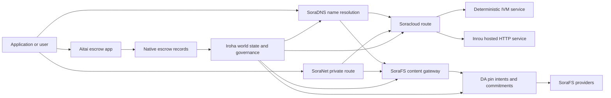

# SORA Nexus አገልግሎቶች {#sora-nexus-services}

SORA Nexus በ Iroha 3 ዙሪያ መተግበሪያን የሚመለከቱ የአገልግሎት ንብርብሮችን ይጨምራል። እነዚህ አገልግሎቶች የተለዩ የብሎክቼይን መዝገቦች አይደሉም። በ Iroha የአለም መንግስት፣ Norito ቴክኒካል መገለጫዎች፣ የአስተዳደር መዝገቦች እና Torii የመንገድ ቤተሰቦች የተጣበቁ ናቸው።

ተገኝነት በኖድ ግንባታ እና በአውታረ መረብ መገለጫ ላይ የተመሰረተ ነው. ጥቅም [`/openapi.json`](/am/reference/torii-endpoints.md#app-and-sora-route-families) የተፈጠረ መተግበሪያን ለማግኘት API በዒላማው ኖድ ላይ መንገዶች. የህዝብ አካባቢያዊ SoraFS CID እና የታወቁ መንገዶች ከዚያ የመነጨ ሰነድ ውጭ ተጭነዋል፣ ስለዚህ ማሰማራትን ሲፈትሹ እነዚያን መንገዶች በቀጥታ ይመርምሩ።

## አካል ካርታ {#component-map}

|አካል|ሚና|ዋና ገጽታዎች|
| ---------------------- | ------------------------------------------------------------------------------------------------------------------------------------------- | ---------------------------------------------------------------------------------------- |
|Soracloud|የመተግበሪያ ማሰማራት፣ የተስተናገዱ አገልግሎቶች፣ የግል ሞዴል/የአሂድ ጊዜ ሁኔታ እና የአገልግሎት የህይወት ዑደት ቁጥጥር።|`/v1/soracloud/*`፣ `/api/*`፣ `iroha soracloud service ...`|
| Inrou | የቀጥታ HTTP ንብርብ ለሚፈልጉ የአገልግሎት ክለሳዎች Soracloud የሚያስተናግደው HTTP አፈጻጸም አካባቢ። | የ Soracloud አፈጻጸም ውቅር፣ የአስተናጋጅ ችሎታ ማስታወቂያዎች፣ የቅጂ አፈጻጸም ሁኔታ |
|SoraNet|ለወረዳዎች የግላዊነት እና የትራንስፖርት ተደራቢ ለወረዳዎች፣ ለትራፊክ ማስተላለፊያ፣ VPN፣ ክፍለ ጊዜዎችን ያገናኙ እና የዥረት መስመሮች።|`/v1/connect/*`፣ `/v1/vpn/*`፣ SoraNet መንገድ ሜታዳታ|
|የውሂብ ተገኝነት (DA)|በ Nexus የማስፈጸሚያ መስመሮች፣ SoraFS ቴክኒካል መገለጫዎች እና የማረጋገጫ ፍሰቶች ለሚጠቀሱ ጭነቶች የመገኘት ማስረጃ፣ ክሪፕቶግራፊያዊ ኮሚትመንት እና የፒን-ዓላማ ንብርብር።|`/v1/da/*`፣ `FindDaPinIntent*`፣ `[nexus.da]`|
|SoraFS|ለቴክኒካል ማኒፌስቶች፣ CAR ጭነቶች፣ የተሰካ ይዘት፣ ጌትዌይ ማምጣት እና የመልሶ ማግኛ ፍሰቶች በይዘት ላይ የተመሰረተ የማከማቻ ጨርቅ።|`/v1/sorafs/*`፣ `/sorafs/*`፣ `FindSorafsProviderOwner`|
|SoraDNS|ለ SORA ለሚስተናገዱ አገልግሎቶች እና ይዘቶች ዲተርሚኒስቲክ ስያሜ እና የመፍትሄ ማረጋገጫ ንብርብር።|`/v1/soradns/*`፣ `/soradns/*`፣ የመፍትሄ ማውጫ ክስተቶች|
|ላይህ እፈልጋለሁ|የመተግበሪያ ደረጃ fiat እና የንብረት የፋይናንሺያል ግብይት ማጠናቀቂያ ኮሪደር በተለየ የብሎክቼይን መዝገብ ሳይሆን በአገሬው የማስያዣ መዝገቦች የተደገፈ።|`OpenAssetEscrow`፣ `FindAssetEscrow*`፣ `EscrowEventFilter`፣ Kotodama `escrow_*` አብሮገነብ|



## የተለመዱ ፍሰቶች {#common-flows}

### የተስተናገደ የተከፈለ መተግበሪያ {#hosted-split-application}

የተለመደው የተደባለቀ ንብርብር መተግበሪያ ሁሉንም ቁርጥራጮች አንድ ላይ ይጠቀማል -

1. የማይንቀሳቀስ የፊት ለፊት ንብረቶች በ SoraFS በኩል ተጭነዋል እና ተሰክተዋል።
2. ለምሳሌ `<app>.sora` የሕዝብ አስተናጋጅ በ SoraDNS ተመዝግቧል።
3. Soracloud መንገዶች `/api/v1/search` ወይም `/api/v1/stream` ወደ Inrou HTTP አገልግሎት።
4. Soracloud መንገዶች `/api/auth` እና `/api/v1/user` ወደ ዲተርሚኒስቲክ IVM ተቆጣጣሪዎች።
5. ግላዊነት የሚያስፈልጋቸው ደንበኞች በ SoraNet ወረዳ በኩል ተመሳሳይ ይዘት ወይም API መንገድ መድረስ ይችላሉ።

|መንገድ|ደጋፊ ንብርብር|ለምን|
| ----------------- | --------------------- | ------------------------------------------------- |
| `/`               |SoraFS የማይንቀሳቀስ ይዘት|ሊባዛ የሚችል ይዘት ስርወ እና ጌትዌይ መሸጎጫ|
|`/assets/*`|SoraFS የማይንቀሳቀስ ይዘት|በይዘት ላይ የተያያዙ ንብረቶች እና ቴክኒካዊ አንጸባራቂ ማረጋገጫዎች|
|`/api/auth*`|Soracloud IVM|እንደገና አጫውት-ደህንነቱ የተጠበቀ የማረጋገጫ እና የኪስ ቦርሳ ፈታኝ ሁኔታ|
|`/api/v1/user*`|Soracloud IVM|አስተዳደር-sensitive የመንግስት ሚውቴሽን|
|`/api/v1/search*`|Soracloud ኢንሩ|የቀጥታ HTTP አገልግሎት፣ መሸጎጫ፣ SSE ወይም ሰብሳቢ ሁኔታ|

### የይዘት ህትመት {#content-publication}

SoraFS ሕትመት አንድ ስም ወደ እነሱ ከመጠቆሙ በፊት ዘላቂ አርቲፋክቶችን ይፈጥራል፦

1. ጭነት ወይም ማውጫ።
2. ወደ CAR ማህደር እና ቁራጭ እቅድ ያሽጉት።
3. በፒን ፖሊሲ እና የአስተዳደር ውሂብ Norito ቴክኒካዊ ማኒፌስት ይገንቡ።
4. ቴክኒካል ማኒፌስት ለ Torii ያስገቡ።
5. የታለመው መገለጫ ግልጽ ማስረጃ ሲፈልግ የ DA የፒን ዓላማ ወይም ተገኝነት ክሪፕቶግራፊያዊ ኮሚትመንት ይመዝግቡ።
6. ቴክኒካል ማኒፌስት ከ SoraDNS ስም ወይም Soracloud የማይንቀሳቀስ የፊት መስመር ጋር ያያይዙት።

### የግል ማምጣት ወይም የዥረት መንገድ {#private-fetch-or-streaming-route}

SoraNet SoraFS ወይም Soracloud ፊት ለፊት መቀመጥ ይችላል -

1. ደንበኛው ስሙን ወይም ቴክኒካዊ ማኒስቴርን ይፈታል.
2. የጥበቃ ማውጫ ወይም የመንገድ ቴክኒካል ማኒፌስት የመግቢያ እና መውጫ ቅብብሎሾችን ይመርጣል።
3. ትራፊክ የታሸገ እና በ SoraNet ወረዳ በኩል ይላካል።
4. የመውጫ ቅብብሎሽ ወደ SoraFS መግቢያ፣ Torii ጅረት ወይም Soracloud መንገድ ይደርሳል።

## እንናፍቅሻለሁ {#aitai}

አይታይ ነው SORA ገዢ እና ሻጭ ከሰንሰለት ውጪ ክፍያን የሚያስተባብሩበት የመተግበሪያ ኮሪደር ለገበያ ቦታ አይነት የፋይናንሺያል ግብይት ማጠናቀቂያ እያለ Iroha በሰንሰለት ላይ ያለውን የንብረት ጥበቃ ይቆጣጠራል። የአገሬው ተወላጅ የ escrow መመሪያን መጠቀም አለበት ለአዲስ የቁጥር-ንብረት ጥበቃ ፍሰቶች በኮንትራት ባለቤትነት ከተያዘው የዋስክ ሂሳብ ይልቅ ቤተሰብ።

ቤተኛ escrow በብሎክቼይን መዝገብ ውስጥ ጥበቃን ይይዛል። ሻጩ በ`OpenAssetEscrow` ቅናሽ ይከፍታል፣ ገዢው ከሰንሰለት ውጪ ክፍያን በ`AcceptAssetEscrow` እና `MarkEscrowPaymentSent` ይቀበላል እና ምልክት ያደርጋል። እና ሻጩ በ `ReleaseAssetEscrow` ይለቀቃል ወይም ክፍያው ምልክት ከመደረጉ በፊት ይሰርዛል። ገዢው እና ሻጩ ካልተስማሙ ሁለቱም ወገኖች አለመግባባትን ሊከፍቱ ይችላሉ እና `CanResolveEscrowDispute` ያለው ፈቺ የተቆለፈውን መጠን መከፋፈል ይችላል።

ሙሉውን የሕይወት ዑደት፣ አጠቃላይ የንብረት መቆለፊያዎች፣ ስም-አልባ escrow፣ መጠይቆች፣ ክስተቶች እና የ Rust ምሳሌዎች ለማየት [ቤተኛ የንብረት Escrow](/am/blockchain/escrow.md)ን ይመልከቱ።

|አይታይ ወለል|ለ ተጠቀምበት|
| ------------------------------------------------------------------------------------------------------------------------------------------------------------- | ----------------------------------------------------------------------------------------- |
|`OpenAssetEscrow`፣ `AcceptAssetEscrow`፣ `MarkEscrowPaymentSent`፣ `ReleaseAssetEscrow`፣ `CancelAssetEscrow`|ግልጽ የቁጥር ንብረት ቅናሾች፣ XOR የተመደበ የፋይናንሺያል ግብይት ማቋቋሚያ ፍሰቶችን ጨምሮ።|
|`OpenAnonymousAssetEscrow`፣ `AcceptAnonymousAssetEscrow`፣ `MarkAnonymousEscrowPaymentSent`፣ `ReleaseAnonymousAssetEscrow`፣ `CancelAnonymousAssetEscrow`|Shielded ለገንዘብ ድጋፍ እና ለመዝጋት እንቅስቃሴዎችን የመጠቀም ማረጋገጫ አባሪዎችን ያቀርባል።|
|`OpenEscrowDispute`፣ `ResolveEscrowDispute`፣ `OpenAnonymousEscrowDispute`፣ `ResolveAnonymousEscrowDispute`|የክርክር መግቢያ እና የፍርድ ቤት አይነት መፍትሄ።|
|`FindAssetEscrowById`፣ `FindAssetEscrowsBySeller`፣ `FindAssetEscrowsByBuyer`፣ `FindAssetEscrowsByStatus`|የመተግበሪያ ሁኔታ ገፆች፣ የማስታረቅ ስራዎች እና የድጋፍ መሳሪያዎች።|
|`EscrowEventFilter`|በ escrow መታወቂያ፣ ሻጭ፣ ገዢ፣ ሁኔታ ወይም የክስተት አይነት የቀጥታ ግልጽ የማስያዣ ምዝገባዎች።|
|Kotodama `escrow_open_offer`፣ `escrow_accept`፣ `escrow_mark_payment_sent`፣ `escrow_release`፣ `escrow_cancel`፣ `escrow_open_dispute`፣ `escrow_resolve_dispute`|Kotodama በ V1 escrow syscalls የተደገፉ የኮንትራት ጥሪዎች።|

ለህዝብ Taira ወይም Minamoto አጠቃቀም፣ ከሰንሰለት ውጪ ያለውን የክፍያ ሀዲድ እና ማንኛውንም ድጋፍ ወይም የፍርድ ቤት የስራ ፍሰት እንደ ማመልከቻ ፖሊሲ ይያዙት። Iroha ይመዘግባል የጥበቃ ሁኔታ፣ የህይወት ኡደት ክስተቶች፣ የማስረጃ ምስጠራ ሃሽ እና የመጨረሻ የንብረት እንቅስቃሴ; የ fiat የፋይናንሺያል ግብይት ማጠናቀቂያን በራሱ አያረጋግጥም።

## የዒላማ ኖድን ያረጋግጡ {#check-a-target-node}

ከዚህ ገጽ ምሳሌዎችን ከመጠቀምዎ በፊት፣ እርስዎ በሚያነጣጥሩት ኖድ ላይ የመንገድ ቤተሰብ መኖሩን ያረጋግጡ -

```bash
export TORII_URL=https://taira.sora.org

curl -fsS "$TORII_URL/openapi.json" \
  | jq '.paths | keys[] | select(test("^/v1/(soracloud|sorafs|soradns|connect|vpn|da)/"))'

curl -fsS -H 'Accept: application/json' "$TORII_URL/status" | jq .
```

`/openapi.json` ነጠላ ፕሮቶኮል-ስታንዳርድ OpenAPI API የመጨረሻ ነጥብ ነው።. ትክክለኛው የመንገድ ተገኝነት በግንባታ ባህሪያት እና በአውታረ መረብ ውቅር ላይ የተመሰረተ ነው. ሰነዱ የህዝብ አካባቢያዊ SoraFS CID እና የታወቁ መንገዶችን አይዘረዝርም; ከታች እንደተገለፀው እነዚያን API የመጨረሻ ነጥቦች በቀጥታ ያረጋግጡ።

### Taira የተነበበ-ብቻ የጭስ ማረጋገጫዎች {#taira-read-only-smoke-checks}

ይፋዊ Taira API የመጨረሻ ነጥብ ለተነባቢ-ጎን ቼኮች ጠቃሚ ነው፣ ነገር ግን የተፈቀደ መለያ ካልሰሩ እና ይፋዊ የቴስትኔት ሁኔታን ለመቀየር ካላሰቡ በስተቀር ለተለዋዋጭ ምሳሌዎች አይጠቀሙበት።

```bash
export TORII_URL=https://taira.sora.org

curl -fsS -H 'Accept: application/json' "$TORII_URL/status" \
  | jq '{version: .build.version, peers, blocks, lanes: (.teu_lane_commit | length)}'

curl -fsS "$TORII_URL/v1/vpn/profile" \
  | jq '{available, relay_endpoint, supported_exit_classes}'

curl -fsS "$TORII_URL/v1/sorafs/storage/peers?limit=4" \
  | jq '{gateway_base_url, pin_torii_urls}'

curl -fsS -H 'Accept: application/json' "$TORII_URL/v1/soracloud/status" \
  | jq '.control_plane | {service_count, services: [.services[] | {service_name, current_version}]}'
```

Taira በ OpenAPI የመንገድ ካርታ ውስጥ ያልተካተቱ ማሰማራት-ተኮር የመቆጣጠሪያ-ንብርብር መንገዶችን ሊያሳይ ይችላል።. `/openapi.json`ን ለሚያካትቱት መንገዶች እንደ የመነጨ ውል አድርገው ያስቡበት፣ ከዚያ ማሰማራት-ተኮር እና ይፋዊ የአካባቢ SoraFS መንገዶችን እንዳሉ ከመመዝገብዎ በፊት በቀጥታ ያረጋግጡ።

## Soracloud {#soracloud}

Soracloud የ SORA የመተግበሪያ መቆጣጠሪያ ንብርብር ነው። የማሰማራት ቅርቅቦችን፣ የአገልግሎት ክለሳዎችን፣ ማዘዋወርን፣ የልቀት ሁኔታን፣ ስልጣን ያለው የማዋቀር ግቤቶችን፣ ኢንክሪፕት የተደረጉ የአገልግሎት ሚስጥሮችን፣ የሞዴል መዝገብ መዝገቦችን፣ የግል የማጣቀሻ ክፍለ ጊዜዎችን እና የሶፍትዌር ማስፈጸሚያ አካባቢ ደረሰኞችን ይከታተላል።

Soracloud ሁለት የማስፈጸሚያ ንብርብሮችን ይጠቀማል -

|የማስፈጸሚያ ንብርብር|የሶፍትዌር ማስፈጸሚያ አካባቢ|ለ ተጠቀምበት|
| ---------------------- | ------- | -------------------------------------------------------------------------------------------- |
|`DeterministicService`|`Ivm`|Auth፣ ቮልት ሁኔታ፣ የተረጋገጡ ንባቦች፣ የታዘዙ የመልእክት ሳጥን ተቆጣጣሪዎች፣ አስተዳደር-ሚስጥራዊነት ያላቸው ሚውቴሽን|
|`HttpService`|`Inrou`|የቀጥታ ስርጭት HTTP APIs፣ ሰብሳቢ-ከባድ ስራ፣ በመሸጎጫ የተደገፉ አገልግሎቶች፣ SSE፣ በአሳሽ የታገዘ ፍሰቶች|

የመቆጣጠሪያው ንብርብር ስልጣን ያለው ነው. ማሰማራት፣ ማሻሻል፣ መመለስ፣ ማዋቀር፣ ሚስጥር፣ ሞዴል እና የሁኔታ ትዕዛዞችን በ Torii በኩል ያስገባሉ እና የተጠናቀቀውን የአለም ሁኔታ ያንብቡ። በተለየ CLI-የአካባቢ መስታወት ላይ አይተማመኑም። ይፋዊ ማዘዋወር በረጅሙ ቅድመ ቅጥያ ላይ የተመሰረተ ነው፣ ስለዚህ አንድ የተመዘገበ አስተናጋጅ ትራፊክን በተስተናገዱ HTTP መንገዶች እና ዲተርሚኒስቲክ API መንገዶች መካከል መከፋፈል ይችላል።

### የተፈጠረ ጀማሪ መዋቅር የተከፈለ መተግበሪያ {#scaffold-a-split-app}

የተከፈለ መተግበሪያ አብነት የማይንቀሳቀስ የፊት ለፊት እና አንድ የተስተናገደ የቀጥታ API እና አንድ ዲተርሚኒስቲክ ቮልት/API አገልግሎት ይፈጥራል -

```bash
iroha soracloud app init \
  --template split-app \
  --app-name solswap_indexer \
  --app-version 0.1.0 \
  --public-host solswap-indexer.sora \
  --output-dir ./apps/solswap-indexer

iroha soracloud app plan \
  --manifest ./apps/solswap-indexer/app_manifest.json

iroha soracloud app doctor \
  --manifest ./apps/solswap-indexer/app_manifest.json
```

`plan` የመንገድ ክፍፍልን፣ የህጻናት አገልግሎት ቴክኒካል ማኒፌስቲኮችን፣ የስራ ቦታ ስክሪፕት ዱካዎችን እና የሚጠበቀውን የፊት ለፊት የህትመት ሁነታን ያትማል።. `doctor` Torii ከማካተትዎ በፊት የአካባቢ መልቀቂያ ውልን ያረጋግጣል።

### የመተግበሪያ ሁኔታን ያሰማሩ እና ይፈትሹ {#deploy-and-inspect-app-state}

ለእያንዳንዱ የመልቀቂያ ሙከራ አንድ የወደፊት SoraFS የማቆያ ዘመንን እንደገና ይጠቀሙ። የተከፈለ መተግበሪያ አብነት የInrou አገልግሎት ስለያዘ፣ ከመስመር ላይ ሚውቴሽን በፊት በተመረጡት ከመስመር ውጭ አቅራቢ መደብሮች ውስጥ ትክክለኛውን አርቲፋክት ብቁ ያድርጉት -

```bash
export SORACLOUD_TORII_URL=https://<soracloud-enabled-torii>
export SORAFS_RETENTION_EPOCH=<future-unix-seconds>

iroha soracloud app preseed \
  --manifest ./apps/solswap-indexer/app_manifest.json \
  --sorafs-retention-epoch "$SORAFS_RETENTION_EPOCH" \
  --inrou-preseed-target <validator-account,peer-id,absolute-store-path> \
  --inrou-preseed-max-capacity-bytes <bytes> \
  --inrou-preseed-helper /absolute/path/to/sorafs-node \
  --inrou-preseed-helper-sha256 <lowercase-sha256> \
  --receipt-out /absolute/path/to/solswap-inrou-preseed.json

iroha soracloud app release \
  --manifest ./apps/solswap-indexer/app_manifest.json \
  --sorafs-retention-epoch "$SORAFS_RETENTION_EPOCH" \
  --inrou-preseed-receipt /absolute/path/to/solswap-inrou-preseed.json \
  --torii-url "$SORACLOUD_TORII_URL"

iroha soracloud app status \
  --manifest ./apps/solswap-indexer/app_manifest.json \
  --torii-url "$SORACLOUD_TORII_URL"
```

በማሰማራት ፖሊሲው ለሚፈለገው እያንዳንዱ አቅራቢ መደብር `--inrou-preseed-target` ይድገሙት። `release` ቴክኒካዊ ማኒፌስቶችን ይገነባል እና ያመሳስላል፣ የመተግበሪያውን ዶክተር ያካሂዳል፣ አንድ ነጠላ ፕሮቶኮል-ደረጃውን የጠበቀ የመተግበሪያ-መሠረተ ልማት ሚውቴሽን ያቀርባል፣ ስልጣን ያለው ሁኔታን ያስታርቃል እና የታወጁትን የቀጥታ ኢላማዎች ያረጋግጣል። መተግበሪያው የInrou አርቲፋክቶችን ሲይዝ የቅድመ ደረሰኝ አማራጭ አይደለም።

አስቀድሞ ለተዘረጋ አገልግሎት፣ በአገልግሎት ወሰን ያላቸውን ትዕዛዞች ይጠቀሙ -

```bash
iroha soracloud service status \
  --service-name solswap_indexer_live \
  --torii-url "$SORACLOUD_TORII_URL"

iroha soracloud service rollback \
  --service-name solswap_indexer_live \
  --target-version 0.1.0 \
  --torii-url "$SORACLOUD_TORII_URL"
```

### ውቅር እና ሚስጥራዊ ቁሳቁስ {#config-and-secret-material}

የ Soracloud ውቅር እና ሚስጥራዊ ግቤቶች የባለሥልጣን የማሰማራት ሁኔታ አካል ናቸው። አስፈላጊ የውቅር ወይም የሚስጥር ትስስሮች ሲጎድሉ ወይም ከንቁ ማኒፌስቶች ጋር ሳይጣጣሙ፣ ማሰማራት፣ ማሻሻል እና ወደ ቀድሞ ሁኔታ መመለስ በአስተማማኝ ሁኔታ ውድቅ ይሆናሉ።

```bash
iroha soracloud service config-set \
  --service-name solswap_indexer_live \
  --config-name indexer/public_config \
  --value-file ./config/public-config.json \
  --torii-url "$SORACLOUD_TORII_URL"

iroha soracloud service secret-set \
  --service-name solswap_indexer_live \
  --secret-name indexer/api_key \
  --secret-file ./secrets/api-key.envelope.json \
  --torii-url "$SORACLOUD_TORII_URL"
```

በመገለጫዎ ለሚፈለጉት ትክክለኛ የምስክርነት ባንዲራዎች የ CLI እገዛን ይጠቀሙ -

```bash
iroha soracloud service config-set --help
iroha soracloud service secret-set --help
```

## Inrou {#inrou}

Inrou በ Soracloud ጥቅም ላይ የሚውለው የተስተናገደ HTTP የሶፍትዌር ማስፈጸሚያ አካባቢ ነው። የተከተተ Soracloud የሶፍትዌር ማስፈጸሚያ አካባቢ ፕሮጀክቶች የተቀበሉት Iroha ኖድ Soracloud ወደ አካባቢያዊ የቁሳቁስ እቅድ ይግዙ፣ የተስተናገዱ አገልግሎት ቅጂዎችን እንደ loopback አገልግሎቶች ይጀምራል፣ እና የተባዛ የሶፍትዌር ማስፈጸሚያ አካባቢ ሁኔታን ወደ ስልጣን ሞዴል ሪፖርት ያደርጋል።

እንደ ሰብሳቢ-ከባድ APIs፣ SSE ዥረቶች፣ በመሸጎጫ የተደገፉ ተቆጣጣሪዎች ወይም በአሳሽ የታገዙ አገልግሎቶች ላሉ የቀጥታ HTTP ወለል ለሚያስፈልጋቸው የስራ ጫናዎች Inrouን ይጠቀሙ።

### የሶፍትዌር ማስፈጸሚያ አካባቢ መስፈርቶች {#runtime-requirements}

- የኮንቴይነር ቴክኒካል አንጸባራቂ ሶፍትዌር ማስፈጸሚያ አካባቢ `Inrou` መሆን አለበት።
- የአገልግሎት ቴክኒካል አንጸባራቂ ማስፈጸሚያ ንብርብር `HttpService` መሆን አለበት።
- `HttpService + Inrou` በትክክል አንድ `PersistentRootLeaseVolume` በ `/` ላይ የተገጠመ ይፈልጋል።
- የተባዙ የInrou አገልግሎቶች ተለዋዋጭ የጋራ ሁኔታን ሲይዙ የጋራ አገልግሎት ወይም ሚስጥራዊ የሊዝ ማከማቻ ያስፈልጋቸዋል።
- የምርት ማስተናገጃ አንጓዎች እንደ ተኪ ብቻ ከመስራት ይልቅ እውነተኛ የInrou አቅምን ማስተዋወቅ አለባቸው።

### የቴክኒክ ማገለጫ ቁርጥራጭ {#manifest-fragment}

ከታች ያለው ምሳሌ የሁለቱን ቴክኒካዊ መግለጫዎች ቅርፅ ያሳያል. እሱ ቁርጥራጭ እንጂ ሙሉ በሙሉ የማሰማራት ጥቅል አይደለም።

```jsonc
// container_manifest.json
{
  "schema_version": 1,
  "runtime": { "runtime": "Inrou", "value": null },
  "bundle_path": "/bundles/solswap-indexer.inrou",
  "entrypoint": "/app/bin/launch-indexer.sh",
  "args": [],
  "env": {
    "RUST_LOG": "info",
  },
  "inrou": {
    "schema_version": 1,
    "guest_os": { "guest_os": "DebianSlim", "value": null },
    "guest_images": {
      "x86_64": {
        "kernel_image_path": "/inrou/x86_64/vmlinux",
        "rootfs_image_path": "/inrou/x86_64/rootfs.ext4",
        "initrd_image_path": null,
      },
      "aarch64": {
        "kernel_image_path": "/inrou/aarch64/vmlinux",
        "rootfs_image_path": "/inrou/aarch64/rootfs.ext4",
        "initrd_image_path": null,
      },
    },
  },
  "lifecycle": {
    "start_grace_secs": 60,
    "stop_grace_secs": 30,
    "healthcheck_path": "/api/indexer/v1/health",
  },
}
```

```jsonc
// service_manifest.json
{
  "schema_version": 1,
  "service_name": "solswap_indexer_live",
  "service_version": "0.1.0",
  "execution_plane": { "execution_plane": "HttpService", "value": null },
  "replicas": 2,
  "route": {
    "host": "solswap-indexer.sora",
    "path_prefix": "/api/v1/search",
    "service_port": 8080,
    "visibility": { "visibility": "Public", "value": null },
    "tls_mode": { "tls": "Required", "value": null },
  },
  "lease_volumes": [
    {
      "volume_name": "root_disk",
      "kind": {
        "lease_volume": "PersistentRootLeaseVolume",
        "value": null,
      },
      "storage_class": { "storage_class": "Warm", "value": null },
      "mount_path": "/",
      "max_total_bytes": 8589934592,
    },
    {
      "volume_name": "index_state",
      "kind": { "lease_volume": "ServiceLeaseVolume", "value": null },
      "storage_class": { "storage_class": "Warm", "value": null },
      "mount_path": "/var/lib/solswap-indexer",
      "max_total_bytes": 1073741824,
    },
  ],
}
```

በሶፍትዌር ማስፈጸሚያ አካባቢ፣ እያንዳንዱ የተጫነ የሊዝ መጠን ከድምጽ ስም በተገኙ የአካባቢ ተለዋዋጮች ይጋለጣል -

```text
SORACLOUD_LEASE_VOLUME_ROOT_DISK_DIR
SORACLOUD_LEASE_VOLUME_ROOT_DISK_MOUNT_PATH
SORACLOUD_LEASE_VOLUME_INDEX_STATE_DIR
SORACLOUD_LEASE_VOLUME_INDEX_STATE_MOUNT_PATH
```

## SoraNet {#soranet}

SoraNet የግላዊነት እና የመጓጓዣ ተደራቢ ነው። ከዒላማው መግቢያ በር ወይም አገልግሎት ጋር በቀጥታ መገናኘት የሌለባቸው ትራፊክ ቅብብሎሽ ላይ የተመሰረቱ መንገዶችን ያቀርባል። የትራንስፖርት ዲዛይኑ የመግቢያ፣ የመሃል እና የመውጫ ቅብብሎሽ ሚናዎችን፣ QUIC ትራንስፖርትን፣ በጩኸት ላይ የተመሰረተ ድብልቅ የእጅ መጨባበጥን፣ የአቅም ድርድርን፣ የማስተላለፊያ ማውጫ ሜታዳታ እና ቋሚ መጠን ያላቸው የታሸጉ ሴሎችን ይጠቀማል።

በ Nexus ማሰማራቶች ውስጥ፣ SoraNet የይዘት ማምጣትን፣ የጌትዌይ ትራፊክን፣ VPN ወይም የግንኙነት ክፍለ ጊዜዎችን እና Norito የዥረት መንገዶችን መያዝ ይችላል። የማውጫ ግቤቶች `norito-stream`ን የሚደግፉ ቅብብሎሾችን ምልክት ማድረግ ይችላሉ፣ ይህም ደንበኞች ለ Torii RPC ወይም ለዥረት ትራፊክ ተስማሚ የሆኑ መንገዶችን እንዲመርጡ ያስችላቸዋል።

### የዥረት ውቅር {#streaming-configuration}

የ Nexus መገለጫ ለዥረት መንገዶች SoraNet አቅርቦትን ያስችላል -

```toml
[streaming]
feature_bits = 0b11

[streaming.soranet]
enabled = true
exit_multiaddr = "/dns/torii/udp/9443/quic"
padding_budget_ms = 25
access_kind = "authenticated"
provision_spool_dir = "./storage/streaming/soranet_routes"
provision_spool_max_bytes = 0
provision_window_segments = 4
provision_queue_capacity = 256
```

የተመልካች ማረጋገጫ ለማይፈልጉ የይዘት መንገዶች `access_kind = "read-only"`ን ይጠቀሙ። ወደ Torii ወይም የተስተናገደ አገልግሎት ከማገናኘቱ በፊት የመውጫ ቅብብሎሽ ትኬቶችን ወይም የተመልካች ማንነትን ማስፈጸም ሲኖርበት `authenticated`ን ይጠቀሙ።

### SoraNet-አዋቂ SoraFS አምጣ {#soranet-aware-sorafs-fetch}

የ SoraFS ማምጣት CLI የአካባቢ ተኪ ቴክኒካል ማኒፌስት እና የአሳሽ ቅጥያዎች ወይም SDK አስማሚዎች የመስመር ሜታዳታ SoraNet ማመንጫ ይችላል። ኦርኬስትራተሩ JSON `local_proxy`ን በ`"emit_browser_manifest": true` መግለፅ አለበት፣ እና CLI በ`local-quic-proxy` ድጋፍ መገንባት አለበት። በ Taira ላይ፣ የተቀበለውን የአቅራቢ ካታሎግ በይፋዊ የቴስትኔት ስርወ ላይ ይፈትሹ፣ ከዚያ ለዚያ አቅራቢ የተሰጠውን የተጠበቀ አቅራቢ ቱፕል ይሙሉ።

```bash
export TAIRA_ROOT=https://taira.sora.org
curl -fsS "$TAIRA_ROOT/v1/sorafs/providers?limit=20" | jq '.providers'

: "${TAIRA_SORAFS_PROVIDER_ID:?set the admitted provider ID from Taira discovery}"
: "${TAIRA_SORAFS_GATEWAY_KEY:?set the provider gateway key}"
: "${TAIRA_SORAFS_PROVIDER_URL:?set the advertised provider base URL}"
: "${TAIRA_SORAFS_STREAM_TOKEN_FILE:?set the issued stream-token file}"

cargo run -p sorafs_orchestrator --features=local-quic-proxy --bin=sorafs_cli -- \
  fetch \
  --plan=artifacts/payload_plan.json \
  --manifest-id=<manifest-digest-hex> \
  --orchestrator-config=artifacts/orchestrator.json \
  --provider=name=taira,provider-id="$TAIRA_SORAFS_PROVIDER_ID",gateway-key="$TAIRA_SORAFS_GATEWAY_KEY",base-url="$TAIRA_SORAFS_PROVIDER_URL",stream-token="$(cat "$TAIRA_SORAFS_STREAM_TOKEN_FILE")" \
  --output=artifacts/payload.bin \
  --json-out=artifacts/fetch_summary.json \
  --local-proxy-manifest-out=artifacts/proxy_manifest.json \
  --local-proxy-mode=bridge \
  --local-proxy-norito-spool=storage/streaming/soranet_routes \
  --local-proxy-kaigi-spool=storage/streaming/soranet_routes \
  --local-proxy-kaigi-policy=authenticated \
  --max-peers=2 \
  --retry-budget=4
```

ማጠቃለያው የአቅራቢ ሪፖርቶችን፣ የደረሰኞችን፣ የአካባቢ ተኪ ሜታዳታን እና ለማምጣት ጥቅም ላይ የዋሉ ውጤታማ የመንገድ ቅንብሮችን ይመዘግባል።

### የማስተላለፊያ ማበረታቻ አረጋጋጭ ዝርዝር {#relay-incentive-verifier-roster}

የማስተላለፊያ ማበረታቻ ወደ ውስጥ ማስገባት አልተሳካም። `incentives.enable` እውነት ሲሆን `incentives.trusted_verifier_ids` ቢያንስ አንድ ነጠላ ፕሮቶኮል-መደበኛ መለያ መታወቂያ መያዝ አለበት። ዝርዝሩ ከ64 መብለጥ የለበትም። ግቤቶች፣ ማበረታቻዎች ቢሰናከሉም። የሶፍትዌር ማስፈጸሚያ አካባቢ እንደ ዲተርሚኒስቲክ የታዘዘ ስብስብ ያከማቻል፣ እና ቅብብሎሽ በሚነሳበት ጊዜ ልክ ያልሆነ የስም ዝርዝር ጂኦሜትሪ ውድቅ ያደርጋል።

እያንዳንዱ `RelayBandwidthProofV1` በቋሚ ፍሬም/ምደባ በጀት ዲኮድ ተደርጎበታል እና ሙሉውን ፍሬም መብላት አለበት። የማረጋገጫው አረጋጋጭ መለያ በተዋቀረው ዝርዝር ውስጥ መገኘት አለበት፣ እና `RelayBandwidthProofV1::verify_signature()` ስኬታማ መሆን አለበት፣ ቅብብሎሹ ከመቆለፉ ወይም የአፈጻጸም ማከማቻውን ከመቀየሩ በፊት። የማይታመን ምስጠራ ፈራሚ ወይም ፊርማ-ልክ ያልሆነ/የተበላሸ ማረጋገጫ ስለዚህ ምንም አይነት መለኪያ አያበረክትም እና የማበረታቻ ቅጽበታዊ ገጽ እይታ መስራት አይችልም።

## የውሂብ ተገኝነት (DA) {#data-availability-da}

DA በጣም ትልቅ፣ ለግላዊነት-ስሜታዊ ወይም በቀጥታ በአለም ሁኔታ ውስጥ ለማስቀመጥ በጣም አገልግሎት-ተኮር ለሆኑ ጭነቶች የተገኘ-ማስረጃ ንብርብር ነው።. አረጋጋጮች፣ መግቢያዎች እና ደንበኞች የትኞቹ ባይቶች ቃል እንደተገባ፣ የትኛው ፖሊሲ እንደሚተገበር እና የትኞቹ ማስረጃዎች እንደታዩ መስማማት እንዲችሉ ዲተርሚኒስቲክ የክሪፕቶግራፊያዊ ኮሚትመንቶችን እና የመልሶ ማግኛ ግዴታዎችን ይመዘግባል።

DA Kura ወይም SoraFS አይተካም

- Kura የተጠናቀቀውን የብሎክ ዥረት እና የጋራ መግባባት መልሶ ማግኛ ውሂብን ያከማቻል።
- SoraFS በይዘት አድራሻ የተሰሩ ባይቶችን፣ CAR ጭነቶችን እና ቴክኒካዊ መግለጫዎችን ያከማቻል እና ያገለግላል።
- DA እነዚያ ባይቶች መርሐግብር እንዲይዙ፣ እንዲመረመሩ እና ከብሎክቼይን መዝገብ ሁኔታ ጋር እንዲገናኙ የሚያስችላቸውን የክሪፕቶግራፊያዊ ኮሚትመንቶችን፣ የማረጋገጫ ፖሊሲዎችን፣ የማረጋገጫ ክፍተቶችን እና የፒን አላማዎችን ይመዘግባል።.

አፕሊኬሽኑ ወይም Nexus የማስፈጸሚያ መስመር በብሎክቼይን መዝገብ ውስጥ ከሰንሰለት ውጪ ያለው መረጃ ሊገኝ እንደሚችል የሚታይ ቃል ኪዳን ሲፈልግ DA ይጠቀሙ። የተለመዱ ምሳሌዎች ለፋይናንሺያል ግብይት ማቋቋሚያ ፍሰቶች የማስፈጸሚያ መስመር ጭነት ክሪፕቶግራፊያዊ ኮሚትመንቶች፣ SoraFS ለታተመ ይዘት ፒን ዓላማዎች፣ ለበኋላ ማረጋገጫ መቀመጥ ያለባቸው የማረጋገጫ ጥቅሎች፣ እና የህዝብ ሁኔታቸው ከሙሉ ጭነት ይልቅ የምስጠራ ዳይጀስት እሴት መሆን ያለበት የመተግበሪያ አርቲፋክቶች።

### የሕይወት ዑደት {#lifecycle}

|ደረጃ|ምን ተመዝግቧል|
| ---------- | ----------------------------------------------------------------------------------------------------------------------------------------------------- |
|ዓላማ|ትኬት፣ ቴክኒካል አንጸባራቂ ማጣቀሻ፣ ተለዋጭ ስም፣ ሌይን/ዘመን/ቅደም ተከተል ማጣቀሻ፣ የማቆያ ፖሊሲ ወይም የማባዛት ኢላማ።|
| ኮሚትመንት | ማኒፌስቱን፣ የመስመር ጭነቱን፣ የማረጋገጫ ጥቅሉን ወይም የይዘት ሥሩን በመዝገቡ ላይ ከሚታየው መዝገብ ጋር የሚያስተሳስር የዳይጀስት ውሂብ። |
|ማስረጃ|ተገኝነት ድምጾች፣ የማረጋገጫ ክፍተቶች፣ የአቅራቢ ማረጋገጫዎች ወይም በዒላማው አውታረመረብ ተቀባይነት ያለው ሌላ መገለጫ-ተኮር ማስረጃ።|
|መጠይቅ|በ `FindDaPinIntentByTicket`፣ `FindDaPinIntentByManifest`፣ `FindDaPinIntentByAlias` ወይም `FindDaPinIntentByLaneEpochSequence` በኩል የፒን-ዓላማ ፍለጋዎች።|

የተለመደው DA የተደገፈ የህትመት ፍሰት የሚከተለው ነው -

1. ጭነቱን ከ WSV ውጭ ይገንቡ ወይም ይቀበሉ፣ ለምሳሌ SoraFS CAR ፋይል ወይም Nexus የማስፈጸሚያ መስመር ጭነት።
2. ምስጠራ ሃሽ እና ጭነቱን በ Norito ቴክኒካል ማኒፌስት ወይም መንገድ-ተኮር የክሪፕቶግራፊያዊ ኮሚትመንት መዝገብ ውስጥ ይግለጹ።
3. ያ የመንገድ ቤተሰብ ሲነቃ ወይም በአውታረ መረቡ በተፈረመ የግብይት መንገድ በኩል የቴክኒካል ማኒፌስትን፣ የፒን አላማውን ወይም ክሪፕቶግራፊያዊ ኮሚትመንት እሴቱን በ`/v1/da/*` ያስገቡ።
4. አረጋጋጮች ወይም ተገኝነት አቅራቢዎች በነቃ የማረጋገጫ ፖሊሲ የሚፈለጉትን ማስረጃዎች ይሰብስቡ።
5. ተለዋጭ ስም፣ የፋይናንሺያል ግብይት ማጠናቀቂያ ማረጋገጫ ወይም በጭነቱ ላይ የተመሰረተ የመግቢያ መንገድን ከማስተዋወቅዎ በፊት የተገኘውን የፒን ዓላማ ወይም ክሪፕቶግራፊያዊ ኮሚትመንት ይጠይቁ።

### አልጎሪዝም ሞዴል {#algorithmic-model}

DA ጭነትን ወደ የተፈረመ፣ በድጋሚ የተጠበቀ፣ በብሎክ-ኢንዴክስ የተደረገ የክሪፕቶግራፊያዊ ኮሚትመንት ይለውጠዋል። አስፈላጊዎቹ ስልተ ቀመሮች ዲተርሚኒስቲክ ናቸው ስለዚህ አረጋጋጮች እና መግቢያዎች ተመሳሳይ ክሪፕቶግራፊያዊ ዳይጀስቶችን ከተመሳሳይ ባይት እንደገና ማስላት ይችላሉ።.

1. የቀረበውን ጭነት ቀኖናዊ ያድርጉት። Torii በ`(lane_id, epoch, sequence)`፣ ጭነት ባይት፣ የመጭመቂያ ሜታዳታ፣ የቁራጭ መጠን፣ የኢሬዥር መገለጫ፣ የማቆያ ፖሊሲ እና አስገራሚ ፊርማ የመግቢያ ጥያቄን ይቀበላል። ኖድ ሲጠየቅ gzip፣ deflate ወይም Zstandard ጭነቶችን ያራግፋል፣ ከዚያም ነጠላ ፕሮቶኮል-መደበኛ ባይት ርዝመት እኩል መሆኑን ያረጋግጣል `total_size`።
2. የማስፈጸሚያ መስመር እና የቁራጭ መለኪያዎችን ያረጋግጡ። የማስፈጸሚያ መስመሩ በ Nexus የማስፈጸሚያ መስመር ካታሎግ ውስጥ መኖር አለበት። `chunk_size` የሁለት፣ ቢያንስ ሁለት ባይት ዜሮ ያልሆነ ሃይል መሆን አለበት፣ እና ከተዋቀረው ከፍተኛው አይበልጥም። የኢሬዥር መገለጫው የውሂብ ቁርጥራጮችን እና ቢያንስ ሁለት እኩልነት ሻርዶችን ማካተት አለበት። የማስፈጸሚያ መስመር ካታሎግ የማረጋገጫ መርሃግብሩን ይመርጣል፣ ወይ `merkle_sha256` ወይም `kzg_bls12_381`።
3. የአውታረ መረብ ፖሊሲን ይተግብሩ። ኖድ ለብሎብ ክፍል የተዋቀረውን ማባዛት እና ማቆየት መነሻ መስመር ያስፈጽማል። ይፋዊ ሜታዳታ ግልጽ ጽሑፍ ሆኖ መቆየት አለበት; የአስተዳደር-ብቻ ሜታዳታ በቴክኒካል ማኒፌስት ውስጥ ከመፃፉ በፊት በኖድ በተዋቀረው የአስተዳደር ሜታዳታ ቁልፍ የተመሰጠረ ነው።
4. Chunk እና ፕሮቶኮል ማጠናቀቅ. ነጠላ ፕሮቶኮል-ደረጃውን የጠበቀ ጭነት ከ`chunk_size` በተገኘ ቋሚ መጠን መገለጫ ተቆርጧል። Torii ጭነቱን ምስጠራ ያሰላል ዳይጀስት፣ የመልሶ ማግኛ ማረጋገጫ የዛፍ ሥር እና በእያንዳንዱ ቁራጭ ክሪፕቶግራፊያዊ ኮሚትመንቶች። የውሂብ ቁርጥራጮች BLAKE3 ክሪፕቶግራፊያዊ ኮሚትመንቶችን በባይታቸው ይይዛሉ።
5. የኢሬዥር ክሪፕቶግራፊያዊ ኮሚትመንቶችን ያክሉ። ቁርጥራጮች ወደ `data_shards` ጭረቶች ይመደባሉ። በመጨረሻው መስመር ላይ የጎደሉ ህዋሶች ለእኩልነት ስሌት ዜሮ-የታሸጉ ናቸው። RS (16) እኩልነት የረድፍ/ዓለም አቀፍ እኩልነት ሻርዶችን ይፈጥራል; እንደ አማራጭ፣ `row_parity_stripes` በማትሪክስ ላይ የአምድ አይነት የጭረት እኩልነትን ይጨምራል። የእኩልነት ሻርድ ክሪፕቶግራፊያዊ ኮሚትመንቶች BLAKE3 የትንሽ-ኢንዲያን `u16` ምልክቶች ክሪፕቶግራፊያዊ ዳይጀስት ናቸው።
6. ቴክኒካዊ ማኒፌስት ይገንቡ. `DaManifestV1` የማስፈጸሚያ መስመርን፣ ኢፖክን፣ የብሎብ ክፍልን፣ ኮዴክን፣ ጭነት ምስጠራ ዳይጀስት እሴትን፣ የቁራጭ ሥር፣ የቁራጭ መጠን፣ የኢሬዥር መገለጫን፣ የማቆያ ፖሊሲን፣ የኪራይ የክፍያ ዋጋ ግምት፣ የክሪፕቶግራፊያዊ ኮሚትመንቶችን፣ አማራጭ IPA ክሪፕቶግራፊያዊ ኮሚትመንት፣ ሜታዳታ እና የተሰጠበት ጊዜ። የማከማቻ ትኬቱ ዲተርሚኒስቲክ ነው ኖድ በመጀመሪያ ምስጠራ ቴክኒካል ማኒፌስት አብነት በባዶ ትኬት ያስቀምጣል፣ ከዚያም ያንን የጣት አሻራ እንደ መጨረሻው `storage_ticket` ይጽፋል።
7. የድጋሚ አጫውት ግጭቶችን ውድቅ ያድርጉ። የድጋሚ አጫውት ቁልፉ `(lane_id, epoch, sequence, manifest_fingerprint)` ነው። ተመሳሳይ የጣት አሻራ ያለው ብዜት ተመሳሳይ ነው። የተለየ የጣት አሻራ ያለው የቆየ ቅደም ተከተል ወይም ተመሳሳይ ቅደም ተከተል ውድቅ ተደርጓል።
8. የተፈረሙ አርቲፋክቶችን ያውጡ። Torii የ PDP ክሪፕቶግራፊያዊ ኮሚትመንትን ያሰላል፣ `DaIngestReceipt`ን ይፈርማል፣ `DaCommitmentRecord`ን ይገነባል፣ እና ለቴክኒካል ማኒፌስት ስፑል አርቲፋክቶችን ይጽፋል፣ PDP ክሪፕቶግራፊያዊ ኮሚትመንት፣ ክሪፕቶግራፊያዊ ኮሚትመንት መዝገብ፣ የክሪፕቶግራፊያዊ ኮሚትመንት መርሃ ግብር፣ የፒን ዓላማ፣ የደረሰኝ ፋይል እና የደረሰኝ ምዝግብ ማስታወሻ። የደረሰኝ ጠቋሚ በ`(lane_id, epoch)` በብቸኝነት ያድጋል።

የክሪፕቶግራፊክ ኮሚትመንት መዝገቦች ብሎኮች የሚሸከሙት ናቸው። መዝገብ የሚከተለውን ያስራል -

- የማስፈጸሚያ መስመር፣ ዘመን እና ቅደም ተከተል
- የደዋይ ብሎብ መታወቂያ እና ነጠላ ፕሮቶኮል-መደበኛ ቴክኒካል አንጸባራቂ ምስጠራ ሃሽ
- የማስፈጸሚያ መስመር ማረጋገጫ እቅድ
- የቁራጭ ሥር
- አማራጭ KZG ክሪፕቶግራፊያዊ ኮሚትመንት ዋጋ ለ KZG የማስፈጸሚያ መስመሮች
- PDP/ማስረጃ ክሪፕቶግራፊያዊ ዳይጀስት
- የማቆያ ክፍል እና የማከማቻ ትኬት
- Torii DA የምስጋና ፊርማ

ብሎክ DA መዝገቦችን ከማክተቱ በፊት፣ የብሎኩ መሰብሰቢያ መንገድ ጥቅሉን ያረጋግጣል -

- `(lane_id, epoch, sequence)` በጥቅሉ ውስጥ ልዩ መሆን አለበት።
- ቴክኒካል አንጸባራቂ ምስጠራ ሃሽ ዜሮ ያልሆነ እና በጥቅሉ ውስጥ ልዩ መሆን አለበት።
- የክሪፕቶግራፊያዊ ኮሚትመንት ማረጋገጫ እቅድ ከተዋቀረው የማስፈጸሚያ መስመር ፖሊሲ ጋር መዛመድ አለበት።
- የ Merkle መስመሮች የ KZG ኮሚትመንቶችን ይከለክላሉ፤ የ KZG መስመሮች ዜሮ ያልሆነ የ KZG ኮሚትመንት ይፈልጋሉ።
- የፒን አላማዎች ቀኖናዊ፣ የተደረደሩ እና በማስፈጸሚያ መስመር፣ በቴክኒካል አንጸባራቂ ምስጠራ ሃሽ፣ የማከማቻ ትኬት፣ የባለቤት መለያ እና ተለዋጭ ግጭት ህጎች ተጣርተዋል።

የብሎክ ራስጌው ለ DA የማረጋገጫ ፖሊሲዎች፣ ክሪፕቶግራፊያዊ ኮሚትመንቶች እና የፒን አላማዎች ምስጠራ ሃሽዎችን ያከማቻል። ለአባልነት ማረጋገጫዎች፣ የክሪፕቶግራፊያዊ ኮሚትመንት ጥቅል ቅጠሎቹ የነጠላ ፕሮቶኮል-ስታንዳርድ ምስጠራ ሃሽ የሆኑትን የመርክል ሥርን ያጋልጣል Norito - የተመሰጠሩ `DaCommitmentRecord` እሴቶች. የወላጅ አንጓዎች የግራ እና የቀኝ ልጆችን ውህደት በምስጠራ ያሳያሉ; ያልተለመደ ቅጠል ሳይለወጥ ወደሚቀጥለው ንብርብር ይሻሻላል.

### ማረጋገጫ ማረጋገጫ {#proof-verification}

`/v1/da/commitments/prove` በብሎክ ውስጥ ላለው ነጠላ ክሪፕቶግራፊያዊ ኮሚትመንት ማረጋገጫ ሊያቀርብ ይችላል። ማረጋገጫው የክሪፕቶግራፊያዊ ኮሚትመንት፣ የብሎክ ቁመት፣ በጥቅሉ ውስጥ ያለው መረጃ ጠቋሚ፣ ጥቅል ምስጠራ ሃሽ፣ የጥቅል ርዝመት፣ የመርክል ሥር እና የወንድም ወይም እህት መንገድን ያካትታል። የማረጋገጫ ቼኮች -

1. የማስረጃው ጥቅል ምስጠራ ሃሽ ከብሎክ ራስጌው DA ምስጠራ ሃሽ ጋር ይዛመዳል።
2. የማረጋገጫ ብሎክ ቁመት ከተጠቀሰው የብሎክ ራስጌ ጋር ይዛመዳል።
3. መረጃ ጠቋሚው በወሰን ውስጥ ነው እና የክሪፕቶግራፊያዊ ኮሚትመንት እሴቱ በዚያ መረጃ ጠቋሚ ላይ ካለው የጥቅል ግቤት ጋር ይዛመዳል።
4. የማስፈጸሚያ መስመር ማረጋገጫ ፖሊሲ የክሪፕቶግራፊያዊ ኮሚትመንትን ይቀበላል።
5. የአጎራባች መንገድን ከክሪፕቶግራፊያዊ ኮሚትመንት ቅጠል ማጠፍ የቀረበውን ሥር እንደገና ይገነባል።
6. እንደገና የተገነባው ሥር ከጥቅሉ ሥር ጋር እኩል ነው.

ይህ የተወሰነ ተገኝነት ክሪፕቶግራፊያዊ ኮሚትመንት ዋጋ በአንድ የተወሰነ የብሎክ ጭነት ውስጥ መካተቱን ያረጋግጣል። እያንዳንዱ ቅጂ በአሁኑ ጊዜ በመስመር ላይ መሆኑን አያረጋግጥም። የቀጥታ ሰርስሮ ማውጣት በ SoraFS አቅራቢ ማምጣት፣ PDP/PoTR ቼኮች ወይም መገለጫ-ተኮር ተገኝነት ማስረጃዎች ለብቻው ይጣራል።

### የጋራ መግባባት መስተጋብር {#consensus-interaction}

የጋራ መግባባት ጭነት መገኘት ግዴታ ነው፣ ግን ሁለተኛ የመጨረሻ ፕሮቶኮል አይደለም። መሪው የተፈረመ `PayloadManifest` ለሙሉ `3f + 1` ኮሚቴ ያስተላልፋል። የመጀመሪያው አካል እና RS16 ቁራጭ ክስተት ስብስብ A ላይ ያነጣጠረ ነው፣ የ `2f + 1` አባላቱ መሪውን እና ተኪ ጅራትን ያካትታሉ። የታሰረ ተመሳሳይ እይታ እንደገና ማስተላለፍ የውሂብ አካል እና የቁራጭ አገልግሎትን ለጠቅላላው ኮሚቴ ያሰፋዋል።

ቴክኒካል ማኒፌስት ወይም ከፊል ሻርድ ስብስብ ድምጽ ለመስጠት በቂ አይደለም። ከማዘጋጀቱ በፊት፣ እያንዳንዱ አረጋጋጭ ቁርጥራጮቹን ማረጋገጥ፣ ሙሉውን ነጠላ ፕሮቶኮል-መደበኛ አካል እንደገና መገንባት አለበት፣ ርዝመቱን፣ ሥሩን እና የውሂብ አካል ምስጠራውን ሃሽ ያረጋግጡ፣ ያንን አካል ይቀጥሉ እና ዲተርሚኒስቲክ የብሎክ ማረጋገጫን ያጠናቅቁ። አረጋጋጩ ትክክለኛውን አካል በ CommitQC መተግበሪያ ወይም በተረጋገጠ መልሶ ማግኛ ያቆያል።

የኔትወርክ አቻ የውሂብ አካሉን ከማግኘቱ በፊት ሰርተፍኬት ሲማር በመጀመሪያ የተረጋገጡ ቁርጥራጮችን ወይም ነጠላ ፕሮቶኮል-ደረጃውን የጠበቀ አካል ከሰርተፍኬት ምስጠራ ፈራሚዎች ይጠይቃል፣ ከዚያም ማገገምን ወደ በረዶው ኮሚቴ ያሰፋዋል። እያንዳንዱ ምላሽ ከትክክለኛው የከፍታ አውድ ፣ የፕሮፖዛል ዙር ፣ ቴክኒካዊ ማኒፌስት እና የውሂብ አካል ርዕሰ ጉዳይ ጋር የተሳሰረ ሆኖ ይቆያል። ብሎኩ የሚተገበረው በአካባቢው እንደገና የተገነባው አካል ከምስክር ወረቀቱ ጋር ከተዛመደ በኋላ ብቻ ነው።

### የ ኦፕሬተር ማስታወሻዎች {#operator-notes}

Iroha 3 የጋራ መግባባት መገለጫዎች ሁል ጊዜ የተፈረመ ቴክኒካል ማኒፌስት እና RS16 ጭነት ስርጭት፣ ሙሉ አካል-ከመዘጋጀት በፊት ማረጋገጫ፣ DA ጥቅል ማረጋገጫ እና የታሰረ የማገገሚያ ቴሌሜትሪን ያካትታሉ። የአቀማመጥ እና የፕሮቶኮል ገደቦች በተፈረመው የከፍታ አውድ ውስጥ ተስተካክለዋል; እነሱን ሊያጠፋቸው ወይም ሊለውጣቸው የሚችል ምንም የአካባቢ ማብሪያ / ማጥፊያ ወይም የጊዜ ማብቂያ መገለጫ የለም። የኖድ-አካባቢያዊ ብሎክ እና ወረፋ ገደቦች አሁንም ከማሰማራቱ የተፈረመ አቀማመጥ እና የስራ ጫና ጋር መጣጣም አለባቸው።

ለመንገድ ግኝት፣ በኖድ OpenAPI ሰነድ ይጀምሩ -

```bash
curl -fsS "$TORII_URL/openapi.json" \
  | jq '.paths | keys[] | select(startswith("/v1/da/"))'
```

ለአሁኑ DA የመጠይቅ ስሞች [የመጠይቅ ማጣቀሻ](/am/reference/queries.md#nexus-data-availability-and-packages) እና [የአውታረ መረብ አቻ ውቅር አብነት](/am/reference/peer-config/) ለመተግበሪያ ደረጃ `[nexus.da]` ማስገባት፣ ናሙና፣ ኦዲት እና መልሶ ማግኛ ወሰን እና የአካባቢ Sumeragi የብሎክ እና የወረፋ ገደቦችን ይጠቀሙ።

## SoraFS {#sorafs}

SoraFS ያልተማከለ ይዘት-አድራሻ ያለው የማከማቻ ጨርቅ ነው።. ባይቶችን ወደ ዲተርሚኒስቲክ ቁርጥራጮች፣ CAR ማህደሮች እና Norito ቴክኒካል ማኒፌሰሮችን የይዘት ሥሮችን፣ የመቁረጥ መገለጫዎችን፣ የፒን ፖሊሲዎችን እና የአስተዳደር ማረጋገጫዎችን የሚያስተሳስሩ ናቸው። የማከማቻ አቅራቢዎች አቅምን እና የይዘት አቅርቦትን ያስተዋውቃሉ፣ መግቢያዎች ደግሞ ይዘትን ከማቅረቡ በፊት ቴክኒካል ማኒፌስቶችን ያረጋግጣሉ እና ክሪፕቶግራፊያዊ ኮሚትመንቶችን ይቆርጣሉ።

የተለመደ SoraFS አጠቃቀሞች የማይንቀሳቀሱ የመተግበሪያ ንብረቶችን፣ የሰነድ ግንባታዎችን፣ ዞንን ያካትታሉ ጥቅሎች፣ ሞዴል ወይም አርቲፋክት ማጣቀሻዎች እና የአስተዳደር ማስረጃ ጥቅሎች። የ Iroha የውሂብ ሞዴል ያጋልጣል SoraFS ጌትዌይ ክስተቶች እና ሀ [`FindSorafsProviderOwner`](/am/reference/queries.md#nexus-data-availability-and-packages) የአቅራቢ ባለቤትነት መፍትሄ ጥያቄ።

### Taira የሙከራ መረብ መገለጫ {#taira-testnet-profile}

Taira ነጠላ ፕሮቶኮል-መደበኛ ይፋዊ SoraFS የሙከራ መረብ ነው። የተመዘገበው አረጋጋጭ መገለጫው ሰንሰለት `fc56984b-2be7-431d-840e-21514d1883f0` እና ሰንሰለት መለያየት `369` ይጠቀማል። ከታች ያለው `NetworkId` የአሁኑ የተሰካ Taira የብሎክቼይን ጀነሲስ ትክክለኛ ማንነት ነው። የ Taira ዳግም ማስጀመር የሰንሰለት መለያውን በሚይዝበት ጊዜ ያንን ምስጠራ ሃሽ ሊለውጠው ይችላል፣ ስለዚህ አሁን ካለው የተፈረመ የማሰማራት መገለጫ ያድሱት እና ከሰንሰለቱ UUID በጭራሽ አያገኙት። የ Taira ውጤታማ SoraFS ቅንጅቶች የሚከተሉት ናቸው -

- የአውታረ መረብ መታወቂያ `hash:82531CE8EAE8BFF6BEECA4698BFD13A3BC8BEC5F0EE0D23D428C97FC17AB0F3B#3E94`
- ጌትዌይ ቤዝ URL `https://taira.sora.org`
- ፒን Torii URLs `https://taira-validator-1.sora.org` በኩል `https://taira-validator-4.sora.org`
- የግኝት ችሎታዎች `torii_gateway`፣ `chunk_range_fetch` እና `potr_mldsa`
- የተገለለ የይዘት አመጣጥ `https://{cid}.sorafs.taira.sora.org/{path}`
- የህዝብ ፒን ፖሊሲ ፈቃድ የሌለው እና ክፍያ የተዘጋ፣ ከ `require_council_signatures = false` ጋር

```toml
[sorafs.storage]
enabled = false
max_capacity_bytes = 13743895347

[sorafs.discovery]
discovery_enabled = true
known_capabilities = ["torii_gateway", "chunk_range_fetch", "potr_mldsa"]

[sorafs.discovery.admission]
envelopes_dir = "configs/soranexus/taira/sorafs_admission"
trusted_council_keys = ["REPLACE_WITH_TAIRA_SORAFS_COUNCIL_PUBLIC_KEY"]
signature_threshold = "REPLACE_WITH_TAIRA_SORAFS_COUNCIL_SIGNATURE_THRESHOLD"

[sorafs.discovery.publish]
gateway_base_url = "https://taira.sora.org"
pin_torii_urls = [
  "https://taira-validator-1.sora.org",
  "https://taira-validator-2.sora.org",
  "https://taira-validator-3.sora.org",
  "https://taira-validator-4.sora.org",
]

[sorafs.gateway]
require_manifest_envelope = true
enforce_admission = true
enforce_capabilities = true

[sorafs.gateway.untrusted_hosting]
enabled = true
path_gateway_redirect = true
redirect_html_only = true

[sorafs.gateway.untrusted_hosting.cid_host_suffixes]
live = "sorafs.sora.org"
taira = "sorafs.taira.sora.org"

[sorafs.repair]
enabled = false
claim_ttl_secs = 900
heartbeat_interval_secs = 60
max_attempts = 3
worker_concurrency = 4

[sorafs.gc]
enabled = false
interval_secs = 900
max_deletions_per_run = 500
retention_grace_secs = 86400

[gov.sorafs_pin_policy]
require_council_signatures = false
```

ሦስቱ የከፍተኛ ደረጃ ጌትዌይ እሴቶች በዘር የሚተላለፉ ያልተሳኩ የተዘጉ ነባሪዎች ናቸው። በቅንጭብ ውስጥ ያሉት ሁሉም ሌሎች እሴቶች በ Taira ተመዝግቦ የገባ መገለጫ ውስጥ ግልጽ ናቸው። አንድ ኦፕሬተር የግኝት-መግቢያ ቦታ ያዢዎችን በተፈረመው የማሰማራት ቁሳቁስ መተካት አለበት። እያንዳንዱ የቀረበው ጥያቄ ቴክኒካል አንጸባራቂ የውሂብ መያዣ መያዝ፣ የአቅራቢ መግቢያን ማለፍ እና የማስታወቂያ ችሎታን መጠቀም አለበት።

የ Taira አረጋጋጮች አብሮገነብ SoraFS ማከማቻ፣ ጥገና እና የቆሻሻ ማሰባሰብ አገልግሎት ተሰናክሏል። የተዋቀረው አቅማቸው የአረጋጋጩ የዲስክ በጀት ፍተሻ አካል ሆኖ ይቀራል፤ ይህ ግን አረጋጋጩ የማከማቻ አቅራቢ ነው ማለት አይደለም። ከሙከራ በፊት የአሁኑን የተዋቀረ ጌትዌይ እና የማጣበቂያ መዳረሻዎችን ለማንበብ `GET /v1/sorafs/storage/peers?limit=4`ን ይጠቀሙ።

የ Taira የመርሃግብር ውቅር ሁለቱንም `live` እና `taira` CID-አስተናጋጅ ቅጥያ ቁልፎችን ይቀበላል። የህዝብ-ቴስትኔት ቴክኒካል ማኒፌሰቶች፣ የመነሻ ፍተሻዎች እና የአሳሽ ሙከራዎች መነሻቸው በሚታይ ሁኔታ ከ Taira ጋር የተሳሰረ እንዲሆን `sorafs.taira.sora.org` መጠቀም አለባቸው። ተቀባይነት ያለው `live` ቁልፍ በምርት በሚመስል መነሻ ስር የቴስትኔት ይዘትን ለማተም እንደ ምክር አይቁጠሩት። ሌሎች ማሰማራቶች የራሳቸውን የአውታረ መረብ ማንነት፣ የአስተዳደር ቁልፎች፣ የአቅራቢ መግቢያ ቁሳቁስ፣ ፒን API የመጨረሻ ነጥቦችን እና የአቅም/የጥገና ፖሊሲን መጠቀም አለባቸው።

### ይፋዊ አካባቢያዊ CID እና የጣቢያ መግቢያዎች {#public-local-cid-and-site-gateways}

እያንዳንዱ SoraFS የነቃ Torii ኖድ የአማራጭ መተግበሪያ API ባይገነባም እነዚህን ማንነታቸው ያልታወቁ የህዝብ መስመሮችን ይጭናል -

|ዘዴ እና API የመጨረሻ ነጥብ|ዓላማ|
| ---------------------------------- | -------------------------------------------------------------------- |
|`GET /.well-known/sorafs/manifest`|በነጠላ ፕሮቶኮል-መደበኛ የጥያቄ አስተናጋጅ የተመረጠውን ቴክኒካዊ ማኒፌስት ይመልሱ|
|`GET /v1/sorafs/cid/{cid}`|የታሰረ የአካባቢ ቴክኒካል ማኒፌስት ሜታዳታ እና የፋይል ግቤቶችን ለአንድ CID ይመልሱ|
|`GET /sorafs/cid/{cid}`|ለአንድ የአካባቢ ይዘት አድራሻ ያለው ጣቢያ ስርወ ሰነዱን ያቅርቡ|
|`GET /sorafs/cid/{cid}/{*path}`|በዚያ ስር አንድ መደበኛ መንገድ ወይም አንድ የታሰረ የባይት ክልል ያቅርቡ CID|

እነዚህ መንገዶች `x-sorafs-stream-token` ወይም `x-sorafs-token-id` በጭራሽ አይቀበሉም። የሁለቱም ራስጌዎች መኖራቸው መጥፎ ጥያቄ ነው። አንድ ነጠላ ፕሮቶኮል-መደበኛ ቴክኒካል ማኒፌስት አስቀድሞ በኖድ ስልጣን ባለው አካባቢያዊ ውስጥ አለ ማከማቻ የህዝብ ማንበብ ችሎታ ነው; መሸጎጫ ማጣት የርቀት አቅራቢን እርጥበት አይፈቅድም። የተጠበቀ አቅራቢ CAR እና ቁርጥራጭ መንገዶች የተለዩ የተረጋገጡ የፕሮቶኮል ንጣፎች ሆነው ይቆያሉ።

ባይት ከማንበብዎ በፊት፣ Torii የአካባቢውን ቴክኒካል ማኒፌስት ነጠላ ፕሮቶኮል-ስታንዳርድ ኢንኮዲንግ፣ የትርጓሜ ገደቦች፣ ምስጠራ ዳይጀስት እና ሥር CID ያረጋግጣል። ከዚያም ስልጣን ያለው የአካባቢ አቅራቢ ማንነት፣ የአስተዳደር መግቢያ እና ለቴክኒካል ማኒፌስት፣ CID እና አቅራቢው የሚተዳደር ተገዢነትን ይጠይቃል። የጌትዌይ ተመን / እገዳ ፖሊሲ ውጤታማ የደንበኛ አድራሻን ይጠቀማል፣ የተላለፉ አድራሻዎችን በተዋቀሩ የታመኑ ፕሮክሲዎች ብቻ ያከብራል። የጎደለ ፖሊሲ፣ ተገዢነት፣ ማንነት ወይም የመግቢያ ሁኔታ ውድቅ ይሆናል።

አንድ ጥያቄ ከጫፍ እስከ ጫፍ የህዝብ-መግቢያ ፈቃድ ይይዛል; የሂደቱ-ሰፊ ገደብ 64 በአንድ ጊዜ ንባቦች ነው፣ ከመጠን በላይ ጥያቄዎች `503 Service Unavailable` እና `Retry-After: 1` ይመለሳሉ። ቴክኒካል አንጸባራቂ ምላሾች በ16 MiB ተይዘዋል፣ የፋይል ዝርዝሮች በነባሪነት ወደ 50 ግቤቶች እና ቢበዛ 500 ይመለሳሉ፣ እና ሙሉ ፋይል ወይም ነጠላ ባይት ክልል በ8 MiB ተይዟል። የጥያቄ መተንተን በግንባታው ላይ የተመሰረተ ነው. የማጓጓዣው `app_api` ግንባታ ያልተፈረመ ባለ 32-ቢት `limit` ይቀበላል፣ ሌሎች የመጠይቅ ቁልፎችን ችላ ይላል፣ የመጨረሻውን ተደጋጋሚ `limit` እንዲያሸንፍ ያስችለዋል እና እሴቱን ወደ `1..=500` ያጣብቃል። ያለ `app_api` ባህሪ-አነስተኛ ግንባታ አንድ ፕሮቶኮል-ስታንዳርድ `limit=1..500` ጥንድ ብቻ ይቀበላል እና ያልታወቁ፣ ተደጋጋሚ፣ በመቶኛ የተመሰጠሩ ወይም ነጠላ ያልሆኑ ፕሮቶኮል-መደበኛ ቅጾችን ውድቅ ያደርጋል። በግንባታዎች ላይ ተንቀሳቃሽ ለሆነ ባህሪ በትክክል አንድ `limit=<1..500>` ጥንድ ይላኩ። CIDs፣ አስተናጋጆች፣ ዱካዎች እና የክልል ራስጌዎች በሁለቱም ግንባታዎች ውስጥ ነጠላ ፕሮቶኮል-መደበኛ እና ነጠላ ዋጋ ያላቸው ሆነው ይቆያሉ። ገባሪ HTML፣ CSS፣ JavaScript፣ SVG፣ XML፣ PDF፣ ወይም Wasm ይዘት የሚቀርበው ከተዋቀረ CID የተገኘ ገለልተኛ መነሻ ብቻ ነው (ወይም ወደዚያ ተዘዋውሯል)፣ ይህም የጋራ መንገድ-ጌትዌይ አመጣጥ የማይታመን ይዘትን እንዳይፈጽም ይከላከላል።

### ያሽጉ፣ ይገንቡ እና ያስገቡ {#pack-build-and-submit}

የሚከተለው ሚውቴሽን ምሳሌ የአሁኑን የተሰካ Taira `NetworkId`፣ ፒን API የመጨረሻ ነጥብ፣ የማባዛት ወለል እና የአስተዳደር ፖሊሲን ይጠቀማል። በገንዘብ የተደገፈ ይጠቀሙ Testnet መለያ እና ሊጣል የሚችል ባለቤት-ብቻ ቁልፍ ፋይል። Taira ያለፈቃድ ፒን ያለ ምክር ቤት ፊርማዎች ይፈቅዳል፣ ነገር ግን አሁንም የሚተዳደረውን ክፍያ ያስከፍላል።

```bash
cargo run -p sorafs_orchestrator --bin sorafs_cli -- \
  car pack \
  --input=./dist \
  --car-out=artifacts/site.car \
  --plan-out=artifacts/site.chunk-plan.json \
  --summary-out=artifacts/site.car-summary.json

: "${TAIRA_AUTHORITY:?set a funded Taira I105 account}"
export TAIRA_NETWORK_ID='hash:82531CE8EAE8BFF6BEECA4698BFD13A3BC8BEC5F0EE0D23D428C97FC17AB0F3B#3E94'
export TAIRA_PIN_TORII_URL=https://taira-validator-1.sora.org
export TAIRA_PRIVATE_KEY_FILE="${TAIRA_PRIVATE_KEY_FILE:-./secrets/taira-authority.ed25519}"
export TAIRA_RETENTION_EPOCH=$(( $(date -u +%s) + 86400 ))

cargo run -p sorafs_orchestrator --bin sorafs_cli -- \
  manifest build \
  --summary=artifacts/site.car-summary.json \
  --manifest-out=artifacts/site.manifest.to \
  --manifest-json-out=artifacts/site.manifest.json \
  --pin-min-replicas=1 \
  --pin-storage-class=warm \
  --pin-retention-epoch="$TAIRA_RETENTION_EPOCH"

cargo run -p sorafs_orchestrator --bin sorafs_cli -- \
  manifest submit \
  --manifest=artifacts/site.manifest.to \
  --chunk-plan=artifacts/site.chunk-plan.json \
  --torii-url="$TAIRA_PIN_TORII_URL" \
  --network-id="$TAIRA_NETWORK_ID" \
  --authority="$TAIRA_AUTHORITY" \
  --private-key-file="$TAIRA_PRIVATE_KEY_FILE" \
  --summary-out=artifacts/site.manifest.submit.json \
  --response-out=artifacts/site.manifest.submit.body
```

`manifest submit` `/v1/sorafs/pin/register` ያስፈልገዋል. የታለመው ኖድ ካላደረገው ትዕዛዙ አይሳካም; የመጀመሪያው ልቀት CLI ወደ አጠቃላይ `/transaction` API የመጨረሻ ነጥብ አይወድቅም።.

### ያረጋግጡ እና ያምጡ {#verify-and-fetch}

የተጠበቀው የማምጣት ቱፕል አቅራቢ-ተኮር ነው። የአቅራቢ መታወቂያውን እና የማስታወቂያ ቤዝ URL ን ከ Taira አቅራቢ ካታሎግ ያግኙ እና የመግቢያ ቁልፉን እና የዥረት ቶከኑን በዚያ አቅራቢ በኩል ያግኙ የመግቢያ ፍሰት. እነዚህ እሴቶች አረጋጋጭ-ማከማቻ ቅንብሮች አይደሉም። ተመዝግበው የገቡት Taira አረጋገጫዎች የተካተቱ ማከማቻ ተሰናክለዋል፣ ስለዚህ አረጋጋጭ ፒን URL በአቅራቢ URL አይተኩ።

```bash
export TAIRA_ROOT=https://taira.sora.org
curl -fsS "$TAIRA_ROOT/v1/sorafs/providers?limit=20" | jq '.providers'

: "${TAIRA_SORAFS_PROVIDER_ID:?set the admitted provider ID from Taira discovery}"
: "${TAIRA_SORAFS_GATEWAY_KEY:?set the provider gateway key}"
: "${TAIRA_SORAFS_PROVIDER_URL:?set the advertised provider base URL}"
: "${TAIRA_SORAFS_STREAM_TOKEN_FILE:?set the issued stream-token file}"

cargo run -p sorafs_orchestrator --bin sorafs_cli -- \
  proof verify \
  --manifest=artifacts/site.manifest.to \
  --car=artifacts/site.car \
  --chunk-plan=artifacts/site.chunk-plan.json \
  --summary-out=artifacts/site.verify.json

cargo run -p sorafs_orchestrator --bin sorafs_cli -- \
  fetch \
  --plan=artifacts/site.chunk-plan.json \
  --manifest-id=<manifest-digest-hex> \
  --provider=name=taira,provider-id="$TAIRA_SORAFS_PROVIDER_ID",gateway-key="$TAIRA_SORAFS_GATEWAY_KEY",base-url="$TAIRA_SORAFS_PROVIDER_URL",stream-token="$(cat "$TAIRA_SORAFS_STREAM_TOKEN_FILE")" \
  --output=artifacts/site.fetch.tar \
  --json-out=artifacts/site.fetch.json
```

### የመልሶ ማግኛ ማረጋገጫ ቼኮች {#proof-of-retrievability-checks}

ኦፕሬተሮች የመልሶ ማግኛ ማረጋገጫ ውጤቶችን መመርመር፣ ወደ ውጭ መላክ እና ሪፖርት ማድረግ ይችላሉ። ተግዳሮቶች በኔትወርኩ ማረጋገጫ የሶፍትዌር ማቀነባበሪያ የስራ ሂደት መርሐግብር ተይዞላቸዋል; CLI ውጤታቸውን ያሳያል።

```bash
cargo run -p sorafs_orchestrator --bin sorafs_cli -- \
  por status \
  --torii-url="$TAIRA_PIN_TORII_URL" \
  --manifest=<manifest-digest-hex> \
  --status=failed \
  --limit=20

cargo run -p sorafs_orchestrator --bin sorafs_cli -- \
  por report \
  --torii-url="$TAIRA_PIN_TORII_URL" \
  --week=<YYYY-Www> \
  --format=json
```

## SoraDNS {#soradns}

SoraDNS ለ SORA አገልግሎቶች እና ይዘቶች ዲተርሚኒስቲክ የስም ንብርብር ነው።. በ Iroha ውስጥ ስሞችን መደበኛ ያደርገዋል እና መልህቆችን የፈቺ ማውጫ ማሻሻያዎችን መደበኛ ያደርገዋል፣ እና የተፈረሙ የዞን ወይም የመፍትሄ ጥቅሎችን በ SoraFS ያሰራጫል። ፈቺዎች እና መግቢያዎች የግኝት ሜታዳታን ከማመንዎ በፊት የመፍትሄ ማረጋገጫ ሰነዶችን ያረጋግጣሉ።

ለአሳሽ መዳረሻ፣ SoraDNS ጌትዌይ አስተናጋጆችን ከተመዘገበ FQDN ያገኛል። የተመዘገበው ብጁ የአስተናጋጅ ስም ነጠላ ፕሮቶኮል-መደበኛ የመተግበሪያ መነሻ ሆኖ ይቆያል፣ የተዘረጋው የመግቢያ መገለጫዎች ግን ለዚያ መነሻ አሳሽ እና Torii የመመለሻ መንገዶችን ያጋልጣሉ።

### የአስተናጋጅ ቅጾች {#host-forms}

|ቅጽ|ምሳሌ|ዓላማ|
| ---------------------- | ---------------------------------------------- | --------------------------------------------------------- |
| ብጁ መነሻ | `https://<fqdn>/<path>` | በማኒፌስቶች እና በልቀት ማስታወሻዎች ውስጥ የተመዘገበ ካኖኒካል የመተግበሪያ URL |
|Taira የአሳሽ መግቢያ በር|`https://<fqdn>.mon.taira.sora.net/<path>`|ለነቃ ተለዋጭ ስም የህዝብ አሳሽ መግቢያ በር|
|Torii የመውደቅ መንገድ|`https://taira.sora.org/soradns/<fqdn>/<path>`|Torii ለነቃ ተለዋጭ ስም የማረም እና የመውደቅ መንገድ|
|ነጠላ ፕሮቶኮል-መደበኛ ምስጠራ ሃሽ ጌትዌይ|`<base32(blake3(name))>.gw.sora.id`|ዲተርሚኒስቲክ ጌትዌይ ማንነት እና GAR ማረጋገጫ|

የ`/soradns/<alias>/...` ተተኪ አማራጭ ተመራጭ ይፋዊ አይደለም URL። የመሳሪያ አቀማመጥ፣ የመተግበሪያ ቴክኒካል ማኒፌስቶች እና የፊት መጨረሻ ውቅር ብጁ የአስተናጋጅ ስሙን እራሱ መምረጥ አለባቸው። ተለዋጭ ስም በ Taira ላይ የማይሰራ ከሆነ፣ የመተግበሪያ ማዘዋወር ከመጀመሩ በፊት የአሳሹ መግቢያ በር ወይም የመመለሻ መንገድ `404` ሊመለስ ወይም TLS ሊወድቅ ይችላል።

### ጌትዌይ አስተናጋጆችን አምጪ {#derive-gateway-hosts}

```ts
import {
  deriveSoradnsGatewayHosts,
  hostPatternsCoverDerivedHosts,
} from '@iroha/iroha-js'

const derived = deriveSoradnsGatewayHosts('docs.sora')
console.log(derived.canonicalHost)
console.log(derived.prettyHost)

const taira = deriveSoradnsGatewayHosts('solswap-indexer.sora', {
  prettySuffix: 'mon.taira.sora.net',
})
console.log(taira.prettyHost)

const patterns = [
  derived.canonicalHost,
  derived.canonicalWildcard,
  derived.prettyHost,
]
console.log(hostPatternsCoverDerivedHosts(patterns, derived))
```

GAR ጭነቶች ነጠላ ፕሮቶኮል-ስታንዳርድ ምስጠራ ሃሽ አስተናጋጅ፣ ነጠላ ፕሮቶኮል-ስታንዳርድ የዱር ካርድ እና የተመረጠውን ቆንጆ አስተናጋጅ መሸፈን አለባቸው።.

### የመፍትሔ ማውጫውን የነጥብ-በ-ጊዜ ውሂብ እይታ ያምጡ {#fetch-a-resolver-directory-snapshot}

```bash
curl -i "$TORII_URL/v1/soradns/directory/latest"

soradns_resolver directory fetch \
  --record-url "$TORII_URL/v1/soradns/directory/latest" \
  --directory-url https://gateway.example.org/soradns/directory/latest.car \
  --output ./state/soradns-directory

soradns_resolver rad verify \
  --rad ./state/soradns-directory/rad/resolver-a.norito
```

ጌትዌይስ የመፍትሄ ማረጋገጫ ሰነዳቸው የጠፋ፣ ጊዜው ያለፈበት፣ ያልተፈረመ ወይም በአዲሱ ማውጫ ሜርክል ስርወ ውስጥ ያልተጣበቀ ፈቺዎችን ውድቅ ማድረግ አለባቸው። እስካሁን ምንም የመፍትሄ ማውጫ ባልታተመበት አውታረ መረብ ላይ፣ መንገዱ ቢነቃም `/v1/soradns/directory/latest` `404` መመለስ ይችላል።

### የህዝብ DNS ውክልና {#public-dns-delegation}

SoraDNS የአስተናጋጅ አመጣጥ መደበኛውን የበይነመረብ DNS ውክልና አይተካም። ይፋዊ DNS ስም ወደ SoraDNS መግቢያ በር የሚያመለክት ከሆነ -

- ለንዑስ ጎራዎች፣ ለተመረጠው ቆንጆ አስተናጋጅ CNAME ያትሙ
- ለከፍተኛ ስሞች፣ ALIAS/ANAME ወይም A/AAAA መዝገቦችን ወደ ጌትዌይ Anycast IPs ይጠቀሙ
- ነጠላ ፕሮቶኮል-ደረጃውን የጠበቀ ምስጠራ ሃሽ አስተናጋጅ በ SoraDNS ጌትዌይ ጎራ ስር ለ GAR ቼኮች ያቆዩት

## FHE እና UAID {#fhe-and-uaid}

ለ FHE አገልግሎቶች የሚገኙ ከ Nexus ጋር የተያያዙ ገጽታዎች የሚከተሉትን ያካትታሉ

- `iroha_crypto::fhe_bfv` ለስካላር ሲፈርቴክስት ግምገማ ዲተርሚኒስቲክ BFV ድጋፍን ተግባራዊ ያደርጋል። መለያ ጥራት `BfvIdentifierPublicParameters` እና `BfvIdentifierCiphertext`ን ይጠቀማል፣ ማስገቢያ 0 የግቤት ባይት ርዝመትን ያከማቻል እና በኋላ ላይ ክፍተቶች እያንዳንዳቸው አንድ የተመሰጠረ ባይት ያከማቻሉ።
- Soracloud የሁኔታ እና የስራ መርሃግብሮች ሞዴል FHE የምስጢር ጽሑፍ የስራ ጫናዎች በአስተዳደር የሚተዳደሩ የመለኪያ ስብስቦች፣ የማስፈጸሚያ ፖሊሲዎች፣ የምስጢር ጽሑፍ ክሪፕቶግራፊያዊ ኮሚትመንቶች፣ የጥያቄ ውሂብ ኮንቴይነሮች እና ይፋ ማድረጊያ ጥያቄዎች።

የ BFV መለያ መንገድ ግላዊነትን ለመጠበቅ ምዝገባ ጥቅም ላይ ይውላል። ደንበኛ ኢንክሪፕት የተደረገ መለያን ለ Torii ፈቺ ማስገባት ይችላል። ፈቺው በ ንቁ መለያ ፖሊሲ፣ `OpaqueAccountId` ያገኛል እና የደረሰኝ ያወጣል። `ClaimIdentifier` ከዚያ ያንን የደረሰኝ ከዒላማው መለያ ጋር ከተያያዘው UAID ጋር ያገናኛል።

UAID በዚያ ፍሰት ዙሪያ ያለው የማንነት እና የችሎታ መልህቅ ነው። በመረጃ ሞዴሉ ውስጥ፣ `UniversalAccountId` በሃሽ የተደገፈ እና እንደ `uaid:<hash>` ይታያል። ተንታኞች `uaid:<hash>` ወይም ጥሬውን 64-ሄክስ ክሪፕቶግራፊያዊ ዳይጀስትን ይቀበላሉ። `Account` እና `NewAccount` አማራጭ `uaid` እና `opaque_ids` መስኮችን ያካትታሉ። የሶፍትዌር ማስፈጸሚያ አካባቢ ምዝገባ ከአንድ ለአንድ UAID ወደ መለያ መረጃ ጠቋሚን ያስፈጽማል፣ የተባዙ ወይም የሚጋጩ ግልጽ ያልሆኑ መለያዎችን ውድቅ ያደርጋል እና ግልጽ ያልሆነን ውድቅ ያደርጋል መለያዎች ያለ UAID. የ UAID መለያ ማያያዣ በሚቀየርበት ጊዜ፣ የሶፍትዌር ማስፈጸሚያ አካባቢ ለዚያ UAID የጠፈር ማውጫ ዳታ ቦታ ማሰሪያዎችን እንደገና ይገነባል።

የጠፈር ማውጫ ቴክኒካል ማኒፌስት ችሎታዎችን ከ UAID ጋር ያያይዛሉ። አንድ `AssetPermissionManifest` UAID፣ ዳታ ቦታን፣ ማግበር እና አማራጭ የማብቂያ ጊዜን ይሰይማል፣ እና በዳታ ስፔስ፣ ፕሮግራም፣ ዘዴ፣ ንብረት እና AMX ሚና የተደረጉ ግቤቶችን ይፍቀዱ/ይከለክላሉ። ግምገማ መካድ ነው የመጀመሪያው ተዛማጅ ውድቅ ጥያቄውን ውድቅ ያደርጋል፣ አለበለዚያ የቅርብ ጊዜው ተዛማጅ እጩ ከማንኛውም የመጠን ገደብ ጋር ይጣራል። እነዚህን ቴክኒካል መግለጫዎች ማተም፣ ጊዜው ያለፈበት እና መሻር በ`CanPublishSpaceDirectoryManifest` የተጠበቀ ነው።

ለ Soracloud FHE ሁኔታ፣ የተተገበሩ መርሃግብሮች የሚከተሉት ናቸው -

|መርሃግብር|ምን ይቆጣጠራል|
| ----------------------------------------- | --------------------------------------------------------------------------------------------------------------------------- |
|`SoraStateBindingV1` ከ `FheCiphertext` ጋር|በስቴት ቁልፍ ቅድመ ቅጥያ ስር ያሉ እሴቶች FHE ምስጢራዊ ጽሑፎች መሆናቸውን ያውጃል።|
|`FheParamSetV1`|እቅዱን፣ የጀርባውን፣ ሞዱለስ ሰንሰለትን፣ ፖሊኖሚል ዲግሪውን፣ የማስገቢያ ብዛትን፣ የደህንነት ኢላማውን፣ የህይወት ኡደቱን እና የመለኪያ ክሪፕቶግራፊያዊ ዳይጀስትን ይሰይማል።|
|`FheExecutionPolicyV1`|ድንበሮች የምስጢር ጽሑፍ መጠን፣ ግልጽ የጽሑፍ መጠን፣ የግቤት/ውፅዓት ብዛት፣ የማባዛት ጥልቀት፣ ሽክርክሪቶች፣ ቡት ማሰሪያዎች እና የማጠጋጋት ሁነታ።|
|`FheGovernanceBundleV1`|ጥንዶች ለመግቢያ ማረጋገጫ ከአንድ የማስፈጸሚያ ፖሊሲ ጋር አንድ መለኪያ ተዘጋጅተዋል።|
|`FheJobSpecV1`|ዲተርሚኒስቲክ `Add`፣ `Multiply`፣ `RotateLeft` ወይም `Bootstrap` ስራን በ ምስጢራዊ ጽሑፍ ሁኔታ ቁልፎች እና ክሪፕቶግራፊያዊ ኮሚትመንቶችን ይገልጻል።|
|`CiphertextQuerySpecV1`|መጠይቆች ምስጢራዊ ጽሑፍ-ብቻ ሁኔታ በአገልግሎት፣ አስገዳጅ፣ ቁልፍ ቅድመ ቅጥያ፣ የውጤት ገደብ፣ ሜታዳታ ደረጃ እና አማራጭ ማካተት ማረጋገጫ።|
|`DecryptionRequestV1`|በዲክሪፕት ፈቃድ ባለቤት ፖሊሲ ስር አንድ የምስጢር ጽሑፍ ክሪፕቶግራፊያዊ ኮሚትመንት ይፋ እንዲደረግ ይጠይቃል።|

`FheJobSpecV1::validate_for_execution` ከመግባቱ በፊት ስራው፣ የማስፈጸሚያ ፖሊሲው እና የመለኪያ ስብስብ መስማማቱን ያረጋግጣል። እንዲሁም በክዋን-ተኮር ህጎችን ያስፈጽማል ማከል እና ማባዛት ቢያንስ ሁለት ግብዓቶች ያስፈልጋቸዋል፣ ማሽከርከር እና ቡት ማሰሪያ በትክክል አንድ ግብአት ያስፈልጋቸዋል፣ እና የተጠየቀው ጥልቀት፣ የማዞሪያ ቆጠራ፣ የማስነሻ ቆጠራ፣ የግቤት ብዛት፣ ጭነት ባይት እና የተወሰነ የውጤት መጠን በፖሊሲ ወሰን ውስጥ መቆየት አለባቸው። የሲፈር ጽሑፍ መጠይቅ ውጤቶች ግልጽ የጽሑፍ ረድፎችን መመለስ የለባቸውም።

UAID ምስጢራዊ ጽሑፍ አይደለም እና የ FHE ፖሊሲ ራሱ አይደለም።. አገልግሎትን ወይም የውሂብ ቦታ ፍሰትን የሚፈቅዱ መለያውን፣ ግልጽ ያልሆኑ መለያ የይገባኛል ጥያቄዎችን እና የጠፈር ማውጫ ማሰሪያዎችን ለማግኘት የሚያገለግለው የተረጋጋ የመለያ አቅም መልህቅ ነው።. FHE መርሃግብሮች የተመሰጠረ ጭነት መግቢያ እና አፈፃፀምን በተናጠል በመለኪያ ስብስቦች፣ የማስፈጸሚያ ፖሊሲዎች፣ የምስጢር ጽሑፍ ክሪፕቶግራፊያዊ ኮሚትመንቶች እና ዲክሪፕት ፍቃድ ዋና ፖሊሲዎች ይቆጣጠራሉ።

ተዛማጅ Torii ንጣፎች የሚከተሉትን ያካትታሉ

- `/v1/identifier-policies`
- `/v1/identifiers/resolve`
- `/v1/accounts/{account_id}/identifiers/claim-receipt`
- `/v1/identifiers/receipts/{receipt_hash}`
- `/v1/accounts/{uaid}/portfolio`
- `/v1/space-directory/uaids/{uaid}`
- `/v1/space-directory/uaids/{uaid}/manifests`
- `/v1/soracloud/fhe/job/run`
- `/v1/soracloud/ciphertext/query`
- `/v1/soracloud/decrypt/request`

ይፋዊ ሜታዳታ ድንበር በመርሃግብሮቹ ውስጥ ግልጽ ነው UAID ማሰሪያዎች፣ ግልጽ ያልሆኑ መለያ መዝገቦች፣ ቴክኒካል አንጸባራቂ የህይወት ኡደት፣ የሁኔታ-ቁልፍ ክሪፕቶግራፊያዊ ዳይጀስት፣ የምስጢር ጽሑፍ መጠኖች፣ የምስጢራዊ ጽሑፍ ኮሚትመንቶች፣ የፖሊሲ ስሞች፣ መለኪያ-የተቀመጡ ስሪቶች፣ የስራ ስራዎች፣ የውጤት ሁኔታ ቁልፎች እና ይፋ ማድረጊያ ጥያቄ ሜታዳታ ሊታዩ ይችላሉ። መለያ ግልጽ ጽሑፎች፣ ዲክሪፕት የተደረገ ሁኔታ፣ የሞዴል ግብዓቶች እና ውጤቶች እና FHE ሚስጥራዊ ቁልፎች ከእነዚህ ይፋዊ መጠይቅ መዝገቦች ውጭ ናቸው።

## የአሠራር ማረጋገጫ ዝርዝር {#operational-checklist}

- በዒላማው Torii ኖድ ላይ `/openapi.json` ያላቸውን የመነጩ የአገልግሎት ቤተሰቦችን ያረጋግጡ እና የህዝብ አካባቢያዊ SoraFS CID እና የታወቁ መንገዶችን በቀጥታ ይመርምሩ።
- Soracloud የማሰማራት ቴክኒካል መግለጫዎችን፣ SoraFS ቴክኒካል ማኒፌሰዎችን፣ SoraDNS የመፍትሄ ማውጫ መዝገቦችን፣ SoraNet የማስተላለፊያ ማውጫ መዝገቦችን እና DA ፒን አላማዎችን ወይም ተገኝነት ክሪፕቶግራፊያዊ ኮሚትመንቶችን እንደ አስተዳደር-ስሜታዊ አርቲፋክቶች ይያዙ።
- በአንድ አውታረ መረብ ውስጥ ባሉ አረጋጋጮች ላይ ተመሳሳይ SORA Nexus መገለጫ በቋሚነት ይጠቀሙ።
- በጊዜያዊ ኖድ-አካባቢያዊ መንገዶች ላይ ከመተማመን ይልቅ የInrou root እና የጋራ የሊዝ መጠኖችን በቴክኒካል ማኒፌስቶስ ያቆዩ።
- የይዘት ተለዋጭ ስሞችን ከማስተዋወቅዎ በፊት የ SoraFS ማረጋገጫ ማረጋገጫን ይጠቀሙ።
- SoraNet የእጅ መጨባበጥ አለመሳካቶችን፣ Sumeragi የውሂብ አካል ሁኔታን እና የጎደለውን ጭነት ማገገም፣ SoraFS የመግቢያ በር እምቢታዎችን፣ SoraDNS RAD ትኩስነትን እና Soracloud ልቀት ጤናን ይቆጣጠሩ።
- ለህዝብ የቴስትኔት አጠቃቀም፣ የ Taira መገለጫውን ይጠቀሙ እና በ [ከ SORA Nexus የውሂብ ቦታዎች ጋር ይገናኙ](/am/get-started/sora-nexus-dataspaces.md) ይጀምሩ።

በተጨማሪ አንብበው

- [Torii API የመጨረሻ ነጥቦች](/am/reference/torii-endpoints.md)
- [የውሂብ ክስተት ማጣሪያዎች](/am/blockchain/filters.md#data-event-filters)
- [የመጠይቅ ማጣቀሻ](/am/reference/queries.md#nexus-data-availability-and-packages)
- [ነጠላ ፕሮቶኮል-መደበኛ Taira አረጋጋጭ ውቅር በተሰካው የምንጭ-ኮድ ክለሳ ላይ](https://github.com/hyperledger-iroha/iroha/blob/0010c5a70039eac101a4846499ba9ceaf43eb65c/configs/soranexus/taira/config.toml)
