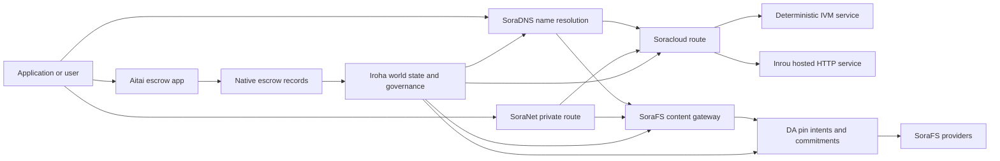

# SORA Nexus አገልግሎቶች {#sora-nexus-services}

SORA Nexus ዙሪያ መተግበሪያ-ተኮር አገልግሎት አውሮፕላኖች ያክላል Iroha 3. እነዚህ አገልግሎቶች
የተለያዩ መለያዎች አይደሉም። Iroha የዓለም መንግስት፣ Norito
መገለጫዎች፣ የአስተዳደር መዝገቦች እና Torii የመንገድ ቤተሰቦች።

ተደራሽነት ከጎድኑ ግንባታ እና ከአውታረ መረብ መገለጫ ላይ የተመሠረተ ነው።
[`/openapi`](/am/reference/torii-endpoints.md#app-and-sora-route-families) ላይ
የታቀደው ዕንቆቅልሽ እንደ እውቅና ያለው የተፈቀደላቸው መስመሮች ዝርዝር ነው።

## የክፍል ካርታ {#component-map}

| አካል              | ሚና                                                                                                                                        | ዋናው ወለል                                                                            |
| ---------------------- | ------------------------------------------------------------------------------------------------------------------------------------------- | ---------------------------------------------------------------------------------------- |
| Soracloud              | የመተግበሪያ ማሰማራት፣ የተስተናገዱ አገልግሎቶች፣ የግል ሞዴል/የስራ ሰዓት ሁኔታ እና የአገልግሎት የሕይወት ዑደት ቁጥጥር።                                        | `/v1/soracloud/*`, `/api/*`, `iroha app soracloud ...`                                   |
| ኢንሩ                  | Soracloud የተስተናገደ HTTP የቀጥታ ስርጭት የሚያስፈልጋቸው የአገልግሎት ማሻሻያዎች አሂድ HTTP አውሮፕላን.                                                            | Soracloud የስራ ሰዓት ውቅር፣ የአስተናጋጅ አቅም ማስታወቂያዎች፣ የመሳሪያ የሥራ ሰዓት ሁኔታ                 |
| SoraNet                | ለሰርኩቶች የግላዊነት እና የትራንስፖርት ሽፋን ፣ ለሪሌ ትራፊክ ፣ VPN, ስብሰባዎችን ያገናኙ እና የዥረት መስመሮችን.                                     | `/v1/connect/*`, `/v1/vpn/*`, SoraNet የመንገድ ሜታዳታ                                     |
| የመረጃ አቅርቦት (DA) | ለጠቅላላ ሸክሞች የሚመለከታቸው የደረጃ ማስረጃዎች፣ ግዴታዎች እና የማጣቀሻ ዓላማዎች Nexus ጎዳናዎች፣ SoraFS መገለጫዎችና ማስረጃዎች ይፈስሳሉ። | `/v1/da/*`, `FindDaPinIntent*`, `[sumeragi.da]`                                          |
| SoraFS                 | ለጋዜጣዎች ይዘት የተላበሰ የማከማቻ ጨርቅ፣ CAR ጠቃሚ ጭነቶች፣ የተጣበቁ ይዘቶች፣ የጌትዌይ ማሰባሰቢያዎች እና የመረጃ ማስረጃ ፍሰቶች።           | `/v1/sorafs/*`, `/sorafs/*`, `FindSorafsProviderOwner`                                   |
| SoraDNS                | ለ Deterministic ስያሜ እና resolver-attestation layer SORA-የተስተናገዱ አገልግሎቶች እና ይዘት.                                                   | `/v1/soradns/*`, `/soradns/*`, resolver ዳይሬክቶሪ ክስተቶች                                 |
| አይታይ                  | በተለየ መቁጠሪያ ሳይሆን በአገር ውስጥ የኤስሮ መዝገቦች የተደገፈ የአፕሊኬሽኑ ደረጃ ፊያቲ እና የንብረት ክፍፍል መተላለፊያ።                                     | `OpenAssetEscrow`, `FindAssetEscrow*`, `EscrowEventFilter`, Kotodama `escrow_*` የተገነቡ |



## የተለመዱ ፍሰቶች {#common-flows}

### አስተናጋጅ የተከፋፈለ መተግበሪያ {#hosted-split-application}

አንድ የተለመደ ድብልቅ አውሮፕላን መተግበሪያ ሁሉንም ቁርጥራጮች በአንድነት ይጠቀማል:

1. ቋሚ የፊት-መጨረሻ ንብረቶች የታሸጉ እና የተጣበቁ ናቸው SoraFS.
2. ለምሳሌ የህዝብ አስተናጋጅ `<app>.sora`, በ
   SoraDNS.
3. Soracloud መስመሮች `/api/v1/search` ወይም `/api/v1/stream` ለኢንሩ HTTP
   አገልግሎት.
4. Soracloud መስመሮች `/api/auth` እና `/api/v1/user` ወደ መወሰን IVM
   አስተናጋጆች።
5. ግላዊነት የሚፈልጉ ደንበኞች ተመሳሳይ ይዘት ወይም API መንገድ
   በ SoraNet ወረዳ.

| መንገድ              | የጀርባ አውሮፕላን         | ለምን?                                               |
| ----------------- | --------------------- | ------------------------------------------------- |
| `/`               | SoraFS ቋሚ ይዘት | የመተግበሪያ ይዘት ሥር እና የጌትዌይ መሸጎጫ     |
| `/assets/*`       | SoraFS ቋሚ ይዘት | ይዘት-አስተናጋጅ ንብረቶች እና ግልፅ ማስረጃዎች      |
| `/api/auth*`      | Soracloud IVM         | ዳግም መጫወት ደህንነቱ የተጠበቀ የደራሲነት እና የኪስ ቦርሳ ፈተና ሁኔታ       |
| `/api/v1/user*`   | Soracloud IVM         | ለአስተዳደር ስሜታዊ የሆኑ የስቴት ለውጦች              |
| `/api/v1/search*` | Soracloud ኢንሩ       | በቀጥታ HTTP አገልግሎት፣ ካሽ፣ SSE, ወይም ሰብሳቢ ሀገር |

### ይዘት ህትመት {#content-publication}

SoraFS ጽሑፉ አንድ ስም ከመጠቆምዎ በፊት ዘላቂ ቅርሶችን ያወጣል-

1. አንድ ጠቃሚ ጭነት ወይም ማውጫ ይገንቡ.
2. አንድ ውስጥ አሰፋው CAR የመረጃ ቋት እና የተወሰነ ዕቅድ።
3. አንድ ይገንቡ Norito የፒን ፖሊሲ እና የአስተዳደር መረጃ ጋር ይገለጻል.
4. ማኒፌሩን ለ Torii.
5. አንድ መዝገብ DA ግብ ላይ ሲውል የፒን ዓላማ ወይም ተደራሽነት ቃል ኪዳን
   መገለጫው ግልፅ ማስረጃ ይጠይቃል።
6. ማኔፊሱን በ SoraDNS ስም ወይም Soracloud ቋሚ የፊት መስመር።

### የግል መያዣ ወይም የዥረት መንገድ {#private-fetch-or-streaming-route}

SoraNet ፊት ለፊት መቀመጥ ይችላሉ SoraFS ወይም Soracloud:

1. ደንበኛው ስሙን ወይም ማኒፌስቶውን ይፈታል.
2. አንድ ጠባቂ ማውጫ ወይም የመንገድ መመዘኛ መግቢያ እና መውጫ ሪሌዎችን ይመርጣል.
3. ትራፊክ የተሸፈነ ነው እና በኩል ይልካል SoraNet ወረዳ.
4. የ መውጫ ሪሌው ወደ SoraFS በር፣ Torii ጅረት ወይም Soracloud
   መንገድ።

## አይታይ {#aitai}

Aitai ነው SORA የገበያ ቅጥ ስምምነት የሚደረግበት የመተግበሪያ ኮሪደር
ገዢ እና ሻጭ ከሰንሰለት ውጭ ክፍያዎችን ያስተባብራሉ Iroha የሚቆጣጠር
በሰንሰለት ላይ የንብረት ጥበቃ።
በስምምነት የተያዘ የኤስሮው ሂሳብ ምትክ አዲስ የቁጥር ንብረቶች ጥበቃ
ፍሰቶች።

የአገር ውስጥ ዋስትና መያዣ በዋናው መጽሐፍ ውስጥ ጥበቃን ይይዛል።
`OpenAssetEscrow`, ገዢው ከሰንሰለት ውጪ የሚደረገውን ክፍያ ይቀበላል እንዲሁም ምልክት ያደርጋል
`AcceptAssetEscrow` እና `MarkEscrowPaymentSent`, እና ሻጩ ይለቀቃል
ጋር `ReleaseAssetEscrow` ወይም ክፍያ ከመታወቁ በፊት ይሰርዛል።
ሻጩ የማይስማማ ከሆነ ሁለቱም ወገኖች ክርክር መክፈት ይችላሉ
`CanResolveEscrowDispute` የተቆለፈውን መጠን መከፋፈል ይቻላል።

ለሙሉ የሕይወት ዑደት፣ አጠቃላይ የንብረት መቆለፊያዎች፣ የማይታወቁ ዋስትናዎች፣ ጥያቄዎች፣
ክስተቶች እና Rust ምሳሌዎች፣ ተመልከት
[የአገር ውስጥ ንብረት ማስከበሪያ](/am/blockchain/escrow.md).

| የአይታይ ወለል                                                                                                                                                 | ለመጠቀም                                                                                |
| ------------------------------------------------------------------------------------------------------------------------------------------------------------- | ----------------------------------------------------------------------------------------- |
| `OpenAssetEscrow`, `AcceptAssetEscrow`, `MarkEscrowPaymentSent`, `ReleaseAssetEscrow`, `CancelAssetEscrow`                                                    | ግልፅ የቁጥር ንብረት አቅርቦቶች፣ XOR-የተሰየመ የመቋቋም ፍሰት።             |
| `OpenAnonymousAssetEscrow`, `AcceptAnonymousAssetEscrow`, `MarkAnonymousEscrowPaymentSent`, `ReleaseAnonymousAssetEscrow`, `CancelAnonymousAssetEscrow`       | የገንዘብ ድጋፍ እና የመዝጊያ እንቅስቃሴዎች በማረጋገጫ ማያዣዎች የሚከናወኑባቸው የተጠበቁ ቅናሾች። |
| `OpenEscrowDispute`, `ResolveEscrowDispute`, `OpenAnonymousEscrowDispute`, `ResolveAnonymousEscrowDispute`                                                    | ክርክር መፍታት እና የፍርድ ቤት ቅጥ ውሳኔ።                                                 |
| `FindAssetEscrowById`, `FindAssetEscrowsBySeller`, `FindAssetEscrowsByBuyer`, `FindAssetEscrowsByStatus`                                                      | የመተግበሪያ ሁኔታ ገጾች፣ የማመሳሰል ስራዎች እና የድጋፍ መሳሪያዎች።                               |
| `EscrowEventFilter`                                                                                                                                           | የቀጥታ ግልፅ ኤስኮር ምዝገባዎች በኤስኮር መታወቂያ፣ ሻጭ፣ ገዢ፣ ሁኔታ ወይም ክስተት ዓይነት። |
| Kotodama `escrow_open_offer`, `escrow_accept`, `escrow_mark_payment_sent`, `escrow_release`, `escrow_cancel`, `escrow_open_dispute`, `escrow_resolve_dispute` | Kotodama የኮንትራት ጥሪዎች V1 ኤስኮር ሲሲካልስ.                                 |

ለሕዝብ Taira ወይም Minamoto አጠቃቀም, ከሰንሰለት ውጭ ክፍያ የባቡር ሐዲድ ማከም እና
ማንኛውም ድጋፍ ወይም የፍርድ ቤት የሥራ ፍሰት እንደ ማመልከቻ ፖሊሲ። Iroha መዝገቦች
የቁጥጥር ሁኔታ፣ የሕይወት ዑደት ክስተቶች፣ የምስክርነት ሃሽ እና የመጨረሻው የአክሲዮን እንቅስቃሴ።
የፋይት ክፍያ በራሱ አይረጋገጥም።

## የዒላማ አገናኝን ይፈትሹ {#check-a-target-node}

በዚህ ገጽ ላይ ያሉትን ምሳሌዎች ከመጠቀምዎ በፊት የመንገድ ቤተሰብ መኖሩን ያረጋግጡ
በዒላማ ያደረጋችሁት አንጓ ላይ:

```bash
export TORII_URL=https://taira.sora.org

curl -fsS "$TORII_URL/openapi.json" \
  | jq '.paths | keys[] | select(test("^/v1/(soracloud|sorafs|soradns|connect|vpn|da)/"))'

curl -fsS "$TORII_URL/status" | jq .
```

ከሆነ `/openapi.json` መገለጫው አልተጋለጠም ፣ ይሞክሩ `/openapi`. በትክክል
የመንገድ ተደራሽነት በግንባታ ባህሪዎች እና በአውታረ መረብ ውቅር ላይ የተመሠረተ ነው።

### Taira የትንባሆ ቼኮች {#taira-read-only-smoke-checks}

የሕዝብ Taira የመጨረሻው ነጥብ ለንባብ-ጎን ምርመራዎች ጠቃሚ ነው ፣ ግን አይጠቀሙበት
የተፈቀደ አካውንት ካልተያዙ በስተቀር ለሙቲንግ ምሳሌዎች እና
የቀጥታ ሁኔታን ለመለወጥ አቅደዋል።

```bash
export TORII_URL=https://taira.sora.org

curl -fsS "$TORII_URL/status" \
  | jq '{version: .build.version, peers, blocks, lanes: (.teu_lane_commit | length)}'

curl -fsS "$TORII_URL/v1/connect/status" | jq '{enabled, sessions_active}'

curl -fsS "$TORII_URL/v1/vpn/profile" \
  | jq '{available, relay_endpoint, supported_exit_classes}'

curl -fsS "$TORII_URL/v1/sorafs/storage/state" \
  | jq '{bytes_capacity, bytes_used, pin_queue_depth, por_inflight}'

curl -fsS -H 'Accept: application/json' "$TORII_URL/v1/soracloud/status" \
  | jq '.control_plane | {service_count, services: [.services[] | {service_name, current_version}]}'
```

Taira ለትክክለኛ ልውውጥ ልዩ የሆኑ የቁጥጥር አውሮፕላን መስመሮችን ሊያጋልጡ ይችላሉ
በ OpenAPI የመንገድ ካርታ. `/openapi` እንደ ዋና የተፈጠረ
API የስምምነት ስምምነት፣ ከዚያ በቀጥታ ከመጀመሩ በፊት ማንኛውንም የመልቀቂያ-ተኮር መንገድ ያረጋግጡ
በቀጥታ ስርጭት ላይ እንደነበረው በማስመዝገብ።

## Soracloud {#soracloud}

Soracloud ነው SORA አተገባበር ቁጥጥር አውሮፕላን.
ጥቅሎች፣ የአገልግሎት ማሻሻያዎች፣ መስመሮች፣ የመተላለፊያ ሁኔታ፣ ስልጣናዊ ውቅር
ማስታወሻዎች፣ የተመሰጠረ የስራ ምስጢሮች፣ ሞዴል መዝገብ መዛግብት፣ የግል
የመደምደሚያ ክፍለ ጊዜዎች እና የስራ ሰዓት ደረሰኞች።

Soracloud ሁለት የማስፈፀሚያ አውሮፕላኖችን ይጠቀማል-

| የፍርድ አድራጊነት አውሮፕላን        | የስራ ሰዓት | ለመጠቀም                                                                                   |
| ---------------------- | ------- | -------------------------------------------------------------------------------------------- |
| `DeterministicService` | `Ivm`   | አዘጋጅ፣ የመረጃ ቋት ሁኔታ፣ የተረጋገጠ ንባብ፣ የታዘዙ የፖስታ ሳጥኖች አስተዳዳሪዎች፣ ለአስተዳደር የሚሆኑ ተለዋዋጮች |
| `HttpService`          | `Inrou` | በቀጥታ HTTP APIs, ከፍተኛ የሙያ ሥራ፣ ካሽ የተደገፉ አገልግሎቶች፣ SSE, በአሳሽ የተደገፉ ፍሰቶች     |

የቁጥጥር አውሮፕላን ስልጣናዊ ነው.
ሚስጥራዊ, ሞዴል, እና ሁኔታ ትዕዛዞች በኩል ማቅረብ Torii እና የተፈጸመውን ማንበብ
ዓለም አቀፋዊ መንግስት፤ በተለየ CLI- አካባቢያዊ መስታወት.
የጉዞ አሰጣጥ ረጅሙ ቅድመ ቅደም ተከተል ላይ የተመሠረተ ነው ፣ ስለሆነም አንድ የተመዘገበ አስተናጋጅ ትራፊክን ሊከፋፍል ይችላል
ከተስተናገዱ መካከል HTTP መንገዶች እና መወሰኛ API መስመሮች።

### የተከፋፈለ መተግበሪያን ያዘጋጁ {#scaffold-a-split-app}

የተከፋፈለ መተግበሪያ አብነት አንድ ቋሚ የፊት ጫፍ እና በአንድ አስተናጋጅ በቀጥታ ይፈጥራል API
እና አንድ የዴተሪሚኒስት ዋልት/API አገልግሎት

```bash
iroha app soracloud app init \
  --template split-app \
  --app-name solswap_indexer \
  --app-version 0.1.0 \
  --public-host solswap-indexer.sora \
  --output-dir ./apps/solswap-indexer

iroha app soracloud app local-plan \
  --manifest ./apps/solswap-indexer/app_manifest.json

iroha app soracloud app doctor \
  --manifest ./apps/solswap-indexer/app_manifest.json
```

`local-plan` የመንገድ ክፍፍል፣ የልጆች አገልግሎት ማኒፌስት፣ የስራ ቦታ
የስክሪፕት መስመሮች፣ እና የሚጠበቀው የፊት መጨረሻ ህትመት ሁነታ። `doctor`
ከመሳተፍዎ በፊት የአካባቢውን የመልቀቂያ ውል ያረጋግጣል Torii.

### የመተግበሪያውን ሁኔታ ማሰማራት እና መመርመር {#deploy-and-inspect-app-state}

```bash
export SORACLOUD_TORII_URL=https://<soracloud-enabled-torii>

iroha app soracloud app deploy \
  --manifest ./apps/solswap-indexer/app_manifest.json \
  --torii-url "$SORACLOUD_TORII_URL"

iroha app soracloud app status \
  --manifest ./apps/solswap-indexer/app_manifest.json \
  --torii-url "$SORACLOUD_TORII_URL"
```

ቀድሞውኑ ለተተገበረ አገልግሎት፣ የአገልግሎት ደረጃ የተሰጣቸውን ትዕዛዞች ይጠቀሙ:

```bash
iroha app soracloud status \
  --service-name solswap_indexer_live \
  --torii-url "$SORACLOUD_TORII_URL"

iroha app soracloud rollback \
  --service-name solswap_indexer_live \
  --target-version 0.1.0 \
  --torii-url "$SORACLOUD_TORII_URL"
```

### የተገለበጠና ሚስጥራዊ ቁሳቁስ {#config-and-secret-material}

Soracloud የኮንፊግ እና ሚስጥራዊ ግብዓቶች የሥልጣን ስርጭት አካል ናቸው
ሁኔታ: ማሰማራት, ማሻሻል, እና ወደ ኋላ መመለስ ሲያስፈልግ ውቅር ወይም መዝጋት አልተሳካም
ምስጢራዊ ትስስር ከሌለው ወይም ከሥራው ጋር የማይጣጣም ነው።

```bash
iroha app soracloud config-set \
  --service-name solswap_indexer_live \
  --config-name indexer/public_config \
  --value-file ./config/public-config.json \
  --torii-url "$SORACLOUD_TORII_URL"

iroha app soracloud secret-set \
  --service-name solswap_indexer_live \
  --secret-name indexer/api_key \
  --secret-file ./secrets/api-key.envelope.json \
  --torii-url "$SORACLOUD_TORII_URL"
```

ይጠቀሙ CLI በመገለጫዎ የሚፈለጉትን ትክክለኛ የምስክር ወረቀት ምልክቶች ለማግኘት እርዳታ:

```bash
iroha app soracloud config-set --help
iroha app soracloud secret-set --help
```

## ኢንሩ {#inrou}

ኢንሩ አስተናጋጅ ነው HTTP የሚጠቀሙበት የስራ ሰዓት Soracloud. አንድ Iroha ጋር አገናኝ
የተካተቱ Soracloud የተፈቀዱ የስራ ሰዓት ፕሮጀክቶች Soracloud ግዛት ወደ አካባቢያዊ
ማቴሪያላይዜሽን ዕቅድ, loopback እንደ የተመደበ አስተናጋጅ አገልግሎት ቅጂዎች ይጀምራል
አገልግሎቶች, እና ሪፖርቶች የስራ ሰዓት ሁኔታ ወደ ተደራሽ
ሞዴል.

የቀጥታ ውሂብ የሚያስፈልጋቸውን የስራ ጭነቶች ለማከናወን Inrou ን ይጠቀሙ HTTP እንደ
ባለአክሲዮን-ከባድ APIs, SSE ዥረቶች ፣ ካሽ የተደገፉ አስተዳዳሪዎች ወይም
በአሳሽ የተደገፉ አገልግሎቶች።

### የስራ ሰዓት መስፈርቶች {#runtime-requirements}

- የኮንቴይነር ማኒፌስት ሩጫ ሰዓት መሆን አለበት `Inrou`.
- የአገልግሎት ማኒፌስት አፈፃፀም አውሮፕላን መሆን አለበት `HttpService`.
- `HttpService + Inrou` በትክክል አንድ ያስፈልገዋል `PersistentRootLeaseVolume`
  ላይ የተጫነ `/`.
- ተደጋጋሚ የሆኑ የ Inrou አገልግሎቶች ደግሞ የተጋራ አገልግሎት ወይም ምስጢራዊ ኪራይ ያስፈልጋቸዋል
  ተለዋዋጭ የተጋራ ሁኔታን ሲያቆዩ ማከማቻ።
- የምርት አስተናጋጅ መስመሮች ይልቅ እውነተኛ Inrou አቅም ማስታወቂያ መስጠት አለበት
  እንደ ወኪል ሆኖ ብቻ ይሠራል።

### የተገለጠ ቁራጭ {#manifest-fragment}

ከዚህ በታች ያለው ምሳሌ የሁለቱን መገለጫዎች ቅርፅ ያሳያል።
የተሟላ የማሰማራት ጥቅል አይደለም።

```jsonc
// container_manifest.json
{
  "schema_version": 1,
  "runtime": { "runtime": "Inrou", "value": null },
  "bundle_path": "/bundles/solswap-indexer.inrou",
  "entrypoint": "/app/bin/launch-indexer.sh",
  "args": [],
  "env": {
    "RUST_LOG": "info",
  },
  "inrou": {
    "schema_version": 1,
    "guest_os": { "guest_os": "DebianSlim", "value": null },
    "guest_images": {
      "x86_64": {
        "kernel_image_path": "/inrou/x86_64/vmlinux",
        "rootfs_image_path": "/inrou/x86_64/rootfs.ext4",
        "initrd_image_path": null,
      },
      "aarch64": {
        "kernel_image_path": "/inrou/aarch64/vmlinux",
        "rootfs_image_path": "/inrou/aarch64/rootfs.ext4",
        "initrd_image_path": null,
      },
    },
  },
  "lifecycle": {
    "start_grace_secs": 60,
    "stop_grace_secs": 30,
    "healthcheck_path": "/api/indexer/v1/health",
  },
}
```

```jsonc
// service_manifest.json
{
  "schema_version": 1,
  "service_name": "solswap_indexer_live",
  "service_version": "0.1.0",
  "execution_plane": { "execution_plane": "HttpService", "value": null },
  "replicas": 2,
  "route": {
    "host": "solswap-indexer.sora",
    "path_prefix": "/api/v1/search",
    "service_port": 8080,
    "visibility": { "visibility": "Public", "value": null },
    "tls_mode": { "tls": "Required", "value": null },
  },
  "lease_volumes": [
    {
      "volume_name": "root_disk",
      "kind": {
        "lease_volume": "PersistentRootLeaseVolume",
        "value": null,
      },
      "storage_class": { "storage_class": "Warm", "value": null },
      "mount_path": "/",
      "max_total_bytes": 8589934592,
    },
    {
      "volume_name": "index_state",
      "kind": { "lease_volume": "ServiceLeaseVolume", "value": null },
      "storage_class": { "storage_class": "Warm", "value": null },
      "mount_path": "/var/lib/solswap-indexer",
      "max_total_bytes": 1073741824,
    },
  ],
}
```

በስራ ሰዓት እያንዳንዱ የተጫነ የኪራይ መጠን በአካባቢው በኩል ይጋለጣል
ከድምጽ ስም የተገኙ ተለዋዋጮች

```text
SORACLOUD_LEASE_VOLUME_ROOT_DISK_DIR
SORACLOUD_LEASE_VOLUME_ROOT_DISK_MOUNT_PATH
SORACLOUD_LEASE_VOLUME_INDEX_STATE_DIR
SORACLOUD_LEASE_VOLUME_INDEX_STATE_MOUNT_PATH
```

## SoraNet {#soranet}

SoraNet ይህም የግላዊነት እና የትራንስፖርት ሽፋን ነው.
በቀጥታ ወደ ግብ መግቢያ መግባት የሌለባቸው የትራፊክ መንገዶች
የጭነት ዲዛይን የመግቢያ ፣ መካከለኛ እና መውጫ ሪያል ሚናዎችን ይጠቀማል
QUIC ትራንስፖርት፣ በጩኸት ላይ የተመሠረተ የሃይብሪድ እጅ መንሻ፣ የአቅም ድርድር፣
የመተላለፊያ ማውጫ ሜታዳታ እና ቋሚ መጠን ያላቸው የታሸጉ ሴሎች።

ውስጥ Nexus ማሰማራት፣ SoraNet የይዘት መያዣዎችን ፣ የግብይት ትራፊክን መሸከም ይችላል ፣
VPN ወይም የ "Connect" ክፍለ ጊዜዎች፣ እና Norito የመረጃ ቋት መግቢያዎች
ምልክት ያንን ድጋፍ ያስተላልፋል `norito-stream`, ይህም ደንበኞች መንገዶችን እንዲመርጡ ያስችላቸዋል
ለ Torii RPC ወይም የትራፊክ ፍሰት.

### የዥረት ውቅር {#streaming-configuration}

የ Nexus መገለጫ ያስችለዋል SoraNet ለዥረት መስመሮች ማቅረብ

```toml
[streaming]
feature_bits = 0b11

[streaming.soranet]
enabled = true
exit_multiaddr = "/dns/torii/udp/9443/quic"
padding_budget_ms = 25
access_kind = "authenticated"
provision_spool_dir = "./storage/streaming/soranet_routes"
provision_spool_max_bytes = 0
provision_window_segments = 4
provision_queue_capacity = 256
```

አጠቃቀም `access_kind = "read-only"` አስፈላጊ ባልሆኑ የይዘት መንገዶች
ተመልካች ማረጋገጫ። `authenticated` የመውጫ ሪሌው ማስከበር ያለበት ጊዜ
ከመድረሱ በፊት ትኬቶች ወይም ተመልካች ማንነት Torii ወይም አስተናጋጅ አገልግሎት።

### SoraNet-አውቀው SoraFS አምጣ {#soranet-aware-sorafs-fetch}

የ SoraFS ማምጣት CLI አንድ አካባቢያዊ ወኪል ማኒፌስት እና spool ሊያወጣ ይችላል SoraNet
የአሳሽ ማራዘሚያዎች የመንገድ ሜታዳታ ወይም SDK አስማሚዎች

```bash
sorafs_cli fetch \
  --plan artifacts/payload_plan.json \
  --manifest-id 7bb2...9d31 \
  --provider name=alpha,provider-id=9f5c...73aa,base-url=https://gw-alpha.example.org/,stream-token="$(cat alpha.token)" \
  --output artifacts/payload.bin \
  --json-out artifacts/fetch_summary.json \
  --local-proxy-manifest-out artifacts/proxy_manifest.json \
  --local-proxy-mode bridge \
  --local-proxy-norito-spool storage/streaming/soranet_routes \
  --local-proxy-kaigi-spool storage/streaming/soranet_routes \
  --local-proxy-kaigi-policy authenticated \
  --max-peers=2 \
  --retry-budget=4
```

አጠቃላይ መዝገብ አቅራቢዎች ሪፖርቶች, ቁርጥራጭ ደረሰኞች, አካባቢያዊ ወኪል ሜታዳታ,
እና ለመውሰድ ጥቅም ላይ የዋሉ ውጤታማ የመንገድ ቅንብሮች።

## የመረጃ አቅርቦት (DA) {#data-availability-da}

DA በጣም ትልቅ ለሆኑ ጥቅማጥቅሞች የሚገኝ የመገኛነት-ማስረጃ ንብርብሮች ነው
የግላዊነት ስሜት, ወይም በቀጥታ በዓለም ላይ ለመቀመጥ በጣም አገልግሎት-ተኮር
ይህ ውስን ግዴታዎች እና መልሶ ማግኛ ግዴታዎች ይመዝገብ
ማረጋገጫ ሰጪዎች፣ መግቢያ ገጾች እና ደንበኞች የትኞቹ ባይቶች ቃል እንደገቡ መስማማት ይችላሉ፤
የትኛው ፖሊሲ ይተገበራል, እና ምን ማስረጃዎች ተገኝተዋል.

DA አይተካም Kura ወይም SoraFS:

- Kura የተጠናቀቁ የብሎክ ዥረት እና የስምምነት መልሶ ማግኛ መረጃዎችን ያከማቻል ።
- SoraFS የይዘት አድራሻ ያላቸው ባይቶችን ያስቀምጣል እንዲሁም ያገለግላል፣ CAR ጥቅማጥቅሞች፣ እና
  መገለጫዎች።
- DA ግዴታዎችን፣ የምስክርነት ፖሊሲዎችን፣ የምሥክርነት ክፍተቶችን እና የፒን ዓላማዎችን መዝገብ
  እነዚያን ባይቶች መርሐግብር እንዲያስቀምጡ፣ ለኦዲት እንዲደረጉና ወደ መቁጠሪያው እንዲመለሱ የሚያደርግ
  ግዛት.

አጠቃቀም DA ማመልከቻ ወይም Nexus ሌን መለያ ውስጥ የሚታይ ቃል ያስፈልገዋል
ከሰንሰለት ውጪ የሚገኘው መረጃ አሁንም ሊገኝ የሚችል መሆኑን ያረጋግጡ።
ለቅጣት ፍሰቶች የዋጋ ጭነት ግዴታዎች SoraFS ለታተሙ የፒን ዓላማዎች
ይዘት፣ ለቀጣይ ማረጋገጫ የሚጠበቁ ማስረጃ ጥቅሎች፣ እና
የማመልከቻ ዕቃዎች የህዝብ ሁኔታው ከግምት ውስጥ ማስገባት ያለበት
ሙሉ ጭነት።

### የሕይወት ዑደት {#lifecycle}

| ደረጃ      | ተመዝግቧል                                                                                                                                      |
| ---------- | ----------------------------------------------------------------------------------------------------------------------------------------------------- |
| ዓላማ     | አንድ ትኬት, ግልፅ ማጣቀሻ, ቅጽል ስም, መንገድ / ዘመን / ቅደም ተከተል ማጣቀቂያ, የማቆያ ፖሊሲ, ወይም መልመጃ ግብ.                                          |
| ቁርጠኝነት | ማኒፌስት፣ የላይን ጥቅማጥቅሞች፣ የመረጃ አሰላለፍ ወይም የይዘት ሥር ከመጽሐፉ ውስጥ ከሚታየው መዝገብ ጋር የሚያገናኘውን ቁሳቁስ ይዘርጉ።                                    |
| ማስረጃ   | የተደራጀነት ድምጾች፣ የምስክር ወረቀቶች፣ የአቅራቢዎች ማረጋገጫ ወይም በዒላማው አውታረመረብ ተቀባይነት ያላቸው ሌሎች መገለጫ-ተኮር ማስረጃዎች።                         |
| ጥያቄ      | የፒን ዓላማ ፍለጋዎች በኩል `FindDaPinIntentByTicket`, `FindDaPinIntentByManifest`, `FindDaPinIntentByAlias`, ወይም `FindDaPinIntentByLaneEpochSequence`. |

አንድ የተለመደ DA- የተደገፈ የሕትመት ፍሰት:

1. ከኤሌክትሮኒክስ ውጭ ያለውን አጠቃቀም ለመገንባት ወይም ለመቀበል WSV, ለምሳሌ ሀ SoraFS CAR
   መዝገብ ወይም Nexus የመንገድ ጥቅማጥቅሞች።
2. ሃሽ እና አንድ ውስጥ ጠቃሚ ጭነት ይግለጹ Norito ለግል ወይም ለመንገድ የተወሰነ
   የተሳትፎ መዝገብ።
3. በፕሮግራሙ፣ በፒን ዓላማው ወይም በቃል ኪዳኑ አማካኝነት `/v1/da/*` መቼ
   ይህ የመንገድ ቤተሰብ ተንቀሳቃሽ ነው, ወይም አውታረ መረብ የተፈረመ
   የግብይት መንገድ።
4. ማረጋገጫ ሰጪዎች ወይም ተደራሽነት አቅራቢዎች የሚፈለጉትን ማስረጃዎች እንዲሰበስቡ ያድርጉ
   በንቃት ማስረጃ ፖሊሲ።
5. ማንኛውንም ስም ከማስተዋወቅዎ በፊት የተገኘውን የፒን ዓላማ ወይም ቁርጠኝነት ይጠይቁ ፣
   የክፍያ ማስረጃ ወይም ከጠቅላላው ጭነት የሚመረኮዝ የመግቢያ መንገድ።

### የአልጎሪዝም ሞዴል {#algorithmic-model}

DA አንድ ጠቃሚ ጭነት የተፈራረመ, እንደገና መጫወት-የተጠበቀ, ብሎክ-ኢንዴክስ የተደረገ ግዴታ ውስጥ ይቀይራል.
አስፈላጊዎቹ ስልተ ቀመሮች ተለጣፊ ናቸው ስለዚህ ማረጋገጫ እና መግቢያዎች ይችላሉ
ተመሳሳይ ባይቶችን ከዚሁ ባይቶች ተመላሽ አድርግ።

1. **የተላከውን የጉልበት ጭነት በካኖኒክ ያድርጉ።** Torii የመውሰድ ጥያቄን ይቀበላል
   `(lane_id, epoch, sequence)`, የጠቅላላ ጭነት ባይቶች ፣ የመጭመቂያ ሜታዳታ ፣ ቁራጭ
   መጠን፣ የመሰረዝ መገለጫ፣ የማስቀመጥ ፖሊሲ እና የሳጭ ፊርማ።
   ሲጠየቁ gzip, deflate ወይም Zstandard ጥቅማጥቅሞችን ያጭዳል, ከዚያም
   የካኖኒካል ባይት ርዝመት እኩል መሆኑን ያረጋግጣል `total_size`.
2. **የመንገድ እና የከፊል መለኪያዎችን ያረጋግጡ.** የመንገድ መስመሩ በ Nexus
   የመንገድ ካታሎግ. `chunk_size` ሁለት, ቢያንስ ሁለት የዜሮ ያልሆነ ኃይል መሆን አለበት
   በባይት፣ እና ከተዘጋጀው ከፍተኛ መጠን አይበልጥም።
   የመንገድ ካታሎግ የሚመረጠው
   የማረጋገጫ ስርዓቱ `merkle_sha256` ወይም `kzg_bls12_381`.
3. **የአውታረ መረብ ፖሊሲን ተግባራዊ አድርግ።** አንጓው የተዋቀረውን ማባዛት እና
   ለቦብ ክፍል የመቆየት መነሻ መስመር። የህዝብ ሜታዳታ ግልጽ ጽሑፍ ሆኖ መቆየት አለበት;
   የቁጥር ቁጥጥር ብቻ የሚደረግበት ሜታዳታ በአገናኙ የተዋቀረ አስተዳደር ይመሰጠራል
   በፕሮግራሙ ውስጥ ከመጻፉ በፊት የሜታዳታ ቁልፍ።
4. **ቁርጥራጭ እና ግዴታ.** ቀኖናዊው የጉዞ ሸክም በቋሚ መጠን የተሞላ ነው
   ከ `chunk_size`. Torii የክፍያ ጭነት አቃፊን ያሰላስላል
   የመረጃ ማስረጃ ማግኛ ዛፍ ሥር፣ እና በከፊል ግዴታዎች።
   ማጓጓዝ BLAKE3 በባይቶቻቸው ላይ የተደረጉ ግዴታዎች።
5. **የመሰረዝ ግዴታዎች ይጨምሩ.** ቁርጥራጮቹ ወደ ቀለበቶች ይደረጋሉ
   `data_shards`. በመጨረሻው መስመሩ ውስጥ የጎደሉ ሴሎች እኩልነት ለማግኘት ዜሮ የተሞሉ ናቸው
   የሂሳብ አያያዝ RS(16) እኩልነት ረድፍ/ዓለም አቀፋዊ እኩልነት ክፍሎችን ይፈጥራል፤ አማራጭ
   `row_parity_stripes` በማትሪክስ ውስጥ የድንበር ቅጥ እኩልነት ይጨምሩ.
   የፓሪቲ ክምችት ግዴታዎች BLAKE3 የትንሽ አንዴያን አህያዎች `u16` ምልክቶች።
6. **ሰነዱን አዘጋጅ።** `DaManifestV1` የመንገድ መንገድ፣ ዘመን፣ የቦብድ ክፍል፣
   ኮዴክ፣ የዋጋ ጭነት ማጣሪያ፣ ቁራጭ ሥር፣ ቁራጩ መጠን፣ የመሰረዝ መገለጫ፣ ማቆየት
   ፖሊሲ, የኪራይ ዋጋ, ቁርጥራጭ ግዴታዎች, አማራጭ IPA ተሳትፎ፣ ሜታዳታ፣
   የማከማቻ ቲኬት የተወሰነ ነው: አገናኝ በመጀመሪያ አንድ hashes
   ባዶ ትኬት ያለው የፕሮግራም አብነት፣ ከዚያም ያንን የአሻራ አሻራ እንደ
   የመጨረሻው `storage_ticket`.
7. **የመልሶ ማጫወት ግጭቶችን ውድቅ አድርግ።** የመልሶ ማጫወት ቁልፍ
   `(lane_id, epoch, sequence, manifest_fingerprint)`. ከሁለቱም ጋር
   ተመሳሳይ የጣት አሻራ አይቻልም.
   የተለያዩ የጣት አሻራዎች ውድቅ ተደርገዋል።
8. **ፊርማ የተሰጡትን ዕቃዎች ያቅርቡ።** Torii a ን ያሰላል PDP ተሳትፎ፣ ፊርማ ሀ
   `DaIngestReceipt`, ይገነባል `DaCommitmentRecord`, እና ስፖል ዕቃዎች ይጽፋል
   ለግልጽ መገለጫዎች፣ PDP ተሳትፎ፣ የተሳትፎ መዝገብ፣ የኃላፊነት መርሃግብር፣
   አሻራ ዓላማ, ደረሰኝ ፋይል, እና ደረሰኝ መዝገብ.
   በአንድ ጊዜ `(lane_id, epoch)`.

የቃል ኪዳኑ መዝገብ ብሎኮች የሚሸከሙት ነገር ነው። አንድ መዝገብ የሚከተሉትን ያገናኛል፦

- ጎዳና፣ ዘመን እና ቅደም ተከተል
- የስልክ አድራሻ ID እና ካኖኒካል ማኔፊስት ሃሽ
- የመንገድ መከላከያ ስርዓት
- የጭንቅላት ሥር
- አማራጭ KZG ለተስፋ ቃል KZG ጎዳናዎች
- PDP/የመረጃ ማስረጃ
- የማቆያ ክፍል እና ማከማቻ ትኬት
- Torii DA የምስክርነት ፊርማ

አንድ ብሎክ ከመቀላቀል በፊት DA መዝገቦች, የብሎክ ስብስብ መንገድ ጥቅል ያረጋግጣል:

- `(lane_id, epoch, sequence)` በቡድኑ ውስጥ ልዩ መሆን አለበት.
- የተገለጹት ሃሽዎች በቡድኑ ውስጥ ዜሮ ያልሆኑ እና ልዩ መሆን አለባቸው።
- የኃላፊነት ማረጋገጫ መርሃግብር ከተዋቀረው የመንገድ ፖሊሲ ጋር የሚስማማ መሆን አለበት።
- የሜርክል ጎዳናዎች ውድቅ KZG ግዴታዎች፤ KZG ጎዳናዎች ዜሮ ያልሆነ ያስፈልጋል KZG
  ቁርጠኝነት።
- የፒን ዓላማዎች በመንገድ, በማስረጃ ሃሽ,
  የማከማቻ ትኬት፣ የባለቤት ሂሳብ እና የአጋጣሚ ስም ደንቦች።

የብሎክ ራስጌ ለ ሃሽስ ይከማቻል DA የማረጋገጫ ፖሊሲዎች፣ ግዴታዎች እና ማሰሪያ
የአባልነት ማረጋገጫ ለማግኘት, የ ግዴታ ጥቅል ደግሞ Merkle ያጋልጣል
ቅጠሎቹ የካኖኒካል ሃሺዎች የሆኑበት ሥር Norito-የተከፈተ
`DaCommitmentRecord` ወላጅ አንጓዎች የግራ እና
ቀኝ ልጆች; አንድ ያልተለመደ ቅጠል ወደ ቀጣዩ ንብርብሮች ሳይለወጥ ይነሳል.

### ማስረጃ ማረጋገጫ {#proof-verification}

`/v1/da/commitments/prove` በአንድ ብሎክ ውስጥ ለአንድ ግዴታ ማስረጃ ማቅረብ ይችላል።
ማረጋገጫው ግዴታውን፣ የብሎክ ቁመቱን፣ በቡድኑ ውስጥ ያለውን መረጃ ጠቋሚ፣
ሃሽ፣ የቡንድ ርዝመት፣ ሜርክል ሥር እና ወንድማማች መንገድ።

1. የማረጋገጫ ጥቅል ሃሽ የብሎክ ራስጌ ጋር ይዛመዳል DA ቁርጠኝነት ሃሽ.
2. የማረጋገጫ ብሎክ ቁመት ከተጠቀሰው የብሎክ ራስጌ ጋር ይዛመዳል ።
3. ኢንዴክሱ በድንበር ውስጥ ነው እና ግዴታው በዚያ ላይ የቡንዶች ምዝገባ ጋር እኩል ነው
   መረጃ ጠቋሚ።
4. የመንገድ መከላከያ ፖሊሲው ቃል ኪዳኑን ይቀበላል።
5. ከግዴታ ወረቀት ጀምሮ የወንድማማችነት መንገዱን ማጠፍ የተሰጠውን እንደገና ያድሳል
   ሥር.
6. የተገነባው ሥር የቡድን ሥር ጋር እኩል ነው።

ይህ አንድ የተወሰነ ተደራሽነት ግዴታ የተካተተ መሆኑን ያረጋግጣል
የማገጃ ጭነት; ይህ እያንዳንዱ ቅጂ በአሁኑ ጊዜ በመስመር ላይ መሆኑን አያረጋግጥም.
የማስመለስ ችሎታ በግለሰብ ደረጃ ይመረመራል SoraFS አቅራቢው የሚወስደው፣ PDP/PoTR
ምርመራዎች፣ ወይም ለፕሮፋይል የተወሰነ የመገኛነት ማስረጃ።

### የስምምነት መስተጋብር {#consensus-interaction}

DA ጋር ተያይዟል Sumeragi አስተማማኝ ስርጭት (RBC), ነገር ግን አንድ አይደለም
ሁለተኛው የፍጻሜ ፕሮቶኮል. RBC የፕሮፖዛል ጥቅማጥቅሞችን ያሰራጫል እና ይመልሳል-
አቅራቢው ለ `(height, view, payload_hash)`, እኩዮች
የልውውጥ ቁርጥራጮች እና `READY`/`DELIVER` ምልክቶች በቂ ማረጋገጫዎችን መከታተል
ተመሳሳይ ጥቅማጥቅሞችን ተመልክቷል።

ውስጥ Iroha 3, አንድ ባልደረባ የሚቀበለው የክፍያ ጭነት በሚገኝበት ጊዜ እንደሚከተለው ይቆጥረዋል:

- የአከባቢው የታገዘ ብሎክ ባይት ሃሽ ወደ የሚጠበቀው የዋጋ ጭነት ሃሽ ይይዛል ፣ ወይም
- RBC የብሎክ ሃሽ, ቁመት, እይታ እና
  የኃይል ጭነት ሃሽ.

አንዳቸውም ሁኔታዎች ካልተረጋገጡ የባልደረባዎቹ መዝገቦች `missing_local_data`, ይሞክራል
አጠቃቀም ጭነት በኩል መልሶ ለማግኘት RBC ወይም የማገጃ ሲነኬሽን, እና ሪፖርቶች DA በር ውስጥ
በአሁኑ ጊዜ ተግባራዊ እየተደረጉ ያሉት እነዚህ DA ምልክቶች ናቸው
የመጨረሻነት ምክር: አንድ ብሎክ አሁንም ከ ተልእኮ ማረጋገጫ በተጨማሪ ያጠናቅቃል
ከተለየ ቦታ ሳይሆን ከሚመሳሰል አካባቢያዊ ጥቅማጥቅሞች DA የቁጥር ማረጋገጫ።

DA ጊዜ ማግኛ መስኮቶች ያስፋፋል. DA የጊዜ ገደብ ተወስዷል
ከተዋቀረው ብሎክ እና የጊዜ ሰሌዳዎች, ከዚያም በ
`sumeragi.advanced.da.quorum_timeout_multiplier`. የጊዜ ገደቡ
`max(quorum_timeout, availability_timeout_floor_ms) * availability_timeout_multiplier`.
ይህ ተደራሽነት የጊዜ ገደብ ከማለቁ በፊት አንጓው የፍጆታ ጭነት መልሶ ማግኛ እና
ከጊዜ በፊት እንደገና መወሰን ይከላከላል፤ ከተጠናቀቀ በኋላ መደበኛ መልሶ ማግኛ እና
የእይታ ለውጥ መንገዶች ሊቀጥሉ ይችላሉ.

### የኦፕሬተር ማስታወሻዎች {#operator-notes}

Iroha 3 የጋራ ስምምነት መገለጫዎች RBC-የተደገፈ የፍጆታ ጭነት ማሰራጨት፣ መገለጫ
ጠባቂዎች፣ DA የቡድን ማረጋገጫ እና የማገገም ቴሌሜትሪ
አብነት የተጋለጡ `[sumeragi.da]` የኃላፊነት ገደቦች እና ማስረጃ ክፍተቶች
ክንድ፣ በተጨማሪም `[sumeragi.advanced.da]` የጊዜ ማባዣዎች
እነዚህ ቅንብሮች በአንድ ውስጥ በማረጋገጫዎች መካከል ወጥ እንዲሆኑ ያድርጉ
የአውታረ መረብ መገለጫ።

የመንገድ ግኝት ለማግኘት ከጎድኑ OpenAPI ሰነድ:

```bash
curl -fsS "$TORII_URL/openapi.json" \
  | jq '.paths | keys[] | select(startswith("/v1/da/"))'
```

ይጠቀሙ
[የጥያቄ ማጣቀሻ](/am/reference/queries.md#nexus-data-availability-and-packages)
ለአሁኑ DA ጥያቄ ስሞች, እና
[የአቻ ቅጥያ አብነት](/am/reference/peer-config/) ለአካባቢው
`[sumeragi.da]` በግንባታህ የተጋለጡ አሻንጉሊቶች።

## SoraFS {#sorafs}

SoraFS ይህ ያልተማከለ ይዘት-አድራሻ ማከማቻ ጨርቅ ነው.
ባይቶች በዴትሪሚኒስት ቁርጥራጮች፣ CAR መዝገቦች፣ እና Norito ያረጋግጣል
የይዘት ሥሮች, የተከፈለ መገለጫዎች, የፒን ፖሊሲዎች እና አስተዳደርን ያገናኙ
ማረጋገጫዎች: የማከማቻ አቅራቢዎች አቅም እና ይዘትን ያስታውቃሉ
መግቢያዎች ከመድረሳቸው በፊት ማኒፌሶችን እና ቁርጥራጮችን ያረጋግጣሉ
ይዘት ማቅረብ።

የተለመደ SoraFS አጠቃቀሞች የስታቲክ አፕሊኬሽን ንብረቶችን ፣ ሰነዶችን ያካትታሉ
ሕንፃዎች፣ የዞን ጥቅሎች፣ ሞዴል ወይም የእጅ ዕቃዎች ማጣቀሻዎች እና የአስተዳደር ማስረጃ
ጥቅሎች. Iroha የውሂብ ሞዴል መግለጫዎች SoraFS የመግቢያ ክስተቶች እና
[`FindSorafsProviderOwner`](/am/reference/queries.md#nexus-data-availability-and-packages)
የድርጅት ባለቤትነት መፍትሄ ለማግኘት ጥያቄ።

### ማሸግ፣ ማሳያ፣ ፊርማ ማድረግና ማስገባት {#pack-manifest-sign-and-submit}

```bash
cargo run -p sorafs_car --features cli --bin sorafs_cli -- \
  car pack \
  --input ./dist \
  --car-out artifacts/site.car \
  --plan-out artifacts/site.chunk-plan.json \
  --summary-out artifacts/site.car-summary.json

cargo run -p sorafs_car --features cli --bin sorafs_cli -- \
  manifest build \
  --summary artifacts/site.car-summary.json \
  --manifest-out artifacts/site.manifest.to \
  --manifest-json-out artifacts/site.manifest.json \
  --pin-min-replicas=3 \
  --pin-storage-class=warm \
  --pin-retention-epoch=42

SIGSTORE_ID_TOKEN=$(oidc-client fetch-token) \
cargo run -p sorafs_car --features cli --bin sorafs_cli -- \
  manifest sign \
  --manifest artifacts/site.manifest.to \
  --bundle-out artifacts/site.manifest.bundle.json \
  --signature-out artifacts/site.manifest.sig

cargo run -p sorafs_car --features cli --bin sorafs_cli -- \
  manifest submit \
  --manifest artifacts/site.manifest.to \
  --chunk-plan artifacts/site.chunk-plan.json \
  --torii-url "$TORII_URL" \
  --resolve-submitted-epoch=true \
  --authority=<i105-account-id> \
  --private-key-file ./secrets/authority.ed25519 \
  --summary-out artifacts/site.manifest.submit.json \
  --response-out artifacts/site.manifest.submit.body
```

ከሆነ `/v1/sorafs/pin/register` በዒላማው ኖት ላይ አልተመራም ፣ CLI ማዘጋጀት
ወደተፈረመበት `/transaction` ማቅረቢያ እና አንድ ተርሚናል መጠበቅ
የቧንቧ መስመር ሁኔታ።

### አረጋግጥና አምጣ {#verify-and-fetch}

```bash
cargo run -p sorafs_car --features cli --bin sorafs_cli -- \
  proof verify \
  --manifest artifacts/site.manifest.to \
  --car artifacts/site.car \
  --chunk-plan artifacts/site.chunk-plan.json \
  --summary-out artifacts/site.verify.json

sorafs_cli fetch \
  --plan artifacts/site.chunk-plan.json \
  --manifest-id <manifest-digest-hex> \
  --provider name=primary,provider-id=<provider-id-hex>,base-url=https://gateway.example.org/,stream-token="$(cat provider.token)" \
  --output artifacts/site.fetch.tar \
  --json-out artifacts/site.fetch.json
```

### የማስመለስ ችሎታ ማረጋገጫ ምርመራዎች {#proof-of-retrievability-checks}

ኦፕሬተሮች ለማከማቻ አቅራቢዎች የማረጋገጫ ምርመራዎችን መመርመር እና ማስጀመር ይችላሉ-

```bash
sorafs_cli por status \
  --torii-url "$TORII_URL" \
  --manifest <manifest-digest-hex> \
  --status=failed \
  --limit=20

sorafs_cli por trigger \
  --torii-url "$TORII_URL" \
  --manifest <manifest-digest-hex> \
  --provider <provider-id-hex> \
  --reason=latency_probe \
  --samples=48 \
  --auth-token artifacts/challenge_token.to
```

## SoraDNS {#soradns}

SoraDNS ለ የተወሰነ ስያሜ ንብርብር ነው SORA አገልግሎቶች እና ይዘት
ስሞችን ያመቻቻል ፣ የመረጃ ቋት ዝማኔዎችን በማንከር Iroha, እና
የተፈረመ ዞን ወይም መፍትሄ ሰጪ ቡድኖችን በ SoraFS. ፈታኝ እና
የጌትዌይ ማስረጃዎችን ከመተማመንዎ በፊት የመፍትሄ ሰጪ ማረጋገጫ ሰነዶችን ያረጋግጣሉ
ሜታዳታ።

የአሳሽ መዳረሻ፣ SoraDNS የጌትዌይ አስተናጋጆችን ከተመዘገበ FQDN.
የተመዘገበ የከንቱነት አስተናጋጅ የካኖኒክ ማመልከቻ መነሻ ሆኖ ይቆያል ፣
የተሰማሩ የጌትዌይ መገለጫዎች አሳሽ እና Torii ለዚያ የመመለሻ መስመሮች
መነሻ።

### አስተናጋጅ ቅጾች {#host-forms}

| ቅጽ | ምሳሌ | ዓላማ |
| --- | --- | --- |
| የከንቱነት አመጣጥ | `https://<fqdn>/<path>` | የካኖኒካል መተግበሪያ URL በጋዜጣዎች እና በመልቀቂያ ማስታወሻዎች ውስጥ ተመዝግቧል |
| Taira የአሳሽ መግቢያ | `https://<fqdn>.mon.taira.sora.net/<path>` | ለነባሪ ስያሜ የህዝብ አሳሽ መግቢያ |
| Torii የመመለሻ መንገድ | `https://taira.sora.org/soradns/<fqdn>/<path>` | Torii ለነባሪ ስያሜ የቦክስ እና የመመለሻ መንገድ |
| የካኖኒካል ሃሽ ጌትዌይ | `<base32(blake3(name))>.gw.sora.id` | የመወሰን በር ማንነት እና GAR ማረጋገጫ |

የ `/soradns/<alias>/...` ውድቀት የህዝብ ተወዳጅ አይደለም URL.
የመሣሪያ አሠራር፣ የመተግበሪያ ማኒፌስት እና የፊት ለፊታችን ውቅር ከንቱነትን ይመርጣሉ
አስተናጋጅ ራሱ. Taira, የአሳሽ መግቢያ ወይም
ወደ ኋላ መመለስ የሚቻልበት መንገድ `404` ወይም አልተሳካም TLS ከመተግበሪያው አሰላለፍ በፊት
ይጀምራል.

### የጌትዌይ አስተናጋጆች {#derive-gateway-hosts}

```ts
import {
  deriveSoradnsGatewayHosts,
  hostPatternsCoverDerivedHosts,
} from '@iroha/iroha-js'

const derived = deriveSoradnsGatewayHosts('docs.sora')
console.log(derived.canonicalHost)
console.log(derived.prettyHost)

const taira = deriveSoradnsGatewayHosts('solswap-indexer.sora', {
  prettySuffix: 'mon.taira.sora.net',
})
console.log(taira.prettyHost)

const patterns = [
  derived.canonicalHost,
  derived.canonicalWildcard,
  derived.prettyHost,
]
console.log(hostPatternsCoverDerivedHosts(patterns, derived))
```

GAR ጥቅማጥቅሞች የካኖኒካል ሃሽ አስተናጋጅ ፣ የካኖኒካል ዋልድ ካርድን መሸፈን አለባቸው ፣
እንዲሁም የተመረጠችው ቆንጆ አስተናጋጅ።

### የ Resolver ማውጫ ቅጽበታዊ ገጽ እይታ ያግኙ {#fetch-a-resolver-directory-snapshot}

```bash
curl -i "$TORII_URL/v1/soradns/directory/latest"

soradns_resolver directory fetch \
  --record-url "$TORII_URL/v1/soradns/directory/latest" \
  --directory-url https://gateway.example.org/soradns/directory/latest.car \
  --output ./state/soradns-directory

soradns_resolver rad verify \
  --rad ./state/soradns-directory/rad/resolver-a.norito
```

የጌትዌይዎች የመፍትሄ ሰጪ ማረጋገጫ ሰነዱ
በሜርክል ዳይሬክቶሪ ውስጥ የጎደሉ ፣ ያረፉ ፣ ያልተፈረሙ ወይም ያልተመሰረቱ
እስካሁን ድረስ የተፈታች ማውጫ ባልተለጠፈበት አውታረመረብ ላይ
`/v1/soradns/directory/latest` መመለስ ይችላል `404` ምንም እንኳን መንገዱ
ተችሏል ።

### የሕዝብ DNS ልኡክ ጽሕፈት {#public-dns-delegation}

SoraDNS አስተናጋጅ ማመንጨት መደበኛ ኢንተርኔት አይተካም DNS የልዑካን ቡድን.
አንድ የህዝብ DNS ስሙ ወደ አንድ ነጥብ ሊያሳየው ይገባል SoraDNS መግቢያ:

- ለንዑስ ጎራዎች አንድ CNAME ለተመረጠው ቆንጆ አስተናጋጅ
- ለከፍተኛ ስሞች አጠቃቀም ALIAS/ANAME ወይም A/AAAA ወደ ማንኛውም ማስገቢያ መዝገብ
  IPs
- የካኖኒካል ሃሽ አስተናጋጅ በ SoraDNS የጌትዌይ ጎራ ለ GAR
  ቼኮች

## FHE እና UAID {#fhe-and-uaid}

FHE-የሚገኙት ተዛማጅ ቦታዎች Nexus አገልግሎቶች የሚከተሉትን ያካትታሉ።

- `iroha_crypto::fhe_bfv` ተጨባጭነትን ይተግብራል BFV ለስካላር ድጋፍ
  የሲፊር ጽሑፍ ግምገማ።
  `BfvIdentifierPublicParameters` እና `BfvIdentifierCiphertext`, የት ክፍተት
  0 የግብዓት ባይት ርዝመት ይከማቻል እና በኋላ ክፍተቶች አንድ የተመሰጠረ ባይት ያስቀምጣል
  እያንዳንዳቸው።
- Soracloud የስቴት እና የስራ መደቦች ሞዴል FHE ምስጠራ ጽሑፍ የስራ ጭነቶች
  በመንግስት አስተዳደር የሚተዳደሩ መለኪያዎች ስብስቦች፣ አፈፃፀም ፖሊሲዎች፣ የኮምፒተር ጽሑፍ
  ግዴታዎች፣ የጥያቄ መልዕክቶች እና የመግለጫ ጥያቄዎች።

የ BFV የመለየት መንገድ ለግላዊነት ጥበቃ ምዝገባ ጥቅም ላይ ይውላል.
የተመሰጠረ መታወቂያ ለ Torii መፍትሄ ሰጪው
በንቃት መታወቂያ ፖሊሲ መሠረት ይገመግማል ፣
`OpaqueAccountId`, ከዚያም ደረሰኝ ያወጣል። `ClaimIdentifier` ከዚያም ይያዛል
ደረሰኝ UAID ከዒላማው ሂሳብ ጋር የተያያዘ።

የ UAID ይህ ፍሰት ዙሪያ ማንነት እና አቅም ማሰሪያ ነው.
የመረጃ ሞዴል፣ `UniversalAccountId` በሃሽ የተደገፈ ሲሆን እንደ
`uaid:<hash>`. ፓርሰሮች ሁለቱንም ይቀበላሉ `uaid:<hash>` ወይም ጥሬ 64 hex
ማዋሃድ። `Account` እና `NewAccount` አማራጭ ያካትቱ `uaid` እና `opaque_ids`
የስራ ሰዓት ምዝገባ አንድ-ወደ-አንድ UAID-የሂሳብ ማውጫ፣
ሁለት ዓይነት ወይም የሚጋጩ ግልጽ ያልሆኑ መለኪያዎችን ይጥላል እንዲሁም ግልጽ ያልሆኑትን ይጥላል።
ያለ መታወቂያዎች UAID. አንድ ጊዜ UAID የሂሳብ ማያያዝ ለውጥ፣
ሩጫ ጊዜ የቦታ ማውጫ የውሂብ ጎራ ትስስር እንደገና ይገነባል UAID.

የቦታ ማውጫ ማሳያዎች የአንድ UAID. አንድ
`AssetPermissionManifest` ስሞቹ UAID, የውሂብ ቦታ፣ ማግበር እና
አማራጭ የፍጻሜ ጊዜ እና በዳታ ስፔስ የተዘረዘሩ የታዘዙት የመፍቀድ/የማይፈቀድ ምዝገባዎች፣
ፕሮግራሙ፣ ዘዴው፣ ሀብቱና AMX ግምገማ ውድቅ-ማሸነፍ ነው: የመጀመሪያው
ማጣጣም ውድቅ ጥያቄውን ይክዳል, አለበለዚያ የቅርብ ጊዜ ማጣጣም ይፈቅዳል
እጩው ከማንኛውም መጠን ገደብ ጋር ይመረመራል።
እነዚህን ሰነዶች መሰረዝ በ `CanPublishSpaceDirectoryManifest`.

ለ Soracloud FHE የተተገበሩ ስርዓቶች የሚከተሉት ናቸው፦

| መርሃግብር                                    | የሚቆጣጠረው ነገር                                                                                                            |
| ----------------------------------------- | --------------------------------------------------------------------------------------------------------------------------- |
| `SoraStateBindingV1` ጋር `FheCiphertext` | አንድ የስቴት ቁልፍ ቅድመ እሴት ውስጥ እሴቶች ናቸው ይገልጻል FHE የቁልፍ ጽሑፎች።                                                          |
| `FheParamSetV1`                           | ስሞቹ ንድፍ, የጀርባ ጫፍ, ሞዱል ሰንሰለት, ፖሊኖሚየም ዲግሪ, የቦታ ብዛት, የደህንነት ግብ, የሕይወት ዑደት እና መለኪያ ማጣሪያ.  |
| `FheExecutionPolicyV1`                    | የሲፊር ጽሑፍ መጠን ፣ ቀላል ጽሑፍ መጠን ፣ የመግቢያ / የውጤት ብዛት ፣ የማባዛት ጥልቀት ፣ ሽክርክሪት ፣ ቡትስታፕስ እና ክብ አዝማሚያ። |
| `FheGovernanceBundleV1`                   | ለግቤት ማረጋገጫ አንድ ፓራሜትር ከተቀመጠበት ከአንድ አፈፃፀም ፖሊሲ ጋር ያገናኛል ።                                               |
| `FheJobSpecV1`                            | የተወሰኑትን ይገልጻል `Add`, `Multiply`, `RotateLeft`, ወይም `Bootstrap` የሲፊር ቴክስት የስቴት ቁልፎች እና ግዴታዎች ላይ ሥራ.    |
| `CiphertextQuerySpecV1`                   | መጠይቆች በሲቪል ፣ በማያያዝ ፣ በመቁልፍ ቅድመ-ፊደል ፣ በውጤት ገደብ ፣ በሜታዳታ ደረጃ እና አማራጭ የማካተት ማስረጃ ብቻ ናቸው ።  |
| `DecryptionRequestV1`                     | በዲክሪፕት ባለሥልጣን ፖሊሲ መሠረት ለአንድ የኮምፒተር ጽሑፍ ግዴታ ግልፅነትን ይጠይቃል ።                                      |

`FheJobSpecV1::validate_for_execution` ሥራው፣ አፈፃፀሙ
ፖሊሲ, እና መለኪያዎች ስብስብ ከመቀበላቸው በፊት ይስማማሉ.
የአሠራር-ተኮር ደንቦች: ማከል እና መጨመር ቢያንስ ሁለት ግብዓቶች ያስፈልገዋል, ይሽከረከራሉ
እና bootstrap በትክክል አንድ ግብዓት ያስፈልጋቸዋል, እና የተጠየቀ ጥልቀት, የዞሪያ ብዛት,
የመነሻ ማሰሪያ ብዛት ፣ የግብዓት ብዛት ፣ የአገልግሎት ጭነት ባይቶች እና የተወሰነ የውጤት መጠን
የሲፊር ቴክስት መጠይቅ ውጤቶች መመለስ የለባቸውም
ቀላል ጽሑፍ ረድፎች.

UAID ይህ የሲፊር ጽሑፍ አይደለም እና FHE ፖሊሲው ራሱ.
ሂሳቡን ለማግኘት ጥቅም ላይ የዋለው የመለያ አቅም መልህቅ ፣ ግልጽ ያልሆነ መታወቂያ
የአገልግሎት ወይም የውሂብ ቦታን የሚፈቅዱ የይገባኛል ጥያቄዎች እና የቦታ ማውጫ ግዴታዎች
ፍሰት. FHE ስርዓቶች የተደበዘዙ ጥቅማጥቅሞችን መቀበል እና ማስፈፀም ይቆጣጠራሉ
በተናጠል በፓራሜትር ስብስቦች ፣ በመተግበር ፖሊሲዎች ፣ በኮምፒተር ጽሑፍ በኩል
ግዴታዎች እና የስርጭት ባለሥልጣናት ፖሊሲዎች።

ተገቢ Torii ወለሎች የሚከተሉትን ያካትታሉ።

- `/v1/identifier-policies`
- `/v1/identifiers/resolve`
- `/v1/accounts/{account_id}/identifiers/claim-receipt`
- `/v1/identifiers/receipts/{receipt_hash}`
- `/v1/accounts/{uaid}/portfolio`
- `/v1/space-directory/uaids/{uaid}`
- `/v1/space-directory/uaids/{uaid}/manifests`
- `/v1/soracloud/model/run-private`
- `/v1/soracloud/model/run-private/finalize`
- `/v1/soracloud/model/decrypt-output`

የህዝብ ሜታዳታ ወሰን በስርዓቶቹ ውስጥ ግልፅ ነው- UAID ግዴታዎች፣
ግልጽ ያልሆኑ የመለየት መዝገቦች፣ ግልፅ የሕይወት ዑደት፣ የመንግሥት ቁልፎች
የሲፊር ጽሑፍ መጠኖች, የሲፊራ ጽሑፍ ግዴታዎች, ፖሊሲ ስሞች, መለኪያዎች ስብስብ
ስሪቶች፣ የስራ አሠራሮች፣ የውጤት ሁኔታ ቁልፎች እና የመግለጫ ጥያቄ
ሜታዳታ ሊታይ ይችላል: መለየት ቀላል ጽሑፎች, የተከፈተ ሁኔታ, ሞዴል
ግብዓት እና ውፅዓት፣ FHE ምስጢራዊ ቁልፎች ከሕዝብ መጠይቅ ውጭ ናቸው
መዝገቦች።

## የስራ ፍተሻ ዝርዝር {#operational-checklist}

- የተፈቀደ አገልግሎት የሚሰጡ ቤተሰቦች `/openapi` ዒላማው ላይ Torii
  አንጓ።
- ሕክምና Soracloud የማሰማራት ማኒፌስት፣ SoraFS መገለጫዎች፣ SoraDNS መፍትሄ ሰጪ
  የመረጃ ቋት መዝገቦች፣ SoraNet የሬሌ ማውጫ መዝገቦች፣ እና DA የፒን ዓላማዎች ወይም
  የአስተዳደር ስሜት ያላቸው ዕቃዎች እንደመሆናቸው መጠን ተደራሽነት ግዴታዎች።
- ተመሳሳይ ይጠቀሙ SORA Nexus በአንድ ማረጋገጫ ሰጪዎች መካከል ያለማቋረጥ መገለጫ
  አውታረመረብ።
- Inrou ሥር እና የተጋራ የኪራይ መጠን በመረጃ መለያዎች ውስጥ ይያዙ
  በ ad hoc node-local paths ላይ።
- አጠቃቀም SoraFS የይዘት ስያሜዎችን ከማስተዋወቅ በፊት የማረጋገጫ ማረጋገጫ።
- ተቆጣጣሪ SoraNet የእጅ መጨናነቅ አለመሳካቱ፣ DA የቁጥር ማረጋገጫ ወይም የመድረሻ ጊዜዎች፣
  SoraFS የመግቢያ መግቢያ ውድቅ፣ SoraDNS RAD ትኩስነት እና Soracloud ማሰማራት
  ጤና.
- ለሕዝብ Taira ወይም Minamoto አጠቃቀም፣ ከ
  [ጋር ይገናኙ SORA Nexus የውሂብ ክፍሎች](/am/get-started/sora-nexus-dataspaces.md).

በተጨማሪም ተመልከት:

- [Torii የመጨረሻ ነጥቦች](/am/reference/torii-endpoints.md)
- [የመረጃ ክስተት ማጣሪያዎች](/am/blockchain/filters.md#data-event-filters)
- [መጠይቅ ማጣቀሻ](/am/reference/queries.md#nexus-data-availability-and-packages)
