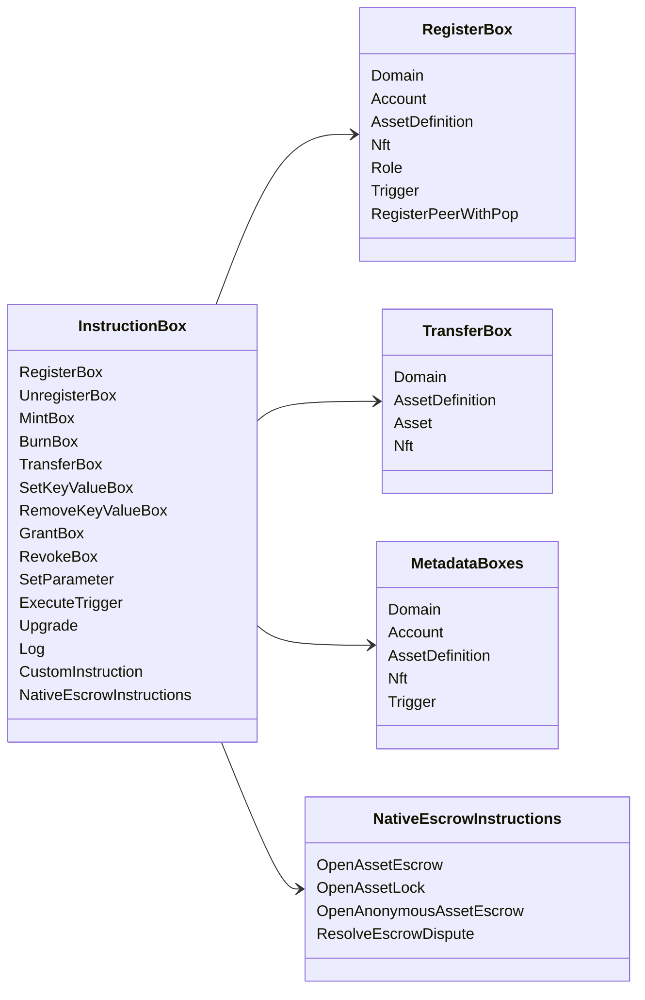

# Iroha የመመሪያ ክዋኔዎች {#iroha-special-instructions}

አሁን ያለው የውሂብ ሞዴል እነዚህን አብሮገነብ የማስተማሪያ ቤተሰቦች ያጋልጣል -

|መመሪያ|ተለዋጮች|
| --- | --- |
| [`RegisterBox`](/am/blockchain/instructions.md#un-register) |`Domain`፣ `Account`፣ `AssetDefinition`፣ `Nft`፣ `Role`፣ `Trigger`፣ `RegisterPeerWithPop`|
| [`UnregisterBox`](/am/blockchain/instructions.md#un-register) |`Peer`፣ `Domain`፣ `Account`፣ `AssetDefinition`፣ `Nft`፣ `Role`፣ `Trigger`|
| [`MintBox`](/am/blockchain/instructions.md#mint-burn) |ቁጥር `Asset`፣ ድግግሞሽ ቀስቅሴ|
| [`BurnBox`](/am/blockchain/instructions.md#mint-burn) |ቁጥር `Asset`፣ ድግግሞሽ ቀስቅሴ|
| [`TransferBox`](/am/blockchain/instructions.md#transfer) |`Domain`፣ `AssetDefinition`፣ ቁጥር `Asset`፣ `Nft`|
| [`SetKeyValueBox`](/am/blockchain/instructions.md#setkeyvalue-removekeyvalue) |`Domain`፣ `Account`፣ `AssetDefinition`፣ `Nft`፣ `Trigger` ሜታዳታ|
| [`RemoveKeyValueBox`](/am/blockchain/instructions.md#setkeyvalue-removekeyvalue) |`Domain`፣ `Account`፣ `AssetDefinition`፣ `Nft`፣ `Trigger` ሜታዳታ|
| [`GrantBox`](/am/blockchain/instructions.md#grant-revoke) |`Permission` (`Grant<Permission, Account>`)፣ `Role` (`Grant<RoleId, Account>`)፣ `RolePermission` (`Grant<Permission, Role>`)|
| [`RevokeBox`](/am/blockchain/instructions.md#grant-revoke) |`Permission` (`Revoke<Permission, Account>`)፣ `Role` (`Revoke<RoleId, Account>`)፣ `RolePermission` (`Revoke<Permission, Role>`)|
| [`SetParameter`](/am/blockchain/instructions.md#setparameter) |ሰንሰለት መለኪያ ዝመና|
| [`ExecuteTrigger`](/am/blockchain/instructions.md#executetrigger) |ቀስቅሴ አፈፃፀም|
| [`Upgrade`](/am/blockchain/instructions.md#other-instructions) |አስፈፃሚ ማሻሻል|
| [`Log`](/am/blockchain/instructions.md#other-instructions) |አስፈፃሚ ምዝግብ ማስታወሻ|
| [`CustomInstruction`](/am/blockchain/instructions.md#other-instructions) |አስፈፃሚ-ተኮር JSON ጭነት|
|[ቤተኛ የንብረት escrow](/am/blockchain/escrow.md)|`OpenAssetEscrow`፣ `AcceptAssetEscrow`፣ `MarkEscrowPaymentSent`፣ `ReleaseAssetEscrow`፣ `CancelAssetEscrow`፣ `OpenEscrowDispute`፣ `ResolveEscrowDispute`|
|[አጠቃላይ የንብረት መቆለፊያዎች](/am/blockchain/escrow.md#generic-asset-locks)|`OpenAssetLock`፣ `DrawdownAssetLock`፣ `CancelAssetLock`፣ `ExpireAssetLock`|
|[ስም-አልባ የንብረት escrow](/am/blockchain/escrow.md#anonymous-escrow)|`OpenAnonymousAssetEscrow`፣ `AcceptAnonymousAssetEscrow`፣ `MarkAnonymousEscrowPaymentSent`፣ `ReleaseAnonymousAssetEscrow`፣ `CancelAnonymousAssetEscrow`፣ `OpenAnonymousEscrowDispute`፣ `ResolveAnonymousEscrowDispute`|
|[የአቶሚክ የግል የፋይናንስ ግብይት ስምምነት](/am/blockchain/instructions.md#atomic-private-settlement)|`ActivatePrivateSettlementPoolV1`፣ `RotatePrivateSettlementPoolPolicyV1`፣ `FinalizeAtomicPrivateSettlementV1`፣ `AbortAtomicPrivateSettlementV1`|

ተጨማሪ Iroha 3 ሞጁሎች ጎራ-ተኮር የመመሪያ ዓይነቶችን በመመሪያው መዝገብ በኩል ሊመዘግቡ ይችላሉ። ለኖድ ስልጣን ያለው መርሃግብር እና እሱን ለሚይዘው ትእዛዝ፣ [የውሂብ ሞዴል ንድፍ](./data-model-schema.md) ይመልከቱ።

::: details ሥዕላዊ መግለጫ ዋና ትምህርት ቤተሰቦች

:::
