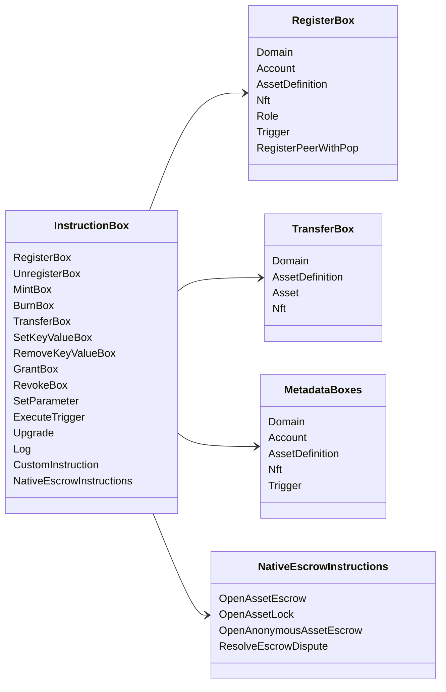

# Iroha ልዩ መመሪያዎች {#iroha-special-instructions}

የአሁኑ የውሂብ ሞዴል እነዚህን ውስጣዊ የመማሪያ ቤተሰቦች ያጋልጣል:

| መመሪያ | የተለያዩ ዓይነቶች |
| --- | --- |
| [`RegisterBox`](/am/blockchain/instructions.md#un-register) | `Domain`, `Account`, `AssetDefinition`, `Nft`, `Role`, `Trigger`, `RegisterPeerWithPop` |
| [`UnregisterBox`](/am/blockchain/instructions.md#un-register) | `Peer`, `Domain`, `Account`, `AssetDefinition`, `Nft`, `Role`, `Trigger` |
| [`MintBox`](/am/blockchain/instructions.md#mint-burn) | ቁጥር `Asset`, የመነሻ መድገም |
| [`BurnBox`](/am/blockchain/instructions.md#mint-burn) | ቁጥር `Asset`, የመነሻ መድገም |
| [`TransferBox`](/am/blockchain/instructions.md#transfer) | `Domain`, `AssetDefinition`, ቁጥር `Asset`, `Nft` |
| [`SetKeyValueBox`](/am/blockchain/instructions.md#setkeyvalue-removekeyvalue) | `Domain`, `Account`, `AssetDefinition`, `Nft`, `Trigger` ሜታዳታ |
| [`RemoveKeyValueBox`](/am/blockchain/instructions.md#setkeyvalue-removekeyvalue) | `Domain`, `Account`, `AssetDefinition`, `Nft`, `Trigger` ሜታዳታ |
| [`GrantBox`](/am/blockchain/instructions.md#grant-revoke) | የመለያ ፈቃድ፣ የሂሳብ ሚና፣ የመለያ ፈቃድ |
| [`RevokeBox`](/am/blockchain/instructions.md#grant-revoke) | ከሂሳብ ፈቃድ፣ ከሂሳብ ድርሻ፣ ከድርሻ ፈቃድ |
| [`SetParameter`](/am/blockchain/instructions.md#setparameter) | ሰንሰለት መለኪያዎች ዝመና |
| [`ExecuteTrigger`](/am/blockchain/instructions.md#executetrigger) | ማስነሻ አፈጻጸም |
| [`Upgrade`](/am/blockchain/instructions.md#other-instructions) | አስፈፃሚ ማሻሻያ |
| [`Log`](/am/blockchain/instructions.md#other-instructions) | አስፈፃሚ መዝገብ መግቢያ |
| [`CustomInstruction`](/am/blockchain/instructions.md#other-instructions) | ለሥራ አስፈፃሚው የተወሰነ JSON የዋጋ ጭነት |
| [የአገሬው ነዋሪ ንብረት ማስከበሪያ](/am/blockchain/escrow.md) | `OpenAssetEscrow`, `AcceptAssetEscrow`, `MarkEscrowPaymentSent`, `ReleaseAssetEscrow`, `CancelAssetEscrow`, `OpenEscrowDispute`, `ResolveEscrowDispute` |
| [አጠቃላይ የንብረት መቆለፊያዎች](/am/blockchain/escrow.md#generic-asset-locks) | `OpenAssetLock`, `DrawdownAssetLock`, `CancelAssetLock`, `ExpireAssetLock` |
| [የማይታወቁ ንብረቶች ዋስትና](/am/blockchain/escrow.md#anonymous-escrow) | `OpenAnonymousAssetEscrow`, `AcceptAnonymousAssetEscrow`, `MarkAnonymousEscrowPaymentSent`, `ReleaseAnonymousAssetEscrow`, `CancelAnonymousAssetEscrow`, `OpenAnonymousEscrowDispute`, `ResolveAnonymousEscrowDispute` |

ተጨማሪ Iroha 3 ሞጁሎች ለጎራ የተወሰኑ የትምህርት ዓይነቶችን መመዝገብ ይችላሉ
በሂደቱ ላይ የተቀመጠውን የሥርዓት ደረጃ ዝርዝር
የአሁኑ ምንጭ ዛፍ፣ ተመልከት [የመረጃ ሞዴል መርሃግብር](./data-model-schema.md).

::: details ሰንጠረዥ፦ መሠረታዊ መመሪያ ቤተሰቦች

:::
