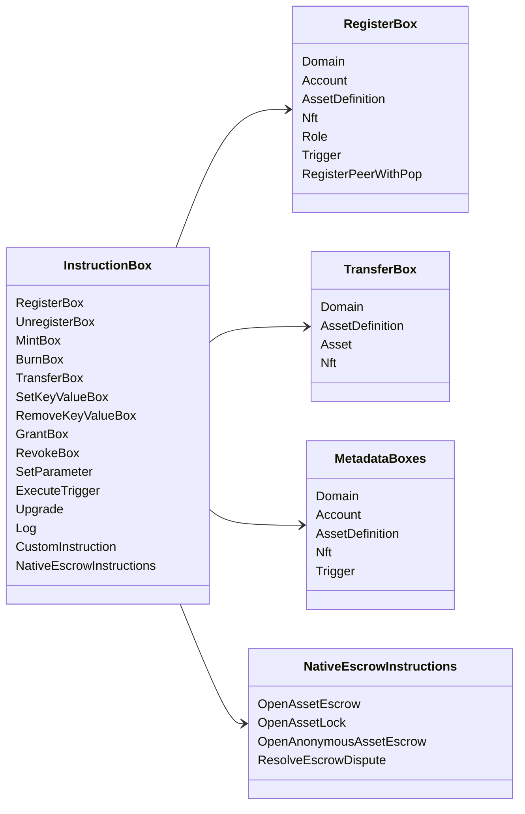

# Iroha ልዩ መመሪያዎች {#iroha-special-instructions}

የአሁኑ የውሂብ ሞዴል እነዚህን ውስጣዊ የትምህርት ቤተሰቦች ያጋልጣል:

|መመሪያ |ተለዋዋጮች|
| --- | --- |
| [`RegisterBox`](/am/blockchain/instructions.md#un-register)| `Domain`, `Account`, `AssetDefinition`, `Nft`, `Role`, `Trigger`, `RegisterPeerWithPop` |
| [`UnregisterBox`](/am/blockchain/instructions.md#un-register)| `Peer`, `Domain`, `Account`, `AssetDefinition`, `Nft`, `Role`, `Trigger` |
| [`MintBox`](/am/blockchain/instructions.md#mint-burn)|የቁጥር `Asset`፣ ተደጋጋሚ ድርጊቶችን ያስነሳል |
| [`BurnBox`](/am/blockchain/instructions.md#mint-burn)|የቁጥር `Asset`፣ ተደጋጋሚ ድርጊቶችን ያስነሳል |
| [`TransferBox`](/am/blockchain/instructions.md#transfer)|`Domain`, `AssetDefinition`, ቁጥራዊ `Asset`, `Nft` |
| [`SetKeyValueBox`](/am/blockchain/instructions.md#setkeyvalue-removekeyvalue)| `Domain`, `Account`, `AssetDefinition`, `Nft`, `Trigger` ሜታዳታ |
| [`RemoveKeyValueBox`](/am/blockchain/instructions.md#setkeyvalue-removekeyvalue)| `Domain`, `Account`, `AssetDefinition`, `Nft`, `Trigger` ሜታዳታ |
| [`GrantBox`](/am/blockchain/instructions.md#grant-revoke)| `Permission` (`Grant<Permission, Account>`), `Role` (`Grant<RoleId, Account>`), `RolePermission` (`Grant<Permission, Role>`) |
| [`RevokeBox`](/am/blockchain/instructions.md#grant-revoke)| `Permission` (`Revoke<Permission, Account>`), `Role` (`Revoke<RoleId, Account>`), `RolePermission` (`Revoke<Permission, Role>`) |
| [`SetParameter`](/am/blockchain/instructions.md#setparameter)|ሰንሰለት መለኪያዎች ዝመና |
| [`ExecuteTrigger`](/am/blockchain/instructions.md#executetrigger)|ማስነሳት አፈጻጸም |
| [`Upgrade`](/am/blockchain/instructions.md#other-instructions)|አስፈጻሚ ማሻሻያ |
| [`Log`](/am/blockchain/instructions.md#other-instructions)|አስፈጻሚ መዝገብ መግቢያ |
| [`CustomInstruction`](/am/blockchain/instructions.md#other-instructions)|ለሥራ አስፈፃሚው የተለዩ JSON ጥቅማጥቅሞች |
|   የአገር ውስጥ ንብረቶች ዋስትና| `OpenAssetEscrow`, `AcceptAssetEscrow`, `MarkEscrowPaymentSent`, `ReleaseAssetEscrow`, `CancelAssetEscrow`, `OpenEscrowDispute`, `ResolveEscrowDispute` |
| [አጠቃላይ የንብረት መዝጊያዎች ](/am/blockchain/escrow.md#generic-asset-locks) |`OpenAssetLock`, `DrawdownAssetLock`, `CancelAssetLock`, `ExpireAssetLock` |
| [የማይታወቁ ንብረቶች ዋስትና ](/am/blockchain/escrow.md#anonymous-escrow) | `OpenAnonymousAssetEscrow`, `AcceptAnonymousAssetEscrow`, `MarkAnonymousEscrowPaymentSent`, `ReleaseAnonymousAssetEscrow`, `CancelAnonymousAssetEscrow`, `OpenAnonymousEscrowDispute`, `ResolveAnonymousEscrowDispute` |

ተጨማሪ Iroha 3 ሞጁሎች በትእዛዝ መዝገብ አማካኝነት የጎራ-ተኮር የትምህርት ዓይነቶችን መመዝገብ ይችላሉ። ከአሁኑ ምንጭ ዛፍ ለተፈጠረው የስኪማ ደረጃ ዝርዝር ፣ [የዳታ ሞዴል ስኬም](./data-model-schema.md)ን ይመልከቱ።

::: details ሰንጠረዥ፦ የቤተሰብ መሠረታዊ መመሪያ

:::
