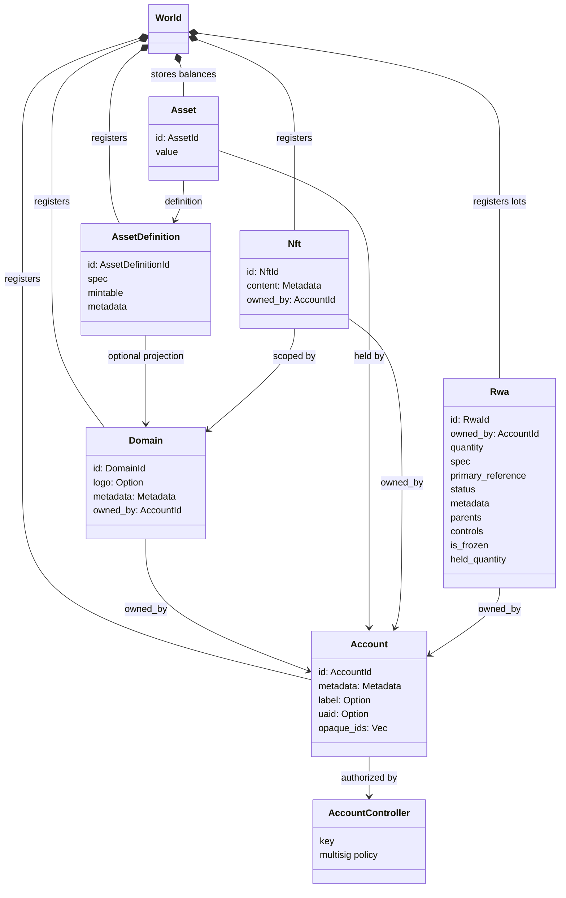
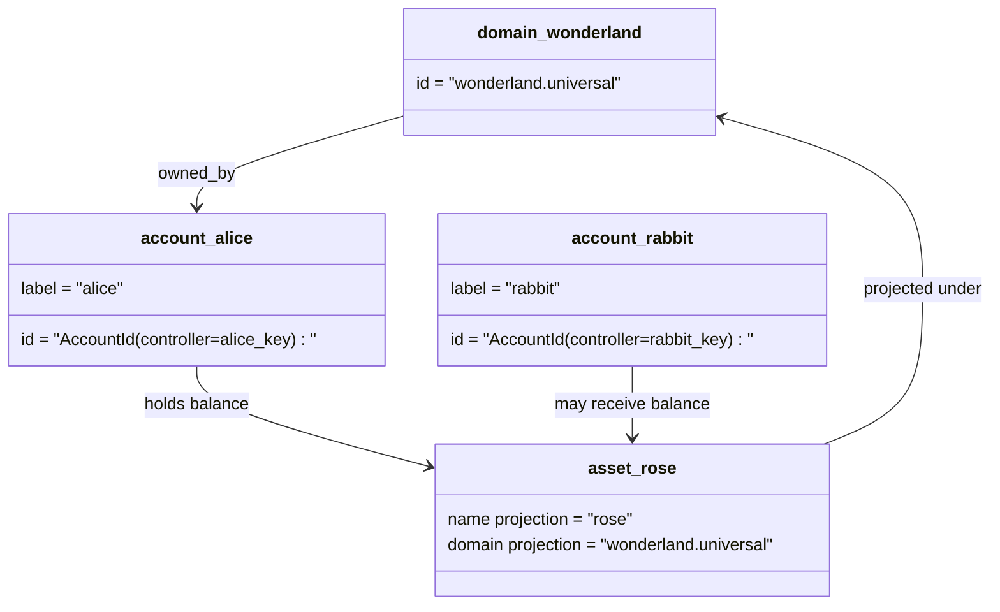

# نموذج البيانات {#data-model}

Iroha تخزين حالة دفتر التسجيل في `World`. يستخدم نموذج بيانات الإصدار الأول هذه الهويات والكيانات القنونية التالية:

- النطاقات معتمدة على مساحة البيانات، على سبيل المثال `payments.universal`
- الحسابات القانونية وبدون نطاق؛ يحصل الحساب ID من مدير الحساب
- تعريفات الأصول يمكن أن تحافظ على إشارة نطاق / اسم ، ولكن عنوانهم النصي القنوني هو معرف Base58 غير شفاف
- الأصول هي الرصيدات التي تحتفظ بها الحسابات لتحديد خاص للأصول
- NFTs هي سجلات مملوكة بشكل فريد مع مستوى المجال مؤهل IDs ومحتوى البيانات المتعددة
- يتم توليد RWAs - ID المكونات التي تمثل أصول خارج السلسلة مع الاحتفاظ بالمالك الحالي والكمية والمصدر، والبيانات الأساسية، والاحتفاظ بها، والتجميد، ومراقبة دورة الحياة.

## مثال {#example}

في شبكة Iroha 3 ، `wonderland.universal` هو نطاق داخل مساحة البيانات `universal`. يتم التحكم في الحسابات القنونية في هذا المثال من خلال مفاتيحها أو سياساتها ويشفر كحساب I105 بدون نطاق IDs. العلامات القابلة للقراءة مثل`alice@wonderland.universal` هي أسماء مستعار منفصلة مرتبطة بهذه IDs. لا يزال من الممكن بناء تعريف الأصول المتوقعة من نطاق واسم مثل `rose` في `wonderland.universal` ، في حين أن العنوان القنوني لتحديد الأصول المستخدم على السلك هو عنوان Base58 الذي تم إنشاؤه.

## الاسم الأدنى {#aliases}

الأسماء المستعار هي أسماء تواجه الإنسان على مستويات فوق معرفات دفتر الرسوم العام القنوني. فهي مفيدة في حدود API ، CLI ، المحفظة ، والمستكشف، ولكن الصفحة القنونيّة IDs تظل المعرفات الثابتة التي يتم تخزينها في حقل الكتب العامة الصارمة.

|الهدف|الهدف القنوني |الاسم الحقيقي |نموذج دعم |
| -------------- | --------------------------------------------------- | ------------------------------------------------------ | ----------------------------------------------------------------------------- |
|حساب المستخدم |بدون نطاق `AccountId` مشفرة كعنوان I105 |`name@domain.dataspace` أو `name@dataspace` |`AccountAlias`؛ الاسم الأساسي هو `Account.label`، الأسماء الإضافية ملزمة |
|تعريف الأصول |العنوان القديس `AssetDefinitionId` Base58 |`name#domain.dataspace` أو `name#dataspace` |`AssetDefinitionAlias` ملزمة بتعريف الأصول |
|العقد |الكانونيكي Bech32m `ContractAddress` |`name::domain.dataspace` أو `name::dataspace` |`ContractAlias` مرتبطة بعنوان عقد تم نشره |
|اسم النطاق |`DomainId` في نموذج `domain.dataspace` |`domain.dataspace` |SNS `domain` سجل مساحة الأسماء|
|اسم مساحة البيانات|الرقمية `DataSpaceId` من الكتالوج النشط Nexus |أسماء مستعارة لمجال البيانات مثل `universal`، `paynet`، أو `zk` |SNS `dataspace` سجل مساحة الأسماء بالإضافة إلى كتالوج مساحة البيانات النشطة |

مستعار الحسابات هي أسماء الحسابات التي يواجهها المستخدمون. إنها تبقى على قيد الحياة بسبب أن الاسم المستعار يشير إلى الحساب النشط ID من خلال مؤشرات الدول العالمية وسجلات مستخدم الحسابات. استخدم `SetPrimaryAccountAlias` لتسمية الحساب الأساسية، `SetAccountAliasBinding` للتسمى غير الأساسية الإضافية، و `FindAccountByAlias` أو `FindAliasesByAccountId` للقراءة. تطلب أسماء الأسماء الأساسية للحساب عادة تأجير أسماك الحساب النشطة SNS التي تم الحصول عليها مع `AcquireAccountAliasLease` وتتجدد مع `RenewAccountAliasLease`.

مستعار الأصول تعريفات الأصول ، وليس رصيد الحسابات الفردية. مستعار الأصل والعقد هي روابط مباشرة من اسم يمكن قراءته إلى هدف قائد موجود. يتم تعيين أسماء مستعار للأصول مع `SetAssetDefinitionAlias` ؛ يجب أن يطابق قطاع اسم الاسم المستعار مع اسم عرض تعريف الأصل أو اسم التعريف المتوقع. يتم تعيين الأسماء المستعار للعقود مع `SetContractAlias`؛ يجب أن يتطابق مساحة بيانات الاسم المجهول مع مساحة البيانات المشفرة في عنوان العقد . يمكن لكل من الروابط أن تحمل `lease_expiry_ms`؛ بعد انتهاء الصلاحية فإنها تتوقف عن الحل عندما تنتهي نافذة النعمة ويتم مسحها من مؤشرات الدول العالمية.

النطاقات لا تمتلك مستوى منفصل `DomainAlias` موضوع. معرف النطاق هو بالفعل اسم مؤهل في مساحة البيانات مثل `payments.universal`. SNS تتبع الإيجار الملكية لأسماء النطاقات في `domain` مساحة الأسماء و لـ مستعار مساحة البيانات في `dataspace` مساحة الأسماء. `universal` يجب أن تظل مستعار مساحة البيانات محددة.

## المستندات ذات الصلة {#related-docs}

|الموضوع|إلى أين أذهب|
| -------------------------------------- | ------------------------------------------- |
|النطاقات| [النطاقات](/ar/blockchain/domains.md)|
|الحسابات| [الحسابات](/ar/blockchain/accounts.md) |
|الأصول | [الأصول](/ar/blockchain/assets.md) |
|NFTs | [NFTs](/ar/blockchain/nfts.md) |
|أصول في العالم الحقيقي| [الأصول في العالم الحقيقي](/ar/blockchain/rwas.md) |
|البيانات المتعددة | [البيانات الأساسية ](/ar/blockchain/metadata.md) |
|تعليمات التسجيل والتحويل | [التعليمات ](/ar/blockchain/instructions.md) |
|الإذنات في وقت التشغيل| [الإذن ](/ar/blockchain/permissions.md) |
|قواعد الإسم| [قواعد الإسم](/ar/reference/naming.md) |
