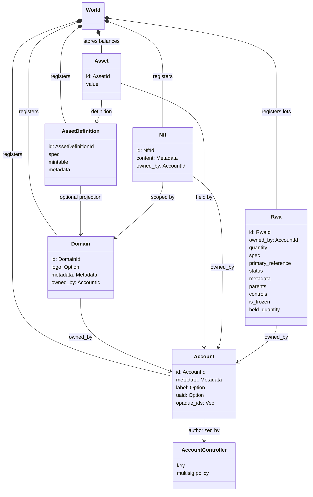
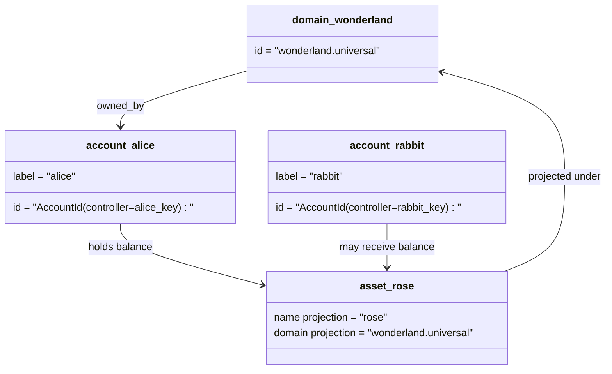

# نموذج البيانات {#data-model}

Iroha يخزن حالة دفتر الأستاذ الخاص بالبلوكشين في `World`. يستخدم نموذج البيانات الخاص بالإصدار الأول الهوية والكيانات القياسية للبروتوكول التالية:

- النطاقات مؤهلة بمساحة البيانات، على سبيل المثال `payments.universal`
- الحسابات تتبع بروتوكولاً قياسياً واحداً ولا تنتمي إلى أي نطاق؛ يتم اشتقاق معرف الحساب من وحدة التحكم في الحساب
- يمكن لتعريفات الأصول الاحتفاظ بإسقاط نطاق/اسم، ولكن عنوانها النصي الموحد وفقًا للبروتوكول هو معرف Base58 غامض
- الأصول هي الأرصدة التي تحتفظ بها الحسابات لتعريف أصل محدد
- NFTs هي سجلات مملوكة بشكل فريد تحتوي على معرفات مؤهلة بالنطاق ومحتوى بيانات وصفية
- RWAs هي دفعات مُولَّدة معرفيًا تمثل أصولًا خارج السلسلة مع المالك الحالي والكمية والأصل والبيانات الوصفية والاحتجازات والتجميدات وعناصر التحكم في دورة الحياة

## مثال {#example}

في شبكة Iroha 3، `wonderland.universal` هو نطاق داخل مساحة بيانات `universal`. الحسابات وفق المعيار البروتوكولي في هذا المثال يتم التحكم فيها بواسطة مفاتيحها أو سياساتها ويتم ترميزها كمعرفات حساب I105 بلا نطاق. تُعتبر الملصقات المقروءة مثل `alice@wonderland.universal` أسماء مستعارة منفصلة مرتبطة بتلك المعرفات. لا يزال من الممكن إنشاء تعريف أصل متوقع من نطاق واسم مثل `rose` في `wonderland.universal`، بينما العنوان الواحد لتعريف الأصل وفقًا للبروتوكول المستخدم في النقل البروتوكولي هو العنوان الناتج بصيغة Base58.

## أسماء مستعارة {#aliases}

الأسماء المستعارة هي أسماء موجهة للبشر ويتم وضعها فوق معرفات دفتر الأستاذ العام القياسي للبروتوكول الواحد. إنها مفيدة عند API، CLI، المحافظ، وحدود المستكشف، لكن معرفات البروتوكول الواحد القياسية تظل المعرفات المستقرة المخزنة في حقول دفتر الأستاذ العام الصارمة.

|هدف|هدف بروتوكول-معيار فردي|الاسم المستعار الحرفي|نموذج النسخ الاحتياطي|
| -------------- | --------------------------------------------------- | ------------------------------------------------------ | ----------------------------------------------------------------------------- |
|حساب المستخدم|خالي من النطاق `AccountId` مشفر كعنوان I105| `name@domain.dataspace` أو `name@dataspace`            | `AccountAlias`؛ الاسم المستعار الأساسي هو `Account.label`، الأسماء المستعارة الإضافية هي الروابط|
|تعريف الأصل|عنوان Base58 وفق معيار البروتوكول الفردي `AssetDefinitionId`| `name#domain.dataspace` أو `name#dataspace`            |مرتبط بتعريف الأصل `AssetDefinitionAlias`|
|عقد|بروتوكول-القياسي الفردي Bech32m `ContractAddress`| `name::domain.dataspace` أو `name::dataspace`          |`ContractAlias` مرتبط بعنوان عقد تم نشره|
|اسم المجال| `DomainId` في شكل `domain.dataspace` |`domain.dataspace`| SNS `domain` سجل مساحة الأسماء |
|اسم مساحة البيانات|رقمي `DataSpaceId` من الكتالوج النشط Nexus|اسم مستعار لمساحة البيانات مثل `universal`، `paynet`، أو `zk`|SNS `dataspace` سجل مساحة الاسم بالإضافة إلى كتالوج مساحة البيانات النشطة|

أسماء الحساب المستعارة هي أسماء الحساب التي يراها المستخدم. إنها تبقى بعد إعادة تعيين مفتاح الحساب لأن الاسم المستعار يشير إلى معرف الحساب النشط من خلال مؤشرات حالة العالم وسجلات إعادة تعيين مفتاح الحساب. استخدم `SetPrimaryAccountAlias` لتسمية الحساب الأساسية، و`SetAccountAliasBinding` للأسماء المستعارة الإضافية غير الأساسية، و`FindAccountByAlias` أو `FindAliasesByAccountId` للقراءات. عادةً ما تتطلب الأسماء المستعارة للحساب الحصول على عقد استئجار اسم حساب نشط SNS يتم الحصول عليه باستخدام `AcquireAccountAliasLease` ويتم تجديده باستخدام `RenewAccountAliasLease`.

تسميات الأصول تسمّي تعريفات الأصول، وليس أرصدة الحسابات الفردية. تسميات الأصول وتسميات العقود هي روابط مباشرة من اسم قابل للقراءة إلى هدف واحد موجود وفقًا لمعايير البروتوكول. يتم تعيين أسماء الأصول المستعارة باستخدام `SetAssetDefinitionAlias`؛ يجب أن يتطابق جزء اسم المستعار مع اسم العرض لتعريف الأصل أو اسم التعريف المتوقع. يتم تعيين أسماء العقود المستعارة باستخدام `SetContractAlias`; يجب أن تتطابق مساحة البيانات المستعارة مع مساحة البيانات المشفرة في عنوان العقد. يمكن أن تحمل كل من الرابطين `lease_expiry_ms`؛ بعد انتهاء الصلاحية، يتوقفان عن الحل عند انقضاء نافذة السماح ويتم مسحهما من مؤشرات حالة العالم.

النطاقات ليس لها كائن `DomainAlias` منفصل. معرف النطاق هو بالفعل اسم مؤهل بمساحة البيانات مثل `payments.universal`. SNS يتتبع ملكية الإيجار لأسماء النطاقات في مساحة الأسماء `domain` ولأسماء مستعارة لمجالات البيانات في مساحة الأسماء `dataspace`. يجب أن يظل اسم المجال المستعار المحجوز `universal` معرفًا.

## المستندات ذات الصلة {#related-docs}

|الموضوع|إلى أين تذهب|
| -------------------------------------- | ------------------------------------------- |
|النطاقات| [النطاقات](/ar/blockchain/domains.md)           |
|الحسابات| [الحسابات](/ar/blockchain/accounts.md)         |
|الأصول| [الأصول](/ar/blockchain/assets.md)             |
| NFTs                                   | [NFTs](/ar/blockchain/nfts.md)                 |
|الأصول الواقعية|[الأصول الواقعية](/ar/blockchain/rwas.md)|
|البيانات الوصفية| [البيانات الوصفية](/ar/blockchain/metadata.md)         |
|تعليمات التسجيل والتحويل| [تعليمات](/ar/blockchain/instructions.md) |
|أذونات بيئة تنفيذ البرمجيات|[الأذونات](/ar/blockchain/permissions.md)|
|قواعد التسمية| [قواعد التسمية](/ar/reference/naming.md)        |
