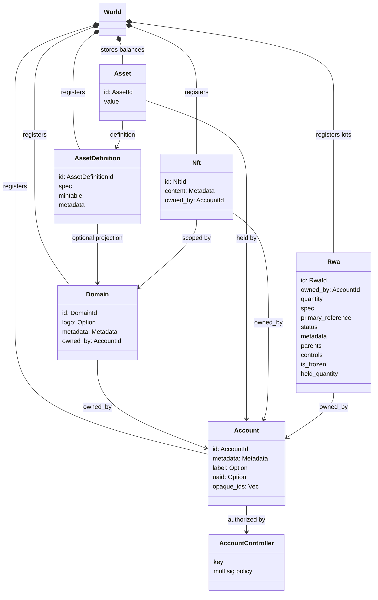
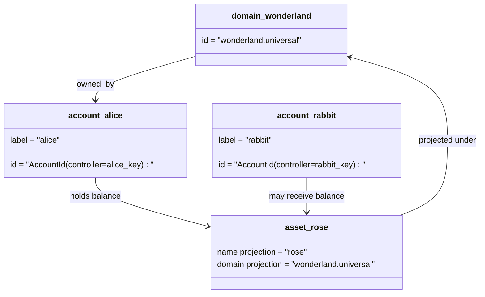

# نموذج البيانات {#data-model}

Iroha المتاجر الكبرى في الولاية `World`. استخدامات نموذج البيانات في الإصدار الأول
الهويات والكيانات القنونية التالية:

- النطاقات مؤهلة لمجال البيانات ، على سبيل المثال `payments.universal`
- الحسابات القانونية وبدون نطاق ID هو مشتق من
  مراقب الحساب
- تعريفات الأصول يمكن أن تحافظ على نطاق النطاق / الاسم، ولكن القنوية
  العنوان النصي هو معرف Base58 غير واضح
- الأصول هي الرصيدات التي تحتفظ بها حسابات تعريف خاص للأصول
- NFTs هي سجلات مملوكة بشكل فريد مع مستوى مؤهل IDs و البيانات المتعددة
  المحتوى
- RWAs يتم توليدها -ID المكونات التي تمثل الأصول خارج السلسلة مع النقود الحالية
  المالك، الكمية، المنشأ، البيانات الأساسية، الاحتفاظ، التجميد، ودورة الحياة
  التحكم

## مثال {#example}

في Iroha 3 الشبكة `wonderland.universal` هو نطاق داخل
`universal` مساحة البيانات. الحسابات القنونية في هذا المثال يتم التحكم فيها
بواسطة مفاتيحهم أو سياساتهم ويشفرونها على أنها بدون نطاق I105 الحساب IDs. يمكن القراءة
العلامات مثل: `alice@wonderland.universal` هي أسماء مستعار منفصلة مرتبطة
IDs. لا يزال يمكن بناء تعريف الأصول المتوقعة من نطاق
اسم مثل: `rose` في `wonderland.universal`, بينما الأصول القنونية
عنوان التعريف المستخدم على السلك هو عنوان Base58 الذي تم توليه.

## الألقاب {#aliases}

الاسم الأسمى هي أسماء تواجه الإنسان على مستويات فوق المعرفين الكانوني.
فهي مفيدة في API, CLI, محفظة، و حدود المستكشفين، ولكن القنوني
IDs تبقى المعرفات المستقرة المخزنة في حقل الكتيب الضيق.

| الهدف         | الهدف القنوني                                    | الاسم الحقيقي                                          | نموذج الدعم                                                                 |
| -------------- | --------------------------------------------------- | ------------------------------------------------------ | ----------------------------------------------------------------------------- |
| حساب المستخدم   | بدون مستوى `AccountId` مرموزة كـ I105 العنوان   | `name@domain.dataspace` أو `name@dataspace`            | `AccountAlias`; الاسم الأول هو `Account.label`, الأسماء الإضافية هي الالتزام  |
| تعريف الأصول | الكنسي `AssetDefinitionId` العنوان Base58     | `name#domain.dataspace` أو `name#dataspace`            | `AssetDefinitionAlias` مرتبطة بتعريف الأصول                           |
| العقد       | الكانونيكي Bech32m `ContractAddress`                 | `name::domain.dataspace` أو `name::dataspace`          | `ContractAlias` مرتبطة بعنوان العقد المستخدم                          |
| اسم النطاق    | `DomainId` في `domain.dataspace` الشكل               | `domain.dataspace`                                    | SNS `domain` سجل مساحة الأسماء                                                 |
| اسم مساحة البيانات | العدد `DataSpaceId` من النشط Nexus الكتالوج | مستعار مساحة البيانات مثل `universal`, `paynet`, أو `zk` | SNS `dataspace` سجل مساحة الأسماء بالإضافة إلى كتالوج مساحة البيانات النشطة            |

أسماء الاسم التلقائية للحسابات هي أسماء الحسابات التي يواجهها المستخدمون.
إعادة التسجيل لأن الاسم المطلق يشير إلى الحساب النشط ID من خلال الدولة العالمية
المؤشرات و سجلات حسابي `SetPrimaryAccountAlias` لـ
العلامة الرئيسية للحساب `SetAccountAliasBinding` لغير الابتدائي الإضافي
الاسم الخاطئ، و `FindAccountByAlias` أو `FindAliasesByAccountId` للقراءة
أسماء الاسم الخاصة بالحسابات تتطلب عادة SNS الإيجار المشترك
مع `AcquireAccountAliasLease` و تم تجديدها `RenewAccountAliasLease`.

أسماء الأصول تعريفات الأصول، وليس رصيد الحساب الفردي.
الاسم الأليف والاسم العقدي هو الالتزامات المباشرة من اسم يمكن قراءته إلى
المستهدف القنوني الحالي. `SetAssetDefinitionAlias`;
يجب أن يتطابق قطاع الاسم المستعار مع اسم عرض تعريف الأصول أو
الاسم المتوقع لتحديد العقود `SetContractAlias`;
يجب أن يطابق مساحة البيانات الاسمية مساحة بيانات مرموزة في عنوان العقد.
كلتا الارتباطين يمكن أن تحمل `lease_expiry_ms`; بعد انتهاء الصلاحية تتوقف عن الحل
عندما تنتهي نافذة النعمة ويتم مسحها من مؤشرات الدول العالمية

النطاقات لا تمتلك مستوى منفصل `DomainAlias` الموضوع. معرف النطاق هو
بالفعل اسم مؤهل لمجال البيانات مثل `payments.universal`. SNS المسارات
تأجير ملكية أسماء النطاقات في `domain` مساحة الأسماء ومساحة البيانات
الاسم الخاطئ في `dataspace` مساحة الأسماء `universal` مستعار مساحة البيانات
يجب أن تبقى محددة.

## وثائق ذات صلة {#related-docs}

| الموضوع                                  | إلى أين أذهب ؟                                 |
| -------------------------------------- | ------------------------------------------- |
| المجال                                | [المجال](/ar/blockchain/domains.md)           |
| الحسابات                               | [الحسابات](/ar/blockchain/accounts.md)         |
| الأصول                                 | [الأصول](/ar/blockchain/assets.md)             |
| NFTs                                   | [NFTs](/ar/blockchain/nfts.md)                 |
| الأصول في العالم الحقيقي                      | [الأصول في العالم الحقيقي](/ar/blockchain/rwas.md)    |
| البيانات المتعددة                               | [البيانات المتعددة](/ar/blockchain/metadata.md)         |
| تعليمات التسجيل والتحويل | [التعليمات](/ar/blockchain/instructions.md) |
| الإذنات في وقت التشغيل                    | [الإذن](/ar/blockchain/permissions.md)   |
| قواعد الإسم                           | [قواعد الإسم](/ar/reference/naming.md)        |
