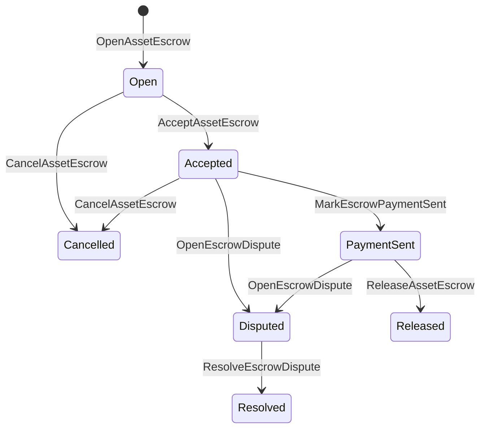

# الاحتفاظ بالأصول الأصلية {#native-asset-escrow}

الاحتفاظ الأصلي هو آلية الحفاظ على الأصول الرقمية التي يتم إدارتها في دفتر التسجيل. بدلاً من إرسال الأصول إلى حساب مملوك للتطبيق والاعتماد على رمز التطبيق لحماية هذا الحساب ، الاحتفاظ ISIs تحويل القيمة إلى حساب حجز البروتوكول المحدد وتسجيل دورة حياة الاحتفاض في حالة العالم.

استخدم الاحتفاظ الأصلي للتسوية في السوق ، وتنسيق المدفوعات خارج السلسلة على غرار أيتاي ، وقفلات الأهداف ، وتدفقات عمل الاحتفاض المحمية التي تحتاج إلى حالة دورة الحياة المرئية من الكتب الرئيسية.

## المفاهيم {#concepts}

|المفهوم|وصف|
| --- | --- |
|`EscrowId` |الهوية المحددة من قبل المتصل الذي يحتوي على هاشش يجب أن تكون فريدة بين الأمانات الشفافة والمجهولة. |
|`AssetEscrowRecord` |سجل الاحتفاظ بالأصول الرقمية الشفافة أو القفل. |
|`AnonymousAssetEscrowRecord` |سجل الاحتفاظ بحماية مدعومة بإلغاء التزامات وثائق إثبات.|
|حساب الاحتفاظ|حساب بروتوكول التحديد المستمد من سلسلة ID ، الاحتفاظ ID، وصف الأصول. |
|الأدلة هيشيه |حشوف من الفواتير، الحكمات، الرسائل، بيانات التخزين، أو غيرها من الأدلة خارج سلسلة.|

السجلات الشفافة تحمل البائع، والمشتري الاختياري، وصف الأصول، والكمية الإجمالية، وحساب الاحتفاظ، وضع دورة الحياة، نوع السلوك، المبلغ المتبقي، وسلطة الإصدار الاختيرية، وتخميس انتهاء الصلاحية الاختيارتي، ومعطيات الأدلة، والخميسات الزمنية، وتفاصيل الحل الاختيري.

يجب أن تكون مبالغ الاحتفاظ بأصول رقمية إيجابية ويجب أن تتطابق مع المواصفات الرقمية لتعريف الأصول. بينما يكون الاحتفاض أو القفل نشطًا ، لا يمكن لنقل الأصول العامة استنزاف حساب الحفظ ؛ فإن طرق الخروج من الاحتفاذ هي الاحتفال ISIs الموصوفة أدناه .

## الاحتفاظ بالسوق {#marketplace-escrow}

ينسق الاحتفاظ بالسوق إطلاق أصول داخل السلسلة مع تدفق عمل الدفع أو التسليم خارج سلسلة.



|ISI |من يقدمها ؟|التأثير|
| --- | --- | --- |
|`OpenAssetEscrow` |البائع |يقفل الأصول الرقمية للبائع في الاحتفاظ بالبروتوكول وخلق سجل سوق `Open`. |
|`AcceptAssetEscrow` |المشتري |سجل المشتري ويتحرك `Open` إلى `Accepted`. البائع لا يمكنه قبول الاحتفاظ بنفسه. |
|`MarkEscrowPaymentSent` |المشتري المقبول |ينتقل `Accepted` إلى `PaymentSent` بعد أن يرسل المشتري الدفع خارج السلسلة. |
|`ReleaseAssetEscrow` |البائع |يتحرك `PaymentSent` إلى `Released` ويحول المبلغ الكامل المتعهد به للمشتري. |
|`CancelAssetEscrow` |البائع |ينتقل `Open` أو `Accepted` إلى `Cancelled` ويسترد البائع قبل أن يتم وضع علامة على الدفع .|
|`OpenEscrowDispute` |البائع أو المشتري المقبول |ينتقل `Accepted` أو `PaymentSent` إلى `Disputed` ويضيف هاشات الأدلة. |
|`ResolveEscrowDispute` |الحساب مع `CanResolveEscrowDispute` |يتحرك `Disputed` إلى `Resolved` ويقسم المبلغ بين المشتري والبائع. |

يجب أن تكون مبالغ حل النزاعات غير سلبية، ويجب أن يكون `buyer_amount + seller_amount` مساوياً لمبلغ الاحتفاظ. يُسمح بالخلفات ذات القيمة الصفرية، ولكن يجب أن تعتبر التقسيم بأكمله الرصيد المحتجز.

### Rust مثال {#rust-example}

هذا المثال يفترض أن حسابات البائع والمشتري موجودة بالفعل، وتسجل تعريف الأصول بأنها رقمية، والبائع لديه ميزان كافٍ.

```rust
use iroha::{
    client::Client,
    data_model::{
        isi::escrow::{
            AcceptAssetEscrow, MarkEscrowPaymentSent, OpenAssetEscrow,
            ReleaseAssetEscrow,
        },
        prelude::*,
    },
};
use iroha_crypto::Hash;

fn release_marketplace_escrow(
    seller_client: &Client,
    buyer_client: &Client,
    asset_definition_id: AssetDefinitionId,
) -> eyre::Result<()> {
    let escrow_id = EscrowId::new(Hash::new("docs-marketplace-escrow-001"));

    seller_client.submit_blocking(OpenAssetEscrow::with_evidence_hashes(
        escrow_id,
        asset_definition_id,
        Numeric::from(40_u64),
        vec![Hash::new("invoice:2026-001")],
    ))?;

    buyer_client.submit_blocking(AcceptAssetEscrow::new(escrow_id))?;
    buyer_client.submit_blocking(MarkEscrowPaymentSent::new(escrow_id))?;
    seller_client.submit_blocking(ReleaseAssetEscrow::new(escrow_id))?;

    let record = seller_client.query_single(FindAssetEscrowById::new(escrow_id))?;
    assert_eq!(record.status, AssetEscrowStatus::Released);
    assert_eq!(record.remaining_amount, Numeric::zero());

    Ok(())
}
```

## مقفلات الأصول العامة {#generic-asset-locks}

يستخدم قفل الأصول نفس نوع سجل الاحتفاظ، لكنها ليست عروض المشتري-البائع. فإنها تقفل الأموال لحساب الوجهة وتتطلب اختياريًا سلطة إطلاق منفصلة لسحب الأموال.

|ISI |من يقدمها ؟|التأثير|
| --- | --- | --- |
|`OpenAssetLock` |حساب المصدر |يحتجز مبلغ إيجابي، ويُسجل الوجهة كمشتري سجل، ويقوم بتعيين حالة `Locked`. |
|`DrawdownAssetLock` |سلطة الإفراج ، أو الوجهة عندما لا يتم تحديد سلطة إفراج |تحويل جزء من الاحتجاز المتبقي أو كاملة إلى الوجهة. |
|`CancelAssetLock` |مفتاح القفل|يقوم بإلغاء قفل نشط ويرجع المبلغ المتبقي إلى مفتاحه. |
|`ExpireAssetLock` |أي سلطة معاملة بعد الموعد النهائي |تنتهي صلاحية القفل مع `expires_at_ms` في الماضي ويرجع المبلغ المتبقي إلى مفتاح. |

`DrawdownAssetLock` يحافظ على السجل في `Locked` بينما يبقى بعض المبالغ. عندما يصل المبلغ المتبقي إلى الصفر، يصبح الحالة `DrawnDown` ويتم إغلاق سجل.

```rust
use iroha::{
    client::Client,
    data_model::{
        isi::escrow::{CancelAssetLock, DrawdownAssetLock, ExpireAssetLock, OpenAssetLock},
        prelude::*,
    },
};
use iroha_crypto::Hash;

fn drawdown_and_close_asset_locks(
    opener_client: &Client,
    destination_client: &Client,
    release_authority_client: &Client,
    asset_definition_id: AssetDefinitionId,
    destination: AccountId,
    release_authority: AccountId,
) -> eyre::Result<()> {
    let trusted_lock_id = EscrowId::new(Hash::new("docs-asset-lock-trusted"));

    opener_client.submit_blocking(OpenAssetLock::with_options(
        trusted_lock_id,
        asset_definition_id.clone(),
        destination.clone(),
        Numeric::from(40_u64),
        Some(release_authority),
        None,
        vec![Hash::new("milestone-plan-v1")],
    ))?;

    release_authority_client.submit_blocking(DrawdownAssetLock::new(
        trusted_lock_id,
        Numeric::from(15_u64),
    ))?;

    let partially_drawn =
        opener_client.query_single(FindAssetEscrowById::new(trusted_lock_id))?;
    assert_eq!(partially_drawn.status, AssetEscrowStatus::Locked);
    assert_eq!(partially_drawn.remaining_amount, Numeric::from(25_u64));

    opener_client.submit_blocking(CancelAssetLock::new(trusted_lock_id))?;
    let cancelled = opener_client.query_single(FindAssetEscrowById::new(trusted_lock_id))?;
    assert_eq!(cancelled.status, AssetEscrowStatus::Cancelled);

    let expiring_lock_id = EscrowId::new(Hash::new("docs-asset-lock-expiring"));
    opener_client.submit_blocking(OpenAssetLock::with_options(
        expiring_lock_id,
        asset_definition_id,
        destination,
        Numeric::from(10_u64),
        None,
        Some(0),
        Vec::new(),
    ))?;

    destination_client.submit_blocking(ExpireAssetLock::new(expiring_lock_id))?;
    let expired = opener_client.query_single(FindAssetEscrowById::new(expiring_lock_id))?;
    assert_eq!(expired.status, AssetEscrowStatus::Expired);

    Ok(())
}
```

Python يضع حاليًا مساعدي المستوى العالي في القفلات العامة: `open_asset_lock`, `drawdown_asset_lock`, `cancel_asset_lock`, و `expire_asset_lock`. للأسواق و الاحتفاظ بالأمانة من: Python, الاستخدام الكنسي `InstructionBox` JSON من خلال SDK- نعم . JSON الهروب من النافذة، أو تقديمها من خلال SDK التي تعرض بناء الاحتياطات من الدرجة الأولى.

## النزاعات {#disputes}

يمكن أن يدخل الاحتفاظ بالسوق النزاع من `Accepted` أو `PaymentSent`. يمكن للبائع المسجل أو المشتري فقط فتح النزاع. يتطلب الحل `CanResolveEscrowDispute` ، إما تم توفيرها مباشرة إلى حساب القرار أو تتولى من خلال دور.

```rust
use iroha::{
    client::Client,
    data_model::{
        isi::escrow::{OpenEscrowDispute, ResolveEscrowDispute},
        prelude::*,
    },
};
use iroha_crypto::Hash;
use iroha_executor_data_model::permission::escrow::CanResolveEscrowDispute;

fn resolve_disputed_escrow(
    admin_client: &Client,
    buyer_client: &Client,
    court_client: &Client,
    court: AccountId,
    escrow_id: EscrowId,
) -> eyre::Result<()> {
    admin_client.submit_blocking(Grant::account_permission(
        Permission::from(CanResolveEscrowDispute),
        court,
    ))?;

    buyer_client.submit_blocking(OpenEscrowDispute::with_evidence_hashes(
        escrow_id,
        vec![Hash::new("buyer-payment-receipt")],
    ))?;

    court_client.submit_blocking(ResolveEscrowDispute::with_evidence_hashes(
        escrow_id,
        Numeric::from(30_u64),
        Numeric::from(10_u64),
        vec![Hash::new("court-judgement-001")],
    ))?;

    let record = admin_client.query_single(FindAssetEscrowById::new(escrow_id))?;
    assert_eq!(record.status, AssetEscrowStatus::Resolved);
    assert_eq!(
        record.resolution.as_ref().map(|resolution| resolution.buyer_amount.clone()),
        Some(Numeric::from(30_u64)),
    );

    Ok(())
}
```

## الخصم المجهول {#anonymous-escrow}

تستخدم الاحتفاظ المجهول نفس دورة حياة السوق ، ولكن يتم حماية حركة التمويل وإغلاق الأصول. لا يزال سجل العام يحفظ البائع والمشتري والحالة ومحطات الأدلة والخنادق الزمنية وسجلات الحركة المتصلة بالدليل. يتم تمثيل المبالغ والمستلمين داخل النقود المحمية بالالتزامات والإلغاءات والأوراق المرفقة بالأدلة.

|شفافة ISI |مجهول ISI |
| --- | --- |
|`OpenAssetEscrow` |`OpenAnonymousAssetEscrow` |
|`AcceptAssetEscrow` |`AcceptAnonymousAssetEscrow` |
|`MarkEscrowPaymentSent` |`MarkAnonymousEscrowPaymentSent` |
|`ReleaseAssetEscrow` |`ReleaseAnonymousAssetEscrow` |
|`CancelAssetEscrow` |`CancelAnonymousAssetEscrow` |
|`OpenEscrowDispute` |`OpenAnonymousEscrowDispute` |
|`ResolveEscrowDispute` |`ResolveAnonymousEscrowDispute` |

يجب أن تقوم محفظة أو أدوات البيانات ببناء مرفق الأدلة والمدخلات العامة. يخلق الانفتاح التزامًا واحدًا في الاحتفاظ. يجب أن تنفق الإفراج والإلغاء وحل النزاعات المجهول بالضبط على التزام واحد في الاحتفال وتخلق المشتري أو البائع أو التزامات الإنتاج المنقسمة التي تتطلبها العمل.

```rust
use iroha::{
    client::Client,
    data_model::{
        isi::escrow::{
            AcceptAnonymousAssetEscrow, MarkAnonymousEscrowPaymentSent,
            OpenAnonymousAssetEscrow,
        },
        prelude::*,
        proof::ProofAttachment,
    },
};
use iroha_crypto::Hash;

fn open_anonymous_escrow(
    seller_client: &Client,
    buyer_client: &Client,
    escrow_id: EscrowId,
    asset_definition_id: AssetDefinitionId,
    funding_nullifiers: Vec<[u8; 32]>,
    escrow_commitment: [u8; 32],
    proof: ProofAttachment,
    root_hint: Option<[u8; 32]>,
) -> eyre::Result<()> {
    seller_client.submit_blocking(OpenAnonymousAssetEscrow::with_evidence_hashes(
        escrow_id,
        asset_definition_id,
        funding_nullifiers,
        escrow_commitment,
        proof,
        root_hint,
        vec![Hash::new("shielded-invoice")],
    ))?;

    buyer_client.submit_blocking(AcceptAnonymousAssetEscrow::new(escrow_id))?;
    buyer_client.submit_blocking(MarkAnonymousEscrowPaymentSent::new(escrow_id))?;

    Ok(())
}
```

بالنسبة لنموذج المعاملات المحمية الأساسي، انظر [ المعاملات المجهولة ](/ar/blockchain/anonymous-transactions.md).

## SDK استخدام {#sdk-usage}

يتم كشف دعم الاحتفاظ بشكل مختلف في جميع أنحاء SDKs. Rust لديه نموذج البيانات المطبوع القنوني. Python يعرض حاليًا مساعدي إغلاق الأصول العامة. JavaScript و TypeScript تستخدم مكالمات مضيف الاحتفاض Kotodama. Kotlin/JVM و Swift توفر صانعي الحمولة المفيدة للسلع السوقية والاحتفاظ بالشرف المجهول.

|SDK |استخدم هذه السطح|النطاق|
| --- | --- | --- |
| [Rust](#rust-sdk) |`iroha::data_model::isi::escrow` |أمانة السوق، قفلات عامة، أمانة مجهولة، استفسارات وأحداث. |
| [Python](#python-asset-locks) | `Instruction.open_asset_lock`, `TransactionDraft.open_asset_lock`, و العميل `*_and_wait` المساعدين |مقفلات الأصول العادية. السوق ومساعدون الاحتفاظ المجهولين ليسوا أساليب من الدرجة الأولى Python حتى الآن. |
| [JavaScript /TypeScript ](#javascript-and-typescript-kotodama) |`compileKotodamaProgram` من `@iroha/iroha-js/kotodama-compiler` |مكالمات استضافة الاحتفاظ داخل Kotodama العقود. |
| [Kotlin /JVM ](#kotlin-and-jvm) |`InstructionTemplate` الفئات في `org.hyperledger.iroha.sdk.core.model.instructions` |أماكن السوق و نماذج التعليمات المخصصة للاستثمار الجهمي. |
| [Swift / iOS](#swift-and-ios) |مساعدي `NativeEscrowInstructionBuilders` و `IrohaSDK.build*Escrow*` |السوق و الاحتفاظ مجهول Norito JSON تحميلات تعليمية مفيدة. |

تركز الأمثلة أدناه على بناء التعليمات. تمويل الحساب، وإدارة التوقيعات، وتقديم المعاملات تتبع تدفق طبيعي لكل SDK.

### Rust SDK {#rust-sdk}

استخدم Rust SDK عندما تحتاج إلى تغطية وطنية كاملة أو دعم استفسار / حدث. تظهر الأمثلة أعلاه إطلاق السوق ، وتسجيل القفل العام ، وحل النزاعات ، وبناء الاحتفاظ المجهول مع `iroha::data_model::isi::escrow` .

```rust
use iroha::{
    client::Client,
    data_model::{isi::escrow::OpenAssetEscrow, prelude::*},
};
use iroha_crypto::Hash;

fn open_and_read(
    client: &Client,
    asset_definition_id: AssetDefinitionId,
) -> eyre::Result<AssetEscrowRecord> {
    let escrow_id = EscrowId::new(Hash::new("docs-rust-sdk-escrow"));

    client.submit_blocking(OpenAssetEscrow::new(
        escrow_id,
        asset_definition_id,
        Numeric::from(10_u64),
    ))?;

    client.query_single(FindAssetEscrowById::new(escrow_id))
}
```

### Python قفل الأصول {#python-asset-locks}

يعرض Python SDK المساعدين من الدرجة الأولى لقفل الأصول العادية. استخدمهما لدفع الميزات، والسحب من قبل سلطة الإفراج، وإلغاء من قبل المفتاح، وتعويضات انتهاء الصلاحية.

```python
client.open_asset_lock_and_wait(
    chain_id="dev-chain",
    authority="<source-account-id>",
    private_key_hex="<source-private-key-hex>",
    escrow_id="merchant-lock-001",
    asset_definition_id="<asset-definition-base58>",
    destination="<destination-account-id>",
    amount="2500",
    release_authority="<trusted-release-account-id>",
    expires_at_ms=1_704_000_000_000,
)

client.drawdown_asset_lock_and_wait(
    chain_id="dev-chain",
    authority="<trusted-release-account-id>",
    private_key_hex="<trusted-release-private-key-hex>",
    escrow_id="merchant-lock-001",
    amount="1000",
)

client.expire_asset_lock_and_wait(
    chain_id="dev-chain",
    authority="<any-account-id>",
    private_key_hex="<any-private-key-hex>",
    escrow_id="merchant-lock-001",
)
```

في حالة القفل الثنائي، قم بإبعاد `release_authority`؛ ثم يمكن للحساب المقصود تقديم `drawdown_asset_lock`.

### JavaScript و TypeScript Kotodama {#javascript-and-typescript-kotodama}

لا يعرض JavaScript SDK حاليًا صانعي المعاملات الاحتفاظية الأصلية المباشرة. بالنسبة إلى تطبيقات JavaScript أو TypeScript التي تقوم بنشر عقود Kotodama ، قم بتجميع مكالمات استضافة الاحتفاضة مع مكوّم Kotodama.

تتطلب المكالمات التي تستضيف الاحتفاظ الأصلي إشارات الوصول الصريحة لأن المؤلف لا يستطيع استنباط مجموعات وصول أصغر للاحتفاظ غير الشفاف ISIs. استخدم إشارات بطاقة الهوائية على نقاط الدخول المصدرة التي تدعو إلى مدخلات `escrow_*`.

```js
import { compileKotodamaProgram } from "@iroha/iroha-js/kotodama-compiler";

const source = `
seiyaku MarketplaceEscrow {
  meta { abi_version: 1; }

  #[access(read="*", write="*")]
  kotoage fn run() permission(Admin) {
    let asset = asset_definition("62Fk4FPcMuLvW5QjDGNF2a4jAmjM");
    let offer = name("aitai_offer");
    let evidence = norito_bytes("00");

    call escrow_open_offer(offer, asset, 10, evidence);
    call escrow_accept(offer);
    call escrow_mark_payment_sent(offer);
    call escrow_release(offer);
  }
}
`;

const compiled = compileKotodamaProgram(source, {
  sourceName: "escrow.ko",
});

if (compiled.diagnostics.length > 0) {
  throw new Error(compiled.diagnostics.map((item) => item.message).join("\n"));
}
```

في حالة النزاعات، استخدام `escrow_open_dispute(offer, evidence)` و `escrow_resolve_dispute(offer, buyer_amount, seller_amount, evidence)`. تستقبل المكالمات التي يتصل بها مستضيف الأمانة المجهول Norito طلب البايتات الحمولة المفيدة، على سبيل المثال `anonymous_escrow_open_offer(request)`.

### Kotlin و JVM {#kotlin-and-jvm}

نموذج Kotlin/JVM SDK الاحتفاظ الأصلي كنموذجات تعليمات مخصصة. كل نماذج تؤكد الحقول المطلوبة وتكشف عن خريطة الحجج القانونية المستخدمة من قبل بناء المعاملات.

```kotlin
import org.hyperledger.iroha.sdk.core.model.escrow.NativeEscrowPermissions
import org.hyperledger.iroha.sdk.core.model.instructions.AcceptAssetEscrowInstruction
import org.hyperledger.iroha.sdk.core.model.instructions.MarkEscrowPaymentSentInstruction
import org.hyperledger.iroha.sdk.core.model.instructions.OpenAssetEscrowInstruction
import org.hyperledger.iroha.sdk.core.model.instructions.ReleaseAssetEscrowInstruction
import org.hyperledger.iroha.sdk.core.model.instructions.ResolveEscrowDisputeInstruction

val open = OpenAssetEscrowInstruction(
    escrowId = "escrow-hash",
    assetDefinition = "xor#wonderland",
    amount = "42.5",
    evidenceHashes = listOf("invoice-hash"),
)
val accept = AcceptAssetEscrowInstruction("escrow-hash")
val paid = MarkEscrowPaymentSentInstruction("escrow-hash")
val release = ReleaseAssetEscrowInstruction("escrow-hash")
val resolve = ResolveEscrowDisputeInstruction(
    escrowId = "escrow-hash",
    buyerAmount = "30",
    sellerAmount = "12.5",
    evidenceHashes = listOf("judgement-hash"),
)

println(open.arguments)
println(NativeEscrowPermissions.CAN_RESOLVE_ESCROW_DISPUTE)
```

النماذج المجهولة متاحة على `OpenAnonymousAssetEscrowInstruction`, `AcceptAnonymousAssetEscrowInstruction`, `MarkAnonymousEscrowPaymentSentInstruction`, `ReleaseAnonymousAssetEscrowInstruction`, `CancelAnonymousAssetEscrowInstruction`, `OpenAnonymousEscrowDisputeInstruction`, و `ResolveAnonymousEscrowDisputeInstruction`. Android يمكن للمتصلين في جاوا استخدام المقابلة `NativeEscrowInstructions.*` المهندسين من Android أثرية.

### Swift و iOS {#swift-and-ios}

يقوم Swift SDK بإنشاء تعليمات الاحتفاظ باعتبارها حمولة مفيدة Norito JSON. استخدم `NativeEscrowInstructionBuilders` مباشرة، أو اتصل بمساعد `IrohaSDK.build*Escrow*` المكافئ عندما يكون التطبيق الخاص بك يحتوي بالفعل على مثال `IrohaSDK`.

```swift
import IrohaSwift

let open = try NativeEscrowInstructionBuilders.openAssetEscrow(
    escrowId: "escrow-hash",
    assetDefinition: "xor#wonderland",
    amount: "42.5",
    evidenceHashes: ["invoice-hash"]
)
let accept = try NativeEscrowInstructionBuilders.acceptAssetEscrow(
    escrowId: "escrow-hash"
)
let paid = try NativeEscrowInstructionBuilders.markEscrowPaymentSent(
    escrowId: "escrow-hash"
)
let release = try NativeEscrowInstructionBuilders.releaseAssetEscrow(
    escrowId: "escrow-hash"
)
let resolve = try NativeEscrowInstructionBuilders.resolveEscrowDispute(
    escrowId: "escrow-hash",
    buyerAmount: "30",
    sellerAmount: "12.5",
    evidenceHashes: ["judgement-hash"]
)
```

يأخذ البنّاء المجهولون Swift قوائم الإبطال، وقوائم التزام الخروج، قاموس إثبات، والقيم الاختيارية `rootHint`. تتوفر رمز إذن حل النزاع باسم `NativeEscrowPermissions.canResolveEscrowDispute`.

## الأسئلة والأحداث {#queries-and-events}

استخدم استفسارات الاحتفاظ بالأمانات لصفحات الحالة، وظائف المصالحة، وأدوات الدعم:

|السؤال|الغرض|
| --- | --- |
|`FindAssetEscrowById` |اقرأ الاحتفاظ الواضح أو القفل بحلول `EscrowId`. |
|`FindAssetEscrows` |إدراج سجلات الاحتفاظ الشفافة والقفل. |
|`FindAssetEscrowsBySeller` |قائمة سجلات فتحها البائع أو مفتاح القفل. |
|`FindAssetEscrowsByBuyer` |إدراج الاحتفاظ بالسوق المقبول من قبل المشتري أو قفل استهدف وجهة. |
|`FindAssetEscrowsByStatus` |سجلات قائمة بحلول `AssetEscrowStatus`. |
|`FindAnonymousAssetEscrowById` |قراءة واحد الاحتفاظ مجهول عن طريق `EscrowId`. |
|`FindAnonymousAssetEscrows*` |إدراج الاحتياطيات المجهولة حسب كل السجلات، البائع، المشتري، أو الحالة|

`EscrowEventFilter` يمكن الاشتراك في أحداث الاحتفاظ الأساسي الشفافية والحجز عن طريق الاحتفاض ID, البائع، والمشتري، والحالة، ومجموعة الأحداث القناع. `Opened`, `Accepted`, `PaymentSent`, `Released`, `Cancelled`, `Expired`, `Disputed`, و `Resolved`. يتم تفتيش سجلات الوكالة المجهولة من خلال استفسارات الوكالة.

## ملاحظات التشغيل {#operational-notes}

- تخزين الفواتير الكبيرة، سجلات الدردشة، الأحكام، أو مجموعات المراجعة خارج سجل الاحتفاظ ورفقها كدليل.
- استخدام استنتاج مستقر `EscrowId` في الطلبات بحيث لا يمكن لإعادة المحاولات إنشاء ضمانات مزدوجة لنفس العرض.
- تمنح `CanResolveEscrowDispute` فقط لحسابات أو أدوار تدير عملية النزاع.
- يعتبر التحقق من الدفع خارج السلسلة سياسة التطبيق. Iroha يسجل الاحتفاظ والانتقالات في دورة الحياة؛ فإنه لا يتحقق من مسارات الدفع النقدية أو الخارجية لوحدها.
