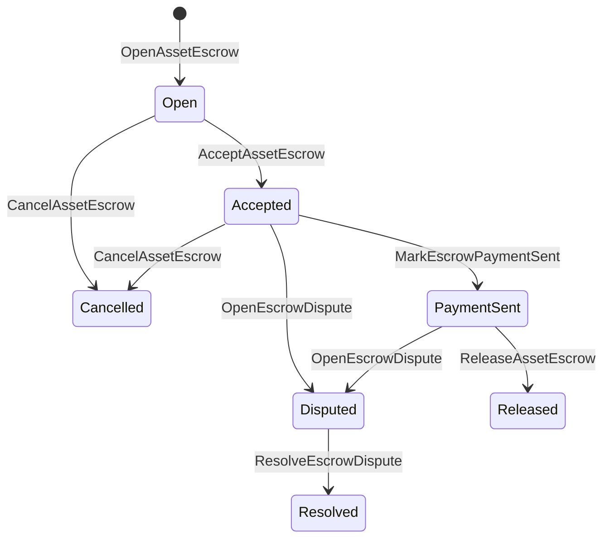

# الاحتفاظ بالأصول الأصلية {#native-asset-escrow}

الاحتفاظ بالأموال الأصلية هو آلية الحفظ التي يتم إدارتها في دفتر الأوراق المالية للأصول الرقمية.
بدلاً من إرسال الأصول إلى حساب مملوك للتطبيق والاعتماد على
رمز التطبيق لحماية تلك الحسابات، الاحتفاظ ISIs تحويل القيمة إلى
حساب الاحتفاظ بالبروتوكول المحدد وتسجيل دورة حياة الاحتفاض في
الدولة العالمية

استخدم الاحتفاظ الأصلي للتسوية في السوق، الدفع خارج سلسلة الطراز Aitai
التنسيق، قفلات الأساسية، وأجراء عمل الاحتفاظ بالحماية المحمية التي تحتاج
حالة دورة الحياة التي يمكن رؤيتها من خلال الكتب الرئيسية.

## المفاهيم {#concepts}

| المفهوم | وصف |
| --- | --- |
| `EscrowId` | المعرف الذي اختاره المتصل يلف في حشيش يجب أن يكون فريدًا عبر الاحتياطيات الشفافة والمجهولة. |
| `AssetEscrowRecord` | سجل الاحتفاظ بالأصول الرقمية الشفافة أو القفل. |
| `AnonymousAssetEscrowRecord` | سجل الودائع المحمية المدعومة من قبل الإبطال والالتزامات، والوثائق المرفقة. |
| حساب الاحتفاظ | حساب بروتوكول التحديد المستمد من سلسلة ID, الاحتفاظ ID, وتعريف الأصول |
| أشكال الأدلة | حشوف من الفواتير، والحكمات، والرسائل، وخطابات التخزين، أو غيرها من الأدلة خارج السلسلة. |

السجلات الشفافة تحمل البائع والمشتري الاختياري وصفة الأصول
المبلغ الإجمالي، حساب الوصاية، حالة دورة الحياة، نوع السلوك، الباقي
المبلغ، سلطة الإفراج الاختياري، طابع انتهاء صلاحية اختياري، دليل
الـ"هاشس" و "تايم ستيمبيلز" وتفاصيل القرارات الاختيارية.

يجب أن تكون مبالغ الاحتفاظ بها كميات رقمية إيجابية من الأصول ويجب أن تتطابق مع
المواصفات الرقمية لتعريف الأصول. بينما الاحتفاظ أو القفل نشط،
لا يمكن لنقل الأصول العامة استنزاف حساب الاحتفاظ. الخروج من الاحتفاض
الطرق هي الاحتفاظ ISIs الموصوفة أدناه.

## السوق الاحتفاظ {#marketplace-escrow}

ينسق الاحتفاظ بالسوق إطلاق أصول داخل السلسلة مع إطلاق خارج السلسلات
سير عمل الدفع أو التسليم.



| ISI | من يقدمها | التأثير |
| --- | --- | --- |
| `OpenAssetEscrow` | البائع | يقفل الأصول الرقمية للبائع في الاحتفاظ بالبروتوكول ويخلق `Open` سجل السوق. |
| `AcceptAssetEscrow` | المشتري | سجل المشتري والتحركات `Open` إلى `Accepted`. البائع لا يمكنه قبول الاحتفاظ بنفسه |
| `MarkEscrowPaymentSent` | المشتري المقبول | تحركات `Accepted` إلى `PaymentSent` بعد أن يرسل المشتري الدفع خارج السلسلة |
| `ReleaseAssetEscrow` | البائع | تحركات `PaymentSent` إلى `Released` وتحويل المبلغ الكامل المتعهد للمشتري. |
| `CancelAssetEscrow` | البائع | تحركات `Open` أو `Accepted` إلى `Cancelled` وتسترد البائع قبل وضع علامة على الدفع. |
| `OpenEscrowDispute` | البائع أو المشتري المقبول | تحركات `Accepted` أو `PaymentSent` إلى `Disputed` وأضاف "هاشي" للأدلة. |
| `ResolveEscrowDispute` | الحساب مع `CanResolveEscrowDispute` | تحركات `Disputed` إلى `Resolved` ويقسم المبلغ بين المشتري والبائع. |

يجب أن تكون مبالغ حل النزاعات غير سلبية، و
`buyer_amount + seller_amount` يجب أن تكون مساوية لمبلغ الاحتفاظ.
الساقين مسموحة، ولكن يجب أن يكون التقسيم بأكمله يمثل الموازنة المحجوزة.

### Rust مثال {#rust-example}

يفترض هذا المثال أن حسابات البائع والمشتري موجودة بالفعل،
يتم تسجيل التعريف بأنها رقمية، والبائع لديه ميزان كاف.

```rust
use iroha::{
    client::Client,
    data_model::{
        isi::escrow::{
            AcceptAssetEscrow, MarkEscrowPaymentSent, OpenAssetEscrow,
            ReleaseAssetEscrow,
        },
        prelude::*,
    },
};
use iroha_crypto::Hash;

fn release_marketplace_escrow(
    seller_client: &Client,
    buyer_client: &Client,
    asset_definition_id: AssetDefinitionId,
) -> eyre::Result<()> {
    let escrow_id = EscrowId::new(Hash::new("docs-marketplace-escrow-001"));

    seller_client.submit_blocking(OpenAssetEscrow::with_evidence_hashes(
        escrow_id,
        asset_definition_id,
        Numeric::from(40_u64),
        vec![Hash::new("invoice:2026-001")],
    ))?;

    buyer_client.submit_blocking(AcceptAssetEscrow::new(escrow_id))?;
    buyer_client.submit_blocking(MarkEscrowPaymentSent::new(escrow_id))?;
    seller_client.submit_blocking(ReleaseAssetEscrow::new(escrow_id))?;

    let record = seller_client.query_single(FindAssetEscrowById::new(escrow_id))?;
    assert_eq!(record.status, AssetEscrowStatus::Released);
    assert_eq!(record.remaining_amount, Numeric::zero());

    Ok(())
}
```

## قفلات الأصول العامة {#generic-asset-locks}

قفل الأصول يستخدم نفس نوع سجل الاحتفاظ، لكنها ليست المشتري-البائع
تقدم العروض. فإنها تقفل الأموال لحساب المقصود وتتطلب اختياريًا
سلطة منفصلة للإفراج عن الأموال.

| ISI | من يقدمها | التأثير |
| --- | --- | --- |
| `OpenAssetLock` | حساب المصدر | يقفل المبلغ الإيجابي، ويُسجل الوجهة كمشتري السجل، ويحدد الحالة إلى `Locked`. |
| `DrawdownAssetLock` | سلطة الإفراج، أو الوجهة عندما لا يتم تحديد سلطة إفراج | تحويل جزء من الاحتفاظ الباقي أو كاملة إلى الوجهة. |
| `CancelAssetLock` | مفتاح القفل | إلغاء قفل نشط وإرجاع المبلغ المتبقي إلى مفتاح. |
| `ExpireAssetLock` | أي سلطة المعاملات بعد الموعد النهائي | تنتهي صلاحية القفل مع `expires_at_ms` في الماضي ويرجع المبلغ المتبقي للمفتاح. |

`DrawdownAssetLock` يحافظ على السجل `Locked` بينما تبقى بعض المبلغ
عندما يصل المبلغ المتبقي إلى الصفر، يصبح الحالة `DrawnDown` و
السجل مغلق

```rust
use iroha::{
    client::Client,
    data_model::{
        isi::escrow::{CancelAssetLock, DrawdownAssetLock, ExpireAssetLock, OpenAssetLock},
        prelude::*,
    },
};
use iroha_crypto::Hash;

fn drawdown_and_close_asset_locks(
    opener_client: &Client,
    destination_client: &Client,
    release_authority_client: &Client,
    asset_definition_id: AssetDefinitionId,
    destination: AccountId,
    release_authority: AccountId,
) -> eyre::Result<()> {
    let trusted_lock_id = EscrowId::new(Hash::new("docs-asset-lock-trusted"));

    opener_client.submit_blocking(OpenAssetLock::with_options(
        trusted_lock_id,
        asset_definition_id.clone(),
        destination.clone(),
        Numeric::from(40_u64),
        Some(release_authority),
        None,
        vec![Hash::new("milestone-plan-v1")],
    ))?;

    release_authority_client.submit_blocking(DrawdownAssetLock::new(
        trusted_lock_id,
        Numeric::from(15_u64),
    ))?;

    let partially_drawn =
        opener_client.query_single(FindAssetEscrowById::new(trusted_lock_id))?;
    assert_eq!(partially_drawn.status, AssetEscrowStatus::Locked);
    assert_eq!(partially_drawn.remaining_amount, Numeric::from(25_u64));

    opener_client.submit_blocking(CancelAssetLock::new(trusted_lock_id))?;
    let cancelled = opener_client.query_single(FindAssetEscrowById::new(trusted_lock_id))?;
    assert_eq!(cancelled.status, AssetEscrowStatus::Cancelled);

    let expiring_lock_id = EscrowId::new(Hash::new("docs-asset-lock-expiring"));
    opener_client.submit_blocking(OpenAssetLock::with_options(
        expiring_lock_id,
        asset_definition_id,
        destination,
        Numeric::from(10_u64),
        None,
        Some(0),
        Vec::new(),
    ))?;

    destination_client.submit_blocking(ExpireAssetLock::new(expiring_lock_id))?;
    let expired = opener_client.query_single(FindAssetEscrowById::new(expiring_lock_id))?;
    assert_eq!(expired.status, AssetEscrowStatus::Expired);

    Ok(())
}
```

Python حاليًا تعرض مساعدي المستوى العالي للقفلات العامة:
`open_asset_lock`, `drawdown_asset_lock`, `cancel_asset_lock`, و
`expire_asset_lock`. للأسواق والكفالة المجهولة من Python, استخدام
الكنسي `InstructionBox` JSON من خلال SDK- نعم . JSON خلية الهروب أو تقديمها
من خلال SDK الذي يكشف بناء الاحتياطيات من الدرجة الأولى.

## النزاعات {#disputes}

يمكن أن يدخل الاحتفاظ السوق في نزاع من `Accepted` أو `PaymentSent`.
فقط البائع المسجل أو المشتري يمكنه فتح النزاع.
`CanResolveEscrowDispute`, إما تم توفيرها مباشرة لحساب المصدر
أو يتلقىها من خلال دور.

```rust
use iroha::{
    client::Client,
    data_model::{
        isi::escrow::{OpenEscrowDispute, ResolveEscrowDispute},
        prelude::*,
    },
};
use iroha_crypto::Hash;
use iroha_executor_data_model::permission::escrow::CanResolveEscrowDispute;

fn resolve_disputed_escrow(
    admin_client: &Client,
    buyer_client: &Client,
    court_client: &Client,
    court: AccountId,
    escrow_id: EscrowId,
) -> eyre::Result<()> {
    admin_client.submit_blocking(Grant::account_permission(
        Permission::from(CanResolveEscrowDispute),
        court,
    ))?;

    buyer_client.submit_blocking(OpenEscrowDispute::with_evidence_hashes(
        escrow_id,
        vec![Hash::new("buyer-payment-receipt")],
    ))?;

    court_client.submit_blocking(ResolveEscrowDispute::with_evidence_hashes(
        escrow_id,
        Numeric::from(30_u64),
        Numeric::from(10_u64),
        vec![Hash::new("court-judgement-001")],
    ))?;

    let record = admin_client.query_single(FindAssetEscrowById::new(escrow_id))?;
    assert_eq!(record.status, AssetEscrowStatus::Resolved);
    assert_eq!(
        record.resolution.as_ref().map(|resolution| resolution.buyer_amount.clone()),
        Some(Numeric::from(30_u64)),
    );

    Ok(())
}
```

## الاحتفاظ بالشخصية المجهولة {#anonymous-escrow}

الاحتفاظ المجهول يستخدم نفس دورة حياة السوق، ولكن التمويل وال
حركة الأصول المغلقة محمية السجلات العامة لا تزال تخزين البائع
المشتري، الحالة، أشكال الأدلة، وخطوط زمنية، والتحركات المرتبطة بالدليل
المبالغ والمستلمين داخل النقود المحمية تمثل
الالتزامات والإبطالات، والتحذيرات

| الشفافة ISI | مجهول ISI |
| --- | --- |
| `OpenAssetEscrow` | `OpenAnonymousAssetEscrow` |
| `AcceptAssetEscrow` | `AcceptAnonymousAssetEscrow` |
| `MarkEscrowPaymentSent` | `MarkAnonymousEscrowPaymentSent` |
| `ReleaseAssetEscrow` | `ReleaseAnonymousAssetEscrow` |
| `CancelAssetEscrow` | `CancelAnonymousAssetEscrow` |
| `OpenEscrowDispute` | `OpenAnonymousEscrowDispute` |
| `ResolveEscrowDispute` | `ResolveAnonymousEscrowDispute` |

يجب أن تقوم محفظة أو أدوات البيانات ببناء مرفق الأدلة والمدخلات العامة.
افتتاح يخلق الالتزام واحد الاحتفاظ الإفراج، إلغاء، والجهم
يجب أن ينفق حل النزاعات بالضبط واحد الالتزام الأمانة وخلق
التزامات المشتري أو البائع أو الناتج المنقسمة التي تتطلبها العمل.

```rust
use iroha::{
    client::Client,
    data_model::{
        isi::escrow::{
            AcceptAnonymousAssetEscrow, MarkAnonymousEscrowPaymentSent,
            OpenAnonymousAssetEscrow,
        },
        prelude::*,
        proof::ProofAttachment,
    },
};
use iroha_crypto::Hash;

fn open_anonymous_escrow(
    seller_client: &Client,
    buyer_client: &Client,
    escrow_id: EscrowId,
    asset_definition_id: AssetDefinitionId,
    funding_nullifiers: Vec<[u8; 32]>,
    escrow_commitment: [u8; 32],
    proof: ProofAttachment,
    root_hint: Option<[u8; 32]>,
) -> eyre::Result<()> {
    seller_client.submit_blocking(OpenAnonymousAssetEscrow::with_evidence_hashes(
        escrow_id,
        asset_definition_id,
        funding_nullifiers,
        escrow_commitment,
        proof,
        root_hint,
        vec![Hash::new("shielded-invoice")],
    ))?;

    buyer_client.submit_blocking(AcceptAnonymousAssetEscrow::new(escrow_id))?;
    buyer_client.submit_blocking(MarkAnonymousEscrowPaymentSent::new(escrow_id))?;

    Ok(())
}
```

بالنسبة لنموذج المعاملات المحمية الأساسي، انظر
[المعاملات المجهولة](/ar/blockchain/anonymous-transactions.md).

## SDK استخدام {#sdk-usage}

يتم عرض دعم الاحتفاظ بشكل مختلف في جميع SDKs. Rust لديه القوانين
نموذج البيانات المطبوع. Python حاليًا يُعرض المساعدين العامين في حجب الأصول.
JavaScript و TypeScript استخدام Kotodama مكالمات المضيف. Kotlin/JVM و Swift
توفير صانعي الحمولة المستخدمة للسوق والكتابة الاحتفالية المجهولة.

| SDK | استخدم هذه السطح | النطاق |
| --- | --- | --- |
| [Rust](#rust-sdk) | `iroha::data_model::isi::escrow` | الاحتفاظ بالسوق، القفلات العامة، الاحتفاض المجهول، الاستفسارات، والأحداث. |
| [Python](#python-asset-locks) | `Instruction.open_asset_lock`, `TransactionDraft.open_asset_lock`, والعميل `*_and_wait` المساعدين | قفل الأصول العامة. السوق ومساعدون الاحتفاظ المجهولين ليسوا من الدرجة الأولى Python الأساليب بعد. |
| [JavaScript / TypeScript](#javascript-and-typescript-kotodama) | `compileKotodamaProgram` من `@iroha/iroha-js/kotodama-compiler` | استدعاءات المضيف في الداخل Kotodama العقود |
| [Kotlin / JVM](#kotlin-and-jvm) | `InstructionTemplate` الفصول في `org.hyperledger.iroha.sdk.core.model.instructions` | سوق وملفات التعليمات المخصصة للاستئجار المجهول |
| [Swift / iOS](#swift-and-ios) | `NativeEscrowInstructionBuilders` و `IrohaSDK.build*Escrow*` المساعدين | السوق و الاحتفاظ بالشرف المجهول Norito JSON تحميلات تعليمية |

وتركز الأمثلة التالية على بناء التعليمات. تمويل الحسابات،
إدارة التوقيع، وتقديم المعاملات تتبع تدفق طبيعي ل
كل واحد SDK.

### Rust SDK {#rust-sdk}

استخدم Rust SDK عندما تحتاج إلى تغطية وطنية كاملة أو دعم استفسارات/حدث.
تظهر الأمثلة المذكورة أعلاه إطلاق السوق، وتحديد الحجز العام، والنزاع
التسوية، وبناء الاحتياطيات المجهولة مع
`iroha::data_model::isi::escrow`.

```rust
use iroha::{
    client::Client,
    data_model::{isi::escrow::OpenAssetEscrow, prelude::*},
};
use iroha_crypto::Hash;

fn open_and_read(
    client: &Client,
    asset_definition_id: AssetDefinitionId,
) -> eyre::Result<AssetEscrowRecord> {
    let escrow_id = EscrowId::new(Hash::new("docs-rust-sdk-escrow"));

    client.submit_blocking(OpenAssetEscrow::new(
        escrow_id,
        asset_definition_id,
        Numeric::from(10_u64),
    ))?;

    client.query_single(FindAssetEscrowById::new(escrow_id))
}
```

### Python قفل الأصول {#python-asset-locks}

(الـ) Python SDK تعرض المساعدين من الدرجة الأولى لقفل الأصول العامة.
مقابل المدفوعات المميزة، والسحب من قبل سلطة الإفراج، وإلغاء
المفتاح، وتسديدات الصلاحية.

```python
client.open_asset_lock_and_wait(
    chain_id="dev-chain",
    authority="<source-account-id>",
    private_key_hex="<source-private-key-hex>",
    escrow_id="merchant-lock-001",
    asset_definition_id="<asset-definition-base58>",
    destination="<destination-account-id>",
    amount="2500",
    release_authority="<trusted-release-account-id>",
    expires_at_ms=1_704_000_000_000,
)

client.drawdown_asset_lock_and_wait(
    chain_id="dev-chain",
    authority="<trusted-release-account-id>",
    private_key_hex="<trusted-release-private-key-hex>",
    escrow_id="merchant-lock-001",
    amount="1000",
)

client.expire_asset_lock_and_wait(
    chain_id="dev-chain",
    authority="<any-account-id>",
    private_key_hex="<any-private-key-hex>",
    escrow_id="merchant-lock-001",
)
```

بالنسبة لقفل ثنائي، إغفال `release_authority`; الحساب المقصود يمكن
ثم تقديم `drawdown_asset_lock`.

### JavaScript و TypeScript Kotodama {#javascript-and-typescript-kotodama}

(الـ) JavaScript SDK لا يعرض حاليا صفقات الاحتفاظ المباشر الأصلية
المباني JavaScript أو TypeScript التطبيقات التي تنشر Kotodama
العقود، وتجميع دعوات استضافة الاحتفاظ Kotodama محمول.

المكالمات المحلية للمضيف الاحتفظية تتطلب إشارات وصول صريحة لأن المؤلف
لا يمكن استنباط مجموعات الوصول الضيقة للضمان غير الشفاف ISIs. استخدم إشارات البطاقات المجنونة
نقاط الدخول المصدرة التي تدعو `escrow_*` البناء.

```js
import { compileKotodamaProgram } from "@iroha/iroha-js/kotodama-compiler";

const source = `
seiyaku MarketplaceEscrow {
  meta { abi_version: 1; }

  #[access(read="*", write="*")]
  kotoage fn run() permission(Admin) {
    let asset = asset_definition("62Fk4FPcMuLvW5QjDGNF2a4jAmjM");
    let offer = name("aitai_offer");
    let evidence = norito_bytes("00");

    call escrow_open_offer(offer, asset, 10, evidence);
    call escrow_accept(offer);
    call escrow_mark_payment_sent(offer);
    call escrow_release(offer);
  }
}
`;

const compiled = compileKotodamaProgram(source, {
  sourceName: "escrow.ko",
});

if (compiled.diagnostics.length > 0) {
  throw new Error(compiled.diagnostics.map((item) => item.message).join("\n"));
}
```

في حالة النزاعات، استخدام `escrow_open_dispute(offer, evidence)` و
`escrow_resolve_dispute(offer, buyer_amount, seller_amount, evidence)`.
استقبيل المكالمات المجهولة للمضيف Norito تطلب بايتات الحمولة المفيدة، على سبيل المثال
`anonymous_escrow_open_offer(request)`.

### Kotlin و JVM {#kotlin-and-jvm}

(الـ) Kotlin/JVM SDK النماذج الاحتفاظ الأصلية كملفات تعليمات مخصصة.
الصيغة تعتمد الحقول المطلوبة وتعرض خريطة الحجج القانونية المستخدمة
من قبل صانع المعاملات.

```kotlin
import org.hyperledger.iroha.sdk.core.model.escrow.NativeEscrowPermissions
import org.hyperledger.iroha.sdk.core.model.instructions.AcceptAssetEscrowInstruction
import org.hyperledger.iroha.sdk.core.model.instructions.MarkEscrowPaymentSentInstruction
import org.hyperledger.iroha.sdk.core.model.instructions.OpenAssetEscrowInstruction
import org.hyperledger.iroha.sdk.core.model.instructions.ReleaseAssetEscrowInstruction
import org.hyperledger.iroha.sdk.core.model.instructions.ResolveEscrowDisputeInstruction

val open = OpenAssetEscrowInstruction(
    escrowId = "escrow-hash",
    assetDefinition = "xor#wonderland",
    amount = "42.5",
    evidenceHashes = listOf("invoice-hash"),
)
val accept = AcceptAssetEscrowInstruction("escrow-hash")
val paid = MarkEscrowPaymentSentInstruction("escrow-hash")
val release = ReleaseAssetEscrowInstruction("escrow-hash")
val resolve = ResolveEscrowDisputeInstruction(
    escrowId = "escrow-hash",
    buyerAmount = "30",
    sellerAmount = "12.5",
    evidenceHashes = listOf("judgement-hash"),
)

println(open.arguments)
println(NativeEscrowPermissions.CAN_RESOLVE_ESCROW_DISPUTE)
```

النماذج المجهولة متاحة
`OpenAnonymousAssetEscrowInstruction`, `AcceptAnonymousAssetEscrowInstruction`,
`MarkAnonymousEscrowPaymentSentInstruction`,
`ReleaseAnonymousAssetEscrowInstruction`,
`CancelAnonymousAssetEscrowInstruction`,
`OpenAnonymousEscrowDisputeInstruction`, و
`ResolveAnonymousEscrowDisputeInstruction`. Android يمكن للمتصلين في جاوا استخدام
التطابق `NativeEscrowInstructions.*` البناء من Android أثرية.

### Swift و (iOS) {#swift-and-ios}

(الـ) Swift SDK يقوم بناء تعليمات الاحتفاظ بأمانة Norito JSON الحمولات المفيدة
`NativeEscrowInstructionBuilders` مباشرة، أو استدعاء ما يعادله
`IrohaSDK.build*Escrow*` المساعد عندما يكون التطبيق الخاص بك بالفعل يحمل `IrohaSDK`
في حالة.

```swift
import IrohaSwift

let open = try NativeEscrowInstructionBuilders.openAssetEscrow(
    escrowId: "escrow-hash",
    assetDefinition: "xor#wonderland",
    amount: "42.5",
    evidenceHashes: ["invoice-hash"]
)
let accept = try NativeEscrowInstructionBuilders.acceptAssetEscrow(
    escrowId: "escrow-hash"
)
let paid = try NativeEscrowInstructionBuilders.markEscrowPaymentSent(
    escrowId: "escrow-hash"
)
let release = try NativeEscrowInstructionBuilders.releaseAssetEscrow(
    escrowId: "escrow-hash"
)
let resolve = try NativeEscrowInstructionBuilders.resolveEscrowDispute(
    escrowId: "escrow-hash",
    buyerAmount: "30",
    sellerAmount: "12.5",
    evidenceHashes: ["judgement-hash"]
)
```

مجهول Swift المُبنيون يأخذون قوائم الإبطال، وقوائم التزام الخروج، دليل
القاموس، والخيارية `rootHint` القيم. إذن حل النزاع
الوسائل المتاحة `NativeEscrowPermissions.canResolveEscrowDispute`.

## الأسئلة والأحداث {#queries-and-events}

استخدم استفسارات الاحتفاظ بالأمانات لصفحات الحالة، وظائف المصالحة، وأدوات الدعم:

| السؤال | الغرض |
| --- | --- |
| `FindAssetEscrowById` | اقرأ الاحتفاظ الواضح أو قفل `EscrowId`. |
| `FindAssetEscrows` | إدراج سجلات الاحتفاظ الشفافية والقفل. |
| `FindAssetEscrowsBySeller` | إدراج سجلات فتحها البائع أو مفتاح القفل. |
| `FindAssetEscrowsByBuyer` | إدراج الاحتفاظ بالسوق المقبول من قبل المشتري أو القفلات التي تستهدف وجهة. |
| `FindAssetEscrowsByStatus` | قائمة السجلات `AssetEscrowStatus`. |
| `FindAnonymousAssetEscrowById` | قراءة واحد الاحتفاظ مجهول من `EscrowId`. |
| `FindAnonymousAssetEscrows*` | قم بإدراج الاحتفاظات المجهولة حسب جميع السجلات، البائع، المشتري، أو الحالة. |

`EscrowEventFilter` يمكن الاشتراك في الاحتفاظ والقفل المحلي الشفاف
الأحداث بواسطة الاحتفاظ ID, البائع، المشتري، الحالة، و القناع
الأسرة تشمل `Opened`, `Accepted`, `PaymentSent`, `Released`,
`Cancelled`, `Expired`, `Disputed`, و `Resolved`. الاحتفاظ بالشرف المجهول
يتم تفتيش السجلات من خلال استفسارات الأمانة المجهولة.

## الملاحظات التشغيلية {#operational-notes}

- تخزين الفواتير الكبيرة، سجلات الدردشة، الأحكام، أو حزم المراجعة خارج
  سجل الاحتفاظ ورفقها كدليل
- استخدام مستقر `EscrowId` الإستحداث في التطبيقات بحيث لا يمكن إعادة المحاولات خلق
  اثنين من الاحتياطيات لنفس العرض.
- غرانت `CanResolveEscrowDispute` فقط للحسابات أو الأدوار التي تدير
  عملية النزاع.
- تعامل التحقق من الدفع خارج السلسلة كسياسة التطبيق. Iroha السجلات
  الوصاية والانتقالات في دورة الحياة؛ لا تحقق من القانون أو خارجية
  خطوط الدفع بذاتها.
