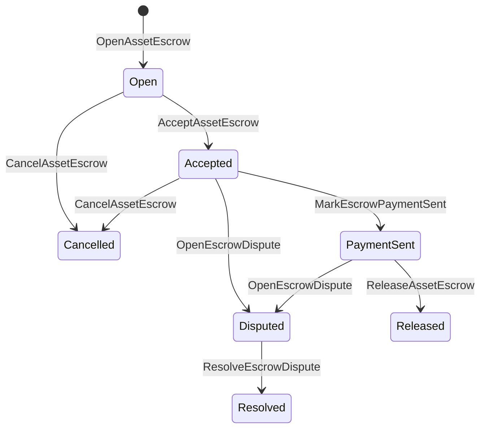

# ضمان الأصل الأصلي {#native-asset-escrow}

الضمان الأصلي هو آلية حفظ تدار بواسطة دفتر حسابات البلوك تشين للأصول الرقمية. بدلاً من إرسال الأصول إلى حساب مملوك للتطبيق والاعتماد على كود التطبيق لحماية ذلك الحساب، حساب الضمان ISIs لنقل القيمة إلى حساب وصاية بروتوكول حتمي وتسجيل دورة حياة الضمان في الحالة العالمية.

استخدم الضمانة المحلية لتسوية المعاملات المالية في السوق، وتنسيق الدفع خارج السلسلة على طريقة Aitai، وأقفال المراحل، وسير عمل الضمانة المحمية التي تحتاج إلى أن تكون مرئية في حالة دورة حياة دفتر السجلات على البلوكشين.

## مفاهيم {#concepts}

|مفهوم|الوصف|
| --- | --- |
| `EscrowId` |طلب معرف يحدده العميل ويحتوي على تجزئة تشفيرية. يجب أن يكون فريدًا بين الأمانات الشفافة والمجهولة.|
| `AssetEscrowRecord` |سجل إيداع أو قفل للأصول الرقمية شفاف|
| `AnonymousAssetEscrowRecord` |سجل الضمان المحمي مدعوم بالمُلغيّات، وقيم الالتزام التشفيري، ومرفقات الإثبات.|
|حساب الحفظ|حساب البروتوكول الحتمي مشتق من معرف السلسلة، ومعرف الضمان، وتعريف الأصل.|
|أدلة التجزئة التشفيرية|يمكن لتجزئات التشفير للأدلة تحديد الفواتير والأحكام والرسائل والمخطوطات التقنية للتخزين أو أي أدلة خارج السلسلة أخرى. لم يتم تخزين محتوى الأدلة نفسه في سجل الضمان.|

تحمل السجلات الشفافة البائع، المشتري الاختياري، تعريف الأصل، المبلغ الإجمالي، حساب الحفظ، حالة دورة الحياة، نوع السلوك، المبلغ المتبقي، الموكل الاختياري لتفويض الإفراج، الطابع الزمني الاختياري لانتهاء الصلاحية، تجزئات التشفير للأدلة، الطوابع الزمنية، وتفاصيل الحل الاختيارية.

يجب أن تكون مبالغ الضمان كميات أصول رقمية موجبة ويجب أن تتطابق مع المواصفة الرقمية لتعريف الأصل. بينما يكون الضمان أو القفل نشطًا، لا يمكن لتحويلات الأصول العامة استنزاف حساب الحراسة؛ مسارات الخروج من الحراسة هي الضمان ISIs الموضح أدناه.

## حساب الضمان في السوق {#marketplace-escrow}

تقوم خدمة الضمان في السوق بتنسيق إصدار الأصول على السلسلة مع سير عمل الدفع أو التسليم خارج السلسلة.



| ISI |من يقدمها|تأثير|
| --- | --- | --- |
| `OpenAssetEscrow` |بائع|يقوم بقفل الأصل الرقمي للبائع في وصاية البروتوكول وينشئ سجل سوقي `Open`.|
| `AcceptAssetEscrow` |المشتري|يسجل المشتري وينقل `Open` إلى `Accepted`. لا يمكن للبائع قبول الضمان الخاص به.|
| `MarkEscrowPaymentSent` |المشتري المقبول|ينقل `Accepted` إلى `PaymentSent` بعد أن يرسل المشتري الدفع خارج السلسلة.|
| `ReleaseAssetEscrow` |بائع|ينقل `PaymentSent` إلى `Released` وينقل المبلغ المودَع بالكامل إلى المشتري.|
| `CancelAssetEscrow` |بائع|ينقل `Open` أو `Accepted` إلى `Cancelled` ويعيد للبائع المبلغ قبل أن يتم تحديد الدفع.|
| `OpenEscrowDispute` |البائع أو المشتري المقبول|ينقل `Accepted` أو `PaymentSent` إلى `Disputed` ويُلحق به هاشات التشفير للأدلة.|
| `ResolveEscrowDispute` |حساب برقم `CanResolveEscrowDispute`|ينقل `Disputed` إلى `Resolved` ويقسم المبلغ بين المشتري والبائع.|

يجب أن تكون مبالغ تسوية النزاعات غير سالبة، ويجب أن يساوي `buyer_amount + seller_amount` مبلغ الضمان. يُسمح بأجزاء التحويل المالي بقيمة صفر، ولكن يجب أن يشمل التقسيم كله الرصيد المقفل.

### Rust مثال {#rust-example}

يفترض هذا المثال أن حسابات البائع والمشتري موجودة بالفعل، وأن تعريف الأصل مسجل كرقمي، وأن لدى البائع رصيد كافٍ.

```rust
use iroha::{
    client::Client,
    data_model::{
        isi::escrow::{
            AcceptAssetEscrow, MarkEscrowPaymentSent, OpenAssetEscrow,
            ReleaseAssetEscrow,
        },
        prelude::*,
    },
};
use iroha_crypto::Hash;

fn release_marketplace_escrow(
    seller_client: &Client,
    buyer_client: &Client,
    asset_definition_id: AssetDefinitionId,
) -> eyre::Result<()> {
    let escrow_id = EscrowId::new(Hash::new("docs-marketplace-escrow-001"));

    seller_client.submit_blocking(OpenAssetEscrow::with_evidence_hashes(
        escrow_id,
        asset_definition_id,
        Numeric::from(40_u64),
        vec![Hash::new("invoice:2026-001")],
    ))?;

    buyer_client.submit_blocking(AcceptAssetEscrow::new(escrow_id))?;
    buyer_client.submit_blocking(MarkEscrowPaymentSent::new(escrow_id))?;
    seller_client.submit_blocking(ReleaseAssetEscrow::new(escrow_id))?;

    let record = seller_client.query_single(FindAssetEscrowById::new(escrow_id))?;
    assert_eq!(record.status, AssetEscrowStatus::Released);
    assert_eq!(record.remaining_amount, Numeric::zero());

    Ok(())
}
```

## أقفال الأصول العامة {#generic-asset-locks}

تستخدم قفلات الأصول نفس نوع سجل الحفظ، لكنها ليست عروضًا بين المشتري والبائع. فهي تقفل الأموال لحساب الوجهة وقد تتطلب اختياريًا تفويضًا منفصلًا لرفع الأموال.

| ISI |من يقدمها|تأثير|
| --- | --- | --- |
| `OpenAssetLock` |الحساب المصدر|يقفل مبلغًا إيجابيًا، ويسجل الوجهة كمشتري السجل، ويضبط الحالة على `Locked`.|
| `DrawdownAssetLock` |المخول بالإفراج، أو الوجهة عند عدم تعيين مخول بالإفراج|ينقل جزءًا أو كل ما تبقى من الوصاية إلى الوجهة.|
| `CancelAssetLock` |مفتاح القفل|يلغي القفل النشط ويعيد المبلغ المتبقي إلى الشخص الذي قام بفتحه.|
| `ExpireAssetLock` |أي تفويض لمعاملة بعد انتهاء الموعد النهائي|تنتهي صلاحية قفل بـ `expires_at_ms` في الماضي وتُعيد المبلغ المتبقي إلى الفاتح.|

`DrawdownAssetLock` يحتفظ بالسجل في `Locked` بينما يبقى بعض المبلغ. عندما يصل المبلغ المتبقي إلى الصفر، يصبح الوضع `DrawnDown` ويتم إغلاق السجل.

```rust
use iroha::{
    client::Client,
    data_model::{
        isi::escrow::{CancelAssetLock, DrawdownAssetLock, ExpireAssetLock, OpenAssetLock},
        prelude::*,
    },
};
use iroha_crypto::Hash;

fn drawdown_and_close_asset_locks(
    opener_client: &Client,
    destination_client: &Client,
    release_authority_client: &Client,
    asset_definition_id: AssetDefinitionId,
    destination: AccountId,
    release_authority: AccountId,
) -> eyre::Result<()> {
    let trusted_lock_id = EscrowId::new(Hash::new("docs-asset-lock-trusted"));

    opener_client.submit_blocking(OpenAssetLock::with_options(
        trusted_lock_id,
        asset_definition_id.clone(),
        destination.clone(),
        Numeric::from(40_u64),
        Some(release_authority),
        None,
        vec![Hash::new("milestone-plan-v1")],
    ))?;

    release_authority_client.submit_blocking(DrawdownAssetLock::new(
        trusted_lock_id,
        Numeric::from(15_u64),
    ))?;

    let partially_drawn =
        opener_client.query_single(FindAssetEscrowById::new(trusted_lock_id))?;
    assert_eq!(partially_drawn.status, AssetEscrowStatus::Locked);
    assert_eq!(partially_drawn.remaining_amount, Numeric::from(25_u64));

    opener_client.submit_blocking(CancelAssetLock::new(trusted_lock_id))?;
    let cancelled = opener_client.query_single(FindAssetEscrowById::new(trusted_lock_id))?;
    assert_eq!(cancelled.status, AssetEscrowStatus::Cancelled);

    let expiring_lock_id = EscrowId::new(Hash::new("docs-asset-lock-expiring"));
    opener_client.submit_blocking(OpenAssetLock::with_options(
        expiring_lock_id,
        asset_definition_id,
        destination,
        Numeric::from(10_u64),
        None,
        Some(0),
        Vec::new(),
    ))?;

    destination_client.submit_blocking(ExpireAssetLock::new(expiring_lock_id))?;
    let expired = opener_client.query_single(FindAssetEscrowById::new(expiring_lock_id))?;
    assert_eq!(expired.status, AssetEscrowStatus::Expired);

    Ok(())
}
```

Python يوفّر حالياً مساعدين على مستوى عالٍ للأقفال العامة: `open_asset_lock`، `drawdown_asset_lock`، `cancel_asset_lock`، و`expire_asset_lock`. للسوق والضمان المجهول من Python، استخدم بروتوكولًا قياسيًا واحدًا `InstructionBox` JSON من خلال فتحة الهروب الخاصة بـ SDK JSON، أو قدّم من خلال SDK الذي يكشف عن منشئي الضمان من الدرجة الأولى.

## النزاعات {#disputes}

يمكن لخدمة الضمان في السوق الدخول في نزاع من `Accepted` أو `PaymentSent`. يمكن فقط للبائع أو المشتري المسجل فتح النزاع. يتطلب الحل `CanResolveEscrowDispute`، سواء تم منحه مباشرة لحساب المحلّل أو تم توريثه من خلال دور.

```rust
use iroha::{
    client::Client,
    data_model::{
        isi::escrow::{OpenEscrowDispute, ResolveEscrowDispute},
        prelude::*,
    },
};
use iroha_crypto::Hash;
use iroha_executor_data_model::permission::escrow::CanResolveEscrowDispute;

fn resolve_disputed_escrow(
    admin_client: &Client,
    buyer_client: &Client,
    court_client: &Client,
    court: AccountId,
    escrow_id: EscrowId,
) -> eyre::Result<()> {
    admin_client.submit_blocking(Grant::account_permission(
        Permission::from(CanResolveEscrowDispute),
        court,
    ))?;

    buyer_client.submit_blocking(OpenEscrowDispute::with_evidence_hashes(
        escrow_id,
        vec![Hash::new("buyer-payment-receipt")],
    ))?;

    court_client.submit_blocking(ResolveEscrowDispute::with_evidence_hashes(
        escrow_id,
        Numeric::from(30_u64),
        Numeric::from(10_u64),
        vec![Hash::new("court-judgement-001")],
    ))?;

    let record = admin_client.query_single(FindAssetEscrowById::new(escrow_id))?;
    assert_eq!(record.status, AssetEscrowStatus::Resolved);
    assert_eq!(
        record.resolution.as_ref().map(|resolution| resolution.buyer_amount.clone()),
        Some(Numeric::from(30_u64)),
    );

    Ok(())
}
```

## حساب ضمان مجهول {#anonymous-escrow}

الضمان المجهول يستخدم نفس دورة حياة السوق، لكن تمويل وتحويل الأصول عند الإغلاق تكون محمية. لا يزال السجل العام يخزن البائع، والمشتري، والحالة, الأدلة تشمل التجزئات التشفيرية، الطوابع الزمنية، وسجلات الحركة المرتبطة بالإثبات. يتم تمثيل المبالغ والمستلمين داخل الملاحظات المحمية من خلال قيم الالتزام التشفيرية، والمُبَطلات، وملحقات الإثبات.

|شفاف ISI|مجهول ISI|
| --- | --- |
| `OpenAssetEscrow` | `OpenAnonymousAssetEscrow` |
| `AcceptAssetEscrow` | `AcceptAnonymousAssetEscrow` |
| `MarkEscrowPaymentSent` | `MarkAnonymousEscrowPaymentSent` |
| `ReleaseAssetEscrow` | `ReleaseAnonymousAssetEscrow` |
| `CancelAssetEscrow` | `CancelAnonymousAssetEscrow` |
| `OpenEscrowDispute` | `OpenAnonymousEscrowDispute` |
| `ResolveEscrowDispute` | `ResolveAnonymousEscrowDispute` |

يجب على محفظة الأدوات أو أدوات المُثبِت بناء مرفق الإثبات والمدخلات العامة. الفتح ينشئ قيمة التزام تشفيرية واحدة لحساب الضمان. الإفراج، الإلغاء، ويجب أن تنفق آلية حل النزاعات المجهولة الهوية بالضبط قيمة واحدة من الالتزام التشفيري في الضمان وتُنشئ قيم الالتزام التشفيري المطلوبة للعملية للبائع، أو المشتري، أو لنتيجة التقسيم.

```rust
use iroha::{
    client::Client,
    data_model::{
        isi::escrow::{
            AcceptAnonymousAssetEscrow, MarkAnonymousEscrowPaymentSent,
            OpenAnonymousAssetEscrow,
        },
        prelude::*,
        proof::ProofAttachment,
    },
};
use iroha_crypto::Hash;

fn open_anonymous_escrow(
    seller_client: &Client,
    buyer_client: &Client,
    escrow_id: EscrowId,
    asset_definition_id: AssetDefinitionId,
    funding_nullifiers: Vec<[u8; 32]>,
    escrow_commitment: [u8; 32],
    proof: ProofAttachment,
    root_hint: Option<[u8; 32]>,
) -> eyre::Result<()> {
    seller_client.submit_blocking(OpenAnonymousAssetEscrow::with_evidence_hashes(
        escrow_id,
        asset_definition_id,
        funding_nullifiers,
        escrow_commitment,
        proof,
        root_hint,
        vec![Hash::new("shielded-invoice")],
    ))?;

    buyer_client.submit_blocking(AcceptAnonymousAssetEscrow::new(escrow_id))?;
    buyer_client.submit_blocking(MarkAnonymousEscrowPaymentSent::new(escrow_id))?;

    Ok(())
}
```

للنموذج الأساسي للمعاملة المحمية، انظر [المعاملات المجهولة](/ar/blockchain/anonymous-transactions.md).

## SDK الاستخدام {#sdk-usage}

يتم عرض دعم الحساب الضماني بشكل مختلف عبر SDKs. يحتوي Rust على نموذج بيانات من النوع الموحد للبروتوكول. يعرض Python حاليًا مساعدين لقفل الأصول العامة. JavaScript و TypeScript يستخدمان استدعاءات دالة المضيف الخاصة بالضمان Kotodama. Kotlin/JVM و Swift يوفرون منشئي بيانات محددة النوع للسوق والضمان المجهول.

| SDK |استخدم هذه السطح|نطاق|
| --- | --- | --- |
| [Rust](#rust-sdk) | `iroha::data_model::isi::escrow` |ضمان السوق، الأقفال العامة، الضمان المجهول، الاستفسارات، والأحداث.|
| [Python](#python-asset-locks) |مساعدو `Instruction.open_asset_lock`، `TransactionDraft.open_asset_lock`، والعميل `*_and_wait`|قفل الأصول العامة. المساعدون في السوق والضمان المجهول ليسوا بعد طرقًا من الدرجة الأولى Python.|
| [JavaScript / TypeScript](#javascript-and-typescript-kotodama) | `compileKotodamaProgram` من `@iroha/iroha-js/kotodama-compiler` |استدعاءات وظائف المضيف الضمانية داخل عقود Kotodama.|
| [Kotlin / JVM](#kotlin-and-jvm) | `InstructionTemplate` الفصول في `org.hyperledger.iroha.sdk.core.model.instructions` |نماذج تعليمات مخصصة للسوق والضمان المجهول.|
| [Swift / iOS](#swift-and-ios) |`NativeEscrowInstructionBuilders` و `IrohaSDK.build*Escrow*` المساعدون|بيانات تعليمات السوق ووكيل الضمان المجهول Norito JSON.|

تركز الأمثلة أدناه على بناء التعليمات. تمويل الحساب، إدارة التوقيع، وإرسال المعاملات تتبع التدفق الطبيعي لكل SDK.

### Rust SDK {#rust-sdk}

استخدم Rust SDK عندما تحتاج إلى تغطية أصلية كاملة أو دعم الاستعلام/الحدث. توضح الأمثلة أعلاه إصدار السوق، سحب القفل العام، حل النزاعات، وبناء الوساطة المجهولة مع `iroha::data_model::isi::escrow`.

```rust
use iroha::{
    client::Client,
    data_model::{isi::escrow::OpenAssetEscrow, prelude::*},
};
use iroha_crypto::Hash;

fn open_and_read(
    client: &Client,
    asset_definition_id: AssetDefinitionId,
) -> eyre::Result<AssetEscrowRecord> {
    let escrow_id = EscrowId::new(Hash::new("docs-rust-sdk-escrow"));

    client.submit_blocking(OpenAssetEscrow::new(
        escrow_id,
        asset_definition_id,
        Numeric::from(10_u64),
    ))?;

    client.query_single(FindAssetEscrowById::new(escrow_id))
}
```

### Python أقفال الأصول {#python-asset-locks}

Python SDK يوفر أدوات مساعدة من الدرجة الأولى لأقفال الأصول العامة. استخدمها لمدفوعات المعالم، والسحب من قبل صاحب تفويض الإصدار، والإلغاء من قبل الفاتح، واسترداد الأموال عند انتهاء الصلاحية.

```python
client.open_asset_lock_and_wait(
    chain_id="dev-chain",
    authority="<source-account-id>",
    private_key_hex="<source-private-key-hex>",
    escrow_id="merchant-lock-001",
    asset_definition_id="<asset-definition-base58>",
    destination="<destination-account-id>",
    amount="2500",
    release_authority="<trusted-release-account-id>",
    expires_at_ms=1_704_000_000_000,
)

client.drawdown_asset_lock_and_wait(
    chain_id="dev-chain",
    authority="<trusted-release-account-id>",
    private_key_hex="<trusted-release-private-key-hex>",
    escrow_id="merchant-lock-001",
    amount="1000",
)

client.expire_asset_lock_and_wait(
    chain_id="dev-chain",
    authority="<any-account-id>",
    private_key_hex="<any-private-key-hex>",
    escrow_id="merchant-lock-001",
)
```

بالنسبة للقفل ذو الطرفين، احذف `release_authority`؛ يمكن للحساب المستلم بعد ذلك تقديم `drawdown_asset_lock`.

### JavaScript و TypeScript Kotodama {#javascript-and-typescript-kotodama}

لا يكشف JavaScript SDK حاليًا عن منشئي معاملات الضمان الأصليين المباشرة. بالنسبة لتطبيقات JavaScript أو TypeScript التي تقوم بنشر عقود Kotodama، قم بترجمة استدعاءات وظائف الاستضافة للضمان باستخدام مترجم Kotodama.

تتطلب استدعاءات دالة الاستضافة الأصلية للضمانات وصولاً صريحًا للإيحاءات لأن المترجم لا يمكنه اشتقاق مجموعات وصول أضيق للضمانات غير الشفافة ISIs. استخدم إيحاءات البدل على نقاط الدخول المصدرة التي قام الاستدعاء الفني `escrow_*` ببنائها.

```js
import { compileKotodamaProgram } from "@iroha/iroha-js/kotodama-compiler";

const source = `
seiyaku MarketplaceEscrow {
  meta { abi_version: 1; }

  #[access(read="*", write="*")]
  kotoage fn run() permission(Admin) {
    let asset = asset_definition("62Fk4FPcMuLvW5QjDGNF2a4jAmjM");
    let offer = name("aitai_offer");
    let evidence = norito_bytes("00");

    call escrow_open_offer(offer, asset, 10, evidence);
    call escrow_accept(offer);
    call escrow_mark_payment_sent(offer);
    call escrow_release(offer);
  }
}
`;

const compiled = compileKotodamaProgram(source, {
  sourceName: "escrow.ko",
});

if (compiled.diagnostics.length > 0) {
  throw new Error(compiled.diagnostics.map((item) => item.message).join("\n"));
}
```

للنزاعات، استخدم `escrow_open_dispute(offer, evidence)` و `escrow_resolve_dispute(offer, buyer_amount, seller_amount, evidence)`. تقبل استدعاءات وظيفة المضيف الأمانة المجهولة هوية بيانات حمولة الطلب Norito، على سبيل المثال `anonymous_escrow_open_offer(request)`.

### Kotlin و JVM {#kotlin-and-jvm}

نماذج Kotlin/JVM SDK تدعم الضمان الأصلي كنماذج تعليمات مخصصة. كل نموذج يتحقق من الحقول المطلوبة ويعرض خريطة الحجج القياسية للبروتوكول الوحيدة التي يستخدمها منشئ المعاملات.

```kotlin
import org.hyperledger.iroha.sdk.core.model.escrow.NativeEscrowPermissions
import org.hyperledger.iroha.sdk.core.model.instructions.AcceptAssetEscrowInstruction
import org.hyperledger.iroha.sdk.core.model.instructions.MarkEscrowPaymentSentInstruction
import org.hyperledger.iroha.sdk.core.model.instructions.OpenAssetEscrowInstruction
import org.hyperledger.iroha.sdk.core.model.instructions.ReleaseAssetEscrowInstruction
import org.hyperledger.iroha.sdk.core.model.instructions.ResolveEscrowDisputeInstruction

val open = OpenAssetEscrowInstruction(
    escrowId = "escrow-hash",
    assetDefinition = "xor#wonderland",
    amount = "42.5",
    evidenceHashes = listOf("invoice-hash"),
)
val accept = AcceptAssetEscrowInstruction("escrow-hash")
val paid = MarkEscrowPaymentSentInstruction("escrow-hash")
val release = ReleaseAssetEscrowInstruction("escrow-hash")
val resolve = ResolveEscrowDisputeInstruction(
    escrowId = "escrow-hash",
    buyerAmount = "30",
    sellerAmount = "12.5",
    evidenceHashes = listOf("judgement-hash"),
)

println(open.arguments)
println(NativeEscrowPermissions.CAN_RESOLVE_ESCROW_DISPUTE)
```

القوالب المجهولة متاحة كـ `OpenAnonymousAssetEscrowInstruction`، `AcceptAnonymousAssetEscrowInstruction`، `MarkAnonymousEscrowPaymentSentInstruction`، `ReleaseAnonymousAssetEscrowInstruction`، `CancelAnonymousAssetEscrowInstruction`، `OpenAnonymousEscrowDisputeInstruction`، و`ResolveAnonymousEscrowDisputeInstruction`. يمكن لعملاء جافا الذين يطلبون Android استخدام البناة المطابقين `NativeEscrowInstructions.*` من القطعة Android.

### Swift ونظام iOS {#swift-and-ios}

يقوم Swift SDK بإنشاء تعليمات الضمان كحمولات Norito JSON. استخدم `NativeEscrowInstructionBuilders` مباشرة، أو استدعِ مساعد `IrohaSDK.build*Escrow*` المكافئ عندما يكون تطبيقك يمتلك بالفعل نسخة من `IrohaSDK`.

```swift
import IrohaSwift

let open = try NativeEscrowInstructionBuilders.openAssetEscrow(
    escrowId: "escrow-hash",
    assetDefinition: "xor#wonderland",
    amount: "42.5",
    evidenceHashes: ["invoice-hash"]
)
let accept = try NativeEscrowInstructionBuilders.acceptAssetEscrow(
    escrowId: "escrow-hash"
)
let paid = try NativeEscrowInstructionBuilders.markEscrowPaymentSent(
    escrowId: "escrow-hash"
)
let release = try NativeEscrowInstructionBuilders.releaseAssetEscrow(
    escrowId: "escrow-hash"
)
let resolve = try NativeEscrowInstructionBuilders.resolveEscrowDispute(
    escrowId: "escrow-hash",
    buyerAmount: "30",
    sellerAmount: "12.5",
    evidenceHashes: ["judgement-hash"]
)
```

البناؤون المجهولون Swift يأخذون قوائم الملغيات، ويخرجون قوائم قيم الالتزام التشفيري، وقاموس الإثبات، وقيم `rootHint` الاختيارية. رمز إذن محكم النزاع متاح كـ `NativeEscrowPermissions.canResolveEscrowDispute`.

## الاستفسارات والأحداث {#queries-and-events}

استخدم استفسارات الضمان لصفحات الحالة، ووظائف التسوية، وأدوات الدعم:

|استعلام|الغرض|
| --- | --- |
| `FindAssetEscrowById` |اقرأ ضمان شفاف واحد أو قفل بواسطة `EscrowId`.|
| `FindAssetEscrows` |قائمة بسجلات الضمان الشفافة والمقفلة.|
| `FindAssetEscrowsBySeller` |قائمة السجلات المفتوحة بواسطة بائع أو فتَّاح الأقفال.|
| `FindAssetEscrowsByBuyer` |قائمة الاحتجازات في السوق التي يقبلها المشتري أو الأقفال التي تستهدف وجهة معينة.|
| `FindAssetEscrowsByStatus` |عرض السجلات حسب `AssetEscrowStatus`.|
| `FindAnonymousAssetEscrowById` |اقرأ ضامنًا مجهول الهوية بواسطة `EscrowId`.|
| `FindAnonymousAssetEscrows*` |قائمة الضمانات المجهولة حسب جميع السجلات، البائع، المشتري، أو الحالة.|

`EscrowEventFilter` يمكنه الاشتراك في الحراسة الأصلية الشفافة وأحداث القفل حسب معرف الحراسة، البائع، المشتري، الحالة، وقناع مجموعة الأحداث. تشمل عائلة الأحداث `Opened`، `Accepted`، `PaymentSent`، `Released`، `Cancelled`، `Expired`، `Disputed`، و `Resolved`. يتم فحص سجلات الضمان المجهولة من خلال استفسارات الضمان المجهولة.

## ملاحظات تشغيلية {#operational-notes}

- قم بتخزين الفواتير الكبيرة، وسجلات الدردشة، والأحكام، أو حزم التدقيق خارج سجل الضمان وأرفق تجزئاتها التشفيرية كدليل.
- استخدم اشتقاق `EscrowId` المستقر في التطبيقات بحيث لا يمكن لإعادة المحاولة إنشاء حسابات ضمان مكررة لنفس العرض.
- امنح `CanResolveEscrowDispute` فقط للحسابات أو الأدوار التي تدير عملية النزاع.
- عامل التحقق من المدفوعات خارج السلسلة كسياسة تطبيق. تسجل Iroha الانتقالات المتعلقة بالاحتجاز ودورة الحياة؛ فهي لا تتحقق من العملات الورقية أو قنوات الدفع الخارجية بنفسها.
