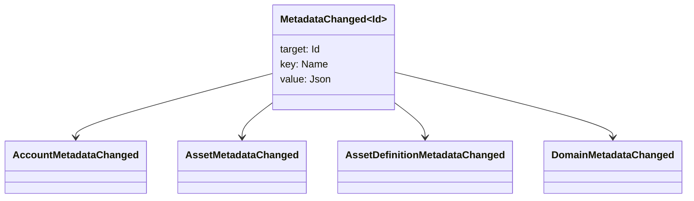

# البيانات الأساسية {#metadata}

البيانات المعدنية هي خريطة قيمة مفتاح معتمدة على كائنات دفتر التسجيل. مفاتيح هي `Name` القيم والقيم هي JSON (`Json`) الحمولات المفيدة.

الكائنات التالية يمكن أن تحمل البيانات الوصفية:

- المجالات
- الحسابات
- الأصول
- تعريفات الأصول
- NFTs
- RWAs
- المحفزات
- المعاملات

استخدم البيانات الأساسية لحقول وصفية أو فهرسة صغيرة تنتمي إلى حالة الكتب الرئيسية. يجب تخزين الأحمال المفيدة الكبيرة خارج WSV ومشار إليها بواسطة مسار هضم ، URI ، أو SoraFS.

للحصول على إرشادات بشأن اختيار البيانات المعدنية، الأصول NFTs، RWAs، أو التخزين خارج السلسلة، انظر [اختيارات تخزين البيانات المتعددة وتخزين الكدولة ](/ar/guide/configure/metadata-and-store-assets.md).

## جربوا ذلك على Taira {#try-it-on-taira}

البيانات المعدنية مرئية من خلال قراءة الموارد العادية. هذه الأوامر تدرج تعريفات الأصول Taira التي تحتوي حاليًا على البيانات المتعددة:

```bash
curl -fsS 'https://taira.sora.org/v1/assets/definitions?limit=100' \
  | jq '.items[]
    | select((.metadata | length) > 0)
    | {id, name, metadata}'
```

استخدم نفس النمط للمناطق والحسابات:

```bash
curl -fsS 'https://taira.sora.org/v1/domains?limit=20' \
  | jq '.items[] | select((.metadata // {} | length) > 0)'

curl -fsS 'https://taira.sora.org/v1/accounts?limit=20' \
  | jq '.items[] | select((.metadata // {} | length) > 0)'
```

تعتبر الخروج الفارغ نتيجة صالحة. يعني الصفحة الحالية من Taira الأشياء لا تحتوي على البيانات الضخمة، وليس أن نقطة النهاية فشلت.

## تحديث البيانات المتعددة {#updating-metadata}

يتم تغيير البيانات الوصفية بواسطة Iroha التعليمات الخاصة:

- [`SetKeyValue`](/ar/blockchain/instructions.md#setkeyvalue-removekeyvalue) إدخال مفتاح أو استبداله.
- [`RemoveKeyValue`](/ar/blockchain/instructions.md#setkeyvalue-removekeyvalue) إزالة مفتاح

يجب أن يكون لدى السلطة التي تقدم المعاملة الإذن المطلوب من قبل مؤكّد الوقت التشغيلي النشط. بالنسبة إلى سطح الإذن الافتراضي، انظر [رموز الإذن](/ar/reference/permissions.md).

## الأحداث {#events}

يتم إصدار أحداث البيانات عند تغيير البيانات الوصفية. الحدث العام هو `MetadataChanged<Id>`:



استخدم مرشحات حدث البيانات [](/ar/blockchain/filters.md#data-event-filters) للتسجيل فقط في أحداث البيانات المعدنية لنوع الكيان أو كائن ID الذي يهم التكامل.

## الأسئلة {#queries}

يتم إرجاع البيانات الأساسية كجزء من الكائن المطلوب. على سبيل المثال، استخدام [`FindAccountById`](/ar/reference/queries.md#accounts-and-permissions), [`FindDomainById`](/ar/reference/queries.md#domains-and-peers), أو [`FindAssetDefinitionById`](/ar/reference/queries.md#assets-nfts-and-rwas). الاستخدام [`FindNfts`](/ar/reference/queries.md#assets-nfts-and-rwas) أو [`FindNftsByAccountId`](/ar/reference/queries.md#assets-nfts-and-rwas) لـ NFTs, و [`FindRwas`](/ar/reference/queries.md#assets-nfts-and-rwas) لـ RWA ثم قراءة حقل البيانات المعدنية للشيء. NFT استجابات السؤال تعرض NFT `content` خريطة كميتاء البيانات المسجلة

مفاتيح البيانات المعدنية هي جزء من حالة دفتر التسجيل، لذلك حافظ عليها مستقرة وتجنب تشفير إصدار محدد للتطبيق في اسم المفتاح عندما يمكن أن تحمل قيمة JSON هذا الإصدار صراحة.
