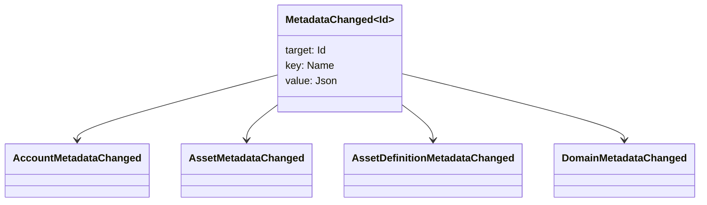

# البيانات الوصفية {#metadata}

البيانات الوصفية هي خريطة مفتاح-قيمة تم التحقق منها مرتبطة بكائنات دفتر الأستاذ البلوكشين. المفاتيح هي قيم `Name` والقيم هي حمولات JSON (`Json`).

يمكن للكائنات التالية حمل بيانات وصفية:

- النطاقات
- حسابات
- الأصول
- تعريفات الأصول
- NFTs
- RWAs
- المحفزات
- المعاملات

استخدم البيانات الوصفية للحقول الصغيرة الوصفية أو الفهارس التي تنتمي إلى حالة دفتر الأستاذ في البلوكشين. يجب تخزين الحمولات الكبيرة خارج WSV والإشارة إليها بواسطة قيمة ملخص تشفيرية، URI، أو مسار SoraFS.

للحصول على إرشادات حول اختيار الميتاداتا، الأصول، NFTs، RWAs، أو التخزين خارج السلسلة، انظر [البيانات الوصفية وخيارات تخزين سجل البلوكشين](/ar/guide/configure/metadata-and-store-assets.md).

## جرّبه على Taira {#try-it-on-taira}

البيانات الوصفية مرئية من خلال قراءة الموارد العادية. هذا الأمر يسرد تعريفات الأصول Taira التي تحتوي حالياً على بيانات وصفية:

```bash
curl -fsS 'https://taira.sora.org/v1/assets/definitions?limit=100' \
  | jq '.items[]
    | select((.metadata | length) > 0)
    | {id, name, metadata}'
```

استخدم نفس النمط للنطاقات والحسابات:

```bash
curl -fsS 'https://taira.sora.org/v1/domains?limit=20' \
  | jq '.items[] | select((.metadata // {} | length) > 0)'

curl -fsS 'https://taira.sora.org/v1/accounts?limit=20' \
  | jq '.items[] | select((.metadata // {} | length) > 0)'
```

اعتبر المخرجات الفارغة نتيجة صالحة. هذا يعني أن الصفحة الحالية من كائنات Taira لا تحتوي على بيانات وصفية، وليس أن نقطة النهاية API قد فشلت.

## تحديث البيانات الوصفية {#updating-metadata}

يتم تغيير البيانات الوصفية باستخدام عمليات التعليمات Iroha:

- [`SetKeyValue`](/ar/blockchain/instructions.md#setkeyvalue-removekeyvalue) يُدرج أو يستبدل مفتاحًا
- [`RemoveKeyValue`](/ar/blockchain/instructions.md#setkeyvalue-removekeyvalue) يزيل مفتاحًا

يجب أن يكون للجهة المخوَّلة التي تقدم المعاملة الإذن المطلوب من قِبل مدقق وقت تشغيل البرنامج النشط. بالنسبة لسطح الإذن الافتراضي، انظر [رموز الإذن](/ar/reference/permissions.md).

## الأحداث {#events}

يتم إصدار أحداث البيانات عندما تتغير البيانات الوصفية. الحمولة العامة للحدث هي `MetadataChanged<Id>`:



استخدم [مرشحات أحداث البيانات](/ar/blockchain/filters.md#data-event-filters) للاشتراك فقط في أحداث الميتاداتا لنوع الكيان أو معرف الكائن الذي يهم التكامل.

## استفسارات {#queries}

يتم إرجاع البيانات الوصفية كجزء من الكائن المستعلم عنه. على سبيل المثال، استخدم [`FindAccountById`](/ar/reference/queries.md#accounts-and-permissions), [`FindDomainById`](/ar/reference/queries.md#domains-and-peers), أو [`FindAssetDefinitionById`](/ar/reference/queries.md#assets-nfts-and-rwas). استخدم [`FindNfts`](/ar/reference/queries.md#assets-nfts-and-rwas) أو [`FindNftsByAccountId`](/ar/reference/queries.md#assets-nfts-and-rwas) لـ NFTs, و [`FindRwas`](/ar/reference/queries.md#assets-nfts-and-rwas) لـ RWA الكثير. ثم اقرأ حقل بيانات التعريف للكائن. NFT استجابات الاستعلام تكشف NFT `content` الخريطة كبيانات وصفية للسجل.

مفاتيح البيانات الوصفية هي جزء من حالة سجل البلوكتشين، لذا احتفظ بها مستقرة وتجنب تشفير تغييرات إصدار محددة للتطبيق في اسم المفتاح عندما يمكن لقيمة JSON أن تحمل هذا الإصدار بشكل صريح.
