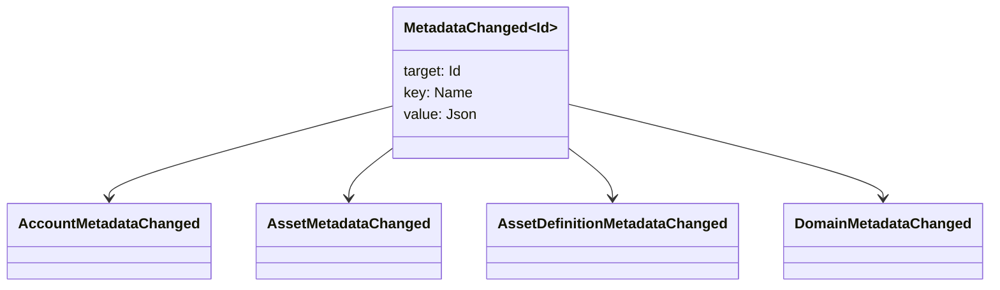

# البيانات المتعددة {#metadata}

البيانات المعدنية هي خريطة قيمة مفتاح معتمدة على كائنات الكتب الرئيسية.
`Name` القيم والقيم هي JSON (`Json`) الحمولات المفيدة.

يمكن أن تحمل الكائنات التالية البيانات الضخمة:

- المجال
- الحسابات
- الأصول
- تعريفات الأصول
- NFTs
- RWAs
- المحفزات
- المعاملات

استخدم البيانات المعدنية للحقول الصغيرة التصفية أو الترتيب التي تنتمي إلى دفتر الرسوم الكبرى
يجب تخزين الحمولات المفيدة الكبيرة خارج WSV ويشير إليها
الهضم، URI, أو SoraFS الطريق.

للحصول على إرشادات بشأن اختيار البيانات المعدنية، الأصول، NFTs, RWAs, أو خارج السلسلة
التخزين، انظر
[خيارات تخزين البيانات المتعددة والكتاب](/ar/guide/configure/metadata-and-store-assets.md).

## جربها Taira {#try-it-on-taira}

البيانات المعدنية مرئية من خلال قراءة الموارد العادية. هذه القائمة قائمة Taira
تعريفات الأصول التي تحتوي حاليا على البيانات المعدنية:

```bash
curl -fsS 'https://taira.sora.org/v1/assets/definitions?limit=100' \
  | jq '.items[]
    | select((.metadata | length) > 0)
    | {id, name, metadata}'
```

استخدم نفس النمط للمنطقة والحسابات:

```bash
curl -fsS 'https://taira.sora.org/v1/domains?limit=20' \
  | jq '.items[] | select((.metadata // {} | length) > 0)'

curl -fsS 'https://taira.sora.org/v1/accounts?limit=20' \
  | jq '.items[] | select((.metadata // {} | length) > 0)'
```

تعتبر الخروج الفارغ نتيجة صالحة. Taira
لا يحمل الكائنات البيانات المعدنية، وليس أن نقطة النهاية فشلت.

## تحديث البيانات {#updating-metadata}

يتم تغيير البيانات الأساسية مع Iroha تعليمات خاصة:

- [`SetKeyValue`](/ar/blockchain/instructions.md#setkeyvalue-removekeyvalue)
  إدخال أو استبدال مفتاح
- [`RemoveKeyValue`](/ar/blockchain/instructions.md#setkeyvalue-removekeyvalue)
  إزالة مفتاح

يجب أن يكون لدى السلطة التي تقدم الصفقة الإذن المطلوب
بواسطة مؤكدة الوقت التشغيلي النشط. لمساحة الإذن الافتراضية ، انظر
[رموز الإذن](/ar/reference/permissions.md).

## الأحداث {#events}

يتم إصدار أحداث البيانات عند تغيير البيانات المعدنية.
`MetadataChanged<Id>`:



الاستخدام [مرشحات حوادث البيانات](/ar/blockchain/filters.md#data-event-filters) إلى
الاشتراك فقط في أحداث البيانات المعدنية لنوع الكيان أو كائن ID هذا
ما يهم التكامل.

## الأسئلة {#queries}

يتم إرجاع البيانات المعدنية كجزء من الكائن الذي تم استفساره. على سبيل المثال، استخدام
[`FindAccountById`](/ar/reference/queries.md#accounts-and-permissions),
[`FindDomainById`](/ar/reference/queries.md#domains-and-peers), أو
[`FindAssetDefinitionById`](/ar/reference/queries.md#assets-nfts-and-rwas).
الاستخدام [`FindNfts`](/ar/reference/queries.md#assets-nfts-and-rwas) أو
[`FindNftsByAccountId`](/ar/reference/queries.md#assets-nfts-and-rwas) لـ
NFTs, و [`FindRwas`](/ar/reference/queries.md#assets-nfts-and-rwas) لـ RWA
ثم قراءة حقل البيانات المعدنية للشيء. NFT استجابات السؤال تعرض
NFT `content` خريطة كمتطال بيانات السجل.

مفاتيح البيانات المعدنية هي جزء من حالة الكتيب، لذلك حافظ عليها مستقرة وتجنب
تشفير نسخة تطبيقية محددة تتحول إلى اسم المفتاح عندما JSON
القيمة يمكن أن تحمل تلك النسخة صراحة.
