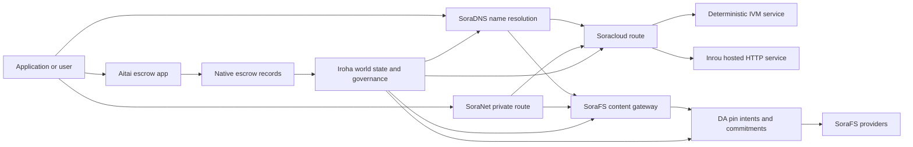

# SORA Nexus الخدمات {#sora-nexus-services}

SORA Nexus يضيف طائرات خدمة تتجه نحو التطبيقات Iroha 3. هذه الخدمات
ليست سجلات منفصلة. Iroha الدولة العالمية Norito
الممارسات، سجلات الحوكمة، Torii العائلات

التوافر يعتمد على بناء العقد وملف الشبكة.
[`/openapi`](/ar/reference/torii-endpoints.md#app-and-sora-route-families) على
العقدة المستهدفة كقائمة مؤكدة من الطرق الممكّنة.

## خريطة المكونات {#component-map}

| المكونات              | الدور                                                                                                                                        | السطح الرئيسي                                                                            |
| ---------------------- | ------------------------------------------------------------------------------------------------------------------------------------------- | ---------------------------------------------------------------------------------------- |
| Soracloud              | تنفيذ التطبيقات، الخدمات المضيفة، النموذج الخاص/حالة وقت التشغيل، ومراقبة دورة حياة الخدمة.                                        | `/v1/soracloud/*`, `/api/*`, `iroha app soracloud ...`                                   |
| (إنرو)                  | Soracloud المضيفة HTTP وقت تشغيل إصلاحات الخدمة التي تحتاج إلى تنفيذ مباشر HTTP طائرة                                                            | Soracloud تشكيل وقت التشغيل، إعلانات قدرة المضيف، حالة النسخة                 |
| SoraNet                | الخصوصية والنقل المترتبة على الدوائر، حركة الرصيف، VPN, قم بتوصيل جلسات، وتدوير الطرق.                                     | `/v1/connect/*`, `/v1/vpn/*`, SoraNet البيانات المتعلقة بالمرحلة                                     |
| توافر البيانات (DA) | إثبات التوافر والالتزام، وطبقة النية الرامية للحميات المفيدة التي يشير إليها: Nexus الممرات، SoraFS يظهر، والدليل يتدفق. | `/v1/da/*`, `FindDaPinIntent*`, `[sumeragi.da]`                                          |
| SoraFS                 | أدوات تخزين المحتويات ذات العناوين، CAR الحمولات المفيدة، المحتوى المتعلق بها، والحصول على البوابة، وتدفقات إثبات الاسترداد.           | `/v1/sorafs/*`, `/sorafs/*`, `FindSorafsProviderOwner`                                   |
| SoraDNS                | طبقة التسمية المحددة و تصنيف القرار ل SORA- الخدمات والمحتوى المضيفة.                                                   | `/v1/soradns/*`, `/soradns/*`, الأحداث في دليل resolver                                 |
| أيتاي                  | ممر تسوية الأصول على مستوى التطبيق المدعوم من سجلات الاحتفاظ الأصلية، وليس من قبل دفتر رئيسي منفصل.                                     | `OpenAssetEscrow`, `FindAssetEscrow*`, `EscrowEventFilter`, Kotodama `escrow_*` المباني |



## التدفقات الشائعة {#common-flows}

### تطبيق تقسيم مستضيف {#hosted-split-application}

تطبيقات المزدوجة النموذجية تستخدم جميع القطع معا:

1. يتم تعبئة الأصول المثبتة في الجبهة الأمامية ووضعها على SoraFS.
2. المضيف العام، على سبيل المثال `<app>.sora`, يتم تسجيلها من خلال
   SoraDNS.
3. Soracloud الطرق `/api/v1/search` أو `/api/v1/stream` لـ (إنرو) HTTP
   الخدمة
4. Soracloud الطرق `/api/auth` و `/api/v1/user` إلى تحديد IVM
   المُتعاملين.
5. يمكن للعملاء الذين يحتاجون إلى الخصوصية الحصول على نفس المحتوى أو API الطريق
   من خلال SoraNet دائرة.

| الطريق              | طائرة مؤخرة         | لماذا ؟                                               |
| ----------------- | --------------------- | ------------------------------------------------- |
| `/`               | SoraFS محتوى ثابت | تخزين المحتوى القابل للتكرار     |
| `/assets/*`       | SoraFS محتوى ثابت | الأصول التي تعتمد على المحتوى والبيانات المعلنة      |
| `/api/auth*`      | Soracloud IVM         | حالة التحديات في الوصف والأموال       |
| `/api/v1/user*`   | Soracloud IVM         | الطفرات الحكومية الحساسة              |
| `/api/v1/search*` | Soracloud (إنرو)       | على قيد الحياة HTTP الخدمة، التخزين SSE, أو الدولة المستقبلية |

### المحتوى المنشور {#content-publication}

SoraFS النشر ينتج الأثرية الدائمة قبل أن يشير الاسم إليها:

1. بناء حمولة مفيدة أو دليل.
2. إغلفها في CAR أرشيف و خطة قطعة.
3. بناء Norito يظهر مع بيانات السياسة والحوكمة.
4. إرسال المخطط إلى Torii.
5. سجل DA الالتزام بالمقصد أو التوفر عندما يكون الهدف
   الملف يتطلب دليل صريح.
6. ربط المذكرة بـ SoraDNS الاسم أو Soracloud الطريق المسبق

### الطرق الخاصة للقطار أو البث {#private-fetch-or-streaming-route}

SoraNet يمكن أن تجلس أمام SoraFS أو Soracloud:

1. العميل يحل الاسم أو المخطط
2. دليل الحراس أو مذكرة المسار تختار رلي دخول وخروج.
3. المرور يملأ ويُرسل عبر SoraNet دائرة.
4. رصيف الخروج يصل إلى SoraFS البوابة Torii التيار، أو Soracloud
   الطريق

## أيتاي {#aitai}

(آيتاي) هو SORA ممر التطبيقات للتسوية على شكل السوق حيث
يقوم المشتري والبائع بتنسيق الدفع خارج السلسلة بينما Iroha يسيطر على
الاحتفاظ بالأصول على السلسلة. يجب أن تستخدم عائلة تعليمات الأمانة الأصلية
بدلاً من حساب الاحتفاظ بالعقد المملوك له، للحفاظ على الأصول الرقمية الجديدة.
تدفق.

الاحتفاظ بالأموال المحلية في دفتر التسجيل البائع يفتح العرض
`OpenAssetEscrow`, المشتري يقبل ويضع علامة على الدفع خارج السلسلة
`AcceptAssetEscrow` و `MarkEscrowPaymentSent`, والبائع يطلق سراحه
مع `ReleaseAssetEscrow` أو إلغاء قبل أن يتم وضع علامة على الدفع.
لا يوافق البائع ، يمكن لأي من الطرفين فتح نزاع وحل مع
`CanResolveEscrowDispute` يمكن تقسيم المبلغ المحجوز

طوال دورة الحياة، قفل الأصول العامة، الاحتفاظ المجهول، الاستفسارات،
الأحداث، Rust الأمثلة، انظر
[الاحتفاظ بالأصول الأصلية](/ar/blockchain/escrow.md).

| السطح الآيتاي                                                                                                                                                 | استخدمها                                                                                |
| ------------------------------------------------------------------------------------------------------------------------------------------------------------- | ----------------------------------------------------------------------------------------- |
| `OpenAssetEscrow`, `AcceptAssetEscrow`, `MarkEscrowPaymentSent`, `ReleaseAssetEscrow`, `CancelAssetEscrow`                                                    | عروض الأصول الرقمية الشفافة، بما في ذلك XOR-تدفقات التسوية المعروفة             |
| `OpenAnonymousAssetEscrow`, `AcceptAnonymousAssetEscrow`, `MarkAnonymousEscrowPaymentSent`, `ReleaseAnonymousAssetEscrow`, `CancelAnonymousAssetEscrow`       | العروض المحمية حيث يتم نقل التمويل والإغلاق عن طريق إثبات المرفقات. |
| `OpenEscrowDispute`, `ResolveEscrowDispute`, `OpenAnonymousEscrowDispute`, `ResolveAnonymousEscrowDispute`                                                    | إدخال النزاعات وحل المحاكم                                                 |
| `FindAssetEscrowById`, `FindAssetEscrowsBySeller`, `FindAssetEscrowsByBuyer`, `FindAssetEscrowsByStatus`                                                      | صفحات حالة التطبيقات، وظائف المصالحة، وأدوات الدعم.                               |
| `EscrowEventFilter`                                                                                                                                           | اشتراكات الاحتفاظ الشفافة الحية حسب اسم الاحتفاض، البائع، المشتري، الحالة، أو نوع الأحداث. |
| Kotodama `escrow_open_offer`, `escrow_accept`, `escrow_mark_payment_sent`, `escrow_release`, `escrow_cancel`, `escrow_open_dispute`, `escrow_resolve_dispute` | Kotodama الاتصالات العقدية المدعومة من V1 (سيسكال)                                 |

للجمهور Taira أو Minamoto الاستخدام، معالجة سكة حديد الدفع خارج السلسلة و
أي تدفق عمل دعم أو محكمة كسياسة طلب. Iroha سجلات
حالة الاحتفاظ بها، وأحداث دورة الحياة، وتحليلات الأدلة، وحركة الأصول النهائية.
لا تؤكد التسوية النقدية بمفردها

## تحقق من عقدة الهدف {#check-a-target-node}

قبل استخدام الأمثلة من هذه الصفحة، تأكد أن عائلة الطريق موجودة
على العقدة التي تستهدفها:

```bash
export TORII_URL=https://taira.sora.org

curl -fsS "$TORII_URL/openapi.json" \
  | jq '.paths | keys[] | select(test("^/v1/(soracloud|sorafs|soradns|connect|vpn|da)/"))'

curl -fsS "$TORII_URL/status" | jq .
```

إذا `/openapi.json` لا يظهر على الملف الشخصي، حاول `/openapi`. بالضبط
تتوفر المسار يعتمد على ميزات البناء وتكوين الشبكة.

### Taira شيكات الدخان فقط {#taira-read-only-smoke-checks}

الجمهور Taira نقطة النهاية مفيدة للتحقق من جانب القراءة، ولكن لا تستخدمها
على سبيل المثال ، ما لم تكن تشغل حسابًا مصرح به
نعتزم تغيير الحالة الحية

```bash
export TORII_URL=https://taira.sora.org

curl -fsS "$TORII_URL/status" \
  | jq '{version: .build.version, peers, blocks, lanes: (.teu_lane_commit | length)}'

curl -fsS "$TORII_URL/v1/connect/status" | jq '{enabled, sessions_active}'

curl -fsS "$TORII_URL/v1/vpn/profile" \
  | jq '{available, relay_endpoint, supported_exit_classes}'

curl -fsS "$TORII_URL/v1/sorafs/storage/state" \
  | jq '{bytes_capacity, bytes_used, pin_queue_depth, por_inflight}'

curl -fsS -H 'Accept: application/json' "$TORII_URL/v1/soracloud/status" \
  | jq '.control_plane | {service_count, services: [.services[] | {service_name, current_version}]}'
```

Taira قد تعرّض مسارات طائرة التحكم الخاصة بالتنفيذ التي لا تكون
المدرجة في OpenAPI خريطة المسار `/openapi` كالمادة الاولى التي تم إنتاجها
API التعاقد، ثم تأكيد أي طريق محدد للتنفيذ مباشرة قبل
يُوثّقونها على قيد الحياة.

## Soracloud {#soracloud}

Soracloud هو SORA طائرة تحكم التطبيق.
الحزم، إصلاحات الخدمة، التوجيه، حالة الانتشار، تشكيل مصرح
الإدخالات، أسرار الخدمة المشفرة، سجلات السجل النموذجية، خصوصية
جلسات الاستنتاج، وإيصالات التشغيل.

Soracloud يستخدم طائرتين للتنفيذ:

| طائرة الإعدام        | وقت التشغيل | استخدمها                                                                                   |
| ---------------------- | ------- | -------------------------------------------------------------------------------------------- |
| `DeterministicService` | `Ivm`   | مصدر، حالة الخزنة، قراءات معتمدة، موظفين صناديق البريد، طفرات حساسة للحوكمة |
| `HttpService`          | `Inrou` | على قيد الحياة HTTP APIs, العمل الثقيل للمجموعة، الخدمات المدعومة من الكاش، SSE, التدفقات المساعدة من المتصفح     |

طائرة التحكم هي مؤكدة تنفيذ، تحديث، إرجاع، تشكيل
الأوامر السرية، النموذج، والحالة تقديم من خلال Torii والقراءة المفروضة
الدولة العالمية؛ لا تعتمد على CLI مرآة محلية عامة
التوجيه يعتمد على أقصى مستوى، لذلك يمكن لشريك واحد مسجل تقسيم حركة المرور
بين المضيفين HTTP الطرق والتحديدات API الطرق

### إرفع التطبيق المتفرق {#scaffold-a-split-app}

نموذج تقسيم التطبيق يخلق مقربة ثابتة بالإضافة إلى واحدة مضيفة على قيد الحياة API
وهناك قبو محدد واحد API الخدمة:

```bash
iroha app soracloud app init \
  --template split-app \
  --app-name solswap_indexer \
  --app-version 0.1.0 \
  --public-host solswap-indexer.sora \
  --output-dir ./apps/solswap-indexer

iroha app soracloud app local-plan \
  --manifest ./apps/solswap-indexer/app_manifest.json

iroha app soracloud app doctor \
  --manifest ./apps/solswap-indexer/app_manifest.json
```

`local-plan` طباعة مقاطع الطريق، وخطابات خدمة الأطفال، ومساحة العمل
مسارات النص، والطريقة المتوقعة للنشر الأمامي. `doctor`
يصدق عقد الإفراج المحلي قبل أن تشمل Torii.

### تنفيذ وتفتيش حالة التطبيق {#deploy-and-inspect-app-state}

```bash
export SORACLOUD_TORII_URL=https://<soracloud-enabled-torii>

iroha app soracloud app deploy \
  --manifest ./apps/solswap-indexer/app_manifest.json \
  --torii-url "$SORACLOUD_TORII_URL"

iroha app soracloud app status \
  --manifest ./apps/solswap-indexer/app_manifest.json \
  --torii-url "$SORACLOUD_TORII_URL"
```

لخدمة تم نشرها بالفعل، استخدم الأوامر المتطابقة مع مستوى الخدمة:

```bash
iroha app soracloud status \
  --service-name solswap_indexer_live \
  --torii-url "$SORACLOUD_TORII_URL"

iroha app soracloud rollback \
  --service-name solswap_indexer_live \
  --target-version 0.1.0 \
  --torii-url "$SORACLOUD_TORII_URL"
```

### المواد الخفية {#config-and-secret-material}

Soracloud الإدخالات السرية والإعدادات المُحددة هي جزء من التنفيذ المعتمد
حالة. تنفيذ، تحديث، والإعادة التدريب فشل إغلاق عند الضرورة تشكيل أو
لا توجد روابط سرية أو غير متوافقة مع المظاهر النشطة.

```bash
iroha app soracloud config-set \
  --service-name solswap_indexer_live \
  --config-name indexer/public_config \
  --value-file ./config/public-config.json \
  --torii-url "$SORACLOUD_TORII_URL"

iroha app soracloud secret-set \
  --service-name solswap_indexer_live \
  --secret-name indexer/api_key \
  --secret-file ./secrets/api-key.envelope.json \
  --torii-url "$SORACLOUD_TORII_URL"
```

استخدم CLI المساعدة في الحصول على العلامات الدقيقة التي يتطلبها ملفك الشخصي:

```bash
iroha app soracloud config-set --help
iroha app soracloud secret-set --help
```

## (إنرو) {#inrou}

إنرو هي المضيفة HTTP الوقت المستخدم من قبل Soracloud. (إنجليزية) Iroha العقدة مع
متضمنة Soracloud المشاريع المتقدمة Soracloud الدولة إلى محلية
خطة التمويل، يبدأ تعيين النسخ الخدمة المضيفة كمحافظة
الخدمات، وتقديم تقارير نسخة بيان وقت التشغيل مرة أخرى في
النموذج

استخدم Inrou لتحميلات العمل التي تحتاج إلى تحميل مباشر HTTP السطح، مثل
المجموعة الثقيلة APIs, SSE التدفقات، ومعالجات مدعومة بالخزنة، أو
الخدمات المساعدة من المتصفح.

### متطلبات وقت التشغيل {#runtime-requirements}

- يجب أن يكون وقت تشغيل مظلة الحاويات `Inrou`.
- يجب أن تكون طائرة تنفيذ منشور الخدمة `HttpService`.
- `HttpService + Inrou` يتطلب ذلك بالضبط `PersistentRootLeaseVolume`
  يثبت في `/`.
- تحتاج خدمات Inrou المكررة أيضا إلى خدمة مشتركة أو تأجير سرية
  التخزين عند الحفاظ على حالة المشاركة المتغيرة.
- يجب على عقدات استضافة الإنتاج الإعلان عن قدرة Inrou الحقيقية بدلاً من
  يعمل فقط كوكيل

### قطعة واضحة {#manifest-fragment}

ويعرض المثال أدناه شكل المظاهر الثنائية. إنه قطعة،
ليس مجموعة كاملة للنشر.

```jsonc
// container_manifest.json
{
  "schema_version": 1,
  "runtime": { "runtime": "Inrou", "value": null },
  "bundle_path": "/bundles/solswap-indexer.inrou",
  "entrypoint": "/app/bin/launch-indexer.sh",
  "args": [],
  "env": {
    "RUST_LOG": "info",
  },
  "inrou": {
    "schema_version": 1,
    "guest_os": { "guest_os": "DebianSlim", "value": null },
    "guest_images": {
      "x86_64": {
        "kernel_image_path": "/inrou/x86_64/vmlinux",
        "rootfs_image_path": "/inrou/x86_64/rootfs.ext4",
        "initrd_image_path": null,
      },
      "aarch64": {
        "kernel_image_path": "/inrou/aarch64/vmlinux",
        "rootfs_image_path": "/inrou/aarch64/rootfs.ext4",
        "initrd_image_path": null,
      },
    },
  },
  "lifecycle": {
    "start_grace_secs": 60,
    "stop_grace_secs": 30,
    "healthcheck_path": "/api/indexer/v1/health",
  },
}
```

```jsonc
// service_manifest.json
{
  "schema_version": 1,
  "service_name": "solswap_indexer_live",
  "service_version": "0.1.0",
  "execution_plane": { "execution_plane": "HttpService", "value": null },
  "replicas": 2,
  "route": {
    "host": "solswap-indexer.sora",
    "path_prefix": "/api/v1/search",
    "service_port": 8080,
    "visibility": { "visibility": "Public", "value": null },
    "tls_mode": { "tls": "Required", "value": null },
  },
  "lease_volumes": [
    {
      "volume_name": "root_disk",
      "kind": {
        "lease_volume": "PersistentRootLeaseVolume",
        "value": null,
      },
      "storage_class": { "storage_class": "Warm", "value": null },
      "mount_path": "/",
      "max_total_bytes": 8589934592,
    },
    {
      "volume_name": "index_state",
      "kind": { "lease_volume": "ServiceLeaseVolume", "value": null },
      "storage_class": { "storage_class": "Warm", "value": null },
      "mount_path": "/var/lib/solswap-indexer",
      "max_total_bytes": 1073741824,
    },
  ],
}
```

في وقت التشغيل، كل حجم الإيجار المثبت يتم تعريفه من خلال البيئة
المتغيرات المستمدة من اسم الحجم:

```text
SORACLOUD_LEASE_VOLUME_ROOT_DISK_DIR
SORACLOUD_LEASE_VOLUME_ROOT_DISK_MOUNT_PATH
SORACLOUD_LEASE_VOLUME_INDEX_STATE_DIR
SORACLOUD_LEASE_VOLUME_INDEX_STATE_MOUNT_PATH
```

## SoraNet {#soranet}

SoraNet هو الخصوصية والنقل تغطية.
طرق حركة المرور التي لا ينبغي أن تتصل مباشرة بمركز البوابة المستهدفة
أو خدمة. تصميم النقل يستخدم أدوار إرسال دخول ووسط وخارج،
QUIC النقل، إضافة اليد المختلفة القائمة على الضوضاء، التفاوض حول القدرات،
البيانات المتعددة من إرشادات الترسل، والخلايا المغطاة ذات الحجم الثابت.

في Nexus النشر، SoraNet يمكن أن يحمل محمولات المحتوى، حركة مرور البوابة،
VPN أو جلسات الاتصال، و Norito طرق التدفق. إدخالات المجلد يمكن أن
علامة الروايات التي دعم `norito-stream`, مما يسمح للعملاء بتفضيل الطرق
مناسبة ل: Torii RPC أو تدفق حركة المرور.

### تكوين التدفق {#streaming-configuration}

(الـ) Nexus الملف يسمح SoraNet توفير الطرق المتداولة:

```toml
[streaming]
feature_bits = 0b11

[streaming.soranet]
enabled = true
exit_multiaddr = "/dns/torii/udp/9443/quic"
padding_budget_ms = 25
access_kind = "authenticated"
provision_spool_dir = "./storage/streaming/soranet_routes"
provision_spool_max_bytes = 0
provision_window_segments = 4
provision_queue_capacity = 256
```

الاستخدام `access_kind = "read-only"` لطرق المحتوى التي لا تتطلب
التصديق المشاهد. `authenticated` عندما يجب أن يفرض رلي الخروج
التذاكر أو هوية المشاهد قبل الانتقال إلى Torii أو خدمة مضيفة

### SoraNet-أعلم SoraFS أحضر {#soranet-aware-sorafs-fetch}

(الـ) SoraFS التسجيل CLI يمكن أن تنشر إشارة وكيل محلية والسجل SoraNet
البيانات الوصولية للمتوسعات المتصفح أو SDK المعدلات:

```bash
sorafs_cli fetch \
  --plan artifacts/payload_plan.json \
  --manifest-id 7bb2...9d31 \
  --provider name=alpha,provider-id=9f5c...73aa,base-url=https://gw-alpha.example.org/,stream-token="$(cat alpha.token)" \
  --output artifacts/payload.bin \
  --json-out artifacts/fetch_summary.json \
  --local-proxy-manifest-out artifacts/proxy_manifest.json \
  --local-proxy-mode bridge \
  --local-proxy-norito-spool storage/streaming/soranet_routes \
  --local-proxy-kaigi-spool storage/streaming/soranet_routes \
  --local-proxy-kaigi-policy authenticated \
  --max-peers=2 \
  --retry-budget=4
```

تقارير مزود السجلات الموجزة، إيصالات جزئية، بيانات البيانات المحلية
والإعدادات الفعالة للطريق المستخدمة للاستحواذ.

## توافر البيانات (DA) {#data-availability-da}

DA هي طبقة إثبات الوصول للحميات المفيدة التي كبيرة جدا، أيضا
حساسة للخصوصية، أو خاصة جداً بالخدمات ليتم وضعها مباشرة في العالم
وتسجل الالتزامات المحددة والتزامات الاسترداد
يمكن للمؤكدين والبوابات والعملاء الاتفاق على البايتات التي وعدت،
ما هي السياسة المطبقة، وما هي الأدلة التي تم ملاحظتها.

DA لا يحل محل Kura أو SoraFS:

- Kura تخزين بيانات استرداد الكتلة النهائية والإجماع.
- SoraFS تخزين وخدمة البايتات التي تستهدف المحتوى، CAR الحمولات المفيدة، و
  المظاهر.
- DA سجلات الالتزامات وسياسات الدليل والفتاحات في الأدلة وخطط اللوحة
  والتي تسمح لهذه البايتات بتعيينها ومراجعتها وربطها مرة أخرى إلى دفتر التسجيل
  الدولة.

الاستخدام DA عندما تقدم طلب أو Nexus يحتاج لين إلى وعد مرئي
أن البيانات خارج السلسلة لا تزال قابلة للتحويل.
التزامات الحمولة المفيدة لتدفقات التسوية، SoraFS مقصود البين للنشر
المحتوى، والحزم الدليل التي يجب الاحتفاظ بها للتحقق لاحقاً، و
المواد الأثرية التطبيقية التي يجب أن تكون الحالة العامة هي إضافة بدلا من
حمولة مفيدة كاملة

### دورة الحياة {#lifecycle}

| المرحلة      | ما هو المسجل                                                                                                                                      |
| ---------- | ----------------------------------------------------------------------------------------------------------------------------------------------------- |
| نية     | تذكرة، إشارة واضحة، مستعار، الإشارة إلى الممر/العصر/السلسلة، سياسة الاحتفاظ أو هدف التكرار.                                          |
| الالتزام | إرسال المواد التي تربط المخطط، الحمولة المفيدة للقطار، حزمة الدليل، أو جذور المحتوى إلى السجل المرئي في دفتر التسجيل.                                    |
| الأدلة   | التصويت على الوصول، فتحات الأدلة، شهادات المزودين، أو غيرها من الأدلة المحددة للفصائل التي قبلتها شبكة الهدف.                         |
| السؤال      | أبحاث محصنة `FindDaPinIntentByTicket`, `FindDaPinIntentByManifest`, `FindDaPinIntentByAlias`, أو `FindDaPinIntentByLaneEpochSequence`. |

عادة DA- تدفق المنشورات المدعوم هو:

1. بناء أو الحصول على الحمولة المفيدة خارج WSV, مثلاً SoraFS CAR
   الملف أو Nexus الحمولة المفيدة
2. ووصف الحمل المفيد في Norito المخطط أو المحدد للطرق
   سجل الالتزام
3. إرسال المخطط أو نية اللوحة، أو الالتزام من خلال `/v1/da/*` عندما
   يتم تمكين عائلة الطريق، أو من خلال شبكة الموقع
   مسار المعاملات
4. دع المحققين أو مقدمي التوافر جمع الأدلة المطلوبة
   من خلال سياسة الدليل النشط.
5. تسأل عن النية أو الالتزام الناتج قبل تعزيز الاسم
   دليل التسوية، أو طريق البوابة التي تعتمد على الحمولة المفيدة.

### نموذج خوارزمي {#algorithmic-model}

DA تحويل حمولة مفيدة إلى تعهد موقّع محمّن من إعادة تشغيل، ومتصنف على كتلة.
الخوارزميات المهمة هي تحديدية حتى المحققين والبوابات يمكن
إعادة حساب نفس الاهتزازات من نفس البايت

1. **إرسال الحمولة المقدمة** Torii يقبل طلب تناول الطعام مع
   `(lane_id, epoch, sequence)`, بايتات الحمل المفيد، بيانات الضغط، قطعة
   الحجم، ملف مسح، سياسة الاحتفاظ، وتوقيع مقدم. العقد
   يقوم بتفكيك تحميلات gzip أو deflate أو Zstandard عند الطلب، ثم
   يثبت أن طول البايت القنوني يساوي `total_size`.
2. **تأكيد معايير الممر والجزء.** يجب أن يكون هناك طريق في Nexus
   كتالوج الشوارع `chunk_size` يجب أن تكون قوة غير صفر من اثنين ، لا يقل عن اثنين
   البايتات، ولا تزيد عن الحد الأقصى المحدد.
   تشمل شرائح البيانات وعشرات المساواة على الأقل.
   نظام الدليل، إما `merkle_sha256` أو `kzg_bls12_381`.
3. **تطبيق سياسة الشبكة** العقد يفرض النسخة الموضحة و
   خط الاحتفاظ الأساسي لفئة البقع. يجب أن تظل البيانات المعدنية العامة متنًا صافيًا.
   يتم تشفير البيانات المعدنية التي تستخدم الحكم فقط مع حكم العقدة المتكوّن
   مفتاح البيانات المعدنية قبل أن يتم كتابتها في المخطط.
4. **تقطيع و إلتزام** الحمولة المفيدة القانونية مقطوعة بحجم ثابت
   الملف المستمد من `chunk_size`. Torii يحسب تحميل الحمولة المفيدة،
   أصل شجرة إثبات الاسترداد والالتزامات لكل قطعة.
   الحملة BLAKE3 الالتزامات على البايتات الخاصة بهم
5. **إضافة التزامات الحذف.** يتم تجميع المفصلات إلى شريط من:
   `data_shards`. الخلايا المفقودة في الشريط الأخير هي صفر ملعقة للمساوية
   الحساب RS(16) تخلق المساواة شرائح/شرائح مساواة عالمية؛ اختيارية
   `row_parity_stripes` إضافة مساوية الشريط في نمط العمود عبر المصفوفة.
   الالتزامات المتعلقة بالشقوق الموازية هي BLAKE3 هضم الأنديان الصغيرة `u16` الرموز
6. **بناء المذكرة.** `DaManifestV1` تسجل المجال، العصر، فئة البقع،
   كوديك، تحميل الحمولة المفيدة، جذور الجزء، حجم الجزء، ملف مسح، الاحتفاظ
   السياسة، اقتباس الإيجار، الالتزامات الجزئية، اختياري IPA الالتزام، البيانات المعدنية
   وتقديم الوقت. تذكرة التخزين هي تحديدية: العقد أولا hashs a
   النموذج مع تذكرة فارغة، ثم يكتب أن بصمة الإصبع مرة أخرى
   النهائي `storage_ticket`.
7. **رفض النزاعات المتكررة.** المفتاح لإعادة تشغيل هو
   `(lane_id, epoch, sequence, manifest_fingerprint)`. نسخة مزدوجة مع
   نفس بصمة الأصابع غير قادرة. تسلسل قديم أو نفس التسلسل مع
   يتم رفض بصمة أصابع مختلفة.
8. **إصدار الأدوات الموقعة.** Torii يحسب a PDP الالتزام، وقعت على
   `DaIngestReceipt`, يبني `DaCommitmentRecord`, و يكتب أدوات الملفات
   " للكتاب المعلن " . PDP الالتزام، سجل الالتزامات، جدول الالتزام
   نية اللوحة، ملف الإيصالات، و سجل الإيصالات.
   بشكل متوحد لكل `(lane_id, epoch)`.

سجلات الالتزام هي ما يحمله الكتل السجل يربط:

- الممر، العصر، والترتيب
- بوب المُتصلين ID والشاشة الكانونية المعلنة
- خطة إثبات المسارات
- الجذر
- اختياري KZG الالتزام KZG الممرات
- PDP/ إثبات هضم
- فئة الاحتفاظ وتذكرة التخزين
- Torii DA توقيع التأكيد

قبل أن يتم إضافة كتلة DA السجلات، مسار تجميع الكتل يؤكد على الحزمة:

- `(lane_id, epoch, sequence)` يجب أن تكون فريدة من نوعها داخل الحزمة
- يجب أن تكون الهيشات المعلنة غير صفر ووحيدة داخل الحزمة.
- يجب أن تتطابق خطة إثبات الالتزام مع سياسة المسارات الموضحة.
- طرق ميركل رفض KZG الالتزامات KZG الطرق تتطلب صفرا غير صفر KZG
  الالتزام
- يتم تصنيف مقصدات اللوحة، وتصنيفها، وتصفيتها حسب الممر، والهاش
  تذكرة التخزين، حساب المالك، وقواعد الاصطدام الاسمي.

مخطوطة البلوك تخزين الهاشيش DA سياسات الدليل والالتزامات، وبرم
وبالنسبة لإثباتات العضوية، فإن مجموعة الالتزامات تعرض أيضاً لـ
الجذر الذي تكون أوراقه حشيشات من القنوني Norito-مشفّر
`DaCommitmentRecord` القيم. العقد الأولي يحتوي على سلسلة من اليسار و
أطفال صحيحون، يتم ترقية ورقة غريبة دون تغيير إلى الطبقة التالية.

### التحقق من الأدلة {#proof-verification}

`/v1/da/commitments/prove` يمكن أن توفر دليل على التزام واحد في الكتلة.
الدليل يحتوي على الالتزام، ارتفاع الكتل، المؤشر في الحزمة، الحزمة
الاختبار، طول الحزمة، جذور Merkle، والمسار الأخوي.

1. البندل دليل يطابق هاشة رأس الكتلة DA الالتزام.
2. ارتفاع كتلة الدليل يطابق رأس كتلة المشار إليها.
3. المؤشر في الحدود والالتزام يساوي إدخال الكتلة في ذلك
   المؤشر.
4. سياسة إثبات المسارات تقبل الالتزام
5. إن طيّة المسار الأخوة من ورقة الالتزام تعيد إعادة تشكيل المورد
   الجذر
6. الجذر الذي تم إعادة بناؤه يساوي جذر الكتلة.

وهذا يثبت أن التزام محدد في مجال الوصول كان مدرجًا في
حظر الحمل المفيد؛ فإنه لا يثبت أن كل نسخة على الانترنت حاليا.
يتم التحقق من إمكانية الاسترداد بشكل منفصل عبر SoraFS التقطات من الموردين، PDP/PoTR
عمليات التحقق، أو دليل على الوصول المحدد للشخصية.

### التفاعل المتفق {#consensus-interaction}

DA يرتبط Sumeragi من خلال البث الموثوق (RBC), ولكنها ليست
بروتوكول النهائي الثاني RBC ينشر ويستعيد حمولات المقترح:
يعلن المقترح عن جلسة `(height, view, payload_hash)`, الأقران
قطع تبادل، و `READY`/`DELIVER` الإشارات تتبع ما إذا كان هناك ما يكفي من المحققين
لاحظوا نفس الحمل المفيد

في Iroha 3, يعتبر الزميل الحمولة المفيدة المتعلقة بالحجر متاحة عندما:

- البلوك المحلي المعلن يحتوي على بایتات hash إلى الحمل المفيد المتوقع hash، أو
- RBC لقد استعاد حمولة مفيدة تتطابق مع hash الكتلة، وارتفاعها، والنظر،
  حشيش الحمولة المفيدة

إذا لم يكن أي من الشرطات صحيحة، سجلات الأقران `missing_local_data`, يستمر في المحاولة
لاسترداد الحمولة المفيدة من خلال RBC أو إيقاف التزامن، وتقديم تقارير DA البوابة
الوضع و التلفاز. في تنفيذ هذه DA الإشارات هي
الإشعار النهائي: حلقة لا تزال تنتهي من شهادة الالتزام بالإضافة
الحمل المفيد المحلي المتطابق، وليس من محمولة منفصلة DA شهادة الإجراءات.

DA التوقيت يوسع نوافذ الاسترداد. DA يتم استنباط الموعد الزمني
من الكتلة التي تم تشكيلها وتعيين التوقيتات، ثم مضاعفة
`sumeragi.advanced.da.quorum_timeout_multiplier`. المدة التاحة هي
`max(quorum_timeout, availability_timeout_floor_ms) * availability_timeout_multiplier`.
قبل أن تنتهي هذه المدة المتاحة ، يفضل العقد استرداد الحمل الفيد
يتجنب إعادة التوقيت المبكر؛ بعد انتهائها، التعافي الطبيعي و
مسارات تغيير الرؤية يمكن أن تستمر.

### ملاحظات المشغل {#operator-notes}

Iroha 3 ملفات التوافق تشمل RBC-توزيع الحمولة المفيدة المدعومة،
الحراس DA التحقق من المكونات، وتعافي التلفاز.
تعرضات الشكل `[sumeragi.da]` الحدود المتعلقة بالالتزامات وفتحات الدليل لكل
الحجر، زائد `[sumeragi.advanced.da]` مضاعفات فترة الإجراءات للكواروم و
سلوك التوافر. حافظ على هذه الإعدادات متسقة عبر المحققين في واحدة
الملف الشخصي للشبكة

لاكتشاف الطريق، تبدأ مع العقدة OpenAPI المستند:

```bash
curl -fsS "$TORII_URL/openapi.json" \
  | jq '.paths | keys[] | select(startswith("/v1/da/"))'
```

استخدم
[إشارة استفسار](/ar/reference/queries.md#nexus-data-availability-and-packages)
للجريان DA أسماء الاستفسار، وال
[نموذج تشكيل الأقران](/ar/reference/peer-config/) للمنطقة المحلية
`[sumeragi.da]` القفازات التي كشفتها بناءك

## SoraFS {#sorafs}

SoraFS هو الأنسجة المحلية المخصصة للتخزين اللامركزي.
البايت في قطع تحديدية، CAR الأرشيف، و Norito يظهر ذلك
إرتباط جذور المحتوى، ملفات تعريف المحتويات، سياسات اللوحة، والحوكمة
الشهادات: مقدمي التخزين يعلنون عن القدرة والمحتوى
التوافر، بينما تتحقق البوابات من إشعارات وتزامات جزئية قبل
تقديم المحتوى.

النموذجية SoraFS الاستخدامات تشمل أصول التطبيقات الثابتة، والوثائق
المباني، مجموعات المناطق، إشارات النموذج أو الأثرية، ودليل الحوكمة
الحزم Iroha تعرض نماذج البيانات SoraFS أحداث البوابة و
[`FindSorafsProviderOwner`](/ar/reference/queries.md#nexus-data-availability-and-packages)
طلب حل ملكية الموردين.

### التعبئة، الإعلان، التوقيع، والإرسال {#pack-manifest-sign-and-submit}

```bash
cargo run -p sorafs_car --features cli --bin sorafs_cli -- \
  car pack \
  --input ./dist \
  --car-out artifacts/site.car \
  --plan-out artifacts/site.chunk-plan.json \
  --summary-out artifacts/site.car-summary.json

cargo run -p sorafs_car --features cli --bin sorafs_cli -- \
  manifest build \
  --summary artifacts/site.car-summary.json \
  --manifest-out artifacts/site.manifest.to \
  --manifest-json-out artifacts/site.manifest.json \
  --pin-min-replicas=3 \
  --pin-storage-class=warm \
  --pin-retention-epoch=42

SIGSTORE_ID_TOKEN=$(oidc-client fetch-token) \
cargo run -p sorafs_car --features cli --bin sorafs_cli -- \
  manifest sign \
  --manifest artifacts/site.manifest.to \
  --bundle-out artifacts/site.manifest.bundle.json \
  --signature-out artifacts/site.manifest.sig

cargo run -p sorafs_car --features cli --bin sorafs_cli -- \
  manifest submit \
  --manifest artifacts/site.manifest.to \
  --chunk-plan artifacts/site.chunk-plan.json \
  --torii-url "$TORII_URL" \
  --resolve-submitted-epoch=true \
  --authority=<i105-account-id> \
  --private-key-file ./secrets/authority.ed25519 \
  --summary-out artifacts/site.manifest.submit.json \
  --response-out artifacts/site.manifest.submit.body
```

إذا `/v1/sorafs/pin/register` لا يتم توجيهها على العقدة المستهدفة، CLI يمكن أن
تعود إلى الموقع `/transaction` التسليم والانتظار للحصول على محطة
حالة خط الأنابيب

### التحقق والحصول {#verify-and-fetch}

```bash
cargo run -p sorafs_car --features cli --bin sorafs_cli -- \
  proof verify \
  --manifest artifacts/site.manifest.to \
  --car artifacts/site.car \
  --chunk-plan artifacts/site.chunk-plan.json \
  --summary-out artifacts/site.verify.json

sorafs_cli fetch \
  --plan artifacts/site.chunk-plan.json \
  --manifest-id <manifest-digest-hex> \
  --provider name=primary,provider-id=<provider-id-hex>,base-url=https://gateway.example.org/,stream-token="$(cat provider.token)" \
  --output artifacts/site.fetch.tar \
  --json-out artifacts/site.fetch.json
```

### التحقق من إثبات الاسترداد {#proof-of-retrievability-checks}

يمكن للمشغلين تفتيش وتفعيل عمليات التحقق من إثبات الاحتفاظ بمقدمي تخزين:

```bash
sorafs_cli por status \
  --torii-url "$TORII_URL" \
  --manifest <manifest-digest-hex> \
  --status=failed \
  --limit=20

sorafs_cli por trigger \
  --torii-url "$TORII_URL" \
  --manifest <manifest-digest-hex> \
  --provider <provider-id-hex> \
  --reason=latency_probe \
  --samples=48 \
  --auth-token artifacts/challenge_token.to
```

## SoraDNS {#soradns}

SoraDNS هو طبقة الإسميات المحددة ل SORA الخدمات والمحتوى
يطبق الاسماء، ويقوم بحل المرجعية التحديثات في Iroha, و
توزيع منطقة موقعة أو حل حزم من خلال SoraFS. القرارات و
البوابات التحقق من وثائق إثبات القرار قبل الثقة في اكتشاف
البيانات المتعددة

للوصول إلى المتصفح SoraDNS يستخرج أجهزة الاستضافة من مستخدم مسجل FQDN.
المضيف المسجل الباطل لا يزال مصدر التطبيق القنوني، بينما
الملفات الشخصية للبوابة المنشورة تعرض المتصفح وال Torii طرق العودة لهذا
أصل

### نموذج المضيف {#host-forms}

| الشكل | مثال | الغرض |
| --- | --- | --- |
| أصل الباطل | `https://<fqdn>/<path>` | التطبيق الكانوني URL المسجلة في المخططات ومذكرات الإفراج |
| Taira بوابة المتصفح | `https://<fqdn>.mon.taira.sora.net/<path>` | بوابة متصفح عامة لـ مستعار نشط |
| Torii مسار العودة للخلف | `https://taira.sora.org/soradns/<fqdn>/<path>` | Torii طرق التحليل والعودة للشخصية النشطة |
| البوابة القانونية للتشغيل | `<base32(blake3(name))>.gw.sora.id` | هوية البوابة المحددة GAR التحقق |

(الـ) `/soradns/<alias>/...` الخلف ليس المفضلة للجمهور URL.
يجب أن يفضل أدوات التطبيقات و إعداد الطرف الأمامي
المضيف نفسه. إذا كان مستعار غير نشط على Taira, بوابة المتصفح أو
مسار العودة يمكن أن يعود `404` أو الفشل TLS قبل توجيه التطبيقات
يبدأ.

### مضيفات البوابة المشتقة {#derive-gateway-hosts}

```ts
import {
  deriveSoradnsGatewayHosts,
  hostPatternsCoverDerivedHosts,
} from '@iroha/iroha-js'

const derived = deriveSoradnsGatewayHosts('docs.sora')
console.log(derived.canonicalHost)
console.log(derived.prettyHost)

const taira = deriveSoradnsGatewayHosts('solswap-indexer.sora', {
  prettySuffix: 'mon.taira.sora.net',
})
console.log(taira.prettyHost)

const patterns = [
  derived.canonicalHost,
  derived.canonicalWildcard,
  derived.prettyHost,
]
console.log(hostPatternsCoverDerivedHosts(patterns, derived))
```

GAR يجب أن تغطي الحملات الفائدة المضيف القنوني، والبطاقة البرية القنونية،
والضيف الجميل المختار

### احضر صورة لقطة المخططات {#fetch-a-resolver-directory-snapshot}

```bash
curl -i "$TORII_URL/v1/soradns/directory/latest"

soradns_resolver directory fetch \
  --record-url "$TORII_URL/v1/soradns/directory/latest" \
  --directory-url https://gateway.example.org/soradns/directory/latest.car \
  --output ./state/soradns-directory

soradns_resolver rad verify \
  --rad ./state/soradns-directory/rad/resolver-a.norito
```

يجب على البوابات رفض المحلّل الذي يحتوي على وثيقة إثبات الحلّ
المفقودة، انتهت صلاحيتها، غير الموقعة، أو غير مقيدة في أحدث دليل Merkle
على شبكة حيث لم يتم نشر دليل حل بعد،
`/v1/soradns/directory/latest` يمكن أن تعود `404` على الرغم من أن الطريق
تمكن.

### الجمهور DNS التفويض {#public-dns-delegation}

SoraDNS لا يحل محل الإنترنت العادي DNS الوفد
إذا كان الجمهور DNS يجب أن يشير الاسم إلى SoraDNS البوابة:

- للأسطول الفرعية، نشر CNAME إلى المضيف الجميل المختار
- لـ أسماء العلويات، استخدام ALIAS/ANAME أو A/AAAA سجلات إلى البوابة أي إطلاق
  IPs
- الحفاظ على المضيف القنوني تحت SoraDNS نطاق البوابة GAR
  الشيكات

## FHE و UAID {#fhe-and-uaid}

FHE-الأسطح ذات الصلة المتاحة ل Nexus الخدمات تشمل:

- `iroha_crypto::fhe_bfv` تنفيذ تحديد BFV دعم لـ"سكالير"
  تقييم النص المشفر.
  `BfvIdentifierPublicParameters` و `BfvIdentifierCiphertext`, حيث فتحة
  0 تخزين طول البايت المدخول و بعد ذلك المخزونات تخزن بايت واحد مشفر
  كل واحد.
- Soracloud نموذج مخططات الدولة والعمل FHE تحميلات عمل النص المشفر مع
  مجموعات المعلمات التي يتم إدارتها من خلال الحكم، سياسات التنفيذ، نص تشفير
  الالتزامات والغلافات المطلوبة، وطلبات الإفصاح.

(الـ) BFV يتم استخدام المسار المعرفي للحفاظ على الخصوصية.
يمكن تقديم معرف مشفر إلى Torii الحلّ، الحلّ
تقييمها بموجب سياسة التعرف النشط،
`OpaqueAccountId`, وإصدار إيصال `ClaimIdentifier` ثم يربط ذلك
الإيصالات إلى UAID المرفق على الحساب المستهدف

(الـ) UAID هو الهوية والقدرة المرسومة حول هذا التدفق.
نموذج البيانات `UniversalAccountId` هو مدعوم بالهاشة ويعرض ك
`uaid:<hash>`. المصفحون يقبلون إما `uaid:<hash>` أو الـ64 هيكس الخام
الهضم. `Account` و `NewAccount` تشمل اختياريًا `uaid` و `opaque_ids`
تسجيل وقت التشغيل يفرض واحد إلى واحد UAID-إلى مؤشر الحساب
يرفض التعريفات الغامضة المكررة أو المتصادمة، ويرفض العلامات الغامقة.
المعرفات بدون UAID. في كل مرة UAID التغييرات المرتبطة بالحساب
وقت تشغيل يعيد بناء مساحة المجلد البيانات المساحة التزامات لهذا UAID.

دليل الفضاء يظهر إمكانات ربط إلى UAID. (إنجليزية)
`AssetPermissionManifest` الاسماء UAID, مساحة البيانات والتنشيط
فترة انتهاء الخيار، وإدخالات السماح/الرفض المترتبة على نطاق مساحة البيانات
البرنامج، والطريقة، والأصول، AMX التقييم هو نفي-فوز: الأول
رفض التطابق يرفض الطلب، وإلا فإن أحدث إمكانية التطابق تسمح
يتم فحص المرشح ضد أي حد للمبلغ.
إن إلغاء هذه الإشعارات يحافظ عليها `CanPublishSpaceDirectoryManifest`.

ل: Soracloud FHE الدولة، والخطط المنفذة هي:

| المخطط                                    | ما يسيطر عليه                                                                                                            |
| ----------------------------------------- | --------------------------------------------------------------------------------------------------------------------------- |
| `SoraStateBindingV1` مع `FheCiphertext` | يعلن أن القيم تحت مقدمة مفتاح الحالة هي FHE النصوص المشفرة                                                          |
| `FheParamSetV1`                           | أسماء النظام، الخلفية، سلسلة الوحدات، درجة الكتلة، عدد الفتحات، هدف الأمن، دورة الحياة، وتضخم المعلمات.  |
| `FheExecutionPolicyV1`                    | تحد من حجم النص المشفر ، وحجم النص الصريح ، ومعدل المدخل / الخروج ، وعمق الضربة ، والدورات ، وقطاع التشغيل ، ونظام الإدارات. |
| `FheGovernanceBundleV1`                   | يرتبط بمعيار واحد مع سياسة تنفيذ واحدة للتحقق من القبول.                                               |
| `FheJobSpecV1`                            | يصف تحديد `Add`, `Multiply`, `RotateLeft`, أو `Bootstrap` العمل على مفاتيح الدولة والالتزامات.    |
| `CiphertextQuerySpecV1`                   | تظهر الأسئلة على متن تشفير فقط حسب الخدمة، والربطية، والمفتاح المسبق للفاتيح، وحد النتيجة، ومستوى البيانات المتعددة، ودليل الإدراج الاختياري.  |
| `DecryptionRequestV1`                     | يطلب الإفصاح عن التزام واحد بالنص المشفر بموجب سياسة تفكير السلطة.                                      |

`FheJobSpecV1::validate_for_execution` التحقق من أن الوظيفة، الإعدام
السياسة، ووضع المعايير المتفق عليها قبل القبول.
القواعد المحددة للعملية: إضافة وتضاعف تحتاج إلى مدخلين على الأقل، تدور
والشريط الناشئ يحتاج إلى مدخل واحد بالضبط، والعمق المطلوب، وعدد الدوران،
عدد القفز، وعدد المدخلات، وبايت الحمولة المفيدة، وحجم الخروج المحدد
يجب أن تبقى ضمن حدود السياسة لا يجوز إرجاع نتائج استفسارات النص المشفر
صفوف النص الصريح.

UAID ليس النص المشفر وليس FHE السياسة نفسها.
مقعد قدرة الحساب الذي يستخدم للعثور على الحساب، معرف غير شفاف
المطالبات، والترابطات في دليل الفضاء التي تسمح بخدمة أو مساحة بيانات
التدفق FHE تخطيطات تحكم إدخال الحمولة المفيدة المشفرة وتنفيذها
بشكل منفصل من خلال مجموعات المعلمات، سياسات التنفيذ، نص تشفير
الالتزامات وسياسات سلطة فك التشفير.

ذات الصلة Torii الأسطح تشمل:

- `/v1/identifier-policies`
- `/v1/identifiers/resolve`
- `/v1/accounts/{account_id}/identifiers/claim-receipt`
- `/v1/identifiers/receipts/{receipt_hash}`
- `/v1/accounts/{uaid}/portfolio`
- `/v1/space-directory/uaids/{uaid}`
- `/v1/space-directory/uaids/{uaid}/manifests`
- `/v1/soracloud/model/run-private`
- `/v1/soracloud/model/run-private/finalize`
- `/v1/soracloud/model/decrypt-output`

الحدود العامة للبيانات المعدنية واضحة في الخطط: UAID الالتزامات
سجلات المعرف غير الشفافة، ودورة حياة واضحة، وتحليلات مفتاح الدولة.
حجم النص المشفر، التزامات النص الشفر، أسماء السياسات، مجموعة المعايير
الإصدارات، عمليات الوظائف، مفاتيح حالة الخروج، وطلب الإفصاح
يمكن أن تكون البيانات المعدنية مرئية.
المدخلات والمخرجات، FHE المفاتيح السرية خارج هذه البحث العام
السجلات.

## قائمة التفتيش العملي {#operational-checklist}

- تأكيد العائلات الخدمية المُمكّنة `/openapi` على الهدف Torii
  العقدة.
- العلاج Soracloud بيانات النشر، SoraFS المخططات SoraDNS القرار
  سجلات السجلات، SoraNet سجلات إرشادية الإرسال ، و DA نواياك أو
  الالتزامات المتاحة كمواد حساسة للحوكمة.
- استخدم نفسها SORA Nexus الملفات المتواصلة عبر المؤكدين في واحدة
  الشبكة
- الحفاظ على جذر Inrou ومكونات الإيجار المشتركة في إشارات بدلاً من الاعتماد
  على المسارات المخصصة للعقد المحلية.
- الاستخدام SoraFS التحقق من الإثبات قبل تعزيز أسماء مستعار للمحتوى.
- المراقب SoraNet فشل في ضغط اليد، DA الإجراءات القضائية أو مواعيد التوافر،
  SoraFS رفضات البوابة، SoraDNS RAD الطازجة، و Soracloud التنفيذ
  الصحة.
- للجمهور Taira أو Minamoto الاستخدام، بدء من
  [التواصل مع SORA Nexus مساحات البيانات](/ar/get-started/sora-nexus-dataspaces.md).

انظر أيضاً:

- [Torii النقاط النهائية](/ar/reference/torii-endpoints.md)
- [مرشحات حوادث البيانات](/ar/blockchain/filters.md#data-event-filters)
- [الإشارة المطلوبة](/ar/reference/queries.md#nexus-data-availability-and-packages)
