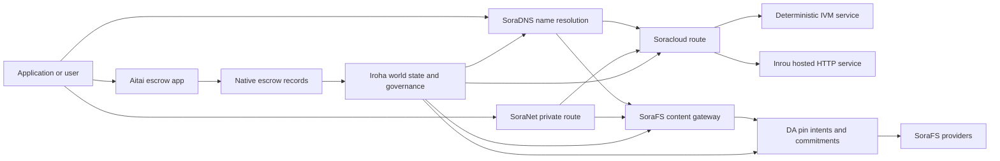

# SORA Nexus الخدمات {#sora-nexus-services}

SORA Nexus يضيف مستويات خدمات واجهة التطبيق حول Iroha 3. هذه الخدمات ليست دفاتر أستاذ بلوكشين منفصلة. إنها مرتبطة بحالة العالم لـ Iroha، والمستندات الفنية لـ Norito، وسجلات الحوكمة، وعائلات المسارات لـ Torii.

التوافر يعتمد على بناء العقدة وملف تعريف الشبكة. استخدم [`/openapi.json`](/ar/reference/torii-endpoints.md#app-and-sora-route-families) لاكتشاف التطبيق المُولَّد API طرق على العقدة الهدف. محلي عام SoraFS CID وتُركب الطرق المعروفة جيدًا خارج ذلك المستند الذي تم إنشاؤه، لذا افحص تلك الطرق مباشرة عند التحقق من عملية النشر.

## خريطة المكونات {#component-map}

|مكوّن|دور|الأسطح الرئيسية|
| ---------------------- | ------------------------------------------------------------------------------------------------------------------------------------------- | ---------------------------------------------------------------------------------------- |
| Soracloud              |نشر التطبيقات، الخدمات المستضافة، الحالة الخاصة للنموذج/وقت التشغيل، والتحكم في دورة حياة الخدمة.| `/v1/soracloud/*`, `/api/*`, `iroha soracloud service ...` |
|إنرو|Soracloud استضاف بيئة تنفيذ البرامج HTTP لمراجعات الخدمة التي تحتاج إلى طائرة HTTP حية.|Soracloud تكوين بيئة تنفيذ البرنامج، إعلانات قدرات المضيف، حالة نسخة بيئة تنفيذ البرنامج|
| SoraNet                |الخصوصية وتراكب النقل للدوائر، حركة المرور عبر التتابع، VPN، جلسات الاتصال، ومسارات البث.|بيانات المسار `/v1/connect/*`، `/v1/vpn/*`، SoraNet|
|توافر البيانات (DA)|أدلة التوافر، وقيمة الالتزام التشفيري، وطبقة نية الرقم السري للبيانات المحمّلة التي تُشير إليها مسارات التنفيذ Nexus، والمستندات الفنية SoraFS، وتدفقات الإثبات.| `/v1/da/*`, `FindDaPinIntent*`, `[nexus.da]`                                             |
| SoraFS                 |نسيج تخزين يعتمد على المحتوى للبيانات التقنية، والحمولات CAR، والمحتوى المثبت، وجلب البوابة، وتدفقات إثبات الاسترجاع.| `/v1/sorafs/*`, `/sorafs/*`, `FindSorafsProviderOwner`                                   |
| SoraDNS                |طبقة التسمية الحتمية والتحقق من المصادقة للمحلل للخدمات والمحتوى المستضاف على SORA.|`/v1/soradns/*`، `/soradns/*`، أحداث دليل المحلل|
|أيتاي|ممر تسوية المعاملات المالية للعملات الورقية والأصول على مستوى التطبيق مدعوم بسجلات الضمان الأصلية، وليس عن طريق دفتر أستاذ سلسلة كتل منفصل.| `OpenAssetEscrow`، `FindAssetEscrow*`، `EscrowEventFilter`، Kotodama `escrow_*` الدوال المدمجة |



## التدفقات الشائعة {#common-flows}

### تطبيق مقسّم مستضاف {#hosted-split-application}

تطبيق الطائرة المختلطة النموذجي يستخدم جميع الأجزاء معًا:

1. يتم تجميع الأصول الثابتة للواجهة الأمامية وتثبيتها عبر SoraFS.
2. المضيف العام، على سبيل المثال `<app>.sora`، مسجل من خلال SoraDNS.
3. Soracloud يوجه `/api/v1/search` أو `/api/v1/stream` إلى خدمة Inrou HTTP.
4. Soracloud يوجه `/api/auth` و `/api/v1/user` إلى معالجات IVM الحتمية.
5. يمكن للعملاء الذين يحتاجون إلى الخصوصية الوصول إلى نفس المحتوى أو مسار API عبر دائرة SoraNet.

|مسار|اللوح الداعم|لماذا|
| ----------------- | --------------------- | ------------------------------------------------- |
| `/`               | SoraFS محتوى ثابت |الجذر والمحتوى القابل لإعادة الإنتاج وتخزين البوابة المؤقت|
|`/assets/*`| SoraFS محتوى ثابت |الأصول الموجهة بالمحتوى وإثباتات المانيفست التقنية|
| `/api/auth*`      | Soracloud IVM         |حالة مصادقة ومواجهة المحفظة الآمنة من إعادة التشغيل|
| `/api/v1/user*` | Soracloud IVM | تغييرات الحالة الحساسة للحوكمة |
| `/api/v1/search*` | Soracloud إنرو |الحالة المباشرة للخدمة HTTP، ذاكرة التخزين المؤقت، SSE، أو المجمع|

### نشر المحتوى {#content-publication}

SoraFS النشر ينتج مصنوعات دائمة قبل أن يشير الاسم إليها:

1. أنشئ حمولة أو دليل.
2. ضعها في أرشيف CAR وخطة التقسيم.
3. بناء بيان تقني Norito مع سياسة الدبوس وبيانات الحوكمة.
4. قدّم البيان الفني إلى Torii.
5. سجّل قيمة الالتزام التشفيري لنوايا أو توفر رقم التعريف الشخصي DA عندما يتطلب الملف الشخصي المستهدف دليلًا صريحًا.
6. اربط البيان الفني باسم SoraDNS أو بمسار واجهة أمامية ثابت Soracloud.

### مسار جلب أو بث خاص {#private-fetch-or-streaming-route}

SoraNet يمكن أن يجلس أمام SoraFS أو Soracloud:

1. يقوم العميل بحل الاسم أو البيان الفني.
2. دليل الحراسة أو بيان المسار الفني يختار مرحلات الدخول والخروج.
3. يتم تعبئة المرور وإرساله عبر الدائرة SoraNet.
4. يصل مرحل الخروج إلى بوابة SoraFS، أو تدفق Torii، أو مسار Soracloud.

## أفتقدك {#aitai}

Aitai هو ممر تطبيق SORA لتسوية المعاملات المالية على نمط السوق حيث يقوم المشتري والبائع بتنسيق دفعة خارج السلسلة أثناء Iroha يتحكم في حفظ الأصول على السلسلة. يجب أن يستخدم مجموعة تعليمات الأمانة الأصلية بدلاً من حساب الأمانة المملوك للعقد لتدفقات حفظ الأصول الرقمية الجديدة.

الضمان الأصلي يحتفظ بالوصاية في سجل البلوكتشين. يقوم البائع بفتح عرض بـ `OpenAssetEscrow`، ويقبل المشتري ويميز الدفع خارج السلسلة بـ `AcceptAssetEscrow` و `MarkEscrowPaymentSent`، ويقوم البائع بالإفراج عن `ReleaseAssetEscrow` أو الإلغاء قبل تأكيد الدفع. إذا اختلف المشتري والبائع، يمكن لأي طرف فتح نزاع ويمكن لمحلل النزاعات مع `CanResolveEscrowDispute` تقسيم المبلغ المحتجز.

للحياة الكاملة للدورة، أقفال الأصول العامة، الضمانات المجهولة، الاستفسارات، الأحداث، وأمثلة Rust، انظر [ضمان الأصل الأصلي](/ar/blockchain/escrow.md).

|سطح آيتاي|استخدمه لـ|
| ------------------------------------------------------------------------------------------------------------------------------------------------------------- | ----------------------------------------------------------------------------------------- |
| `OpenAssetEscrow`, `AcceptAssetEscrow`, `MarkEscrowPaymentSent`, `ReleaseAssetEscrow`, `CancelAssetEscrow`                                                    |عروض الأصول الرقمية الشفافة، بما في ذلك تدفقات تسوية المعاملات المالية المسعرة بـ XOR.|
| `OpenAnonymousAssetEscrow`, `AcceptAnonymousAssetEscrow`, `MarkAnonymousEscrowPaymentSent`, `ReleaseAnonymousAssetEscrow`, `CancelAnonymousAssetEscrow`       |العروض المحمية تستخدم مرفقات الإثبات للتمويل وحركات الإغلاق.|
| `OpenEscrowDispute`، `ResolveEscrowDispute`، `OpenAnonymousEscrowDispute`، `ResolveAnonymousEscrowDispute` |تسجيل النزاع وحلّه بأسلوب المحكمة.|
| `FindAssetEscrowById`، `FindAssetEscrowsBySeller`، `FindAssetEscrowsByBuyer`، `FindAssetEscrowsByStatus` |صفحات حالة التطبيقات، وظائف التسوية، وأدوات الدعم.|
| `EscrowEventFilter` |اشترك في الضمانات الشفافة مباشرة حسب معرف الضمان، البائع، المشتري، الحالة، أو نوع الحدث.|
|Kotodama `escrow_open_offer`، `escrow_accept`، `escrow_mark_payment_sent`، `escrow_release`، `escrow_cancel`، `escrow_open_dispute`، `escrow_resolve_dispute`|استدعاءات العقود Kotodama مدعومة بنظام الحجز V1.|

بالنسبة للاستخدام العام Taira أو Minamoto، اعتبر خط الدفع خارج السلسلة وأي دعم أو سير عمل للمحكمة كسياسة تطبيق. يسجل Iroha حالة الحضانة، أحداث دورة الحياة، تجزئة الأدلة التشفيرية، والحركة النهائية للأصول؛ لا يتحقق من تسوية المعاملات المالية بالعملة الرسمية بمفرده.

## تحقق من العقدة المستهدفة {#check-a-target-node}

قبل استخدام الأمثلة من هذه الصفحة، تأكد من أن عائلة المسار موجودة على العقدة التي تستهدفها:

```bash
export TORII_URL=https://taira.sora.org

curl -fsS "$TORII_URL/openapi.json" \
  | jq '.paths | keys[] | select(test("^/v1/(soracloud|sorafs|soradns|connect|vpn|da)/"))'

curl -fsS -H 'Accept: application/json' "$TORII_URL/status" | jq .
```

`/openapi.json` هو نقطة النهاية الفردية للبروتوكول-المعيار OpenAPI API. تتوقف توفر المسار الدقيق على ميزات البناء وتكوين الشبكة. لا يذكر المستند الطرق المحلية العامة SoraFS CID والمعروفة جيدًا؛ تحقق من تلك النقاط النهائية API مباشرة كما هو موضح أدناه.

### Taira فحوصات الدخان للقراءة فقط {#taira-read-only-smoke-checks}

نقطة النهاية العامة Taira API مفيدة لفحوصات جانب القراءة، ولكن لا تستخدمها لأمثلة التعديل إلا إذا كنت تدير حسابًا موثوقًا وتنوي تغيير حالة الشبكة التجريبية العامة.

```bash
export TORII_URL=https://taira.sora.org

curl -fsS -H 'Accept: application/json' "$TORII_URL/status" \
  | jq '{version: .build.version, peers, blocks, lanes: (.teu_lane_commit | length)}'

curl -fsS "$TORII_URL/v1/vpn/profile" \
  | jq '{available, relay_endpoint, supported_exit_classes}'

curl -fsS "$TORII_URL/v1/sorafs/storage/peers?limit=4" \
  | jq '{gateway_base_url, pin_torii_urls}'

curl -fsS -H 'Accept: application/json' "$TORII_URL/v1/soracloud/status" \
  | jq '.control_plane | {service_count, services: [.services[] | {service_name, current_version}]}'
```

Taira قد يُكشِف عن مسارات لوحة التحكم الخاصة بالنشر التي لم تُدرج في خريطة المسار OpenAPI. اعتبر `/openapi.json` كالعقد الناتج للمسارات التي يحتويها، ثم قم بتأكيد المسارات المخصصة للنشر والمسارات المحلية العامة SoraFS مباشرة قبل توثيقها على أنها متاحة.

## Soracloud {#soracloud}

Soracloud هو مستوى التحكم في تطبيق SORA. يتتبع حزم النشر، ومراجعات الخدمة، والتوجيه، وحالة الطرح، وإدخالات التكوين الرسمية، وأسرار الخدمة المشفرة، وسجلات سجل النماذج، وجلسات الاستدلال الخاصة، وسجلات نتائج بروتوكول بيئة تنفيذ البرمجيات.

Soracloud يستخدم مستويين للتنفيذ:

|مستوى التنفيذ|بيئة تنفيذ البرمجيات|استخدمه لـ|
| ---------------------- | ------- | -------------------------------------------------------------------------------------------- |
| `DeterministicService` |`Ivm`|المصادقة، حالة الخزنة، القراءات المعتمدة، معالجات صندوق البريد المرتبة، الطفرات الحساسة للحكامة|
| `HttpService` | `Inrou` | واجهات HTTP APIs مباشرة، وأعمال كثيفة التجميع، وخدمات مدعومة بذاكرة تخزين مؤقت، وSSE، وتدفقات بمساعدة المتصفح |

لوحة التحكم هي السلطة الموثوقة. أوامر النشر والترقية والتراجع والتكوين والأسرار والطراز والحالة تُقدَّم عبر Torii وتقرأ حالة العالم النهائية؛ فهي لا تعتمد على مرآة محلية منفصلة CLI. التوجيه العام يعتمد على أطول بادئة، لذا يمكن لمضيف مسجل واحد تقسيم حركة المرور بين المسارات المستضافة HTTP والمسارات الحتمية API.

### تم إنشاء هيكل بدء تطبيق مقسم {#scaffold-a-split-app}

قالب التطبيق المقسم ينشئ واجهة أمامية ثابتة بالإضافة إلى خدمة واحدة حية مستضافة API وخدمة واحدة لمخزن/خدمة محددة API:

```bash
iroha soracloud app init \
  --template split-app \
  --app-name solswap_indexer \
  --app-version 0.1.0 \
  --public-host solswap-indexer.sora \
  --output-dir ./apps/solswap-indexer

iroha soracloud app plan \
  --manifest ./apps/solswap-indexer/app_manifest.json

iroha soracloud app doctor \
  --manifest ./apps/solswap-indexer/app_manifest.json
```

`plan` يطبع تقسيم المسار، والبيانات التقنية للخدمة الفرعية، ومسارات سكريبت مساحة العمل، ووضع النشر المتوقع للواجهة الأمامية. `doctor` يتحقق من صحة عقد الإصدار المحلي قبل أن تشرك Torii.

### نشر وفحص حالة التطبيق {#deploy-and-inspect-app-state}

إعادة استخدام حقبة الاحتفاظ بمستقبل واحد SoraFS لكل إعادة محاولة للإصدار. نظرًا لأن قالب التطبيق المقسم يحتوي على خدمة Inrou، قم بتحديد الأداة الدقيقة الخاصة بها في مخازن المزودين غير المتصلين المحددة قبل التغيير عبر الإنترنت:

```bash
export SORACLOUD_TORII_URL=https://<soracloud-enabled-torii>
export SORAFS_RETENTION_EPOCH=<future-unix-seconds>

iroha soracloud app preseed \
  --manifest ./apps/solswap-indexer/app_manifest.json \
  --sorafs-retention-epoch "$SORAFS_RETENTION_EPOCH" \
  --inrou-preseed-target <validator-account,peer-id,absolute-store-path> \
  --inrou-preseed-max-capacity-bytes <bytes> \
  --inrou-preseed-helper /absolute/path/to/sorafs-node \
  --inrou-preseed-helper-sha256 <lowercase-sha256> \
  --receipt-out /absolute/path/to/solswap-inrou-preseed.json

iroha soracloud app release \
  --manifest ./apps/solswap-indexer/app_manifest.json \
  --sorafs-retention-epoch "$SORAFS_RETENTION_EPOCH" \
  --inrou-preseed-receipt /absolute/path/to/solswap-inrou-preseed.json \
  --torii-url "$SORACLOUD_TORII_URL"

iroha soracloud app status \
  --manifest ./apps/solswap-indexer/app_manifest.json \
  --torii-url "$SORACLOUD_TORII_URL"
```

كرر `--inrou-preseed-target` لكل متجر مزود مطلوب حسب سياسة النشر. `release` يبني ويزامن البيانات الفنية، ويشغل فاحص التطبيقات، يقدّم تحوّلاً واحدًا للبنية التحتية للتطبيق وفقًا لمعايير البروتوكول، ويقوم بمصالحة الحالة الموثوقة، ويحقق في الأهداف المعلنة الحية. سجل نتيجة بروتوكول ما قبل التهيئة ليس اختياريًا عندما يحتوي التطبيق على تحف Inrou.

بالنسبة لخدمة تم نشرها بالفعل، استخدم الأوامر المقتصرة على الخدمة:

```bash
iroha soracloud service status \
  --service-name solswap_indexer_live \
  --torii-url "$SORACLOUD_TORII_URL"

iroha soracloud service rollback \
  --service-name solswap_indexer_live \
  --target-version 0.1.0 \
  --torii-url "$SORACLOUD_TORII_URL"
```

### المواد التكوينية والسرية {#config-and-secret-material}

Soracloud تعتبر إدخالات التكوين والسر جزءًا من حالة النشر الموثوقة. يفشل النشر والترقية والاسترجاع بشكل مغلق عند عدم توافر التكوين المطلوب أو ربط الأسرار، أو عند عدم اتساقها مع البيانات التقنية النشطة.

```bash
iroha soracloud service config-set \
  --service-name solswap_indexer_live \
  --config-name indexer/public_config \
  --value-file ./config/public-config.json \
  --torii-url "$SORACLOUD_TORII_URL"

iroha soracloud service secret-set \
  --service-name solswap_indexer_live \
  --secret-name indexer/api_key \
  --secret-file ./secrets/api-key.envelope.json \
  --torii-url "$SORACLOUD_TORII_URL"
```

استخدم مساعدة CLI لمعرفة علامات الاعتماد الدقيقة المطلوبة من قبل ملفك الشخصي:

```bash
iroha soracloud service config-set --help
iroha soracloud service secret-set --help
```

## إنرو {#inrou}

إنرو هو بيئة تنفيذ البرمجيات المستضافة HTTP المستخدمة بواسطة Soracloud. عقدة Iroha مع بيئة تنفيذ البرمجيات المدمجة Soracloud تقوم بإدخال مشاريع Soracloud تحويل الحالة إلى خطة تفعيل محلية، يبدأ النسخ المستضافة للخدمة المعينة كخدمات حلقة عكسية، ويبلغ عن حالة بيئة تنفيذ برنامج النسخة مرة أخرى إلى النموذج الرسمي.

استخدم Inrou للأعباء التي تحتاج إلى سطح HTTP مباشر، مثل تدفقات APIs و SSE الثقيلة على المجمع، أو المتعاملين المدعومين بالكاش، أو الخدمات المدعومة بالمتصفح.

### متطلبات بيئة تنفيذ البرمجيات {#runtime-requirements}

- يجب أن يكون بيئة تنفيذ برنامج الجرد الفني للحاوية `Inrou`.
- يجب أن تكون طائرة تنفيذ مظهر الخدمة التقنية `HttpService`.
- `HttpService + Inrou` يتطلب بالضبط `PersistentRootLeaseVolume` واحد مركب في `/`.
- تحتاج خدمات Inrou المكررة أيضًا إلى خدمة مشتركة أو تخزين إيجار سري عندما تحتفظ بحالة مشتركة قابلة للتغيير.
- ينبغي لعقد الاستضافة الإنتاجية الإعلان عن السعة الحقيقية لـ Inrou بدلاً من العمل فقط كوكيل.

### مخطط تقني جزء {#manifest-fragment}

يوضح المثال أدناه شكل البيانين الفنيين. إنه جزء، وليس حزمة نشر كاملة.

```jsonc
// container_manifest.json
{
  "schema_version": 1,
  "runtime": { "runtime": "Inrou", "value": null },
  "bundle_path": "/bundles/solswap-indexer.inrou",
  "entrypoint": "/app/bin/launch-indexer.sh",
  "args": [],
  "env": {
    "RUST_LOG": "info",
  },
  "inrou": {
    "schema_version": 1,
    "guest_os": { "guest_os": "DebianSlim", "value": null },
    "guest_images": {
      "x86_64": {
        "kernel_image_path": "/inrou/x86_64/vmlinux",
        "rootfs_image_path": "/inrou/x86_64/rootfs.ext4",
        "initrd_image_path": null,
      },
      "aarch64": {
        "kernel_image_path": "/inrou/aarch64/vmlinux",
        "rootfs_image_path": "/inrou/aarch64/rootfs.ext4",
        "initrd_image_path": null,
      },
    },
  },
  "lifecycle": {
    "start_grace_secs": 60,
    "stop_grace_secs": 30,
    "healthcheck_path": "/api/indexer/v1/health",
  },
}
```

```jsonc
// service_manifest.json
{
  "schema_version": 1,
  "service_name": "solswap_indexer_live",
  "service_version": "0.1.0",
  "execution_plane": { "execution_plane": "HttpService", "value": null },
  "replicas": 2,
  "route": {
    "host": "solswap-indexer.sora",
    "path_prefix": "/api/v1/search",
    "service_port": 8080,
    "visibility": { "visibility": "Public", "value": null },
    "tls_mode": { "tls": "Required", "value": null },
  },
  "lease_volumes": [
    {
      "volume_name": "root_disk",
      "kind": {
        "lease_volume": "PersistentRootLeaseVolume",
        "value": null,
      },
      "storage_class": { "storage_class": "Warm", "value": null },
      "mount_path": "/",
      "max_total_bytes": 8589934592,
    },
    {
      "volume_name": "index_state",
      "kind": { "lease_volume": "ServiceLeaseVolume", "value": null },
      "storage_class": { "storage_class": "Warm", "value": null },
      "mount_path": "/var/lib/solswap-indexer",
      "max_total_bytes": 1073741824,
    },
  ],
}
```

في بيئة تنفيذ البرمجيات، يتم عرض كل وحدة إيجار مركبة من خلال متغيرات البيئة المستمدة من اسم الوحدة:

```text
SORACLOUD_LEASE_VOLUME_ROOT_DISK_DIR
SORACLOUD_LEASE_VOLUME_ROOT_DISK_MOUNT_PATH
SORACLOUD_LEASE_VOLUME_INDEX_STATE_DIR
SORACLOUD_LEASE_VOLUME_INDEX_STATE_MOUNT_PATH
```

## SoraNet {#soranet}

SoraNet هو طبقة الخصوصية والنقل. إنه يوفر مسارات قائمة على الترحيل لحركة المرور التي لا ينبغي أن تتصل مباشرة بالبوابة أو الخدمة المستهدفة. يستخدم تصميم النقل أدوار الترحيل للمدخل والمنتصف والمخرج، ونقل QUIC، والمصافحة الهجينة القائمة على الضوضاء، والتفاوض على القدرات، وبيانات تعريف دليل الترحيل، والخلايا المحشوة ذات الحجم الثابت.

في نشرات Nexus، يمكن لـ SoraNet حمل استدعاءات المحتوى، حركة مرور البوابة، VPN أو جلسات Connect، ومسارات البث Norito. يمكن لإدخالات الدليل تحديد المرحلات التي تدعم `norito-stream`، مما يسمح للعملاء بتفضيل المسارات المناسبة لـ Torii RPC أو حركة مرور البث.

### إعدادات البث {#streaming-configuration}

ملف التعريف Nexus يتيح توفير SoraNet لمسارات البث:

```toml
[streaming]
feature_bits = 0b11

[streaming.soranet]
enabled = true
exit_multiaddr = "/dns/torii/udp/9443/quic"
padding_budget_ms = 25
access_kind = "authenticated"
provision_spool_dir = "./storage/streaming/soranet_routes"
provision_spool_max_bytes = 0
provision_window_segments = 4
provision_queue_capacity = 256
```

استخدم `access_kind = "read-only"` لمسارات المحتوى التي لا تتطلب مصادقة المشاهد. استخدم `authenticated` عندما يجب على مرحل الخروج فرض التذاكر أو هوية المشاهد قبل الربط إلى Torii أو خدمة مستضافة.

### SoraNet-واعي SoraFS جلب {#soranet-aware-sorafs-fetch}

يمكن لـ SoraFS جلب CLI إصدار بيان تقني وكيل محلي وتجميع SoraNet بيانات مسار لامتدادات المتصفح أو SDK محولات. يجب على المنسق JSON تعريف `local_proxy` باستخدام `"emit_browser_manifest": true`، ويجب بناء CLI بدعم `local-quic-proxy`. في Taira، افحص كتالوج المزود المعتمد في جذر شبكة الاختبار العامة، ثم املأ مجموعة المزود المحمي الصادرة لذلك المزود:

```bash
export TAIRA_ROOT=https://taira.sora.org
curl -fsS "$TAIRA_ROOT/v1/sorafs/providers?limit=20" | jq '.providers'

: "${TAIRA_SORAFS_PROVIDER_ID:?set the admitted provider ID from Taira discovery}"
: "${TAIRA_SORAFS_GATEWAY_KEY:?set the provider gateway key}"
: "${TAIRA_SORAFS_PROVIDER_URL:?set the advertised provider base URL}"
: "${TAIRA_SORAFS_STREAM_TOKEN_FILE:?set the issued stream-token file}"

cargo run -p sorafs_orchestrator --features=local-quic-proxy --bin=sorafs_cli -- \
  fetch \
  --plan=artifacts/payload_plan.json \
  --manifest-id=<manifest-digest-hex> \
  --orchestrator-config=artifacts/orchestrator.json \
  --provider=name=taira,provider-id="$TAIRA_SORAFS_PROVIDER_ID",gateway-key="$TAIRA_SORAFS_GATEWAY_KEY",base-url="$TAIRA_SORAFS_PROVIDER_URL",stream-token="$(cat "$TAIRA_SORAFS_STREAM_TOKEN_FILE")" \
  --output=artifacts/payload.bin \
  --json-out=artifacts/fetch_summary.json \
  --local-proxy-manifest-out=artifacts/proxy_manifest.json \
  --local-proxy-mode=bridge \
  --local-proxy-norito-spool=storage/streaming/soranet_routes \
  --local-proxy-kaigi-spool=storage/streaming/soranet_routes \
  --local-proxy-kaigi-policy=authenticated \
  --max-peers=2 \
  --retry-budget=4
```

يُقدّم مُزوّد سجلات الملخص التقارير، سجلات نتائج بروتوكول الأجزاء، بيانات وصفية لبروكسي محلي، وإعدادات المسار الفعّالة المستخدمة للاسترجاع.

### قائمة محقق حوافز الترحيل {#relay-incentive-verifier-roster}

يُغلق إدخال حافز الترحيل عند الفشل. عندما يكون `incentives.enable` صحيحًا، يجب أن يحتوي `incentives.trusted_verifier_ids` على معرف حساب واحد على الأقل وفقًا لمعيار البروتوكول. يجب ألا يتجاوز القيد 64 أبدًا. الإدخالات، حتى عندما تكون الحوافز معطلة. يقوم بيئة تنفيذ البرنامج بتخزينها كمجموعة مرتبة حتمية، ويرفض الهندسة غير الصحيحة للقائمة أثناء بدء التشغيل الوسيط.

يتم فك تشفير كل `RelayBandwidthProofV1` تحت ميزانية إطار/تخصيص ثابتة ويجب أن يستهلك الإطار بالكامل. يجب أن يكون حساب مدقق الإثبات موجودًا في القائمة المكوَّنة، ويجب أن ينجح `RelayBandwidthProofV1::verify_signature()`، قبل أن يقوم المرحِّل بالقفل أو بتغيير مجمع الأداء الخاص به. لذلك، فإن الموقّع التشفيري غير الموثوق أو الدليل الذي يحتوي على توقيع غير صالح/تم التلاعب به لا يساهم في أي قياس ولا يمكنه إنتاج لقطة للحافز.

## توافر البيانات (DA) {#data-availability-da}

DA هو طبقة دليل التوفر للحِمول التي تكون كبيرة جدًا أو حساسة جدًا للخصوصية أو محددة جدًا للخدمة بحيث لا يمكن وضعها مباشرة في حالة العالم. يقوم بتسجيل قيم الالتزام التشفيري الحتمية والالتزامات المتعلقة بالاسترجاع بحيث يمكن للمحققين، والبوابات، والعملاء الاتفاق على البايتات التي تم الوعد بها، وأي سياسة تنطبق، وأي دليل تم ملاحظته.

DA لا يحل محل Kura أو SoraFS:

- Kura يخزن تدفق الكتل النهائي وبيانات استعادة التوافق.
- SoraFS يخزن ويقدّم البايتات المعتمدة على المحتوى، و CAR الحمولات، والمخططات التقنية.
- DA يسجل قيم الالتزام التشفيري، سياسات الإثبات، فتحات الإثبات، ونوايا الرموز التعريفية التي تسمح بجدولة تلك البايتات، تدقيقها، وربطها مرة أخرى بحالة دفتر أستاذ البلوكشين.

استخدم DA عندما يحتاج التطبيق أو مسار تنفيذ Nexus إلى وعد مرئي في دفتر سلسلة الكتل بأن البيانات خارج السلسلة ستظل قابلة للاسترجاع. تشمل الأمثلة الشائعة قيم الالتزام التشفيري لحمولة مسار التنفيذ لتدفقات تسوية المعاملات المالية، ونوايا PIN SoraFS للمحتوى المنشور، حزم الإثبات التي يجب الاحتفاظ بها للتحقق لاحقًا، والرموز التطبيقية التي يجب أن تكون حالتها العامة عبارة عن قيمة ملخص تشفيرية بدلاً من الحمولة الكاملة.

### دورة الحياة {#lifecycle}

|مرحلة|ما هو مسجل|
| ---------- | ----------------------------------------------------------------------------------------------------------------------------------------------------- |
|نية|تذكرة، مرجع البيان الفني، الاسم المستعار، مرجع المسار/العصر/التسلسل، سياسة الاحتفاظ، أو هدف النسخ المتماثل.|
| الالتزام | مادة ملخّص تربط البيان أو حمولة مسار التنفيذ أو حزمة الإثبات أو جذر المحتوى بالسجل الظاهر في دفتر الأستاذ. |
|دليل|تصويتات التوافر، وفتح الدليل، وشهادات المزود، أو أي أدلة أخرى محددة بالملف الشخصي يتم قبولها من قبل الشبكة المستهدفة.|
|استعلام|عمليات البحث عن نية الدبوس من خلال `FindDaPinIntentByTicket`، `FindDaPinIntentByManifest`، `FindDaPinIntentByAlias`، أو `FindDaPinIntentByLaneEpochSequence`.|

تدفق النشر النموذجي المدعوم من DA هو:

1. قم بإنشاء الحمولة أو استلامها خارج WSV، على سبيل المثال ملف SoraFS CAR أو حمولة مسار تنفيذ Nexus.
2. هاش تشفيري ووصف الحمولة في سجل مانيبست تقني Norito أو سجل قيمة الالتزام التشفيري الخاص بالمسار.
3. قدّم البيان الفني أو نية التثبيت أو قيمة الالتزام التشفيري من خلال `/v1/da/*` عندما يكون ذلك النوع من المسار مفعّلاً، أو من خلال مسار المعاملة الموقّعة للشبكة.
4. دع المدققين أو موفري التوافر يجمعون الأدلة المطلوبة وفقًا لسياسة الإثبات النشطة.
5. استعلم عن نية الرقم السري الناتج أو قيمة الالتزام التشفيري قبل ترقية الاسم المستعار، أو إثبات تسوية المعاملة المالية، أو مسار البوابة الذي يعتمد على الحمولة.

### النموذج الخوارزمي {#algorithmic-model}

DA يحول الحمولة إلى قيمة التزام تشفيرية موقعة ومحمية من الإعادة ومرتبة حسب الكتل. الخوارزميات المهمة هي خوارزميات حتمية بحيث يمكن للمحققين والبوابات إعادة حساب نفس الملخصات التشفيرية من نفس البايتات.

1. قم بتوحيد الحمولة المقدمة. Torii يقبل طلب الإدخال مع `(lane_id, epoch, sequence)`، بايتات الحمولة، بيانات ضغط، حجم الجزء، ملف محو، سياسة الاحتفاظ، وتوقيع المقدم. يقوم العقد بفك ضغط حمولات gzip أو deflate أو Zstandard عند الطلب، ثم يتحقق من أن طول البايت الواحد حسب معيار البروتوكول يساوي `total_size`.
2. تحقق من صحة معلمات مسار التنفيذ والكتلة. يجب أن يكون مسار التنفيذ موجودًا في كتالوج مسار التنفيذ Nexus. يجب أن يكون `chunk_size` قوة غير صفرية للعدد اثنين، لا تقل عن بايتين. ولا يزيد عن الحد الأقصى المكون. يجب أن يتضمن ملف المسح شظايا البيانات وشظيتين على الأقل من التحقق. يحدد دليل مسار التنفيذ مخطط الإثبات، إما `merkle_sha256` أو `kzg_bls12_381`.
3. تطبيق سياسة الشبكة. يقوم العقدة بفرض خط الأساس المخصص للتكرار والاحتفاظ لفئة البلوبي. يجب أن تظل بيانات التعريف العامة بنص واضح؛ أما بيانات التعريف الخاصة بالحكومة فقط فَتُشفَر باستخدام مفتاح بيانات التعريف الحكومي المُكوَّن في العقدة قبل كتابتها في المانيفست الفني.
4. تجزئة وإتمام البروتوكول. يتم تجزئة الحمولة الموحدة وفق معيار البروتوكول باستخدام ملف تعريف بحجم ثابت مشتق من `chunk_size`. Torii يحسب قيمة ملخص التشفير للحمولة، وجذر شجرة إثبات الاسترجاع، وقيم الالتزام التشفيري لكل قطعة. تحمل قطع البيانات BLAKE3 قيم الالتزام التشفيري عبر بايتاتها.
5. أضف قيم الالتزام التشفيري للإزالة. تُجمَع الأجزاء في شرائط من `data_shards`. يتم حشو الخلايا المفقودة في الشريط النهائي بالأصفار لحساب التكافؤ. RS(16) التكافؤ يُنشئ شظايا تكافؤ صفية/عالمية؛ `row_parity_stripes` اختياري يضيف تكافؤًا بنمط العمود عبر المصفوفة. قيم التزام شظايا التكافؤ المشفر هي BLAKE3 ملخصات مشفرة لرموز `u16` بالصيغة الصغرى-الأنديان.
6. بناء البيان الفني. يسجل `DaManifestV1` مسار التنفيذ، العهدة، فئة الكتلة، الترميز، قيمة الملخص التشفيري للحمل، جذر الكتلة، حجم الكتلة، ملف تعريف المسح، سياسة الاحتفاظ، عرض الإيجار، قيم الالتزام التشفيري للكتلة، وقيمة الالتزام التشفيري الاختيارية لـ IPA، البيانات الوصفية ووقت الإصدار. تذكرة التخزين حتمية: يقوم العقد أولاً بعمل تجزئة تشفيرية لنموذج البيان الفني مع تذكرة فارغة، ثم يكتب تلك البصمة مرة أخرى كتذكرة نهائية `storage_ticket`.
7. رفض تعارضات الإعادة. مفتاح الإعادة هو `(lane_id, epoch, sequence, manifest_fingerprint)`. النسخة المكررة التي لها نفس البصمة هي متكافئة. يتم رفض التسلسل القديم أو نفس التسلسل ببصمة مختلفة.
8. **إصدار العناصر الموقعة.** يحسب Torii التزام PDP، ويوقّع `DaIngestReceipt`، ويبني `DaCommitmentRecord`، ويكتب عناصر قائمة الانتظار الخاصة بالبيان، والتزام PDP، وسجل الالتزام، وجدول الالتزام، ونية التثبيت، وملف الإيصال، وسجل الإيصالات. يتقدم مؤشر الإيصال تصاعديًا لكل `(lane_id, epoch)`.

سجلات قيمة الالتزام التشفيري هي ما تحمله الكتل. السجل يربط:

- مسار التنفيذ، الحقبة، والتسلسل
- معرّف كتلة المتصل وتجزئة التوقيع الفني المعياري للبروتوكول الفردي
- مخطط إثبات خط التنفيذ
- جذر القطعة
- قيمة الالتزام التشفيري الاختيارية KZG لمسارات التنفيذ KZG
- PDP/إثبات قيمة ملخص التشفير
- فئة الاحتفاظ وتذكرة التخزين
- Torii DA توقيع الاستلام

قبل أن يقوم البلوك بتضمين سجلات DA، يتحقق مسار تجميع البلوك من صحة الحزمة:

- `(lane_id, epoch, sequence)` يجب أن يكون فريدًا داخل الحزمة.
- يجب أن تكون التجزئات التشفيرية في البيان الفني غير صفرية وفريدة داخل الحزمة.
- يجب أن تتوافق مخطط إثبات قيمة الالتزام التشفيرية مع سياسة مسار التنفيذ المكونة.
- تقوم مسارات تنفيذ Merkle برفض قيم الالتزام التشفيري KZG؛ تتطلب مسارات التنفيذ KZG قيمة التزام تشفيرية غير صفرية KZG.
- يتم توحيد نوايا الدبوس، وفرزها، وتصفيتها حسب مسار التنفيذ، والهاش التشفيري للبيان الفني، وتذكرة التخزين، وحساب المالك، وقواعد تصادم الأسماء المستعارة.

يخزن رأس الكتلة التجزئات التشفيرية لسياسات الإثبات DA وقيم الالتزام التشفيري ونوايا التثبيت. بالنسبة لإثباتات العضوية، تكشف حزمة قيم الالتزام التشفيري أيضًا عن جذر ميركل الذي تكون أوراقه عبارة عن تجزئات تشفيرية لبروتوكول قياسي واحد قيم Norito-المشفرة `DaCommitmentRecord`. تقوم العقد الأصلية بعمل تجزئة تشفيرية لدمج الأبناء الأيسر والأيمن؛ ويتم ترقية الورقة الفردية دون تغيير إلى الطبقة التالية.

### التحقق من الإثبات {#proof-verification}

`/v1/da/commitments/prove` يمكنه إنتاج إثبات لقيمة التزام تشفيرية واحدة في كتلة. يحتوي الإثبات على قيمة الالتزام التشفيري، وارتفاع الكتلة، والفهرس في الحزمة، وهاش التشفير للحزمة، وطول الحزمة، وجذر ميركل، ومسار الأخ. التحقق يشمل:

1. تتطابق قيمة التجزئة التشفيرية لحزمة الإثبات مع التجزئة التشفيرية لرأس الكتلة DA للقيمة المرتبطة.
2. ارتفاع كتلة الإثبات يطابق رأس الكتلة المشار إليه.
3. المؤشر ضمن الحدود وقيمة الالتزام التشفيري تساوي مدخل الحزمة عند ذلك المؤشر.
4. سياسة إثبات مسار التنفيذ تقبل قيمة الالتزام التشفيري.
5. طي مسار الأشقاء من قيمة الالتزام التشفيرية للورقة يعيد بناء الجذر المقدم.
6. الجذر المعاد بناؤه يساوي جذر الحزمة.

هذا يثبت أن قيمة التزام تشفيرية محددة كانت مضمنة في حمولة كتلة محددة؛ لكنه لا يثبت أن كل نسخة متاحة حالياً على الإنترنت. يتم التحقق من قابلية الاسترجاع المباشرة بشكل منفصل من خلال استرجاعات المزود SoraFS، وفحوصات PDP/PoTR، أو أدلة التوافر الخاصة بالبروفايل.

### التفاعل التوافقي {#consensus-interaction}

توافر حمولة الإجماع إلزامي، لكنه ليس بروتوكولًا للنهائية الثانية. يقوم القائد ببث `PayloadManifest` موقع إلى كامل لجنة `3f + 1`. يستهدف الجسم الأول وظهور كتلة RS16 المجموعة أ، والتي تشمل أعضاؤها `2f + 1` القائد وذيل الوكيل. إعادة الإرسال في نفس العرض المحدود توسع خدمة الجسم والكتلة لتشمل اللجنة بأكملها.

البيان الفني أو مجموعة الشظايا الجزئية غير كافية للتصويت. قبل مرحلة الإعداد، يجب على كل مدقق التحقق من القطع، وإعادة بناء الجسم الكامل وفقًا لمعيار البروتوكول الواحد. تحقق من طوله وجذر الجزء والهاش التشفيري للجسم، احتفظ بذلك الجسم، وأنهِ التحقق الحتمي من البلوك. يحتفظ المدقق بالجسم نفسه من خلال تطبيق CommitQC أو الاسترداد المعتمد.

عندما يتعلم نظير الشبكة شهادة قبل أن يحصل على الجسم، فإنه يطلب أولاً أجزاء مصدقة أو الجسم الموحد حسب بروتوكول المعيار من الموقعين التشفيريين للشهادة، ثم يوسع الاسترداد إلى اللجنة المجمدة. يبقى كل رد مرتبطًا تمامًا بسياق الارتفاع الدقيق، جولة الاقتراح، البيان الفني، وموضوع الجسم. يتم تطبيق الكتلة فقط بعد أن يتطابق الجسم المعاد بناؤه محليًا مع الشهادة.

### ملاحظات المشغل {#operator-notes}

Iroha 3 تشمل ملفات تعريف الإجماع دائمًا البيان الفني الموقع و RS16 نشر الحمولة، والتحقق من الصحة الكامل قبل التحضير، و DA التحقق من صحة الحزمة، وقياس الاسترداد المقيد. تم تجميد حدود التخطيط والبروتوكول داخل سياق الارتفاع الموقع؛ لا يوجد تبديل محلي أو ملف تعريف مهلة يمكنه تعطيلها أو إعادة تعريفها. لا تزال حدود الكتلة والطابور الخاصة بالعقدة المحلية بحاجة إلى التوافق مع التخطيط الموقع وعبء العمل الخاص بالنشر.

لاكتشاف الطريق، ابدأ بوثيقة العقدة OpenAPI:

```bash
curl -fsS "$TORII_URL/openapi.json" \
  | jq '.paths | keys[] | select(startswith("/v1/da/"))'
```

استخدم [مرجع الاستعلام](/ar/reference/queries.md#nexus-data-availability-and-packages) لأسماء الاستعلامات الحالية DA، و [نموذج تكوين نظير الشبكة](/ar/reference/peer-config/) لمستوى التطبيق `[nexus.da]` في الاستيعاب، والعينة، والتدقيق، وحدود الاسترداد بالإضافة إلى حدود الكتل والطابور المحلي Sumeragi.

## SoraFS {#sorafs}

SoraFS هو البنية التخزينية اللامركزية المعتمدة على عنوان المحتوى. يقوم بتغليف البايتات في قطع حاسوبية محددة، وأرشيفات CAR، وبيانات فنية Norito تربط جذور المحتوى، وملفات تعريف التقسيم، وسياسات التثبيت، وشهادات الحوكمة. يقوم مقدمو خدمات التخزين بالإعلان عن السعة وتوافر المحتوى، بينما تتحقق البوابات من قوائم المراجعة التقنية وقيم الالتزام التشفيري للقطع قبل تقديم المحتوى.

نموذجي SoraFS تشمل الاستخدامات الأصول الثابتة للتطبيق، وبناءات الوثائق، والمنطقة الحزم، أو المراجع الخاصة بالنموذج أو الأثر، وحزم الأدلة الخاصة بالحكم. Iroha نموذج البيانات يكشف SoraFS أحداث البوابة و [`FindSorafsProviderOwner`](/ar/reference/queries.md#nexus-data-availability-and-packages) الاستعلام عن حل ملكية المزود.

### Taira ملف تعريف الشبكة التجريبية {#taira-testnet-profile}

Taira هو شبكة اختبار عامة واحدة وفقًا للبروتوكول القياسي SoraFS. يستخدم ملف تعريف المدقق المثبت فيها السلسلة `fc56984b-2be7-431d-840e-21514d1883f0` والتفريق السلسلي `369`. إن `NetworkId` أدناه هو الهوية الدقيقة للسلسلة الجينية Taira المثبتة حاليًا. يمكن لإعادة ضبط Taira تغيير تلك القيمة التجزيئية التشفيرية مع الاحتفاظ بتسمية السلسلة، لذا قم بتحديثها من ملف النشر الموقع الحالي ولا تستخرجها أبدًا من السلسلة UUID. إعدادات Taira الفعّالة SoraFS هي:

- معرّف الشبكة: `hash:82531CE8EAE8BFF6BEECA4698BFD13A3BC8BEC5F0EE0D23D428C97FC17AB0F3B#3E94`
- قاعدة البوابة URL: `https://taira.sora.org`
- دبوس Torii URLs: `https://taira-validator-1.sora.org` إلى `https://taira-validator-4.sora.org`
- قدرات الاكتشاف: `torii_gateway`، `chunk_range_fetch`، و`potr_mldsa`
- أصل المحتوى المعزول: `https://{cid}.sorafs.taira.sora.org/{path}`
- سياسة التثبيت العامة: بدون إذن ومرتبة برسوم، مع `require_council_signatures = false`

```toml
[sorafs.storage]
enabled = false
max_capacity_bytes = 13743895347

[sorafs.discovery]
discovery_enabled = true
known_capabilities = ["torii_gateway", "chunk_range_fetch", "potr_mldsa"]

[sorafs.discovery.admission]
envelopes_dir = "configs/soranexus/taira/sorafs_admission"
trusted_council_keys = ["REPLACE_WITH_TAIRA_SORAFS_COUNCIL_PUBLIC_KEY"]
signature_threshold = "REPLACE_WITH_TAIRA_SORAFS_COUNCIL_SIGNATURE_THRESHOLD"

[sorafs.discovery.publish]
gateway_base_url = "https://taira.sora.org"
pin_torii_urls = [
  "https://taira-validator-1.sora.org",
  "https://taira-validator-2.sora.org",
  "https://taira-validator-3.sora.org",
  "https://taira-validator-4.sora.org",
]

[sorafs.gateway]
require_manifest_envelope = true
enforce_admission = true
enforce_capabilities = true

[sorafs.gateway.untrusted_hosting]
enabled = true
path_gateway_redirect = true
redirect_html_only = true

[sorafs.gateway.untrusted_hosting.cid_host_suffixes]
live = "sorafs.sora.org"
taira = "sorafs.taira.sora.org"

[sorafs.repair]
enabled = false
claim_ttl_secs = 900
heartbeat_interval_secs = 60
max_attempts = 3
worker_concurrency = 4

[sorafs.gc]
enabled = false
interval_secs = 900
max_deletions_per_run = 500
retention_grace_secs = 86400

[gov.sorafs_pin_policy]
require_council_signatures = false
```

القيم الثلاثة العليا للبوابة هي قيم افتراضية موروثة تغلق عند الفشل؛ جميع القيم الأخرى في المقتطف واضحة وصريحة في ملف التعريف المدخل لفحص Taira. يجب على المشغل استبدال عناصر نائبة الاكتشاف والقبول بمواد النشر الموقعة. يجب أن يحمل كل طلب مُقدَّم حاوية بيانات البيان الفني، ويجتاز قبول الموفر، ويستخدم قدرة معلنة.

لدى المصادقين Taira تخزين SoraFS مضمن، وإصلاح، وجمع النفايات معطلة. تظل سعة التكوين الخاصة بهم جزءًا من المصادق فحص ميزانية القرص؛ هذا لا يعني أن المصادِق هو مزود تخزين. استخدم `GET /v1/sorafs/storage/peers?limit=4` لقراءة البوابة والت destinations المثبتة المهيأة حاليًا قبل الاختبار.

يقبل تكوين مخطط Taira كل من مفاتيح لاحقة CID-المستضيف لـ `live` و `taira`. يجب أن تستخدم مستندات الاختبار العام الفني، وفحوصات الأصل، واختبارات المتصفح `sorafs.taira.sora.org` بحيث يكون مصدرها مرتبطًا بشكل واضح بـ Taira. لا تعامل المفتاح المقبول `live` كتوصية لنشر محتوى الشبكة الاختبارية تحت أصل يبدو وكأنه بيئة إنتاجية. يجب على النشرات الأخرى استخدام هويتها الشبكية الخاصة، ومفاتيح الإدارة، ومواد قبول المزود، ونقاط النهاية المثبتة API، وسياسة السعة/الإصلاح الخاصة بها.

### البوابات المحلية العامة CID وبوابات الموقع {#public-local-cid-and-site-gateways}

كل عقدة Torii الممكّنة بـ SoraFS تقوم بتركيب هذه المسارات العامة المجهولة حتى عندما لا يتم بناء التطبيق الاختياري API:

|الطريقة ونقطة النهاية API|الغرض|
| ---------------------------------- | -------------------------------------------------------------------- |
| `GET /.well-known/sorafs/manifest` |إرجاع البيان الفني الذي تم تحديده بواسطة مضيف طلب معيار البروتوكول الفردي|
| `GET /v1/sorafs/cid/{cid}`         |إرجاع بيانات وصفية وملفات محلية فنية محدودة للعنصر CID|
| `GET /sorafs/cid/{cid}`            |خدِم المستند الجذري لموقع واحد يتم الوصول إليه محليًا بواسطة المحتوى|
|`GET /sorafs/cid/{cid}/{*path}`|خدمة مسار واحد مُطَبَّع، أو نطاق بايت واحد محدود، تحت ذلك CID|

هذه المسارات لا تقبل أبدًا `x-sorafs-stream-token` أو `x-sorafs-token-id`. وجود أي من الرأسين يُعتبر طلبًا سيئًا. هناك بالفعل بيان فني قياسي واحد للبروتوكول موجود في المصدر المحلي الموثوق للعقدة المخزن هو القدرة العامة على القراءة؛ عدم وجود البيانات في الكاش لا يخول ترطيب الموفر البعيد. يظل الموفر المحمي CAR ومسارات القطع أسطح بروتوكول مصادقة منفصلة.

قبل قراءة البايتات، يقوم Torii بالتحقق من الترميز المعياري للبروتوكول الوحيد في البيان الفني المحلي، والقيود الدلالية، وقيمة الملخص التشفيري، والجذر CID. ثم يتطلب ذلك هوية المزود المحلي المخول، قبول الحوكمة، والامتثال المُدار للبيان الفني، CID، والمزود. سياسة معدل/حظر البوابة تستخدم عنوان العميل الفعّال، مع احترام العناوين المحوّلة فقط عبر الوكلاء الموثوقين المُكوَّنين. الفشل في السياسة أو الامتثال أو الهوية أو حالة القبول يؤدي إلى الإغلاق.

يحتوي طلب واحد على تصريح بوابة عامة من البداية إلى النهاية؛ الحد الأقصى للعملية بأكملها هو 64 قراءة متزامنة، مع إعادة الطلبات الزائدة `503 Service Unavailable` و `Retry-After: 1`. الاستجابات التقنية للبيان محددة بـ 16 MiB، وقوائم الملفات افتراضيًا تحتوي على 50 إدخالًا وتعيد بحد أقصى 500، ونطاق ملف كامل أو نطاق بايت واحد محدود بـ 8 MiB. يعتمد تحليل الاستعلام على البنية. نسخة الشحن `app_api` تقبل قيمة 32-بت غير موقعة مفككة `limit`، وتتجاهل مفاتيح الاستعلام الأخرى، وتسمح لآخر تكرار لـ `limit` بالفوز، وتحدد القيمة ضمن `1..=500`. بِناء بميزات قليلة بدون `app_api` يقبل فقط زوجًا واحدًا من `limit=1..500` وفقًا للبروتوكول القياسي ويرفض النماذج غير المعروفة، المتكررة، المشفرة بالنسبة المئوية، أو غير المفردة للبروتوكول القياسي. أرسل بالضبط زوج واحد من `limit=<1..500>` للسلوك الذي يمكن نقله عبر البُنى. CIDs، المضيفون، المسارات، ورؤوس النطاق تظل وفق معيار البروتوكول الفردي وقيمة واحدة في كلا الإصدارين. نشط HTML، CSS، JavaScript، SVG، XML، يتم تقديم محتوى PDF، أو Wasm فقط من أصل معزول مشتق من CID تم تكوينه (أو يتم إعادة التوجيه إليه)، مما يمنع أصل مسار-بوابة مشترك من تنفيذ المحتوى غير الموثوق به.

### تعبئة، بناء، وتقديم {#pack-build-and-submit}

يستخدم مثال الطفرة التالي النقطة المثبتة الحالية Taira `NetworkId`، ومثبت API، وطابق التكرار، وسياسة الحوكمة. استخدم تمويلًا حساب اختبار وشهادة مفتاح خاص بالمالك فقط قابلة للتخلص منها. Taira يسمح بالتثبيتات بدون إذن بدون توقيعات المجلس، لكنه لا يزال يفرض الرسوم المنظمة.

```bash
cargo run -p sorafs_orchestrator --bin sorafs_cli -- \
  car pack \
  --input=./dist \
  --car-out=artifacts/site.car \
  --plan-out=artifacts/site.chunk-plan.json \
  --summary-out=artifacts/site.car-summary.json

: "${TAIRA_AUTHORITY:?set a funded Taira I105 account}"
export TAIRA_NETWORK_ID='hash:82531CE8EAE8BFF6BEECA4698BFD13A3BC8BEC5F0EE0D23D428C97FC17AB0F3B#3E94'
export TAIRA_PIN_TORII_URL=https://taira-validator-1.sora.org
export TAIRA_PRIVATE_KEY_FILE="${TAIRA_PRIVATE_KEY_FILE:-./secrets/taira-authority.ed25519}"
export TAIRA_RETENTION_EPOCH=$(( $(date -u +%s) + 86400 ))

cargo run -p sorafs_orchestrator --bin sorafs_cli -- \
  manifest build \
  --summary=artifacts/site.car-summary.json \
  --manifest-out=artifacts/site.manifest.to \
  --manifest-json-out=artifacts/site.manifest.json \
  --pin-min-replicas=1 \
  --pin-storage-class=warm \
  --pin-retention-epoch="$TAIRA_RETENTION_EPOCH"

cargo run -p sorafs_orchestrator --bin sorafs_cli -- \
  manifest submit \
  --manifest=artifacts/site.manifest.to \
  --chunk-plan=artifacts/site.chunk-plan.json \
  --torii-url="$TAIRA_PIN_TORII_URL" \
  --network-id="$TAIRA_NETWORK_ID" \
  --authority="$TAIRA_AUTHORITY" \
  --private-key-file="$TAIRA_PRIVATE_KEY_FILE" \
  --summary-out=artifacts/site.manifest.submit.json \
  --response-out=artifacts/site.manifest.submit.body
```

`manifest submit` يتطلب `/v1/sorafs/pin/register`. إذا لم يقم العقدة الهدف بتوجيهه، تفشل الأمر؛ النسخة الأولى المتاحة CLI لا تعود إلى نقطة النهاية العامة `/transaction` API.

### تحقق واسترجع {#verify-and-fetch}

الزوج المحمي للاستدعاء محدد بمزود الخدمة. احصل على معرف المزود الخاص به والقاعدة المعلنة URL من كتالوج مزود Taira، واحصل على مفتاح البوابة ورمز التدفق من خلال مزود الخدمة ذلك. تدفق القبول. هذه القيم ليست إعدادات تخزين للمحقق. المحققون Taira الذين تم تسجيلهم لديهم التخزين المدمج معطل، لذا لا تستبدل دبوس المحقق URL بمزود URL.

```bash
export TAIRA_ROOT=https://taira.sora.org
curl -fsS "$TAIRA_ROOT/v1/sorafs/providers?limit=20" | jq '.providers'

: "${TAIRA_SORAFS_PROVIDER_ID:?set the admitted provider ID from Taira discovery}"
: "${TAIRA_SORAFS_GATEWAY_KEY:?set the provider gateway key}"
: "${TAIRA_SORAFS_PROVIDER_URL:?set the advertised provider base URL}"
: "${TAIRA_SORAFS_STREAM_TOKEN_FILE:?set the issued stream-token file}"

cargo run -p sorafs_orchestrator --bin sorafs_cli -- \
  proof verify \
  --manifest=artifacts/site.manifest.to \
  --car=artifacts/site.car \
  --chunk-plan=artifacts/site.chunk-plan.json \
  --summary-out=artifacts/site.verify.json

cargo run -p sorafs_orchestrator --bin sorafs_cli -- \
  fetch \
  --plan=artifacts/site.chunk-plan.json \
  --manifest-id=<manifest-digest-hex> \
  --provider=name=taira,provider-id="$TAIRA_SORAFS_PROVIDER_ID",gateway-key="$TAIRA_SORAFS_GATEWAY_KEY",base-url="$TAIRA_SORAFS_PROVIDER_URL",stream-token="$(cat "$TAIRA_SORAFS_STREAM_TOKEN_FILE")" \
  --output=artifacts/site.fetch.tar \
  --json-out=artifacts/site.fetch.json
```

### فحوصات إثبات الاسترجاع {#proof-of-retrievability-checks}

يمكن للمشغلين فحص نتائج إثبات القابلية للاسترداد وتصديرها والإبلاغ عنها. ويتم جدولة التحديات بواسطة سير عمل معالجة برنامج إثبات الشبكة؛ حيث يعرض CLI نتائجهم.

```bash
cargo run -p sorafs_orchestrator --bin sorafs_cli -- \
  por status \
  --torii-url="$TAIRA_PIN_TORII_URL" \
  --manifest=<manifest-digest-hex> \
  --status=failed \
  --limit=20

cargo run -p sorafs_orchestrator --bin sorafs_cli -- \
  por report \
  --torii-url="$TAIRA_PIN_TORII_URL" \
  --week=<YYYY-Www> \
  --format=json
```

## SoraDNS {#soradns}

SoraDNS هو طبقة التسمية الحتمية لخدمات ومحتوى SORA. يقوم بتوحيد الأسماء، ويربط تحديثات دليل المحلل بـ Iroha، ويقوم بتوزيع حزم المنطقة الموقعة أو حزم المحللات من خلال SoraFS. يتحقق المحللون والبوابات من مستندات إثبات المحلل قبل الوثوق ببيانات التعريف الخاصة بالاكتشاف.

للوصول عبر المتصفح، يستمد SoraDNS مضيفات البوابة من FQDN المسجل. يظل المضيف الشخصي المسجل هو المصدر الوحيد لتطبيقات وفقًا للمعيار البروتوكولي، بينما تعرض ملفات تعريف البوابة المنشورة مسارات التراجع للمتصفح و Torii لذلك المصدر.

### نماذج الاستضافة {#host-forms}

|نموذج|مثال|الغرض|
| ---------------------- | ---------------------------------------------- | --------------------------------------------------------- |
|أصل الغرور| `https://<fqdn>/<path>`                        |تطبيق قياسي ببروتوكول مفرد URL مسجل في الكشوف الفنية وملاحظات الإصدار|
|بوابة المتصفح Taira| `https://<fqdn>.mon.taira.sora.net/<path>`     |بوابة متصفح عامة لاسم مستعار نشط|
|مسار الاحتياط Torii| `https://taira.sora.org/soradns/<fqdn>/<path>` |Torii تصحيح المسار وتجاوزه للاقتران النشط|
|بوابة تجزئة تشفيرية معيارية بروتوكول واحد| `<base32(blake3(name))>.gw.sora.id`            |الهوية البوابة الحتمية والتحقق من GAR|

النسخة الاحتياطية `/soradns/<alias>/...` ليست URL العامة المفضلة. يجب أن تفضل الأدوات، والمستندات التقنية للتطبيق، وتكوين الواجهة الأمامية المضيف المتفيه نفسه. إذا لم يكن الاسم المستعار نشطًا على Taira، يمكن لبوابة المتصفح أو مسار الاحتياط أن يُرجع `404` أو يفشل TLS قبل أن يبدأ توجيه التطبيق.

### اشتق مضيفي البوابة {#derive-gateway-hosts}

```ts
import {
  deriveSoradnsGatewayHosts,
  hostPatternsCoverDerivedHosts,
} from '@iroha/iroha-js'

const derived = deriveSoradnsGatewayHosts('docs.sora')
console.log(derived.canonicalHost)
console.log(derived.prettyHost)

const taira = deriveSoradnsGatewayHosts('solswap-indexer.sora', {
  prettySuffix: 'mon.taira.sora.net',
})
console.log(taira.prettyHost)

const patterns = [
  derived.canonicalHost,
  derived.canonicalWildcard,
  derived.prettyHost,
]
console.log(hostPatternsCoverDerivedHosts(patterns, derived))
```

يجب أن تغطي حمولات GAR مضيف الهاش المعياري، وحرف البدل المعياري، والمضيف المخصص المحدد.

### استرجع عرض بيانات نقطة زمنية لدليل المحلل {#fetch-a-resolver-directory-snapshot}

```bash
curl -i "$TORII_URL/v1/soradns/directory/latest"

soradns_resolver directory fetch \
  --record-url "$TORII_URL/v1/soradns/directory/latest" \
  --directory-url https://gateway.example.org/soradns/directory/latest.car \
  --output ./state/soradns-directory

soradns_resolver rad verify \
  --rad ./state/soradns-directory/rad/resolver-a.norito
```

يجب على البوابات رفض المحللات التي يكون مستند إثبات محللها مفقودًا أو منتهي الصلاحية أو غير موقع أو غير مثبت في جذور ميركل لأحدث دليل. في شبكة لم يتم فيها نشر أي دليل محللين بعد، يمكن لـ `/v1/soradns/directory/latest` إرجاع `404` رغم أن المسار مفعل.

### وفد عام DNS {#public-dns-delegation}

SoraDNS اشتقاق المضيف لا يحل محل تفويض الإنترنت المنتظم DNS. إذا كان يجب أن يشير اسم عام DNS إلى بوابة SoraDNS:

- للنطاقات الفرعية، انشر CNAME إلى المضيف الجميل المحدد
- لأسماء القمة، استخدم سجلات ALIAS/ANAME أو A/AAAA إلى البوابة الموزعة IPs
- أبقِ مضيف الهاش المعياري ضمن نطاق بوابة SoraDNS لإجراء فحوصات GAR

## FHE و UAID {#fhe-and-uaid}

تشمل الأسطح المتعلقة بـ FHE المتاحة لخدمات Nexus ما يلي:

- `iroha_crypto::fhe_bfv` ينفذ دعم BFV الحتمي لتقييم النص المشفر القياسي. يستخدم حل المعرفات `BfvIdentifierPublicParameters` و`BfvIdentifierCiphertext`، حيث يخزن الموضع 0 طول البايت المدخل وتخزن المواقع التالية كل بايت مشفر واحد.
- Soracloud نماذج حالات ومخططات الوظائف FHE أحمال العمل المشفرة مع مجموعات معلمات مُدارة بواسطة الحوكمة، سياسات التنفيذ، قيم الالتزام التشفيري للنصوص المشفرة، حاويات بيانات الاستعلام، وطلبات الكشف.

يُستخدم مسار المعرف BFV للتسجيل مع الحفاظ على الخصوصية. يمكن للعميل تقديم معرف مشفر إلى محلل Torii. يقوم المحلل بتقييمه بموجب سياسة المعرف النشط، تستخلص `OpaqueAccountId`، وتصدر سجل نتيجة البروتوكول. ثم يقوم `ClaimIdentifier` بربط سجل نتيجة البروتوكول ذلك بـ UAID المرتبط بالحساب المستهدف.

يُعد UAID هو نقطة الهوية والقدرة حول ذلك التدفق. في نموذج البيانات، يكون `UniversalAccountId` مدعومًا بالهاش ويعرض كـ `uaid:<hash>`. يقبل المحللون إما `uaid:<hash>` أو قيمة التجزئة التشفيرية الخام المكونة من 64 حرفًا سداسي عشريًا. تشمل `Account` و `NewAccount` حقولًا اختيارية `uaid` و `opaque_ids`. تطبيق تسجيل بيئة تنفيذ البرمجيات يفرض فهرسًا واحدًا مقابل واحد UAID-إلى-الحساب، ويرفض المعرفات الغامضة المكررة أو المتصادمة، ويرفض الغامضة المعرفات بدون UAID. كلما تغير ربط حساب UAID، يعيد بيئة تنفيذ البرنامج بناء روابط مساحة بيانات دليل الفضاء لذلك UAID.

تقوم بيانات تقنية دليل الفضاء بإرفاق الإمكانيات بـ UAID. يقوم `AssetPermissionManifest` بتسمية UAID، مساحة البيانات، التفعيل ووقت الانتهاء الاختياري، وإدخالات السماح/الرفض المرتبة المخصصة حسب مساحة البيانات، البرنامج، الطريقة، الأصل، و دور AMX. التقييم هو الانكار-يفوز: أول رفض مطابق يرفض الطلب، وإلا يتم التحقق من أحدث مرشح سماح مطابق مقابل أي حد للكمية. نشر هذه المانيفستات التقنية وانتهاؤها وسحبها محمي بواسطة `CanPublishSpaceDirectoryManifest`.

لـ Soracloud FHE الحالة، المخططات المنفذة هي:

|مخطط|ما الذي يتحكم فيه|
| ----------------------------------------- | --------------------------------------------------------------------------------------------------------------------------- |
| `SoraStateBindingV1` مع `FheCiphertext` |يعلن أن القيم تحت بادئة مفتاح الحالة هي نصوص مشفرة FHE.|
| `FheParamSetV1`                           |يسمي المخطط، والخلفية، وسلسلة المودولوس، ودرجة كثيرة الحدود، وعدد الفتحات، والهدف الأمني، ودورة الحياة، وقيمة ملخص المعلمة التشفيرية.|
| `FheExecutionPolicyV1`                    |يحد حجم النص المشفر، حجم النص الصريح، عدد المدخلات/المخرجات، عمق الضرب، التدويرات، التمهيدات، ونمط التقريب.|
| `FheGovernanceBundleV1`                   |يزوج مجموعة واحدة من المعلمات مع سياسة تنفيذ واحدة للتحقق من القبول.|
|`FheJobSpecV1`|يصف العمل الحتمي `Add`، `Multiply`، `RotateLeft`، أو `Bootstrap` على مفاتيح حالة النص المشفر وقيم الالتزام التشفيري.|
| `CiphertextQuerySpecV1`                   |يستعلم عن حالة النص المشفر فقط حسب الخدمة، الربط، بادئة المفتاح، حد النتائج، مستوى البيانات الوصفية، وإثبات الاشتمال الاختياري.|
| `DecryptionRequestV1`                     |يطلب الكشف عن قيمة التزام تشفيرية واحدة لنص مشفر تحت سياسة سلطة فك التشفير.|

`FheJobSpecV1::validate_for_execution` يتحقق من أن الوظيفة وسياسة التنفيذ ومجموعة المعلمات متوافقة قبل القبول. كما يفرض قواعد خاصة بالعملية: الجمع والضرب يحتاجان إلى إدخالين على الأقل، الدوران و bootstrap يحتاجان إلى مدخل واحد بالضبط، ويجب أن تبقى العمق المطلوب، وعدد الدورات، وعدد عمليات bootstrap، وعدد المدخلات، وبايتات الحمولة، وحجم الإخراج الحتمي ضمن حدود السياسة. يجب ألا تُرجع نتائج استعلام النص المشفر صفوف النصوص الصريحة.

UAID ليس النص المشفر وليس سياسة FHE نفسها. إنه مرساة قدرة الحساب المستقرة المستخدمة للعثور على الحساب والمطالبات بمعرّف غامض وارتباطات دليل الفضاء التي تُخول خدمة أو تدفق مساحة البيانات. FHE تتحكم المخططات في قبول الحمولة المشفرة وتنفيذها بشكل منفصل من خلال مجموعات المعلمات، سياسات التنفيذ، قيم الالتزام التشفيري للنص المشفر، وسياسات السلطة المصرح لها بفك التشفير.

تشمل الأسطح ذات الصلة Torii:

- `/v1/identifier-policies`
- `/v1/identifiers/resolve`
- `/v1/accounts/{account_id}/identifiers/claim-receipt`
- `/v1/identifiers/receipts/{receipt_hash}`
- `/v1/accounts/{uaid}/portfolio`
- `/v1/space-directory/uaids/{uaid}`
- `/v1/space-directory/uaids/{uaid}/manifests`
- `/v1/soracloud/fhe/job/run`
- `/v1/soracloud/ciphertext/query`
- `/v1/soracloud/decrypt/request`

الحدود العامة للبيانات الوصفية واضحة في المخططات: ربط UAID، سجلات معرف غير شفافة، دورة حياة البيان الفني، ملخصات تشفير مفتاح الحالة، أحجام النص المشفر، قيم الالتزام بالتشفير للنص المشفر، أسماء السياسات، إصدارات مجموعة المعلمات، عمليات الوظائف، مفاتيح حالة الإخراج وبيانات طلب الكشف يمكن أن تكون مرئية. النصوص الواضحة للمعرفات، الحالة المفككة التشفير، مدخلات ونواتج النموذج، ومفاتيح FHE السرية تقع خارج سجلات الاستعلام العامة هذه.

## قائمة التحقق التشغيلية {#operational-checklist}

- أكد عائلات الخدمات المولدة مع `/openapi.json` على العقدة الهدف Torii، واستكشف المسارات المحلية العامة SoraFS CID والمسارات المعروفة مباشرة.
- اعتبر بيانات النشر الفنية Soracloud، والبيانات الفنية SoraFS، وسجلات دليل المحللات SoraDNS، وسجلات دليل الترحيل SoraNet، وقيم الالتزام التشفيري لنوايا التثبيت أو التوافر DA كأعمال فنية حساسة للحوكمة.
- استخدم نفس ملف التعريف SORA Nexus بشكل متسق عبر المدققين في شبكة واحدة.
- احتفظ بجذر Inrou وأحجام الإيجار المشتركة في الكشوف الفنية بدلاً من الاعتماد على مسارات العقد المحلية المؤقتة.
- استخدم التحقق من الإثبات SoraFS قبل ترقية الأسماء المستعارة للمحتوى.
- مراقبة فشل المصافحة SoraNet، حالة الجسم واستعادة الحمولات المفقودة Sumeragi، رفض البوابة SoraFS، الحداثة SoraDNS RAD، وصحة النشر Soracloud.
- لاستخدام الشبكة التجريبية العامة، استخدم ملف التعريف Taira وابدأ بـ [الاتصال بمساحات البيانات SORA Nexus](/ar/get-started/sora-nexus-dataspaces.md).

انظر أيضًا:

- [Torii API نقاط النهاية](/ar/reference/torii-endpoints.md)
- [مرشحات أحداث البيانات](/ar/blockchain/filters.md#data-event-filters)
- [مرجع الاستعلام](/ar/reference/queries.md#nexus-data-availability-and-packages)
- [تكوين محقق معيار البروتوكول الفردي Taira عند نسخة الشيفرة المصدرية المثبتة](https://github.com/hyperledger-iroha/iroha/blob/0010c5a70039eac101a4846499ba9ceaf43eb65c/configs/soranexus/taira/config.toml)
