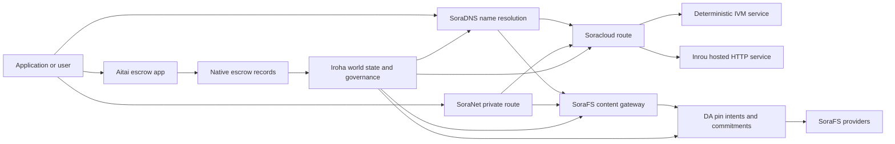

# SORA Nexus خدمات {#sora-nexus-services}


SORA Nexus يضيف طائرات خدمة تتجه نحو التطبيقات حول Iroha 3. هذه الخدمات ليست دفترًا منفصلًا. إنها مقيدة Iroha الدولة العالمية Norito المخططات، سجلات الحوكمة، Torii عائلات الطريق.

التوافر يعتمد على بناء العقدة وملف الشبكة. استخدم [`/openapi`](/ar/reference/torii-endpoints.md#app-and-sora-route-families) لاكتشاف الطرق التي تم إنشاؤها من خلال تطبيق-API على عقدة الهدف. يتم تركيب الطرق المحلية العامة SoraFS CID والمعروفة خارج هذه الوثيقة التي تم إنشاؤها، لذلك قم بفحص تلك الطرق مباشرة عند التحقق من نشر.

## خريطة المكونات {#component-map}

|المكون |الدور |الأسطح الرئيسية |
| ---------------------- | ------------------------------------------------------------------------------------------------------------------------------------------- | ---------------------------------------------------------------------------------------- |
|Soracloud |تنفيذ التطبيقات، الخدمات المضيفة، النموذج الخاص/حالة وقت التشغيل، ومراقبة دورة حياة الخدمة. |`/v1/soracloud/` ، `/api/`، `iroha app soracloud ...` |
|في الداخل|Soracloud استضاف HTTP وقت تشغيل لإصلاحات الخدمة التي تحتاج إلى طائرة HTTP مباشرة. |Soracloud تشكيل وقت التشغيل، إعلانات قدرة المضيف، النسخة حالة الوقت التشغيلي |
|SoraNet |الخصوصية وتغطية النقل للدوائر، حركة المرور الإرسالية، VPN ، جلسات الاتصال، وطرق البث. |`/v1/connect/` ، `/v1/vpn/`، SoraNet البيانات الأساسية للطريق |
|الوصول إلى البيانات (DA) |دليل التوافر، والالتزام، وطبقة نية الحملات المفيدة التي يتم الإشارة إليها من خلال خطوط Nexus ، ومظاهر SoraFS، وتدفقات الدليل. .|`/v1/da/` ، `FindDaPinIntent`، `[sumeragi.da]` |
|SoraFS |نسيج التخزين مع عنوان المحتوى للانشارات ، والحمولات المفيدة CAR ، والمحتويات المثبتة ، ومقاطع البوابة ، وتدفقات إثبات استرداد. |`/v1/sorafs/` ، `/sorafs/`، `FindSorafsProviderOwner` |
|SoraDNS |طبقة التسمية المحددة وتصنيف القرار للخدمات والمحتوى التي يتم استضافةها في SORA. |`/v1/soradns/`، `/soradns/`، أحداث دليل القرار |
|أيتاي|ممر تسوية الأصول في مستوى التطبيق المدعوم من سجلات الاحتفاظ الأصلية ، وليس من قبل دفتر رئيسي منفصل. | `OpenAssetEscrow`, `FindAssetEscrow*`, `EscrowEventFilter`, Kotodama `escrow_*` المباني |



## التدفقات الشائعة {#common-flows}

### تطبيق تقسيم استضافة {#hosted-split-application}

تطبيق مشترك عادي يستخدم كل القطع معا:

1. يتم تعبئة الأصول العادية للجهة الأمامية ووضعها في SoraFS.
2. يتم تسجيل المضيف العام على سبيل المثال `<app>.sora` من خلال SoraDNS.
3. طرق Soracloud `/api/v1/search` أو `/api/v1/stream` إلى خدمة HTTP من خلال الإنتر.
4. طرق Soracloud `/api/auth` و`/api/v1/user` إلى المعاملين المحددين IVM.
5. يمكن للعملاء الذين يحتاجون إلى الخصوصية الوصول إلى نفس المحتوى أو طريق API من خلال دائرة SoraNet.

|الطريق|الطائرة الخلفية|لماذا ؟|
| ----------------- | --------------------- | ------------------------------------------------- |
| `/`               |SoraFS محتوى ثابت |تخزين الجذر والبوابة المحتوى القابل للتكرار |
|`/assets/*` |SoraFS محتوى ثابت |الأصول التي تعتمد على المحتوى و الدليل الرئيسي |
|`/api/auth*` |Soracloud IVM |إعادة تشغيل آمن و محفظة تحدي الحالة |
|`/api/v1/user*` |Soracloud IVM |التحولات الحكومية الحساسة|
|`/api/v1/search*` |Soracloud إنرو |خدمة HTTP المباشرة، التخزين الآلي، SSE، أو حالة جمع |

### المحتوى النشر {#content-publication}

SoraFS النشر ينتج الآثار الدائمة قبل أن يشير اسمها إليها:

1. بناء حمولة مفيدة أو دليل.
2. إربطها في CAR أرشيف و خطة قطعة.
3. بناء مذكرة Norito مع بيانات سياسة البن والحوكمة.
4. قم بإرسال المذكرة إلى Torii.
5. سجل نية DA أو الالتزام بالتوفر عندما يتطلب الملف الشخصي المستهدف إثباتًا صراحة.
6. ربط المخطط بإسم SoraDNS أو طريق Soracloud أمامية ثابتة.

### طريق التوصيل الخاص أو البث {#private-fetch-or-streaming-route}

SoraNet يمكن أن تجلس أمام SoraFS أو Soracloud:

1. العميل يحل الاسم أو المذكرة.
2. سجل الحراسة أو دليل المسار يختار رلي دخول وخارج.
3. يتم تعبئة حركة المرور وإرسالها عبر دائرة SoraNet.
4. يصل إرسال الخروج إلى بوابة SoraFS ، أو سلسلة Torii ، أو طريق Soracloud.

## أيتاي {#aitai}

أيتاي هو ممر التطبيق SORA للتسوية على شكل السوق حيث يقوم المشتري والبائع بتنسيق مدفوعات خارج سلسلة الدفع بينما يسيطر Iroha الاحتفاظ بالأصول على السلسلة. يجب أن تستخدم عائلة تعليمات الاحتفاض الأصلية بدلاً من حساب الاحتفاذ المملوك للعقود لتدفقات احتفاظ الأصول الرقمية الجديدة.

يحتفظ الوكيل الأصلي بالحماية في دفتر التسجيل. البائع يفتح عرضاً `OpenAssetEscrow`, المشتري يقبل ويضع علامة على الدفع خارج السلسلة: `AcceptAssetEscrow` و `MarkEscrowPaymentSent`, والبائع يطلق سراح `ReleaseAssetEscrow` إذا كان المشتري والبائع يختلفان، يمكن لأي من الطرفين فتح نزاع وحل مع `CanResolveEscrowDispute` بإمكانهم تقسيم المبلغ المحجوز

لمعرفة دورة الحياة الكاملة، قفل الأصول العامة، الاحتفاظ بالأموال المجهولة، والاستفسارات، والأحداث، ومثال Rust، انظر [ الاحتفاض الأصول الأصلية ](/ar/blockchain/escrow.md).

|أيتاي سطح |استخدمه لـ|
| ------------------------------------------------------------------------------------------------------------------------------------------------------------- | ----------------------------------------------------------------------------------------- |
| `OpenAssetEscrow`, `AcceptAssetEscrow`, `MarkEscrowPaymentSent`, `ReleaseAssetEscrow`, `CancelAssetEscrow`                                                    |عروض الأصول العددية الشفافة، بما في ذلك تدفقات التسوية المعروفة بـ XOR. |
| `OpenAnonymousAssetEscrow`, `AcceptAnonymousAssetEscrow`, `MarkAnonymousEscrowPaymentSent`, `ReleaseAnonymousAssetEscrow`, `CancelAnonymousAssetEscrow`       |العروض المحمية تستخدم مرفقات دليل للتمويل وإغلاق الحركات. |
|`OpenEscrowDispute`، `ResolveEscrowDispute`، `OpenAnonymousEscrowDispute`، `ResolveAnonymousEscrowDispute` |دخول النزاعات وحل المحاكم. |
|`FindAssetEscrowById`، `FindAssetEscrowsBySeller`، `FindAssetEscrowsByBuyer`، `FindAssetEscrowsByStatus` |صفحات حالة التطبيقات، وظائف المصالحة، وأدوات الدعم. |
|`EscrowEventFilter` |اشتراكات الاحتفاظ الشفافية على الهوية الاحتفالية، البائع، المشتري، الحالة، أو نوع الأحداث. |
| Kotodama `escrow_open_offer`, `escrow_accept`, `escrow_mark_payment_sent`, `escrow_release`, `escrow_cancel`, `escrow_open_dispute`, `escrow_resolve_dispute` |Kotodama المكالمات العقدية المدعومة من قبل V1 أوراق الاحتفاظ. |

للاستخدام العام Taira أو Minamoto، اعتبر سكة الدفع خارج السلسلة وأي تدفق عمل دعم أو محاكمة سياسة التطبيق. Iroha تسجل حالة الاحتفاظ والأحداث في دورة الحياة ومكافحة الأدلة وحركة الأصول النهائية؛ فإنه لا يتحقق من التسوية القانونية بمفرده .

## تحقق من عقدة الهدف {#check-a-target-node}

قبل استخدام الأمثلة من هذه الصفحة، تأكد من وجود عائلة الطرق على العقدة التي تستهدفها:

```bash
export TORII_URL=https://taira.sora.org

curl -fsS "$TORII_URL/openapi.json" \
  | jq '.paths | keys[] | select(test("^/v1/(soracloud|sorafs|soradns|connect|vpn|da)/"))'

curl -fsS -H 'Accept: application/json' "$TORII_URL/status" | jq .
```

إذا لم يتم الكشف عن `/openapi.json` من قبل الملف الشخصي ، فحاول `/openapi`. يعتمد توفر المسار الدقيق على ميزات البناء وتكوين الشبكة. لا يدرج الوثيقة مسارات محلية عامة SoraFS CID والمسارات المعروفة ؛ تحقق من تلك النقاط النهائية مباشرة كما هو موضح أدناه.

### Taira تشيكات الدخان القراءة فقط {#taira-read-only-smoke-checks}

النقطة النهائية العامة Taira مفيدة للتحقق من جانب القراءة، ولكن لا تستخدمها في أمثلة الطفر إلا إذا كنت تشغل حسابًا مسموحًا وتخطط لتغيير حالة شبكة الاختبار العامة.

```bash
export TORII_URL=https://taira.sora.org

curl -fsS -H 'Accept: application/json' "$TORII_URL/status" \
  | jq '{version: .build.version, peers, blocks, lanes: (.teu_lane_commit | length)}'

curl -fsS "$TORII_URL/v1/connect/status" | jq '{enabled, sessions_active}'

curl -fsS "$TORII_URL/v1/vpn/profile" \
  | jq '{available, relay_endpoint, supported_exit_classes}'

curl -fsS "$TORII_URL/v1/sorafs/storage/peers?limit=4" \
  | jq '{gateway_base_url, pin_torii_urls}'

curl -fsS -H 'Accept: application/json' "$TORII_URL/v1/soracloud/status" \
  | jq '.control_plane | {service_count, services: [.services[] | {service_name, current_version}]}'
```

Taira قد تكشف عن طرق طائرة التحكم الخاصة بالتنفيذ غير المدرجة في خريطة المسار OpenAPI. تعامل `/openapi` كعقد تم إنشاؤه للطرق التي تحتوي عليها، ثم تأكد مباشرة قبل توثيقها على أنها متوفرة الطرق المحلية المحددة لتنفيذ العمليات والعامة SoraFS.

## Soracloud {#soracloud}

Soracloud هو طائرة التحكم في تطبيقات SORA. تتتبع حزم التنفيذ وإصلاحات الخدمة والالتوجيه وحالة الانطلاق وإدخالات الإعدادات المعتمدة وسرية الخدمة المشفرة ومسجلات سجل النموذج ودورات الاستنتاج الخاصة وصناديق الوقت التشغيلي.

Soracloud يستخدم طائرتين للتنفيذ:

|طائرة الإعدام |وقت التشغيل|استخدمه لـ|
| ---------------------- | ------- | -------------------------------------------------------------------------------------------- |
|`DeterministicService` |`Ivm` |المؤلف، حالة الخزنة، قراءات معتمدة، موظفين صناديق البريد، طفرات حساسة للحوكمة |
|`HttpService` |`Inrou` |المباشر HTTP APIs، العمل الثقيل للمجمعين، الخدمات المدعومة من التخزين الآلي، SSE، التدفقات المساعدة من المتصفح |

طائرة التحكم هي مؤكدة. تعتمد أوامر النشر والترقية والرجوع إلى الوراء والتشغيل السري والنموذج والحالة على إرسالها عبر Torii وقراءة حالة العالم الملتزم بها؛ لا تعتمد على مرآة محلية منفصلة CLI. التوجيه العام يعتمد على أطول مستوى، وبالتالي يمكن لمضيف مسجل واحد تقسيم حركة المرور بين طرق HTTP المضيفة والطرق الحتمية API.

### قم بتجميع التطبيقات المفصلة {#scaffold-a-split-app}

يخلق نموذج تقسيم التطبيق مقدمة ثابتة بالإضافة إلى خدمة مضيفة حية API وخدمة خزنة تحديدية واحدة / API:

```bash
iroha app soracloud app init \
  --template split-app \
  --app-name solswap_indexer \
  --app-version 0.1.0 \
  --public-host solswap-indexer.sora \
  --output-dir ./apps/solswap-indexer

iroha app soracloud app local-plan \
  --manifest ./apps/solswap-indexer/app_manifest.json

iroha app soracloud app doctor \
  --manifest ./apps/solswap-indexer/app_manifest.json
```

`local-plan` طبع تقسيم المسار، وإبلاغات خدمة الأطفال، مسارات النصوص في مجال العمل، والطريقة المتوقعة لنشر الطرف الأمامي. `doctor` تؤكد عقد الإفراج المحلي قبل أن تشمل Torii.

### تنفيذ وتفتيش حالة التطبيق {#deploy-and-inspect-app-state}

```bash
export SORACLOUD_TORII_URL=https://<soracloud-enabled-torii>

iroha app soracloud app deploy \
  --manifest ./apps/solswap-indexer/app_manifest.json \
  --torii-url "$SORACLOUD_TORII_URL"

iroha app soracloud app status \
  --manifest ./apps/solswap-indexer/app_manifest.json \
  --torii-url "$SORACLOUD_TORII_URL"
```

لخدمة تم نشرها بالفعل، استخدم الأوامر المحددة على مستوى الخدمة:

```bash
iroha app soracloud status \
  --service-name solswap_indexer_live \
  --torii-url "$SORACLOUD_TORII_URL"

iroha app soracloud rollback \
  --service-name solswap_indexer_live \
  --target-version 0.1.0 \
  --torii-url "$SORACLOUD_TORII_URL"
```

### المواد المخفية والسرية {#config-and-secret-material}

Soracloud الإعدادات والإدخالات السرية هي جزء من حالة التنفيذ المعتمدة. لا يتم إغلاق الانتشار والترقية والاستعادة عندما تكون الإعدادات أو الالتزامات السرية المطلوبة مفقودة أو غير متوافقة مع المنشورات النشطة.

```bash
iroha app soracloud config-set \
  --service-name solswap_indexer_live \
  --config-name indexer/public_config \
  --value-file ./config/public-config.json \
  --torii-url "$SORACLOUD_TORII_URL"

iroha app soracloud secret-set \
  --service-name solswap_indexer_live \
  --secret-name indexer/api_key \
  --secret-file ./secrets/api-key.envelope.json \
  --torii-url "$SORACLOUD_TORII_URL"
```

استخدم مساعدة CLI للحصول على العلامات الوثيقة التي يتطلبها ملفك الشخصي:

```bash
iroha app soracloud config-set --help
iroha app soracloud secret-set --help
```

## إندرو {#inrou}

إنرو هي المضيفة HTTP وقت التشغيل المستخدم من Soracloud. (إنه) Iroha العقدة مع المضمنة Soracloud المشاريع التي تم قبولها في الوقت المناسب Soracloud الدولة في خطة التمثيل المحلية، يبدأ النسخ المخصصة للخدمة المستضافة كخدمات الخلفية، و تقارير نسخة من حالة التشغيل مرة أخرى إلى النموذج المعتمد.

استخدم Inrou لتحميلات العمل التي تحتاج إلى سطح HTTP مباشر ، مثل التدفقات الثقيلة للجمع APIs ، SSE ، ومعالجات مدعومة بالخزن الآلي ، أو الخدمات المساعدة من المتصفح.

### متطلبات وقت التشغيل {#runtime-requirements}

- يجب أن يكون وقت تشغيل مظلة الحاويات `Inrou`.
- يجب أن تكون طائرة تنفيذ بيانات الخدمة `HttpService`.
- `HttpService + Inrou` يتطلب بالضبط واحدة `PersistentRootLeaseVolume` مثبتة على `/`.
- تحتاج خدمات Inrou المكررة أيضًا إلى خدمة مشتركة أو تخزين تأجير سري عندما تحتفظ بحالة مشتركة متغيرة.
- يجب على عقدات استضافة الإنتاج الإعلان عن قدرة Inrou الحقيقية بدلاً من العمل كوكيل فقط.

### قطعة واضحة {#manifest-fragment}

يظهر المثال أدناه شكل الإظهارين. إنه قطعة، وليس مجموعة كاملة للتنفيذ.

```jsonc
// container_manifest.json
{
  "schema_version": 1,
  "runtime": { "runtime": "Inrou", "value": null },
  "bundle_path": "/bundles/solswap-indexer.inrou",
  "entrypoint": "/app/bin/launch-indexer.sh",
  "args": [],
  "env": {
    "RUST_LOG": "info",
  },
  "inrou": {
    "schema_version": 1,
    "guest_os": { "guest_os": "DebianSlim", "value": null },
    "guest_images": {
      "x86_64": {
        "kernel_image_path": "/inrou/x86_64/vmlinux",
        "rootfs_image_path": "/inrou/x86_64/rootfs.ext4",
        "initrd_image_path": null,
      },
      "aarch64": {
        "kernel_image_path": "/inrou/aarch64/vmlinux",
        "rootfs_image_path": "/inrou/aarch64/rootfs.ext4",
        "initrd_image_path": null,
      },
    },
  },
  "lifecycle": {
    "start_grace_secs": 60,
    "stop_grace_secs": 30,
    "healthcheck_path": "/api/indexer/v1/health",
  },
}
```

```jsonc
// service_manifest.json
{
  "schema_version": 1,
  "service_name": "solswap_indexer_live",
  "service_version": "0.1.0",
  "execution_plane": { "execution_plane": "HttpService", "value": null },
  "replicas": 2,
  "route": {
    "host": "solswap-indexer.sora",
    "path_prefix": "/api/v1/search",
    "service_port": 8080,
    "visibility": { "visibility": "Public", "value": null },
    "tls_mode": { "tls": "Required", "value": null },
  },
  "lease_volumes": [
    {
      "volume_name": "root_disk",
      "kind": {
        "lease_volume": "PersistentRootLeaseVolume",
        "value": null,
      },
      "storage_class": { "storage_class": "Warm", "value": null },
      "mount_path": "/",
      "max_total_bytes": 8589934592,
    },
    {
      "volume_name": "index_state",
      "kind": { "lease_volume": "ServiceLeaseVolume", "value": null },
      "storage_class": { "storage_class": "Warm", "value": null },
      "mount_path": "/var/lib/solswap-indexer",
      "max_total_bytes": 1073741824,
    },
  ],
}
```

في وقت التشغيل، يتم تعريض كل حجم تأجير مثبت من خلال متغيرات بيئة مشتقة من اسم الكمية:

```text
SORACLOUD_LEASE_VOLUME_ROOT_DISK_DIR
SORACLOUD_LEASE_VOLUME_ROOT_DISK_MOUNT_PATH
SORACLOUD_LEASE_VOLUME_INDEX_STATE_DIR
SORACLOUD_LEASE_VOLUME_INDEX_STATE_MOUNT_PATH
```

## SoraNet {#soranet}

SoraNet هي التغطية على الخصوصية والنقل. إنها توفر طرق قائمة على الرصيف للحركة المرور التي لا يجب أن تتصل مباشرة بالبوابة المستهدفة أو الخدمة. يستخدم تصميم النقل أدوار إرسال الدخول والوسط والخروج ، QUIC النقل ، ومصافحة اليد الهجينة القائمة على الضوضاء ، وتفاوض القدرة ، وبيانات البيانات من دليل الإرسال ، والخلايا المغطاة ذات الحجم الثابت.

في Nexus الانتشارات SoraNet يمكن أن يحمل محمولات المحتوى، حركة المرور عبر البوابة، VPN أو جلسات الاتصال، و Norito طرق التدفق. إدخالات السجلات يمكن أن تُعَرِّف على الروابط التي تدعم `norito-stream`, مما يسمح للعملاء بتفضيل الطرق المناسبة ل Torii RPC أو تدفق حركة المرور.

### تكوين التدفقات {#streaming-configuration}

يسمح ملف Nexus بتوفير SoraNet لطرق البث:

```toml
[streaming]
feature_bits = 0b11

[streaming.soranet]
enabled = true
exit_multiaddr = "/dns/torii/udp/9443/quic"
padding_budget_ms = 25
access_kind = "authenticated"
provision_spool_dir = "./storage/streaming/soranet_routes"
provision_spool_max_bytes = 0
provision_window_segments = 4
provision_queue_capacity = 256
```

استخدام `access_kind = "read-only"` لطرق المحتوى التي لا تتطلب مصادقة المشاهد. استخدم `authenticated` عندما يجب على جهاز إرسال الخروج فرض التذاكر أو هوية المشاهد قبل الانتقال إلى Torii أو خدمة مضيفة.

### SoraNet-علم SoraFS جلب {#soranet-aware-sorafs-fetch}

(الـ) SoraFS الوصول CLI يمكن أن تنشر إشارة وكيل محلية والسجل SoraNet البيانات الوصولية لمتوسيعات المتصفح أو SDK مُعدّل، الموسيقي JSON يجب أن تحدد `local_proxy` مع `"emit_browser_manifest": true`, و CLI يجب أن يتم بناؤها `local-quic-proxy` دعم. Taira, تفتيش قائمة المقدمين المقبولين في جذور شبكة الاختبار العامة، ثم تملأ الرقعة الممنوحة للمقدم المحمية الصادرة عن هذا المقدم:

```bash
export TAIRA_ROOT=https://taira.sora.org
curl -fsS "$TAIRA_ROOT/v1/sorafs/providers?limit=20" | jq '.providers'

: "${TAIRA_SORAFS_PROVIDER_ID:?set the admitted provider ID from Taira discovery}"
: "${TAIRA_SORAFS_GATEWAY_KEY:?set the provider gateway key}"
: "${TAIRA_SORAFS_PROVIDER_URL:?set the advertised provider base URL}"
: "${TAIRA_SORAFS_STREAM_TOKEN_FILE:?set the issued stream-token file}"

cargo run -p sorafs_orchestrator --features=local-quic-proxy --bin=sorafs_cli -- \
  fetch \
  --plan=artifacts/payload_plan.json \
  --manifest-id=<manifest-digest-hex> \
  --orchestrator-config=artifacts/orchestrator.json \
  --provider=name=taira,provider-id="$TAIRA_SORAFS_PROVIDER_ID",gateway-key="$TAIRA_SORAFS_GATEWAY_KEY",base-url="$TAIRA_SORAFS_PROVIDER_URL",stream-token="$(cat "$TAIRA_SORAFS_STREAM_TOKEN_FILE")" \
  --output=artifacts/payload.bin \
  --json-out=artifacts/fetch_summary.json \
  --local-proxy-manifest-out=artifacts/proxy_manifest.json \
  --local-proxy-mode=bridge \
  --local-proxy-norito-spool=storage/streaming/soranet_routes \
  --local-proxy-kaigi-spool=storage/streaming/soranet_routes \
  --local-proxy-kaigi-policy=authenticated \
  --max-peers=2 \
  --retry-budget=4
```

تقارير مزود السجلات الموجّهة والإيصالات المقطوعة، البيانات الأساسية المحلية، وإعدادات الطريق الفعلي المستخدمة للحصول على.

### قائمة التحقق من التحفيزات المتسلطة {#relay-incentive-verifier-roster}

يرفض استهلاك الحوافز الترسلية الدليلات ما لم تنجح كل التحقق المطلوب. عندما يكون `incentives.enable` صحيحًا، يجب أن يتضمن `incentives.trusted_verifier_ids` على الأقل حسابًا قائديًا واحدًا ID. لا يجب أن تتجاوز القائمة 64 إدخالًا أبدًا ، حتى عندما يتم تعطيل الحوافز. يحتفظ وقت التشغيل بها كمجموعة محددة مرتبة ، ويرفض هندسة القائمة غير صالحة أثناء بدء الترسل.

يتم فك كل `RelayBandwidthProofV1` بموجب إطار ثابت / ميزانية التخصيص ويجب أن يستغرق الإطار الكامل. يجب أن يكون حساب المؤكد للدليل موجودًا في القائمة المكوّنة ، ويجب أن ينجح `RelayBandwidthProofV1::verify_signature()` ، قبل قفل جهاز الترسل أو تغيير accumulator الأداء. يتجاهل جهاز الإرسال توقيعًا غير موثوق به أو إثبات عدم صحة التوقيع / تعويض. مثل هذا الدليل لا يضيف أي قياس ولا يمكن أن ينتج لقطة تحفيز.

## إمكانية الحصول على البيانات (DA) {#data-availability-da}

DA هي طبقة إثبات التوافر للحميات المفيدة التي كبيرة جدا، حساسة جدا للحفاظ على الخصوصية، أو الخدمات الخاصة جدا لوضعها مباشرة في حالة العالم. فإنه يسجل الالتزامات المحددة والتزامات الاسترداد بحيث يمكن للمؤكدين والبوابات والعملاء الاتفاق على البايتات التي تم وعدها، والسياسة التي تنطبق، وأي الأدلة قد لاحظت.

DA لا يحل محل Kura أو SoraFS:

- Kura تخزين بيانات استرداد الكتل النهائية والإتفاقية.
- SoraFS تخزين وتخدم البايتات المعروضة على المحتوى، والحمولات المفيدة CAR، والمخططات.
- DA تسجل الالتزامات وسياسات الإثبات، فتحات الأدلة، ومقصود اللوحة التي تسمح بتعيين تلك البايتات، والتحقق منها، وربطها مرة أخرى إلى حالة دفتر التسجيل.

استخدم DA عندما يحتاج تطبيق أو Nexus طريق إلى وعد مرئي في دفتر التسجيل بأن البيانات خارج السلسلة لا تزال قابلة للاسترداد. وتشمل الأمثلة الشائعة الالتزامات بالحمولة المفيدة في المسار لتدفقات التسوية، و SoraFS مقصدات اللوحة للمحتويات المنشورة ، حزم الأدلة التي يجب الاحتفاظ بها للتحقق في وقت لاحق، وأثاث التطبيقات التي ينبغي أن تكون الحالة العامة هي إضافة بدلاً من تحميل كامل.

### دورة الحياة {#lifecycle}

|المرحلة|ما هو المسجل|
| ---------- | ----------------------------------------------------------------------------------------------------------------------------------------------------- |
|نية |التذكرة، الإشارة المعلنة، الاسم الأدنى، إشارة الطريق/العصر/السلسلة، سياسة الاحتفاظ، أو هدف النسخ. |
|الالتزام|إرسال المواد التي تربط المخطط، الحمل الصالح للقطار، حزمة الأدلة، أو جذور المحتوى إلى سجل الرسوم الكبرى المرئي. |
|الأدلة|التصويت على إمكانية الوصول، فتحات الأدلة، شهادات المزودين، أو غيرها من الدلائل الخاصة بالملفات التي قبلتها شبكة الهدف. |
|السؤال|عمليات البحث المتعلقة بـ `FindDaPinIntentByTicket` ، `FindDaPinIntentByManifest`، `FindDaPinIntentByAlias`، أو `FindDaPinIntentByLaneEpochSequence`. |

التدفق النموذجي للنشر المدعوم من DA هو:

1. بناء أو استلام الحمولة المفيدة خارج WSV ، على سبيل المثال ملف SoraFS CAR أو Nexus حمولة مفيدة في المسار.
2. ووصف الحمولة المفيدة في مذكرة التزام Norito أو سجل الالتزامات المحدد للخطوط.
3. قم بإرسال المخطط أو نية اللوحة أو الالتزام عبر `/v1/da/*` عندما يتم تمكين عائلة الطرق تلك، أو من خلال مسار المعاملات الموقعة للشبكة.
4. دع المحققين أو مقدمي التوافر جمع الأدلة التي تتطلبها سياسة الإثبات النشط.
5. اسأل عن النية أو الالتزام الناتج قبل تعزيز مستعار، دليل تسوية، أو طريق البوابة التي تعتمد على الحمولة المفيدة.

### النموذج الخوارجي {#algorithmic-model}

DA يحول حمولة مفيدة إلى التزاما موقعاً محمياً من إعادة تشغيل الكتلة. الخوارزميات المهمة هي تحديدية بحيث يمكن للمؤكّدين والبوابات إعادة احتساب نفس البيانات من نفس الأبحاث.

1. تحويل الحمل المفيد الذي تم تقديمه. Torii يقبل طلب استهلاك مع `(lane_id, epoch, sequence)` ، بايتات الحمولة المفيدة، بيانات التضخم، حجم الجزء، ملف مسح، سياسة الاحتفاظ، وتوقيع المرسل. يقوم العقد بتفكيك تحميلات gzip أو deflate أو Zstandard عند الطلب ، ثم يتحقق من أن طول البايت القنوني يساوي `total_size`.
2. تأكيد معايير المسار والجزء. يجب أن يكون هناك مسار في كتالوج المسارات Nexus. يجب أن تكون `chunk_size` قوة غير صفرية من اثنين ، لا يقل عن بايتين ، ولا يزيد عن الحد الأقصى المحدد. يجب أن يتضمن ملف التمرير شرائح البيانات وعشرات مساوية على الأقل. يتم اختيار نظام الدليل في كتالوج المسار، إما `merkle_sha256` أو `kzg_bls12_381`.
3. تطبيق سياسة الشبكة. يفرض العقد خط أساس التكرار والاحتفاظ المحدد للفئة البلوب. يجب أن تبقى البيانات الأساسية العامة متنًا صافيًا؛ يتم تشفير البيانات المحددة للحكم فقط بمفتاح البيانات الوصول إلى الحكم المحدد للعقد قبل كتابتها في المنشور.
4. الجزء والإجراء. يتم تقسيم الحمل المفيد القنوني مع ملف ذات الحجم الثابت مشتق من `chunk_size`. Torii يحسب هضم الحمولة المفيدة، جذور شجرة إثبات الاسترداد، والتزامات لكل قطعة. تتحمل قطع البيانات التزامات BLAKE3 على بايتها.
5. إضافة التزامات محو. يتم تجميع قطع في شريطات من `data_shards`. الخلايا المفقودة في الشريط النهائي هي صفر مدفوع لحساب الموازنة. RS(16) يخلق الموازنة شرائح المساواة الصفية / العالمية؛ اختياريًا `row_parity_stripes` إضافة مساواة الشريط في نمط العمود على جميع أنحاء المصفوفة. الالتزامات بالشرائح المتساوية هي BLAKE3 استهلاك رموز `u16` صغيرة الحجم.
6. قم بإنشاء المخطط. `DaManifestV1` تسجل المسار، العصر، فئة البقع، القوديك، هضم الحمولة المفيدة، الجذر الجزء، حجم الجزء، ملف مسح، سياسة الاحتفاظ، اقتباس الإيجار، التزامات الجزء، الاختيارية IPA الالتزام، البيانات الأساسية، والوقت للإصدار. تذكرة التخزين هي تحديدية: العقد يضغط أولاً على نموذج منشور مع تذكرة فارغة، ثم يكتب بصمة الإصبع إلى الوراء باعتبارها النهائية `storage_ticket`.
7. رفض صراعات إعادة التشغيل. مفتاح إعادة اللعب هو `(lane_id, epoch, sequence, manifest_fingerprint)`. نسخة مزدوجة ذات نفس بصمة الإصبع غير فعالة. يتم رفض تسلسل قديم أو نفس السلسلة ذات بصمة إصبع مختلفة.
8. إصدار القطع الأثرية الموقعة. Torii يحسب التزاماً PDP، ويوقع على `DaIngestReceipt` ، ويقوم بإنشاء `DaCommitmentRecord`، ويكتب القطع الأوثرية للكاتب العام، الالتزام PDP، سجل الالتزام، جدول الالتزامات، نية اللوحة، ملف الإيصال، وسجل الإيصال. يقدم مؤشر الإيصال بشكل واحد لكل `(lane_id, epoch)`.

سجلات الالتزام هي ما يحمله الكتل السجل يربط:

- الطريق، العصر، والترتيب
- المكالمة المتصلة ID والشاشة الكانونيكية للنشر
- مخطط إثبات المسارات
- الجذر الكثيف
- الالتزام الافتراضي KZG للطرق KZG
- PDP/إسهام الأدلة
- فئة الاحتفاظ وتذكرة التخزين
- Torii DA توقيع التأكيد

قبل أن تضم حزمة سجلات DA ، يؤكد مسار تجميع الحزمة:

- `(lane_id, epoch, sequence)` يجب أن يكون فريدًا داخل الحزمة.
- يجب أن تكون الحشيشات الواضحة غير صفرية ووحيدة داخل الكتلة.
- يجب أن تتطابق نظام إثبات الالتزام مع سياسة المسارات المكوّنة.
- طرق ميركل ترفض الالتزامات KZG؛ طرق KZG تتطلب الالتزام غير الصفر KZG.
- يتم تصنيف مقصدات اللوحة، وتنظيمها، وتصفيتها حسب الشارع، والإشارة الهمشية، وتذكرة التخزين، وحساب المالك، وقواعد اصطدام الألقاب.

يحتفظ عنوان الكتلة بالهاشز لسياسات إثبات DA والالتزامات ، ومقصود اللوحة. بالنسبة لإثبات العضوية ، يعرض حزم الالتزام أيضًا جذور ميركل التي تركها هي حشيشات من القيم Norito المشفورة `DaCommitmentRecord`. العقد الأولي يحتوي على الحشيشة بين الأطفال اليسرى واليمين. يتم تعزيز ورقة غريبة دون تغيير إلى الطبقة التالية.

### التحقق من الأدلة {#proof-verification}

`/v1/da/commitments/prove` يمكن أن توفر إثباتًا لالتزام واحد في كتلة. يحتوي الإثبات على الالتزام ، وارتفاع الكتلة ، والمؤشر في الحزمة ، والحش حزمة ، وطول الحزمة، جذور Merkle ، ومسار الأخوة. تحقق:

1. يطابق هاش حزمة البرهان DA الالتزام في عنوان الكتلة.
2. ارتفاع كتلة الدليل يطابق رأس كتلة المشار إليها.
3. المؤشر في الحدود والالتزام يساوي إدخال حزمة في هذا المؤشر.
4. سياسة تأمين المسارات تقبل الالتزام.
5. إطاحة المسار الإخوة من ورقة الالتزام يعيد بناء الجذر المقدم.
6. الجذر الذي تم إعادة بناؤه يساوي جذر الكتلة

هذا يثبت أن التزامًا محددًا بالتوفر كان مدرجًا في حمولة مفيدة خاصة؛ فهذا لا يدل على أن كل نسخة موجودة حاليًا على الإنترنت. يتم التحقق من إمكانية الاسترداد المباشر بشكل منفصل عن طريق استلام مقدم SoraFS ، والتحقق من PDP/PoTR ، أو دليل على الوصول المحدد للملف الشخصي.

### تفاعل التوافق {#consensus-interaction}

يتم ربط DA مع Sumeragi من خلال البث الموثوق به (RBC) ، لكنه ليس بروتوكولًا نهائيًا ثانيًا. RBC ينشر ويقوم باسترداد حمولات المقترح: يعلن مقدم المقترح عن جلسة ل `(height, view, payload_hash)` ، وقطع تبادل الأقران، وتتبع إشارات `READY`/`DELIVER` ما إذا كان عدد كاف من المحققين قد لاحظوا نفس الحمل الاستثماري.

في Iroha 3 ، يعتبر الزميل الحمل المفيد المتعلّق بالحجم المتاحة عندما:

- الكتلة المحلية المعلقة البيانات hash إلى الحمل المفيد المتوقع hash، أو
- RBC عثرت على حمولة مفيدة تتطابق مع الحاجز الكتلة، ارتفاع، المشاهدة، والحاجز الفيدوي.

إذا لم تثبت أي من الحالات، سجلات الأقران `missing_local_data` ، تستمر في محاولة لاسترداد الحمولة المفيدة من خلال RBC أو إيقاف التزامن، وتقرير DA البوابة في الحالة والتلفونية. في التنفيذ الحالي هذه الإشارات DA هي إشارة لتحقيق النهاية: كتلة لا تزال تنتهي من شهادة الالتزام بالإضافة إلى الحمل المفيد المحلي المتطابق، ليس من شهادة قياسية منفصلة DA.

يوسع توقيت DA نوافذ الاسترداد. يتم استنباط التوقيت الفعال لـ DA من الكتلة الموضحة وتوقيت الالتزام، ثم مضاعفة ب `sumeragi.advanced.da.quorum_timeout_multiplier`. وقت التوافر هو `max(quorum_timeout, availability_timeout_floor_ms) * availability_timeout_multiplier`. قبل انتهاء فترة التوافر هذه، يفضل العقد استرداد الحمل المفيد وتجنب إعادة جدولة مبكرة؛ بعد انتهائها، يمكن أن تستمر مسارات الاسترداد الطبيعية وتغيير الرؤية.

### ملاحظات المشغل {#operator-notes}

تشمل ملفات الشخصية المتفق عليها في Iroha 3 نشر الحمولة المفيدة المدعومة من RBC، وحماية المظاهر، وصحة الكتلة DA، وتسجيل التلفزيون. يعرض نموذج الأقران حدود `[sumeragi.da]` للالتزامات والفتوحات الإثباتية لكل كتلة، بالإضافة إلى مضاعفات التوقيت `[sumeragi.advanced.da]` لسلوك الجودة والتوافر. الحفاظ على هذه الإعدادات متسقة عبر المصدقين في ملف تعريف شبكة واحد.

للكشف عن المسار، ابدأ بالوثيقة OpenAPI للعقد:

```bash
curl -fsS "$TORII_URL/openapi.json" \
  | jq '.paths | keys[] | select(startswith("/v1/da/"))'
```

استخدم إشارة استفسار [](/ar/reference/queries.md#nexus-data-availability-and-packages) لأسماء الاستفسارات الحالية DA، وشكل تشكيل الزملاء [ ](/ar/reference/peer-config/) للأزرار المحلية `[sumeragi.da]` المعروضة من خلال البناء الخاص بك.

## SoraFS {#sorafs}

SoraFS هو النسيج اللامركزي لتخزين المحتوى. يحتوي على حزم البايت في قطع تحديدية، أرشيفات CAR، ومظاهر Norito التي تربط جذور المحتوى، ملفات تعريف المحتويات، وسياسات الوصف، وإثباتات الحوكمة. مزودي التخزين يعلنون عن القدرة وتوافر المحتوى، في حين تقوم البوابات بالتحقق من الإشعارات والالتزامات المتعلقة بالمحتوى قبل تقديمها.

النموذجي SoraFS الاستخدامات تشمل أصول التطبيقات الثابتة ، ومجموعات الوثائق ، والمنطقة المجموعات، والإشارات إلى النماذج أو الأثرية، ومجموعات الدليل على الحكم. Iroha تعرض نماذج البيانات SoraFS أحداث البوابة و [`FindSorafsProviderOwner`](/ar/reference/queries.md#nexus-data-availability-and-packages) الاستفسار عن حل ملكية المزود.

### Taira ملف الاختبار {#taira-testnet-profile}

Taira هو شبكة اختبار عامة قائمة SoraFS. يستخدم ملف مؤكدة التحقق فيها سلسلة `fc56984b-2be7-431d-840e-21514d1883f0` وتمييز السلسلة `369`. إعداداتها المنشورة SoraFS هي:

- شبكة ID: `hash:82531CE8EAE8BFF6BEECA4698BFD13A3BC8BEC5F0EE0D23D428C97FC17AB0F3B#3E94`
- قاعدة البوابة URL: `https://taira.sora.org`
- الخطوط Torii URLs: `https://taira-validator-1.sora.org` إلى `https://taira-validator-4.sora.org`
- قدرات الكشف: `torii_gateway`، `chunk_range_fetch`، و `potr_mldsa`.
- أصل المحتوى المعزول: `https://{cid}.sorafs.taira.sora.org/{path}`
- السياسة العامة: بدون تصريح ومحدودة رسوم، مع `require_council_signatures = false`

```toml
[sorafs.storage]
enabled = false
max_capacity_bytes = 13743895347

[sorafs.discovery]
discovery_enabled = true
known_capabilities = ["torii_gateway", "chunk_range_fetch", "potr_mldsa"]

[sorafs.discovery.publish]
gateway_base_url = "https://taira.sora.org"
pin_torii_urls = [
  "https://taira-validator-1.sora.org",
  "https://taira-validator-2.sora.org",
  "https://taira-validator-3.sora.org",
  "https://taira-validator-4.sora.org",
]

[sorafs.gateway.untrusted_hosting]
enabled = true
path_gateway_redirect = true
redirect_html_only = true

[sorafs.gateway.untrusted_hosting.cid_host_suffixes]
taira = "sorafs.taira.sora.org"

[sorafs.repair]
enabled = false

[sorafs.gc]
enabled = false

[gov.sorafs_pin_policy]
require_council_signatures = false
```

(الـ) Taira المحققون مدمجين SoraFS تم تعطيل التخزين وإصلاح وتجميع القمامة. التحقق من ميزانية القرص المؤكد؛ هذا لا يعني أن مؤكد هو مزود تخزين. `GET /v1/sorafs/storage/peers?limit=4` قراءة البوابة الحالية التي يتم تشكيلها ومواجهات اللوحة قبل الاختبار.

الكلمة التالية `sorafs.sora.org` CID هي ملف الإنتاج المباشر/المنتج، وليس Taira. لا تضعها في مظاهر Taira أو فحص المصدر أو اختبارات المتصفح. يجب أن تستخدم تنفيذات الإنتاج هوية الشبكة الخاصة بها، ومفاتيح الحوكمة، ومواد إدخال المزودين، ونقاط النهاية المحمولة، وسياسة القدرة / الإصلاح؛ لا نسخ أية اعتبارات Taira أو افتراضات النقطة النهائية في تكوين إنتاج.

### البوابات المحلية العامة CID ومواقع الموقع {#public-local-cid-and-site-gateways}

كل عقد Torii تمكين من SoraFS يضع هذه الطرق العامة المجهولة حتى عندما لا يتم بناء التطبيق الاختياري API:

|الطريقة والنقطة النهائية|الغرض|
| ---------------------------------- | -------------------------------------------------------------------- |
|`GET /.well-known/sorafs/manifest` |إرجاع المخطط الذي اختاره مستضيف الطلب الكنسي |
|`GET /v1/sorafs/cid/{cid}` |إرجاع البيانات الوصفية المحلية المحددة ومدخلات الملف لـ CID |
|`GET /sorafs/cid/{cid}` |خدمة الوثيقة الجذرية لموقع واحد محلي مع عنوان المحتوى |
|`GET /sorafs/cid/{cid}/{*path}` |خدمة مسار معتاد واحد، أو مجموعة بايت محددة واحدة، تحت ذلك CID |

هذه الطرق لا تقبل أبدًا `x-sorafs-stream-token` أو `x-sorafs-token-id`. وجود أي من العناوين أمرًا سيئًا. المخطط الكنسي الموجود بالفعل في المخزن المحلي المعتمد للعقد هو القدرة على القراءة العامة؛ فشل التخزين الاحتياطي لا يسمح بتقييم مزود عن بعد. المقدم المحمي CAR والطرق المتقطعة تبقى سطحات بروتوكول مصدقة منفصلة.

قبل قراءة البايتات ، يؤكد Torii التشفير القنوني للميناريس المحلي والقيود النطاقية والهضم والجذر CID. ثم يتطلب هوية المزود المحلي المعتمدة وإقرار الحكم والامتثال المنظم لميناريس ، CID ، والمقدم. تستخدم سعر البوابة / سياسة الحظر عنوان العميل الفعلي ، معتادًا على العناوين المرسلة فقط من خلال وكلاء موثوق بهم تم تشكيلها. إذا كانت السياسة أو الامتثال والهوية أو حالة القبول مفقودة ، فإن Torii يرفض الطلب.

طلب واحد يحمل تصريح من نهاية إلى نهاية للبوابة العامة، الحد على نطاق العملية هو 64 قراءة متزايدة. مع إرجاع طلبات فائقة `503 Service Unavailable` و `Retry-After: 1`. الإجابات الواضحة تصل إلى 16 MiB, قائمة الملفات افتراضية إلى 50 إدخال وعودة في أقصى حد 500، وملف كامل أو نطاق بايت واحد يحدد على 8 MiB. تحليل الاستفسار يعتمد على البناء. `app_api` يوافق build على إصدار 32-bit غير الممزق `limit`, يتجاهل مفاتيح الاستطلاع الأخرى ، يسمح للآخر تكرار `limit` الفوز، ويقفل القيمة في `1..=500`. إنشاء بسيط من الميزات دون `app_api` تقبل واحدة فقط من الكنسيات `limit=1..500` أزواج ورفض غير معروفة، المتكررة، المئة رمزية، أو غير القنوني الأشكال. أرسل بالضبط واحدة `limit=<1..500>` زوج للسلوك الذي يمكن نقله عبر المباني. CIDs, المضيفين، والطرق، وتعليقات النطاق تبقى قائمة ومتميزة واحدة في كل من البناء. HTML, CSS, JavaScript, SVG, XML, PDF, أو يتم تقديم محتوى Wasm فقط من جهاز تشكيل CID-أصل منفصل مشتق (أو تم إعادة توجيهه إلى هناك) ، مما يمنع أصل مسار مشترك من تنفيذ محتويات غير موثوق بها.

### التعبئة، البناء، والإرسال {#pack-build-and-submit}

يستخدم مثال الطفرة التالية النقطة النهائية Taira `NetworkId` المحققة، وأرضية النسخ، وسياسة الحوكمة. استخدم حساب شبكة الاختبار الممولة وملف مفتاح قابلة للتصرف فقط للمالك. يسمح Taira بنات دون إذن دون توقيع مجلس، ولكن لا يزال يتقاضى الرسوم المحكومة.

```bash
cargo run -p sorafs_orchestrator --bin sorafs_cli -- \
  car pack \
  --input=./dist \
  --car-out=artifacts/site.car \
  --plan-out=artifacts/site.chunk-plan.json \
  --summary-out=artifacts/site.car-summary.json

: "${TAIRA_AUTHORITY:?set a funded Taira I105 account}"
export TAIRA_NETWORK_ID='hash:82531CE8EAE8BFF6BEECA4698BFD13A3BC8BEC5F0EE0D23D428C97FC17AB0F3B#3E94'
export TAIRA_PIN_TORII_URL=https://taira-validator-1.sora.org
export TAIRA_PRIVATE_KEY_FILE="${TAIRA_PRIVATE_KEY_FILE:-./secrets/taira-authority.ed25519}"
export TAIRA_RETENTION_EPOCH=$(( $(date -u +%s) + 86400 ))

cargo run -p sorafs_orchestrator --bin sorafs_cli -- \
  manifest build \
  --summary=artifacts/site.car-summary.json \
  --manifest-out=artifacts/site.manifest.to \
  --manifest-json-out=artifacts/site.manifest.json \
  --pin-min-replicas=1 \
  --pin-storage-class=warm \
  --pin-retention-epoch="$TAIRA_RETENTION_EPOCH"

cargo run -p sorafs_orchestrator --bin sorafs_cli -- \
  manifest submit \
  --manifest=artifacts/site.manifest.to \
  --chunk-plan=artifacts/site.chunk-plan.json \
  --torii-url="$TAIRA_PIN_TORII_URL" \
  --network-id="$TAIRA_NETWORK_ID" \
  --authority="$TAIRA_AUTHORITY" \
  --private-key-file="$TAIRA_PRIVATE_KEY_FILE" \
  --summary-out=artifacts/site.manifest.submit.json \
  --response-out=artifacts/site.manifest.submit.body
```

`manifest submit` يتطلب `/v1/sorafs/pin/register`. إذا لم يتم توجيه العقدة المستهدفة ، فإن القيادة تفشل. الإصدار الأول CLI لا تعود إلى العادة `/transaction` نقطة النهاية

### التحقق والحصول {#verify-and-fetch}

تُحصل على مزودها ID والقاعدة الإعلانية URL من كتالوج مزود Taira ، و تحصل على مفتاح البوابة ورمز التدفق من خلال ذلك تدفق إدخال المقدم. هذه القيم ليست إعدادات تخزين المؤكدة. مؤكدين Taira المسجلون لديهم تعطل التخزين المضمن ، لذلك لا تحل محل محفظة مؤكدة URL لمقدم URL.

```bash
export TAIRA_ROOT=https://taira.sora.org
curl -fsS "$TAIRA_ROOT/v1/sorafs/providers?limit=20" | jq '.providers'

: "${TAIRA_SORAFS_PROVIDER_ID:?set the admitted provider ID from Taira discovery}"
: "${TAIRA_SORAFS_GATEWAY_KEY:?set the provider gateway key}"
: "${TAIRA_SORAFS_PROVIDER_URL:?set the advertised provider base URL}"
: "${TAIRA_SORAFS_STREAM_TOKEN_FILE:?set the issued stream-token file}"

cargo run -p sorafs_orchestrator --bin sorafs_cli -- \
  proof verify \
  --manifest=artifacts/site.manifest.to \
  --car=artifacts/site.car \
  --chunk-plan=artifacts/site.chunk-plan.json \
  --summary-out=artifacts/site.verify.json

cargo run -p sorafs_orchestrator --bin sorafs_cli -- \
  fetch \
  --plan=artifacts/site.chunk-plan.json \
  --manifest-id=<manifest-digest-hex> \
  --provider=name=taira,provider-id="$TAIRA_SORAFS_PROVIDER_ID",gateway-key="$TAIRA_SORAFS_GATEWAY_KEY",base-url="$TAIRA_SORAFS_PROVIDER_URL",stream-token="$(cat "$TAIRA_SORAFS_STREAM_TOKEN_FILE")" \
  --output=artifacts/site.fetch.tar \
  --json-out=artifacts/site.fetch.json
```

### التحقق من إثبات استردادية {#proof-of-retrievability-checks}

يمكن للمشغلين تفتيش وتصدير وإبلاغ عن نتائج إثبات الاسترداد. يتم جدولة التحديات من خلال خط الأنابيب الإثبات للشبكة؛ CLI يظهر نتائجها.

```bash
cargo run -p sorafs_orchestrator --bin sorafs_cli -- \
  por status \
  --torii-url="$TAIRA_PIN_TORII_URL" \
  --manifest=<manifest-digest-hex> \
  --status=failed \
  --limit=20

cargo run -p sorafs_orchestrator --bin sorafs_cli -- \
  por report \
  --torii-url="$TAIRA_PIN_TORII_URL" \
  --week=<YYYY-Www> \
  --format=json
```

## SoraDNS {#soradns}

SoraDNS هي طبقة الإسميات المحددة لخدمات SORA والمحتوى. فإنه يطبق الأسماء، يركز تحديثات إرشادات حلول في Iroha، وتوزع حزم المنطقة الموقعة أو الحل من خلال SoraFS. يقوم الحل والبوابات التحقق من وثائق إثبات الحل قبل الثقة في البيانات الأساسية للكشف.

بالنسبة للوصول إلى المتصفح ، SoraDNS يستخرج مضيفات البوابة من FQDN مسجل. يبقى مضيف الخيانة المسجل أصل التطبيق القنوني ، في حين أن ملفات تعريف بوابة المنشأة تكشف عن متصفح وطرق إرجاع Torii لهذا الأصل.

### نموذج المضيف {#host-forms}

|النموذج|مثال |الغرض|
| --- | --- | --- |
|أصل الباطل|`https://<fqdn>/<path>` |التطبيق الكنسي URL المسجل في المخططات ومذكرات الإفراج |
| Taira بوابة المتصفح |`https://<fqdn>.mon.taira.sora.net/<path>` |بوابة متصفح عامة لـ مستعار نشط |
|Torii الطريق للعودة|`https://taira.sora.org/soradns/<fqdn>/<path>` |Torii إزالة التحليل والعودة إلى الطريق لـ مستعار نشط |
|بوابة الهاشية القنونية |`<base32(blake3(name))>.gw.sora.id` | هوية البوابة المحددة و GAR التحقق |

`/soradns/<alias>/...` fallback ليس العام المفضل URL. يجب أن تفضل أدوات، مظاهر التطبيقات، وتكوين الجبهة الأمامية مضيف الفخام نفسه. إذا كان الاسم غير نشط على Taira، فإن بوابة المتصفح أو مسار العودة إلى الوراء يمكن أن يعود `404` أو يفشل TLS قبل بدء توجيه التطبيق.

### مضيفات البوابة المشتقة {#derive-gateway-hosts}

```ts
import {
  deriveSoradnsGatewayHosts,
  hostPatternsCoverDerivedHosts,
} from '@iroha/iroha-js'

const derived = deriveSoradnsGatewayHosts('docs.sora')
console.log(derived.canonicalHost)
console.log(derived.prettyHost)

const taira = deriveSoradnsGatewayHosts('solswap-indexer.sora', {
  prettySuffix: 'mon.taira.sora.net',
})
console.log(taira.prettyHost)

const patterns = [
  derived.canonicalHost,
  derived.canonicalWildcard,
  derived.prettyHost,
]
console.log(hostPatternsCoverDerivedHosts(patterns, derived))
```

GAR يجب أن تغطي الحمولات المفيدة مضيف الهاش القنوني والبطاقة البرية القنوني والمضيف الجميل الذي تم اختياره

### احضر صورة لقطة القائمة Resolver {#fetch-a-resolver-directory-snapshot}

```bash
curl -i "$TORII_URL/v1/soradns/directory/latest"

soradns_resolver directory fetch \
  --record-url "$TORII_URL/v1/soradns/directory/latest" \
  --directory-url https://gateway.example.org/soradns/directory/latest.car \
  --output ./state/soradns-directory

soradns_resolver rad verify \
  --rad ./state/soradns-directory/rad/resolver-a.norito
```

يجب على واجهات البوابة رفض الحلّات التي يفتقد وثيقة إثبات الحلّة، أو تنتهي صلاحيتها، أو غير الموقعة، أو لا تربط في أحدث دليل Merkle root. على شبكة لم يتم فيها نشر أي دليل حلّ بعد، يمكن `/v1/soradns/directory/latest` العودة إلى `404` على الرغم من تمكين طريقها.

### المفوضية العامة DNS {#public-dns-delegation}

SoraDNS استنتاج المضيف لا يحل محل تفويض الإنترنت العادي DNS. إذا كان يجب أن يشير اسم عام DNS إلى بوابة SoraDNS:

- للمنطاقات الفرعية، نشر CNAME إلى المضيف الجميل المختار
- عن أسماء النقاط العليا، استخدم سجلات ALIAS/ANAME أو A/AAAA إلى البوابة أيcast IPs.
- الحفاظ على مضيف الهاشي القنوني تحت نطاق البوابة SoraDNS لتحقيقات GAR

## FHE و UAID {#fhe-and-uaid}

السطحات المتعلقة FHE المتاحة لخدمات Nexus تشمل:

- `iroha_crypto::fhe_bfv` تنفذ دعمًا محددًا BFV لتقييم النص المشفر المتعدد. يستخدم قرار المحدد `BfvIdentifierPublicParameters` و `BfvIdentifierCiphertext` ، حيث تخزين فتحة 0 طول البايت المدخل وتخزين فتحات لاحقة بايت مشفر واحد لكل منها.
- Soracloud النموذج من مخططات الدولة والوظائف FHE تحميلات عمل نص تشفير مع مجموعات المعايير التي يتم إدارتها في الإدارة، وسياسات التنفيذ، والتزامات نص تشفري، ملفات الاستفسارات، وطلبات الكشف عن المعلومات.

يتم استخدام مسار معرف BFV للحفاظ على الخصوصية في التسجيل. يمكن للعميل تقديم معرف مشفر إلى حلول Torii. يقوم القرار بتقييم وفقًا لسياسة التعرف النشط، فإنه يستخرج `OpaqueAccountId` ، ويصدر إيصالًا. `ClaimIdentifier` ثم يربط هذا الإيصال إلى UAID المرفق على الحساب المستهدف.

(الـ) UAID هو الهوية والقدرة المرسومة حول هذا التدفق. في نموذج البيانات، `UniversalAccountId` يتم دعمها بالهاشة ويعرض على `uaid:<hash>`. الاطلاع يقبل إما `uaid:<hash>` أو الـ64 هيكس الخام `Account` و `NewAccount` يحتوي على اختياري `uaid` و `opaque_ids` تسجيل وقت التشغيل يفرض على واحد إلى واحد UAID-مؤشر الحساب، يرفض المعرفات غير الشفافة المتكررة أو المتصادمة، ويرفض المعرفات الغامضة بدون UAID. في كل مرة UAID تغييرات ربط الحساب، وقت تشغيل يعيد بناء دائرة البيانات الإداري الفضاء ربط لهذا UAID.

دليل الفضاء يظهر إمكانات ربط إلى UAID. (إنه) `AssetPermissionManifest` الأسماء UAID, مساحة البيانات ، وتشغيل وفترة انتهاء اختياري ، والإدخالات المترتبة على السماح / رفض المساحة للبيانات ، والبرنامج ، والأسلوب ، والأصل ، AMX الدور. التقييم هو رفض-فوز: الرفض الأول يرفض الطلب، وإلا يتم التحقق من أحدث إمكانية مطابقة المرشح ضد أي حد للمبلغ. نشر، انتهاء الصلاحية، وإلغاء هذه المخططات يحرص على `CanPublishSpaceDirectoryManifest`.

بالنسبة إلى حالة Soracloud FHE، فإن النظم المنفذة هي:

|المخطط|ما يسيطر عليه|
| ----------------------------------------- | --------------------------------------------------------------------------------------------------------------------------- |
|`SoraStateBindingV1` مع `FheCiphertext` |يعلن أن القيم تحت مقدمة مفتاح الحالة هي FHE نصوص رمزية. |
|`FheParamSetV1` |أسماء النظام، الخلفية، سلسلة الوحدات، درجة الكتلة، عدد الفتحات، الهدف الأمني، دورة الحياة، وتلاعب المعلمات. |
|`FheExecutionPolicyV1` |تحد من حجم النص المشفر ، وحجم النص الصريح ، ومعدل الدخول / الخروج ، وعمق الضربة ، والدورات ، والشرائط الناشئة ، ونظام التجميض. |
|`FheGovernanceBundleV1` |يرتبط مع parameter واحد مع سياسة تنفيذ واحدة للتحقق من القبول. |
|`FheJobSpecV1` |يصف العمل المحدد `Add` ، `Multiply`، `RotateLeft`، أو `Bootstrap` على مفاتيح حالة النص الشفر والالتزامات. |
|`CiphertextQuerySpecV1` |استفسارات تشفير النص فقط الحالة من خلال الخدمة، الالتزام، المقبلات الرئيسية، حدود النتيجة، مستوى البيانات المتعددة، وإثبات الإدراج الاختياري. |
|`DecryptionRequestV1` |يطلب الكشف عن الالتزام بالنص المشفر واحد بموجب سياسة تفكير السلطة. |

يتحقق `FheJobSpecV1::validate_for_execution` من توافق الوظيفة وسياسة التنفيذ ومجموعة المعايير قبل القبول. كما أنه يفرض قواعد محددة للعمليات: إضافة وتضاعف يحتاج إلى مدخلين على الأقل، يجب أن تبقى العميقة المطلوبة ، وعدد الدوران ، وعدد التشغيل ، وعدد المدخلات ، وبايتات الحمل المفيد ، وحجم الإخراج القياسي داخل حدود السياسة. لا يجب أن تعود نتائج استفسار رمز النص الصفوفية.

UAID ليس النص المشفر وليس سياسة FHE نفسها. إنه مقعد قدرة الحساب المستقرة المستخدم للعثور على الحساب ، ومزاعم التعرف غير الشفافة ، وربطات دليل المساحة التي تسمح بدفع خدمة أو مساحة بيانات. تخطيطات FHE تحكم إدخال الحمولة المفيدة المشفرة وتنفيذها بشكل منفصل من خلال مجموعات المعايير وسياسات التنفيذ والتزامات النص المشفر وسياسات سلطة فك الشفرة.

الأسطح ذات الصلة Torii تشمل:

- `/v1/identifier-policies`
- `/v1/identifiers/resolve`
- `/v1/accounts/{account_id}/identifiers/claim-receipt`
- `/v1/identifiers/receipts/{receipt_hash}`
- `/v1/accounts/{uaid}/portfolio`
- `/v1/space-directory/uaids/{uaid}`
- `/v1/space-directory/uaids/{uaid}/manifests`
- `/v1/soracloud/model/run-private`
- `/v1/soracloud/model/run-private/finalize`
- `/v1/soracloud/model/decrypt-output`

حدود البيانات المعدنية العامة واضحة في مخططات: UAID الارتباطات، سجلات الهوية غير الشفافة، دورة حياة المظاهر، إضافة مفتاح الحالة، حجم النص المشفر، التزامات النص الشفري، أسماء السياسات، نسخ مجموعة المعايير، عمليات الوظائف، مفاتيح حالة الخروج، ويمكن رؤية البيانات الأساسية لمطالب الإفصاح. يُمكن أن تكون النصوص العادية للتعرف والحالة المفكورة وإدخالات النموذج والمخرجات، ومفاتيح السرية FHE خارج هذه سجلات الاستفسار العامة.

## قائمة الفحص التشغيلية {#operational-checklist}

- تأكيد عائلات الخدمة التي تم إنشاؤها مع `/openapi` على العقدة المستهدفة Torii، والتحقق مباشرة من الطرق العامة المحلية SoraFS CID والمعرفة.
- العلاج Soracloud بيانات التنفيذ SoraFS المخططات SoraDNS سجلات إدراجات resolver، SoraNet سجلات إرشادية الإرسال ، و DA نواياها أو التزامات توافرها كمواد حساسة للحوكمة.
- استخدم نفس الملف الشخصي SORA Nexus باستمرار عبر المؤهلات في شبكة واحدة.
- الحفاظ على جذر Inrou وحجم الإيجار المشترك في المنشورات بدلاً من الاعتماد على مسارات العقدة المحلية الخاصة.
- استخدم SoraFS التحقق من الإثبات قبل تشجيع أسماء مستعار للمحتوى.
- المراقب SoraNet فشل في ضغط اليد، DA الإجراءات القضائية أو مواعيد التوافر SoraFS رفض البوابة، SoraDNS RAD الطازجة ، و Soracloud الوصول الصحي.
- للاستخدام العام للشبكة الاختبارية، استخدم ملف Taira وابدأ من [تواصل مع نطاقات البيانات SORA Nexus ](/ar/get-started/sora-nexus-dataspaces.md).

انظر أيضاً:

- [نقاط نهاية Torii](/ar/reference/torii-endpoints.md)
- [مرشحات حوادث البيانات](/ar/blockchain/filters.md#data-event-filters)
- [إشارة الاستفسار](/ar/reference/queries.md#nexus-data-availability-and-packages)
- [تكوين مؤكدة Taira القنوني في المشاركة المسجلة](https://github.com/hyperledger-iroha/iroha/blob/0010c5a70039eac101a4846499ba9ceaf43eb65c/configs/soranexus/taira/config.toml)
