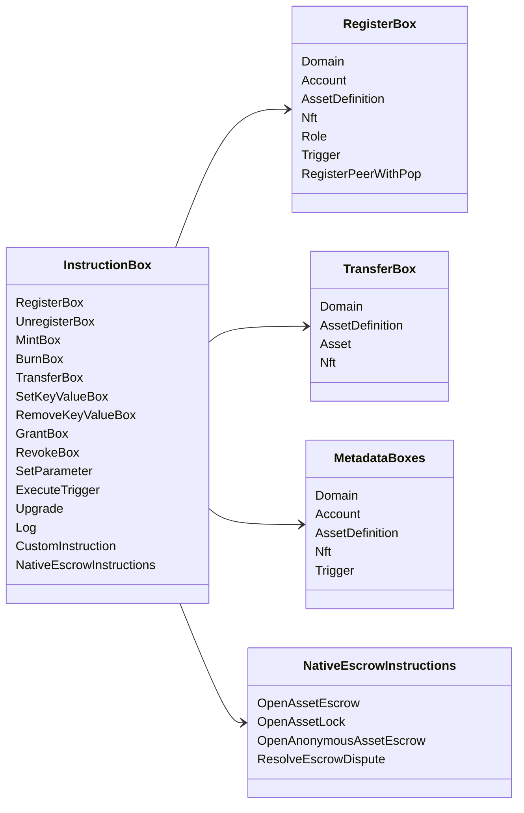

# Iroha تعليمات خاصة {#iroha-special-instructions}

نموذج البيانات الحالي يكشف عن هذه العائلات التدريبية المدمجة:

|التعليمات |الإختلافات|
| --- | --- |
| [`RegisterBox`](/ar/blockchain/instructions.md#un-register) | `Domain`, `Account`, `AssetDefinition`, `Nft`, `Role`, `Trigger`, `RegisterPeerWithPop` |
| [`UnregisterBox`](/ar/blockchain/instructions.md#un-register) | `Peer`, `Domain`, `Account`, `AssetDefinition`, `Nft`, `Role`, `Trigger` |
| [`MintBox`](/ar/blockchain/instructions.md#mint-burn) |الرقمية `Asset` ، تسبب التكرار |
| [`BurnBox`](/ar/blockchain/instructions.md#mint-burn) |الرقمية `Asset` ، تسبب التكرار |
| [`TransferBox`](/ar/blockchain/instructions.md#transfer) |`Domain`، `AssetDefinition`، العدد `Asset`، `Nft` |
| [`SetKeyValueBox`](/ar/blockchain/instructions.md#setkeyvalue-removekeyvalue) | `Domain`, `Account`, `AssetDefinition`, `Nft`, `Trigger` البيانات الأساسية |
| [`RemoveKeyValueBox`](/ar/blockchain/instructions.md#setkeyvalue-removekeyvalue) | `Domain`, `Account`, `AssetDefinition`, `Nft`, `Trigger` البيانات الأساسية |
| [`GrantBox`](/ar/blockchain/instructions.md#grant-revoke) |الإذن بالحساب، الدور الحسابي، الإذن بالدور |
| [`RevokeBox`](/ar/blockchain/instructions.md#grant-revoke) |إذن من الحساب، دور من الحساب ، إذن من الدور |
| [`SetParameter`](/ar/blockchain/instructions.md#setparameter) |تحديث معايير سلسلة |
| [`ExecuteTrigger`](/ar/blockchain/instructions.md#executetrigger) |التنفيذ المحفز|
| [`Upgrade`](/ar/blockchain/instructions.md#other-instructions) |تحديث المنفذ |
| [`Log`](/ar/blockchain/instructions.md#other-instructions) |إدخال سجل التنفيذ |
| [`CustomInstruction`](/ar/blockchain/instructions.md#other-instructions) |الحمل المفيد المحدد للجهاز التنفيذي JSON |
| [الاحتفاظ بالأصول الأصلية ](/ar/blockchain/escrow.md) | `OpenAssetEscrow`, `AcceptAssetEscrow`, `MarkEscrowPaymentSent`, `ReleaseAssetEscrow`, `CancelAssetEscrow`, `OpenEscrowDispute`, `ResolveEscrowDispute` |
| [مقفلات الأصول العامة ](/ar/blockchain/escrow.md#generic-asset-locks) |`OpenAssetLock`، `DrawdownAssetLock`، `CancelAssetLock`، `ExpireAssetLock` |
| [الاحتفاظ بالأصول المجهولة ](/ar/blockchain/escrow.md#anonymous-escrow) | `OpenAnonymousAssetEscrow`, `AcceptAnonymousAssetEscrow`, `MarkAnonymousEscrowPaymentSent`, `ReleaseAnonymousAssetEscrow`, `CancelAnonymousAssetEscrow`, `OpenAnonymousEscrowDispute`, `ResolveAnonymousEscrowDispute` |

يمكن أن تسجل وحدات Iroha 3 إضافية أنواع تعليمات محددة للمجال من خلال سجل التعليمات. للحصول على قائمة مستوى الخطة التي تم إنشاؤها من شجرة المصدر الحالية ، انظر [نموذج البيانات Schema](./data-model-schema.md).

::: details الرسم البياني: التعليم الأساسي للعائلات

:::
