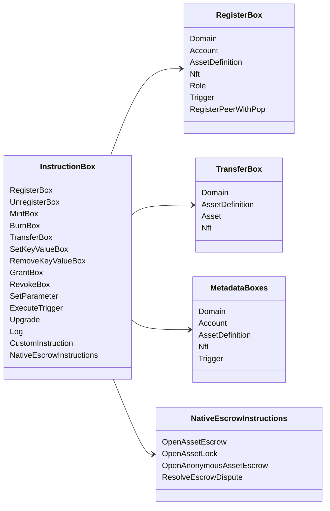

# Iroha التعليمات الخاصة {#iroha-special-instructions}

النموذج الحالي للبيانات يعرض هذه العائلات التدريبية المدمجة:

| التعليمات | الإختلافات |
| --- | --- |
| [`RegisterBox`](/ar/blockchain/instructions.md#un-register) | `Domain`, `Account`, `AssetDefinition`, `Nft`, `Role`, `Trigger`, `RegisterPeerWithPop` |
| [`UnregisterBox`](/ar/blockchain/instructions.md#un-register) | `Peer`, `Domain`, `Account`, `AssetDefinition`, `Nft`, `Role`, `Trigger` |
| [`MintBox`](/ar/blockchain/instructions.md#mint-burn) | العدد `Asset`, تكرارات الزناد |
| [`BurnBox`](/ar/blockchain/instructions.md#mint-burn) | العدد `Asset`, تكرارات الزناد |
| [`TransferBox`](/ar/blockchain/instructions.md#transfer) | `Domain`, `AssetDefinition`, العدد `Asset`, `Nft` |
| [`SetKeyValueBox`](/ar/blockchain/instructions.md#setkeyvalue-removekeyvalue) | `Domain`, `Account`, `AssetDefinition`, `Nft`, `Trigger` البيانات |
| [`RemoveKeyValueBox`](/ar/blockchain/instructions.md#setkeyvalue-removekeyvalue) | `Domain`, `Account`, `AssetDefinition`, `Nft`, `Trigger` البيانات |
| [`GrantBox`](/ar/blockchain/instructions.md#grant-revoke) | إذن للحساب، دور الحساب، إذن للدور |
| [`RevokeBox`](/ar/blockchain/instructions.md#grant-revoke) | إذن من حساب، دور من حساب، إذن من دور |
| [`SetParameter`](/ar/blockchain/instructions.md#setparameter) | تحديث معايير السلسلة |
| [`ExecuteTrigger`](/ar/blockchain/instructions.md#executetrigger) | التنفيذ |
| [`Upgrade`](/ar/blockchain/instructions.md#other-instructions) | تحديث المنفذ |
| [`Log`](/ar/blockchain/instructions.md#other-instructions) | إدخال سجل التنفيذ |
| [`CustomInstruction`](/ar/blockchain/instructions.md#other-instructions) | محددة للمنفذ JSON الحمولة المفيدة |
| [الاحتفاظ بالأصول الأصلية](/ar/blockchain/escrow.md) | `OpenAssetEscrow`, `AcceptAssetEscrow`, `MarkEscrowPaymentSent`, `ReleaseAssetEscrow`, `CancelAssetEscrow`, `OpenEscrowDispute`, `ResolveEscrowDispute` |
| [مقفلات الأصول العامة](/ar/blockchain/escrow.md#generic-asset-locks) | `OpenAssetLock`, `DrawdownAssetLock`, `CancelAssetLock`, `ExpireAssetLock` |
| [الاحتفاظ بالأصول المجهولة](/ar/blockchain/escrow.md#anonymous-escrow) | `OpenAnonymousAssetEscrow`, `AcceptAnonymousAssetEscrow`, `MarkAnonymousEscrowPaymentSent`, `ReleaseAnonymousAssetEscrow`, `CancelAnonymousAssetEscrow`, `OpenAnonymousEscrowDispute`, `ResolveAnonymousEscrowDispute` |

إضافية Iroha 3 قد تسجل الوحدات أنواع التعليمات الخاصة بالمنطقة
من خلال سجل التعليمات. بالنسبة لقائمة مستوى مخطط التي تم إنشاؤها من
شجرة المصدر الحالية، انظر [نظام نموذج البيانات](./data-model-schema.md).

::: details الرسم البياني: التعليم الأساسي للعائلات

:::
