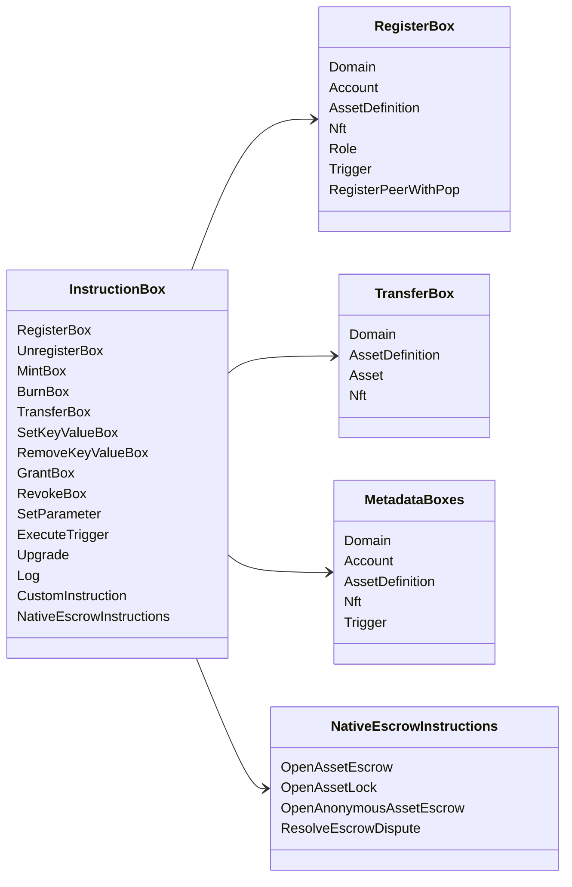

# Iroha عمليات التعليمات {#iroha-special-instructions}

يعرض نموذج البيانات الحالي عائلات التعليمات المدمجة هذه:

|تعليمات|الأنواع|
| --- | --- |
| [`RegisterBox`](/ar/blockchain/instructions.md#un-register) | `Domain`، `Account`، `AssetDefinition`، `Nft`، `Role`، `Trigger`، `RegisterPeerWithPop` |
| [`UnregisterBox`](/ar/blockchain/instructions.md#un-register) | `Peer`، `Domain`، `Account`، `AssetDefinition`، `Nft`، `Role`، `Trigger` |
| [`MintBox`](/ar/blockchain/instructions.md#mint-burn) |رقمي `Asset`، تكرار المحفزات|
| [`BurnBox`](/ar/blockchain/instructions.md#mint-burn) |رقمي `Asset`، تكرار المحفزات|
| [`TransferBox`](/ar/blockchain/instructions.md#transfer) | `Domain`، `AssetDefinition`، رقمي `Asset`، `Nft` |
| [`SetKeyValueBox`](/ar/blockchain/instructions.md#setkeyvalue-removekeyvalue) |البيانات الوصفية `Domain`، `Account`، `AssetDefinition`، `Nft`، `Trigger`|
| [`RemoveKeyValueBox`](/ar/blockchain/instructions.md#setkeyvalue-removekeyvalue) |البيانات الوصفية `Domain`، `Account`، `AssetDefinition`، `Nft`، `Trigger`|
| [`GrantBox`](/ar/blockchain/instructions.md#grant-revoke) | `Permission` (`Grant<Permission, Account>`), `Role` (`Grant<RoleId, Account>`), `RolePermission` (`Grant<Permission, Role>`) |
| [`RevokeBox`](/ar/blockchain/instructions.md#grant-revoke) | `Permission` (`Revoke<Permission, Account>`), `Role` (`Revoke<RoleId, Account>`), `RolePermission` (`Revoke<Permission, Role>`) |
| [`SetParameter`](/ar/blockchain/instructions.md#setparameter) |تحديث معلمة السلسلة|
| [`ExecuteTrigger`](/ar/blockchain/instructions.md#executetrigger) |تنفيذ المحفز|
| [`Upgrade`](/ar/blockchain/instructions.md#other-instructions) |ترقية المنفذ|
| [`Log`](/ar/blockchain/instructions.md#other-instructions) |إدخال سجل المنفذ|
| [`CustomInstruction`](/ar/blockchain/instructions.md#other-instructions) |الحمولة الخاصة بالمنفذ التنفيذي JSON|
| [حساب ضمان للأصل الأصلي](/ar/blockchain/escrow.md) | `OpenAssetEscrow`، `AcceptAssetEscrow`، `MarkEscrowPaymentSent`، `ReleaseAssetEscrow`، `CancelAssetEscrow`، `OpenEscrowDispute`، `ResolveEscrowDispute` |
| [أقفال الأصول العامة](/ar/blockchain/escrow.md#generic-asset-locks) | `OpenAssetLock`، `DrawdownAssetLock`، `CancelAssetLock`، `ExpireAssetLock` |
| [حساب ضمان للأصول المجهولة](/ar/blockchain/escrow.md#anonymous-escrow) | `OpenAnonymousAssetEscrow`، `AcceptAnonymousAssetEscrow`، `MarkAnonymousEscrowPaymentSent`، `ReleaseAnonymousAssetEscrow`، `CancelAnonymousAssetEscrow`، `OpenAnonymousEscrowDispute`، `ResolveAnonymousEscrowDispute` |
| [التسوية الخاصة الذرية](/ar/blockchain/instructions.md#atomic-private-settlement) | `ActivatePrivateSettlementPoolV1`، `RotatePrivateSettlementPoolPolicyV1`، `FinalizeAtomicPrivateSettlementV1`، `AbortAtomicPrivateSettlementV1` |

قد تقوم وحدات Iroha 3 الإضافية بتسجيل أنواع تعليمات خاصة بالنطاق من خلال سجل التعليمات. بالنسبة لمخطط العقدة المخول والأمر الذي يلتقطه، انظر [مخطط نموذج البيانات](./data-model-schema.md).

::: details مخطط: عائلات التعليمات الأساسية

:::
