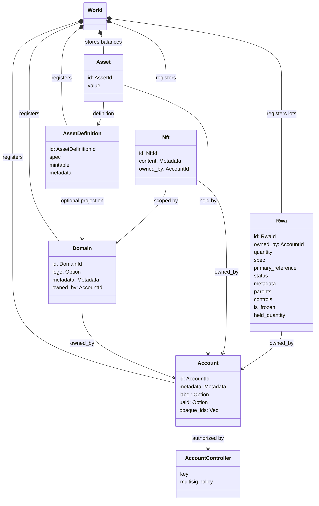
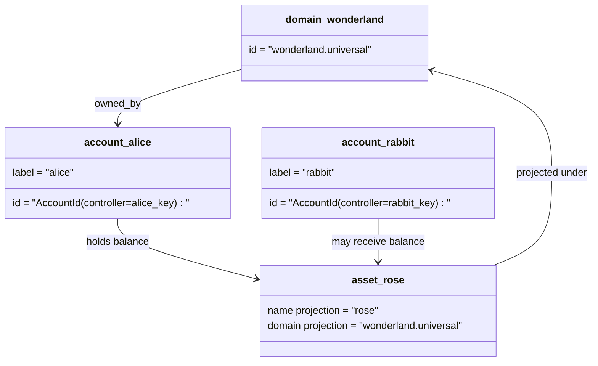

# Məlumat Modeli {#data-model}

Iroha blokçeyn jurnal vəziyyətini `World`da saxlayır. Onun ilk buraxılış məlumat modeli aşağıdakı tək protokol-standart identitetlər və vahidləri istifadə edir:

- domenlər məlumat sahəsi-səlahiyyətli olur, məsələn `payments.universal`
- hesablar tək protokol-standart və domensizdir; hesab ID-si hesab nəzarətçisindən alınır
- aktiv tərifləri bir domen/ad proyeksiyasını saxlaya bilər, amma onların tək protokol-standart mətn ünvanı şəffaf olmayan Base58 identifikatorudur
- aktivlər müəyyən bir aktiv tərifi üçün hesablar tərəfindən saxlanılan balanslardır
- NFTs domenlə dəqiqləşdirilmiş ID-yə və metadata məzmununa malik, hər birinin yalnız bir sahibi olan qeydlərdir
- RWAs mövcud sahib, miqdar, mənşə, metadatalar, saxlama, dondurma və həyat dövrü idarəetmələri ilə off-chain aktivləri təmsil edən yaradılmış ID-lərdir

## Nümunə {#example}

Iroha 3 şəbəkəsində, `wonderland.universal` `universal` məlumat sahəsinin içində bir domendir. Bu nümunədəki tək protokol-standart hesablar öz açarları və ya siyasətləri ilə idarə olunur və domen-siz I105 hesab ID-ləri kimi kodlaşdırılır. Oxuna bilən etiketlər, məsələn, `alice@wonderland.universal`, həmin ID-lərə bağlı ayrı təxəllüslərdir. Domen və ad əsasında proqnozlaşdırılmış bir əmlak tərifi hələ də yaradıla bilər. məsələn, `rose` `wonderland.universal`-də, protokol ötürülməsində istifadə olunan tək protokol-standart aktiv təyinat ünvanı isə yaradılmış Base58 ünvanıdır.

## Ləqəblər {#aliases}

Aliaslər insan qarşısında görünən adlardır və tək protokol-standartlı blokçeyn dəftər identifikatorlarının üzərinə yerləşdirilir. Onlar API, CLI, cüzdan və kəşfiyyat sərhədlərində faydalıdır, lakin tək protokol-standartlı ID-lər sərt blokçeyn dəftəri sahələrində saxlanan sabit identifikator olaraq qalır.

|Hədəf|tək protokol-standart hədəf| Ləqəb sözün mənası |Dəstək modeli|
| -------------- | --------------------------------------------------- | ------------------------------------------------------ | ----------------------------------------------------------------------------- |
|İstifadəçi hesabı|domen olmayan `AccountId` kimi kodlanmış I105 ünvanı olaraq| `name@domain.dataspace` və ya `name@dataspace`            | `AccountAlias`; əsas ləqəb `Account.label`dir, əlavə ləqəblər isə bindings-dir |
|Aktivin tərifi|tək protokol-standart `AssetDefinitionId` Base58 ünvan| `name#domain.dataspace` və ya `name#dataspace`            | `AssetDefinitionAlias` bir aktiv tərifinə bağlı |
|Müqavilə|tək protokol-standart Bech32m `ContractAddress`| `name::domain.dataspace` və ya `name::dataspace`          | `ContractAlias` yerləşdirilmiş müqavilə ünvanına bağlandı|
|Domen adı| `DomainId` `domain.dataspace` formasında| `domain.dataspace` | SNS `domain` ad sahəsi qeydi|
|Məlumat məkanı adı|aktiv Nexus kataloqdan rəqəmsal `DataSpaceId`| `universal`, `paynet` və ya `zk` kimi məlumat məkanı aliası|SNS `dataspace` ad sahəsi qeydi ilə birlikdə aktiv məlumat sahəsi kataloqu|

Hesab ləqəbləri istifadəçiyə görünən hesab adlarıdır. Onlar hesabın açarlarının dəyişdirilməsindən qorunur, çünki ləqəb aktiv hesab ID-sinə dünya vəziyyəti indeksləri və hesab açar dəyişdirmə qeydləri vasitəsilə işarə edir. `SetPrimaryAccountAlias` hesabın əsas etiketi üçün, `SetAccountAliasBinding` əlavə qeyri-əsas ləqəblər üçün, və `FindAccountByAlias` və ya `FindAliasesByAccountId` isə oxumaq üçün istifadə edin. Hesab ləqəbləri adətən aktiv SNS hesab-ləqəb icarəsi tələb edir, bu icarə `AcquireAccountAliasLease` ilə əldə edilir və `RenewAccountAliasLease` ilə yenilənir.

Əmlak ləqəbləri fərdi hesab balanslarını deyil, əmlak təyinatlarını adlandırır. Əmlak ləqəbləri və müqavilə ləqəbləri oxuna bilən bir addan mövcud olan tək bir protokol-standart hədəfə birbaşa bağlamalardır. Aktiv ləqəbləri `SetAssetDefinitionAlias` ilə təyin edilir; ləqəb adı seqmenti aktiv tərifi göstərilən adla və ya proqnozlaşdırılmış tərif adı ilə uyğun olmalıdır. Müqavilə ləqəbləri `SetContractAlias` ilə təyin edilir; Təxəllüs dataspace müqavilə ünvanında kodlaşdırılmış dataspace ilə uyğun olmalıdır. Hər iki bağlama `lease_expiry_ms` daşıya bilər; müddət başa çatdıqdan sonra, güzəşt pəncərəsi bitdikdə həll etməyi dayandırır və dünya vəziyyəti indekslərindən silinir.

Domenlərin ayrıca `DomainAlias` obyekti yoxdur. Domen identifikatoru artıq `payments.universal` kimi dataspace-ə uyğunlaşdırılmış addır. SNS kirayə mülkiyyətini izləyir `domain` ad sahəsindəki domen adları üçün və `dataspace` ad sahəsindəki verilənlər məkanı ləqəbləri üçün. Qorunan `universal` verilənlər məkanı ləqəbi müəyyən edilmiş olaraq qalmalıdır.

## Əlaqəli sənədlər {#related-docs}

|Mövzu|Haraya getmək|
| -------------------------------------- | ------------------------------------------- |
|Domenlər| [Domenlər](/az/blockchain/domains.md)           |
|Hesablar| [Hesablar](/az/blockchain/accounts.md)         |
|Aktivlər| [Aktivlər](/az/blockchain/assets.md)             |
| NFTs | [NFTs](/az/blockchain/nfts.md)                 |
|Real dünya aktivləri| [Həqiqi Dünyada Aktivlər](/az/blockchain/rwas.md)    |
|Metaməlumat| [Metaməlumat](/az/blockchain/metadata.md)         |
|Qeydiyyat və köçürmə təlimatları| [Təlimatlar](/az/blockchain/instructions.md) |
|proqram icra mühiti icazələri| [İcazələr](/az/blockchain/permissions.md) |
|Adlandırma qaydaları| [Adlandırma qaydaları](/az/reference/naming.md)        |
