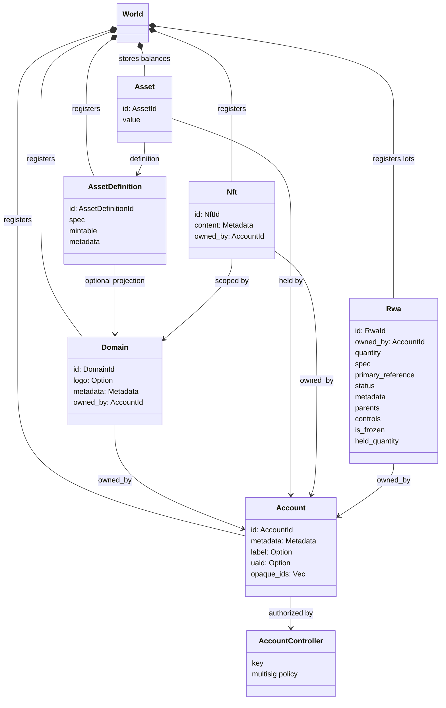
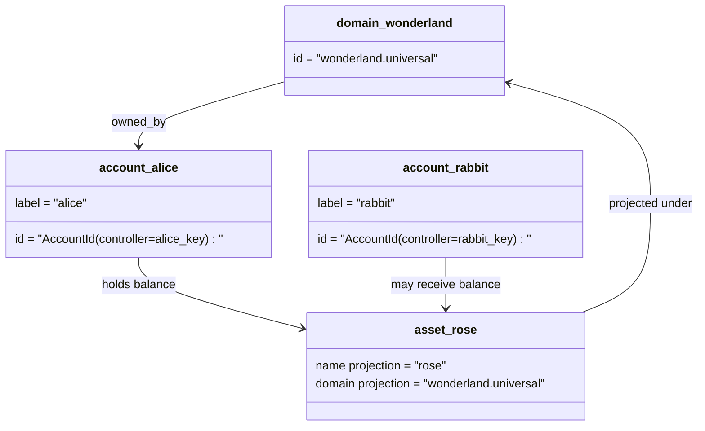

# Məlumat modeli {#data-model}

Iroha `World` kitabının dövlətini saxlayır. Onun ilk buraxılış məlumat modeli aşağıdakı kanonik kimlikləri və qurumları istifadə edir:

- domenlər məlumat məkanına uyğunlaşdırılır, məsələn `payments.universal`
- Hesablar kanonik və domensizdir; hesab ID hesab nəzarətçidən alınır.
- aktiv tərifləri bir domen / ad proyeksiyasını saxlaya bilər, lakin onların kanoniki mətni ünvanı qeyri-aşkar Base58 identifikatorudur.
- aktivlər müəyyən bir aktiv təyinatı üzrə hesablarda saxlanan balanslardır.
- NFTs domen təsdiqlənmiş IDs və metadata məzmunlu xüsusi mülkiyyətdə olan qeydlərdir.
- RWAs mövcud sahib, miqdar, mənşəlilik, metadata, saxlama, dondurma və həyat dövrü nəzarətləri ilə zəncirdən kənarda olan aktivləri təmsil edən ID lotlar yaranır.

## Misal {#example}

Bir Iroha 3 şəbəkə, `wonderland.universal` daxilində bir domendir `universal` Bu nümunədəki kanonik hesablar öz açarları və ya siyasətləri ilə idarə olunur və domensiz kimi kodlanır I105 hesab IDs. Oxucu etiketlər: `alice@wonderland.universal` olan şəxslərə bağlı ayrı-ayrı adlar IDs. Proqnozlaşdırılmış aktiv təyinatı hələ də bir domen və addan qurula bilər, məsələn `rose` ədəd `wonderland.universal`, Qəzetdə istifadə olunan kanonik aktiv təyinatının ünvanı generated Base58 adresidir.

## Əlifbalar {#aliases}

API, CLI, cüzdan və kəşfçi sərhədlərində faydalıdırlar, lakin kanonik IDs ciddi kitab sahələrində saxlanan sabit identifikatorlardır.

|Hədəf |Kanonik hədəf |Alias əslən |Dəstəklənmə modeli |
| -------------- | --------------------------------------------------- | ------------------------------------------------------ | ----------------------------------------------------------------------------- |
|İstifadəçi hesabı |I105 ünvanı kimi kodlanmış domensiz `AccountId` |`name@domain.dataspace` və ya `name@dataspace` |`AccountAlias`; əsas alias `Account.label`, əlavə aliases bağlayıcıdır |
|Mülkiyyətin təyinatı|`AssetDefinitionId` Base58-ci ünvanı |`name#domain.dataspace` və ya `name#dataspace` |`AssetDefinitionAlias` bir aktiv tərifinə bağlıdır |
|Müqavilə |canonical Bech32m `ContractAddress` |`name::domain.dataspace` və ya `name::dataspace` |`ContractAlias` tətbiq olunan müqavilə ünvanına bağlanmışdır |
|Domen adı |`DomainId` `domain.dataspace` formasında |`domain.dataspace` |SNS `domain` ad məkanının qeyd edilməsi |
|Məlumat sahəsi adı |aktiv Nexus kataloqundan sayı `DataSpaceId` |`universal`, `paynet` və ya `zk` kimi məlumat məkanı aliləri |SNS `dataspace` ad məkanı qeydləri və aktiv məlumat məkanı kataloqları |

Hesab aliasları istifadəçiyə qarşı hesab adlarıdır. Onlar aktiv hesabı ID dünya dövləti indeksləri və hesab rekay qeydləri vasitəsilə göstərdiyi üçün hesab geri qaytarılmasına davam edirlər. Hesabın əsas etiketi üçün `SetPrimaryAccountAlias`, əlavə qeyri-başlı adlar üçün `SetAccountAliasBinding` və oxunmalar üçün `FindAccountByAlias` və ya `FindAliasesByAccountId` istifadə edin. Hesab aliasları normal olaraq `AcquireAccountAliasLease` ilə əldə edilmiş və `RenewAccountAliasLease` ilə yenilənmiş aktiv SNS hesab alias kirayəsi tələb edir.

Əmlak aliases, ayrı-ayrı hesab balansları deyil, ad aktivləri tərifləridir. Əsasnamə aliases `SetAssetDefinitionAlias` ilə təyin edilir; alias adı bölməsi aktivin tərif göstərici adına və ya proqnozlaşdırılmış tərif adına uyğun olmalıdır. Müqavilə aliases, `SetContractAlias` ilə təyin olunur; alias məlumat boşluğu müqavilə ünvanında kodlanmış məlumat boşluğuna uyğun olmalıdır. Hər iki bağlama `lease_expiry_ms` daşıya bilər; müddəti bitdikdən sonra zəiflik pəncərəsi keçdikdə həllini dayandırır və dünya dövlətləri indekslərindən silinir.

Domenlərin ayrı bir `DomainAlias` obyekti yoxdur. Bir domen tanıtıcısı artıq `payments.universal` kimi məlumat məkanına uyğun bir addır. SNS `domain` ad sahəsindəki domen adları üçün və `dataspace` ad sahəsində olan məlumat məkanı aliasları üçün icarə mülkiyyətini izləyir. Qeydiyyatlı `universal` məlumat məkanı aliyi müəyyənləşdirilməməlidir.

## Əlaqəli sənədlər {#related-docs}

|Mövzu |Haraya getmək lazımdır?|
| -------------------------------------- | ------------------------------------------- |
|Domenlər | [Domenlər](/az/blockchain/domains.md) |
|Hesablar | [Hesablar](/az/blockchain/accounts.md) |
|Əmlaklar | [Əmlaklar](/az/blockchain/assets.md) |
|NFTs | [NFTs](/az/blockchain/nfts.md) |
|Real dünya aktivləri | [Əsl dünya aktivləri](/az/blockchain/rwas.md) |
|Metadata | [Metadata](/az/blockchain/metadata.md) |
|qeydiyyat və köçürmə təlimatları | [Təlimatlar](/az/blockchain/instructions.md) |
|İndirmə vaxtı icazələri | [icazələr](/az/blockchain/permissions.md) |
|Adlandırma qaydaları | [Adlandırma qaydaları](/az/reference/naming.md) |
