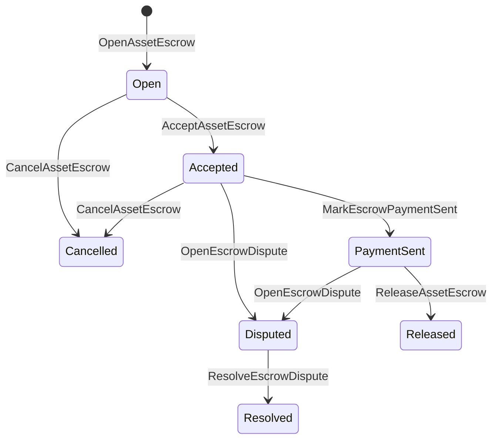

# Dövlət vəsaitinin kreditləşdirilməsi {#native-asset-escrow}

Native escrow, rəqəmsal aktivlər üçün nəşriyyatda idarə olunan saxlama mexanizmidir. Əməllərin tətbiqə məxsus hesaba göndərilməsi və həmin hesabı qorumaq üçün tətbiq koduna etibar etmək əvəzinə, əmanət ISIs dəyərini müəyyən protokol saxlama hesabına köçürüb və əmanət həyat dövrünü dünya səviyyəsində qeyd edir.

Bazarda ödəniş üçün yerli vəsiqədən istifadə edin, Aitai üslubunda zəncirdən kənar ödəniş koordinasiyası, mərhələli kilidlər və kitabın görünməyən həyat dövrü vəziyyətinə ehtiyacı olan qorunan vəsiqə iş axını.

## Konseplər {#concepts}

|Konsepsiya |Təsviri|
| --- | --- |
|`EscrowId` |Çıxışçı tərəfindən seçilmiş identifikator bir hash ilə əhatə olunmalıdır. O, şəffaf və anonim depozitlərdə unikal olmalıdır. |
|`AssetEscrowRecord` |Şəffaf rəqəmsal aktiv vəsiqəsi və ya qapanma qeydləri. |
|`AnonymousAssetEscrowRecord` |Mühafizə olunmuş depozit qeydləri ləğv edənlər, öhdəliklər və sübut əlavələri ilə dəstəklənir. |
|Qoruyucu hesabı |Zəngindən ID, əmanətdən ID və aktivlərin təyin edilməsindən əldə edilmiş müəyyənləşdirmə protokolunun hesabı. |
|Əldə edilən sübutlar |Fakturalar, hökmlər, mesajlar, saxlama manifestləri və ya digər zəncirdən kənarda olan sübutların həcmləri.|

Şəffaf qeydlərdə satıcı, seçimli alıcı, aktivin təyinatı, ümumi məbləği, saxlama hesabı, həyat dövrü statusu, davranış növü, qalan məbləğ, seçimli buraxılış səlahiyyəti, seçməli müddətin bitməsi vaxt möhürü, sübutlar hashləri, zaman möhürləri və seçimli həll detalları yer alır.

Yükləmə məbləği müsbət rəqəmli aktiv miqdarları olmalıdır və aktiv tərifinin rəqəmsal spesifikasiyasına uyğun olmalıdır. Yükləmək və ya qapanma aktiv olduğu müddətdə, ümumi aktiv köçürülməsi saxlama hesabını boşalta bilməz; saxlama çıxışı yolları aşağıda təsvir olunan saxlama ISIs dır.

## Marketplace Escrow {#marketplace-escrow}

Marketplace escrow bir zəncirdən kənar ödəniş və ya çatdırılma iş axını ilə zəncirdəki aktivlərin buraxılmasını əlaqələndirir.



|ISI |Onu kim təqdim edir?|Nəticə |
| --- | --- | --- |
|`OpenAssetEscrow` |Satıcı |Satıcının rəqəmsal aktivini protokol saxlamaqda kilidləyir və `Open` bazar rekordunu yaradır. |
|`AcceptAssetEscrow` |Alıcı |Satıcı alıcını qeydə alır və `Open` -ni `Accepted` -yə keçirir. Satıcı öz əmanətini qəbul edə bilməz. |
|`MarkEscrowPaymentSent` |Qəbul edilmiş alıcı |Alıcı zəncirdən kənar ödənişi göndərdikdən sonra `Accepted` ilə `PaymentSent` köçür. |
|`ReleaseAssetEscrow` |Satıcı |`PaymentSent` -i `Released` -ə köçür və bütün əmanət alınan məbləği alıcıya ötürür. |
|`CancelAssetEscrow` |Satıcı |`Open` və ya `Accepted`-ni `Cancelled`-yə köçür və ödəniş işarə edilmədən əvvəl satıcıya geri qaytarır. |
|`OpenEscrowDispute` |Satıcı və ya qəbul edilmiş alıcı |`Accepted` və ya `PaymentSent` -ni `Disputed` -yə köçür və sübut hashlərini əlavə edir. |
|`ResolveEscrowDispute` |`CanResolveEscrowDispute` hesabı|`Disputed` -dən `Resolved` -ə köçür və məbləği alıcı ilə satıcı arasında bölüşür. |

Mübahisələrin həlli məbləği mənfi olmayan və `buyer_amount + seller_amount` əmanət məbləğinə bərabər olmalıdır.

### Rust Misal {#rust-example}

Bu nümunə satıcı və alıcının hesablarının artıq mövcud olduğunu, aktivin tərifinin rəqəmsal olaraq qeyd edilməsini və satıcının kifayət qədər balansı olduğunu ehtimal edir.

```rust
use iroha::{
    client::Client,
    data_model::{
        isi::escrow::{
            AcceptAssetEscrow, MarkEscrowPaymentSent, OpenAssetEscrow,
            ReleaseAssetEscrow,
        },
        prelude::*,
    },
};
use iroha_crypto::Hash;

fn release_marketplace_escrow(
    seller_client: &Client,
    buyer_client: &Client,
    asset_definition_id: AssetDefinitionId,
) -> eyre::Result<()> {
    let escrow_id = EscrowId::new(Hash::new("docs-marketplace-escrow-001"));

    seller_client.submit_blocking(OpenAssetEscrow::with_evidence_hashes(
        escrow_id,
        asset_definition_id,
        Numeric::from(40_u64),
        vec![Hash::new("invoice:2026-001")],
    ))?;

    buyer_client.submit_blocking(AcceptAssetEscrow::new(escrow_id))?;
    buyer_client.submit_blocking(MarkEscrowPaymentSent::new(escrow_id))?;
    seller_client.submit_blocking(ReleaseAssetEscrow::new(escrow_id))?;

    let record = seller_client.query_single(FindAssetEscrowById::new(escrow_id))?;
    assert_eq!(record.status, AssetEscrowStatus::Released);
    assert_eq!(record.remaining_amount, Numeric::zero());

    Ok(())
}
```

## Ümumi aktivlər kilidləri {#generic-asset-locks}

Mülkiyyət qapaqları eyni saxlama qeyd növündən istifadə edir, lakin alıcı-satıcı təklifləri deyil. Məqsəd hesabı üçün pulları qapalar və seçim yolu ilə pulların çıxarılması üçün ayrı bir buraxılış orqanına ehtiyac duyurlar.

|ISI |Onu kim təqdim edir?|Nəticə |
| --- | --- | --- |
|`OpenAssetLock` |Mənbə hesabı |Bir müsbət məbləği bağlayır, istiqamət yeri qeydə alınan alıcı kimi qeyd edir və vəziyyətini `Locked` olaraq təyin edir. |
|`DrawdownAssetLock` |İstifadə orqanı və ya buraxılış orqanı müəyyən edilmədiyi təqdirdə təyinat yeri|Qalan saxlanmanın bir hissəsini və ya tamamını məqsədəuyğun yerə köçürür. |
|`CancelAssetLock` |Qapı açıcı .|Aktiv bir qapanı ləğv edir və qalan məbləği açıcıya qaytarır. |
|`ExpireAssetLock` |Hər hansı bir əməliyyat orqanı müddətdən sonra |Keçmişdə `expires_at_ms` ilə bağlı bir qapanın müddəti başa çatır və qalan məbləği açarına qaytarılır. |

`DrawdownAssetLock` qeydiyyatı `Locked`-də saxlayır, bir az məbləğ qalır. Qalan məbləğin sıfıra çatdıqda, status `DrawnDown` olur və qeyd bağlanır.

```rust
use iroha::{
    client::Client,
    data_model::{
        isi::escrow::{CancelAssetLock, DrawdownAssetLock, ExpireAssetLock, OpenAssetLock},
        prelude::*,
    },
};
use iroha_crypto::Hash;

fn drawdown_and_close_asset_locks(
    opener_client: &Client,
    destination_client: &Client,
    release_authority_client: &Client,
    asset_definition_id: AssetDefinitionId,
    destination: AccountId,
    release_authority: AccountId,
) -> eyre::Result<()> {
    let trusted_lock_id = EscrowId::new(Hash::new("docs-asset-lock-trusted"));

    opener_client.submit_blocking(OpenAssetLock::with_options(
        trusted_lock_id,
        asset_definition_id.clone(),
        destination.clone(),
        Numeric::from(40_u64),
        Some(release_authority),
        None,
        vec![Hash::new("milestone-plan-v1")],
    ))?;

    release_authority_client.submit_blocking(DrawdownAssetLock::new(
        trusted_lock_id,
        Numeric::from(15_u64),
    ))?;

    let partially_drawn =
        opener_client.query_single(FindAssetEscrowById::new(trusted_lock_id))?;
    assert_eq!(partially_drawn.status, AssetEscrowStatus::Locked);
    assert_eq!(partially_drawn.remaining_amount, Numeric::from(25_u64));

    opener_client.submit_blocking(CancelAssetLock::new(trusted_lock_id))?;
    let cancelled = opener_client.query_single(FindAssetEscrowById::new(trusted_lock_id))?;
    assert_eq!(cancelled.status, AssetEscrowStatus::Cancelled);

    let expiring_lock_id = EscrowId::new(Hash::new("docs-asset-lock-expiring"));
    opener_client.submit_blocking(OpenAssetLock::with_options(
        expiring_lock_id,
        asset_definition_id,
        destination,
        Numeric::from(10_u64),
        None,
        Some(0),
        Vec::new(),
    ))?;

    destination_client.submit_blocking(ExpireAssetLock::new(expiring_lock_id))?;
    let expired = opener_client.query_single(FindAssetEscrowById::new(expiring_lock_id))?;
    assert_eq!(expired.status, AssetEscrowStatus::Expired);

    Ok(())
}
```

Python Hal-hazırda generik kilidlər üçün yüksək səviyyəli köməkçiləri aşkar edir: `open_asset_lock`, `drawdown_asset_lock`, `cancel_asset_lock`, və `expire_asset_lock`. Bazar yerləri və anonim depozitlər üçün Python, canonical istifadə `InstructionBox` JSON vasitəsilə SDK Bu ... JSON qaçış qapısı, ya da bir SDK Bu, birinci dərəcəli depozit qurucularını aşkar edir.

## Mübahisələr {#disputes}

Marketplace escrow mübahisə `Accepted` və ya `PaymentSent`-dən daxil edə bilər. Mübahisəni yalnız qeydə alınmış satıcı və ya alıcısı aça bilər. Hələlik həll etmək üçün birbaşa həlledici hesabına verilən və ya rol vasitəsilə miras alınan `CanResolveEscrowDispute` tələb olunur.

```rust
use iroha::{
    client::Client,
    data_model::{
        isi::escrow::{OpenEscrowDispute, ResolveEscrowDispute},
        prelude::*,
    },
};
use iroha_crypto::Hash;
use iroha_executor_data_model::permission::escrow::CanResolveEscrowDispute;

fn resolve_disputed_escrow(
    admin_client: &Client,
    buyer_client: &Client,
    court_client: &Client,
    court: AccountId,
    escrow_id: EscrowId,
) -> eyre::Result<()> {
    admin_client.submit_blocking(Grant::account_permission(
        Permission::from(CanResolveEscrowDispute),
        court,
    ))?;

    buyer_client.submit_blocking(OpenEscrowDispute::with_evidence_hashes(
        escrow_id,
        vec![Hash::new("buyer-payment-receipt")],
    ))?;

    court_client.submit_blocking(ResolveEscrowDispute::with_evidence_hashes(
        escrow_id,
        Numeric::from(30_u64),
        Numeric::from(10_u64),
        vec![Hash::new("court-judgement-001")],
    ))?;

    let record = admin_client.query_single(FindAssetEscrowById::new(escrow_id))?;
    assert_eq!(record.status, AssetEscrowStatus::Resolved);
    assert_eq!(
        record.resolution.as_ref().map(|resolution| resolution.buyer_amount.clone()),
        Some(Numeric::from(30_u64)),
    );

    Ok(())
}
```

## Anonymous Escrow {#anonymous-escrow}

Anonymous escrow eyni bazar həyat dövrünü istifadə edir, lakin maliyyələşdirmə və bağlama aktivlərinin hərəkəti qorunur. İctimai qeyd hələ də satıcı, alıcı, status, sübut hashləri, vaxt möhürləri və sübutlarla əlaqəli hərəkət qeydlərini saxlayır. Qapalı banknotların içərisindəki miqdarlar və alıcılar öhdəliklər, ləğv edənlər və sübut əlavələri ilə təmsil olunur.

|Şəffaf ISI |Anonim ISI |
| --- | --- |
|`OpenAssetEscrow` |`OpenAnonymousAssetEscrow` |
|`AcceptAssetEscrow` |`AcceptAnonymousAssetEscrow` |
|`MarkEscrowPaymentSent` |`MarkAnonymousEscrowPaymentSent` |
|`ReleaseAssetEscrow` |`ReleaseAnonymousAssetEscrow` |
|`CancelAssetEscrow` |`CancelAnonymousAssetEscrow` |
|`OpenEscrowDispute` |`OpenAnonymousEscrowDispute` |
|`ResolveEscrowDispute` |`ResolveAnonymousEscrowDispute` |

Cüzdan və ya prover alətləri sübut əlavəsini və ictimai girişləri qurmalıdır. Açılış bir escrow öhdəliyini yaradır. Azadlıq, ləğv və anonim mübahisələr həlli tam olaraq bir escro öhdəliyi xərcləməlidir və tədbir üçün tələb olunan alıcı, satıcı və ya bölünmüş çıxışı öhdəliklərini yaratır.

```rust
use iroha::{
    client::Client,
    data_model::{
        isi::escrow::{
            AcceptAnonymousAssetEscrow, MarkAnonymousEscrowPaymentSent,
            OpenAnonymousAssetEscrow,
        },
        prelude::*,
        proof::ProofAttachment,
    },
};
use iroha_crypto::Hash;

fn open_anonymous_escrow(
    seller_client: &Client,
    buyer_client: &Client,
    escrow_id: EscrowId,
    asset_definition_id: AssetDefinitionId,
    funding_nullifiers: Vec<[u8; 32]>,
    escrow_commitment: [u8; 32],
    proof: ProofAttachment,
    root_hint: Option<[u8; 32]>,
) -> eyre::Result<()> {
    seller_client.submit_blocking(OpenAnonymousAssetEscrow::with_evidence_hashes(
        escrow_id,
        asset_definition_id,
        funding_nullifiers,
        escrow_commitment,
        proof,
        root_hint,
        vec![Hash::new("shielded-invoice")],
    ))?;

    buyer_client.submit_blocking(AcceptAnonymousAssetEscrow::new(escrow_id))?;
    buyer_client.submit_blocking(MarkAnonymousEscrowPaymentSent::new(escrow_id))?;

    Ok(())
}
```

Əsas olan qorunmuş əməliyyat modeli üçün [Anonymous Transactions](/az/blockchain/anonymous-transactions.md)-ə baxın.

## SDK istifadə {#sdk-usage}

Escrow dəstəyi SDKs üzrə fərqli şəkildə aşkar edilir. Rust kanonik tiplənmiş məlumat modelinə malikdir. Python hazırda ümumi aktivlər bağlama köməkçilərini aşkar edir. JavaScript və TypeScript Kotodama escrow host zənglərindən istifadə edirlər. Kotlin/JVM və Swift bazar üçün tiplənmiş payload qurucuları və anonim depozitlər təmin edir.

|SDK |Bu səthdən istifadə edin.|Məqsədləri|
| --- | --- | --- |
| [Rust](#rust-sdk) |`iroha::data_model::isi::escrow` |Marketplace escrow, ümumi kilidlər, anonim escrow, sorğu və tədbirlər. |
| [Python](#python-asset-locks) |`Instruction.open_asset_lock`, `TransactionDraft.open_asset_lock` və müştəri `*_and_wait` köməkçiləri |Marketplace və anonim escrow köməkçiləri hələ birinci dərəcəli Python üsullar deyil. |
| [JavaScript / TypeScript](#javascript-and-typescript-kotodama) |`compileKotodamaProgram` -dən `@iroha/iroha-js/kotodama-compiler`|Kotodama müqavilələrin daxilindəki ev sahibi zəngləri. |
| [Kotlin / JVM](#kotlin-and-jvm) |`InstructionTemplate` sinifləri `org.hyperledger.iroha.sdk.core.model.instructions` |Marketplace və anonim escrow xüsusi təlimat şablonları. |
| [Swift / iOS](#swift-and-ios) |`NativeEscrowInstructionBuilders` və `IrohaSDK.build*Escrow*` köməkçilər |Marketplace və anonim escrow Norito JSON təlimat yükləri. |

Aşağıdakı nümunələr təlimatların qurulmasına diqqət yetirir. Hesabın maliyyələşdirilməsi, imzalanma idarə edilməsi və əməliyyatların təqdim edilməsi hər bir SDK üçün normal axını izləyir.

### Rust SDK {#rust-sdk}

Tam yerli əhatə və ya sorğu / hadisə dəstəyinə ehtiyac duyduğunuzda Rust SDK istifadə edin. Yuxarıdakı nümunələr bazar buraxılışını, ümumi qapanma çəkilməsini, mübahisənin həlli və `iroha::data_model::isi::escrow` ilə anonim depozit quruluşunu göstərir.

```rust
use iroha::{
    client::Client,
    data_model::{isi::escrow::OpenAssetEscrow, prelude::*},
};
use iroha_crypto::Hash;

fn open_and_read(
    client: &Client,
    asset_definition_id: AssetDefinitionId,
) -> eyre::Result<AssetEscrowRecord> {
    let escrow_id = EscrowId::new(Hash::new("docs-rust-sdk-escrow"));

    client.submit_blocking(OpenAssetEscrow::new(
        escrow_id,
        asset_definition_id,
        Numeric::from(10_u64),
    ))?;

    client.query_single(FindAssetEscrowById::new(escrow_id))
}
```

### Python Mülkiyyət Qapıları {#python-asset-locks}

Python SDK ümumi aktivlər qapanması üçün birinci dərəcəli köməkçiləri aşkar edir. Onları mərhələ ödənişləri, buraxılış orqanı tərəfindən çəkilmələr, açıcı tərəfindən ləğv edilməsi və müddəti bitdikdən sonra qaytarılma üçün istifadə edin.

```python
client.open_asset_lock_and_wait(
    chain_id="dev-chain",
    authority="<source-account-id>",
    private_key_hex="<source-private-key-hex>",
    escrow_id="merchant-lock-001",
    asset_definition_id="<asset-definition-base58>",
    destination="<destination-account-id>",
    amount="2500",
    release_authority="<trusted-release-account-id>",
    expires_at_ms=1_704_000_000_000,
)

client.drawdown_asset_lock_and_wait(
    chain_id="dev-chain",
    authority="<trusted-release-account-id>",
    private_key_hex="<trusted-release-private-key-hex>",
    escrow_id="merchant-lock-001",
    amount="1000",
)

client.expire_asset_lock_and_wait(
    chain_id="dev-chain",
    authority="<any-account-id>",
    private_key_hex="<any-private-key-hex>",
    escrow_id="merchant-lock-001",
)
```

İki tərəflik kilid üçün `release_authority` buraxın; sonra hədəf hesabı `drawdown_asset_lock` göndərə bilər.

### JavaScript və TypeScript Kotodama {#javascript-and-typescript-kotodama}

İndiki JavaScript SDK hazırda birbaşa yerli escrow əməliyyat qurucularını açıqlamır. üçün JavaScript və ya TypeScript tətbiqlərin tətbiqi Kotodama müqavilələr, escrow host zəngləri Kotodama tərtibçi.

Native escrow host zəngləri açıq giriş ipucuları tələb edir, çünki kompilyer qeyri-şəffaf escrow üçün dar giriş dəstlərini əldə edə bilməz ISIs. Çıxış edən ixrac edilmiş giriş nöqtələrində wildcard ipucularından istifadə edin. `escrow_*` binalar.

```js
import { compileKotodamaProgram } from "@iroha/iroha-js/kotodama-compiler";

const source = `
seiyaku MarketplaceEscrow {
  meta { abi_version: 1; }

  #[access(read="*", write="*")]
  kotoage fn run() permission(Admin) {
    let asset = asset_definition("62Fk4FPcMuLvW5QjDGNF2a4jAmjM");
    let offer = name("aitai_offer");
    let evidence = norito_bytes("00");

    call escrow_open_offer(offer, asset, 10, evidence);
    call escrow_accept(offer);
    call escrow_mark_payment_sent(offer);
    call escrow_release(offer);
  }
}
`;

const compiled = compileKotodamaProgram(source, {
  sourceName: "escrow.ko",
});

if (compiled.diagnostics.length > 0) {
  throw new Error(compiled.diagnostics.map((item) => item.message).join("\n"));
}
```

Mübahisələr üçün `escrow_open_dispute(offer, evidence)` və `escrow_resolve_dispute(offer, buyer_amount, seller_amount, evidence)` istifadə edin. Anonymous escrow host calls accept Norito request payload bytes, for example `anonymous_escrow_open_offer(request)`.

### Kotlin və JVM {#kotlin-and-jvm}

Kotlin/JVM SDK native escrow modellərini xüsusi təlimat şablonları kimi təqdim edir. Hər şablon tələb olunan sahələri təsdiqləyir və əməliyyat qurucusu tərəfindən istifadə olunan kanonik argument xəritəsini açıqlayır.

```kotlin
import org.hyperledger.iroha.sdk.core.model.escrow.NativeEscrowPermissions
import org.hyperledger.iroha.sdk.core.model.instructions.AcceptAssetEscrowInstruction
import org.hyperledger.iroha.sdk.core.model.instructions.MarkEscrowPaymentSentInstruction
import org.hyperledger.iroha.sdk.core.model.instructions.OpenAssetEscrowInstruction
import org.hyperledger.iroha.sdk.core.model.instructions.ReleaseAssetEscrowInstruction
import org.hyperledger.iroha.sdk.core.model.instructions.ResolveEscrowDisputeInstruction

val open = OpenAssetEscrowInstruction(
    escrowId = "escrow-hash",
    assetDefinition = "xor#wonderland",
    amount = "42.5",
    evidenceHashes = listOf("invoice-hash"),
)
val accept = AcceptAssetEscrowInstruction("escrow-hash")
val paid = MarkEscrowPaymentSentInstruction("escrow-hash")
val release = ReleaseAssetEscrowInstruction("escrow-hash")
val resolve = ResolveEscrowDisputeInstruction(
    escrowId = "escrow-hash",
    buyerAmount = "30",
    sellerAmount = "12.5",
    evidenceHashes = listOf("judgement-hash"),
)

println(open.arguments)
println(NativeEscrowPermissions.CAN_RESOLVE_ESCROW_DISPUTE)
```

Anonim şablonlar mövcuddur: `OpenAnonymousAssetEscrowInstruction`, `AcceptAnonymousAssetEscrowInstruction`, `MarkAnonymousEscrowPaymentSentInstruction`, `ReleaseAnonymousAssetEscrowInstruction`, `CancelAnonymousAssetEscrowInstruction`, `OpenAnonymousEscrowDisputeInstruction`, və `ResolveAnonymousEscrowDisputeInstruction`. Android Java zəng edənlər uyğunluğu istifadə edə bilər `NativeEscrowInstructions.*` İnşaatçılardan Android artefakt.

### Swift və iOS {#swift-and-ios}

Swift SDK əmanət təlimatlarını Norito JSON pay yükləri kimi qurur. Birbaşa `NativeEscrowInstructionBuilders` istifadə edin və ya tətbiqinizin artıq bir `IrohaSDK` nümunəsi varsa, ekvivalent `IrohaSDK.build*Escrow*` köməkçisini çağırın.

```swift
import IrohaSwift

let open = try NativeEscrowInstructionBuilders.openAssetEscrow(
    escrowId: "escrow-hash",
    assetDefinition: "xor#wonderland",
    amount: "42.5",
    evidenceHashes: ["invoice-hash"]
)
let accept = try NativeEscrowInstructionBuilders.acceptAssetEscrow(
    escrowId: "escrow-hash"
)
let paid = try NativeEscrowInstructionBuilders.markEscrowPaymentSent(
    escrowId: "escrow-hash"
)
let release = try NativeEscrowInstructionBuilders.releaseAssetEscrow(
    escrowId: "escrow-hash"
)
let resolve = try NativeEscrowInstructionBuilders.resolveEscrowDispute(
    escrowId: "escrow-hash",
    buyerAmount: "30",
    sellerAmount: "12.5",
    evidenceHashes: ["judgement-hash"]
)
```

Anonim Swift qurucuları ləğvçi siyahıları, çıxış öhdəlikləri siyahıları, sübut lüğəti və seçmə `rootHint` dəyərlərini alır. Mübahisə həlli icazəsi nişanı `NativeEscrowPermissions.canResolveEscrowDispute` olaraq mövcuddur.

## Suallar və hadisələr {#queries-and-events}

Status səhifələri, uyğunlaşdırma işləri və dəstək vasitələri üçün escrow sorğularından istifadə edin:

|Sual |Məqsəd|
| --- | --- |
|`FindAssetEscrowById` |`EscrowId` ilə şəffaf bir əmanət və ya kilid oxuyun. |
|`FindAssetEscrows` |Şəffaf depozit və qapı qeydlərini siyahıya alın. |
|`FindAssetEscrowsBySeller` |Satıcı və ya qapı açıcısı tərəfindən açılan qeydləri siyahıya alın. |
|`FindAssetEscrowsByBuyer` |Bir alıcının qəbul etdiyi və ya məqsədəuyğun bir yerə hədəfləyən bazar əmanətlərini siyahıya alın. |
|`FindAssetEscrowsByStatus` |`AssetEscrowStatus` ilə bağlı qeydlər siyahısı. |
|`FindAnonymousAssetEscrowById` |`EscrowId` tərəfindən bir anonim vəsiqəni oxuyun. |
|`FindAnonymousAssetEscrows*` |Bütün qeydlər, satıcı, alıcı və ya status üzrə anonim əmanətlərin siyahısı. |

`EscrowEventFilter` şəffaf yerli əmanət və əmanət yolu ilə kilidləmə tədbirlərinə abunə ola bilərsiniz ID, Satıcı, alıcı, status və tədbirlər siyahısı maskası. `Opened`, `Accepted`, `PaymentSent`, `Released`, `Cancelled`, `Expired`, `Disputed`, və `Resolved`. Anonymous escrow qeydləri anonim escrow sorğuları ilə yoxlanılır.

## Əməliyyat qeydləri {#operational-notes}

- Böyük fakturaları, söhbət qeydlərini, hökmləri və ya audit qruplarını bank hesabının xaricində saxlayın və onların hashlərini sübut olaraq əlavə edin.
- Ərizələrdə sabit `EscrowId` mənşəliyi istifadə edin ki, təkrar cəhdlər eyni təklif üçün ikili əmanətləri yarada bilməz.
- `CanResolveEscrowDispute` yalnız mübahisə prosesini idarə edən hesablara və ya rollara verilir.
- Iroha saxlama və həyat dövrü keçidlərini qeyd edir; o, fiat və ya xarici ödəniş yollarını özbaşına yoxlamır.
