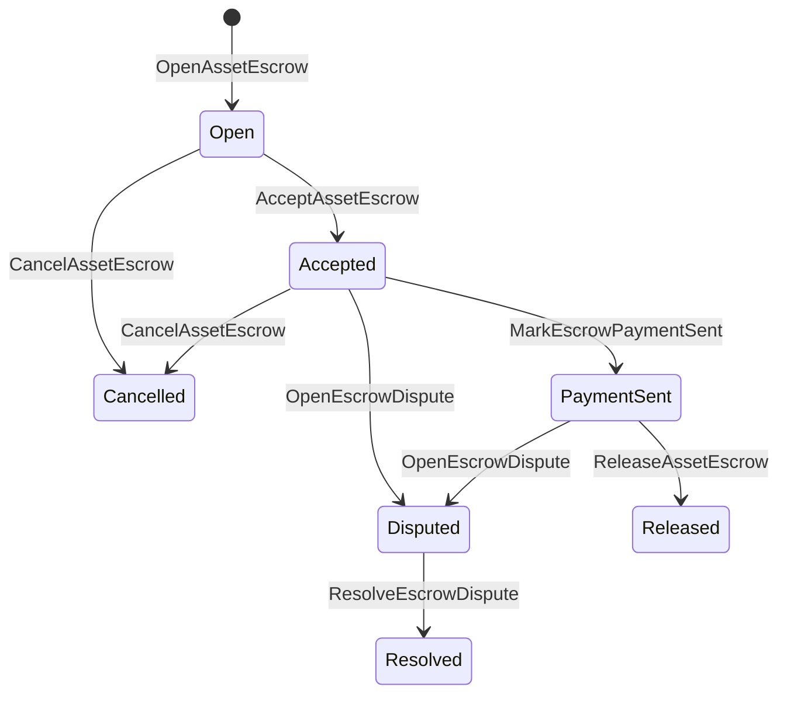

# Yerli Aktiv Depoziti {#native-asset-escrow}

Yerli etibar blokçeyn dəftəri tərəfindən idarə olunan rəqəmsal aktivlər üçün saxlanma mexanizmidir. Aktivləri tətbiq-ə sahib olan hesaba göndərmək və buna üstünlük vermək əvəzinə Həmin hesabı qorumaq üçün tətbiq kodu, agentlik ISIs dəyəri deterministik protokol mülkiyyət hesabına köçürmək və agentlik həyat dövrünü qlobal vəziyyətdə qeyd etmək.

Bazar maliyyə əməliyyatlarının həlli üçün yerli etibarlı depoziti istifadə edin, Aitai tərzi zəncirdən kənar ödəmə koordinasiyası, mərhələli kilidləmələr və blokçeyn jurnalının həyat dövrü vəziyyətində görünməyə ehtiyacı olan qorunan etibarlı depozit iş axınları.

## Konseptlər {#concepts}

|Konsept|Təsvir|
| --- | --- |
| `EscrowId` |müştəri tərəfindən seçilmiş və kriptoqrafik xəşi əhatə edən identifikatorun tələb olunması. Bu, həm şəffaf, həm də anonim əmanətlər üzrə yeganə olmalıdır.|
| `AssetEscrowRecord` |Şəffaf rəqəmsal aktiv depozit və ya kilid qeydi.|
| `AnonymousAssetEscrowRecord` |Nullifikatorlar, kriptoqrafik öhdəlik dəyərləri və sübut əlavələri ilə dəstəklənən qorunan etibarlı rekord.|
|Saxlama hesabı|Zəncir ID-sindən, eskro ID-sindən və aktiv tərifindən törədilmiş deterministik protokol hesabı.|
|Sübut kriptoqrafik xəşlər|Dəlil kriptoqrafik xəşlər vasitəsilə fakturaları, məhkəmə qərarlarını, mesajları, saxlama texniki manifestlərini və ya digər off-chain dəlilləri müəyyən edə bilər. Dəlil məlumatlarının özü depozit qeydinə saxlanılmır.|

Şəffaf qeydlər satıcı, seçmə alıcı, aktiv tərifi, ümumi məbləğ, etibarlı hesab, həyat dövrü statusu, davranış növü, qalan məbləğ, seçmə buraxılış səlahiyyət prinsipi, seçmə müddətin bitmə zaman möhürü, sübut kriptoqrafik həşləri, zaman möhürləri və seçmə qərar detalları daşıyır.

Depozit məbləğləri müsbət ədədi aktiv miqdarları olmalıdır və aktivin tərifindəki ədədi spesifikasiyaya uyğun olmalıdır. Depozit və ya kilid aktiv olduğu müddətdə, ümumi aktiv köçürmələri saxlama hesabını boşalda bilməz; saxlama çıxış yolları aşağıda təsvir edilmiş depozit ISIs-dir.

## Bazar Məhsullarının Etibarlı Saxlanması {#marketplace-escrow}

Bazar yerində depozit, blokzincir üzərində aktivin buraxılmasını kənar ödəniş və ya çatdırılma iş axını ilə əlaqələndirir.



| ISI |Bunu kim təqdim edir|Təsir|
| --- | --- | --- |
| `OpenAssetEscrow` |Satıcı|Satıcının rəqəmsal aktivini protokol mühafizəsinə kilidləyir və bir `Open` bazar qeydi yaradır.|
| `AcceptAssetEscrow` |Alıcı|Alıcıyı qeyd edir və `Open`-ı `Accepted`-ə köçürür. Satıcı öz əmanətini qəbul edə bilməz.|
| `MarkEscrowPaymentSent` |Qəbul edilmiş alıcı|Alıcı off-chain ödənişi göndərdikdən sonra `Accepted` dən `PaymentSent` ə köçürülür.|
| `ReleaseAssetEscrow` |Satıcı|`PaymentSent` ünvanından `Released` ünvanına köçürür və tam girov məbləğini alıcıya ötürür.|
| `CancelAssetEscrow` |Satıcı|`Open` və ya `Accepted` `Cancelled`yə köçürür və ödəniş qeyd olunmadan satıcıya geri ödəyir.|
| `OpenEscrowDispute` |Satıcı və ya qəbul edilmiş alıcı|`Accepted` və ya `PaymentSent` `Disputed`-yə köçürülür və sübut kriptoqrafik xəşləri əlavə olunur.|
| `ResolveEscrowDispute` |`CanResolveEscrowDispute` hesabı| `Disputed`-dən `Resolved`-ə köçürür və məbləği alıcı ilə satıcı arasında bölür.|

Mübahisələrin həlli məbləğləri mənfi ola bilməz və `buyer_amount + seller_amount` depozit məbləği ilə eyni olmalıdır. Sıfır dəyərində maliyyə köçürmə hissələrinə icazə verilir, lakin bütün bölünmə bloklanmış balansı əhatə etməlidir.

### Rust Nümunə {#rust-example}

Bu nümunə satıcı və alıcı hesablarının artıq mövcud olduğunu, aktivin təsvirinin rəqəmsal olaraq qeydiyyatdan keçdiyini və satıcının kifayət qədər balansı olduğunu fərz edir.

```rust
use iroha::{
    client::Client,
    data_model::{
        isi::escrow::{
            AcceptAssetEscrow, MarkEscrowPaymentSent, OpenAssetEscrow,
            ReleaseAssetEscrow,
        },
        prelude::*,
    },
};
use iroha_crypto::Hash;

fn release_marketplace_escrow(
    seller_client: &Client,
    buyer_client: &Client,
    asset_definition_id: AssetDefinitionId,
) -> eyre::Result<()> {
    let escrow_id = EscrowId::new(Hash::new("docs-marketplace-escrow-001"));

    seller_client.submit_blocking(OpenAssetEscrow::with_evidence_hashes(
        escrow_id,
        asset_definition_id,
        Numeric::from(40_u64),
        vec![Hash::new("invoice:2026-001")],
    ))?;

    buyer_client.submit_blocking(AcceptAssetEscrow::new(escrow_id))?;
    buyer_client.submit_blocking(MarkEscrowPaymentSent::new(escrow_id))?;
    seller_client.submit_blocking(ReleaseAssetEscrow::new(escrow_id))?;

    let record = seller_client.query_single(FindAssetEscrowById::new(escrow_id))?;
    assert_eq!(record.status, AssetEscrowStatus::Released);
    assert_eq!(record.remaining_amount, Numeric::zero());

    Ok(())
}
```

## Ümumi Aktiv Kilidləri {#generic-asset-locks}

Aktiv kilidləri eyni mühafizə qeyd növündən istifadə edir, lakin onlar alıcı-satıcı təklifləri deyildir. Onlar vəsaiti təyinat hesabı üçün kilidləyir və istəyə bağlı olaraq vəsaiti çəkmək üçün ayrıca buraxılış icazəsi prinsipi tələb edə bilər.

| ISI |Bunu kim təqdim edir|Təsir|
| --- | --- | --- |
| `OpenAssetLock` |Mənbə hesab|Müsbət məbləği kilidləyir, təyinatı qeyd edən alıcı kimi qeyd edir və statusu `Locked` olaraq təyin edir.|
| `DrawdownAssetLock` |Azad edilmə icazəsi sahibi, yoxsa azad edilmə icazəsi sahibi təyin edilmədikdə təyinat|Qalan mühafizənin bir hissəsini və ya hamısını təyinat yerinə köçürür.|
| `CancelAssetLock` |Qapı açacağı|Aktiv kilidi ləğv edir və qalan məbləği açana qaytarır.|
| `ExpireAssetLock` |Hər hansı bir əməliyyat təsdiqi prinsipi son tarixdən sonra|Keçmişdə `expires_at_ms` ilə bir kilidi müddəti bitirir və qalan məbləği açana geri ödəyir.|

`DrawdownAssetLock` bəzi miqdar qaldığı müddətcə `Locked` qeydini saxlayır. Qalan miqdar sıfıra çatdıqda, vəziyyət `DrawnDown` olur və qeyd bağlanır.

```rust
use iroha::{
    client::Client,
    data_model::{
        isi::escrow::{CancelAssetLock, DrawdownAssetLock, ExpireAssetLock, OpenAssetLock},
        prelude::*,
    },
};
use iroha_crypto::Hash;

fn drawdown_and_close_asset_locks(
    opener_client: &Client,
    destination_client: &Client,
    release_authority_client: &Client,
    asset_definition_id: AssetDefinitionId,
    destination: AccountId,
    release_authority: AccountId,
) -> eyre::Result<()> {
    let trusted_lock_id = EscrowId::new(Hash::new("docs-asset-lock-trusted"));

    opener_client.submit_blocking(OpenAssetLock::with_options(
        trusted_lock_id,
        asset_definition_id.clone(),
        destination.clone(),
        Numeric::from(40_u64),
        Some(release_authority),
        None,
        vec![Hash::new("milestone-plan-v1")],
    ))?;

    release_authority_client.submit_blocking(DrawdownAssetLock::new(
        trusted_lock_id,
        Numeric::from(15_u64),
    ))?;

    let partially_drawn =
        opener_client.query_single(FindAssetEscrowById::new(trusted_lock_id))?;
    assert_eq!(partially_drawn.status, AssetEscrowStatus::Locked);
    assert_eq!(partially_drawn.remaining_amount, Numeric::from(25_u64));

    opener_client.submit_blocking(CancelAssetLock::new(trusted_lock_id))?;
    let cancelled = opener_client.query_single(FindAssetEscrowById::new(trusted_lock_id))?;
    assert_eq!(cancelled.status, AssetEscrowStatus::Cancelled);

    let expiring_lock_id = EscrowId::new(Hash::new("docs-asset-lock-expiring"));
    opener_client.submit_blocking(OpenAssetLock::with_options(
        expiring_lock_id,
        asset_definition_id,
        destination,
        Numeric::from(10_u64),
        None,
        Some(0),
        Vec::new(),
    ))?;

    destination_client.submit_blocking(ExpireAssetLock::new(expiring_lock_id))?;
    let expired = opener_client.query_single(FindAssetEscrowById::new(expiring_lock_id))?;
    assert_eq!(expired.status, AssetEscrowStatus::Expired);

    Ok(())
}
```

Python hazırda ümumi kilidlər üçün yüksək səviyyəli köməkçiləri təqdim edir: `open_asset_lock`, `drawdown_asset_lock`, `cancel_asset_lock` və `expire_asset_lock`. Python-dan bazar yeri və anonim depozit üçün, tək protokol-standart `InstructionBox` JSON istifadə edin SDK'in JSON qaçış qapağı vasitəsilə, və ya birinci dərəcəli əmanətçilər hazırlayan SDK vasitəsilə təqdim edin.

## Münaqişələr {#disputes}

Bazar mötəbəti `Accepted` və ya `PaymentSent` vasitəsilə mübahisəyə daxil ola bilər. Yalnız qeydiyyatdan keçmiş satıcı və ya alıcı mübahisəni aça bilər. Qərarın qəbul edilməsi üçün `CanResolveEscrowDispute` tələb olunur, ya birbaşa qərar qəbul edən hesaba verilir, ya da rol vasitəsilə miras alınır.

```rust
use iroha::{
    client::Client,
    data_model::{
        isi::escrow::{OpenEscrowDispute, ResolveEscrowDispute},
        prelude::*,
    },
};
use iroha_crypto::Hash;
use iroha_executor_data_model::permission::escrow::CanResolveEscrowDispute;

fn resolve_disputed_escrow(
    admin_client: &Client,
    buyer_client: &Client,
    court_client: &Client,
    court: AccountId,
    escrow_id: EscrowId,
) -> eyre::Result<()> {
    admin_client.submit_blocking(Grant::account_permission(
        Permission::from(CanResolveEscrowDispute),
        court,
    ))?;

    buyer_client.submit_blocking(OpenEscrowDispute::with_evidence_hashes(
        escrow_id,
        vec![Hash::new("buyer-payment-receipt")],
    ))?;

    court_client.submit_blocking(ResolveEscrowDispute::with_evidence_hashes(
        escrow_id,
        Numeric::from(30_u64),
        Numeric::from(10_u64),
        vec![Hash::new("court-judgement-001")],
    ))?;

    let record = admin_client.query_single(FindAssetEscrowById::new(escrow_id))?;
    assert_eq!(record.status, AssetEscrowStatus::Resolved);
    assert_eq!(
        record.resolution.as_ref().map(|resolution| resolution.buyer_amount.clone()),
        Some(Numeric::from(30_u64)),
    );

    Ok(())
}
```

## Anonim Əmanət {#anonymous-escrow}

Anonim escrow eyni bazar yeri həyat dövründən istifadə edir, amma maliyyələşdirmə və bağlanma aktivlərinin hərəkəti qorunur. İctimai qeyd hələ də satıcı, alıcı, statusu saxlayır, şahid kriptoqrafik xeshlər, zaman möhürləri və sübutla əlaqəli hərəkət qeydləri. Qorunan qeydlərin içindəki məbləğlər və alıcılar kriptoqrafik öhdəlik dəyərləri, nullifier-lər və sübut əlavə vasitəsilə təmsil olunur.

|Şəffaf ISI|Anonim ISI|
| --- | --- |
| `OpenAssetEscrow` | `OpenAnonymousAssetEscrow` |
| `AcceptAssetEscrow` | `AcceptAnonymousAssetEscrow` |
| `MarkEscrowPaymentSent` | `MarkAnonymousEscrowPaymentSent` |
| `ReleaseAssetEscrow` | `ReleaseAnonymousAssetEscrow` |
| `CancelAssetEscrow` | `CancelAnonymousAssetEscrow` |
| `OpenEscrowDispute` | `OpenAnonymousEscrowDispute` |
| `ResolveEscrowDispute` | `ResolveAnonymousEscrowDispute` |

Cüzdan və ya prover alətləri sübut əlavəsini və ictimai girişləri hazırlamalıdır. Açılış bir ədəd depozit kriptoqrafik öhdəlik dəyəri yaradır. Buraxılış, ləğv, və anonim mübahisələrin həlli mütləq olaraq dəqiq bir eskro kriptoqrafik öhdəlik dəyərini xərcləməli və əməliyyat tərəfindən tələb olunan alıcı, satıcı və ya bölünmüş çıxış kriptoqrafik öhdəlik dəyərlərini yaratmalıdır.

```rust
use iroha::{
    client::Client,
    data_model::{
        isi::escrow::{
            AcceptAnonymousAssetEscrow, MarkAnonymousEscrowPaymentSent,
            OpenAnonymousAssetEscrow,
        },
        prelude::*,
        proof::ProofAttachment,
    },
};
use iroha_crypto::Hash;

fn open_anonymous_escrow(
    seller_client: &Client,
    buyer_client: &Client,
    escrow_id: EscrowId,
    asset_definition_id: AssetDefinitionId,
    funding_nullifiers: Vec<[u8; 32]>,
    escrow_commitment: [u8; 32],
    proof: ProofAttachment,
    root_hint: Option<[u8; 32]>,
) -> eyre::Result<()> {
    seller_client.submit_blocking(OpenAnonymousAssetEscrow::with_evidence_hashes(
        escrow_id,
        asset_definition_id,
        funding_nullifiers,
        escrow_commitment,
        proof,
        root_hint,
        vec![Hash::new("shielded-invoice")],
    ))?;

    buyer_client.submit_blocking(AcceptAnonymousAssetEscrow::new(escrow_id))?;
    buyer_client.submit_blocking(MarkAnonymousEscrowPaymentSent::new(escrow_id))?;

    Ok(())
}
```

Əsas qorunan əməliyyat modelinə baxın, bax [Anonim Əməliyyatlar](/az/blockchain/anonymous-transactions.md).

## SDK İstifadə {#sdk-usage}

Escrow dəstəyi SDKs arasında fərqli şəkildə təqdim olunur. Rust tək protokol-standartlı tiplənmiş məlumat modelinə malikdir. Python hazırda ümumi aktiv-bloklama yardımçıları təqdim edir. JavaScript və TypeScript Kotodama etibar depozit ev sahibi-funksiyası çağırışlarından istifadə edir. Kotlin/JVM və Swift bazar yeri və anonim etibar depoziti üçün yazılı yük qurucuları təmin edir.

| SDK |Bu səthdən istifadə edin|Sahə|
| --- | --- | --- |
| [Rust](#rust-sdk) | `iroha::data_model::isi::escrow` |Bazar yığıcı depoziti, ümumi kilidlər, anonim yığıcı depozit, sorğular və hadisələr.|
| [Python](#python-asset-locks) |`Instruction.open_asset_lock`, `TransactionDraft.open_asset_lock` və müştəri `*_and_wait` köməkçilər|Ümumi aktiv kilidləri. Bazar yeri və anonim depozit köməkçiləri hələ birinci dərəcəli Python metodlar deyildir.|
| [JavaScript / TypeScript](#javascript-and-typescript-kotodama) | `compileKotodamaProgram` -dən `@iroha/iroha-js/kotodama-compiler` |Kotodama müqavilələri daxilində depozit host-funksiyası çağırışları.|
| [Kotlin / JVM](#kotlin-and-jvm) | `InstructionTemplate` dərsləri `org.hyperledger.iroha.sdk.core.model.instructions`-də |Bazar yeri və anonim etibarlı depozit xüsusi təlimat şablonları.|
| [Swift / iOS](#swift-and-ios) | `NativeEscrowInstructionBuilders` və `IrohaSDK.build*Escrow*` köməkçiləri |Bazar yeri və anonim eskro Norito JSON təlimat yükləri.|

Aşağıdakı nümunələr təlimatın hazırlanmasına diqqət yetirir. Hesabın maliyyələşdirilməsi, imza idarəçiliyi və əməliyyatın təqdim edilməsi hər bir SDK üçün normal axını izləyir.

### Rust SDK {#rust-sdk}

Tam yerli əhatə və ya sorğu/ hadisə dəstəyi lazım olduqda Rust SDK-dən istifadə edin. Yuxarıdakı nümunələr bazar buraxılışı, ümumi kilid çəkilməsi, münaqişələrin həlli və `iroha::data_model::isi::escrow` ilə anonim depozit quruluşunu göstərir.

```rust
use iroha::{
    client::Client,
    data_model::{isi::escrow::OpenAssetEscrow, prelude::*},
};
use iroha_crypto::Hash;

fn open_and_read(
    client: &Client,
    asset_definition_id: AssetDefinitionId,
) -> eyre::Result<AssetEscrowRecord> {
    let escrow_id = EscrowId::new(Hash::new("docs-rust-sdk-escrow"));

    client.submit_blocking(OpenAssetEscrow::new(
        escrow_id,
        asset_definition_id,
        Numeric::from(10_u64),
    ))?;

    client.query_single(FindAssetEscrowById::new(escrow_id))
}
```

### Python Əmlak Blokları {#python-asset-locks}

Python SDK ümumi aktiv blokları üçün birinci dərəcəli köməkçiləri təqdim edir. Onları mərhələli ödənişlər, buraxılış icazəsi prinsipi tərəfindən məxrəclər, açan tərəfindən ləğvlər və müddət bitimi geri ödənişləri üçün istifadə edin.

```python
client.open_asset_lock_and_wait(
    chain_id="dev-chain",
    authority="<source-account-id>",
    private_key_hex="<source-private-key-hex>",
    escrow_id="merchant-lock-001",
    asset_definition_id="<asset-definition-base58>",
    destination="<destination-account-id>",
    amount="2500",
    release_authority="<trusted-release-account-id>",
    expires_at_ms=1_704_000_000_000,
)

client.drawdown_asset_lock_and_wait(
    chain_id="dev-chain",
    authority="<trusted-release-account-id>",
    private_key_hex="<trusted-release-private-key-hex>",
    escrow_id="merchant-lock-001",
    amount="1000",
)

client.expire_asset_lock_and_wait(
    chain_id="dev-chain",
    authority="<any-account-id>",
    private_key_hex="<any-private-key-hex>",
    escrow_id="merchant-lock-001",
)
```

İki tərəfli kilid üçün `release_authority` kənara qoyun; sonra təyinat hesabı `drawdown_asset_lock` təqdim edə bilər.

### JavaScript və TypeScript Kotodama {#javascript-and-typescript-kotodama}

JavaScript SDK hazırda birbaşa yerli əmanət əməliyyatı qurucularını təqdim etmir. JavaScript və ya TypeScript tətbiqləri Kotodama müqavilələrini yerləşdirdikdə, əmanət host-funksiyası çağırışlarını Kotodama tərtibçisi ilə tərtib edin.

Yerli escrow host-funksiyası çağırışları açıq giriş göstəriciləri tələb edir, çünki kompilyator qeyri-şəffaf escrow üçün daraldılmış giriş dəstlərini çıxara bilməz ISIs. Texniki çağırış `escrow_*` daxili funksiyaları yaratdığı ixrac edilmiş giriş nöqtələrində joker giriş göstəricilərindən istifadə edin.

```js
import { compileKotodamaProgram } from "@iroha/iroha-js/kotodama-compiler";

const source = `
seiyaku MarketplaceEscrow {
  meta { abi_version: 1; }

  #[access(read="*", write="*")]
  kotoage fn run() permission(Admin) {
    let asset = asset_definition("62Fk4FPcMuLvW5QjDGNF2a4jAmjM");
    let offer = name("aitai_offer");
    let evidence = norito_bytes("00");

    call escrow_open_offer(offer, asset, 10, evidence);
    call escrow_accept(offer);
    call escrow_mark_payment_sent(offer);
    call escrow_release(offer);
  }
}
`;

const compiled = compileKotodamaProgram(source, {
  sourceName: "escrow.ko",
});

if (compiled.diagnostics.length > 0) {
  throw new Error(compiled.diagnostics.map((item) => item.message).join("\n"));
}
```

Mübahisələr üçün `escrow_open_dispute(offer, evidence)` və `escrow_resolve_dispute(offer, buyer_amount, seller_amount, evidence)` istifadə edin. Anonim kirayə mühafizəçi host-funksiyası çağırışları Norito sorğu yük baytlarını qəbul edir, məsələn `anonymous_escrow_open_offer(request)`.

### Kotlin və JVM {#kotlin-and-jvm}

Kotlin/JVM SDK modelləri yerli eskrounu xüsusi təlimat şablonları kimi təqdim edir. Hər bir şablon tələb olunan sahələri yoxlayır və əməliyyat qurucusu tərəfindən istifadə olunan yeganə protokol-standart arqument xəritəsini nümayiş etdirir.

```kotlin
import org.hyperledger.iroha.sdk.core.model.escrow.NativeEscrowPermissions
import org.hyperledger.iroha.sdk.core.model.instructions.AcceptAssetEscrowInstruction
import org.hyperledger.iroha.sdk.core.model.instructions.MarkEscrowPaymentSentInstruction
import org.hyperledger.iroha.sdk.core.model.instructions.OpenAssetEscrowInstruction
import org.hyperledger.iroha.sdk.core.model.instructions.ReleaseAssetEscrowInstruction
import org.hyperledger.iroha.sdk.core.model.instructions.ResolveEscrowDisputeInstruction

val open = OpenAssetEscrowInstruction(
    escrowId = "escrow-hash",
    assetDefinition = "xor#wonderland",
    amount = "42.5",
    evidenceHashes = listOf("invoice-hash"),
)
val accept = AcceptAssetEscrowInstruction("escrow-hash")
val paid = MarkEscrowPaymentSentInstruction("escrow-hash")
val release = ReleaseAssetEscrowInstruction("escrow-hash")
val resolve = ResolveEscrowDisputeInstruction(
    escrowId = "escrow-hash",
    buyerAmount = "30",
    sellerAmount = "12.5",
    evidenceHashes = listOf("judgement-hash"),
)

println(open.arguments)
println(NativeEscrowPermissions.CAN_RESOLVE_ESCROW_DISPUTE)
```

Anonim şablonlar `OpenAnonymousAssetEscrowInstruction`, `AcceptAnonymousAssetEscrowInstruction`, `MarkAnonymousEscrowPaymentSentInstruction`, `ReleaseAnonymousAssetEscrowInstruction`, `CancelAnonymousAssetEscrowInstruction`, `OpenAnonymousEscrowDisputeInstruction` və `ResolveAnonymousEscrowDisputeInstruction` kimi mövcuddur. Android Java tələb olunan müştərilər Android artefaktından uyğun `NativeEscrowInstructions.*` quruculardan istifadə edə bilərlər.

### Swift və iOS {#swift-and-ios}

Swift SDK Norito JSON payloadları kimi depozit təlimatlarını qurur. `NativeEscrowInstructionBuilders`-ı birbaşa istifadə edin, ya da tətbiqiniz artıq bir `IrohaSDK` nümunəsinə sahib olduqda ekvivalent `IrohaSDK.build*Escrow*` köməkçisini çağırın.

```swift
import IrohaSwift

let open = try NativeEscrowInstructionBuilders.openAssetEscrow(
    escrowId: "escrow-hash",
    assetDefinition: "xor#wonderland",
    amount: "42.5",
    evidenceHashes: ["invoice-hash"]
)
let accept = try NativeEscrowInstructionBuilders.acceptAssetEscrow(
    escrowId: "escrow-hash"
)
let paid = try NativeEscrowInstructionBuilders.markEscrowPaymentSent(
    escrowId: "escrow-hash"
)
let release = try NativeEscrowInstructionBuilders.releaseAssetEscrow(
    escrowId: "escrow-hash"
)
let resolve = try NativeEscrowInstructionBuilders.resolveEscrowDispute(
    escrowId: "escrow-hash",
    buyerAmount: "30",
    sellerAmount: "12.5",
    evidenceHashes: ["judgement-hash"]
)
```

Anonim Swift qurucular nullifikator siyahılarını, kriptoqrafik öhdəlik dəyəri siyahılarını, bir sübut lüğətini və isteğe bağlı `rootHint` dəyərləri alır. Münaqişə həll edici icazə tokeni `NativeEscrowPermissions.canResolveEscrowDispute` kimi mövcuddur.

## Sorğular və Tədbirlər {#queries-and-events}

Status səhifələri, uyğunlaşdırma işləri və dəstək vasitələri üçün etibar sorğularından istifadə edin:

|Sorğu|Məqsəd|
| --- | --- |
| `FindAssetEscrowById` | `EscrowId` tərəfindən bir şəffaf ehtiyat və ya kilidi oxuyun.|
| `FindAssetEscrows` |Şəffaf depozit və kilid qeydlərini siyahıya alın.|
| `FindAssetEscrowsBySeller` |Satıcı və ya kilid açan tərəfindən açılan qeydləri siyahıya alın.|
| `FindAssetEscrowsByBuyer` |Alıcı tərəfindən qəbul edilən bazar yeri depozitlərini və ya müəyyən bir istiqaməti hədəfləyən kilidləri siyahıya alın.|
| `FindAssetEscrowsByStatus` |`AssetEscrowStatus` üzrə qeydləri siyahıya alın.|
| `FindAnonymousAssetEscrowById` |`EscrowId` tərəfindən yazılmış bir anonim depozit sənədini oxuyun.|
| `FindAnonymousAssetEscrows*` |Bütün qeydlər, satıcı, alıcı və ya status üzrə anonim depozitləri siyahıya alın.|

`EscrowEventFilter` şəffaf yerli depozit və kilid hadisələrini depozit ID-si, satıcı, alıcı, status və hadisə dəsti maskası üzrə izləyə bilər. Hadisə ailəsinə `Opened` daxildir, `Accepted`, `PaymentSent`, `Released`, `Cancelled`, `Expired`, `Disputed` və `Resolved`. Anonim eskro qeydləri anonim eskro sorğuları vasitəsilə yoxlanılır.

## Əməliyyat qeydləri {#operational-notes}

- Böyük fakturaları, söhbət qeydlərini, hökmləri və ya audit paketlərini girov rekordundan kənarda saxlayın və onların kriptoqrafik xəşlərini sübut kimi əlavə edin.
- Tətbiqlərdə sabit `EscrowId` törəməsindən istifadə edin ki, təkrar cəhdlər eyni təklif üçün təkrarlanan depozitlər yarada bilməsin.
- Yalnız mübahisə prosesini həyata keçirən hesablar və ya rollara `CanResolveEscrowDispute` təyin edin.
- Zəncir xaricində ödəniş təsdiqini tətbiq siyasəti kimi qəbul edin. Iroha mülkiyyət və həyat dövrü keçidlərini qeyd edir; özü fiat və ya xarici ödəniş sistemlərini təsdiqləmir.
