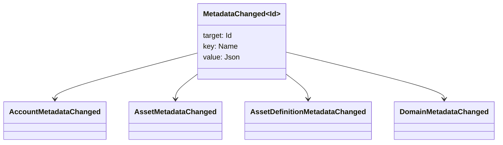

# Metaməlumat {#metadata}

Metaməlumat, blok zənciri dəftər obyektlərinə əlavə edilmiş yoxlanılmış açar-dəyər xəritəsidir. Açarlar `Name` dəyərlər və dəyərlər JSON (`Json`) yük məlumatlarıdır.

Aşağıdakı obyektlər metadatanı daşıya bilər:

- domenlər
- hesablar
- aktivlər
- aktivlərin tərifləri
- NFTs
- RWAs
- tetikləyicilər
- əməliyyatlar

Zəncir blok dəftəri vəziyyətinə aid olan kiçik təsviri və ya indeksləmə sahələri üçün metadata-dan istifadə edin. Böyük yük məlumatları WSV xaricində saxlanmalı və kriptoqrafik xülasə dəyəri, URI və ya SoraFS yolu ilə istinad edilməlidir.

Metadataların, aktivlərin, NFTs, RWAs və ya off-chain yaddaşın seçilməsi ilə bağlı təlimat üçün [Meta məlumatlar və blokçeyn dəftərxanası Saxlama Seçimləri](/az/guide/configure/metadata-and-store-assets.md)-a baxın.

## Bu iş axınını Taira üzərində işə sal {#try-it-on-taira}

Metaməlumat normal resurs oxumaları vasitəsilə görünür. Bu əmrlə hazırda metaməlumatı olan Taira aktiv təyinatları siyahıya alınır:

```bash
curl -fsS 'https://taira.sora.org/v1/assets/definitions?limit=100' \
  | jq '.items[]
    | select((.metadata | length) > 0)
    | {id, name, metadata}'
```

Domenlər və hesablar üçün eyni nümunədən istifadə edin:

```bash
curl -fsS 'https://taira.sora.org/v1/domains?limit=20' \
  | jq '.items[] | select((.metadata // {} | length) > 0)'

curl -fsS 'https://taira.sora.org/v1/accounts?limit=20' \
  | jq '.items[] | select((.metadata // {} | length) > 0)'
```

Boş çıxışı etibarlı nəticə kimi qəbul edin. Bu, mövcud Taira obyekt səhifəsinin metadatalara malik olmamasını nəzərdə tutur, API son nöqtəsinin uğursuz olduğunu yox.

## Metadatanı Yeniləmək {#updating-metadata}

Metaməlumat Iroha Təlimat əməliyyatları ilə dəyişdirilir:

- [`SetKeyValue`](/az/blockchain/instructions.md#setkeyvalue-removekeyvalue) açarı əlavə edir və ya əvəz edir
- [`RemoveKeyValue`](/az/blockchain/instructions.md#setkeyvalue-removekeyvalue) açarı çıxarır

Əməliyyatı təqdim edən səlahiyyət prinsipi aktiv proqram icra mühitinin yoxlayıcısı tərəfindən tələb olunan icazəyə malik olmalıdır. Defolt icazə səthinə baxmaq üçün [İcazə Jetonları](/az/reference/permissions.md) səhifəsinə baxın.

## Tədbirlər {#events}

Məlumat hadisələri metadata dəyişdikdə yayılır. Ümumi hadisə yükü `MetadataChanged<Id>` şəklindədir:



Yalnız bir inteqrasiya üçün vacib olan obyekt növü və ya obyekt ID-si üçün metadatanın hadisələrinə abunə olmaq üçün [məlumat hadisəsi filtrləri](/az/blockchain/filters.md#data-event-filters)-dən istifadə edin.

## Sorğular {#queries}

Metadatan sorğulanan obyektin bir hissəsi olaraq qaytarılır. Məsələn, istifadə edin [`FindAccountById`](/az/reference/queries.md#accounts-and-permissions), [`FindDomainById`](/az/reference/queries.md#domains-and-peers), və ya [`FindAssetDefinitionById`](/az/reference/queries.md#assets-nfts-and-rwas). İstifadə et [`FindNfts`](/az/reference/queries.md#assets-nfts-and-rwas) və ya [`FindNftsByAccountId`](/az/reference/queries.md#assets-nfts-and-rwas) üçün NFTs, və [`FindRwas`](/az/reference/queries.md#assets-nfts-and-rwas) üçün RWA çox. Sonra obyektin metadatası sahəsini oxuyun. NFT sorgu cavabları ortaya çıxarır NFT `content` xəritəni qeydin metadata kimi.

Metaməlumat açarları blokçeyn dəftərxana vəziyyətinin bir hissəsidir, buna görə də onları stabilliyini qoruyun və tətbiqə xas versiya dəyişikliklərini açar adına kodlaşdırmaqdan çəkinin, JSON dəyəri bu versiyanı açıq şəkildə daşıya bildiyi zaman.
