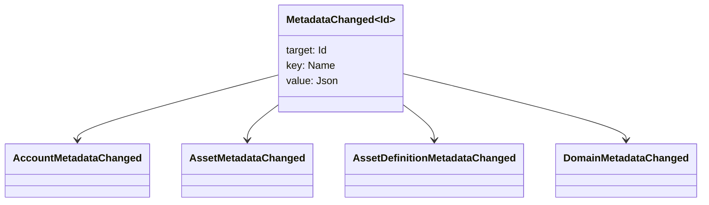

# Metadatalar {#metadata}

Metadata - kitabın obyektlərinə qoşulmuş yoxlanılmış açar-qiymət xəritəsidir. Anahtarlar `Name` dəyərlər və qiymətlər JSON (`Json`) payloadlardır.

Aşağıdakı obyektlər metadata daşıya bilər:

- domenlər
- Hesablar
- aktivlər
- aktivlərin tərifləri
- NFTs
- RWAs
- başlatıcılar
- əməliyyatlar

Başlıq vəziyyətinə aid olan kiçik təsviri və ya indeksləmə sahələri üçün metadatalardan istifadə edin. Böyük paylı yüklər WSV-nin xaricində saxlanılmalı və URI və ya SoraFS yolları ilə istinad edilməlidir.

Metadata, aktivlərə NFTs, RWAs və ya zəncirdən kənar saxlama seçimi ilə bağlı tövsiyələr üçün [Metadata və Ledger Storage Choices](/az/guide/configure/metadata-and-store-assets.md)-ə baxın.

## Taira üzərində sınayın. {#try-it-on-taira}

Metadata normal resurs oxumaları vasitəsilə görünə bilər. Bu əmr hazırda metadata malik olan Taira aktiv təriflərini siyahıya alır:

```bash
curl -fsS 'https://taira.sora.org/v1/assets/definitions?limit=100' \
  | jq '.items[]
    | select((.metadata | length) > 0)
    | {id, name, metadata}'
```

Domenlər və hesablar üçün eyni modeldən istifadə edin:

```bash
curl -fsS 'https://taira.sora.org/v1/domains?limit=20' \
  | jq '.items[] | select((.metadata // {} | length) > 0)'

curl -fsS 'https://taira.sora.org/v1/accounts?limit=20' \
  | jq '.items[] | select((.metadata // {} | length) > 0)'
```

Boş çıxışı etibarlı bir nəticə kimi qəbul edin. Bu, Taira obyektlərinin cari səhifəsində metadata malik olmadığını və son nöqtənin uğursuz olduğu anlamına gəlmir.

## Metadataları yeniləmək {#updating-metadata}

Metadata Iroha xüsusi təlimatları ilə dəyişdirilir:

- [`SetKeyValue`](/az/blockchain/instructions.md#setkeyvalue-removekeyvalue) bir açarı əlavə edir və ya əvəz edir
- [`RemoveKeyValue`](/az/blockchain/instructions.md#setkeyvalue-removekeyvalue) bir açar çıxarır

Əməliyyatı təqdim edən orqan aktiv icra vaxtının təsdiqçisi tərəfindən tələb olunan icazəyə malik olmalıdır. Varsayılan icazə səthinə görə [Izin Tokens](/az/reference/permissions.md) baxın.

## Hadisələr {#events}

Məlumat hadisələri metadata dəyişikliklər zamanı yayılır. Ümumi hadisə pay yükü `MetadataChanged<Id>`:



Bir inteqrasiya üçün əhəmiyyətli olan subyekt tipli və ya obyekti ID üçün yalnız metadata hadisələrindən abunə olmaq üçün [ məlumat hadisələri filtrlərindən ](/az/blockchain/filters.md#data-event-filters) istifadə edin.

## Suallar {#queries}

Metadata sorğu edilən obyektin bir hissəsi olaraq qaytarılır. Məsələn, [`FindAccountById`](/az/reference/queries.md#accounts-and-permissions), [`FindDomainById`](/az/reference/queries.md#domains-and-peers) və ya [`FindAssetDefinitionById` ](/az/reference/queries.md#assets-nfts-and-rwas) istifadə edin. [`FindNfts`](/az/reference/queries.md#assets-nfts-and-rwas) və ya [`FindNftsByAccountId`](/az/reference/queries.md#assets-nfts-and-rwas) NFTs üçün və [`FindRwas`](/az/reference/queries.md#assets-nfts-and-rwas) RWA lotları üçün istifadə edin. Sonra obyektin metadata sahəsini oxuyun. NFT sorğunun cavabları NFT `content` xəritəsini qeyd metadata kimi açıqlayır .

Metadata açarları nəşriyyatın vəziyyətinin bir hissəsidir, buna görə onları sabit saxlayın və JSON dəyəri həmin versiyanı açıq şəkildə daşıya bildiyi zaman tətbiqə aid versiyaların kodlaşdırılmasını qaçırın.
