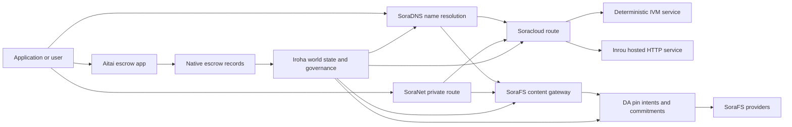

# SORA Nexus Xidmətlər {#sora-nexus-services}

SORA Nexus Iroha 3 ətrafında tətbiqə yönələn xidmət təbəqələri əlavə edir. Bu xidmətlər ayrı blokçeyn dəftərləri deyillər. Onlar Iroha dünya vəziyyəti, Norito texniki manifestlər, idarəetmə qeydləri və Torii marşrut ailələri ilə bərkidilir.

Əlçatanlıq düyün quruluşu və şəbəkə profilindən asılıdır. İstifadə edin [`/openapi.json`](/az/reference/torii-endpoints.md#app-and-sora-route-families) yaradılmış tətbiqi kəşf etmək API hədəf nodunda marşrutlar. İctimai lokal SoraFS CID və yaxşı bilinən marşrutlar yaradılmış sənədin xaricində yerləşdirilir, buna görə yerləşdirməni yoxlayarkən həmin marşrutlara birbaşa baxın.

## Komponent Xəritəsi {#component-map}

|Komponent|Rolu|Əsas səthlər|
| ---------------------- | ------------------------------------------------------------------------------------------------------------------------------------------- | ---------------------------------------------------------------------------------------- |
| Soracloud              |Tətbiq yerləşdirmə, host edilmiş xidmətlər, xüsusi model/işləmə vəziyyəti və xidmət həyat dövrü idarəsi.| `/v1/soracloud/*`, `/api/*`, `iroha soracloud service ...`                                   |
|İnrou|Soracloud canlı HTTP təyyarəsinə ehtiyac duyan xidmət yeniləmələri üçün HTTP proqram icra mühitini yerləşdirdi.| Soracloud proqram icra mühiti konfiqurasiyası, host qabiliyyəti elanları, nüsxə proqram icra mühiti vəziyyəti|
| SoraNet                |Sxemlər üçün məxfilik və nəqliyyat üst qatı, rele traffiki, VPN, sessiyaları əlaqələndirin və yayım marşrutları.| `/v1/connect/*`, `/v1/vpn/*`, SoraNet marşrut metadatası|
|Məlumatın Mövcudluğu (DA)|Mövcudluq sübutu, kriptoqrafik öhdəlik dəyəri və yüklər üçün pin-niyyət təbəqəsi, hansı ki, Nexus icra zolaqları, SoraFS texniki manifestlər və sübut axınları tərəfindən istinad edilir.| `/v1/da/*`, `FindDaPinIntent*`, `[nexus.da]`                                             |
| SoraFS                 |Texniki manifestlər, CAR yükləmələr, pinlənmiş məzmun, qapı götürmələri və əldə olunabilirlik sübutu axınları üçün məzmun-açarlı yaddaş infrastrukturu.| `/v1/sorafs/*`, `/sorafs/*`, `FindSorafsProviderOwner`                                   |
| SoraDNS                |SORA-də yerləşdirilən xidmətlər və məzmun üçün deterministik adlandırma və çözümleyici-təstiq təbəqəsi.| `/v1/soradns/*`, `/soradns/*`, həll edici qovluq hadisələri |
|Aitai|Tətbiq səviyyəsində fiat və aktiv maliyyə əməliyyatlarının həll koridoru, ayrı bir blokçeyn dəftəri ilə deyil, yerli depozit qeydləri ilə dəstəklənir.|`OpenAssetEscrow`, `FindAssetEscrow*`, `EscrowEventFilter`, Kotodama `escrow_*` daxili funksiyalar|



## Ümumi Axınlar {#common-flows}

### Hostinqdə işləyən bölünmüş tətbiq {#hosted-split-application}

Tipik qarışıq-oxu tətbiqi bütün hissələri birlikdə istifadə edir:

1. Statik frontend resursları SoraFS vasitəsilə paketlənir və sabitlənir.
2. Məsələn, ictimai host `<app>.sora`, SoraDNS vasitəsilə qeydiyyatdan keçib.
3. Soracloud `/api/v1/search` və ya `/api/v1/stream` marşrutlarını Inrou HTTP xidmətinə yönləndirir.
4. Soracloud marşrutlarını `/api/auth` və `/api/v1/user` deterministik IVM işləyicilərə yönləndirir.
5. Gizliliyə ehtiyacı olan müştərilər eyni məzmuna və ya API marşrutuna SoraNet dövrəsi vasitəsilə çatmaq mümkündür.

| Yol |Dəstək təyyarəsi|Niyə|
| ----------------- | --------------------- | ------------------------------------------------- |
| `/`               | SoraFS statik məzmun |Təkrar istehsal olunan məzmun kökü və giriş keşi|
| `/assets/*`       | SoraFS statik məzmun |Məzmunla əlaqəli aktivlər və texniki manifesto sübutları|
| `/api/auth*`      | Soracloud IVM         |Təkrar oynatma təhlükəsizliyi olan autentifikasiya və cüzdan çağırış vəziyyəti|
| `/api/v1/user*`   | Soracloud IVM         |İdarəetməyə həssas dövlət dəyişiklikləri|
| `/api/v1/search*` |Soracloud İnrou|Canlı HTTP xidməti, keş, SSE və ya kollektor vəziyyəti|

### Məzmunun Nəşri {#content-publication}

SoraFS nəşr adı onlara işarə etməzdən əvvəl davamlı artefaktlar yaradır:

1. Bir yük və ya qovluq yaradın.
2. Bunu CAR arxivinə yığın və planı hissələrə bölün.
3. Norito texniki manifesti pin siyasəti və idarəetmə məlumatları ilə qurun.
4. Texniki manifesti Torii ünvanına təqdim edin.
5. Hədəf profil açıq sübut tələb etdikdə DA pin niyyəti və ya mövcudluq kriptoqrafik öhdəlik dəyərini qeyd edin.
6. Texniki manifesti SoraDNS adı və ya Soracloud statik ön tərəf marşrutuna bağlayın.

### Şəxsi Fetch və ya Stream Marşrutu {#private-fetch-or-streaming-route}

SoraNet SoraFS və ya Soracloud-nin qarşısında otura bilər:

1. Müştəri adı və ya texniki manifesti həll edir.
2. Qoruyucu qovluq və ya marşrut texniki manifesta giriş və çıxış relaysini seçir.
3. Trafik doldurulur və SoraNet dövrəsi vasitəsilə göndərilir.
4. Çıxış rələsi SoraFS keçidinə, Torii axınına və ya Soracloud marşrutuna çatır.

## Aitayı {#aitai}

Aitai bazar tərzi maliyyə əməliyyatlarının həlli üçün SORA tətbiq koridorudur, burada alıcı və satıcı zəncir xaricində ödənişi koordinasiya edərkən Iroha zəncir üzərindəki aktivlərin saxlanmasını idarə edir. Yeni rəqəmsal aktivlərin saxlanma axınları üçün müqaviləyə məxsus eskro hesabı əvəzinə yerli eskro təlimat ailəsindən istifadə etməlidir.

Yerli vasitəçi custodianlığı blokçeyn qeyd dəftərində saxlayır. Satıcı `OpenAssetEscrow` ilə təklif açır, alıcı qəbul edir və zəncirdən kənar ödənişi `AcceptAssetEscrow` və `MarkEscrowPaymentSent` ilə qeyd edir, və satıcı `ReleaseAssetEscrow` ilə azad edir və ya ödəniş işarələnmədən əvvəl ləğv edir. Əgər alıcı və satıcı razılaşmazsa, hər iki tərəf mübahisə aça bilər və `CanResolveEscrowDispute` ilə təyin olunmuş həll edici kilidlənmiş məbləği bölə bilər.

Tam həyat dövrü, ümumi aktiv kilidləri, anonim depozit, sorğular, hadisələr və Rust nümunələri üçün baxın [Yerli Aktiv Depoziti](/az/blockchain/escrow.md).

|Aitai səthi|Onu istifadə edin|
| ------------------------------------------------------------------------------------------------------------------------------------------------------------- | ----------------------------------------------------------------------------------------- |
| `OpenAssetEscrow`, `AcceptAssetEscrow`, `MarkEscrowPaymentSent`, `ReleaseAssetEscrow`, `CancelAssetEscrow`                                                    |Şəffaf rəqəmsal aktiv təklifləri, o cümlədən XOR denominasiya edilmiş maliyyə əməliyyatı həll axınları.|
| `OpenAnonymousAssetEscrow`, `AcceptAnonymousAssetEscrow`, `MarkAnonymousEscrowPaymentSent`, `ReleaseAnonymousAssetEscrow`, `CancelAnonymousAssetEscrow`       |Mühafizə olunan təkliflər maliyyələşdirmə və bağlanma hərəkətləri üçün sübut əlavələrindən istifadə edir.|
| `OpenEscrowDispute`, `ResolveEscrowDispute`, `OpenAnonymousEscrowDispute`, `ResolveAnonymousEscrowDispute`                                                    |Mübahisənin giriş və məhkəmə üslublu həlli.|
| `FindAssetEscrowById`, `FindAssetEscrowsBySeller`, `FindAssetEscrowsByBuyer`, `FindAssetEscrowsByStatus` |Tətbiq status səhifələri, uyğunlaşdırma işləri və dəstək alətləri.|
| `EscrowEventFilter`                                                                                                                                           |Şəffaf escrow abunəliyini escrow identifikatoru, satıcı, alıcı, status və ya hadisə növü ilə izləyin.|
| Kotodama `escrow_open_offer`, `escrow_accept`, `escrow_mark_payment_sent`, `escrow_release`, `escrow_cancel`, `escrow_open_dispute`, `escrow_resolve_dispute` | Kotodama müqavilə çağırışları V1 depozit sistem çağırışları tərəfindən dəstəklənir. |

İctimai Taira və ya Minamoto istifadəsi üçün, off-chain ödəniş relsini və hər hansı dəstək və ya məhkəmə iş axınını tətbiq siyasəti kimi qəbul edin. Iroha qeyd edir nəzarət vəziyyəti, həyat dövrü hadisələri, sübut kriptoqrafik xeşləri və son aktiv hərəkəti; o, öz-özlüyündə nağd pul maliyyə əməliyyatlarının həllini təsdiqləmir.

## Hədəf Nodunu Yoxlayın {#check-a-target-node}

Bu səhifədən nümunələrdən istifadə etməzdən əvvəl, hədəflədiyiniz nodda marşrut ailəsinin mövcud olduğundan əmin olun:

```bash
export TORII_URL=https://taira.sora.org

curl -fsS "$TORII_URL/openapi.json" \
  | jq '.paths | keys[] | select(test("^/v1/(soracloud|sorafs|soradns|connect|vpn|da)/"))'

curl -fsS -H 'Accept: application/json' "$TORII_URL/status" | jq .
```

`/openapi.json` tək protokol-standart OpenAPI API son nöqtəsidir. Dəqiq marşrut mövcudluğu tikinti xüsusiyyətləri və şəbəkə konfiqurasiyasından asılıdır. Sənəd ictimai yerli SoraFS CID və yaxşı məlum marşrutları siyahıya almır; aşağıda təsvir edildiyi kimi həmin API son nöqtələrə birbaşa baxın.

### Taira Yalnız Oxumaq Üçün Duman Yoxlamaları {#taira-read-only-smoke-checks}

İctimai Taira API son nöqtəsi oxu tərəfi yoxlamaları üçün faydalıdır, lakin onu dəyişən nümunələr üçün istifadə etməyin, əgər siz səlahiyyətli hesab idarə etmirsinizsə və ictimai testnet vəziyyətini dəyişmək niyyətində deyilsinizsə.

```bash
export TORII_URL=https://taira.sora.org

curl -fsS -H 'Accept: application/json' "$TORII_URL/status" \
  | jq '{version: .build.version, peers, blocks, lanes: (.teu_lane_commit | length)}'

curl -fsS "$TORII_URL/v1/vpn/profile" \
  | jq '{available, relay_endpoint, supported_exit_classes}'

curl -fsS "$TORII_URL/v1/sorafs/storage/peers?limit=4" \
  | jq '{gateway_base_url, pin_torii_urls}'

curl -fsS -H 'Accept: application/json' "$TORII_URL/v1/soracloud/status" \
  | jq '.control_plane | {service_count, services: [.services[] | {service_name, current_version}]}'
```

Taira OpenAPI yol xəritəsində sadalanmamış yerləşdirməyə xas idarəetmə planı marşrutlarını göstərə bilər. `/openapi.json`-ı ehtiva etdiyi marşrutlar üçün yaradılmış müqavilə kimi qəbul edin, sonra onları mövcud kimi sənədləşdirmədən əvvəl yerləşdirməyə xas və ictimai yerli SoraFS marşrutlarını birbaşa təsdiqləyin.

## Soracloud {#soracloud}

Soracloud SORA tətbiqi nəzarət təbəqəsidir. O, yerləşdirmə paketlərini, xidmət reviziya məlumatlarını, yönləndirməni, yayım vəziyyətini, səlahiyyətli konfiqurasiya girişlərini, şifrəli xidmət sirlərini, model qeydiyyat qeydlərini, şəxsi nəticələmə sessiyalarını və proqram təminatı icra mühiti protokolu nəticə qeydlərini izləyir.

Soracloud iki icra planı istifadə edir:

| İcra müstəvisi | Proqram icra mühiti | İstifadə sahəsi |
| ---------------------- | ------- | -------------------------------------------------------------------------------------------- |
| `DeterministicService` | `Ivm`   |Avtorizasiya, anbar vəziyyəti, sertifikatlı oxular, sifarişli poçt qutusu işləyiciləri, idarəetməyə həssas dəyişikliklər|
| `HttpService`          | `Inrou` |Canlı HTTP APIs, kollektor-ağırlıqlı iş, keş dəstəklənən xidmətlər, SSE, brauzer-dəstəklənən axınlar|

Nəzarət təyyarəsi səlahiyyətlidir. Yerləşdirmə, yeniləmə, geri qaytarma, konfiqurasiya, gizli məlumat, model və vəziyyət əmrləri Torii vasitəsilə təqdim olunur və yekunlaşdırılmış dünya vəziyyətini oxuyur; onlar ayrıca CLI-yerli güzgüyə güvənmirlər. İctimai marşrutlaşdırma ən uzun prefiksə əsaslanır, buna görə bir qeydiyyatdan keçmiş host trafiki host olunan HTTP marşrutlar və deterministik API marşrutlar arasında bölə bilər.

### Split App üçün yaradılmış başlanğıc struktur {#scaffold-a-split-app}

Split-app şablonu statik frontend və bir host edilmiş canlı API və bir determinist vault/API xidməti yaradır:

```bash
iroha soracloud app init \
  --template split-app \
  --app-name solswap_indexer \
  --app-version 0.1.0 \
  --public-host solswap-indexer.sora \
  --output-dir ./apps/solswap-indexer

iroha soracloud app plan \
  --manifest ./apps/solswap-indexer/app_manifest.json

iroha soracloud app doctor \
  --manifest ./apps/solswap-indexer/app_manifest.json
```

`plan` marşrut bölməsini, uşaq xidmətinin texniki manifestlərini, iş sahəsi skript yollarını və gözlənilən ön uç nəşr rejimini çap edir. `doctor` Torii-ni cəlb etməzdən əvvəl yerli buraxılış müqaviləsini təsdiqləyir.

### Tətbiq Vəziyyətini Yerləşdirin və Yoxlayın {#deploy-and-inspect-app-state}

Buraxılışın hər bir təkrarı üçün bir gələcək SoraFS saxlama epoxunu təkrar istifadə edin. Çünki split-app şablonu bir Inrou xidməti ehtiva edir, onlayn mutasiyadan əvvəl seçilmiş offline provayder mağazalarındakı dəqiq artefaktını təsdiqləyin:

```bash
export SORACLOUD_TORII_URL=https://<soracloud-enabled-torii>
export SORAFS_RETENTION_EPOCH=<future-unix-seconds>

iroha soracloud app preseed \
  --manifest ./apps/solswap-indexer/app_manifest.json \
  --sorafs-retention-epoch "$SORAFS_RETENTION_EPOCH" \
  --inrou-preseed-target <validator-account,peer-id,absolute-store-path> \
  --inrou-preseed-max-capacity-bytes <bytes> \
  --inrou-preseed-helper /absolute/path/to/sorafs-node \
  --inrou-preseed-helper-sha256 <lowercase-sha256> \
  --receipt-out /absolute/path/to/solswap-inrou-preseed.json

iroha soracloud app release \
  --manifest ./apps/solswap-indexer/app_manifest.json \
  --sorafs-retention-epoch "$SORAFS_RETENTION_EPOCH" \
  --inrou-preseed-receipt /absolute/path/to/solswap-inrou-preseed.json \
  --torii-url "$SORACLOUD_TORII_URL"

iroha soracloud app status \
  --manifest ./apps/solswap-indexer/app_manifest.json \
  --torii-url "$SORACLOUD_TORII_URL"
```

Yerinə yetirmə siyasətinə uyğun olaraq hər təminatçı mağaza üçün `--inrou-preseed-target`-i təkrarlayın. `release` texniki sənədləri yaradır və sinxronlaşdırır, proqram həkimini işə salır, bir tək protokol-standartlı tətbiq-infrastruktur mutasiyasını təqdim edir, səlahiyyətli statusu razılaşdırır və elan edilmiş canlı hədəfləri yoxlayır. Tətbiq Inrou artefaktları ehtiva edirsə, əvvəlcədən toxumlanmış protokol nəticə qeydi seçimli deyil.

Artıq yerləşdirilmiş xidmət üçün xidmətə məxsus əmrlərdən istifadə edin:

```bash
iroha soracloud service status \
  --service-name solswap_indexer_live \
  --torii-url "$SORACLOUD_TORII_URL"

iroha soracloud service rollback \
  --service-name solswap_indexer_live \
  --target-version 0.1.0 \
  --torii-url "$SORACLOUD_TORII_URL"
```

### Konfiqurasiya və Gizli Material {#config-and-secret-material}

Soracloud konfiqurasiya və gizli girişlər səlahiyyətli yerləşdirmə vəziyyətinin bir hissəsidir. Lazımi konfiqurasiya və ya gizli bağlamalar çatışmadıqda və ya aktiv texniki manifestlərlə uyğun olmadıqda yerləşdirmə, yeniləmə və geri qaytarma bağlanmış şəkildə uğursuz olur.

```bash
iroha soracloud service config-set \
  --service-name solswap_indexer_live \
  --config-name indexer/public_config \
  --value-file ./config/public-config.json \
  --torii-url "$SORACLOUD_TORII_URL"

iroha soracloud service secret-set \
  --service-name solswap_indexer_live \
  --secret-name indexer/api_key \
  --secret-file ./secrets/api-key.envelope.json \
  --torii-url "$SORACLOUD_TORII_URL"
```

Profiliniz üçün tələb olunan dəqiq təsdiq bayraqları üçün CLI yardımından istifadə edin:

```bash
iroha soracloud service config-set --help
iroha soracloud service secret-set --help
```

## İnrou {#inrou}

Inrou, Soracloud tərəfindən istifadə olunan host edilmiş HTTP proqram təminatı icra mühitidir. Daxili Soracloud proqram təminatı icra mühiti olan bir Iroha node qəbul edilmiş Soracloud layihələrdir yerli materiallaşdırma planına vəziyyəti daxil edir, təyin edilmiş host xidməti replika nüsxələrini loopback xidmətləri kimi işə salır və replika proqram təminatının icra mühiti vəziyyətini səlahiyyətli modelə bildirir.

Collektor-çox APIs, SSE axınları, keş dəstəklənən işləyicilər və ya brauzer-dəstəklənən xidmətlər kimi canlı HTTP səth tələb edən iş yükləri üçün Inrou istifadə edin.

### proqram təminatı icra mühiti tələbləri {#runtime-requirements}

- Konteyner texniki manifes proqram təminatı icra mühiti `Inrou` olmalıdır.
- Xidmət texniki manifestin icra planı `HttpService` olmalıdır.
- `HttpService + Inrou` üçün dəqiq olaraq bir `PersistentRootLeaseVolume` tələb olunur, hansı ki `/` üzərində yerləşdirilməlidir.
- Çoxaldılmış Inrou xidmətləri dəyişkən paylaşılan vəziyyət saxladıqda həmçinin paylaşılan xidmətə və ya gizli icarə yaddaşına ehtiyac duyur.
- İstehsal hostinq nodları yalnız proxy kimi fəaliyyət göstərmək əvəzinə, həqiqi Inrou tutumunu elan etməlidir.

### texniki manifesto Fraqment {#manifest-fragment}

Aşağıdakı nümunə iki texniki manifestin formasını göstərir. Bu, tam bir yerləşdirmə paketi deyil, fraqmentdir.

```jsonc
// container_manifest.json
{
  "schema_version": 1,
  "runtime": { "runtime": "Inrou", "value": null },
  "bundle_path": "/bundles/solswap-indexer.inrou",
  "entrypoint": "/app/bin/launch-indexer.sh",
  "args": [],
  "env": {
    "RUST_LOG": "info",
  },
  "inrou": {
    "schema_version": 1,
    "guest_os": { "guest_os": "DebianSlim", "value": null },
    "guest_images": {
      "x86_64": {
        "kernel_image_path": "/inrou/x86_64/vmlinux",
        "rootfs_image_path": "/inrou/x86_64/rootfs.ext4",
        "initrd_image_path": null,
      },
      "aarch64": {
        "kernel_image_path": "/inrou/aarch64/vmlinux",
        "rootfs_image_path": "/inrou/aarch64/rootfs.ext4",
        "initrd_image_path": null,
      },
    },
  },
  "lifecycle": {
    "start_grace_secs": 60,
    "stop_grace_secs": 30,
    "healthcheck_path": "/api/indexer/v1/health",
  },
}
```

```jsonc
// service_manifest.json
{
  "schema_version": 1,
  "service_name": "solswap_indexer_live",
  "service_version": "0.1.0",
  "execution_plane": { "execution_plane": "HttpService", "value": null },
  "replicas": 2,
  "route": {
    "host": "solswap-indexer.sora",
    "path_prefix": "/api/v1/search",
    "service_port": 8080,
    "visibility": { "visibility": "Public", "value": null },
    "tls_mode": { "tls": "Required", "value": null },
  },
  "lease_volumes": [
    {
      "volume_name": "root_disk",
      "kind": {
        "lease_volume": "PersistentRootLeaseVolume",
        "value": null,
      },
      "storage_class": { "storage_class": "Warm", "value": null },
      "mount_path": "/",
      "max_total_bytes": 8589934592,
    },
    {
      "volume_name": "index_state",
      "kind": { "lease_volume": "ServiceLeaseVolume", "value": null },
      "storage_class": { "storage_class": "Warm", "value": null },
      "mount_path": "/var/lib/solswap-indexer",
      "max_total_bytes": 1073741824,
    },
  ],
}
```

Proqram təminatı icra mühitində, hər bir qoşulmuş icarə həcmi, həcmin adından əldə edilən mühit dəyişənləri vasitəsilə göstərilir:

```text
SORACLOUD_LEASE_VOLUME_ROOT_DISK_DIR
SORACLOUD_LEASE_VOLUME_ROOT_DISK_MOUNT_PATH
SORACLOUD_LEASE_VOLUME_INDEX_STATE_DIR
SORACLOUD_LEASE_VOLUME_INDEX_STATE_MOUNT_PATH
```

## SoraNet {#soranet}

SoraNet məxfilik və nəqliyyat üst-qatı təmin edir. Bu, hədəf qapısına və ya xidmətinə birbaşa qoşulmamalı olan trafiki üçün ötürücü əsaslı marşrutlar təqdim edir. Nəqliyyat dizaynı giriş, orta və çıxış əlaqələndirici rollarından, QUIC nəqliyyatından, səs-küy əsaslı hibrid əl sıxma mexanizmindən, qabiliyyət danışıqlarından, əlaqələndirici kataloqu metadata-sından və sabit ölçülü doldurulmuş hüceyrələrdən istifadə edir.

Nexus yerləşdirmələrində, SoraNet məzmun götürmələri, qapı trafiki, VPN və ya Connect sessiyaları və Norito axın yollarını daşıya bilər. Qovluq qeydləri, müştərilərə Torii RPC və ya axın traffiki üçün uyğun yolları seçməyə imkan verən `norito-stream`-ı dəstəkləyən ötürücüləri göstərə bilər.

### Axın Konfiqurasiyası {#streaming-configuration}

Nexus profili axın marşrutları üçün SoraNet təminatını aktivləşdirir:

```toml
[streaming]
feature_bits = 0b11

[streaming.soranet]
enabled = true
exit_multiaddr = "/dns/torii/udp/9443/quic"
padding_budget_ms = 25
access_kind = "authenticated"
provision_spool_dir = "./storage/streaming/soranet_routes"
provision_spool_max_bytes = 0
provision_window_segments = 4
provision_queue_capacity = 256
```

`access_kind = "read-only"` -i izləyici kimliyini təsdiqləməyə ehtiyac olmayan məzmun yolları üçün istifadə edin. `authenticated` -i çıxış ötürücüsü bilet və ya izləyici kimliyini Torii və ya yerləşdirilmiş xidmətə bağlamadan əvvəl tətbiq etməli olduqda istifadə edin.

### SoraNet-Məlumatlı SoraFS Çəkmək {#soranet-aware-sorafs-fetch}

SoraFS alma CLI brauzer əlavələri və ya SDK adapterlər üçün yerli proksi texniki manifestini yayımlaya və SoraNet marşrut metadatasını yığa bilər. Orkestrator JSON `local_proxy`-ı `"emit_browser_manifest": true` ilə müəyyən etməlidir və CLI `local-quic-proxy` dəstəyi ilə qurulmalıdır. Taira üzərində, ictimai testnet kökündə qəbul edilmiş təminatçı kataloqunu yoxlayın, sonra həmin təminatçı üçün verilmiş qorunan təminatçı tərtibini doldurun:

```bash
export TAIRA_ROOT=https://taira.sora.org
curl -fsS "$TAIRA_ROOT/v1/sorafs/providers?limit=20" | jq '.providers'

: "${TAIRA_SORAFS_PROVIDER_ID:?set the admitted provider ID from Taira discovery}"
: "${TAIRA_SORAFS_GATEWAY_KEY:?set the provider gateway key}"
: "${TAIRA_SORAFS_PROVIDER_URL:?set the advertised provider base URL}"
: "${TAIRA_SORAFS_STREAM_TOKEN_FILE:?set the issued stream-token file}"

cargo run -p sorafs_orchestrator --features=local-quic-proxy --bin=sorafs_cli -- \
  fetch \
  --plan=artifacts/payload_plan.json \
  --manifest-id=<manifest-digest-hex> \
  --orchestrator-config=artifacts/orchestrator.json \
  --provider=name=taira,provider-id="$TAIRA_SORAFS_PROVIDER_ID",gateway-key="$TAIRA_SORAFS_GATEWAY_KEY",base-url="$TAIRA_SORAFS_PROVIDER_URL",stream-token="$(cat "$TAIRA_SORAFS_STREAM_TOKEN_FILE")" \
  --output=artifacts/payload.bin \
  --json-out=artifacts/fetch_summary.json \
  --local-proxy-manifest-out=artifacts/proxy_manifest.json \
  --local-proxy-mode=bridge \
  --local-proxy-norito-spool=storage/streaming/soranet_routes \
  --local-proxy-kaigi-spool=storage/streaming/soranet_routes \
  --local-proxy-kaigi-policy=authenticated \
  --max-peers=2 \
  --retry-budget=4
```

Yekun qeyd təminatçısı hesabatları, bölmə protokolu nəticə qeydləri, yerli proksi metadatası və əldə etmə üçün istifadə olunan effektiv marşrut parametrləri.

### Relay Stimul Təsdiqləyici Siyahısı {#relay-incentive-verifier-roster}

Relay stimulu qəbulu uğursuz-bağlanma vəziyyətindədir. `incentives.enable` doğru olduqda, `incentives.trusted_verifier_ids` ən azı bir standart protokol hesab ID-si ehtiva etməlidir. Siyahı heç vaxt 64-dən artıq olmamalıdır Daxilolmalar, hətta təşviqlər deaktiv edildikdə belə. Proqramın icra mühiti onu deterministik sıralı dəst kimi saxlayır və ötürmə başlanğıcı zamanı etibarsız siyahı geometriyasını rədd edir.

Hər bir `RelayBandwidthProofV1` sabit çərçivə/təqdimat büdcəsi altında dekodlaşdırılır və bütün çərçivəni tam istehlak etməlidir. Sübutun yoxlayıcı hesabı konfiqurasiya edilmiş siyahıda olmalıdır və `RelayBandwidthProofV1::verify_signature()` uğurla tamamlanmalıdır, relé performans toplayıcısını bloklamazdan və ya dəyişdirməzdən əvvəl. Beləliklə, etibarsız kriptoqrafik imzalayan və ya imza-etibarsız/manipulyasiya olunmuş sübut heç bir ölçü təmin etmir və incentive şəkilini yarada bilmir.

## Məlumatın Mövcudluğu (DA) {#data-availability-da}

DA dünyəvi vəziyyətə birbaşa yerləşdirmək üçün çox böyük, çox məxfi və ya çox xidmət-özəl olan yük üçün mövcudluq-sübut qatıdır. O, deterministik kriptoqrafik öhdəlik dəyərlərini və əldə etmə öhdəliklərini qeydə alır ki, təsdiqləyənlər, qapılar və müştərilər vəd edilmiş baytların hansında, hansı siyasətin tətbiq olunduğuna və hansı sübutların müşahidə edildiyinə razılaşa bilsinlər.

DA Kura və ya SoraFS əvəz etmir:

- Kura yekunlaşdırılmış blok axını və razılaşma bərpa məlumatlarını saxlayır.
- SoraFS məzmun-ünvanlı baytları, CAR yükləri və texniki manifestləri saxlayır və təqdim edir.
- DA həmin baytların planlaşdırılmasına, auditinə və reyestr vəziyyəti ilə yenidən əlaqələndirilməsinə imkan verən kriptoqrafik öhdəlikləri, sübut siyasətlərini, sübut açılışlarını və pin niyyətlərini qeyd edir.

Bir tətbiq və ya Nexus icra yolu blokçeyn dəftərində görünən və blokçeyndən kənar məlumatların əldə edilə biləcəyini təmin edən vəd tələb etdikdə DA-dən istifadə edin. Ümumi nümunələrə maliyyə əməliyyatı həlli axınları üçün icra zolağı yükünün kriptoqrafik öhdəlik dəyərləri, dərc olunmuş məzmun üçün SoraFS pin niyyətləri daxildir. sonradan yoxlama üçün saxlanmalı olan sübut paketləri və tətbiq artefaktları, hansının ki, ictimai vəziyyəti tam verilən yükləmə əvəzinə kriptoqrafik xülasə dəyəri olmalıdır.

### Həyat dövrü {#lifecycle}

|Səhnə|Nə qeyd olunub|
| ---------- | ----------------------------------------------------------------------------------------------------------------------------------------------------- |
|Niyyət|Bilet, texniki manifesta istinadı, ləqəb, yol/epoxa/sıra istinadı, saxlama siyasəti və ya təkrarlama hədəfi.|
|kriptografik öhdəlik dəyəri|Kriptoqrafik xülasə dəyəri materialı, texniki manifesto, icra zolağı yükü, sübut paketi və ya məzmun kökünü blok zənciri dəftərində görünən qeydlə bağlayır.|
|Sübut|Mövcudluq səsvermələri, sübut açılışları, təminatçı təsdiqləri və ya hədəf şəbəkə tərəfindən qəbul edilən digər profil-spesifik sübutlar.|
|Sorğu| `FindDaPinIntentByTicket`, `FindDaPinIntentByManifest`, `FindDaPinIntentByAlias` və ya `FindDaPinIntentByLaneEpochSequence` vasitəsi ilə pin-niyyət axtarışları.|

Tipik DA-dəstəklənən nəşr axını belədir:

1. WSV xaricində payload-u qurun və ya qəbul edin, məsələn, SoraFS CAR faylı və ya Nexus icra xətti payload-u.
2. kriptoloji həş və yükü Norito texniki manifestdə və ya marşrut-spesifik kriptoqrafik öhdəlik dəyəri qeydində təsvir edin.
3. Texniki manifesti, pin niyyətini və ya kriptoqrafik öhdəlik dəyərini həmin marşrut ailəsi aktiv olduqda `/v1/da/*` vasitəsilə, ya da şəbəkənin imzalanmış əməliyyat yolu vasitəsilə təqdim edin.
4. Doğrulayıcıların və ya əlçatanlıq təminatçılarının aktiv sübut siyasəti tərəfindən tələb olunan dəlilləri toplamasına icazə verin.
5. Yükləməyə bağlı olan alias, maliyyə əməliyyatının təsdiqi və ya keçid istiqamətini təbliğ etməzdən əvvəl yaranan pin niyyəti və ya kriptoqrafik öhdəlik dəyərini sorğulayın.

### Alqoritmik Model {#algorithmic-model}

DA yükü imzalanmış, təkrar istifadəyə qarşı qorunan, blok indeksli kriptoqrafik öhdəlik dəyərinə çevirir. Əsas alqoritmlər deterministikdir ki, təsdiqçilər və keçidlər eyni baytlardan eyni kriptoqrafik həzm dəyərlərini yenidən hesablaya bilsinlər.

1. Təqdim olunan yükü kanonikləşdirin. Torii `(lane_id, epoch, sequence)`, yük baytları, sıxılma metadatası, parça ölçüsü, silmə profili, saxlama siyasəti və təqdim edən imzası ilə qəbul sorğusunu qəbul edir. Nod, tələb olunduqda gzip, deflate və ya Zstandard yüklərini dekompressiya edir, sonra isə tək protokol-standart bayt uzunluğunun `total_size` ilə bərabər olduğunu təsdiqləyir.
2. İcra xətti və bölmə parametrlərini təsdiqləyin. İcra xətti Nexus icra xətti kataloqunda mövcud olmalıdır. `chunk_size` sıfır olmayan iki qüvvəsi olmalı, ən azı iki bayt olmalıdır, və təyin edilmiş maksimumdan böyük olmamalıdır. Silmə profili məlumat parçalarını və ən azı iki paritet parçasını daxil etməlidir. İcra xətti kataloqu sübut sxemini seçir, ya `merkle_sha256`, ya da `kzg_bls12_381`.
3. Şəbəkə siyasətini tətbiq edin. Düyün blob sinfi üçün konfiqurasiya edilmiş replikasiya və saxlanma əsas xəttini icra edir. İctimai metadatalar mətn şəklində qalmalıdır; yalnız idarəetmə üçün olan metadatalar texniki manifesə yazılmadan əvvəl düyünün konfiqurasiya edilmiş idarəetmə metadataları açarı ilə şifrələnir.
4. Parça və protokolun yekunlaşdırılması. Tək protokol-standart yük `chunk_size`-dən əldə edilmiş sabit ölçülü profil ilə parçalanır. Torii yükün kriptoqrafikasını hesablayır xülasə dəyəri, əldə etmə-dəlilliyi ağacının kökü və hər parça üzrə kriptoqrafik öhdəlik dəyərləri. Məlumat parçaları öz baytları üzərində BLAKE3 kriptoqrafik öhdəlik dəyərlərini daşıyır.
5. Silinmə kriptoqrafik öhdəlik dəyərlərini əlavə edin. Bölmələr `data_shards` zolaqlarına qruplaşdırılır. Son zolaqdakı əskik hüceyrələr paritet hesablaması üçün sıfırla doldurulur. RS(16) paritet sətrlər/qlobal paritet parçalayıcılarını yaradır; ixtiyari `row_parity_stripes` sütun-tipli xətt paritetini matris boyunca əlavə edir. Paritet parçasının kriptoqrafik öhdəlik dəyərləri BLAKE3 kiçik-endian `u16` simvollarının kriptoqrafik xülasələridir.
6. Texniki manifesti qurun. `DaManifestV1` icra zolağını, epoxu, blob sinfini, kodeki, yükün kriptoqrafik həzm dəyərini, parça kökünü, parça ölçüsünü, pozulma profilini, saxlanma siyasətini, kirayə təklifini, parça kriptoqrafik öhdəlik dəyərlərini, optional IPA kriptoqrafik öhdəlik dəyərini qeyd edir, metaməlumat və buraxılma vaxtı. Saxlama bileti deterministikdir: düyün əvvəlcə texniki manifest şablonunu boş bilet ilə kriptoqrafik olaraq hash edir, sonra o barmaq izini son `storage_ticket` kimi geri yazır.
7. Yenidən oynatma münaqişələrini rədd edin. Yenidən oynatma açarı `(lane_id, epoch, sequence, manifest_fingerprint)`-dir. Eyni barmaq izi olan surət idempotentdir. Köhnəlmiş ardıcıllıq və ya fərqli barmaq izi olan eyni ardıcıllıq rədd edilir.
8. **İmzalanmış artefaktları yaradın.** Torii PDP öhdəliyini hesablayır, `DaIngestReceipt` imzalayır, `DaCommitmentRecord` yaradır və manifest, PDP öhdəliyi, öhdəlik qeydi, öhdəlik cədvəli, pin niyyəti, qəbz faylı və qəbz jurnalı üçün spool artefaktlarını yazır. Qəbz kursoru hər `(lane_id, epoch)` üzrə monoton artır.

kriptoloji öhdəlik dəyəri qeydləri blokların daşıdığı şeydir. Bir qeyd bağlayır:

- icra zolağı, dövr, və ardıcıllıq
- zəng edən blob ID-si və tək protokol-standart texniki manifesta kriptoqrafik hash
- icra zolağı sübut sxemi
- parça kökü
- istəyə bağlı KZG kriptoqrafik öhdəlik dəyəri KZG icra zolaqları üçün
- PDP/sübüt kriptoqrafik xülasə dəyəri
- saxlama sinfi və saxlama bileti
- Torii DA təsdiq imzası

Bir blok DA qeydləri yerləşdirmədən əvvəl, blok yığılması yolu paketini yoxlayır:

- `(lane_id, epoch, sequence)` paket daxilində unikal olmalıdır.
- Texniki manifest kriptoqrafik xəşləri paket daxilində sıfır olmayan və unikal olmalıdır.
- Kriptoqrafik öhdəlik dəyəri sübut sxemi konfiqurasiya olunmuş icra zolağı siyasəti ilə uyğun olmalıdır.
- Merkle icra zolaqları KZG kriptoqrafik öhdəlik dəyərlərini rədd edir; KZG icra zolaqları sıfır olmayan KZG kriptoqrafik öhdəlik dəyərinə ehtiyac duyur.
- Pin niyyətləri kanonikləşdirilir, sıralanır və icra xətti, texniki manifesto kriptoqrafik xəş, saxlama bileti, sahib hesabı və ləqəb toqquşma qaydaları üzrə süzülür.

Blok başlığı DA sübut siyasətləri üçün kriptoqrafik xasları, kriptoqrafik öhdəlik dəyərlərini və pin niyyətlərini saxlayır. Üzvlük sübutları üçün kriptoqrafik öhdəlik dəyəri paketi həmçinin yarpaqları tək protokol-standart kriptoqrafik xaslar olan Merkle kökünü təqdim edir. Norito-kodlu `DaCommitmentRecord` dəyərləri. Üst düyünlər sol və sağ uşaqların birləşməsinin kriptoqrafik xəşini yaradır; tək yarpaq dəyişmədən növbəti qatına keçir.

### Sübutun Yoxlanılması {#proof-verification}

`/v1/da/commitments/prove` blokdakı bir kriptoqrafik öhdəlik dəyəri üçün sübut təqdim edə bilər. Sübut kriptoqrafik öhdəlik dəyərini, blok hündürlüyünü, paketdəki indeksini, paket kriptoqrafik hashini, paket uzunluğunu, Merkle kökünü və qardaş yolunu əhatə edir. Yoxlama yoxlamaları:

1. Sübut paketinin kriptoqrafik xəşləri blok başlığının DA bağlama dəyərinin kriptoqrafik xəşinə uyğundur.
2. Sübut blokunun hündürlüyü istinad edilən blok başlığı ilə uyğundur.
3. İndeks sərhədlərdədir və kriptoqrafik öhdəlik dəyəri həmin indeksdəki paket girişinə bərabərdir.
4. İcra zolağı sübut siyasəti kriptoqrafik öhdəlik dəyərini qəbul edir.
5. Kriptografik öhdəlik dəyəri budağından qardaş yolunu qatlamaq verilmiş kökü yenidən qurur.
6. Təkrar inşa edilmiş kök pakət köküne bərabərdir.

Bu, xüsusi bir mövcudluq kriptoqrafik öhdəlik dəyərinin xüsusi bir blok yükündə daxil edildiyini sübut edir; bu isə hər bir nüsxənin hazırda onlayn olduğunu sübut etmir. Canlı əldə ediləbilirlilik ayrı-ayrılıqda SoraFS təminatçı çağırışları, PDP/PoTR yoxlamaları və ya profilə xüsusi mövcudluq sübutu vasitəsilə yoxlanılır.

### Razılıq Üzrə Əlaqə {#consensus-interaction}

Konsensus yükü mövcudluğu məcburidir, amma bu ikinci sonluq protokolu deyil. Lider imzalanmış `PayloadManifest` bütün `3f + 1` komitəyə yayımlayır. İlk cisim və RS16 blok hadisəsi Set A-nı hədəfləyir, onun `2f + 1` üzvləri lider və proksi quyruğu daxil edir. Məhdud eyni-görünüşlü təkrar göndərmə cismin və blokun xidmətini bütün komitəyə genişləndirir.

Səs vermək üçün texniki manifesto və ya qismən parça dəsti kifayət etmir. Hazırlıqdan əvvəl hər bir təsdiqçi parçaları yoxlamalı, tam bir protokol-standart bədəni bərpa etməlidir, uzunluğunu, hissə kökünü və bədənin kriptoqrafik hashini yoxlamaq, həmin bədəni saxlamaq və deterministik blok yoxlamasını bitirmək. Təsvirdə orijinal bədən CommitQC tətbiqi və ya sertifikatlı bərpa vasitəsilə saxlanılır.

Şəbəkə yoldaşı bir sertifikatı bədənini almadan əvvəl öyrəndikdə, əvvəlcə sertifikatın kriptoqrafik imzalayıcılarından autentifikasiya olunmuş hissələri və ya tək protokol-standart bədəni tələb edir, sonra bərpanı bərkidilmiş komitəyə genişləndirir. Hər cavab dəqiq hündürlük konteksti, təklif turu, texniki açıqlama və bədən mövzusu ilə məhdudlaşdırılır. Blok yalnız yerli olaraq bərpa edilmiş bədən sertifikata uyğun gəldikdən sonra tətbiq edilir.

### Operator Qeydləri {#operator-notes}

Iroha 3 konsensus profilləri həmişə imzalanmış texniki manifest və RS16 yük yayımı, Prepare-dan əvvəl tam bədən yoxlaması, DA paket yoxlaması və məhdud bərpa telemetriyası daxildir. Yerleşim və protokol hədləri imzalanmış hündürlük kontekstinə daxil edilir; onları deaktiv edə biləcək və ya yenidən təyin edə biləcək yerli keçid və ya zaman aşımı profili yoxdur. Node-yə xas blok və növbə hədləri hələ də yerləşdirmənin imzalanmış yerleşim və iş yükünə uyğun olmalıdır.

Marşrutun aşkarlanması üçün, nodun OpenAPI sənədindən başlayın:

```bash
curl -fsS "$TORII_URL/openapi.json" \
  | jq '.paths | keys[] | select(startswith("/v1/da/"))'
```

Cari DA sorğu adları üçün [sorğu istinadı](/az/reference/queries.md#nexus-data-availability-and-packages)-dən istifadə edin və tətbiq səviyyəsində `[nexus.da]` daxilolma, nümunələmə, audit və bərpa hədləri üçün [şəbəkə həmkarı konfiqurasiya şablonu](/az/reference/peer-config/)-dən, eləcə də yerli Sumeragi blok və növbə hədləri üçün istifadə edin.

## SoraFS {#sorafs}

SoraFS mərkəzləşdirilməmiş məzmuna əsaslanan saxlama şəbəkəsidir. O, baytları deterministik hissələrə, CAR arxivlərinə və məzmun köklərini, hissələmə profillərini, pin siyasətlərini və idarəetmə təsdiqlərini birləşdirən Norito texniki manifestlərə paketləşdirir. Yaddaş təminatçıları tutumu və məzmun mövcudluğunu reklam edirlər, qapılar isə məzmunu təqdim etməzdən əvvəl texniki manifestləri və bölmə kriptoqrafik öhdəlik dəyərlərini yoxlayırlar.

SoraFS adətən statik tətbiq aktivləri, sənədləşdirmə yığımları, zona paketləri, model və ya artefakt istinadları və idarəetmə sübut paketləri üçün istifadə olunur. Iroha məlumat modeli SoraFS şlüz hadisələrini və təyin olunmuş xidmət təminatçısının sahiblik məlumatını həll etmək üçün [`FindSorafsProviderOwner`](/az/reference/queries.md#nexus-data-availability-and-packages) sorğusunu təqdim edir.

### Taira Testnet Profili {#taira-testnet-profile}

Taira vahid protokol-standartlı ictimai SoraFS test şəbəkəsidir. Qeyd edilmiş təsdiqləyici profili zəncir `fc56984b-2be7-431d-840e-21514d1883f0` və zəncir fərqləndirici `369`-dən istifadə edir. Aşağıdakı `NetworkId` hazırda bağlanmış Taira blokçeyn origininin dəqiq şəxsiyyətidir. A Taira sıfırlaması, zəncir etiketini saxlayarkən o kriptoqrafik hash-i dəyişə bilər, buna görə də onu mövcud imzalanmış yerləşdirmə profilindən yeniləyin və heç vaxt onu zəncirdən UUID əldə etməyin. Taira-nin effektiv SoraFS parametrləri bunlardır:

- şəbəkə ID-si: `hash:82531CE8EAE8BFF6BEECA4698BFD13A3BC8BEC5F0EE0D23D428C97FC17AB0F3B#3E94`
- şlüz bazası URL: `https://taira.sora.org`
- pin Torii URLs: `https://taira-validator-1.sora.org` ilə `https://taira-validator-4.sora.org`
- kəşf etmə qabiliyyətləri: `torii_gateway`, `chunk_range_fetch` və `potr_mldsa`
- izolyasiya olunmuş məzmun mənşəyi: `https://{cid}.sorafs.taira.sora.org/{path}`
- publik pin siyasəti: icazəsiz və ödənişlə idarə olunan, `require_council_signatures = false` ilə

```toml
[sorafs.storage]
enabled = false
max_capacity_bytes = 13743895347

[sorafs.discovery]
discovery_enabled = true
known_capabilities = ["torii_gateway", "chunk_range_fetch", "potr_mldsa"]

[sorafs.discovery.admission]
envelopes_dir = "configs/soranexus/taira/sorafs_admission"
trusted_council_keys = ["REPLACE_WITH_TAIRA_SORAFS_COUNCIL_PUBLIC_KEY"]
signature_threshold = "REPLACE_WITH_TAIRA_SORAFS_COUNCIL_SIGNATURE_THRESHOLD"

[sorafs.discovery.publish]
gateway_base_url = "https://taira.sora.org"
pin_torii_urls = [
  "https://taira-validator-1.sora.org",
  "https://taira-validator-2.sora.org",
  "https://taira-validator-3.sora.org",
  "https://taira-validator-4.sora.org",
]

[sorafs.gateway]
require_manifest_envelope = true
enforce_admission = true
enforce_capabilities = true

[sorafs.gateway.untrusted_hosting]
enabled = true
path_gateway_redirect = true
redirect_html_only = true

[sorafs.gateway.untrusted_hosting.cid_host_suffixes]
live = "sorafs.sora.org"
taira = "sorafs.taira.sora.org"

[sorafs.repair]
enabled = false
claim_ttl_secs = 900
heartbeat_interval_secs = 60
max_attempts = 3
worker_concurrency = 4

[sorafs.gc]
enabled = false
interval_secs = 900
max_deletions_per_run = 500
retention_grace_secs = 86400

[gov.sorafs_pin_policy]
require_council_signatures = false
```

Üç əsas səviyyəli qapı dəyəri irsi olaraq bağlanma zamanı uğursuzluq defoltlarıdır; parçadakı digər bütün dəyərlər Taira-ın qeydiyyata alınmış profilində aydın şəkildə göstərilmişdir. Operator kəşf-etmə-qəbulu yerlərini imzalanmış yerləşdirmə materialı ilə əvəz etməlidir. Hər bir xidmət olunan sorğu texniki manifest məlumat konteyneri daşımalıdır, provayder qəbulundan keçməlidir və elan edilmiş qabiliyyətdən istifadə etməlidir.

Taira təsdiqləyicilərində SoraFS yaddaş, təmir və tullantı toplama deaktiv edilmişdir. Onların konfiqurasiya edilmiş tutumu təsdiqləyicinin bir hissəsi olaraq qalır disk-büdcə yoxlaması; bu, doğrulayıcının yaddaş təminatçısı olduğu anlamına gəlmir. Testdən əvvəl cari konfiqurasiya edilmiş keçid və pin ünvanlarını oxumaq üçün `GET /v1/sorafs/storage/peers?limit=4` istifadə edin.

Taira-ün sxema konfiqurasiyası həm `live`, həm də `taira` CID-host sonluq açarlarını qəbul edir. Public-testnet texniki manifestləri, mənşəyin yoxlanması və brauzer testləri `sorafs.taira.sora.org`-dən istifadə etməlidir ki, onların mənşəyi açıq şəkildə Taira-ə bağlı olsun; Qəbul edilmiş `live` açarı testnet məzmununu istehsal-a bənzəyən bir qaynaq altında yaymaq üçün tövsiyə kimi qəbul etməyin. Digər yerləşdirmələr öz şəbəkə kimliyindən, idarəetmə açarlarından, təminatçı qəbul materialından, pin API nöqtələrindən və tutum/təmir siyasətindən istifadə etməlidirlər.

### İctimai Lokal CID və Sayt Qapıları {#public-local-cid-and-site-gateways}

Hər bir SoraFS-aktivləşdirilmiş Torii düyün bu anonim ictimai marşrutları əlavə edir, hətta ixtiyari tətbiq API qurulmamış olsa belə:

|Metod və API son nöqtə|Məqsəd|
| ---------------------------------- | -------------------------------------------------------------------- |
| `GET /.well-known/sorafs/manifest` |Tək protokol-standart sorğu serveri tərəfindən seçilmiş texniki manifesta qaytarın|
| `GET /v1/sorafs/cid/{cid}`         |Bir CID üçün məhdudlaşdırılmış yerli texniki manifest metadatlarını və fayl girişlərini qaytarın|
| `GET /sorafs/cid/{cid}`            |Bir yerli məzmunla ünvanlanan sayt üçün kök sənədini təqdim edin|
| `GET /sorafs/cid/{cid}/{*path}`    |O CID altında bir normallaşdırılmış yolu və ya bir məhdud bayt aralığını təmin edin|

Bu marşrutlar heç vaxt `x-sorafs-stream-token` və ya `x-sorafs-token-id` qəbul etmir. Hər hansı başlığın mövcudluğu natamam sorğudur. Nodun səlahiyyətli yerli hissəsində artıq mövcud olan tək bir protokol-standart texniki bəyannamə Mağaza ictimai oxu imkanıdır; keş itkisi uzaq provayderin yenidən doldurulmasına icazə vermir. Qorunan provayder CAR və parça marşrutları ayrı autentifikasiya olunmuş protokol səthləri olaraq qalır.

Baytları oxumazdan əvvəl, Torii yerli texniki manifestin tək protokol-standart kodlamasını, semantik məhdudiyyətlərini, kriptoqrafik həzm dəyərini və kök CID yoxlayır. Bundan sonra texniki manifest, CID və təminatçı üçün səlahiyyətli yerli təminatçı kimliyi, idarəetmə qəbulu və idarə olunan uyğunluq tələb olunur. Şlüz dərəcəsi/qadağa siyasəti effektiv müştəri ünvanından istifadə edir, yalnız konfiqurasiya edilmiş etibarlı proksilər vasitəsilə yönləndirilən ünvanlara hörmət edir. Siyasət, uyğunluq, identifikasiya və ya giriş vəziyyəti olmadıqda, qapalı (bloklanan) vəziyyətdə olur.

Bir sorğu sonuna qədər ictimai qapı icazəsi saxlayır; proses üzrə ümumi limit eyni vaxtda 64 oxunuşdır, artıq sorğular `503 Service Unavailable` və `Retry-After: 1` qaytarır. Texniki manifesto cavabları 16 ilə məhdudlaşdırılır MiB, fayl siyahıları standart olaraq 50 girişdir və ən çox 500-ə qədər geri qaytarılır, və tam fayl və ya tək bayt aralığı 8 ilə məhdudlaşdırılır MiB. Sorğu parsinqi qurma-dən asılıdır. Göndərmə `app_api` quruluşu deşifr edilmiş imzasız 32-bit `limit`-ü qəbul edir, digər sorğu açarlarını görməzdən gəlir, son təkrarlanan `limit`-ün qalmasına imkan verir və dəyəri `1..=500`-ə bağlayır. `app_api` olmadan xüsusiyyəti minimum olan bir quruluş yalnız bir tək protokol-standart `limit=1..500` cütünü qəbul edir və naməlum, təkrarlanan, faiz kodlu və ya tək protokol-standart olmayan formaları rədd edir. Quruluşlar arasında daşına bilən davranış üçün dəqiq bir `limit=<1..500>` cütünü göndərin. CIDs, hostlar, yollar və aralıq başlıqları hər iki yığımada da tək protokol-standart və tək qiymətli olaraq qalır. Aktiv HTML, CSS, JavaScript, SVG, XML, PDF və ya Wasm məzmunu yalnız təyin olunmuş CID-dən törədilmiş izolyasiya edilmiş mənbədən (və ya ora yönləndirilmiş) təqdim olunur, bu da paylaşılan yol-qapı mənbəyinin etibarsız məzmunu icra etməsinin qarşısını alır.

### Qablaşdır, Qur və Təqdim et {#pack-build-and-submit}

Aşağıdakı mutasiya nümunəsi hazırda bağlı olan Taira `NetworkId`, pin API son nöqtəsindən, replikasiya mərtəbəsindən və idarəetmə siyasətindən istifadə edir. Maliyyələşdirilmiş istifadə edin testnet hesabı və birdəfəlik yalnız sahib üçün olan açar faylı. Taira şuranın imzaları olmadan icazəsiz pinləri qəbul edir, amma yenə də tənzimlənmiş ödənişi tutur.

```bash
cargo run -p sorafs_orchestrator --bin sorafs_cli -- \
  car pack \
  --input=./dist \
  --car-out=artifacts/site.car \
  --plan-out=artifacts/site.chunk-plan.json \
  --summary-out=artifacts/site.car-summary.json

: "${TAIRA_AUTHORITY:?set a funded Taira I105 account}"
export TAIRA_NETWORK_ID='hash:82531CE8EAE8BFF6BEECA4698BFD13A3BC8BEC5F0EE0D23D428C97FC17AB0F3B#3E94'
export TAIRA_PIN_TORII_URL=https://taira-validator-1.sora.org
export TAIRA_PRIVATE_KEY_FILE="${TAIRA_PRIVATE_KEY_FILE:-./secrets/taira-authority.ed25519}"
export TAIRA_RETENTION_EPOCH=$(( $(date -u +%s) + 86400 ))

cargo run -p sorafs_orchestrator --bin sorafs_cli -- \
  manifest build \
  --summary=artifacts/site.car-summary.json \
  --manifest-out=artifacts/site.manifest.to \
  --manifest-json-out=artifacts/site.manifest.json \
  --pin-min-replicas=1 \
  --pin-storage-class=warm \
  --pin-retention-epoch="$TAIRA_RETENTION_EPOCH"

cargo run -p sorafs_orchestrator --bin sorafs_cli -- \
  manifest submit \
  --manifest=artifacts/site.manifest.to \
  --chunk-plan=artifacts/site.chunk-plan.json \
  --torii-url="$TAIRA_PIN_TORII_URL" \
  --network-id="$TAIRA_NETWORK_ID" \
  --authority="$TAIRA_AUTHORITY" \
  --private-key-file="$TAIRA_PRIVATE_KEY_FILE" \
  --summary-out=artifacts/site.manifest.submit.json \
  --response-out=artifacts/site.manifest.submit.body
```

`manifest submit` tələb edir `/v1/sorafs/pin/register`. Əgər hədəf düyün onu yönləndirməzsə, əməliyyat uğursuz olur; ilk buraxılış CLI ümumi `/transaction` API son nöqtəsinə qayıtmaz.

### Yoxla və Al {#verify-and-fetch}

Qorunan fetch tuple provayderə xasdır. Onun provayder ID-sini və Taira-ın provayder kataloqundan elan edilmiş bazasını URL əldə edin və həmin provayder vasitəsilə qapı açarını və axın tokenini əldə edin. qəbul prosesi. Bu dəyərlər doğrulayıcı-yağma parametrləri deyil. Qeydiyyatdan keçmiş Taira doğrulayıcıların daxili yaddaşı deaktivdir, buna görə də bir təminatçı URL üçün doğrulayıcı pinini URL əvəz etməyin.

```bash
export TAIRA_ROOT=https://taira.sora.org
curl -fsS "$TAIRA_ROOT/v1/sorafs/providers?limit=20" | jq '.providers'

: "${TAIRA_SORAFS_PROVIDER_ID:?set the admitted provider ID from Taira discovery}"
: "${TAIRA_SORAFS_GATEWAY_KEY:?set the provider gateway key}"
: "${TAIRA_SORAFS_PROVIDER_URL:?set the advertised provider base URL}"
: "${TAIRA_SORAFS_STREAM_TOKEN_FILE:?set the issued stream-token file}"

cargo run -p sorafs_orchestrator --bin sorafs_cli -- \
  proof verify \
  --manifest=artifacts/site.manifest.to \
  --car=artifacts/site.car \
  --chunk-plan=artifacts/site.chunk-plan.json \
  --summary-out=artifacts/site.verify.json

cargo run -p sorafs_orchestrator --bin sorafs_cli -- \
  fetch \
  --plan=artifacts/site.chunk-plan.json \
  --manifest-id=<manifest-digest-hex> \
  --provider=name=taira,provider-id="$TAIRA_SORAFS_PROVIDER_ID",gateway-key="$TAIRA_SORAFS_GATEWAY_KEY",base-url="$TAIRA_SORAFS_PROVIDER_URL",stream-token="$(cat "$TAIRA_SORAFS_STREAM_TOKEN_FILE")" \
  --output=artifacts/site.fetch.tar \
  --json-out=artifacts/site.fetch.json
```

### Geri əldə edilə bilmə yoxlamaları {#proof-of-retrievability-checks}

Operatorlar əldəetmə sübutu nəticələrini yoxlaya, ixrac edə və hesabat verə bilərlər. Çağırışlar şəbəkənin sübut proqram təminatı emal iş axını tərəfindən planlaşdırılır; CLI onların nəticələrini göstərir.

```bash
cargo run -p sorafs_orchestrator --bin sorafs_cli -- \
  por status \
  --torii-url="$TAIRA_PIN_TORII_URL" \
  --manifest=<manifest-digest-hex> \
  --status=failed \
  --limit=20

cargo run -p sorafs_orchestrator --bin sorafs_cli -- \
  por report \
  --torii-url="$TAIRA_PIN_TORII_URL" \
  --week=<YYYY-Www> \
  --format=json
```

## SoraDNS {#soradns}

SoraDNS SORA xidmətləri və məzmunu üçün deterministik adlandırma qatıdır. O, adları normallaşdırır, hozuk tərtib edici qovluq yeniləmələrini Iroha-də möhkəmləndirir, və SoraFS vasitəsilə imzalanmış zona və ya resolver paketlərini yayır. Resolvers və qovşaqlar discovery metadata-nı etibar etməzdən əvvəl resolver təsdiq sənədlərini yoxlayır.

Brauzer giriş üçün, SoraDNS qeydiyyatdan keçmiş FQDN-dən qapı hostlarını əldə edir. Qeydiyyatdan keçmiş özəl host yeganə protokol-standartlı tətbiq mənşəyi olaraq qalır, yerləşdirilmiş qapı profilləri isə həmin mənşə üçün brauzer və Torii ehtiyat marşrutlarını göstərir.

### Qonaq Formaları {#host-forms}

|Forma|Nümunə|Məqsəd|
| ---------------------- | ---------------------------------------------- | --------------------------------------------------------- |
|Özünü bəyənmə mənşəyi| `https://<fqdn>/<path>`                        |texniki manifestlərdə və buraxılış qeydlərində qeyd olunan tək protokol-standart tətbiq URL|
|Taira brauzer qapısı| `https://<fqdn>.mon.taira.sora.net/<path>`     |Aktiv təxəllüs üçün ictimai brauzer qapısı|
| Torii ehtiyat yol| `https://taira.sora.org/soradns/<fqdn>/<path>` | Torii aktiv ləqəb üçün səhv ayıklama və ehtiyat yol|
|tək protokol-standart kriptoqrafik xəş qapısı| `<base32(blake3(name))>.gw.sora.id`            |Deterministik giriş qapısı kimliyi və GAR yoxlanışı|

`/soradns/<alias>/...` ehtiyatı üstünlük verilən ictimai URL deyil. Alətlər, tətbiq texniki manifestləri və ön tərəf konfiqurasiyası üstünlük olaraq vanity host-un özünü seçməlidir. Əgər Taira üzərində bir təxəllüs aktiv deyilsə, brauzer qapısı və ya ehtiyat yol tətbiq yönləndirilməyə başlamazdan əvvəl `404` qaytara bilər və ya TLS uğursuz ola bilər.

### Şlüz Hostlarını əldə et {#derive-gateway-hosts}

```ts
import {
  deriveSoradnsGatewayHosts,
  hostPatternsCoverDerivedHosts,
} from '@iroha/iroha-js'

const derived = deriveSoradnsGatewayHosts('docs.sora')
console.log(derived.canonicalHost)
console.log(derived.prettyHost)

const taira = deriveSoradnsGatewayHosts('solswap-indexer.sora', {
  prettySuffix: 'mon.taira.sora.net',
})
console.log(taira.prettyHost)

const patterns = [
  derived.canonicalHost,
  derived.canonicalWildcard,
  derived.prettyHost,
]
console.log(hostPatternsCoverDerivedHosts(patterns, derived))
```

GAR yüklemələri tək protokol-standart kriptoqrafik hash hostunu, tək protokol-standart joker simvolunu və seçilmiş gözəl hostu əhatə etməlidir.

### Resolver Qovluğu nöqtə-zaman məlumat görünüşünü götürün {#fetch-a-resolver-directory-snapshot}

```bash
curl -i "$TORII_URL/v1/soradns/directory/latest"

soradns_resolver directory fetch \
  --record-url "$TORII_URL/v1/soradns/directory/latest" \
  --directory-url https://gateway.example.org/soradns/directory/latest.car \
  --output ./state/soradns-directory

soradns_resolver rad verify \
  --rad ./state/soradns-directory/rad/resolver-a.norito
```

Qapılar, rezolverin rezolver təsdiq sənədi itkin, müddəti bitmiş, imzasız və ya ən son direktoriyanın Merkle kökündə yerləşdirilməmiş rezolverləri rədd etməlidir. Hələ heç bir rezolver direktoru nəşr olunmamış şəbəkədə, `/v1/soradns/directory/latest` marşrut aktiv olmasına baxmayaraq `404` qaytara bilər.

### İctimai DNS Nümayəndəlik {#public-dns-delegation}

SoraDNS host törəməsi normal internet DNS təhkimini əvəz etmir. Əgər ictimai DNS ad bir SoraDNS qapı nöqtəsinə göstərməlidirsə:

- alt domenlər üçün, seçilmiş gözəl hosta CNAME dərc edin
- apeks adları üçün, qapı anykast IPs üçün ALIAS/ANAME və ya A/AAAA qeydlərindən istifadə edin
- GAR yoxlamaları üçün tək protokol-standart kriptoqrafik həş hostunu SoraDNS keçid domenində saxlayın

## FHE və UAID {#fhe-and-uaid}

FHE-ilə əlaqəli səthlər Nexus xidmətləri üçün mövcuddur:

- `iroha_crypto::fhe_bfv` skalyar şifrəli mətni qiymətləndirmək üçün deterministik BFV dəstəyi həyata keçirir. İdentifikatorun həlli `BfvIdentifierPublicParameters` və `BfvIdentifierCiphertext`-dən istifadə edir, burada 0-cı yuva giriş bayt uzunluğunu saxlayır və sonrakı yuvalar hər biri bir şifrələnmiş baytı saxlayır.
- Soracloud vəziyyət və iş sxemləri FHE şifrəli iş yüklərini idarəetmə ilə tənzimlənən parametr dəstləri, icra siyasətləri, şifrəli kriptoqrafik öhdəlik dəyərləri, sorğu məlumat konteynerləri və açıqlama tələbləri ilə modelləşdirir.

BFV identifikator yolu gizlilik qoruyucu qeydiyyat üçün istifadə olunur. Müştəri şifrələnmiş identifikatoru Torii həll edicisinə təqdim edə bilər. Həll edici bunu qiymətləndirir ki, aktiv identifikator siyasəti, bir `OpaqueAccountId` törədir və bir protokol nəticə qeydini yayır. `ClaimIdentifier` sonra həmin protokol nəticə qeydini hədəf hesabına əlavə edilmiş UAID ilə bağlayır.

UAID həmin axının kimlik və imkan istinad nöqtəsidir. Məlumat modelində `UniversalAccountId` heş əsasında saxlanır və `uaid:<hash>` kimi göstərilir. Parserlər həm `uaid:<hash>` formasını, həm də xam 64 simvolluq onaltılıq heşi qəbul edir. `Account` və `NewAccount` isteğe bağlı `uaid` və `opaque_ids` sahələrini ehtiva edir. İcra mühitində qeydiyyat UAID ilə hesab arasında bir-bir uyğunluqlu indeks yaradır, təkrarlanan və ya toqquşan qeyri-şəffaf identifikatorları, eləcə də UAID-siz qeyri-şəffaf identifikatorları rədd edir. UAID–hesab bağlaması dəyişəndə icra mühiti həmin UAID üçün Məkan Kataloqunun məlumat məkanı bağlamalarını yenidən qurur.

Kosmos Qovluğu texniki manifestləri qabiliyyətləri UAID-ə əlavə edir. `AssetPermissionManifest` UAID-ü, datasahəni, aktivləşdirməni və istəyə bağlı bitmə dövrünü, habelə datasahə, proqram, üsul, aktiv və AMX roluna görə sıralanmış icazə/qadağa qeydlərini adlandırır. Qiymətləndirmə rədd-qələbə prinsipi ilə aparılır: ilk uyğun gələn rədd tələbi rədd edir, əks halda son uyğun gələn icazə namizədi hər hansı məbləğ limitinə qarşı yoxlanılır. Bu texniki manifestlərin nəşri, müddətinin başa çatması və ləğv edilməsi `CanPublishSpaceDirectoryManifest` tərəfindən qorunur.

Soracloud FHE dövləti üçün tətbiq olunan sxemlər bunlardır:

|Sxema|Nəyi idarə edir|
| ----------------------------------------- | --------------------------------------------------------------------------------------------------------------------------- |
| `SoraStateBindingV1` ilə `FheCiphertext` |Dövlət açarı prefiksi altında olan dəyərlərin FHE şifrlənmiş mətnlər olduğunu bildirir.|
| `FheParamSetV1`                           |SXemi, backend, modul zənciri, polinom dərəcəsi, slot sayı, təhlükəsizlik hədəfi, həyat dövrü və parametr kriptoqrafik xülasə dəyərini adlandırır.|
| `FheExecutionPolicyV1`                    |Şifrələnmiş mətnin ölçüsü, açıq mətnin ölçüsü, giriş/çıxış sayı, vurma dərinliyi, fırlanmalar, başlama əməliyyatları və yuvarlaqlaşdırma rejimini məhdudlaşdırır.|
| `FheGovernanceBundleV1`                   |Cütlər girişin yoxlanılması üçün bir parametr dəstini bir icra siyasəti ilə.|
| `FheJobSpecV1`                            |Şifrələnmiş vəziyyət açarları və kriptoqrafik öhdəlik dəyərləri üzərində deterministik `Add`, `Multiply`, `RotateLeft` və ya `Bootstrap` işləməni təsvir edir.|
| `CiphertextQuerySpecV1`                   |Xidmət, bağlama, açar prefiksi, nəticə limiti, metadataların səviyyəsi və əlavə daxil etmə sübutu üzrə yalnız şifrəli mətni sorğulayır.|
| `DecryptionRequestV1`                     |Şifrəni açma səlahiyyəti siyasəti altında bir şifrəli mətn kriptoqrafik öhdəlik dəyərinin açıqlanmasını tələb edir.|

`FheJobSpecV1::validate_for_execution` işin, icra siyasətinin və parametr dəstinin qəbuldan əvvəl uyğun olduğunu yoxlayır. O, həmçinin əməliyyat-spesifik qaydaları tətbiq edir: toplama və vurma əməliyyatları üçün ən azı iki giriş tələb olunur, Fırlatma və bootstrap üçün tam olaraq bir giriş tələb olunur və tələb olunan dərinlik, fırlatma sayı, bootstrap sayı, giriş sayı, məlumat baytları və deterministik çıxış ölçüsü siyasət hüdudları daxilində qalmalıdır. Şifrlənmiş sorğu nəticələri aydın mətn sətrlərini geri qaytarmamalıdır.

UAID nə şifrmətndir, nə də FHE siyasətinin özüdür. O, hesabı, qeyri-şəffaf identifikator iddialarını və xidmətə və ya məlumat məkanı axınına icazə verən Məkan Kataloqu bağlamalarını tapmaq üçün istifadə olunan sabit hesab-imkan istinad nöqtəsidir. FHE sxemləri isə şifrlənmiş faydalı yükün qəbulunu və icrasını parametr dəstləri, icra siyasətləri, şifrmətn öhdəlikləri və deşifrə səlahiyyətinin açar siyasətləri vasitəsilə ayrıca idarə edir.

Müvafiq Torii səthlərinə daxildir:

- `/v1/identifier-policies`
- `/v1/identifiers/resolve`
- `/v1/accounts/{account_id}/identifiers/claim-receipt`
- `/v1/identifiers/receipts/{receipt_hash}`
- `/v1/accounts/{uaid}/portfolio`
- `/v1/space-directory/uaids/{uaid}`
- `/v1/space-directory/uaids/{uaid}/manifests`
- `/v1/soracloud/fhe/job/run`
- `/v1/soracloud/ciphertext/query`
- `/v1/soracloud/decrypt/request`

Ümumi metadata sərhədi sxemlərdə açıq şəkildə göstərilmişdir: UAID bağlamalar, qeyri-şəffaf identifikator qeydləri, texniki manifesto həyat dövrü, vəziyyət-açar kriptoqrafik həzm dəyərləri, şifrlənmiş mətn ölçüləri, şifrlənmiş mətn kriptoqrafik öhdəlik dəyərləri, siyasət adları, parametr-dəst versiyaları, iş əməliyyatları, çıxış vəziyyəti açarları və açıqlama sorğusu metadatası görünə bilər. Şəxsiyyəti müəyyən edən düz mətnlər, deşifrə edilmiş vəziyyət, model daxilolmaları və çıxışları, həmçinin FHE gizli açarlar bu ictimai sorğu qeydlərinin xaricindədir.

## Əməliyyat Yoxlama Siyahısı {#operational-checklist}

- Məqsədli Torii nodda yaradılmış xidmət ailələrini `/openapi.json` ilə təsdiqləyin və ictimai yerli SoraFS CID və yaxşı bilinən marşrutları birbaşa yoxlayın.
- Soracloud yerləşdirmə texniki manifesto sənədlərini, SoraFS texniki manifesto sənədlərini, SoraDNS həll edici qovluq qeydlərini, SoraNet ötürücü qovluq qeydlərini və DA pin niyyətləri və ya mövcudluq kriptoqrafik öhdəlik dəyərlərini idarəetmə həssaslığına malik əşyalar kimi qəbul edin.
- Eyni SORA Nexus profilini bir şəbəkədəki bütün təsdiqedicilər boyunca ardıcıl istifadə edin.
- Ad hoc node-local yollarına etibar etmək əvəzinə, texniki manifestlərdə Inrou kökü və paylaşılmış icarə həcmlərini saxlayın.
- Məzmun əvəzedicilərini təşviq etməzdən əvvəl SoraFS sübut yoxlamasından istifadə edin.
- Monitor SoraNet əl sıxma uğursuzluqları, Sumeragi bədən vəziyyəti və çatışmayan yük bərpası, SoraFS qapı rəddləri, SoraDNS RAD təzəliyi və Soracloud yayım sağlamlığını.
- Ümumi testnet istifadəsi üçün Taira profilindən istifadə edin və [SORA Nexus məlumat sahələrinə qoşul](/az/get-started/sora-nexus-dataspaces.md) ilə başlayın.

Bax həmçinin:

- [Torii API son nöqtələr](/az/reference/torii-endpoints.md)
- [Məlumat hadisəsi filtrləri](/az/blockchain/filters.md#data-event-filters)
- [Sorğu istinadı](/az/reference/queries.md#nexus-data-availability-and-packages)
- [sabitləşdirilmiş mənbə kodu reviziyasında tək protokol-standart Taira vasitəçi konfiqurasiyası](https://github.com/hyperledger-iroha/iroha/blob/0010c5a70039eac101a4846499ba9ceaf43eb65c/configs/soranexus/taira/config.toml)
