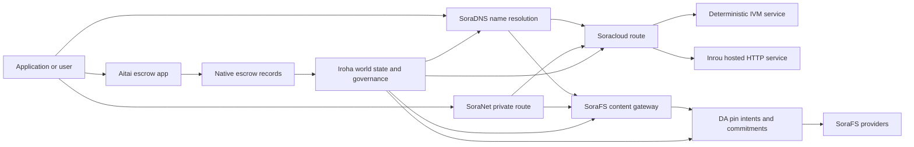

# SORA Nexus Xidmət {#sora-nexus-services}

SORA Nexus Iroha 3 ətrafında tətbiqə yönəlmiş xidmət təyyarələrini əlavə edir. Bu xidmətlər ayrı kitabxana deyil. Onlar Iroha dünya dövləti, Norito manifestləri, idarəetmə qeydləri və Torii marşrut ailələri ilə bağlanır.

Mövcudluq qovşaq quruluşundan və şəbəkə profilindən asılıdır. İstifadə edin [`/openapi`](/az/reference/torii-endpoints.md#app-and-sora-route-families) hədəf qovluğunda icazə verilən yolların səlahiyyətli siyahısı kimi.

## Komponent xəritəsi {#component-map}

|Komponent |Rolu |Əsas səthlər |
| ---------------------- | ------------------------------------------------------------------------------------------------------------------------------------------- | ---------------------------------------------------------------------------------------- |
|Soracloud |Tətbiqlərin tətbiqi, ev sahibliyi edilən xidmətlər, özəl model/iş vaxtı vəziyyəti və xidmət həyat dövrü nəzarəti. |`/v1/soracloud/`, `/api/`, `iroha app soracloud ...` |
|İçəridə.|Soracloud canlı HTTP təyyarəyə ehtiyacı olan xidmət tənzimləmələri üçün ev sahibliyi edilmiş HTTP iş vaxtı. |Soracloud icra vaxtının quruluşu, host imkanları reklamları, replika icra zamanı vəziyyətində |
|SoraNet |Dairələr üçün məxfilik və nəqliyyat örtüyü, relay trafiki, VPN, Connect seansları və axın marşrutu. |`/v1/connect/`, `/v1/vpn/`, SoraNet marşrut metadataları |
|Məlumatların mövcudluğu (DA) |Nexus zolaqlar, SoraFS manifestləri və sübut axınları ilə istinad edilən pay yükləri üçün mövcudluq sübutları, öhdəlik və niyyət qatı. |`/v1/da/`, `FindDaPinIntent`, `[sumeragi.da]` |
|SoraFS |Manifestlər, CAR paylı yüklər, sabitləşdirilmiş məzmun, qapı alınması və bərpa olunma sübutları axınları üçün məzmunu ünvanlanmış saxlama materialı. |`/v1/sorafs/`, `/sorafs/`, `FindSorafsProviderOwner` |
|SoraDNS |SORA ev sahibliyi edilən xidmətlər və məzmunlar üçün təyinatlı adlandırma və həllçi attestasiyası qatı. |`/v1/soradns/`, `/soradns/`, həllçi lüğət hadisələri |
|Aitai |Tətbiq səviyyəli fiat və aktivlərin həlli koridoru, ayrı bir kitabın yox, yerli depozit qeydləri ilə dəstəklənir. | `OpenAssetEscrow`, `FindAssetEscrow*`, `EscrowEventFilter`, Kotodama `escrow_*` binalar |



## Ümumi axınlar {#common-flows}

### Hosted Split tətbiqi {#hosted-split-application}

Tipik bir qarışıq təyyarə tətbiqi bütün parçaları birlikdə istifadə edir:

1. Statik frontend aktivləri SoraFS vasitəsilə paketlənir və bağlanır.
2. Məsələn, ictimai ev sahibi `<app>.sora`, SoraDNS vasitəsilə qeydiyyatdan keçirilir.
3. Soracloud yolları `/api/v1/search` və ya `/api/v1/stream` ilə Inrou HTTP xidməti.
4. Soracloud yolları `/api/auth` və `/api/v1/user` deterministik IVM idarəçilərinə.
5. Gizlilikə ehtiyacı olan müştərilər eyni məzmuna və ya API marşrutuna SoraNet dairəsi vasitəsilə daxil ola bilərlər.

|Yol.|Arxa təyyarə.|Niyə?|
| ----------------- | --------------------- | ------------------------------------------------- |
| `/`               |SoraFS statik məzmun |Yenilənə bilən məzmunun kök və qapı saxlanılması |
|`/assets/*` |SoraFS statik məzmun |Məzmunla əlaqəli aktivlər və açıq sübutlar |
|`/api/auth*` |Soracloud IVM |Yenidən oynamaq üçün təhlükəsiz yazıçı və cüzdanı çağırış halı |
|`/api/v1/user*` |Soracloud IVM |İdarəetmə həssas dövlət mutasiyaları |
|`/api/v1/search*` |Soracloud Inrou |Canlı HTTP xidməti, saxlama, SSE və ya toplayıcı vəziyyət |

### Məzmun nəşri {#content-publication}

SoraFS nəşri onlara bir ad göstərilmədən əvvəl davamlı əşyalar istehsal edir:

1. Faydalı yük və ya dizayn qurun.
2. CAR bir arxivə yığın və parça planı.
3. Bir Norito manifestini pin siyasəti və idarəetmə məlumatları ilə qurun.
4. Manifesti Torii ünvanına təqdim edin.
5. Hədəf profili açıq sübut tələb edərkən DA pin niyyətini və ya mövcudluğun öhdəliyini qeyd edin.
6. Manifesti SoraDNS adına və ya Soracloud statik frontend marşrutuna bağlayın.

### Şəxsi götürmə və ya axın yolu {#private-fetch-or-streaming-route}

SoraNet SoraFS və ya Soracloud qarşısında otura bilər:

1. Müştəri adı və ya manifestini həll edir.
2. Mühafizə direktoru və ya marşrut manifestində giriş və çıxış relayləri seçilir.
3. Nəqliyyat yığılır və SoraNet dairəsi vasitəsilə göndərilir.
4. Çıxış relayi SoraFS qapısına, Torii axınına və ya Soracloud marşrutuna çatır.

## Aitai {#aitai}

Aitai SORA tətbiqi koridoru bazar üslubunda ödənişlər üçün bir alıcı və satıcının zəncirdən kənarda ödənişi əlaqələndirdiyi, lakin Iroha isə Yeni rəqəmli aktivlərin saxlama axınları üçün müqaviləyə məxsus bir əmanət hesabı əvəzinə yerli escrow instruction ailəsi istifadə edilməlidir.

Native escrow kitabda saxlayır. Satıcı `OpenAssetEscrow` ilə təklif açır, alıcı `AcceptAssetEscrow` və `MarkEscrowPaymentSent` ilə zəncirdən kənarda ödənişi qəbul edir və qeyd edir; Satıcı `ReleaseAssetEscrow` ilə buraxır və ya ödəniş işarələnmədən əvvəl ləğv edir. Alıcı və satıcı razılaşmasa, hər iki tərəf mübahisə aça bilər və `CanResolveEscrowDispute` ilə həlli edən qapalı məbləği paylaya bilər.

Bütün həyat dövrü, ümumi aktivlər bağlamaları, anonim depozitlər, sorğular, hadisələr və Rust nümunələri üçün [Native Asset Escrow](/az/blockchain/escrow.md)-yə baxın.

|Aitai səthləri|Bunu istifadə edin.|
| ------------------------------------------------------------------------------------------------------------------------------------------------------------- | ----------------------------------------------------------------------------------------- |
|`OpenAssetEscrow`, `AcceptAssetEscrow`, `MarkEscrowPaymentSent`, `ReleaseAssetEscrow`, `CancelAssetEscrow` |XOR nominal hesablama axınları da daxil olmaqla, şəffaf sayısal aktiv təklifləri. |
|`OpenAnonymousAssetEscrow`, `AcceptAnonymousAssetEscrow`, `MarkAnonymousEscrowPaymentSent`, `ReleaseAnonymousAssetEscrow`, `CancelAnonymousAssetEscrow` |Mühafizə olunmuş təkliflər maliyyələşdirmə və bağlanma hərəkətləri üçün sübut əlavələrindən istifadə edir. |
|`OpenEscrowDispute`, `ResolveEscrowDispute`, `OpenAnonymousEscrowDispute`, `ResolveAnonymousEscrowDispute` |Mübahisələrin açılması və məhkəmə üslubunda həll edilməsi. |
|`FindAssetEscrowById`, `FindAssetEscrowsBySeller`, `FindAssetEscrowsByBuyer`, `FindAssetEscrowsByStatus` |App status səhifələri, uyğunlaşdırma işləri və dəstək vasitələri. |
|`EscrowEventFilter` |Yaşayış şəffaf escrow abunələri escrow id, satıcı, alıcı, status və ya hadisə növü ilə. |
| Kotodama `escrow_open_offer`, `escrow_accept`, `escrow_mark_payment_sent`, `escrow_release`, `escrow_cancel`, `escrow_open_dispute`, `escrow_resolve_dispute` |Kotodama müqavilə çağırışları V1 əmanət sistemi tərəfindən təsdiqlənir. |

İctimai Taira və ya Minamoto istifadəsi üçün, zəncirdən kənar ödəniş rayonu və hər hansı bir dəstək və ya məhkəmə iş axını tətbiq siyasəti kimi qəbul edin. Iroha saxlama vəziyyətini, həyat dövrü hadisələrini, sübut hashlərini və yekun aktiv hərəkətini qeyd edir; o, fiat hesablanmasını özbaşına yoxlamır.

## Hədəf Qeydiyyatını yoxlayın {#check-a-target-node}

Bu səhifədən nümunələr istifadə etməzdən əvvəl, hədəflədiyiniz düyündə yol ailəsinin mövcud olduğunu təsdiq edin:

```bash
export TORII_URL=https://taira.sora.org

curl -fsS "$TORII_URL/openapi.json" \
  | jq '.paths | keys[] | select(test("^/v1/(soracloud|sorafs|soradns|connect|vpn|da)/"))'

curl -fsS -H 'Accept: application/json' "$TORII_URL/status" | jq .
```

Profil tərəfindən `/openapi.json` ifşa edilmirsə, `/openapi` cəhd edin. Yolun dəqiq mövcudluğu quraşdırma xüsusiyyətlərindən və şəbəkə konfigürasiyasından asılıdır.

### Taira Yalnız oxumaq üçün siqaret yoxlamaları {#taira-read-only-smoke-checks}

İctimai Taira son nöqtəsi oxuma tərəfi yoxlamaları üçün faydalıdır, ancaq icazəli bir hesabı idarə etməyinizə və canlı vəziyyətini dəyişmək niyyətində olmadığınız təqdirdə mutasiya nümunələri üçün istifadə etməyin.

```bash
export TORII_URL=https://taira.sora.org

curl -fsS -H 'Accept: application/json' "$TORII_URL/status" \
  | jq '{version: .build.version, peers, blocks, lanes: (.teu_lane_commit | length)}'

curl -fsS "$TORII_URL/v1/connect/status" | jq '{enabled, sessions_active}'

curl -fsS "$TORII_URL/v1/vpn/profile" \
  | jq '{available, relay_endpoint, supported_exit_classes}'

curl -fsS "$TORII_URL/v1/sorafs/storage/state" \
  | jq '{bytes_capacity, bytes_used, pin_queue_depth, por_inflight}'

curl -fsS -H 'Accept: application/json' "$TORII_URL/v1/soracloud/status" \
  | jq '.control_plane | {service_count, services: [.services[] | {service_name, current_version}]}'
```

Taira OpenAPI yol xəritəsində göstərilməyən istismara xüsusi nəzarət təyyarəsi marşrutlarını aşkar edə bilər. `/openapi` API əsas istehsal olunmuş müqavilə kimi qəbul edin, sonra hər hansı bir istismara spesifik marşrutun canlı olaraq sənədləşdirilmədən əvvəl dərhal təsdiqləyin.

## Soracloud {#soracloud}

Soracloud SORA tətbiqi nəzarət təyyarəsidir. İstifadə paketlərini, xidmət tənzimləmələrini, marşrutlamasını, tətbiq vəziyyətini, etibarlı quruluş girişlərini, şifrələndirilmiş xidməti sirlərini, modelləri qeydiyyat qeydlərini, özəl nəticə seanslarını və icra vaxtının qəbulu ilə izləyir.

Soracloud iki həyata keçirmə təyyarəsini istifadə edir:

|İcra təyyarəsi |Sürüş vaxtı |Bunu istifadə edin.|
| ---------------------- | ------- | -------------------------------------------------------------------------------------------- |
|`DeterministicService` |`Ivm` |Müəllif, xəzinə vəziyyəti, sertifikatlı oxumalar, sifariş verilən poçt qutusu işçiləri, idarəetməyə həssas mutasiyalar |
|`HttpService` |`Inrou` |Canlı HTTP APIs, toplayıcı ağır iş, saxlama ilə dəstəklənmiş xidmətlər, SSE, brauzerlə dəstəkləyən axınlar |

Nəzarət təyyarəsi səlahiyyətlidir. Deploy, upgrade, rollback, config, secret, model və status əmrləri Torii vasitəsilə göndərilir və öhdəsindən gəlmiş dünya vəziyyətini oxuyur; onlar ayrı bir CLI - yerli güzgüdən asılı deyil. İctimai marşrut ən uzun prefiks əsaslanır, buna görə bir qeydiyyata alınmış ev sahibi trafikini ev sahibliyi edilən HTTP marşrutları və müəyyənləşdirilmiş API marşrutlar arasında bölə bilər.

### Fərqli bir tətbiqi düzəldin {#scaffold-a-split-app}

Split-app şablon statik frontend əlavə bir hosted canlı API və bir deterministic vault/API xidməti yaratır:

```bash
iroha app soracloud app init \
  --template split-app \
  --app-name solswap_indexer \
  --app-version 0.1.0 \
  --public-host solswap-indexer.sora \
  --output-dir ./apps/solswap-indexer

iroha app soracloud app local-plan \
  --manifest ./apps/solswap-indexer/app_manifest.json

iroha app soracloud app doctor \
  --manifest ./apps/solswap-indexer/app_manifest.json
```

`local-plan` marşrut bölünməsi, uşaq xidməti manifestləri, iş məkanı skript yolları və gözlənilən frontend nəşriyyat rejimi çap edir. `doctor` yerli buraxılış müqaviləsini Torii iştirak etməzdən əvvəl təsdiqləyir.

### Tətbiqlərin vəziyyətini təyin etmək və yoxlamaq {#deploy-and-inspect-app-state}

```bash
export SORACLOUD_TORII_URL=https://<soracloud-enabled-torii>

iroha app soracloud app deploy \
  --manifest ./apps/solswap-indexer/app_manifest.json \
  --torii-url "$SORACLOUD_TORII_URL"

iroha app soracloud app status \
  --manifest ./apps/solswap-indexer/app_manifest.json \
  --torii-url "$SORACLOUD_TORII_URL"
```

Artıq yerləşdirilmiş bir xidmət üçün xidmətin həcminə uyğun əmrlərdən istifadə edin:

```bash
iroha app soracloud status \
  --service-name solswap_indexer_live \
  --torii-url "$SORACLOUD_TORII_URL"

iroha app soracloud rollback \
  --service-name solswap_indexer_live \
  --target-version 0.1.0 \
  --torii-url "$SORACLOUD_TORII_URL"
```

### Gizli və gizli materiallar {#config-and-secret-material}

Soracloud konfig və gizli girişlər səlahiyyətli yerləşdirmə vəziyyətinin bir hissəsidir. İstifadə, yeniləmə və geri qaytarma tələb olunan konfig və ya gizli bağlamalar yoxdursa və ya aktiv manifestlərlə uyğun olmayan zaman bağlanmır.

```bash
iroha app soracloud config-set \
  --service-name solswap_indexer_live \
  --config-name indexer/public_config \
  --value-file ./config/public-config.json \
  --torii-url "$SORACLOUD_TORII_URL"

iroha app soracloud secret-set \
  --service-name solswap_indexer_live \
  --secret-name indexer/api_key \
  --secret-file ./secrets/api-key.envelope.json \
  --torii-url "$SORACLOUD_TORII_URL"
```

Profiliniz üçün tələb olunan dəqiq etibarnamə bayraqları üçün CLI köməkliyindən istifadə edin:

```bash
iroha app soracloud config-set --help
iroha app soracloud secret-set --help
```

## İnrou {#inrou}

Inrou ev sahibliyi edir. HTTP İstifadə olunan vaxt Soracloud. Bir Iroha əhatə olunmuş dərəcəsi Soracloud İndirmə vaxtı layihələri qəbul edilmişdir Soracloud Yerli materiallaşdırma planına daxil olunaraq, təyin edilmiş hosted-servis repliklərini loopback xidmətləri kimi başlatır. və etibarlı modelə təkrarlanan iş vaxtı vəziyyətini bildirir.

Bir canlı HTTP səthə ehtiyacı olan iş yükləri üçün Inrou-dan istifadə edin, məsələn, toplayıcı ağır APIs, SSE axınları, saxlama dəstəkləyən idarəetmə cihazları və ya brauzer dəstəklənmiş xidmətlər.

### İdarəetmə vaxtı tələbləri {#runtime-requirements}

- Konteyner manifestinin işləmə vaxtı `Inrou` olmalıdır.
- Xidmət manifestinin icra təyyarəsi `HttpService` olmalıdır.
- `HttpService + Inrou` dəqiq bir `PersistentRootLeaseVolume` tələb edir ki, `/`-də quraşdırılsın.
- Yenilənmiş Inrou xidmətləri dəyişən paylaşılan vəziyyətdə saxlandıqda, həmçinin ortaq xidmətin və ya məxfi kirayə saxlanmasının ehtiyacına malikdirlər.
- İstehsalat hostinq qovşaqları yalnız bir proxy kimi fəaliyyət göstərmək əvəzinə real Inrou qabiliyyətini reklam etməlidirlər.

### Məlum bir parça {#manifest-fragment}

Aşağıdakı nümunə iki manifestin formasını göstərir. Bu bir parçadır, tam yerləşdirmə paketi deyil.

```jsonc
// container_manifest.json
{
  "schema_version": 1,
  "runtime": { "runtime": "Inrou", "value": null },
  "bundle_path": "/bundles/solswap-indexer.inrou",
  "entrypoint": "/app/bin/launch-indexer.sh",
  "args": [],
  "env": {
    "RUST_LOG": "info",
  },
  "inrou": {
    "schema_version": 1,
    "guest_os": { "guest_os": "DebianSlim", "value": null },
    "guest_images": {
      "x86_64": {
        "kernel_image_path": "/inrou/x86_64/vmlinux",
        "rootfs_image_path": "/inrou/x86_64/rootfs.ext4",
        "initrd_image_path": null,
      },
      "aarch64": {
        "kernel_image_path": "/inrou/aarch64/vmlinux",
        "rootfs_image_path": "/inrou/aarch64/rootfs.ext4",
        "initrd_image_path": null,
      },
    },
  },
  "lifecycle": {
    "start_grace_secs": 60,
    "stop_grace_secs": 30,
    "healthcheck_path": "/api/indexer/v1/health",
  },
}
```

```jsonc
// service_manifest.json
{
  "schema_version": 1,
  "service_name": "solswap_indexer_live",
  "service_version": "0.1.0",
  "execution_plane": { "execution_plane": "HttpService", "value": null },
  "replicas": 2,
  "route": {
    "host": "solswap-indexer.sora",
    "path_prefix": "/api/v1/search",
    "service_port": 8080,
    "visibility": { "visibility": "Public", "value": null },
    "tls_mode": { "tls": "Required", "value": null },
  },
  "lease_volumes": [
    {
      "volume_name": "root_disk",
      "kind": {
        "lease_volume": "PersistentRootLeaseVolume",
        "value": null,
      },
      "storage_class": { "storage_class": "Warm", "value": null },
      "mount_path": "/",
      "max_total_bytes": 8589934592,
    },
    {
      "volume_name": "index_state",
      "kind": { "lease_volume": "ServiceLeaseVolume", "value": null },
      "storage_class": { "storage_class": "Warm", "value": null },
      "mount_path": "/var/lib/solswap-indexer",
      "max_total_bytes": 1073741824,
    },
  ],
}
```

İdarəetmə müddətində hər bir quraşdırılmış kirayə həcmi, həcm adından alınan ətraf mühit dəyişənləri vasitəsilə açıqlanır:

```text
SORACLOUD_LEASE_VOLUME_ROOT_DISK_DIR
SORACLOUD_LEASE_VOLUME_ROOT_DISK_MOUNT_PATH
SORACLOUD_LEASE_VOLUME_INDEX_STATE_DIR
SORACLOUD_LEASE_VOLUME_INDEX_STATE_MOUNT_PATH
```

## SoraNet {#soranet}

SoraNet məxfilik və nəqliyyat üst örtüsüdür. O, hədəf qapısı və ya xidməti ilə birbaşa bağlanmamalı olan trafik üçün relye əsaslı marşrutlar təmin edir. Nəqliyyat dizaynında giriş, orta və çıxış relay rolları, QUIC nəqliyyat, səs-küylü əsaslı hibrid əl sıxması, qabiliyyət danışıqları, relay direktoru metadataları və sabit ölçülü doldurulmuş hüceyrələr istifadə olunur.

Nexus yerləşdirmələrində, SoraNet məzmun alımlarını, qapı trafikini, VPN və ya Connect seanslarını və Norito axın yollarını daşıya bilər. Dizayn girişləri `norito-stream` dəstəkləyən relayları işarələyə bilər ki, bu da müştərilərə Torii RPC və ya axın trafikinə uyğun yolları üstün tutmağa imkan verir.

### Axtarış Konfigurasiyası {#streaming-configuration}

Nexus profili SoraNet axın marşrutları üçün təchizatı təmin edir:

```toml
[streaming]
feature_bits = 0b11

[streaming.soranet]
enabled = true
exit_multiaddr = "/dns/torii/udp/9443/quic"
padding_budget_ms = 25
access_kind = "authenticated"
provision_spool_dir = "./storage/streaming/soranet_routes"
provision_spool_max_bytes = 0
provision_window_segments = 4
provision_queue_capacity = 256
```

İzləyicinin təsdiqlənməsini tələb etməyən məzmun marşrutları üçün `access_kind = "read-only"` istifadə edin. `authenticated`-dən istifadə edin, çıxış relayı Torii və ya ev sahibliyi edilən xidmətə keçiddən əvvəl biletləri və ya izləyicinin kimliyini tətbiq etməlidir.

### SoraNet-Fəaliyyətli SoraFS Get {#soranet-aware-sorafs-fetch}

SoraFS aparıcı CLI brauzer uzantıları və ya SDK adapterləri üçün yerli proxy manifest və spool SoraNet marşrut metadataları göndərə bilər:

```bash
sorafs_cli fetch \
  --plan artifacts/payload_plan.json \
  --manifest-id 7bb2...9d31 \
  --provider name=alpha,provider-id=9f5c...73aa,base-url=https://gw-alpha.example.org/,stream-token="$(cat alpha.token)" \
  --output artifacts/payload.bin \
  --json-out artifacts/fetch_summary.json \
  --local-proxy-manifest-out artifacts/proxy_manifest.json \
  --local-proxy-mode bridge \
  --local-proxy-norito-spool storage/streaming/soranet_routes \
  --local-proxy-kaigi-spool storage/streaming/soranet_routes \
  --local-proxy-kaigi-policy authenticated \
  --max-peers=2 \
  --retry-budget=4
```

Ümumi qeydlər təminatçısının hesabatları, hissə qəbulu, yerli proxy metadataları və çatdırılma üçün istifadə olunan effektiv marşrut parametrləri.

### Relay Incentive Verifier Roster {#relay-incentive-verifier-roster}

Relay stimullarının qəbul edilməsi uğursuzluqla bağlanır. Nə vaxt? `incentives.enable` həqiqətdir. `incentives.trusted_verifier_ids` Ən azı bir və ən çox 64 kanonik hesabın olması lazımdır. IDs. Runtime siyahını müəyyənləşdirilmiş bir sıra olaraq saxlayır və etibarsız siyahı geometriyası relye başlanğıcı zamanı rədd edilir.

Hər `RelayBandwidthProof` sabit bir çərçivə / təyinat büdcəsi ilə dekodlaşdırılır və bütün çərçiliyi istehlak etməlidir. Sığortalanmış siyahıda sübutun təsdiqləyici hesabı olmalıdır və `RelayBandwidthProof::verify_signature()` uğurlu olmalı, Bu səbəbdən etibarsız bir imzaçı və ya imzalanma qeyri-mümkündür / əxlaqsızlaşdırılmış sübut heç bir ölçməyə kömək etmir və təşviq sürətli görüntüsünü istehsal edə bilmir.

## Məlumatların mövcudluğu (DA) {#data-availability-da}

DA dünya vəziyyətində birbaşa yerləşdirilməsi üçün çox böyük, məxfiliyə həssas və ya xidmətə xüsusi olan paylı yüklər üçün mövcudluğun sübut qatıdır. Deterministik öhdəlikləri və geri alınma öhdəliyi qeyd olunur ki, təsdiqləyicilər, qapı vasitələri və müştərilər hansı baytların vəd olunması, hansı siyasət tətbiq edilməsi və hansı sübutların müşahidə edildiyi barədə razılaşa bilərlər.

DA Kura və SoraFS əvəz edilmir:

- Kura blok axını və konsensus bərpası məlumatlarını saxlayır.
- SoraFS məzmun ünvanlı baytları, CAR payloadları və manifestləri saxlayır və xidmət edir.
- DA öhdəlikləri, sübut siyasətlərini, sübut açılışlarını və bu baytların planlaşdırılmasına, audit edilməsinə və kitabın vəziyyətinə bağlanmasına imkan verən pin niyyətlərini qeyd edir.

DA tətbiqi və ya Nexus zolağı istifadə etmək üçün əsas kitabda görünən vəd lazımdır ki, zəncirdən kənar məlumatlar geri alına bilər. Ümumi nümunələr arasında ödəniş axınları üçün zolaq pay yükü öhdəlikləri, nəşr edilmiş məzmun üçün SoraFS pin niyyətləri var; Sonrakı yoxlama üçün saxlanılması lazım olan sübut qutusları və ictimai vəziyyətində tam yük deyil, həzm olunması lazım olan tətbiq əşyaları.

### Həyat dövrü {#lifecycle}

|Səhnə |Qeyd olunanlar |
| ---------- | ----------------------------------------------------------------------------------------------------------------------------------------------------- |
|Niyyət |Bir bilet, manifest istinadı, alias, zolaq / dövr / ardıcıllıq istinadi, saxlama siyasəti və ya replikasiya məqsədi. |
|Məsuliyyət |Manifesti, yol yükünü, sübut dəstini və ya məzmun kökünü kitabın görünən qeydinə bağlayan materialı digest edin. |
|Düzü .|Mövcudluq səsləri, sübut açılışları, təchizatçı attestasiyası və ya hədəf şəbəkəsi tərəfindən qəbul edilmiş digər profilə aid dəlillər. |
|Sual |`FindDaPinIntentByTicket`, `FindDaPinIntentByManifest`, `FindDaPinIntentByAlias` və ya `FindDaPinIntentByLaneEpochSequence` vasitəsilə qapaq niyyətli axtarışlar. |

DA ilə dəstəklənən ümumi nəşriyyat axını:

1. WSV xaricindəki paylı yükü, məsələn SoraFS CAR faylını və ya Nexus yol paylı yükünü qurmaq və ya qəbul etmək.
2. Norito manifestində və ya marşrut xüsusi öhdəlik qeydində paylı yükün təsvir edilməsi.
3. `/v1/da/*` vasitəsilə və ya şəbəkənin imzalanmış əməliyyat yolu vasitəsilə bu marşrut ailəsi aktivləşdirildiyi zaman manifest, pin niyyətini və ya öhdəliyi göndərin.
4. Müddətçilərin və ya mövcudluq təminatçılarının aktiv sübut siyasəti ilə tələb olunan sübutları toplamalarına icazə verin.
5. Bir əlifba, ödəniş sübutu və ya faydalı yükdən asılı olan qapı yolu təbliğ etməzdən əvvəl nəticədəki pin niyyətini və ya öhdəliyini soruşun.

### Alqoritmik Model {#algorithmic-model}

DA bir faydalı yükü imzalanmış, yenidən oynatma ilə qorunan, blok-indeksiyalı bir öhdəliyə çevirir. Əhəmiyyətli alqoritmlər müəyyənləşdirilir ki, təsdiqçilər və qapılar eyni baytlardan eyni həcmləri yenidən hesablaya bilərlər.

1. Torii göndərilən paylı yükü kanonikləşdirir. `(lane_id, epoch, sequence)`, paylı yük baytları, sıxılma metadataları, hissə ölçüsü, silmə profili ilə qəbul edilən istehlak tələblərini qəbul edir, Gzip, deflate və ya Zstandard pay yüklərini tələb edildikdən sonra düyünin kanonik bayt uzunluğunun `total_size` bərabər olduğunu yoxlayır.
2. Yolu və hissə parametrlərini təsdiqləyin. Yolu Nexus yol kataloqunda olmalıdır. `chunk_size` iki, ən azı iki bayt olan sıfır olmayan bir güc olmalıdır; və qurulmuş maksimumdan böyük olmur. Təmizləmə profili məlumat parçacıqlarını və ən azı iki paritə parçacığı daxil etməlidir. Yol kataloqunda sübut sxemi seçilir, ya `merkle_sha256` ya da `kzg_bls12_381`.
3. Şəbəkə siyasətini tətbiq edin. Blob sinifi üçün qurulmuş replikasiya və saxlama əsas xəttini qovur. İctimai metadata düz mətn olaraq qalmalıdır; yalnız idarəetmə meta məlumatları manifestə yazılmadan əvvəl nodun qurulmuş idarəetmə metadata açarı ilə şifrələnir.
4. Kanonik pay yükü sabit ölçülü bir profil ilə parçalanır. `chunk_size`. Torii Faydalı yük həzmini, bərpa qabiliyyətinin sübut edilməsi ağacının kökünü və hər hissə üzrə öhdəlikləri hesablayır. BLAKE3 Baytları üzərində öhdəliklər.
5. Təmizləmə öhdəliklərini əlavə edin. Çünklər `data_shards` zolaqlarına qruplaşdırılır. Son zolaqda olmayan hüceyrələr paritənin hesablanması üçün sıfır doldurulur. RS(16) paritə yaratır Satır / qlobal parity shards; seçim `row_parity_stripes` matris boyunca sütun üslubunda zolaq parity əlavə edin. Parity shard öhdəlikləri BLAKE3 kiçik ədədli `u16` simvollarının həzmləridir.
6. Manifesti qurun. `DaManifestV1` yol, dövr, qrup sinifi, kodek, payload digest, parça kök, parça ölçüsü, silinmə profili, saxlama siyasəti, kirayə qiyməti, parça öhdəlikləri, seçim IPA öhdəliyi, metadata və buraxılış vaxtı qeyd olunur. Saxlama biletinin müəyyənləşdirilməsidir: düyün əvvəlcə boş bir biletlə manifest şablonunu hash edir, sonra bu barmaq izi son `storage_ticket` olaraq geri yazır.
7. Yeniləmə münaqişələrini rədd edin. Yeniləmə açarı `(lane_id, epoch, sequence, manifest_fingerprint)`. Eyni barmaq izi olan bir nüsxə idempotentdir. Yaşlı bir ardıcıllıq və ya fərqli barmaq izi ilə eyni ardıcıllık rədd olunur.
8. İmzalanmış əşyaları buraxın. Torii PDP öhdəliyini hesablayır, `DaIngestReceipt` imzalayır, bir `DaCommitmentRecord` tikir və manifest üçün qabıq əşyalarını yazır; PDP öhdəliyi, öhdəlik qeydləri, öhdənim cədvəli, pin niyyəti, qəbulu sənədi və qəbulu günlüğü. Qəbulu kursorunu hər `(lane_id, epoch)` üçün monoton şəkildə inkişaf etdirir.

Əməkdaşlıq qeydləri blokların daşıdığı bir şeydir.

- Yol, dövr və ardıcıllıq
- Çağırıcı blob ID və kanonik manifest hash
- Şəbəkə süqutu sistemi
- ədəd kök
- KZG zolaqları üçün seçməli KZG öhdəlik
- PDP/proof digest
- saxlama sinifi və saxlama biletləri
- Torii DA təsdiq imzası

Bir blok DA qeydlərini yerləşdirmədən əvvəl, blok birləşmə yolu paketini təsdiqləyir:

- `(lane_id, epoch, sequence)` birləşmədə unikal olmalıdır.
- Manifest hashlər sıfır olmayan və qovşaqda unikal olmalıdır.
- Ödəniş sübutı sxemi konfigüratsiya edilmiş zolaq siyasətinə uyğun olmalıdır.
- Merkle zolaqları KZG öhdəliklərini rədd edir; KZG zolaqlar isə sıfır olmayan KZG öhdəliyinə ehtiyac duyurlar.
- Pin niyyətləri linka, manifest hash, saxlama biletləri, sahib hesabı və alias toqquşma qaydaları ilə kanonikalaşdırılır, sıralanır və filtrlənir.

Bloq başlığı DA sübut siyasətləri, öhdəliklər və pin niyyətləri üçün hash saxlayır. üzvlük sübutları üçün öhdəliyin qovluğu da yarpaqları olan Merkle kökünü aşkar edir canonik Norito-kodlanmış `DaCommitmentRecord` dəyərlərinin hashidir. Ana düyünləri sol və sağ uşaqların konkatenasiyasını hash edir; nadir bir yarpaq dəyişmədən növbəti təbəqəyə keçirilir.

### Əldə edilən sübutların yoxlanması {#proof-verification}

`/v1/da/commitments/prove` bir blokda bir öhdəlik üçün sübut təqdim edə bilər. Sübutun öhdəliyi, blok hündürlüyü, qrupdakı indeks, qrup hashı, qrup uzunluğu, Merkle kök və qardaş yolu var. Verifikasiya yoxlamaları:

1. Proof bundle hash blok başlığının DA öhdəlik hashinə uyğun gəlir.
2. Proof blok hündürlüyü istinad edilən blok başlığı ilə uyğun gəlir.
3. İndeks sərhədlərdədir və öhdəlik həmin indeksdəki bağ girişinə bərabərdir.
4. Şəbəkə mühafizəsi siyasəti bu öhdəliyi qəbul edir.
5. Bağlanış yaprağından qardaşı yolunun qatılması təchiz olunmuş kökün yenidən qurulmasını təmin edir.
6. Yenidən qurulan kök birləşmiş köklə bərabərdir.

Bu, müəyyən bir blok pay yükündə xüsusi bir mövcudluq öhdəliyi daxil olduğunu sübut edir; bu, hər bir nüsxənin hazırda onlayn olduğunu sübut etmir. Canlı geri alınma qabiliyyəti SoraFS təchizatçıların götürmələri, PDP/PoTR yoxlamaları və ya profilə aid mövcudluq sübutları vasitəsilə ayrı-ayrı yoxlanılır.

### Konsensus Əlaqəsi {#consensus-interaction}

DA etibarlı yayım (RBC) vasitəsilə Sumeragi ilə birləşdirilir, lakin ikinci bitmə protokoludur. RBC təklif pay yüklərini yayır və bərpa edir: təklifçi `(height, view, payload_hash)`, həmyaşıd mübadilə hissələri üçün bir iclas elan edir və `READY`/`DELIVER` siqnalları eyni pay yükünü kifayət qədər təsdiqləyicilərin müşahidə etdiyini izləyirlər.

Iroha 3 -də bir həmyaşıllıq blokun gözlənilirki pay yükünü aşağıdakı hallarda mövcud hesab edir:

- Yerli gözlənilir bloklar hash-i nəzərdə tutulan payload-a hash edir və ya
- RBC blok hash, hündürlük, görünüş və payload hash uyğun bir yük bərpa etmişdir.

Əgər heç bir şərt təsdiqlənmirsə, həmkarları `missing_local_data` qeyd edir, RBC və ya blok sinxronizasiyası vasitəsilə pay yükünü bərpa etməyə çalışır və DA qapısını status və telemetriya üzrə bildirir. Hal-hazırda həyata keçirilən bu DA siqnalları yekunluq üçün məsləhətlidir: blok hələ də ayrı bir DA quorum sertifikatından deyil, ötürülmə sertifikatından əlavə olan yerli pay yükündən yekunlaşır.

DA vaxtlandırması bərpa pəncərələrini genişləndirir. Effektiv DA quorum müddəti qurulmuş blokdan və hədəfləmə müddətlərindən alınır, sonra `sumeragi.advanced.da.quorum_timeout_multiplier` ilə qatlanır. Mövcudluq müddəti `max(quorum_timeout, availability_timeout_floor_ms) * availability_timeout_multiplier`. Bu mövcudluq müddətinin bitməsindən əvvəl, düyün payload bərpasına üstünlük verir və vaxtından qabaq yenidən planlaşdırılmasını qaçırır; başa çatdıqdan sonra normal bərpa və görünüş dəyişikliyi yolları davam edə bilər.

### Operator qeydləri {#operator-notes}

Iroha 3 konsensus profilləri daxildir RBC-faydalı yükün yayılması, manifest qoruyucusu, DA birləşmələrin təsdiqlənməsi və bərpa telemetriyası. `[sumeragi.da]` Bir blok üçün öhdəliklər və sübut açılışları üzrə məhdudiyyətlər, əlavə `[sumeragi.advanced.da]` Qorum və mövcudluq davranışı üçün vaxt çıxışı qatlayıcıları. Bu parametrləri bir şəbəkədəki təsdiqçilər arasında tutarlı saxlayın Profil.

Marşrut aşkarlanması üçün bağın OpenAPI sənədi ilə başlayın:

```bash
curl -fsS "$TORII_URL/openapi.json" \
  | jq '.paths | keys[] | select(startswith("/v1/da/"))'
```

istifadə edin. [sorğu istinadı](/az/reference/queries.md#nexus-data-availability-and-packages) gedişi üçün DA sorğu adları, və [Peer konfigurasiyası şablonu](/az/reference/peer-config/) Yerli işçilər üçün `[sumeragi.da]` Təsərrüfatınız tərəfindən aşkar edilmiş düymələr.

## SoraFS {#sorafs}

SoraFS mərkəzləşdirilmiş məzmunu ünvanlanan saxlama materialıdır. O, baytları müəyyənləşdirici parçalara, CAR arxivlərə və Norito məzmunu kökləri bağlayan manifestlərə qovurulur. Qazanma təminatçıları məzmunu təqdim etməzdən əvvəl manifestləri və hissə öhdəliklərini təsdiqləyirlər.

Tipik SoraFS İstifadələr arasında statik tətbiq aktivləri, sənədləşdirmə binaları, zona daxildir İdarəetmə və idarəetmə sübutları qrupları. Iroha Məlumat modellərinin məruz qalması SoraFS giriş tədbirləri və [`FindSorafsProviderOwner`](/az/reference/queries.md#nexus-data-availability-and-packages) Təchizatçının mülkiyyətini həll etmək üçün müraciət.

### İctimai Yerli CID və Site Gateways {#public-local-cid-and-site-gateways}

SoraFS imkanlı olan hər bir Torii düyün, seçmə tətbiqi API qurulmadıqda belə bu anonim ictimai yolları quraşdırır:

|Metod və son nöqtə |Məqsəd|
| --- | --- |
|`GET /.well-known/sorafs/manifest` |Kanonik istək ev sahibi tərəfindən seçilmiş manifesti qaytarın |
|`GET /v1/sorafs/cid/{cid}` |CID üçün məhdudlaşdırılmış yerli manifest metadataları və fayl girişlərini qaytarın. |
|`GET /sorafs/cid/{cid}` |Yerli məzmunla ünvanlanan bir sayt üçün kök sənədinə xidmət edin |
|`GET /sorafs/cid/{cid}/{*path}` |Bu CID altında bir normallaşdırılmış yol və ya bir sərhədli bayt aralığında xidmət edin. |

Bu yollar heç vaxt `x-sorafs-stream-token` və ya `x-sorafs-token-id` qəbul etmirlər. Hər iki başlıqların mövcudluğu pis bir tələbdir. İctimai oxuma qabiliyyəti; bir saxlama çatışmazlığı uzaqdan provayder hidratasiyasına icazə vermir. Mühafizə olunmuş provayder CAR və parçalı yollar ayrı təsdiq edilmiş protokol səthləri olaraq qalır.

Torii baytları oxumazdan əvvəl yerli manifestin kanonik kodlaşmasını, semantik məhdudiyyətlərini, həzmini və kökünü CID təsdiqləyir. Daha sonra etibarlı yerli provayder kimliyini, idarəetmənin qəbulunu və manifestin uyğunluğu və çıxarılması yoxlamalarını tələb edir, CID, Gateway nisbət / qadağa siyasəti təsirli müştəri ünvanını istifadə edir, yalnız konfiqurasiyalı etibarlı proxylər vasitəsilə ötürülən ünvanlara hörmət göstərir.

Bir müraciətdə sondan sonuna qədər ictimai qapı icazəsi var; proses üzrə məhdudiyyət 64 eyni vaxtda oxunmasıdır, həddindən artıq müraciətlər `503 Service Unavailable` və `Retry-After: 1` qaytarılır. Manifest cavablar 16 MiB ilə məhdudlaşdırılır, fayl siyahıları standart olaraq 50 girişə və ən çox 500 qəbul edilir və tam bir fayl və ya tək bayt aralığı 8 MiB ilə məhdullaşdırılır. CIDs, sorğular, aparıcılar, yollar və aralıq başlıqları kanonik vahid dəyərli formalarını istifadə etməlidirlər. Aktiv HTML, skript, SVG, XML, PDF və ya Wasm məzmunları yalnız konfigüralaşdırılmış CID-dən əldə edilmiş təcrid edilmiş mənşəddən (və ya oraya yönəldilir), bu da bir paylaşılan yol qapısı mənşədin etibarsız məzmunu icra etməsinin qarşısını alır.

### Moderasiya ilə bağlı çətinliklər {#moderation-challenges}

SoraFS moderasiya çətinlik iqtisadiyyatı konsensus dövlətidir. Aktiv siyasət idarəetmə səsverməsi aktivləri və escrow və slashing üçün istifadə edilən idarəetmə hesabları adlanır. Hər bir çətinlik tam olaraq bu aktivin 150 vahidini tələb edir; onu artırmaq atomatik olaraq istiqrazın escrow-a köçürülür. Məlumatda ikiqat çağırış identifikatorunu, eyni hesabın ikinci çağırışını və ya balansları dəyişdirmədən yenidən istifadə olunan sübutların istehsal edilməsini rədd edilir.

Mübahisələrin təqdim edilməsi və mübahisələrin həlli ilə bağlı məhdudiyyətlər fərqlidir. Hökumət qüvvədə olan bir mübahisəni qəbul etmək və ya rədd etmək üçün təqdimatlardan sonra tam 24 saat vaxt alacaq.

- Qəbul edilmiş bir təhdid işi dayandırır və bütün borc geri qaytarılır;
- rədd edilən çağırış davasının davam etdirilməsinə imkan verir, istiqrazın 25%-ni slash alıcıya göndərir (səhsiyyətə malik aktivin dəqiqliyindən sonra yuvarlanır) və qalanını qaytarır; və
- həll edilməmiş bir mübahisə zəiflik müddətindən sonra sona çatır, açılmır və bütün borc geri qaytarılır.

`ExpireSorafsModerationChallenge` artıq başa çatmış iddia üçün icazəsi yoxdur və idempotentdir. Beləliklə, yox olan bir saxlayıcı pulları kilidli buraxmayacaq və ya açıqlamaları bloklaya bilməz. Hər ödəniş atomdur: hər hansı bir qaytarma və ya kəsmə ayaq uğursuz olduqda, tam hesablaşma geri çəkiləcəkdir.

Moderasiya siyasəti və hal qeydləri ilk buraxılış sxemini birbaşa istifadə edir. nodlar başlanğıc / vəziyyət başlanğıcı zamanı əvvəlcədən kəsilmiş davamlı düzənlikləri rədd edirlər . və ya sürətli görüntülərin bərpası; səsvermə aktivini, saxlama hesablarını, müddətləri və ya iqtisadiyyatını miras vəziyyətindən çıxarmaq əvəzinə həmin qurğuları yeniləyin.

### Yükləyin, bildirin, imzalayın və təqdim edin {#pack-manifest-sign-and-submit}

```bash
cargo run -p sorafs_car --features cli --bin sorafs_cli -- \
  car pack \
  --input ./dist \
  --car-out artifacts/site.car \
  --plan-out artifacts/site.chunk-plan.json \
  --summary-out artifacts/site.car-summary.json

cargo run -p sorafs_car --features cli --bin sorafs_cli -- \
  manifest build \
  --summary artifacts/site.car-summary.json \
  --manifest-out artifacts/site.manifest.to \
  --manifest-json-out artifacts/site.manifest.json \
  --pin-min-replicas=3 \
  --pin-storage-class=warm \
  --pin-retention-epoch=42

SIGSTORE_ID_TOKEN=$(oidc-client fetch-token) \
cargo run -p sorafs_car --features cli --bin sorafs_cli -- \
  manifest sign \
  --manifest artifacts/site.manifest.to \
  --bundle-out artifacts/site.manifest.bundle.json \
  --signature-out artifacts/site.manifest.sig

cargo run -p sorafs_car --features cli --bin sorafs_cli -- \
  manifest submit \
  --manifest artifacts/site.manifest.to \
  --chunk-plan artifacts/site.chunk-plan.json \
  --torii-url "$TORII_URL" \
  --resolve-submitted-epoch=true \
  --authority=<i105-account-id> \
  --private-key-file ./secrets/authority.ed25519 \
  --summary-out artifacts/site.manifest.submit.json \
  --response-out artifacts/site.manifest.submit.body
```

Əgər `/v1/sorafs/pin/register` hədəf düyünə yönəltilmirsə, CLI imzalanmış `/transaction` təqdimatına qayıda bilər və terminal boru kəməri vəziyyətini gözləyə bilər.

### Verifikasiya və gətirin {#verify-and-fetch}

```bash
cargo run -p sorafs_car --features cli --bin sorafs_cli -- \
  proof verify \
  --manifest artifacts/site.manifest.to \
  --car artifacts/site.car \
  --chunk-plan artifacts/site.chunk-plan.json \
  --summary-out artifacts/site.verify.json

sorafs_cli fetch \
  --plan artifacts/site.chunk-plan.json \
  --manifest-id <manifest-digest-hex> \
  --provider name=primary,provider-id=<provider-id-hex>,base-url=https://gateway.example.org/,stream-token="$(cat provider.token)" \
  --output artifacts/site.fetch.tar \
  --json-out artifacts/site.fetch.json
```

### Geri qaytarılma sübutunun yoxlanılması {#proof-of-retrievability-checks}

Operatorlar saxlama təminatçıları üçün yoxlaya və sübut yoxlamalarını həyata keçirə bilərlər:

```bash
sorafs_cli por status \
  --torii-url "$TORII_URL" \
  --manifest <manifest-digest-hex> \
  --status=failed \
  --limit=20

sorafs_cli por trigger \
  --torii-url "$TORII_URL" \
  --manifest <manifest-digest-hex> \
  --provider <provider-id-hex> \
  --reason=latency_probe \
  --samples=48 \
  --auth-token artifacts/challenge_token.to
```

## SoraDNS {#soradns}

SoraDNS üçün müəyyənləşdirilmiş adlandırma qatıdır SORA Xidmətlər və məzmun. Adları normallaşdırır, dizaynların yeniləmələrini həll edir Iroha, və imzalanmış zona və ya həllçi paketləri vasitəsilə paylayır SoraFS. Çözümçülər və girişlər kəşfiyyat metadatalarına güvənmədən əvvəl həllçi attestasiyası sənədlərini yoxlayır.

Brauzerə daxil olmaq üçün SoraDNS qeydiyyatdan keçmiş bir FQDN -dən qapı hostlarını çıxarır. Kayd olunmuş boşluq hostı kanonik tətbiq mənşəli olaraq qalır, yerləşdirilmiş qapı profilləri isə bu mənşəli üçün brauzer və Torii geri dönüş yollarını ortaya qoyur.

### Ev sahibliyi formları {#host-forms}

|Formular|Misal |Məqsəd|
| --- | --- | --- |
|Zəiflik mənşəli |`https://<fqdn>/<path>` |Kanonik tətbiq URL manifestlərdə və buraxılış qeydlərində qeyd olunur |
|Taira brauzer qapısı |`https://<fqdn>.mon.taira.sora.net/<path>` |Aktiv bir alias üçün ictimai brauzer qapısı |
|Torii fallback yol |`https://taira.sora.org/soradns/<fqdn>/<path>` |Torii aktiv bir alias üçün debug və fallback yolu |
|Canonical hash gateway |`<base32(blake3(name))>.gw.sora.id` |Deterministik giriş kimliyi və GAR yoxlama |

`/soradns/<alias>/...` fallback üstünlük verilən ictimaiyyət URL deyil. Alətlər, tətbiq manifestləri və frontend konfigüratisiyası boşluq host özü üstünlük verməlidir. Əgər Taira-də bir alias aktiv deyilsə, brauzer qapısı və ya fallback yolu tətbiqetmə yönümləməsinin başlanmasından əvvəl `404` -ni geri qaytara bilər və ya TLS -ni səhv edə bilər.

### Derive Gateway Hostləri {#derive-gateway-hosts}

```ts
import {
  deriveSoradnsGatewayHosts,
  hostPatternsCoverDerivedHosts,
} from '@iroha/iroha-js'

const derived = deriveSoradnsGatewayHosts('docs.sora')
console.log(derived.canonicalHost)
console.log(derived.prettyHost)

const taira = deriveSoradnsGatewayHosts('solswap-indexer.sora', {
  prettySuffix: 'mon.taira.sora.net',
})
console.log(taira.prettyHost)

const patterns = [
  derived.canonicalHost,
  derived.canonicalWildcard,
  derived.prettyHost,
]
console.log(hostPatternsCoverDerivedHosts(patterns, derived))
```

GAR payloadlar kanonik hash host, kanonik wildcard və seçilmiş gözəl host əhatə etməlidir.

### Resolver dizaynı görüntüsünü alın {#fetch-a-resolver-directory-snapshot}

```bash
curl -i "$TORII_URL/v1/soradns/directory/latest"

soradns_resolver directory fetch \
  --record-url "$TORII_URL/v1/soradns/directory/latest" \
  --directory-url https://gateway.example.org/soradns/directory/latest.car \
  --output ./state/soradns-directory

soradns_resolver rad verify \
  --rad ./state/soradns-directory/rad/resolver-a.norito
```

Gateways, həllçi attestasiyası sənədinin çatışmaması, müddəti bitmiş, imzalanmamış və ya Merkle kökünün ən son dizaynında bağlanmayan həllçilərini rədd etməlidir. Hələ heç bir həllçi dizayni nəşr edilmədiyi şəbəkədə `/v1/soradns/directory/latest` marşrut aktiv olsa da, `404` qaytara bilər.

### İctimai DNS nümayəndəliyi {#public-dns-delegation}

SoraDNS host mənşəyi normal internet DNS delegasiyasını əvəz etmir. Əgər ictimai DNS adı SoraDNS qapısına göstərilməlidirsə:

- alt domenlər üçün seçilmiş gözəl host üçün CNAME nəşr edin.
- Əsas adlar üçün ALIAS/ANAME və ya A/AAAA qeydlərini hər hansı bir yayılma qapısına IPs istifadə edin.
- GAR yoxlamaları üçün kanonik hash hostu SoraDNS giriş domenində saxlayın.

## FHE və UAID {#fhe-and-uaid}

FHE ilə bağlı Nexus xidmətləri üçün mövcud olan səthlər aşağıdakılardır:

- `iroha_crypto::fhe_bfv` skalar şifrəli mətnin qiymətləndirilməsi üçün deterministik BFV dəstəyini tətbiq edir. Tanımlayıcı qətnaməsi `BfvIdentifierPublicParameters` və `BfvIdentifierCiphertext` istifadə edir, burada 0 slot giriş bayt uzunluğunu saxlayır və sonrakı slotlar hər biri bir şifrələnmiş bayt saxlayır.
- Soracloud dövlət və iş sxemləri modeli FHE idarəetmə ilə idarə olunan parametrlər dəstləri, icra siyasəti, şifrəli mətn öhdəlikləri, sorğu zarfları və açıqlama tələbləri ilə şifrə mətni iş yükləri.

BFV identifikator yolu məxfiliyini qorumaq üçün istifadə olunur. Bir müştəri Torii həllinə şifrəli bir identifikator göndərə bilər. Çözücü qiymətləndirir O, aktiv identifikator siyasətinə uyğun olaraq `OpaqueAccountId` nömrəsini əldə edir və bir rüsum buraxır. `ClaimIdentifier` sonra həmin rüsumunu hədəf hesabına əlavə edilmiş UAID ilə bağlayır.

İndiki UAID Bu axın ətrafında kimlik və bacarıqlar bağlanır. `UniversalAccountId` hash ilə təsdiqlənir və kimi göstərir `uaid:<hash>`. Parserlər hər ikisini qəbul edirlər. `uaid:<hash>` və ya 64 hex sərt həzmini. `Account` və `NewAccount` istisna olmaqla, `uaid` və `opaque_ids` Runtime qeydiyyatı bir-bir tətbiq edir UAID- hesabla indeks, ikiqat və ya toqquşma qeyri-şəffaf identifikatorları rədd edir, UAID. Hər dəfə UAID Hesab bağlama dəyişiklikləri, Runtime yenidən qurur Space Directory məlumat sahəsi bağlamalar bu UAID.

Space Directory UAID bir `AssetPermissionManifest` əhatə imkanları göstərir. UAID, məlumat məkanı, aktivləşdirmə və seçmə müddəti bitən dövrü adlandırır və məlumat məkanı, proqram, üsul, varlıq və AMX rolu ilə müəyyən edilmiş icazə / rədd girişləri sifariş verir. Qiymətləndirmə rədd-qalibdir: ilk uyğunluq rədd edilməsi istəyi rədd edir, əks halda ən son uyğunlaşma icazəsi namizədin hər hansı bir məbləğ məhdudiyyəti ilə yoxlanılır. Bu manifestlərin nəşri, müddətinin bitməsi və ləğvi `CanPublishSpaceDirectoryManifest` ilə qorunur.

Soracloud FHE dövlət üçün tətbiq olunan sxemlər:

|Şəkil|Nəyin nəzarətindədir?|
| ----------------------------------------- | --------------------------------------------------------------------------------------------------------------------------- |
|`SoraStateBindingV1` ilə `FheCiphertext` |Dövlət açarının prefiksi altında olan dəyərlərin FHE şifrə mətnləri olduğunu bildirir. |
|`FheParamSetV1` |Şema adları, arxa son, modul silsiləsi, polinom dərəcəsi, boşluq sayısı, təhlükəsizlik hədəfi, həyat dövrü və parametr həzmləri. |
|`FheExecutionPolicyV1` |Şifrəli mətn ölçüsünü, düz mətnin ölçüsü, giriş/çıxış sayını, qatlama dərinliyini, fırlanmaları, başlanğıc şkaflarını və yuvarlaq rejimini məhdudlaşdırır. |
|`FheGovernanceBundleV1` |Qəbulu təsdiq üçün bir tətbiq siyasəti ilə müəyyən edilmiş bir parametr cütləşdirir. |
|`FheJobSpecV1` |Şifre mətni dövlət açarları və öhdəlikləri üzərində deterministik `Add`, `Multiply`, `RotateLeft` və ya `Bootstrap` işlərini təsvir edir. |
|`CiphertextQuerySpecV1` |Xidmət, bağlama, açar prefiksi, nəticə məhdudiyyəti, metadata səviyyəsi və seçim yolu ilə daxil edilmə sübutuna görə yalnız şifrəli mətn istintaqları göstərir.|
|`DecryptionRequestV1` |Şifrələmə səlahiyyətləri siyasəti çərçivəsində bir şifrəli mətn öhdəliyi üçün açıqlama tələb edir. |

`FheJobSpecV1::validate_for_execution` iş, icra siyasəti və parametrlər dəstinin qəbuldan əvvəl razılaşdığını yoxlayır. Həmçinin əməliyyat xüsusi qaydaları tətbiq edir: əlavə və qatlama üçün ən azı iki giriş lazımdır, rotate və bootstrap dəqiq bir girişə ehtiyac duyurlar və tələb olunan dərinlik, rotasiya sayı, bootstrap sayı, giriş sayı, payload bytes və deterministik çıxış ölçüsü siyasət sərhədləri daxilində olmalıdır.

UAID şifrə mətni deyil və FHE siyasəti özü də deyil. Hesabı tapmaq üçün istifadə olunan sabit hesab qabiliyyətinin təkançısı, qeyri-aşkar identifikator iddiaları və bir xidməti və ya məlumat məkanının axını icazə verən Yer Dizini bağlamalarıdır. FHE sxemləri, parametrlər dəstləri, icra siyasətləri, şifrəli mətn öhdəlikləri və şifrələmə səlahiyyətlərinin siyasəti vasitəsilə şifrələnmiş paylı yüklərin qəbulunu və icrasını ayrı-ayrı idarə edir.

Mümkün olan Torii səthlər aşağıdakılardır:

- `/v1/identifier-policies`
- `/v1/identifiers/resolve`
- `/v1/accounts/{account_id}/identifiers/claim-receipt`
- `/v1/identifiers/receipts/{receipt_hash}`
- `/v1/accounts/{uaid}/portfolio`
- `/v1/space-directory/uaids/{uaid}`
- `/v1/space-directory/uaids/{uaid}/manifests`
- `/v1/soracloud/model/run-private`
- `/v1/soracloud/model/run-private/finalize`
- `/v1/soracloud/model/decrypt-output`

İctimai metadata sərhədi sxemlərdə açıq şəkildə göstərilmişdir: UAID bağlamalar, qeyri-müəyyən identifikator qeydləri, manifest həyat dövrü, dövlət açarı digestləri, şifrəli mətn ölçüləri, şifrələnmiş mətn öhdəlikləri, siyasət adları, parametrlər təyin olunmuş versiyalar, iş əməliyyatları, çıxış vəziyyət açarları, İdentifikator düz mətnləri, şifrələnmiş vəziyyət, modellərin giriş və çıxışları və FHE gizli açarları bu ictimai sorğu qeydlərindən kənarda yerləşir.

## Əməliyyat yoxlama siyahısı {#operational-checklist}

- `/openapi` hədəf Torii dərəcəsində olan təmin edilmiş xidmət ailələrini təsdiqləyin.
- Soracloud tətbiq manifestləri, SoraFS manifestları, SoraDNS həllçi direktoru qeydləri, SoraNet relay direktoru qeydlərini və DA pin niyyətlərini və ya mövcudluq öhdəliklərini idarəetmə həssaslıq artefaktları kimi qəbul edin
- Eyni SORA Nexus profilini bir şəbəkədəki təsdiqçilər arasında ardıcıl olaraq istifadə edin.
- Ad hoc node-lokal yollara güvənmək əvəzinə Inrou kök və paylaşılan kirayə həcmlərini manifestlarda saxlayın.
- Məzmun əlifbasını təşviq etmədən əvvəl SoraFS sübut təsdiqindən istifadə edin.
- Monitor SoraNet əllə sıxışmaq uğursuzluqları, DA quorum və ya mövcudluq müddətləri, SoraFS Gateway rəddləri, SoraDNS RAD təzəlik və Soracloud Sağlamlıq xidmətləri.
- İctimai Taira və ya Minamoto istifadəsi üçün [ ilə başlayın SORA Nexus verilənlər bazasına bağlanın](/az/get-started/sora-nexus-dataspaces.md).

Həmçinin bax:

- [Torii son nöqtələri](/az/reference/torii-endpoints.md)
- [Məlumat hadisələri filtrləri](/az/blockchain/filters.md#data-event-filters)
- [Məlumat istintaq](/az/reference/queries.md#nexus-data-availability-and-packages)
