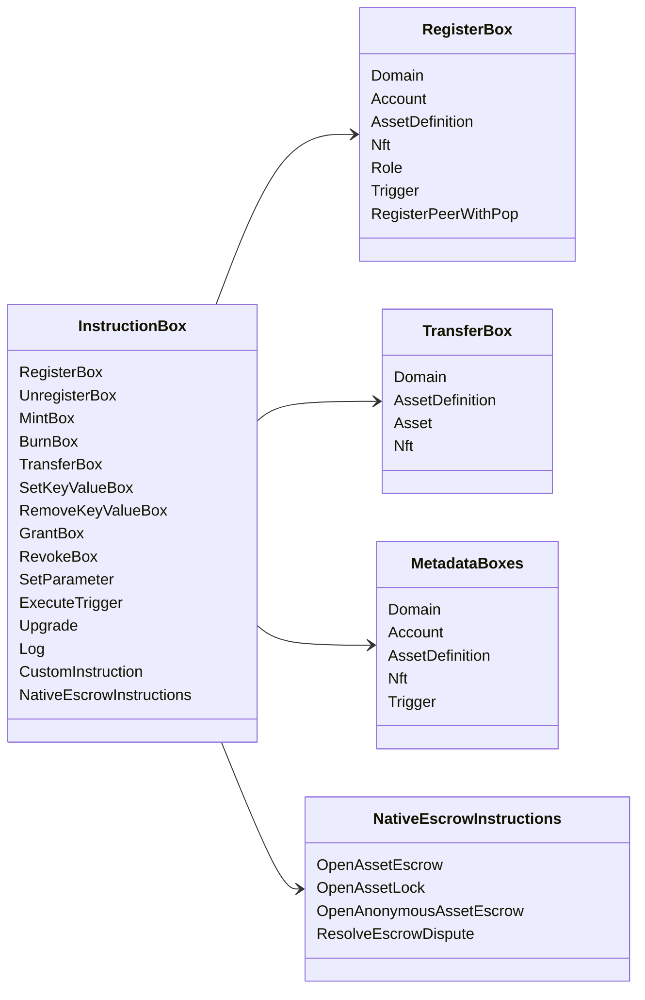

# Iroha Xüsusi təlimatlar {#iroha-special-instructions}

Mövcud məlumat modeli bu daxili təlim ailələrini aşkar edir:

|Təlimat |Variantlar |
| --- | --- |
| [`RegisterBox`](/az/blockchain/instructions.md#un-register) | `Domain`, `Account`, `AssetDefinition`, `Nft`, `Role`, `Trigger`, `RegisterPeerWithPop` |
| [`UnregisterBox`](/az/blockchain/instructions.md#un-register) | `Peer`, `Domain`, `Account`, `AssetDefinition`, `Nft`, `Role`, `Trigger` |
| [`MintBox`](/az/blockchain/instructions.md#mint-burn) |rəqəmsal `Asset`, təkrarlamaları başlatır |
| [`BurnBox`](/az/blockchain/instructions.md#mint-burn) |rəqəmsal `Asset`, təkrarlamaları başlatır |
| [`TransferBox`](/az/blockchain/instructions.md#transfer) |`Domain`, `AssetDefinition`, nömrəli `Asset`, `Nft` |
| [`SetKeyValueBox`](/az/blockchain/instructions.md#setkeyvalue-removekeyvalue) |`Domain`, `Account`, `AssetDefinition`, `Nft`, `Trigger` metadataları |
| [`RemoveKeyValueBox`](/az/blockchain/instructions.md#setkeyvalue-removekeyvalue) |`Domain`, `Account`, `AssetDefinition`, `Nft`, `Trigger` metadataları |
| [`GrantBox`](/az/blockchain/instructions.md#grant-revoke) |mühasibatlığa icazə, məsuliyyətə görə rolu, rolu yerinə yetirməyə icazə|
| [`RevokeBox`](/az/blockchain/instructions.md#grant-revoke) |Hesabdan icazə, hesabdan rolu, roldan icazə |
| [`SetParameter`](/az/blockchain/instructions.md#setparameter) |zəncir parametrlərinin yenilənməsi |
| [`ExecuteTrigger`](/az/blockchain/instructions.md#executetrigger) |başlatma |
| [`Upgrade`](/az/blockchain/instructions.md#other-instructions) |icraçı yüksəldilməsi |
| [`Log`](/az/blockchain/instructions.md#other-instructions) |icraçı qeydə alınması |
| [`CustomInstruction`](/az/blockchain/instructions.md#other-instructions) |icraçı xüsusi JSON pay yükü |
| [Yerli aktivlərin əmanəti ](/az/blockchain/escrow.md) | `OpenAssetEscrow`, `AcceptAssetEscrow`, `MarkEscrowPaymentSent`, `ReleaseAssetEscrow`, `CancelAssetEscrow`, `OpenEscrowDispute`, `ResolveEscrowDispute` |
| [Ümumi aktivlər bağlamaları](/az/blockchain/escrow.md#generic-asset-locks) |`OpenAssetLock`, `DrawdownAssetLock`, `CancelAssetLock`, `ExpireAssetLock` |
| [Anonymous asset escrow](/az/blockchain/escrow.md#anonymous-escrow) | `OpenAnonymousAssetEscrow`, `AcceptAnonymousAssetEscrow`, `MarkAnonymousEscrowPaymentSent`, `ReleaseAnonymousAssetEscrow`, `CancelAnonymousAssetEscrow`, `OpenAnonymousEscrowDispute`, `ResolveAnonymousEscrowDispute` |

Əlavə Iroha 3 modulları təlimat qeydiyyatı vasitəsilə domen xüsusi təlimat növlərini qeyd edə bilərlər. Hazırda mənbə ağacından yaradılan sxem səviyyəsi siyahısı üçün [Data Model Schema](./data-model-schema.md) baxın.

::: details Şəkil: Əsas təlimat ailələri

:::
