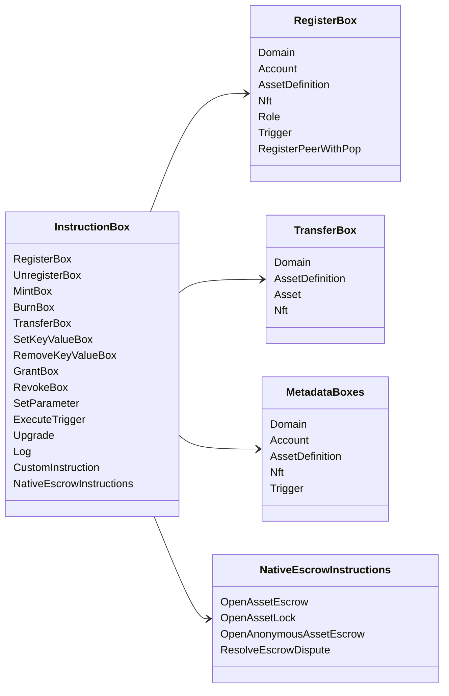

# Iroha Təlimat əməliyyatları {#iroha-special-instructions}

Hazırkı məlumat modeli bu daxili təlimat ailələrini göstərir:

|Təlimat|Variantlar|
| --- | --- |
| [`RegisterBox`](/az/blockchain/instructions.md#un-register) | `Domain`, `Account`, `AssetDefinition`, `Nft`, `Role`, `Trigger`, `RegisterPeerWithPop` |
| [`UnregisterBox`](/az/blockchain/instructions.md#un-register) | `Peer`, `Domain`, `Account`, `AssetDefinition`, `Nft`, `Role`, `Trigger` |
| [`MintBox`](/az/blockchain/instructions.md#mint-burn) |rəqəmsal `Asset`, təkrarları işə sal|
| [`BurnBox`](/az/blockchain/instructions.md#mint-burn) |rəqəmsal `Asset`, təkrarları işə sal|
| [`TransferBox`](/az/blockchain/instructions.md#transfer) | `Domain`, `AssetDefinition`, rəqəmli `Asset`, `Nft` |
| [`SetKeyValueBox`](/az/blockchain/instructions.md#setkeyvalue-removekeyvalue) | `Domain`, `Account`, `AssetDefinition`, `Nft`, `Trigger` metadatalar |
| [`RemoveKeyValueBox`](/az/blockchain/instructions.md#setkeyvalue-removekeyvalue) | `Domain`, `Account`, `AssetDefinition`, `Nft`, `Trigger` metadatalar |
| [`GrantBox`](/az/blockchain/instructions.md#grant-revoke) | `Permission` (`Grant<Permission, Account>`), `Role` (`Grant<RoleId, Account>`), `RolePermission` (`Grant<Permission, Role>`) |
| [`RevokeBox`](/az/blockchain/instructions.md#grant-revoke) | `Permission` (`Revoke<Permission, Account>`), `Role` (`Revoke<RoleId, Account>`), `RolePermission` (`Revoke<Permission, Role>`) |
| [`SetParameter`](/az/blockchain/instructions.md#setparameter) |zəncir parametrinin yenilənməsi|
| [`ExecuteTrigger`](/az/blockchain/instructions.md#executetrigger) |trigerin icrasını başlatmaq|
| [`Upgrade`](/az/blockchain/instructions.md#other-instructions) |icraçı yeniləməsi|
| [`Log`](/az/blockchain/instructions.md#other-instructions) |icraçı jurnal qeydi|
| [`CustomInstruction`](/az/blockchain/instructions.md#other-instructions) | icraçıya xas JSON faydalı yük |
| [Yerli aktiv depoziti](/az/blockchain/escrow.md) | `OpenAssetEscrow`, `AcceptAssetEscrow`, `MarkEscrowPaymentSent`, `ReleaseAssetEscrow`, `CancelAssetEscrow`, `OpenEscrowDispute`, `ResolveEscrowDispute` |
| [Ümumi aktiv kilidləri](/az/blockchain/escrow.md#generic-asset-locks) | `OpenAssetLock`, `DrawdownAssetLock`, `CancelAssetLock`, `ExpireAssetLock` |
| [Anonim aktiv depoziti](/az/blockchain/escrow.md#anonymous-escrow) | `OpenAnonymousAssetEscrow`, `AcceptAnonymousAssetEscrow`, `MarkAnonymousEscrowPaymentSent`, `ReleaseAnonymousAssetEscrow`, `CancelAnonymousAssetEscrow`, `OpenAnonymousEscrowDispute`, `ResolveAnonymousEscrowDispute` |
| [Atomik şəxsi maliyyə əməliyyatının həlli](/az/blockchain/instructions.md#atomic-private-settlement) | `ActivatePrivateSettlementPoolV1`, `RotatePrivateSettlementPoolPolicyV1`, `FinalizeAtomicPrivateSettlementV1`, `AbortAtomicPrivateSettlementV1` |

Əlavə Iroha 3 modullar təlimat reyestri vasitəsilə domen-spesifik təlimat tiplərini qeydiyyatdan keçirə bilərlər. Node-avtoritativ sxem və bunu əks etdirən bir komanda üçün baxın [Məlumat Modeli SXeması](./data-model-schema.md).

::: details Diaqram: Əsas Təlim Ailələri

:::
