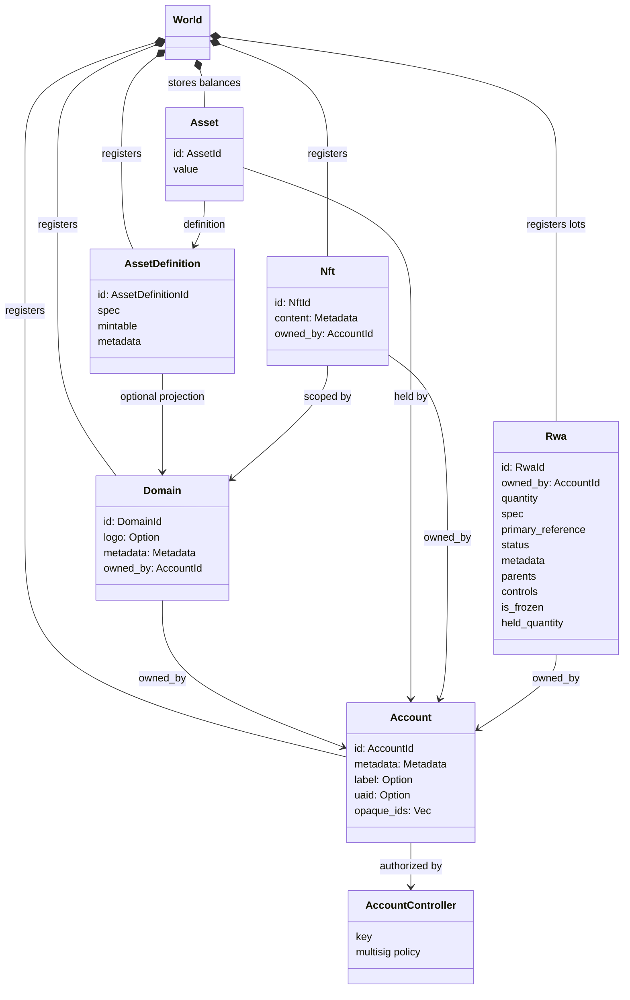
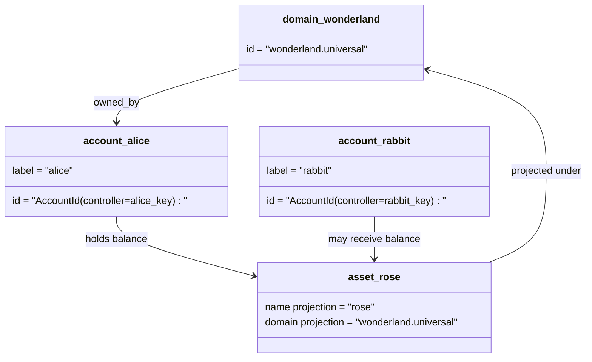

# Мәғлүмәт моделе {#data-model}

Iroha иҫәп-хисап ҡаҙнаһын `World` иҫәбендә һаҡлай. Уның тәүге сығарылыш мәғлүмәттәр моделе түбәндәге каноник шәхестәрҙе һәм субъекттарҙы ҡуллана:

- Домендар мәғлүмәт киңлеге буйынса квалификациялы, мәҫәлән `payments.universal`
- иҫәптәр каноник һәм доменһыҙ; иҫәб ID - иҫәб контролерынан алынған
- актив билдәләмәләре домен/исем проекцияһын һаҡлай ала, әммә уларҙың каноник текст адресы үтә күренмәгән Base58 идентификаторы.
- активтар - билдәле бер актив билдәләмәһе өсөн иҫәптәрҙә тотолған баланстар
- NFTs - доменлы квалификациялы IDs һәм метамәғлүмәт йөкмәткеле уникаль милектәге яҙмалар.
- RWAs - ID партиялар барлыҡҡа килә, улар ағымдағы хужалыҡ, күләм, килеп сығыу, метамәғлүмәттәр, һаҡланыу, туңатыу һәм йәшәү циклы менән идара итеүсе активтарҙан ситтә тора.

## Миҫал {#example}

Бер ваҡытта Iroha 3 селтәр, `wonderland.universal` булып тора домен эсендә `universal` Был миҫалдағы каноник иҫәптәр үҙ асҡыстары йәки сәйәсәт менән идара ителә һәм доменһыҙ тип кодлана I105 иҫәбенә IDs. Уҡырға мөмкин булған тамғалар: `alice@wonderland.universal` улар менән бәйләнгән айырым исемдәр IDs. Проекцияланған актив билдәләмәһе шулай уҡ домен һәм исемдән төҙөлөүе мөмкин: `rose` үҙ эсенә `wonderland.universal`, шул уҡ ваҡытта каналда ҡулланылған ҡануни активтар билдәләмәһе адресы генерируемая Base58 адресы.

## Алфавиттар {#aliases}

Алфавиттар - кеше йөҙөндәге исемдәр, улар каноник китаптар идентификаторҙары өҫтөндә ҡатланған. Улар файҙалы API, CLI, аҡса янсығы, һәм эҙләүсе сиктәре, әммә канон IDs Ҡаты иҫәп-хисап яландарында һаҡланған тотороҡло идентификаторҙар булып ҡала.

|Маҡсат |Каноник маҡсат |Һүҙмә-һүҙ |Яҡшы модель |
| -------------- | --------------------------------------------------- | ------------------------------------------------------ | ----------------------------------------------------------------------------- |
|Ҡулланыусы иҫәбенә |I105 адресы булараҡ кодланған доменһыҙ `AccountId` |`name@domain.dataspace` йәки `name@dataspace` |`AccountAlias`; төп ҡушамат - `Account.label`, өҫтәмә ҡушаматтар - бәйләү |
|Активтар билдәләмәһе |`AssetDefinitionId` Base58 адресы |`name#domain.dataspace` йәки `name#dataspace` |`AssetDefinitionAlias` актив билдәләмәһе менән бәйле |
|Килешеү |Canonical Bech32m `ContractAddress` |`name::domain.dataspace` йәки `name::dataspace` |`ContractAlias` ҡулланылған контракт адресына бәйләнгән |
|Домен исеме |`DomainId` формаһында `domain.dataspace` |`domain.dataspace` |SNS `domain` исемдәр арауығы рекорды |
|Мәғлүмәт биҫтәһе исеме |`DataSpaceId` актив Nexus каталогынан һанлы | мәғлүмәттәр арауығы тип аталған исемдәр: `universal`, `paynet`, йәки `zk` |SNS `dataspace` исемдәр арауығы рекорды һәм актив мәғлүмәттәр арауығы каталогы |

Хисап исемдәре - файҙаланыусыға ҡараған иҫәп-хисап исемдәре. Улар иҫәбен үҙгәртеүҙе һаҡлай, сөнки алиһә актив иҫәбенә йүнәлтә ID донъя дәүләттәре индекстары һәм иҫәп-хисап рекей яҙмалары аша. `SetPrimaryAccountAlias` иҫәптең төп билдәһе өсөн, `SetAccountAliasBinding` өҫтәмә төп булмаған исемдәр өсөн, һәм `FindAccountByAlias` йәки `FindAliasesByAccountId` иҫәп-хисап исемдәре ғәҙәттә актив SNS иҫәбенә-анималь аренда менән алынған `AcquireAccountAliasLease` һәм яңыртыла `RenewAccountAliasLease`.

Ассит атамалары - айырым иҫәп-хисап баланстары түгел, ә исем-фамилиялар.Асит атамаһы һәм килешеү атамалары уҡый торған исемдән ғәмәлдәге каноник маҡсатҡа тура бәйләнеш булып тора. `SetAssetDefinitionAlias`; Алмаш исем сегменты активтың билдәләмәһе күрһәтелгән исеме йәки проекцияланған билдәләмә исеме менән тап килә. `SetContractAlias`; контракт адресында кодланған мәғлүмәттәр киңлегенә тап килергә тейеш. ике бәйләнеш тә `lease_expiry_ms`; Мөмкинлек тәҙрәһе үткәндән һуң улар хәл итеүҙе туҡтатҡан һәм донъя дәүләттәре индекстарынан алып ташланған.

Домендар айырым бүлеккә эйә түгел `DomainAlias` объект. домен идентификаторы инде мәғлүмәт киңлеге буйынса квалификациялы исем булып тора, мәҫәлән: `payments.universal`. SNS эҙҙәр домен исемдәре өсөн лизинг хужалыҡ `domain` исемдәр арауығы һәм мәғлүмәттәр арауығы атамалары өсөн `dataspace` исемдәр киңлеге. `universal` Мәғлүмәт майҙансығы атамалары билдәләнгән булып ҡалырға тейеш.

## Төрлө документтар {#related-docs}

|Тема |Ҡайҙа барырға ?|
| -------------------------------------- | ------------------------------------------- |
|Домендар | [Домендар](/ba/blockchain/domains.md) |
|Иҫәптәр | [Хисап](/ba/blockchain/accounts.md) |
|Активтар | [Активтар](/ba/blockchain/assets.md) |
|NFTs | [NFTs](/ba/blockchain/nfts.md) |
|Реаль донъя активтары | [Реаль донъя активтары](/ba/blockchain/rwas.md) |
|Метамәғлүмәттәр | [Metadata](/ba/blockchain/metadata.md) |
|Теркәү һәм күсереү буйынса күрһәтмәләр | [Инструкциялар](/ba/blockchain/instructions.md) |
|Уйын ваҡыты рөхсәттәре | [Рөхсәт](/ba/blockchain/permissions.md) |
|Исем ҡушыу ҡағиҙәләре | [Исем биреү ҡағиҙәләре](/ba/reference/naming.md) |
