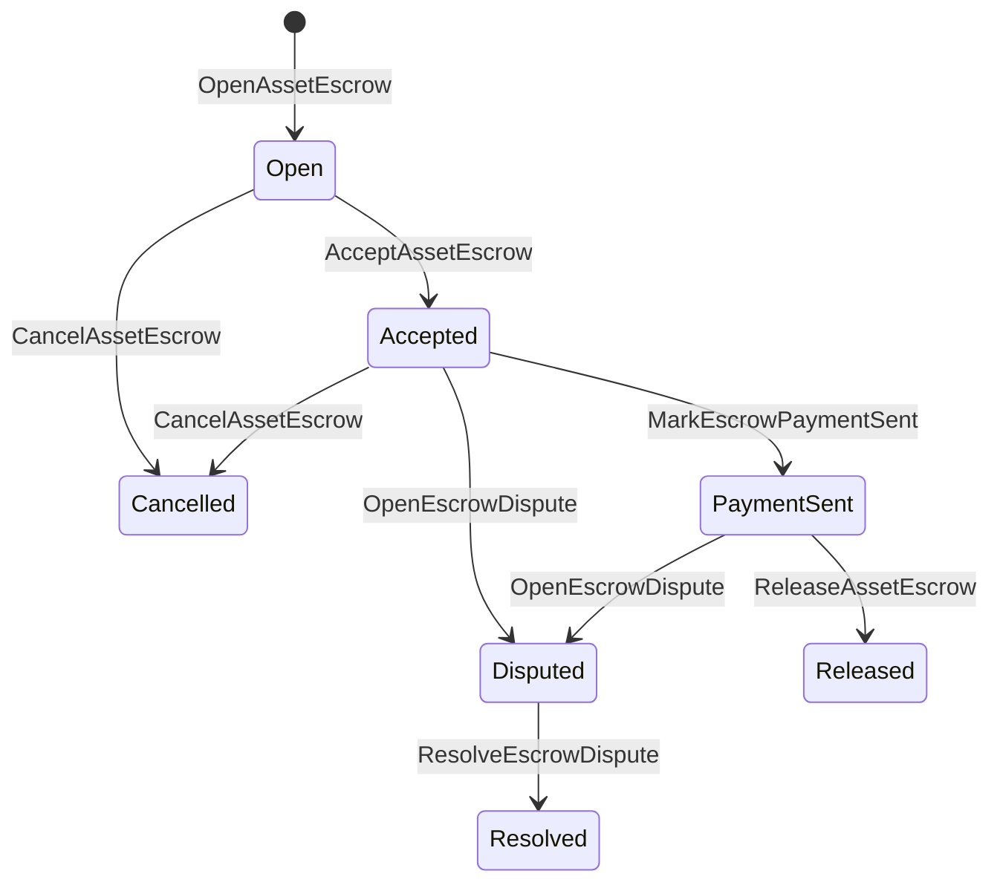

# Туған активтар иҫәбенә кредит {#native-asset-escrow}

Native escrow - һанлы активтар өсөн иҫәп-хисап менән идара ителгән һаҡланыу механизмы. Аҡсаларҙы ҡушымтаға ҡараған иҫәбкә ебәреү урынына һәм был иҫәбен һаҡлау өсөн ҡушымта кодына таяныу урынына, escrow ISIs ҡиммәтен детерминистик протокол һаҡсылыҡ иҫәбенә күсерә һәм бөтә донъя дәүләтендә Escrow ғүмере циклын теркәп бара.

Баҙарҙа иҫәп-хисап өсөн урындағы эскровынан файҙаланығыҙ, Атай стилендәге сираттан тыш түләүҙәр буйынса координация, мөһим ваҡиғаларҙың бикләүҙәре һәм һаҡланған эскроу эштәрен ҡулланығыҙ.

## Концепциялар {#concepts}

|Концепция |Тасуирлау |
| --- | --- |
|`EscrowId` |Һайлаусы тарафынан һайланған идентификатор хаш менән уратып алына. Ул үтә күренмәле һәм аноним һаҡсылар араһында үҙенсәлекле булырға тейеш. |
|`AssetEscrowRecord` |Транспарентлы һанлы активтар иҫәбенә һаҡланыу йәки бикләү. |
|`AnonymousAssetEscrowRecord` |Һаҡланған депозит иҫәбен юҡҡа сығарыусы документтар, йөкләмәләр һәм раҫлауҙар менән тәьмин ителгән. |
|Һаҡлыҡ иҫәбе |ID, ID һәм активтар билдәләмәһенән алынған детерминистик протокол иҫәбенә. |
|Дәлилдәрҙең һешы |Дәлилдәр һешы фактураларҙы, хөкөмдәрҙе, хәбәрҙәрҙе, һаҡлау манифесттарын йәки башҡа сылбырҙан тыш иҫбатлауҙарҙы асыҡлай ала.|

Транспарентлы яҙмаларҙа һатыусы, факультатив һатып алыусы, активтар билдәләмәһе, дөйөм сумма, һаҡ аҫтында тотоу иҫәбенең торошо, ғүмер циклы, тәртибе төрө, ҡалған сумма, ирекле сығарыу хоҡуғы, ирекле ваҡыттың тамамланыуы мөһерҙәре, иҫбатлау хэштәре, ваҡыт мөһәрҙәре һәм ирекле хәл итеү мәғлүмәттәре бар.

Һаҡ аҫты суммалары позитив һанлы актив күләме булырға тейеш һәм активтар билдәләмәһенең һанлы спецификацияһына тап килергә тейеш. Һаҡ аҫтын йәки бикләү әүҙем булһа, дөйөм активтар күсереүҙәре һаҡлыҡ иҫәбенә сыға алмай; һаҡлыҡтан сығыу юлдары түбәндә һүрәтләнгән һаҡ аҫты ISIs булып тора.

## Баҙарҙағы банкротлыҡ {#marketplace-escrow}

Баҙарҙа һаҡланыу системаһы сылбырҙағы активтарҙы түләү йәки тапшырыу эш аҙымынан ситтә сығарыуҙы координациялай.



|ISI |Уны кем тапшыра ?|Һөҙөмтә |
| --- | --- | --- |
|`OpenAssetEscrow` |Һатыусы |Протокол һаҡ аҫтында һатыусының һанлы активын бикләй һәм `Open` баҙарҙа рекорд булдыра. |
|`AcceptAssetEscrow` |Сатып алыусы |Һатып алыусыны теркәп, `Open` менән `Accepted` күсерә. Сатыусы үҙенең депозитын ала алмай. |
|`MarkEscrowPaymentSent` |Ҡабул ителгән һатып алыусы |`Accepted` -ға күсә `PaymentSent` һатып алыусы селтәрҙән тыш түләү ебәргәндән һуң. |
|`ReleaseAssetEscrow` |Һатыусы |`PaymentSent` менән `Released` күсерә һәм һатып алыусыға тотош суммаһын тапшыра. |
|`CancelAssetEscrow` |Һатыусы |`Open` йәки `Accepted`-ны `Cancelled`-гә күсерә һәм һатыусыға түләү билдәләнмәйенсә кире ҡайтара. |
|`OpenEscrowDispute` |Һатыусы йәки ҡабул ителгән һатып алыусы |`Accepted` йәки `PaymentSent`-ны `Disputed`-ға күсерә һәм иҫбатлау хэштегтарын ҡуша. |
|`ResolveEscrowDispute` |`CanResolveEscrowDispute` менән иҫәп|`Disputed` менән `Resolved` күсә һәм сумманы һатып алыусы менән һатыусы араһында бүленә. |

Низағдарҙы хәл итеү күләме кире түгел, ә `buyer_amount + seller_amount` депозит суммаһына тиң булырға тейеш. Һөнәрле аяҡтар рөхсәт ителә, әммә бөтә бүленеше ябыҡ балансты иҫәпкә алырға тейеш.

### Rust Миҫал {#rust-example}

Был миҫал һатыусы һәм һатып алыусы иҫәбтәре бар тип фаразлай, активтың билдәләмәһе һанлы булып теркәлгән, ә һатыусының балансы етерлек.

```rust
use iroha::{
    client::Client,
    data_model::{
        isi::escrow::{
            AcceptAssetEscrow, MarkEscrowPaymentSent, OpenAssetEscrow,
            ReleaseAssetEscrow,
        },
        prelude::*,
    },
};
use iroha_crypto::Hash;

fn release_marketplace_escrow(
    seller_client: &Client,
    buyer_client: &Client,
    asset_definition_id: AssetDefinitionId,
) -> eyre::Result<()> {
    let escrow_id = EscrowId::new(Hash::new("docs-marketplace-escrow-001"));

    seller_client.submit_blocking(OpenAssetEscrow::with_evidence_hashes(
        escrow_id,
        asset_definition_id,
        Numeric::from(40_u64),
        vec![Hash::new("invoice:2026-001")],
    ))?;

    buyer_client.submit_blocking(AcceptAssetEscrow::new(escrow_id))?;
    buyer_client.submit_blocking(MarkEscrowPaymentSent::new(escrow_id))?;
    seller_client.submit_blocking(ReleaseAssetEscrow::new(escrow_id))?;

    let record = seller_client.query_single(FindAssetEscrowById::new(escrow_id))?;
    assert_eq!(record.status, AssetEscrowStatus::Released);
    assert_eq!(record.remaining_amount, Numeric::zero());

    Ok(())
}
```

## Дөйөм активтар бикләүҙәре {#generic-asset-locks}

Активтар бикләүҙәре бер үк һаҡланыу яҙмаһы тибын ҡуллана, әммә улар һатып алыусы-һатыусы тәҡдимдәре түгел. Улар тәғәйенләнештәге иҫәп өсөн аҡсаны бикләй һәм аҡсаны алыу өсөн айырым сығарыу органы талап ителә.

|ISI |Уны кем тапшыра ?|Һөҙөмтә |
| --- | --- | --- |
|`OpenAssetLock` |Сығанаҡ иҫәбе |Яҡшы сумманы бикләй, тәғәйенләнешен рекордлы һатып алыусы итеп теркәп ҡуя һәм статусын `Locked` тип билдәләй. |
|`DrawdownAssetLock` |Азат итеү вәкәләте йәки тәғәйенләнеше, әгәр иреккә сығарыу вәкәләттәре билдәләнмәгән |Ҡалған һаҡлыҡтың бер өлөшөн йәки бөтәһен дә билдәләнгән урынға күсерә. |
|`CancelAssetLock` |Ҡоҙаҡты асыу |Актив бикләүҙе юҡҡа сығара һәм ҡалған сумманы асыусыға ҡайтарып бирә. |
|`ExpireAssetLock` |Ваҡыт үткәндән һуң ниндәй ҙә булһа транзакция органы |Үткәндә `expires_at_ms` менән бикләнгән сумма юҡҡа сыға һәм ҡалған сумманы асыусыға ҡайтарыла. |

`DrawdownAssetLock` `Locked` иҫәбен һаҡлай, ә күпмедер сумма тороп ҡала. Ҡалған сумма нулға еткәндә, статус `DrawnDown` булып китә һәм иҫәп ябыла.

```rust
use iroha::{
    client::Client,
    data_model::{
        isi::escrow::{CancelAssetLock, DrawdownAssetLock, ExpireAssetLock, OpenAssetLock},
        prelude::*,
    },
};
use iroha_crypto::Hash;

fn drawdown_and_close_asset_locks(
    opener_client: &Client,
    destination_client: &Client,
    release_authority_client: &Client,
    asset_definition_id: AssetDefinitionId,
    destination: AccountId,
    release_authority: AccountId,
) -> eyre::Result<()> {
    let trusted_lock_id = EscrowId::new(Hash::new("docs-asset-lock-trusted"));

    opener_client.submit_blocking(OpenAssetLock::with_options(
        trusted_lock_id,
        asset_definition_id.clone(),
        destination.clone(),
        Numeric::from(40_u64),
        Some(release_authority),
        None,
        vec![Hash::new("milestone-plan-v1")],
    ))?;

    release_authority_client.submit_blocking(DrawdownAssetLock::new(
        trusted_lock_id,
        Numeric::from(15_u64),
    ))?;

    let partially_drawn =
        opener_client.query_single(FindAssetEscrowById::new(trusted_lock_id))?;
    assert_eq!(partially_drawn.status, AssetEscrowStatus::Locked);
    assert_eq!(partially_drawn.remaining_amount, Numeric::from(25_u64));

    opener_client.submit_blocking(CancelAssetLock::new(
        trusted_lock_id,
        partially_drawn.remaining_amount.clone(),
    ))?;
    let cancelled = opener_client.query_single(FindAssetEscrowById::new(trusted_lock_id))?;
    assert_eq!(cancelled.status, AssetEscrowStatus::Cancelled);

    let expiring_lock_id = EscrowId::new(Hash::new("docs-asset-lock-expiring"));
    opener_client.submit_blocking(OpenAssetLock::with_options(
        expiring_lock_id,
        asset_definition_id,
        destination,
        Numeric::from(10_u64),
        None,
        Some(0),
        Vec::new(),
    ))?;

    destination_client.submit_blocking(ExpireAssetLock::new(expiring_lock_id))?;
    let expired = opener_client.query_single(FindAssetEscrowById::new(expiring_lock_id))?;
    assert_eq!(expired.status, AssetEscrowStatus::Expired);

    Ok(())
}
```

Python әлеге ваҡытта дөйөм йоҙаҡтар өсөн юғары кимәлдәге ярҙамсыларҙы асыҡлай: `open_asset_lock`, `drawdown_asset_lock`, `cancel_asset_lock` һәм `expire_asset_lock`. Баҙарҙа һәм Python ҙан аноним ышанысҡа тотоноу өсөн `InstructionBox` JSON каноникаһын ҡулланып, SDK-тың JSON ҡасып сығыу шлюзы аша үтә. йәки SDK аша тапшырыу, беренсе класлы депозит төҙөүселәрҙе асыҡлау өсөн.

## Низағтар {#disputes}

Баҙарҙа ышаныслы депозит бәхәскә инә ала: `Accepted` йәки `PaymentSent`. Тик теркәлгән һатыусы йәки һатып алыусы ғына бәхәсте асырға мөмкин. `CanResolveEscrowDispute`, йәки туранан-тура хәл итеүсе иҫәбенә бирелгән йәки роль аша мираҫ итеп алынған.

```rust
use iroha::{
    client::Client,
    data_model::{
        isi::escrow::{OpenEscrowDispute, ResolveEscrowDispute},
        prelude::*,
    },
};
use iroha_crypto::Hash;
use iroha_executor_data_model::permission::escrow::CanResolveEscrowDispute;

fn resolve_disputed_escrow(
    admin_client: &Client,
    buyer_client: &Client,
    court_client: &Client,
    court: AccountId,
    escrow_id: EscrowId,
) -> eyre::Result<()> {
    admin_client.submit_blocking(Grant::account_permission(
        Permission::from(CanResolveEscrowDispute),
        court,
    ))?;

    buyer_client.submit_blocking(OpenEscrowDispute::with_evidence_hashes(
        escrow_id,
        vec![Hash::new("buyer-payment-receipt")],
    ))?;

    court_client.submit_blocking(ResolveEscrowDispute::with_evidence_hashes(
        escrow_id,
        Numeric::from(30_u64),
        Numeric::from(10_u64),
        vec![Hash::new("court-judgement-001")],
    ))?;

    let record = admin_client.query_single(FindAssetEscrowById::new(escrow_id))?;
    assert_eq!(record.status, AssetEscrowStatus::Resolved);
    assert_eq!(
        record.resolution.as_ref().map(|resolution| resolution.buyer_amount.clone()),
        Some(Numeric::from(30_u64)),
    );

    Ok(())
}
```

## Аноним Escrow {#anonymous-escrow}

Аноним конфиденциаль депозит шул уҡ баҙарҙа йәшәү циклын ҡуллана, әммә финанслау һәм ябыу активтар хәрәкәте һаҡланған. Һалымдар һәм аҡса алыусылар һаҡланған банкноталар эсендә йөкләмәләр, юҡҡа сығарыу билдәләре һәм иҫбатлау биттәрендә күрһәтелгән.

|Прозрачный ISI |Аноним ISI |
| --- | --- |
|`OpenAssetEscrow` |`OpenAnonymousAssetEscrow` |
|`AcceptAssetEscrow` |`AcceptAnonymousAssetEscrow` |
|`MarkEscrowPaymentSent` |`MarkAnonymousEscrowPaymentSent` |
|`ReleaseAssetEscrow` |`ReleaseAnonymousAssetEscrow` |
|`CancelAssetEscrow` |`CancelAnonymousAssetEscrow` |
|`OpenEscrowDispute` |`OpenAnonymousEscrowDispute` |
|`ResolveEscrowDispute` |`ResolveAnonymousEscrowDispute` |

Портфель йәки провер инструменттары иҫбатлау ҡушымтаһын һәм йәмәғәт инештәрен төҙөргә тейеш. асыу бер экспозиция йөкләмәһен булдыра. Азатлыҡ, ғәмәлдән сығарыу һәм аноним бәхәстәрҙе сисеү өсөн бер экспониция йөкләмәһе тотонорға һәм һатып алыусыны, һатыусыны йәки бүленгән сығанаҡ йөкләмәләрен булдырырға кәрәк.

```rust
use iroha::{
    client::Client,
    data_model::{
        isi::escrow::{
            AcceptAnonymousAssetEscrow, MarkAnonymousEscrowPaymentSent,
            OpenAnonymousAssetEscrow,
        },
        prelude::*,
        proof::ProofAttachment,
    },
};
use iroha_crypto::Hash;

fn open_anonymous_escrow(
    seller_client: &Client,
    buyer_client: &Client,
    escrow_id: EscrowId,
    asset_definition_id: AssetDefinitionId,
    funding_nullifiers: Vec<[u8; 32]>,
    escrow_commitment: [u8; 32],
    proof: ProofAttachment,
    root_hint: Option<[u8; 32]>,
) -> eyre::Result<()> {
    seller_client.submit_blocking(OpenAnonymousAssetEscrow::with_evidence_hashes(
        escrow_id,
        asset_definition_id,
        funding_nullifiers,
        escrow_commitment,
        proof,
        root_hint,
        vec![Hash::new("shielded-invoice")],
    ))?;

    buyer_client.submit_blocking(AcceptAnonymousAssetEscrow::new(escrow_id))?;
    buyer_client.submit_blocking(MarkAnonymousEscrowPaymentSent::new(escrow_id))?;

    Ok(())
}
```

Нигеҙҙә һаҡланған транзакция моделе өсөн [Anonymous Transactions](/ba/blockchain/anonymous-transactions.md) ҡарағыҙ.

## SDK Ҡулланыу {#sdk-usage}

Эскроу ярҙамы төрлөсә асыҡлана SDKs. Rust каноник типланған мәғлүмәттәр моделе бар. Python Хәҙерге ваҡытта активтарҙы бикләүгә ярҙам итеүселәрҙе асыҡлай. JavaScript һәм TypeScript ҡулланыу Kotodama Ҡунаҡсыларҙың шылтыратыуҙарына ышаныслылыҡ һала. Kotlin/JVM һәм Swift баҙар өсөн типографик файҙалы йөк төҙөүселәр һәм аноним ышаныс менән тәьмин итеүсе.

|SDK |Был өҫкө йөҙөн ҡулланығыҙ.|Күләмдәре |
| --- | --- | --- |
| [Rust](#rust-sdk) |`iroha::data_model::isi::escrow` |Баҙарҙа депозит, дөйөм йоҙаҡтар, анонимные депозит, һорауҙар һәм ваҡиғалар. |
| [Python](#python-asset-locks) |`Instruction.open_asset_lock`, `TransactionDraft.open_asset_lock` һәм клиент ярҙамсылары `*_and_wait` |Дөйөм активтар бикләү. Баҙар һәм аноним ышаныслы ярҙамсылары әлегә беренсе класлы Python алымдар түгел. |
| [JavaScript / TypeScript](#javascript-and-typescript-kotodama) |`compileKotodamaProgram` от `@iroha/iroha-js/kotodama-compiler` |Kotodama килешеүҙәр эсендә эскроу хостинг шылтыратыуҙар. |
| [Kotlin / JVM](#kotlin-and-jvm) |`InstructionTemplate` кластары менән `org.hyperledger.iroha.sdk.core.model.instructions` |Баҙар майҙаны һәм аноним эскроу ҡулайлаштырылған инструкция шаблондары. |
| [Swift / iOS](#swift-and-ios) |`NativeEscrowInstructionBuilders` һәм `IrohaSDK.build*Escrow*` ярҙамсылары |Баҙар һәм аноним депозит Norito JSON инструкция йөкләмәләре. |

Төмәндәге миҫалдар инструкция төҙөүгә йүнәлтелгән. иҫәпкә финанслау, ҡултамғалар менән идара итеү һәм транзакцияларҙы тапшырыу һәр SDK өсөн нормаль ағымды күҙәтә.

### Rust SDK {#rust-sdk}

Rust SDK тулы урындағы яҡтыртыу йәки һорау / ваҡиға ярҙамы кәрәк саҡта ҡулланығыҙ. Юғарыла килтерелгән миҫалдарҙа баҙарҙа сығарыу, дөйөм ябылыу тарҡалыуы, бәхәстәрҙе хәл итеү һәм `iroha::data_model::isi::escrow` менән аноним һаҡлау төҙөлөшө күрһәтелгән.

```rust
use iroha::{
    client::Client,
    data_model::{isi::escrow::OpenAssetEscrow, prelude::*},
};
use iroha_crypto::Hash;

fn open_and_read(
    client: &Client,
    asset_definition_id: AssetDefinitionId,
) -> eyre::Result<AssetEscrowRecord> {
    let escrow_id = EscrowId::new(Hash::new("docs-rust-sdk-escrow"));

    client.submit_blocking(OpenAssetEscrow::new(
        escrow_id,
        asset_definition_id,
        Numeric::from(10_u64),
    ))?;

    client.query_single(FindAssetEscrowById::new(escrow_id))
}
```

### Python Яҡшылыҡ ҡағиҙәләре {#python-asset-locks}

Python SDK беренсе класлы ярҙамсыларҙы дөйөм активтарҙы бикләү өсөн асыҡлай. Уларҙы йылъяҙма түләүҙәр, иреккә сығарыу органы ярҙамында түләтеүҙәр, асыусының аннулированиеһы һәм ваҡыты тамамланған аҡсаны ҡайтарыу өсөн файҙаланыу.

```python
client.open_asset_lock_and_wait(
    chain_id="dev-chain",
    authority="<source-account-id>",
    private_key_hex="<source-private-key-hex>",
    escrow_id="merchant-lock-001",
    asset_definition_id="<asset-definition-base58>",
    destination="<destination-account-id>",
    amount="2500",
    release_authority="<trusted-release-account-id>",
    expires_at_ms=1_704_000_000_000,
)

client.drawdown_asset_lock_and_wait(
    chain_id="dev-chain",
    authority="<trusted-release-account-id>",
    private_key_hex="<trusted-release-private-key-hex>",
    escrow_id="merchant-lock-001",
    amount="1000",
)

client.expire_asset_lock_and_wait(
    chain_id="dev-chain",
    authority="<any-account-id>",
    private_key_hex="<any-private-key-hex>",
    escrow_id="merchant-lock-001",
)
```

Ике яҡлы бикләү өсөн `release_authority` ҡалдырығыҙ; киләсәктең иҫәбенә `drawdown_asset_lock` тапшырырға мөмкин.

### JavaScript һәм TypeScript Kotodama {#javascript-and-typescript-kotodama}

JavaScript SDK әлеге ваҡытта туранан-тура урындағы эскроу транзакция төҙөүселәрҙе асыҡламай. Kotodama килешеүҙәрен урынлаштырыусы JavaScript йәки TypeScript ҡушымталары өсөн, Kotodama компиляторы менән экстроу хостинг саҡырыуҙарын төҙөгеҙ.

Туған эскроу хостинг шылтыратыуҙарына асыҡтан-асыҡ инеү күрһәткестәре кәрәк, сөнки компилятор ISIs үтә күренмәле эскроуға тарраҡ инеү йыйылмаларын ала алмай. Экспорт ителгән инеү нөктәләрендә `escrow_*` ингредиенттарын саҡырыусы wildcard иҫкәртеүҙәре ҡулланығыҙ.

```js
import { compileKotodamaProgram } from "@iroha/iroha-js/kotodama-compiler";

const source = `
seiyaku MarketplaceEscrow {
  meta { abi_version: 1; }

  #[access(read="*", write="*")]
  kotoage fn run() permission(Admin) {
    let asset = asset_definition("62Fk4FPcMuLvW5QjDGNF2a4jAmjM");
    let offer = name("aitai_offer");
    let evidence = norito_bytes("00");

    call escrow_open_offer(offer, asset, 10, evidence);
    call escrow_accept(offer);
    call escrow_mark_payment_sent(offer);
    call escrow_release(offer);
  }
}
`;

const compiled = compileKotodamaProgram(source, {
  sourceName: "escrow.ko",
});

if (compiled.diagnostics.length > 0) {
  throw new Error(compiled.diagnostics.map((item) => item.message).join("\n"));
}
```

Низағ өсөн ҡулланыу `escrow_open_dispute(offer, evidence)` һәм `escrow_resolve_dispute(offer, buyer_amount, seller_amount, evidence)`. Аноним конфискация хостинг шылтыратыуҙар ҡабул итә Norito файҙалы йөкләмә байттарын һорап, мәҫәлән: `anonymous_escrow_open_offer(request)`.

### Kotlin һәм JVM {#kotlin-and-jvm}

Kotlin/JVM SDK үҙенсәлекле эскроу моделдәрен ҡулайлаштырылған инструкция өлгөләре. Һәр өлгө талап ителгән ҡырҙарҙы раҫлай һәм транзакция төҙөүсе ҡулланған каноник аргумент картаһын аса.

```kotlin
import org.hyperledger.iroha.sdk.core.model.escrow.NativeEscrowPermissions
import org.hyperledger.iroha.sdk.core.model.instructions.AcceptAssetEscrowInstruction
import org.hyperledger.iroha.sdk.core.model.instructions.MarkEscrowPaymentSentInstruction
import org.hyperledger.iroha.sdk.core.model.instructions.OpenAssetEscrowInstruction
import org.hyperledger.iroha.sdk.core.model.instructions.ReleaseAssetEscrowInstruction
import org.hyperledger.iroha.sdk.core.model.instructions.ResolveEscrowDisputeInstruction

val open = OpenAssetEscrowInstruction(
    escrowId = "escrow-hash",
    assetDefinition = "xor#wonderland",
    amount = "42.5",
    evidenceHashes = listOf("invoice-hash"),
)
val accept = AcceptAssetEscrowInstruction("escrow-hash")
val paid = MarkEscrowPaymentSentInstruction("escrow-hash")
val release = ReleaseAssetEscrowInstruction("escrow-hash")
val resolve = ResolveEscrowDisputeInstruction(
    escrowId = "escrow-hash",
    buyerAmount = "30",
    sellerAmount = "12.5",
    evidenceHashes = listOf("judgement-hash"),
)

println(open.arguments)
println(NativeEscrowPermissions.CAN_RESOLVE_ESCROW_DISPUTE)
```

Аноним шаблондар түбәндәгесә була: `OpenAnonymousAssetEscrowInstruction`, `AcceptAnonymousAssetEscrowInstruction`, `MarkAnonymousEscrowPaymentSentInstruction`, `ReleaseAnonymousAssetEscrowInstruction`, `CancelAnonymousAssetEscrowInstruction`, `OpenAnonymousEscrowDisputeInstruction`, һәм `ResolveAnonymousEscrowDisputeInstruction`. Android Ява шылтыратыусылар тап килә ҡулланырға мөмкин `NativeEscrowInstructions.*` Төҙөүселәр Android артефакт.

### Swift һәм iOS {#swift-and-ios}

Ҡоролтай Swift SDK конфиденциаль йөкләмәләр төҙөй Norito JSON файҙалы йөкләмәләр. `NativeEscrowInstructionBuilders` туранан-тура, йәки эквивалент `IrohaSDK.build*Escrow*` ярҙамсы, әгәр һеҙҙең ҡушымтаһы инде бар `IrohaSDK` миҫал.

```swift
import IrohaSwift

let open = try NativeEscrowInstructionBuilders.openAssetEscrow(
    escrowId: "escrow-hash",
    assetDefinition: "xor#wonderland",
    amount: "42.5",
    evidenceHashes: ["invoice-hash"]
)
let accept = try NativeEscrowInstructionBuilders.acceptAssetEscrow(
    escrowId: "escrow-hash"
)
let paid = try NativeEscrowInstructionBuilders.markEscrowPaymentSent(
    escrowId: "escrow-hash"
)
let release = try NativeEscrowInstructionBuilders.releaseAssetEscrow(
    escrowId: "escrow-hash"
)
let resolve = try NativeEscrowInstructionBuilders.resolveEscrowDispute(
    escrowId: "escrow-hash",
    buyerAmount: "30",
    sellerAmount: "12.5",
    evidenceHashes: ["judgement-hash"]
)
```

Аноним Swift төҙөүселәр юҡҡа сығарыусы исемлектәр, сығыу йөкләмәләр исемлектәре, иҫбатлау һүҙлеге, һәм факультатив `rootHint` бәхәстәрҙе хәл итеүгә рөхсәт билдәһе `NativeEscrowPermissions.canResolveEscrowDispute`.

## Һорауҙар һәм ваҡиғалар {#queries-and-events}

Статус биттәренә, яраштырыу эштәренә һәм ярҙам инструменттарына эскроу һорауҙарын ҡулланығыҙ:

|Һорау |Маҡсат |
| --- | --- |
|`FindAssetEscrowById` |`EscrowId` менән бер үтә күренмәле депозит йәки йоҙаҡ уҡығыҙ. |
|`FindAssetEscrows` |Прозрачный депозит һәм бикләү яҙмалары исемлеге. |
|`FindAssetEscrowsBySeller` |Һатыусы йәки йоҙаҡты асыусы тарафынан асылған яҙмаларҙы исемлеккә килтерегеҙ. |
|`FindAssetEscrowsByBuyer` |Баҙарҙа һатып алыусы тарафынан ҡабул ителгән депозиттарҙы исемлекләгеҙ йәки маҡсатҡа йүнәлтелгән бурыстарҙы билдәләгеҙ. |
|`FindAssetEscrowsByStatus` |`AssetEscrowStatus` иҫәбен алыу. |
|`FindAnonymousAssetEscrowById` |`EscrowId` менән бер аноним депозит уҡығыҙ. |
|`FindAnonymousAssetEscrows*` |Бөтә иҫәбе, һатыусы, һатып алыусы йәки статусы буйынса аноним депозиттарҙы исемлеккә индер. |

`EscrowEventFilter` транспарентлы урындағы конфискация һәм конфискациялау сараларына яҙылырға мөмкин . ID, һатыусы, һатып алыусы, статусы һәм ваҡиғалар маскаһы. `Opened`, `Accepted`, `PaymentSent`, `Released`, `Cancelled`, `Expired`, `Disputed`, һәм `Resolved`. Аноним конфиденциаль иҫәп-хисаптар аноним конфидениаль һорауҙар аша тикшерелә.

## Оператив иҫкәрмәләр {#operational-notes}

- Оло счеттарҙы, яҙмаларҙы, ҡарарҙарҙы йәки аудиторҙар төркөмдәрен һаҡлағыҙ һәм уларҙы иҫбатлау сифатында беркетегеҙ.
- Ҡабул итеүҙәрҙә тотороҡло `EscrowId` сығарылышын ҡулланыу, шуға күрә ҡабаттан һынауҙар бер үк тәҡдим өсөн икеләтә гарантиялар булдыра алмаясаҡ.
- `CanResolveEscrowDispute` бары тик бәхәсле процесты үҙләштереүсе иҫәптәргә йәки ролдәргә генә бирелә.
- Сылбырҙан тыш түләүҙәр менән тикшереүҙе ғариза сәйәсәте итеп ҡабул итегеҙ. Iroha һаҡланыу һәм йәшәү циклы күсештәрен теркәп бара; ул үҙенән-үҙе фиат йәки тышҡы түләү рельстарын тикшермәй.
