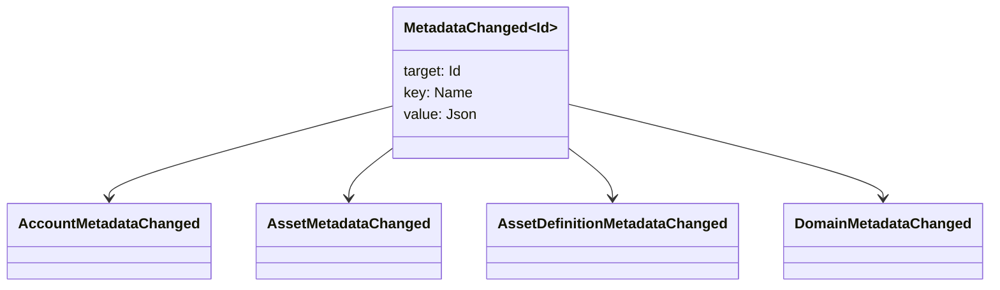

# Метамәғлүмәттәр {#metadata}

Метамәғлүмәттәр - буклет объекттарына беркетелгән тикшерелгән асҡыс-ҡиммәт картаһы. асҡыстар `Name` ҡиммәттәр, ә ҡиммәттәр JSON (`Json`) файҙалы йөкләмәләр.

Артабанғы объекттар метамәғлүмәттәрҙе йөрөтә ала:

- домендар
- иҫәптәр
- активтар
- активтар билдәләмәләре
- NFTs
- RWAs
- триггерҙар
- операциялар

Реестр хәленә ҡараған бәләкәй тасуирлау йәки индексация ҡырҙары өсөн metadata ҡулланығыҙ. Ҙур payload-тарҙы WSV-нан ситтә һаҡлағыҙ һәм уларға digest, URI йәки SoraFS path аша һылтанығыҙ.

Метамәғлүмәттәрҙе, активтарҙы NFTs, RWAs йәки сылбырҙан тыш һаҡлауҙы һайлау буйынса күрһәтмәләр өсөн [Метамәғлилдәр һәм иҫәп яҙмаларын һаҡлау һайлауҙар](/ba/guide/configure/metadata-and-store-assets.md) ҡарағыҙ.

## Taira менән һынап ҡарағыҙ. {#try-it-on-taira}

Метамәғлүмәттәр нормаль ресурс уҡыу аша күренә. Был команда Taira актив билдәләмәләрен исемлек итә, уларҙа әлеге ваҡытта метамәғлүмәт бар:

```bash
curl -fsS 'https://taira.sora.org/v1/assets/definitions?limit=100' \
  | jq '.items[]
    | select((.metadata | length) > 0)
    | {id, name, metadata}'
```

Домендар һәм иҫәп яҙмалары өсөн шул уҡ схеманы ҡулланығыҙ:

```bash
curl -fsS 'https://taira.sora.org/v1/domains?limit=20' \
  | jq '.items[] | select((.metadata // {} | length) > 0)'

curl -fsS 'https://taira.sora.org/v1/accounts?limit=20' \
  | jq '.items[] | select((.metadata // {} | length) > 0)'
```

Буш output-ты ғәмәлдәге result тип ҡабул итегеҙ. Был Taira objects-тың ағымдағы битендә metadata юҡлығын аңлата, endpoint уңышһыҙ булды тигәнде түгел.

## Метамәғлүмәттәрҙе яңыртыу {#updating-metadata}

Iroha махсус инструкциялар менән алмаштырыла:

- [`SetKeyValue`](/ba/blockchain/instructions.md#setkeyvalue-removekeyvalue) клавишаны ҡуйып йәки алмаштыра.
- [`RemoveKeyValue`](/ba/blockchain/instructions.md#setkeyvalue-removekeyvalue) асҡыс алып ташлай.

Транзакцияны тапшырыусы орган актив үтәү ваҡытын раҫлаусы рөхсәткә эйә булырға тейеш. По умолчанию permission surface өсөн ҡара: [Рөхсәт биреү билдәләре](/ba/reference/permissions.md).

## Ваҡиғалар {#events}

Мәғлүмәт ваҡиғалары метамәғлүмәттәр үҙгәргәндә ебәрелә. Дөйөм ваҡиға файҙалы йөкләмәһе `MetadataChanged<Id>`:



[мәғлүмәт ваҡиғалары фильтрҙарын](/ba/blockchain/filters.md#data-event-filters) ҡулланып, интеграция өсөн мөһим булған субъект тибы йәки объекты ID өсөн метамәғлүмәттәр ваҡиғаларына ғына яҙылыу.

## Һорауҙар {#queries}

Метамәғлүмәттәр һоралған объекттың бер өлөшө булараҡ кире ҡайтарыла. Мәҫәлән, [`FindAccountById`](/ba/reference/queries.md#accounts-and-permissions), [`FindDomainById`](/ba/reference/queries.md#domains-and-peers) йәки [`FindAssetDefinitionById`](/ba/reference/queries.md#assets-nfts-and-rwas) ҡулланығыҙ. [`FindNfts`](/ba/reference/queries.md#assets-nfts-and-rwas) йәки [`FindNftsByAccountId`](/ba/reference/queries.md#assets-nfts-and-rwas) NFTs, һәм [`FindRwas`](/ba/reference/queries.md#assets-nfts-and-rwas) RWA партиялары өсөн ҡулланығыҙ. Һуңынан объекттың метамәғлүмәт яланына уҡығыҙ. NFT һорауҙарға яуаптар NFT `content` картаһын яҙма метамәғлүмдәр булараҡ аса.

Метамәғлүмәт асҡыстары иҫәп-хисап хәленең бер өлөшө булып тора, шуға күрә уларҙы тотороҡло һаҡлағыҙ һәм JSON ҡиммәте был версияны асыҡтан-асыҡ алып бара алһа, ҡушымтаға ярашлы версияны кодлауҙан ситтә тороғоҙ.
