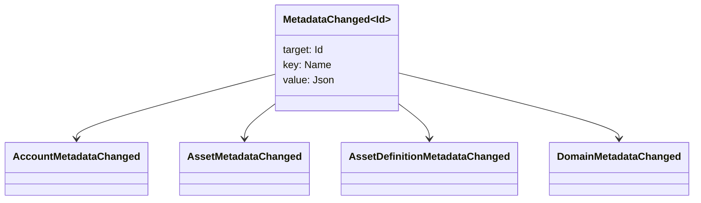

# Метамәғлүмәттәр {#metadata}

Метамәғлүмәттәр - буклет объекттарына беркетелгән тикшерелгән асҡыс-ҡиммәт картаһы. асҡыстар `Name` ҡиммәттәр, ә ҡиммәттәр JSON (`Json`) файҙалы йөкләмәләр.

Артабанғы объекттар метамәғлүмәттәрҙе йөрөтә ала:

- домендар
- иҫәптәр
- активтар
- активтар билдәләмәләре
- NFTs
- RWAs
- триггерҙар
- операциялар

ҙур файҙалы йөкләмәләр тыштан һаҡланырға тейеш. WSV һәм ул (Ҡөръән) менән ант итәм. URI, йәки SoraFS Юл.

Метамәғлүмәттәрҙе, активтарҙы һайлау буйынса күрһәтмәләр өсөн. NFTs, RWAs, йәки ситтә һаҡланыу, ҡара: [Метамәғлүмәттәрҙе һәм иҫәп яҙмаларын һаҡлау мөмкинлектәрен](/ba/guide/configure/metadata-and-store-assets.md).

## Taira менән һынап ҡарағыҙ. {#try-it-on-taira}

Метамәғлүмәттәр нормаль ресурс уҡыу аша күренә. Был команда Taira актив билдәләмәләрен исемлек итә, уларҙа әлеге ваҡытта метамәғлүмәт бар:

```bash
curl -fsS 'https://taira.sora.org/v1/assets/definitions?limit=100' \
  | jq '.items[]
    | select((.metadata | length) > 0)
    | {id, name, metadata}'
```

Домендар һәм иҫәп яҙмалары өсөн шул уҡ схеманы ҡулланығыҙ:

```bash
curl -fsS 'https://taira.sora.org/v1/domains?limit=20' \
  | jq '.items[] | select((.metadata // {} | length) > 0)'

curl -fsS 'https://taira.sora.org/v1/accounts?limit=20' \
  | jq '.items[] | select((.metadata // {} | length) > 0)'
```

Был Taira объекттарының ағымдағы битендә метамәғлүмәттәр юҡ, тип аңлатмай, ахырғы нөктә уңышһыҙлыҡ кисерә.

## Метамәғлүмәттәрҙе яңыртыу {#updating-metadata}

Iroha махсус инструкциялар менән алмаштырыла:

- [`SetKeyValue`](/ba/blockchain/instructions.md#setkeyvalue-removekeyvalue) клавишаны ҡуйып йәки алмаштыра.
- [`RemoveKeyValue`](/ba/blockchain/instructions.md#setkeyvalue-removekeyvalue) асҡыс алып ташлай.

Транзакцияны тапшырыусы орган актив үтәү ваҡытын раҫлаусы талап ителгән рөхсәт эйә булырға тейеш. [Рөхсәт биреү билдәләре](/ba/reference/permissions.md).

## Ваҡиғалар {#events}

Мәғлүмәт ваҡиғалары метамәғлүмәттәр үҙгәргәндә ебәрелә. Дөйөм ваҡиға файҙалы йөкләмәһе `MetadataChanged<Id>`:



[мәғлүмәт ваҡиғалары фильтрҙарын](/ba/blockchain/filters.md#data-event-filters) ҡулланып, интеграция өсөн мөһим булған субъект тибы йәки объекты ID өсөн метамәғлүмәттәр ваҡиғаларына ғына яҙылыу.

## Һорауҙар {#queries}

Метамәғлүмәттәр һоралған объект өлөшө булараҡ кире ҡайтарыла. Мәҫәлән, ҡулланыу [`FindAccountById`](/ba/reference/queries.md#accounts-and-permissions), [`FindDomainById`](/ba/reference/queries.md#domains-and-peers), йәки [`FindAssetDefinitionById`](/ba/reference/queries.md#assets-nfts-and-rwas). Ҡулланыу [`FindNfts`](/ba/reference/queries.md#assets-nfts-and-rwas) йәки [`FindNftsByAccountId`](/ba/reference/queries.md#assets-nfts-and-rwas) өсөн NFTs, һәм [`FindRwas`](/ba/reference/queries.md#assets-nfts-and-rwas) өсөн RWA Һуңынан объекттың метамәғлүмәттәрен уҡығыҙ. NFT Һорауҙарға яуаптар белдерә NFT `content` картаһы - яҙма метамәғлүмәттәре.

Метамәғлүмәт асҡыстары иҫәп-хисап хәленең бер өлөшө булып тора, шуға күрә уларҙы тотороҡло һаҡлағыҙ һәм JSON ҡиммәте был версияны асыҡтан-асыҡ алып бара алһа, ҡушымтаға ярашлы версияны кодлауҙан ситтә тороғоҙ.
