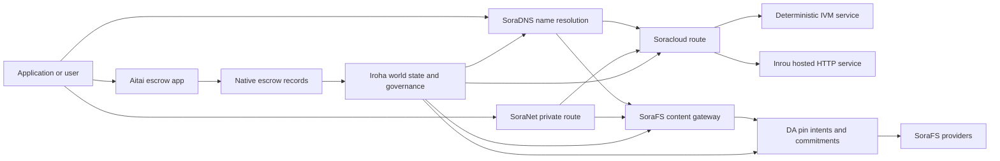

# SORA Nexus Хеҙмәттәре {#sora-nexus-services}


SORA Nexus өҫтәмә ҡушымтаға ҡараған сервис самолеттары тирәләй Iroha 3. Был хеҙмәттәр айырым бухгалтерҙар түгел, улар нигеҙләнгән Iroha донъя дәүләте, Norito манифесттар, идаралыҡ документтары һәм Torii маршрут ғаиләләре.

Ҡулланыуы узел төҙөлөшөнә һәм селтәр профиленә бәйле. [`/openapi`](/ba/reference/torii-endpoints.md#app-and-sora-route-families) ҡулланыу маҡсатлы узелда генерацияланған ҡушымта-API маршруттарын асыҡлау өсөн. Йәмәғәт урындағы SoraFS CID һәм билдәле маршруттар был документтан ситтә ҡуйылған, шуға күрә ул маршруттарҙы тикшергәндә туранан-тура тикшереү.

## Компоненттар картаһы {#component-map}

|Компонент |Роль |Төп өҫкө йөҙҙәр |
| ---------------------- | ------------------------------------------------------------------------------------------------------------------------------------------- | ---------------------------------------------------------------------------------------- |
|Soracloud |Ҡушымталарҙы урынлаштырыу, хостинг хеҙмәттәре, шәхси модель/эшләү ваҡыты торошо һәм сервис ғүмер циклын контролдә тотоу. |`/v1/soracloud/`, `/api/`, `iroha app soracloud ...` |
|Иртәнге |Soracloud тоташтырылған HTTP хеҙмәтләндереү ревизияһы өсөн тере HTTP самолеты кәрәк. |Soracloud Эшләү ваҡыты конфигурацияһы, хост мөмкинлектәре рекламалары, реплика эшләү ваҡыты торошо |
|SoraNet |Конфиденциаллыҡ һәм транспорт схемалары, эстафета трафикаһы, VPN, тоташтырыу сессиялары һәм трансляция маршруттары өсөн өҫтәмә. |`/v1/connect/`, `/v1/vpn/`, SoraNet маршруты метамәғлүмәттәре |
|Мәғлүмәттәрҙең булыуы (DA) |Nexus трассалары, SoraFS манифестациялары һәм иҫбатлау ағымдары менән һылтанған файҙалы йөкләмәләр өсөн ҡулланыу мөмкинлеген раҫлау, йөкләмәне үтәү һәм маҡсатҡа ярашлы ҡатлам. |`/v1/da/`, `FindDaPinIntent`, `[sumeragi.da]` |
|SoraFS |Манифестар, CAR файҙалы йөкләмәләр өсөн контент адресы буйынса һаҡлау туҡымаһы, ҡуйылған контент, ҡапҡанан алыу һәм иҫбатлау мөмкинлеген ҡайтарыу ағымы. |`/v1/sorafs/`, `/sorafs/`, `FindSorafsProviderOwner` |
|SoraDNS |SORA хостинг хеҙмәттәр һәм йөкмәтке өсөн детерминистик атамалау һәм хәл итеүсе-аттестация ҡатламы. |`/v1/soradns/`, `/soradns/`, хәл итеүсе каталогы ваҡиғалар |
|Атай |Ҡулланма кимәлендәге фиат һәм активтар менән иҫәп-хисап итеү коридоры, уны айырым китап түгел, ә урындағы депозит иҫәбе ярҙамында тәьмин итәләр. |`OpenAssetEscrow`, `FindAssetEscrow*`, `EscrowEventFilter`, Kotodama `escrow_*` биналар |



## Ғәҙәттән тыш хәл {#common-flows}

### Ҡунаҡландырылған Split ҡушымтаһы {#hosted-split-application}

Типик ҡатнаш яҫылыҡ ҡушымтаһы бөтә өлөштәрҙе бергә ҡуллана:

1. Статик фронт-энд активтары SoraFS аша йыйып ҡуйыла һәм тығыҙлана.
2. Мәҫәлән, йәмәғәт хужаһы `<app>.sora`, SoraDNS аша теркәлгән.
3. Soracloud маршруттары `/api/v1/search` йәки `/api/v1/stream` Inrou HTTP хеҙмәте.
4. Soracloud маршруттар `/api/auth` һәм `/api/v1/user` детерминистик IVM идарасылары.
5. Хосусилыҡ кәрәк булған клиенттар шул уҡ йөкмәткегә йәки API маршрутына SoraNet схемаһы аша барып етә ала.

|Юл |Яҡлау самолеты |Ни өсөн ?|
| ----------------- | --------------------- | ------------------------------------------------- |
| `/`               |SoraFS статик йөкмәткеһе |Репродукциялы йөкмәтке тамыр һәм шлюз кешинг |
|`/assets/*` |SoraFS статик йөкмәткеһе |Мәғлүмәт буйынса адресланған активтар һәм асыҡ иҫбатлау |
|`/api/auth*` |Soracloud IVM |Ҡабат уйнау хәүефһеҙ автор һәм аҡса янсығы проблемаһы |
|`/api/v1/user*` |Soracloud IVM |идара итеүгә һиҙелерлек дәүләт мутациялары |
|`/api/v1/search*` |Soracloud Инру |Тере HTTP хеҙмәт, кеш, SSE йәки коллектор дәүләт |

### Мәғлүмәттең баҫмаһы {#content-publication}

SoraFS баҫмаһы, исем күрһәткәндән һуң, ныҡлы артефакттар сығара:

1. Яҡшы йөкләмә йәки каталог төҙөгөҙ.
2. Уны CAR архивына һәм өлөшлө планына һалып ҡуйығыҙ.
3. Пин сәйәсәте һәм идара итеү мәғлүмәттәре менән Norito манифест төҙөй.
4. Torii адресы буйынса манифест тапшырыу.
5. DA тырнағы ниәте йәки ҡулланыу мөмкинлеге буйынса йөкләмәне яҙығыҙ, әгәр маҡсатлы профиль асыҡ иҫбатлау талап итә икән.
6. Манифесты SoraDNS исеме йәки Soracloud статик фронт-энд маршруты менән бәйләргә.

### Шәхси юл менән йөрөү йәки эфирға сығыу {#private-fetch-or-streaming-route}

SoraNet SoraFS йәки Soracloud алдында ултырырға мөмкин:

1. Клиент исемде йәки манифестты хәл итә.
2. Һаҡсылар каталогы йәки маршрут манифесында инеү һәм сығыу релейы һайлана.
3. Юл хәрәкәте тултырыла һәм SoraNet схемаһы аша ебәрелә.
4. Сығыш эстафетаһы SoraFS ҡапҡаһына, Torii ағымына йәки Soracloud маршрутына етә.

## Айтай {#aitai}

Aitai - SORA баҙар стилендәге иҫәп-хисап өсөн ҡушымта коридоры, унда һатып алыусы һәм һатыусы селтәрҙән тыш түләүҙе координациялай, ә Iroha яңы һанлы активтар һаҡланыу ағымы өсөн контрактҡа ҡараған депозит иҫәбенә түгел, ә урындағы эскроу инструкция ғаиләһен ҡулланырға тейеш.

Һатыусы `OpenAssetEscrow` менән тәҡдим аса, һатып алыусы `AcceptAssetEscrow` һәм `MarkEscrowPaymentSent` менән сикләнгән түләүҙе ҡабул итә һәм билдәләй. һәм һатыусы `ReleaseAssetEscrow` менән иреккә сығара йәки түләү билдәләнгәнгә тиклем юҡҡа сығара. Әгәр һатып алыусы менән һатыусы ризалашмаһа, ике яҡ та бәхәс асырға мөмкин, ә `CanResolveEscrowDispute` менән хәл итеүсе бикләнгән сумманы бүлергә мөмкин.

Бөтөн ғүмер циклы, дөйөм активтар бикләүҙәре, аноним һаҡланыу, һорауҙар, ваҡиғалар һәм Rust миҫалдары өсөн ҡарағыҙ [Туған активтар һаҡланыу](/ba/blockchain/escrow.md) .

|Атай йөҙө |Уны  өсөн ҡулланырға|
| ------------------------------------------------------------------------------------------------------------------------------------------------------------- | ----------------------------------------------------------------------------------------- |
|`OpenAssetEscrow`, `AcceptAssetEscrow`, `MarkEscrowPaymentSent`, `ReleaseAssetEscrow`, `CancelAssetEscrow` |Транспарентлы һанлы активтар тәҡдимдәре, шул иҫәптән XOR номиналында иҫәп-хисап ағымдары. |
|`OpenAnonymousAssetEscrow`, `AcceptAnonymousAssetEscrow`, `MarkAnonymousEscrowPaymentSent`, `ReleaseAnonymousAssetEscrow`, `CancelAnonymousAssetEscrow` |Һаҡланған тәҡдимдәр финанслау һәм ябыу хәрәкәттәре өсөн иҫбатлама ҡушымталары ҡулланырға. |
|`OpenEscrowDispute`, `ResolveEscrowDispute`, `OpenAnonymousEscrowDispute`, `ResolveAnonymousEscrowDispute` |Низағтарға инеү һәм суд стилендә ҡарар сығарыу. |
|`FindAssetEscrowById`, `FindAssetEscrowsBySeller`, `FindAssetEscrowsByBuyer`, `FindAssetEscrowsByStatus` |Ҡушымталар статусы биттәрен, яраҡлаштырыу эштәрен һәм ярҙам инструменттарын. |
|`EscrowEventFilter` |Тормош транспарентлы эскроу яҙылыуҙар эскроү ID, һатыусы, һатып алыусы, статусы йәки ваҡиға төрө буйынса. |
| Kotodama `escrow_open_offer`, `escrow_accept`, `escrow_mark_payment_sent`, `escrow_release`, `escrow_cancel`, `escrow_open_dispute`, `escrow_resolve_dispute` |Kotodama контракт саҡырыуҙары V1 депозит системаһы ярҙамында. |

Йәмәғәт өсөн Taira йәки Minamoto ҡулланыу өсөн, өҫтәмә түләү рельсыһын һәм һәр ярҙам йәки суд эш аҙымын ғариза сәйәсәте тип ҡарағыҙ. Iroha һаҡланыу торошон, йәшәү циклы ваҡиғаларын, иҫбатлау хэштегтарын һәм һуңғы активтар хәрәкәтен теркәп бара; ул фиат иҫәп-хисапты үҙенән-үҙе тикшереп булмай.

## Маҡсатлы узелды тикшереү {#check-a-target-node}

Был биттәге миҫалдарҙы ҡулланыр алдынан, маршрут ғаиләһе һеҙ маҡсатҡа ҡуйған узелда булыуын раҫлағыҙ:

```bash
export TORII_URL=https://taira.sora.org

curl -fsS "$TORII_URL/openapi.json" \
  | jq '.paths | keys[] | select(test("^/v1/(soracloud|sorafs|soradns|connect|vpn|da)/"))'

curl -fsS -H 'Accept: application/json' "$TORII_URL/status" | jq .
```

Әгәр `/openapi.json` профиль менән асыҡланмаһа, `/openapi` һынағыҙ. Юлдың теүәл булыуы төҙөлөш үҙенсәлектәренә һәм селтәр конфигурацияһына бәйле. Документта йәмәғәт урындағы SoraFS CID һәм билдәле маршруттарҙы иҫәпкә алмайҙар; ошо һуңғы пункттарҙы түбәндә һүрәтләнгәнсә туранан-тура тикшерегеҙ.

### Taira Уҡыу өсөн генә тәмәке тикшереүҙәре {#taira-read-only-smoke-checks}

Йәмәғәт Taira һуңғы нөктәһе уҡыу яғында тикшереү өсөн файҙалы, әммә һеҙ рөхсәт ителгән иҫәп яҙмаһын эшләгән һәм асыҡ тест селтәре торошон үҙгәртергә ниәтләгән осраҡта, уны мутация миҫалдары өсөн ҡулланырға ярамай.

```bash
export TORII_URL=https://taira.sora.org

curl -fsS -H 'Accept: application/json' "$TORII_URL/status" \
  | jq '{version: .build.version, peers, blocks, lanes: (.teu_lane_commit | length)}'

curl -fsS "$TORII_URL/v1/connect/status" | jq '{enabled, sessions_active}'

curl -fsS "$TORII_URL/v1/vpn/profile" \
  | jq '{available, relay_endpoint, supported_exit_classes}'

curl -fsS "$TORII_URL/v1/sorafs/storage/peers?limit=4" \
  | jq '{gateway_base_url, pin_torii_urls}'

curl -fsS -H 'Accept: application/json' "$TORII_URL/v1/soracloud/status" \
  | jq '.control_plane | {service_count, services: [.services[] | {service_name, current_version}]}'
```

Taira хәрәкәт итеүгә ҡағылышлы маршруттарҙы асыҡлай ала, улар OpenAPI юл картаһында күрһәтелмәгән. `/openapi` маршруттар өсөн төҙөлгән килешеү булараҡ ҡарағыҙ, һуңынан уларҙы документаль рәүештә раҫлағанға тиклем шунда уҡ ғәмәлгә ашырыуға ҡағылышлы һәм йәмәғәт урындағы SoraFS маршруттарын раҫлағыҙ.

## Soracloud {#soracloud}

Soracloud - SORA ҡушымталар контроле планы. Ул урынлаштырыу пакеттарын, хеҙмәтте үҙгәртеүҙәрҙе, маршрутлауҙы, файҙаланыу торошон, авторитетлы конфигурация яҙмаларын, шифрланған сервис серҙәрен, модель реестры яҙмалары, шәхси һығымта яһау сессияларын һәм ғәмәлгә ашырыу ваҡыты квитанцияларын күҙәтә.

Soracloud ике үтәү самолетын ҡуллана:

|Үлем самолеты |Эш ваҡыты |Уны  өсөн ҡулланырға|
| ---------------------- | ------- | -------------------------------------------------------------------------------------------- |
|`DeterministicService` |`Ivm` |Автор, һаҡлағыстың торошо, сертификатлы уҡыуҙар, почта йәшниктәрен тәртипкә килтереүселәр, идара итеүгә йоғонтоһо булған мутациялар |
|`HttpService` |`Inrou` |Тере HTTP APIs, коллекторҙар менән ауыр эш, кеш ярҙамында хеҙмәтләндереүҙәр, SSE, браузер ярҙамында ағымдар |

Контроль планы авторитетлы.Үҙгә индереү, яңыртыу, кире ҡайтыу, конфигурация, йәшеренлек, модель һәм статус командалары Torii аша тапшырыла һәм донъя торошон уҡый; улар айырым CLI- урындағы көҙгөгә таяна алмай. Йәмәғәт маршруты иң оҙон префиксҡа нигеҙләнә, шуға күрә бер теркәлгән хост трафикты HTTP һәм API маршруттары араһында бүлергә мөмкин.

### Бәхетле ҡушымтаны баҫтырығыҙ {#scaffold-a-split-app}

Бөлөк ҡушымталар шаблоны статик фронт-энд өҫтәп бер хостинг тере API һәм бер детерминистик совхоз/API хеҙмәте булдыра:

```bash
iroha app soracloud app init \
  --template split-app \
  --app-name solswap_indexer \
  --app-version 0.1.0 \
  --public-host solswap-indexer.sora \
  --output-dir ./apps/solswap-indexer

iroha app soracloud app local-plan \
  --manifest ./apps/solswap-indexer/app_manifest.json

iroha app soracloud app doctor \
  --manifest ./apps/solswap-indexer/app_manifest.json
```

`local-plan` маршрут бүленеше, балалар хеҙмәте манифесттары, эш урыны сценарий юлдары һәм көтөлә фронт-энд баҫтырыу режимы баҫыла. `doctor` һеҙ ҡатнашҡанға тиклем урындағы сығарыу килешеүен раҫлай Torii.

### Ҡушымтаны урынлаштырыу һәм тикшереү торошо {#deploy-and-inspect-app-state}

```bash
export SORACLOUD_TORII_URL=https://<soracloud-enabled-torii>

iroha app soracloud app deploy \
  --manifest ./apps/solswap-indexer/app_manifest.json \
  --torii-url "$SORACLOUD_TORII_URL"

iroha app soracloud app status \
  --manifest ./apps/solswap-indexer/app_manifest.json \
  --torii-url "$SORACLOUD_TORII_URL"
```

Инде урынлаштырылған хеҙмәт өсөн, сервис масштабы буйынса командалар ҡулланығыҙ:

```bash
iroha app soracloud status \
  --service-name solswap_indexer_live \
  --torii-url "$SORACLOUD_TORII_URL"

iroha app soracloud rollback \
  --service-name solswap_indexer_live \
  --target-version 0.1.0 \
  --torii-url "$SORACLOUD_TORII_URL"
```

### Серле һәм йәшерен материал {#config-and-secret-material}

Soracloud конфигурация һәм йәшерен яҙмалар авторитетлы урынлаштырыу торошоның бер өлөшө булып тора. Кәрәкле конфигурациялар йәки йәшерен бәйләнештәр булмағанда йәки актив манифестар менән тап килмәһә, ҡулланыу, яңыртыу һәм кире ҡайтарыу ябыла алмай.

```bash
iroha app soracloud config-set \
  --service-name solswap_indexer_live \
  --config-name indexer/public_config \
  --value-file ./config/public-config.json \
  --torii-url "$SORACLOUD_TORII_URL"

iroha app soracloud secret-set \
  --service-name solswap_indexer_live \
  --secret-name indexer/api_key \
  --secret-file ./secrets/api-key.envelope.json \
  --torii-url "$SORACLOUD_TORII_URL"
```

CLI ярҙамсыһын ҡулланып, профилегеҙ өсөн кәрәкле таныҡлыҡ билдәләрен табығыҙ:

```bash
iroha app soracloud config-set --help
iroha app soracloud secret-set --help
```

## Интроу {#inrou}

Inrou - HTTP хостинг эшләй ваҡытта ҡулланылған Soracloud. Iroha узелы менән встроенный Soracloud эшләй ваҡытта проекттары ҡабул ителгән Soracloud дәүләт урындағы материализация планы, билдәләнгән хостинг-хеҙмәт репликаларын loopback хеҙмәттәре булараҡ башлай һәм репликалар идара итеү ваҡыты дәүләтенә кире авторитетлы модельгә.

HTTP өҫкө йөҙө кәрәк булған эш йөкләмәләре өсөн Inrou ҡулланығыҙ, мәҫәлән, коллектор-ауыр APIs, SSE ағымдары, кеш менән тәьмин ителгән ҡулланмалар йәки браузер ярҙамында хеҙмәтләндереүҙәр.

### Эш ваҡыты буйынса талаптар {#runtime-requirements}

- Контейнер Manifesto Runtime `Inrou` булырға тейеш.
- Хеҙмәт манифесты үтәү планы `HttpService` булырға тейеш.
- `HttpService + Inrou` тейешенсә бер `PersistentRootLeaseVolume` ҡуйылған `/`.
- Inrou-ның ҡабатланған хеҙмәттәренә шулай уҡ уртаҡ хеҙмәт йәки серле лизинг һаҡлау кәрәк, әгәр улар үҙгәреүсән уртаҡ дәүләт һаҡлай.
- Продукция хостинг узелдар тик прокси сифатында ғына эшләмәйенсә, реаль Inrou ҡеүәтен иғлан итергә тейеш.

### Билдәле өҙөк {#manifest-fragment}

Түбәндәге миҫал ике манифесттың формаһын күрһәтә. Был фрагмент түгел, ә тулыһынса урынлаштырылған пакет.

```jsonc
// container_manifest.json
{
  "schema_version": 1,
  "runtime": { "runtime": "Inrou", "value": null },
  "bundle_path": "/bundles/solswap-indexer.inrou",
  "entrypoint": "/app/bin/launch-indexer.sh",
  "args": [],
  "env": {
    "RUST_LOG": "info",
  },
  "inrou": {
    "schema_version": 1,
    "guest_os": { "guest_os": "DebianSlim", "value": null },
    "guest_images": {
      "x86_64": {
        "kernel_image_path": "/inrou/x86_64/vmlinux",
        "rootfs_image_path": "/inrou/x86_64/rootfs.ext4",
        "initrd_image_path": null,
      },
      "aarch64": {
        "kernel_image_path": "/inrou/aarch64/vmlinux",
        "rootfs_image_path": "/inrou/aarch64/rootfs.ext4",
        "initrd_image_path": null,
      },
    },
  },
  "lifecycle": {
    "start_grace_secs": 60,
    "stop_grace_secs": 30,
    "healthcheck_path": "/api/indexer/v1/health",
  },
}
```

```jsonc
// service_manifest.json
{
  "schema_version": 1,
  "service_name": "solswap_indexer_live",
  "service_version": "0.1.0",
  "execution_plane": { "execution_plane": "HttpService", "value": null },
  "replicas": 2,
  "route": {
    "host": "solswap-indexer.sora",
    "path_prefix": "/api/v1/search",
    "service_port": 8080,
    "visibility": { "visibility": "Public", "value": null },
    "tls_mode": { "tls": "Required", "value": null },
  },
  "lease_volumes": [
    {
      "volume_name": "root_disk",
      "kind": {
        "lease_volume": "PersistentRootLeaseVolume",
        "value": null,
      },
      "storage_class": { "storage_class": "Warm", "value": null },
      "mount_path": "/",
      "max_total_bytes": 8589934592,
    },
    {
      "volume_name": "index_state",
      "kind": { "lease_volume": "ServiceLeaseVolume", "value": null },
      "storage_class": { "storage_class": "Warm", "value": null },
      "mount_path": "/var/lib/solswap-indexer",
      "max_total_bytes": 1073741824,
    },
  ],
}
```

Йүгереү ваҡытында, һәр урынлаштырылған ҡуртым күләме күләменән алынған тирә-яҡ мөхит үҙгәреүсәндәре аша асыҡлана:

```text
SORACLOUD_LEASE_VOLUME_ROOT_DISK_DIR
SORACLOUD_LEASE_VOLUME_ROOT_DISK_MOUNT_PATH
SORACLOUD_LEASE_VOLUME_INDEX_STATE_DIR
SORACLOUD_LEASE_VOLUME_INDEX_STATE_MOUNT_PATH
```

## SoraNet {#soranet}

SoraNet - был конфиденциал һәм транспорт ҡатламы. Ул трафик өсөн эстафетаға нигеҙләнгән маршруттарҙы тәьмин итә, улар туранан-тура маҡсатлы ҡапҡа йәки хеҙмәт менән тоташырға тейеш түгел. Транспорт конструкцияһы инеү, урта һәм сығыу эстафетаһы ролдәрен, QUIC транспортты, тауыш нигеҙендә гибрид ҡул ҡыҫырыҡлауҙы, мөмкинлектәр менән һөйләшеүҙәрҙе, эстафеталағы каталог метамәғлүмәттәрҙе һәм ҡуйы ҙурлыҡтағы ҡаплаған күҙәнәктәрҙе ҡуллана.

Эсендәге Nexus развертывания, SoraNet контент йыйыу, шлюз трафигы алып бара ала, VPN йәки "Контакт" сессиялары, һәм Norito трансляция маршруттары. каталог яҙмалары ярҙам итеүсе релеларҙы билдәләй ала `norito-stream`, был клиенттар өсөн уңайлы маршруттар өҫтөнлөк бирә Torii RPC йәки трафик ағымы.

### Трансляция конфигурацияһы {#streaming-configuration}

Nexus профиле SoraNet өсөн трансляция маршруттарын тәьмин итеү мөмкинлеген бирә:

```toml
[streaming]
feature_bits = 0b11

[streaming.soranet]
enabled = true
exit_multiaddr = "/dns/torii/udp/9443/quic"
padding_budget_ms = 25
access_kind = "authenticated"
provision_spool_dir = "./storage/streaming/soranet_routes"
provision_spool_max_bytes = 0
provision_window_segments = 4
provision_queue_capacity = 256
```

`access_kind = "read-only"` ҡулланыу йөкмәтке маршруттары өсөн, унда тамашасы аутентификацияһын талап итмәй. `authenticated` ҡулланғанда сығыу эстафетаһы билеттарҙы йәки тамашасы шәхесен Torii йәки хостинг хеҙмәте менән күпер алдынан ҡәнәғәтләндерергә тейеш була.

### SoraNet-Аңлашығыҙ, SoraFS {#soranet-aware-sorafs-fetch}

Ҡоролтай SoraFS йыйыу CLI урындағы прокси манифест һәм spool сығара ала SoraNet браузер киңәйтеүҙәре өсөн маршрут метамәғлүмәттәре йәки SDK адаптерҙар. оркестр JSON билдәләргә тейеш `local_proxy` менән `"emit_browser_manifest": true`, һәм CLI һалынған булырға тейеш `local-quic-proxy` Поддержка. Taira, рөхсәт ителгән провайдерҙар каталогын асыҡ тест селтәре тамырҙа тикшерергә; Унан һуң был провайдер өсөн бирелгән һаҡланған провайдер туплын тултырырға:

```bash
export TAIRA_ROOT=https://taira.sora.org
curl -fsS "$TAIRA_ROOT/v1/sorafs/providers?limit=20" | jq '.providers'

: "${TAIRA_SORAFS_PROVIDER_ID:?set the admitted provider ID from Taira discovery}"
: "${TAIRA_SORAFS_GATEWAY_KEY:?set the provider gateway key}"
: "${TAIRA_SORAFS_PROVIDER_URL:?set the advertised provider base URL}"
: "${TAIRA_SORAFS_STREAM_TOKEN_FILE:?set the issued stream-token file}"

cargo run -p sorafs_orchestrator --features=local-quic-proxy --bin=sorafs_cli -- \
  fetch \
  --plan=artifacts/payload_plan.json \
  --manifest-id=<manifest-digest-hex> \
  --orchestrator-config=artifacts/orchestrator.json \
  --provider=name=taira,provider-id="$TAIRA_SORAFS_PROVIDER_ID",gateway-key="$TAIRA_SORAFS_GATEWAY_KEY",base-url="$TAIRA_SORAFS_PROVIDER_URL",stream-token="$(cat "$TAIRA_SORAFS_STREAM_TOKEN_FILE")" \
  --output=artifacts/payload.bin \
  --json-out=artifacts/fetch_summary.json \
  --local-proxy-manifest-out=artifacts/proxy_manifest.json \
  --local-proxy-mode=bridge \
  --local-proxy-norito-spool=storage/streaming/soranet_routes \
  --local-proxy-kaigi-spool=storage/streaming/soranet_routes \
  --local-proxy-kaigi-policy=authenticated \
  --max-peers=2 \
  --retry-budget=4
```

Йәмғеһе мәғлүмәт биреүсе отчеттар, күләмле квитанциялар, урындағы прокси метамәғлүмәттәре һәм алып барыу өсөн ҡулланылған маршруттың һөҙөмтәле көйләүҙәре.

### Реле стимул тикшереүсе исемлеге {#relay-incentive-verifier-roster}

Реле incentive ингредиенты ҡабул итеү һәр талап ителгән тикшереү уңышлы булмаһа, иҫбатламаны кире ҡаға. Әгәр `incentives.enable` дөрөҫ булһа, `incentives.trusted_verifier_ids` кәмендә бер каноник иҫәптә булырға тейеш ID. Реестры, хатта стимулдар һүндерелгән ваҡытта ла, 64 иҫәбенән артыҡ булырға тейеш түгел.

Һәр `RelayBandwidthProofV1` фиксированная рамка / распределение бюджеты буйынса декодлана һәм тулы кадрҙы ҡулланырға тейеш. иҫбатлау раҫлаусы иҫәп яҙмаһы конфигурацияланған исемлектә булырға тейеш, һәм `RelayBandwidthProofV1::verify_signature()` уңышка ирешергә тейеш, эстафета йомоп йәки уның һөҙөмтәлелек аккумуляторы үҙгәртергә тиклем. Эстафета ышанысһыҙ имзалаусыны йәки ҡултамғаның ғәмәлдән сыҡҡанын / боҙолғанын онотҡан. Бындай иҫбатлау бер ниндәй ҙә үлсәм өҫтәмәй һәм стимуллы фотоһүрәт сығара алмай.

## Мәғлүмәт алыу мөмкинлеге (DA) {#data-availability-da}

DA - был бик ҙур файҙалы йөкләмәләр өсөн ҡулланыу мөмкинлеген иҫбатлау ҡатламы, артыҡ шәхси йә хеҙмәтләндереүгә бәйле тип иҫәпләнә һәм улар туранан-тура донъя торошонда урынлаштырыла. Унда детерминистик йөкләмәләр һәм алыу бурыстары теркәлә, шуға күрә раҫлаусылар, шлюздар һәм клиенттар ниндәй байттар вәғәҙә ителгән, ниндәй сәйәсәт ҡулланылған һәм ниндәй иҫбатлауҙар күҙәтелгән икәнлеге тураһында килешеү төҙөй алалар.

DA Kura йәки SoraFS урынын алмаштырмай:

- Kura тамамланған блок ағымы һәм консенсус тергеҙеү мәғлүмәттәрен һаҡлай.
- SoraFS контент адресы менән байттарҙы, CAR файҙалы йөкләмәләрҙе һәм манифестарҙы һаҡлай һәм хеҙмәтләндерә.
- DA йөкләмәләр, иҫбатлау сәйәсәттәре, иҫбатлама асыуҙар һәм был байттарҙы планлаштырыу, аудит итеү һәм иҫәп-хисап яҙмаһы торошо менән бәйләнешкә индереү өсөн пин ниәттәрен теркәп бара.

Ҡулланыу DA заявление йәки Nexus Lane-ға иҫәп яҙмаһына күреүсән вәғәҙә кәрәк, ул селтәрҙән тыш мәғлүмәттәрҙе кире ҡайтарырға мөмкин. Ҡайһы бер миҫалдар буйынса, иҫәп-хисап ағымдары өсөн юлды файҙалы йөкләмәләр. SoraFS баҫылған йөкмәтке өсөн пин-интенттар, һуңғараҡ тикшереү өсөн һаҡланырға тейешле иҫбатлау тупланмалары, һәм ҡулланыу артефакттары, уларҙың дәүләт хәле тулы йөк түгел, ә эшкәртеү булырға тейеш.

### Ғүмер циклы {#lifecycle}

|Этап |Нимә яҙылды ?|
| ---------- | ----------------------------------------------------------------------------------------------------------------------------------------------------- |
|Ниәт |Билет, яңғыраған һылтанма, псевдоним, трасса/эпоха/секвенция һылтанмаһы, һаҡланыу сәйәсәте йәки репликация маҡсаты. |
|Вазифалар |Манифесты, һуҡмаҡ йөкләмәһен, иҫбатлау тупланмаһын йәки контент тамырын иҫәп яҙмаһы менән бәйләүсе материалды эшкәртеү. |
|Дәлилдәр |Доступлылыҡ тауыштары, иҫбатлау асыҡлыҡтары, провайдерҙар аттестацияһы йәки маҡсатлы селтәр тарафынан ҡабул ителгән башҡа профилле мәғлүмәттәр. |
|Һорау |`FindDaPinIntentByTicket`, `FindDaPinIntentByManifest`, `FindDaPinIntentByAlias` йәки `FindDaPinIntentByLaneEpochSequence` аша шырпы эҙләүҙәр. |

DA менән тәьмин ителгән баҫма ағымы тип түбәндәгеләр һанала:

1. WSV тыштан файҙалы йөкләмәне төҙөү йәки ҡабул итеү, мәҫәлән, SoraFS CAR файлы йәки Nexus һуҡмаҡҡа файҙалы йөкләнеш.
2. Norito манифеста йәки маршрутҡа ярашлы йөкләмә тураһында яҙыу һәм йөкләмәне һүрәтләү.
3. `/v1/da/*` аша манифест, пин ниәте йәки йөкләмәне тапшырыу, әгәр был маршрут ғаиләһе булдырылған булһа, йәки селтәрҙең ҡул ҡуйылған транзакция юлы аша.
4. Валидаторҙар йәки доступность менән тәьмин итеүселәр актив иҫбатлау сәйәсәте буйынса талап ителгән мәғлүмәттәрҙе йыйырға тейеш.
5. Аҡса йөкләнешенә бәйле исем-шәриф, иҫәпләү иҫбатламаһы йәки шлюз маршруты менән таныштырылыр алдынан был билдәнең ниәте һәм йөкләмәһе тураһында һорағыҙ.

### Алгоритм моделе {#algorithmic-model}

DA файҙалы йөкләмәгә ҡул ҡуйылған, ҡабаттан уйнатыуҙан һаҡланған, блок индексы буйынса бирелгән йөкләмәгә әйләнә. Мөһим алгоритмдар детерминистик, шуға күрә валидаторҙар һәм шлюздар бер үк байттарҙан бер үк дигесте ҡабат иҫәпләй ала.

1. Ҡабул ителгән файҙалы йөкләмәне канонлаштырыу. Torii ҡабул итә инеү үтенесе менән `(lane_id, epoch, sequence)`, файҙалы йөкләнеш байт, компрессия метамәғлүмәттәре, өлөш ҙурлығы, һүндереү профиле, һаҡланыу сәйәсәте һәм ебәреүсе ҡултамғаһы. Нод талап ителгән ваҡытта gzip, deflate йәки Zstandard файҙалы йөкләмәләрен декомпрессиялай, һуңынан кананик байт оҙонлоғо `total_size` менән тигеҙ булыуын тикшерә.
2. Nexus трассалар каталогында булырға тейеш. `chunk_size` ике, кәм тигәндә ике байтлы нуль булмаған ҡеүәткә эйә булырға тейеш. һәм конфигурацияланған максималь күләмдән ҙурыраҡ булмаҫҡа тейеш. Һүндереү профилендә мәғлүмәттәр киҫәктәре һәм, кәм тигәндә, ике парлыҡ киҫәклеге булырға тейеш. Юлдар каталогы иҫбатлау схемаһын һайлай, йә `merkle_sha256` йәки `kzg_bls12_381`.
3. Сеть сәйәсәтен ҡулланыу. Блоб класы өсөн конфигурацияланған репликация һәм һаҡланыу базаһын узел үтәй. Йәмәғәт метамәғлүмәттәре ябай текст булып ҡалырға тейеш; идара итеүсе генә метамәғлимәттәр манифестҡа яҙылыуҙан алда узелдың конфигурациялы идара итеүсе метамәғлүмдәр асҡысы менән шифрлана.
4. Каноник файҙалы йөклөктө фиксирланған ҙурлыҡтағы профиль менән ҡыҫып алалар. `chunk_size`. Torii файҙалы йөк эшкәртеүҙе иҫәпләй, иҫбатлау-иңләүсәнлек ағасы тамыры һәм бер өлөшкә бурыстар. Мәғлүмәт кисәктәре алып BLAKE3 уларҙың байттарҙағы йөкләмәләре.
5. Һүндереү йөкләмәләрен өҫтәгеҙ. киҫәктәр `data_shards` һыҙыҡтарына төркөмләнә. Һуңғы һыҙатта булмаған күҙәнәктәр парлыҡ иҫәпләү өсөн нуль менән ҡапланған. RS(16) Парлыҡ барлыҡҡа килтерә рәт / глобаль паритет киҫәктәре; факультатив `row_parity_stripes` матрица буйлап бағана стилендәге һыҙыҡтарҙың парлығын өҫтәй. Паритет киҫәгенең йөкләмәләре - BLAKE3 ҙур булмаған `u16` символдарҙың дигестары.
6. Манифест төҙөй. `DaManifestV1` трассаны, эпохаһын, блоб класын, кодекты, файҙалы йөкләмәне эшкәртеүҙе, киҫәк тамырҙы, киҫектең ҙурлығын, һүндереү профилен, һаҡлап ҡалыу сәйәсәтен, ҡуртымға түләүҙе, киҫәктәргә йөкләмәләрҙе, факультатив IPA йөкләмәләрен, метамәғлүмәттәрҙе һәм сығарыу ваҡытын яҙҙыра. Һаҡлау билеты детерминистик: узел тәүҙә буш билет менән манифест өлгөһөн хэшлай, һуңынан был бармаҡ эҙен һуңғы `storage_ticket` итеп яҙа.
7. Ҡабатлау конфликттарын кире ҡаҡ. Ҡабатлау төймәһе `(lane_id, epoch, sequence, manifest_fingerprint)`. Бер үк бармаҡ эҙенә эйә булған дубликат көсһөҙ. Иҫкергән тәртип йәки башҡа бармаҡ эҙҙәре менән бер үк тәртип кире ҡағыла.
8. Torii ҡул ҡуйылған артефакттарҙы сығара. PDP йөкләмәһен иҫәпләй, `DaIngestReceipt`ға ҡул ҡуя, `DaCommitmentRecord` төҙөй һәм манифестҡа скруп артефакттарын яҙа. PDP йөкләмә, йөкләмә рекорды, йөкләмә графигы, пин ниәте, квитанция файлы һәм квитанциялар журналы. Квитанция курсоры `(lane_id, epoch)` буйынса монотон рәүештә алға бара.

Блоктарҙа йөкләмәләр тураһында яҙмалар бар.

- юл, эпоха һәм эҙемтә
- ID һәм каноник манифест хэшиғы
- юл хәрәкәте иҫбатлау схемаһы
- киҫәк тамыр
- KZG полосалары өсөн факультатив йөкләмә KZG
- PDP / иҫбатлау һеңдереү
- һаҡланыу класы һәм һаҡлау билеты
- Torii DA раҫлау имзаһы

Блокҡа DA яҙмаларын индерер алдынан, блок йыйылмаһы юлы бәйләнеште раҫлай:

- `(lane_id, epoch, sequence)` берҙән-бер булырға тейеш.
- Манифест-хашс һандары нуль булмаған һәм тупланма эсендә үҙенсәлекле булырға тейеш.
- Ҡатнашыуҙы иҫбатлау схемаһы конфигурацияланған полоса сәйәсәтенә тап килергә тейеш.
- Merkle юлдар KZG йөкләмәләрҙе кире ҡаға; KZG юлдар KZG йөкләмәһенән башҡа йөкләмәне талап итә.
- Пин ниәттәре каноникализациялана, сортировкалана һәм юлды, манифест хэшигы, һаҡлау билеты, хужа иҫәбенә һәм ҡушамат менән бәрелеш ҡағиҙәләре буйынса фильтрациялана.

Блок башлығы DA иҫбатлау сәйәсәттәре, йөкләмәләр һәм пин-интенттар өсөн хештарҙы һаҡлай. Norito-кодланған `DaCommitmentRecord` ҡиммәттәренең хештары. Ата-әсә узелдары һул һәм уң балаларҙың конкаценацияһын хаш итә; бер нисә япраҡ үҙгәрешһеҙ киләһе ҡатламға күсерелә.

### Дәлилдәрҙе тикшереү {#proof-verification}

`/v1/da/commitments/prove` блокта бер йөкләмә өсөн иҫбатлау сығара ала. иҫбатлауҙа йөкләмә, блок бейеклеге, бандла индекс, бандл хэш, бандль оҙонлоғо, Меркл тамыры һәм һеңле юлы бар.

1. Дәлилдәр бандел хеш блок башлыҡтың DA йөкләмәһе хэш менән тап килә.
2. Дәлилдәр блогы бейеклеге һылтанған блок башлыҡ менән тап килә.
3. Индекс сикләүҙәрҙә һәм йөкләмә шул индекстың тупланма иҫәбенә тигеҙ.
4. Юл хәрәкәте ҡағиҙәләре йөкләмәне ҡабул итә.
5. Ойоштороу япрағынан туғандаш юлды бүлеү тәьмин ителгән тамырҙы реконструкциялай.
6. Реконструкцияланған тамыр бандлы тамырға тигеҙ.

Был, билдәле бер блок йөкләмәһе менән бәйле, билдәле бер тәьмин итеү йөкләмәһенең индерелеүен иҫбатлай; был һәр репликаның әлеге ваҡытта онлайн булыуы тураһында иҫбат итмәй. Йәшәү мөмкинлеген SoraFS провайдерҙарҙан алыныу, PDP/PoTR тикшереүҙәр йәки профилгә ярашлы доступность иҫбатлауҙары ярҙамында айырым тикшерелә.

### Консенсуслы үҙ-ара эш итеү {#consensus-interaction}

DA ышаныслы тапшырыу (RBC) аша Sumeragi менән тоташтырыла, әммә ул икенсе үтәлеү протоколы түгел. RBC тәҡдимдәрҙең файҙалы йөкләмәләрен тарата һәм ҡайтарып ала: тәҡдим итеүсе `(height, view, payload_hash)`, үҙ-ара алмашыу киҫәктәре өсөн сессия иғлан итә, һәм `READY`/`DELIVER` сигналдары шул уҡ файҙалы йөкләмәне күҙәткәнме, юҡмы икәнен күҙәтә.

Iroha 3 тиҫкәре төркөмдөң йөкләмәһе:

- урындағы күреү блогы ожидаемого полезного загрузки хэшига байтлы хэш, йәки
- RBC блок хэшигы, бейеклеге, күренеше һәм файҙалы йөкләмәһе менән тап килгән файҙалы йөкмәткене ҡайтарылған.

Әгәр был шарттарҙың береһе лә үтәлмәй икән, `missing_local_data`, RBC йәки блок синхронлаштырыу аша файҙалы йөкләмәне ҡайтарырға тырыша һәм DA капкаһын статус һәм телеметрия буйынса хәбәр итә. Әлеге ваҡытта ғәмәлгә ашырыуҙа был DA сигналдар йомғаҡлау өсөн консультатив булып тора: блок һаман да йөкләмә сертификатынан өҫтәлгән урындағы файҙалы йөклөктән тамамлана, айырым DA кворум сертификатынан түгел.

DA ваҡытлыса тергеҙеү тәрәзәләрен киңәйтә. DA quorum timeout конфигурацияланған блоктан алына һәм commit timings, һуңынан ҡабатлана `sumeragi.advanced.da.quorum_timeout_multiplier`. Ҡулланыуға ваҡыты: `max(quorum_timeout, availability_timeout_floor_ms) * availability_timeout_multiplier`. Был ҡулланыу ваҡыты тамамланғанға тиклем, узел файҙалы йөк менән тәьмин итеүгә булышлыҡ итә һәм ваҡытынан алда үҙгәртеп ҡороуҙы булдыра. Ул тамамланғандан һуң, нормаль тергеҙеү һәм күреү юлын үҙгәртеү дауам итә ала.

### Оператор билдәләре {#operator-notes}

Iroha 3 консенсус профилдәренә инә RBC- ярҙамында файҙалы йөк ташыу, һаҡсылар, DA бандл раҫлау һәм тергеҙеү телеметрияһы. тиңдәш өлгө `[sumeragi.da]` Блокҡа йөкләмәләр һәм иҫбатлау асыҡлыҡтары өсөн сикләүҙәр, өҫтәүенә `[sumeragi.advanced.da]` Кворум һәм ҡулланыу тәртибе өсөн ваҡыт үтеү ҡабатлаусылары. был параметрҙарҙы бер селтәрҙәге валидаторҙар араһында эҙмә-эҙлекле һаҡлағыҙ профиль.

Маршрут асыу өсөн, узелдың OpenAPI документы менән башларға:

```bash
curl -fsS "$TORII_URL/openapi.json" \
  | jq '.paths | keys[] | select(startswith("/v1/da/"))'
```

Хәҙерге DA һорау исемдәре өсөн [ һорау шиғырын](/ba/reference/queries.md#nexus-data-availability-and-packages) һәм [ peer конфигурация өлгөһөн](/ba/reference/peer-config/) урындағы `[sumeragi.da]` төймәләрен ҡулланығыҙ, улар һеҙҙең төҙөлөштән күренә.

## SoraFS {#sorafs}

SoraFS - үҙәкләштерелгән контент адресы менән һаҡланған туҡыма. Ул байттарҙы детерминистик киҫәктәргә, CAR архивтарға һәм Norito контент тамырҙарын бәйләүсе манифесттарға бүлеп ҡуя. Һаҡлау провайдерҙары йөкмәтке ҡеүәтен һәм ҡулланыу мөмкинлеген иғлан итә, ә ҡапҡалар контент күрһәткәнсе манифесттарҙы һәм йөкләмәләрҙе тикшерә.

SoraFS типик ҡулланыуҙары: статик ҡушымта активтары, документация ҡоролмалары, зона тупланмалары, модель йәки артефакт һылтанмалар һәм идара итеү иҫбатлау тупланмаһы. Iroha мәғлүмәттәр моделе SoraFS шлюз ваҡиғаларын һәм провайдер хужалығын хәл итеү өсөн [`FindSorafsProviderOwner`](/ba/reference/queries.md#nexus-data-availability-and-packages) һорауҙы аса.

### Taira Testnet профиле {#taira-testnet-profile}

Taira - каноник асыҡ SoraFS тест селтәре. Уның теркәлгән валидатор профиле `fc56984b-2be7-431d-840e-21514d1883f0` сылбыр һәм сылбыр дискриминаторы `369` ҡуллана. Уның баҫылған SoraFS көйләүҙәре:

- селтәре ID: `hash:82531CE8EAE8BFF6BEECA4698BFD13A3BC8BEC5F0EE0D23D428C97FC17AB0F3B#3E94`
- Gateway base URL: `https://taira.sora.org`
- ссылка Torii URLs: `https://taira-validator-1.sora.org` аша `https://taira-validator-4.sora.org`
- асыҡлау һәләттәре: `torii_gateway`, `chunk_range_fetch`, һәм `potr_mldsa`
- Изоляциялы йөкмәтке килеп сығышы: `https://{cid}.sorafs.taira.sora.org/{path}`
- дәүләт пин-политикаһы: рөхсәтһеҙ һәм түләүле, `require_council_signatures = false` менән

```toml
[sorafs.storage]
enabled = false
max_capacity_bytes = 13743895347

[sorafs.discovery]
discovery_enabled = true
known_capabilities = ["torii_gateway", "chunk_range_fetch", "potr_mldsa"]

[sorafs.discovery.publish]
gateway_base_url = "https://taira.sora.org"
pin_torii_urls = [
  "https://taira-validator-1.sora.org",
  "https://taira-validator-2.sora.org",
  "https://taira-validator-3.sora.org",
  "https://taira-validator-4.sora.org",
]

[sorafs.gateway.untrusted_hosting]
enabled = true
path_gateway_redirect = true
redirect_html_only = true

[sorafs.gateway.untrusted_hosting.cid_host_suffixes]
taira = "sorafs.taira.sora.org"

[sorafs.repair]
enabled = false

[sorafs.gc]
enabled = false

[gov.sorafs_pin_policy]
require_council_signatures = false
```

Taira валидаторҙарында SoraFS һаҡлау, ремонт һәм сүп-сар йыйыу мөмкинлеге һүндерелгән. диск-бюджет тикшереүе; был раҫлаусы һаҡлау тәьмин итеүсе тип һаналмай. һынау алдынан ғәмәлдәге конфигурацияланған ҡапҡа һәм пин йүнәлештәрен уҡыр өсөн `GET /v1/sorafs/storage/peers?limit=4` ҡулланығыҙ.

`sorafs.sora.org` CID суффиксы - тере/производство профиле, ә Taira түгел. Уны Taira манифестацияларына, килеп сығыу тикшереүҙәренә йәки браузер һынауҙарына ҡуймағыҙ. Производство урынлаштырыуҙары үҙ селтәр идентификацияһын, идара итеү асҡыстарын, провайдер ҡабул итеү материалын, штрих-һөҙөк пункттарын һәм һәләт / ремонт сәйәсәтен ҡулланырға тейеш; бер ҡасан да Taira таныҡлыҡ документтарын йәки ахыр сик фараздарын производство конфигурацияһына күсермәү.

### Йәмәғәт урындары CID һәм сайтҡа инеү юлы {#public-local-cid-and-site-gateways}

SoraFS менән тәьмин ителгән һәр Torii узелы был аноним асыҡ маршруттарҙы тоташтыра, хатта факультатив ҡушымта API төҙөлмәгәндә лә:

|Метод һәм маҡсат |Маҡсат |
| ---------------------------------- | -------------------------------------------------------------------- |
|`GET /.well-known/sorafs/manifest` |Каноник һорауҙы ҡабул итеүсе тарафынан һайланған манифестты кире ҡайтарыу |
|`GET /v1/sorafs/cid/{cid}` |Бер CID өсөн сикләнгән урындағы манифест метамәғлүмәттәрен һәм файл яҙмаларын кире ҡайтарығыҙ. |
|`GET /sorafs/cid/{cid}` |Бер урындағы йөкмәтке адресы буйынса сайтҡа төп документты хеҙмәтләндереү |
|`GET /sorafs/cid/{cid}/{*path}` |Был CID аҫтында бер нормалаштырылған юлды, йәки сикләнгән байт диапазонын хеҙмәтләндереү. |

Был маршруттар бер ваҡытта ла `x-sorafs-stream-token` йәки `x-sorafs-token-id` ҡабул итмәй. Ике башлыҡтың да булыуы насар һорау булып тора. асыҡ уҡыу һәләте; ҡаш хатаһы дистанцион провайдерҙың гидратацияһын рөхсәт итмәй. Ҡурсауланған провайдер CAR һәм өҙөк маршруттар айырым аутентификацияланған протокол өҫкө йөҙө булып ҡала.

Байттарҙы уҡыр алдынан, Torii урындағы манифесттың каноник кодировкаһын, семантик сикләүҙәрҙе, һеңдереүҙе һәм тамырҙы раҫлай CID. Унан һуң ул танылған урындағы провайдер шәхесен, идара итеүҙе ҡабул итеүҙе һәм манифестҡа буйһондороуҙы талап итә. CID, һәм провайдер. Gateway ставкаһы / тыйыу сәйәсәте клиенттың ғәмәлдәге адресын ҡуллана, ебәрелгән адрестарҙы конфигурацияланған ышаныслы проксилар аша ғына хөрмәт итеү. Әгәр сәйәсәт, үтәү, танылыу йәки ҡабул итеү дәүләт юҡ икән, Torii ғаризаны кире ҡаға.

Бер үтенесе менән тамамланған йәмәғәт ҡапҡаһы рөхсәт ителә; процесс буйынса сикләү 64 бер үк ваҡытта уҡый, Өҫтәмә һорауҙар менән кире ҡайтарыла `503 Service Unavailable` һәм `Retry-After: 1`. Яңғыҙ яуаптар - 16 MiB, файл исемлектәре ҡағиҙә буйынса 50 инеү һәм кире ҡайтарыу 500, һәм тулы файл йәки бер байт диапазоны 8 MiB. Һорауҙар анализлау төҙөлөшкә бәйле. `app_api` build дикодланған ҡултамғаланмаған 32-бит ҡабул итә `limit`, башҡа һорау төймәләрен иғтибар итмәй, һуңғы ҡабатланырға рөхсәт итә `limit` еңеү, һәм ҡиммәткеһенә ҡыҫып `1..=500`. Функция-минималь төҙөлөшһеҙ `app_api` тик бер генә каноник ҡабул итә `limit=1..500` билдәһеҙ, ҡабатланған, процент-кодлы йәки канон булмаған формалар кире ҡаға. `limit=<1..500>` Биналар араһында портатив булған тәртибе өсөн пар. CIDs, Хосттар, юлдары һәм арауыҡ башлыҡтары ике төҙөлөштә лә каноник һәм бер мәғәнәле булып ҡала HTML, CSS, JavaScript, SVG, XML, PDF, йәки Wasm йөкмәткеһе бары тик конфигурацияланған CID-булған айырым сығанаҡ (йәки унда йүнәлтелгән), уртаҡ маршрут-ҡатылыш сығанағы ышанысһыҙ йөкмәткеһен башҡарыуҙан ҡамасаулай.

### Баҫып ҡуйығыҙ, төҙөгөҙ һәм тапшырығыҙ {#pack-build-and-submit}

Артабанғы мутация миҫалында теркәлгән Taira `NetworkId`, пин-оҙаҡҡы нөктә, репликация нигеҙе һәм идара итеү сәйәсәте ҡулланыла. Финансландырылған тестнет иҫәбенә һәм бер тапҡыр бирелә торған хужаға ғына тәғәйенләнгән төп файл файҙаланығыҙ. Taira совет ҡултамғалары булмаған рөхсәтһеҙ пинтарҙы ҡабул итә, әммә барыбер идара ителгән түләүҙәрҙе түләй.

```bash
cargo run -p sorafs_orchestrator --bin sorafs_cli -- \
  car pack \
  --input=./dist \
  --car-out=artifacts/site.car \
  --plan-out=artifacts/site.chunk-plan.json \
  --summary-out=artifacts/site.car-summary.json

: "${TAIRA_AUTHORITY:?set a funded Taira I105 account}"
export TAIRA_NETWORK_ID='hash:82531CE8EAE8BFF6BEECA4698BFD13A3BC8BEC5F0EE0D23D428C97FC17AB0F3B#3E94'
export TAIRA_PIN_TORII_URL=https://taira-validator-1.sora.org
export TAIRA_PRIVATE_KEY_FILE="${TAIRA_PRIVATE_KEY_FILE:-./secrets/taira-authority.ed25519}"
export TAIRA_RETENTION_EPOCH=$(( $(date -u +%s) + 86400 ))

cargo run -p sorafs_orchestrator --bin sorafs_cli -- \
  manifest build \
  --summary=artifacts/site.car-summary.json \
  --manifest-out=artifacts/site.manifest.to \
  --manifest-json-out=artifacts/site.manifest.json \
  --pin-min-replicas=1 \
  --pin-storage-class=warm \
  --pin-retention-epoch="$TAIRA_RETENTION_EPOCH"

cargo run -p sorafs_orchestrator --bin sorafs_cli -- \
  manifest submit \
  --manifest=artifacts/site.manifest.to \
  --chunk-plan=artifacts/site.chunk-plan.json \
  --torii-url="$TAIRA_PIN_TORII_URL" \
  --network-id="$TAIRA_NETWORK_ID" \
  --authority="$TAIRA_AUTHORITY" \
  --private-key-file="$TAIRA_PRIVATE_KEY_FILE" \
  --summary-out=artifacts/site.manifest.submit.json \
  --response-out=artifacts/site.manifest.submit.body
```

`manifest submit` талап итә `/v1/sorafs/pin/register`. Әгәр маҡсатлы узел уны йүнәлтмәһә, команда юҡҡа сыға; беренсе тапҡыр сығарылған CLI дөйөм `/transaction` һуңғы нөктәһенә кире ҡайтмаясаҡ.

### Тикшерегеҙ һәм килтерегеҙ {#verify-and-fetch}

Һаҡланған ташыу туплы провайдер-специфик. уның провайдерын алырға ID һәм рекламаланған база URL от Taira провайдер каталогы, һәм шул провайдер инеү ағымы аша ҡапҡа асҡысы һәм ағым токен алыу. Был ҡиммәттәр раҫлаусы-ҡурсаулыҡ көйләмәләре түгел. Taira Валидаторҙар эске һаҡлағысты һүндергән, шуға күрә валидаторҙы алмаштырмағыҙ. URL тәьмин итеүсе өсөн URL.

```bash
export TAIRA_ROOT=https://taira.sora.org
curl -fsS "$TAIRA_ROOT/v1/sorafs/providers?limit=20" | jq '.providers'

: "${TAIRA_SORAFS_PROVIDER_ID:?set the admitted provider ID from Taira discovery}"
: "${TAIRA_SORAFS_GATEWAY_KEY:?set the provider gateway key}"
: "${TAIRA_SORAFS_PROVIDER_URL:?set the advertised provider base URL}"
: "${TAIRA_SORAFS_STREAM_TOKEN_FILE:?set the issued stream-token file}"

cargo run -p sorafs_orchestrator --bin sorafs_cli -- \
  proof verify \
  --manifest=artifacts/site.manifest.to \
  --car=artifacts/site.car \
  --chunk-plan=artifacts/site.chunk-plan.json \
  --summary-out=artifacts/site.verify.json

cargo run -p sorafs_orchestrator --bin sorafs_cli -- \
  fetch \
  --plan=artifacts/site.chunk-plan.json \
  --manifest-id=<manifest-digest-hex> \
  --provider=name=taira,provider-id="$TAIRA_SORAFS_PROVIDER_ID",gateway-key="$TAIRA_SORAFS_GATEWAY_KEY",base-url="$TAIRA_SORAFS_PROVIDER_URL",stream-token="$(cat "$TAIRA_SORAFS_STREAM_TOKEN_FILE")" \
  --output=artifacts/site.fetch.tar \
  --json-out=artifacts/site.fetch.json
```

### Иҫәп алыу мөмкинлеген иҫбатлау өсөн тикшереүҙәр {#proof-of-retrievability-checks}

Операторҙар иҫбатлау һөҙөмтәләрен тикшерә, экспортлай һәм хәбәр итә ала.Һөжүмдәр селтәрҙең иҫбатлау торбаһы буйынса билдәләнә; CLI уларҙың һөҙөмтәләрен яҙа.

```bash
cargo run -p sorafs_orchestrator --bin sorafs_cli -- \
  por status \
  --torii-url="$TAIRA_PIN_TORII_URL" \
  --manifest=<manifest-digest-hex> \
  --status=failed \
  --limit=20

cargo run -p sorafs_orchestrator --bin sorafs_cli -- \
  por report \
  --torii-url="$TAIRA_PIN_TORII_URL" \
  --week=<YYYY-Www> \
  --format=json
```

## SoraDNS {#soradns}

SoraDNS - SORA хеҙмәттәренең һәм йөкмәткеһенең детерминистик атамалау ҡатламы. Ул исемдәрҙе нормализациялай, резульвер каталогы яңыртыуҙарын Iroha һәм SoraFS аша ҡул ҡуйылған зона йәки резульвер тупланмаларын тарата. Резульверҙар һәм шлюздар табыу метамәғлүмәтенә ышаныр алдынан резульവർ раҫлау документтарын тикшерә.

Браузерға инеү өсөн SoraDNS Gateway хосттарҙы теркәлгән FQDN исемлегенән ала. Теркәлгән бушлыҡ хосты каноник ҡулланыу сығанағы булып ҡала, ә индерелгән Gateway профилдәрендә был сығанаҡ өсөн браузер һәм Torii кире ҡайтыу маршруттары асыҡлана.

### Ҡунаҡлаусы формалары {#host-forms}

|Форма |Миҫал |Маҡсат |
| --- | --- | --- |
|Бәхетһеҙлек килеп сығышы |`https://<fqdn>/<path>` |Манифестарҙа һәм сығарыу белешмәләрендә теркәлгән URL Canonical app |
|Taira браузер Gateway |`https://<fqdn>.mon.taira.sora.net/<path>` |Актив ҡушамат өсөн йәмәғәт браузер ҡапҡаһы |
|Torii кире ҡайтыу юлы |`https://taira.sora.org/soradns/<fqdn>/<path>` |Torii Дебаг һәм кире ҡайтыу маршруты өсөн әүҙем ҡушамат |
|Canonical hash gateway |`<base32(blake3(name))>.gw.sora.id` |Детерминистик инеү юлы идентификацияһы һәм GAR тикшереү |

`/soradns/<alias>/...` фалб-бак өҫтөнлөклө асыҡ түгел URL. Ҡулланмалар, ҡушымта манифесттары һәм фронт-энд конфигурацияһы бушлыҡ хостинг үҙе өҫтөнлөк бирергә тейеш. Әгәр ҡушамат Taira өҫтөндә әүҙем түгел икән, браузер шлюзы йәки кире ҡайтыу юлы ҡушымта маршрутизацияһы башланыр алдынан `404` кире ҡайтарырға йәки TLS уңышһыҙлыҡҡа осратырға мөмкин.

### Деривный шлюз хостингтары {#derive-gateway-hosts}

```ts
import {
  deriveSoradnsGatewayHosts,
  hostPatternsCoverDerivedHosts,
} from '@iroha/iroha-js'

const derived = deriveSoradnsGatewayHosts('docs.sora')
console.log(derived.canonicalHost)
console.log(derived.prettyHost)

const taira = deriveSoradnsGatewayHosts('solswap-indexer.sora', {
  prettySuffix: 'mon.taira.sora.net',
})
console.log(taira.prettyHost)

const patterns = [
  derived.canonicalHost,
  derived.canonicalWildcard,
  derived.prettyHost,
]
console.log(hostPatternsCoverDerivedHosts(patterns, derived))
```

GAR файҙалы йөкләмәләр каноник хэш хост, каноник wildcard, һәм һайлап алынған матур хост ҡапларға тейеш.

### Резольвер каталогы фотоһүрәттәрен килтерегеҙ {#fetch-a-resolver-directory-snapshot}

```bash
curl -i "$TORII_URL/v1/soradns/directory/latest"

soradns_resolver directory fetch \
  --record-url "$TORII_URL/v1/soradns/directory/latest" \
  --directory-url https://gateway.example.org/soradns/directory/latest.car \
  --output ./state/soradns-directory

soradns_resolver rad verify \
  --rad ./state/soradns-directory/rad/resolver-a.norito
```

Gateways-тар резюсер раҫлау документын юғалтҡан, ваҡыты бөткән, ҡултамғаланмаған йәки Merkle тамыры тип аталған һуңғы каталогта нығытылмаған резюзерҙарҙы кире ҡағырға тейеш. Резюсер каталогы әлегә баҫылған булмаған селтәрҙә маршрут эшләһә лә `/v1/soradns/directory/latest` `404` версияһын бирә ала.

### Халыҡ-ара DNS Делегация {#public-dns-delegation}

SoraDNS хост сығарылышы даими интернет DNS делегацияһы алмаштырмай. Әгәр йәмәғәт DNS исеме SoraDNS ҡапҡаһына йүнәлтергә тейеш булһа:

- субдомендар өсөн, һайлап алынған матур хостҡа CNAME баҫтырырға
- Апекс исемдәре өсөн ALIAS/ANAME йәки A/AAAA яҙмаларын IPs ниндәй ҙә булһа катталған ҡапҡаға ҡулланығыҙ.
- GAR тикшереүҙәр өсөн SoraDNS шлюз домены аҫтында каноник хэш хостинг һаҡлай

## FHE һәм UAID {#fhe-and-uaid}

FHE менән бәйле өҫкө йөҙҙәр Nexus хеҙмәттәрендә ҡулланылған:

- `iroha_crypto::fhe_bfv` скаляр шифрлы текстты баһалау өсөн детерминистик BFV ярҙамын ғәмәлгә ашыра. Идентификатор резолюцияһы `BfvIdentifierPublicParameters` һәм `BfvIdentifierCiphertext` ҡуллана, унда 0 слот инеү байты оҙонлоғон һаҡлай, ә һуңыраҡ слоттар һәр береһендә бер шифрланған байт һаҡлай.
- Soracloud дәүләт һәм эш схемалары моделе FHE шифрлы текст эш йөкләмәләре менән идара итеү-идара параметрҙар йыйылмаһы, башҡарыу сәйәсәттәре, шифрлы текстың йөкләмәләре, һорау конверттары һәм асыу тураһында ғаризалар.

BFV идентификаторы юлы шәхси хоҡуҡтарҙы һаҡлап ҡалыу өсөн ҡулланыла. Клиент шифрланған идентификаторҙы Torii резюсерға тапшыра ала. Резюсер баһалай ул актив идентификатор сәйәсәте буйынса `OpaqueAccountId` алып сыға һәм квитанция бирә. `ClaimIdentifier` был квитанцияны һуңынан маҡсатлы иҫәпкә ҡушылған UAID менән бәйләй.

Ҡоролтай UAID - был ағым тирәһендәге шәхес һәм һәләт якорь. Мәғлүмәт моделендә `UniversalAccountId` һеш менән тәьмин ителгән һәм шулай итеп күрһәтелә `uaid:<hash>`. Парассерҙар быны ла ҡабул итә . `uaid:<hash>` йәки 64-хекслы матдәләр эшкәртеү. `Account` һәм `NewAccount` факультатив `uaid` һәм `opaque_ids` Ярыш ваҡытында теркәлеү бер-бергә UAID- иҫәп-хисап индексы, икеләтә йәки бәрелешһеҙ үтә күренмәгән идентификаторҙарҙы кире ҡаға һәм үтә күренмәле идентификаторҙарҙы UAID. Һәр саҡ UAID иҫәбенә бәйләнеү үҙгәрештәр, йүгереү ваҡыты үҙгәртә Space Directory dataspace бәйләнештәре өсөн шул UAID.

Space Directory manifests ҡушымтаға ҡушыу мөмкинлектәрен UAID. Һөҙөмтәлә `AssetPermissionManifest` исемдәре UAID, мәғлүмәт киңлеге, активация һәм факультатив тамамланыу ваҡыты, шулай уҡ рөхсәт/ҡурҡма иҫәбенә тапшырылған мәғлүмәттәр киңлеге, программаһы, ысулы, актив, һәм AMX роль. баһалау - кире ҡаға-уңыштар: беренсе тап килеү кире ҡаҡҡан үтенесе кире ҡағыла, Юғиһә, һуңғы тап килеү рөхсәт кандидаты ниндәй ҙә булһа сумма лимитына ҡаршы тикшерелә. Был манифестарҙы баҫтырып сығарыу, уларҙың ваҡыты бөтөү һәм кире ҡағыу тураһында `CanPublishSpaceDirectoryManifest`.

Soracloud FHE дәүләте өсөн ғәмәлгә ашырылған схемалар:

|Схема |Ул нимә менән идара итә ?|
| ----------------------------------------- | --------------------------------------------------------------------------------------------------------------------------- |
|`SoraStateBindingV1` менән `FheCiphertext` |Дәүләт клавишаһы префиксы аҫтындағы ҡиммәттәр FHE шифрлы текстар тип белдерә. |
|`FheParamSetV1` |Схеманың исемдәре, артҡы яғы, модуль сылбыры, полиномия дәрәжәһе, слот һаны, хәүефһеҙлек маҡсаты, йәшәү циклы һәм параметрҙар һеңдереү. |
|`FheExecutionPolicyV1` |Шифрлы текст күләмен, ябай текстың ҙурлығын, инеү/һатыу һанын, ҡабатлау тәрәнлеген, әйләнештәрҙе, старт-страптарҙы һәм түңәрәкләү режимын сикләй. |
|`FheGovernanceBundleV1` |Бер параметрҙы бер үтәү сәйәсәте менән ҡуйып, ҡабул итеүҙе раҫлау өсөн. |
|`FheJobSpecV1` |Детерминистик `Add`, `Multiply`, `RotateLeft` йәки `Bootstrap` шифрлы текст дәүләт асҡыстары һәм йөкләмәләре өҫтөндә эште һүрәтләй. |
|`CiphertextQuerySpecV1` |Һорауҙар шифрлы тексты ғына хеҙмәт, бәйләү, клавиша префиксы, һөҙөмтә сиктәре, метамәғлүмәт кимәле һәм факультатив индереү иҫбатламаһы буйынса билдәләнә. |
|`DecryptionRequestV1` |Шифрлау-авторитет сәйәсәте буйынса бер шифрлы текст йөкләмәһе өсөн асылыуҙы һорай. |

`FheJobSpecV1::validate_for_execution` эш, үтәү сәйәсәте һәм параметр йыйылмаһының ҡабул итеүҙән алда килешеүен тикшерә. Ул шулай уҡ операцияға ҡағылышлы ҡағиҙәләрҙе бойомға ашыра: өҫтәү һәм ҡабатлау кәмендә ике инеү кәрәк, әйләнеү һәм стартҡа сығыу өсөн тап бер инеү кәрәк, һәм һоралған тәрәнлек, ротация һанын, стартҡа алыу һанын, инеү һанын, файҙалы йөкләмә байттарын һәм детерминистик сығарыу күләмен сәйәсәт сиктәрендә һаҡларға тейеш. Шифр тексты һорауҙары һөҙөмтәләре ябай текст һыҙыҡтарын кире ҡайтарырға тейеш түгел .

UAID шифрлы текст түгел һәм FHE сәйәсәте үҙе лә түгел. Ул хисапты, үтә күренмәле идентификатор талаптарын һәм сервис йәки мәғлүмәттәр арауығы ағымын раҫлаған Space Directory бәйләнештәрен табыу өсөн ҡулланылған тотороҡло аккаунт мөмкинлектәре якоряһы. FHE схемалары параметрҙар йыйылмаһы, үтәү сәйәсәте, шифрлы текст йөкләмәләре һәм шифрлау власы сәйәсәте аша шифрланған файҙалы йөк тапшырыуҙы ҡабул итеүҙе һәм башҡарыуҙы айырым көйләй.

Torii өҫкө йөҙҙәренә түбәндәгеләр инә:

- `/v1/identifier-policies`
- `/v1/identifiers/resolve`
- `/v1/accounts/{account_id}/identifiers/claim-receipt`
- `/v1/identifiers/receipts/{receipt_hash}`
- `/v1/accounts/{uaid}/portfolio`
- `/v1/space-directory/uaids/{uaid}`
- `/v1/space-directory/uaids/{uaid}/manifests`
- `/v1/soracloud/model/run-private`
- `/v1/soracloud/model/run-private/finalize`
- `/v1/soracloud/model/decrypt-output`

Йәмәғәт метамәғлүмәттәре сиктәре схемаларҙа асыҡтан-асыҡ: UAID бәйләнештәр, үтә күренмәгән идентификатор яҙмалары, манифест ғүмер циклы, дәүләт асҡысы дигесты, шифр тексты күләме, шифр текст йөкләмәләре, сәйәсәт исемдәре, параметрҙар ҡуйылған версиялар, эш операциялары, сығарыу дәүләт асҡыстары, һәм асыҡлау үтенесе метамәғлүмәттәре күренеп тора ала. Идентификатор ябай текстар, шифрланған дәүләт, модель инеүҙәр һәм сығыуҙар, һәм FHE серле асҡыстары был асыҡ һорау яҙмаларынан ситтә урынлашҡан.

## Операция контроле исемлеге {#operational-checklist}

- Torii узелында `/openapi` барлыҡҡа килгән сервис ғаиләләрен раҫлау һәм асыҡ урындағы SoraFS CID һәм билдәле маршруттарҙы туранан-тура тикшереү.
- Ауырыу Soracloud күсереү манифестаһы, SoraFS манифесттар, SoraDNS resolver каталогы яҙмалары, SoraNet эстафеталар исемлеге яҙмалары, һәм DA идара итеүгә һиҙгер артефакттар булараҡ маҡсат йәки йөкмәткелелек йөкләмәләре.
- Шул уҡ SORA Nexus профилен бер селтәрҙәге валидаторҙар араһында эҙмә-эҙлекле ҡулланығыҙ.
- Inrou тамыр һәм уртаҡ лизинг күләмен манифестаттарҙа һаҡларға, ә махсус узел-локаль юлдары нигеҙендә түгел.
- SoraFS иҫбатлау тикшереүе ҡулланыу йөкмәтке ҡушаматтар менән таныштырыу алдынан.
- Мониторинг SoraNet ҡул ҡысҡырыуҙа уңышһыҙлыҡтар, DA Кворум йәки доступность ваҡыты, SoraFS ҡапҡанан кире ҡағыуҙар, SoraDNS RAD яңылыҡ, һәм Soracloud һаулыҡ һаҡлау.
- Йәмәғәт тест селтәрен ҡулланыу өсөн Taira профилен ҡулланып, [ менән башларға SORA Nexus мәғлүмәттәр базаһына тоташтырыу](/ba/get-started/sora-nexus-dataspaces.md).

Шулай уҡ ҡарағыҙ:

- [Torii сикләү пункттары](/ba/reference/torii-endpoints.md)
- [Мәғлүмәт ваҡиғалары фильтрҙары](/ba/blockchain/filters.md#data-event-filters)
- [Һорау буйынса һылтанма](/ba/reference/queries.md#nexus-data-availability-and-packages)
- [Ҡанунлы Taira validator конфигурацияһы ҡуйылған commit](https://github.com/hyperledger-iroha/iroha/blob/0010c5a70039eac101a4846499ba9ceaf43eb65c/configs/soranexus/taira/config.toml)
