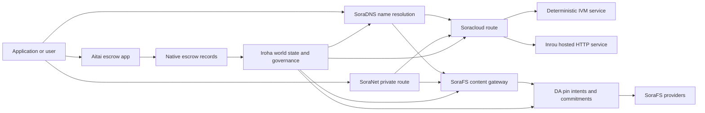

# SORA Nexus Хеҙмәттәре {#sora-nexus-services}

SORA Nexus өҫтәмә ҡушымтаға ҡараған сервис самолеттары тирәләй Iroha 3. Был хеҙмәттәр айырым бухгалтерҙар түгел, улар нигеҙләнгән Iroha донъя дәүләте, Norito манифесттар, идаралыҡ документтары һәм Torii маршрут ғаиләләре.

Ҡулланыуы узел төҙөлөшөнә һәм селтәр профиленә бәйле. маҡсатлы узелда [`/openapi`](/ba/reference/torii-endpoints.md#app-and-sora-route-families) мөмкин булған маршруттарҙың авторитетлы исемлеге итеп ҡулланығыҙ.

## Компоненттар картаһы {#component-map}

|Компонент |Роль |Төп өҫкө йөҙҙәр |
| ---------------------- | ------------------------------------------------------------------------------------------------------------------------------------------- | ---------------------------------------------------------------------------------------- |
|Soracloud |Ҡушымталарҙы урынлаштырыу, хостинг хеҙмәттәре, шәхси модель/эшләү ваҡыты торошо һәм сервис ғүмер циклын контролдә тотоу. | `/v1/soracloud/`, `/api/`, `iroha app soracloud ...`                                   |
|Иртәнге | Soracloud ҡабул ителгән HTTP хеҙмәтте яңыртыу өсөн ғәмәлдә булыу ваҡыты HTTP самолет.                                                            |Soracloud Эшләү ваҡыты конфигурацияһы, хост мөмкинлектәре рекламалары, реплика эшләү ваҡыты торошо |
|SoraNet |Конфиденциаллыҡ һәм транспорт схемалары, эстафета трафикаһы, VPN, тоташтырыу сессиялары һәм трансляция маршруттары өсөн өҫтәмә. | `/v1/connect/`, `/v1/vpn/`, SoraNet маршрут метамәғлүмәттәре                                     |
|Мәғлүмәттең булыуы (DA) |Nexus трассалары, SoraFS манифестациялары һәм иҫбатлау ағымдары менән һылтанған файҙалы йөкләмәләр өсөн ҡулланыу мөмкинлеген раҫлау, йөкләмәне үтәү һәм маҡсатҡа ярашлы ҡатлам. | `/v1/da/`, `FindDaPinIntent`, `[sumeragi.da]`                                          |
|SoraFS |Манифестар, CAR файҙалы йөкләмәләр өсөн контент адресы буйынса һаҡлау туҡымаһы, ҡуйылған контент, ҡапҡанан алыу һәм иҫбатлау мөмкинлеген ҡайтарыу ағымы. | `/v1/sorafs/`, `/sorafs/`, `FindSorafsProviderOwner`                                   |
|SoraDNS |SORA хостинг хеҙмәттәр һәм йөкмәтке өсөн детерминистик атамалау һәм хәл итеүсе-аттестация ҡатламы. |`/v1/soradns/`, `/soradns/`, хәл итеүсе каталогы ваҡиғалар |
|Атай |Ҡулланма кимәлендәге фиат һәм активтар менән иҫәп-хисап итеү коридоры, уны айырым иҫәп-хикәйәт түгел, ә урындағы депозит иҫәбе ярҙамында тәьмин итәләр. | `OpenAssetEscrow`, `FindAssetEscrow*`, `EscrowEventFilter`, Kotodama `escrow_*` биналар |



## Ғәҙәттән тыш хәл {#common-flows}

### Ҡунаҡландырылған Split ҡушымтаһы {#hosted-split-application}

Типик ҡатнаш яҫылыҡ ҡушымтаһы бөтә өлөштәрҙе бергә ҡуллана:

1. Статик фронт-энд активтары SoraFS аша йыйып ҡуйыла һәм тығыҙлана.
2. Мәҫәлән, йәмәғәт хужаһы `<app>.sora`, SoraDNS аша теркәлгән.
3. Soracloud маршруттар `/api/v1/search` йәки `/api/v1/stream` Инруға HTTP хеҙмәтләндереү.
4. Soracloud маршруттар `/api/auth` һәм `/api/v1/user` детерминистик IVM идарасылары.
5. Хосусилыҡ кәрәк булған клиенттар шул уҡ йөкмәткегә йәки API маршрутына SoraNet схемаһы аша барып етә ала.

|Юл |Яҡлау самолеты |Ни өсөн ?|
| ----------------- | --------------------- | ------------------------------------------------- |
| `/`               |SoraFS статик йөкмәткеһе |Репродукциялы йөкмәтке тамыр һәм шлюз кешинг |
|`/assets/*` |SoraFS статик йөкмәткеһе |Мәғлүмәт буйынса адресланған активтар һәм асыҡ иҫбатлау |
|`/api/auth*` |Soracloud IVM |Ҡабат уйнау хәүефһеҙ автор һәм аҡса янсығы проблемаһы |
|`/api/v1/user*` |Soracloud IVM |идара итеүгә һиҙелерлек дәүләт мутациялары |
|`/api/v1/search*` |Soracloud Инру |Тере HTTP хеҙмәт, кеш, SSE йәки коллектор дәүләт |

### Контент баҫмаһы {#content-publication}

SoraFS баҫмаһы, исем күрһәткәндән һуң, ныҡлы артефакттар сығара:

1. Яҡшы йөкләмә йәки каталог төҙөгөҙ.
2. Уны CAR архивына һәм өлөшлө планына һалып ҡуйығыҙ.
3. Пин сәйәсәте һәм идара итеү мәғлүмәттәре менән Norito манифест төҙөй.
4. Torii адресы буйынса манифест тапшырыу.
5. DA тырнағы ниәте йәки ҡулланыу мөмкинлеге буйынса йөкләмәне яҙығыҙ, әгәр маҡсатлы профиль асыҡ иҫбатлау талап итә икән.
6. Манифесты SoraDNS исеме йәки Soracloud статик фронт-энд маршруты менән бәйләргә.

### Шәхси юлдар менән йөрөү {#private-fetch-or-streaming-route}

SoraNet ҡаршыһында ултырырға мөмкин SoraFS йәки Soracloud:

1. Клиент исемде йәки манифестты хәл итә.
2. Һаҡсылар каталогы йәки маршрут манифесында инеү һәм сығыу релейы һайлана.
3. Юл хәрәкәте тултырыла һәм SoraNet схемаһы аша ебәрелә.
4. Сығыу эстафетаһы SoraFS ҡапҡаһы, Torii ағымы, йәки Soracloud Маршруты.

## Атай {#aitai}

Атай - SORA баҙар стилендәге иҫәп-хисап өсөн ҡушымта коридоры, унда һатып алыусы менән һатыусы селтәрҙән тыш түләүҙе координациялай, ә Iroha селтәрҙәге активтар һаҡлана. Яңы һанлы активтар менән һаҡланыу ағымдары өсөн ул контрактҡа ҡараған депозит иҫәбенә түгел, ә урындағы эскроу инструкцияһы ғаиләһен ҡулланырға тейеш.

Туған ышаныслы һаҡсылыҡ бухгалтерҙа һаҡлана. Һатыусы тәҡдимде асып бирә `OpenAssetEscrow`, һатып алыусы, сылбырҙан тыш түләүҙе ҡабул итә һәм билдәләй `AcceptAssetEscrow` һәм `MarkEscrowPaymentSent`, һәм һатыусы ебәрә `ReleaseAssetEscrow` Әгәр һатып алыусы менән һатыусы ризалашмаһа, ике яҡ та бәхәс асырға һәм уны хәл итергә мөмкин. `CanResolveEscrowDispute` сикләнгән сумманы бүлергә мөмкин.

Бөтөн ғүмер циклы, дөйөм активтар бикләүҙәре, аноним һаҡланыу, һорауҙар, ваҡиғалар һәм Rust миҫалдары өсөн ҡарағыҙ [Туған активтар һаҡланыу](/ba/blockchain/escrow.md) .

|Атай йөҙө |Уны  өсөн ҡулланығыҙ|
| ------------------------------------------------------------------------------------------------------------------------------------------------------------- | ----------------------------------------------------------------------------------------- |
| `OpenAssetEscrow`, `AcceptAssetEscrow`, `MarkEscrowPaymentSent`, `ReleaseAssetEscrow`, `CancelAssetEscrow`                                                    |Транспарентлы һанлы активтар тәҡдимдәре, шул иҫәптән XOR номиналында иҫәп-хисап ағымдары. |
| `OpenAnonymousAssetEscrow`, `AcceptAnonymousAssetEscrow`, `MarkAnonymousEscrowPaymentSent`, `ReleaseAnonymousAssetEscrow`, `CancelAnonymousAssetEscrow`       |Һаҡланған тәҡдимдәрҙә финанслау һәм ябыу хәрәкәттәре иҫбатламалар менән алып барыла. |
| `OpenEscrowDispute`, `ResolveEscrowDispute`, `OpenAnonymousEscrowDispute`, `ResolveAnonymousEscrowDispute`                                                    |Низағтарға инеү һәм суд стилендә ҡарар сығарыу. |
| `FindAssetEscrowById`, `FindAssetEscrowsBySeller`, `FindAssetEscrowsByBuyer`, `FindAssetEscrowsByStatus`                                                      |Ҡушымталар статусы биттәрен, яраҡлаштырыу эштәрен һәм ярҙам инструменттарын. |
|`EscrowEventFilter` |Тормош транспарентлы эскроу яҙылыуҙар эскроү ID, һатыусы, һатып алыусы, статусы йәки ваҡиға төрө буйынса. |
| Kotodama `escrow_open_offer`, `escrow_accept`, `escrow_mark_payment_sent`, `escrow_release`, `escrow_cancel`, `escrow_open_dispute`, `escrow_resolve_dispute` |Kotodama контракт саҡырыуҙары V1 депозит системаһы ярҙамында. |

Йәмәғәт өсөн Taira йәки Minamoto ҡулланыу, селтәрҙән тыш түләү рельсы һәм һәр ярҙам йәки суд эш ағымдарын ғариза сәйәсәте тип ҡабул итеү. Iroha Һаҡлыҡ торошон, ғүмер циклы ваҡиғаларын, иҫбатлау хассистарын һәм активтарҙың һуңғы хәрәкәтен теркәп бара; ул фиат иҫәп-хисапты үҙенән-үҙе раҫламай.

## Маҡсатлы узелды тикшереү {#check-a-target-node}

Был биттән миҫалдар ҡулланыр алдынан, маршрут ғаиләһе һеҙ маҡсатҡа ҡуйған узелда булыуын раҫлағыҙ:

```bash
export TORII_URL=https://taira.sora.org

curl -fsS "$TORII_URL/openapi.json" \
  | jq '.paths | keys[] | select(test("^/v1/(soracloud|sorafs|soradns|connect|vpn|da)/"))'

curl -fsS "$TORII_URL/status" | jq .
```

Әгәр `/openapi.json` профиль тарафынан асыҡланмаһа, `/openapi` һынап ҡарағыҙ. Тура маршрут булыу төҙөлөш үҙенсәлектәре һәм селтәр конфигурацияһы менән бәйле.

### Taira Уҡыу өсөн генә тәмәке тикшереүҙәре {#taira-read-only-smoke-checks}

Йәмәғәт Taira һуңғы нөктәһе уҡыу яғында тикшереү өсөн файҙалы, әммә әгәр һеҙ авторитетлы иҫәп-хисап менән идара итә һәм тере торошон үҙгәртергә ниәтләйһегеҙ икән, уны мутация миҫалдары өсөн ҡулланырға ярамай.

```bash
export TORII_URL=https://taira.sora.org

curl -fsS "$TORII_URL/status" \
  | jq '{version: .build.version, peers, blocks, lanes: (.teu_lane_commit | length)}'

curl -fsS "$TORII_URL/v1/connect/status" | jq '{enabled, sessions_active}'

curl -fsS "$TORII_URL/v1/vpn/profile" \
  | jq '{available, relay_endpoint, supported_exit_classes}'

curl -fsS "$TORII_URL/v1/sorafs/storage/state" \
  | jq '{bytes_capacity, bytes_used, pin_queue_depth, por_inflight}'

curl -fsS -H 'Accept: application/json' "$TORII_URL/v1/soracloud/status" \
  | jq '.control_plane | {service_count, services: [.services[] | {service_name, current_version}]}'
```

Taira Ҡатнашыу өсөн тәғәйенләнгән идара итеү самолеты маршруттарын асырға мөмкин OpenAPI Юл картаһы. `/openapi` башлыса барлыҡҡа килгән API контракт, һуңынан яҙҙырыу өсөн махсус маршрут раҫларға туранан-тура уны тере документтар.

## Soracloud {#soracloud}

Soracloud - SORA ҡушымталар контроле планы. Ул урынлаштырыу пакеттарын, хеҙмәтте үҙгәртеүҙәрҙе, маршрутлауҙы, файҙаланыу торошон, авторитетлы конфигурация яҙмаларын, шифрланған сервис серҙәрен, модель реестры яҙмалары, шәхси һығымта яһау сессияларын һәм ғәмәлгә ашырыу ваҡыты квитанцияларын күҙәтә.

Soracloud ике үтәү самолетын ҡуллана:

|Үлем самолеты |Эш ваҡыты |Уны  өсөн ҡулланығыҙ|
| ---------------------- | ------- | -------------------------------------------------------------------------------------------- |
|`DeterministicService` |`Ivm` |Автор, көмбәҙ һаҡлағысы торошо, сертификатлы уҡыуҙар, почта йәшниктәрен тәртипкә килтереүселәр, идара итеүгә йоғонтоһо булған мутациялар |
|`HttpService` |`Inrou` | Йәшәү HTTP APIs, коллекторҙар менән ауыр эш, кеш ярҙамында хеҙмәтләндереүҙәр, SSE, браузерҙар ярҙамында ағымдар     |

Контроль планы авторитетлы. урынлаштырыу, яңыртыу, кире ҡайтарыу, конфигурация, йәшерен, модель һәм статус командалары аша ебәрергә Torii һәм донъя дәүләте тураһында уҡыған; улар айырым бер CLI Йәмәғәт маршруты иң оҙон префиксҡа нигеҙләнгән, шуға күрә бер теркәлгән хост трафикты хужалар араһында бүлеү мөмкин. HTTP маршруттар һәм детерминистик API маршруттар.

### Бәхетле ҡушымтаны баҫтырығыҙ {#scaffold-a-split-app}

Бөлөк ҡушымталар шаблоны статик фронт-энд өҫтәп бер хостинг тере API һәм бер детерминистик совхоз/API хеҙмәте булдыра:

```bash
iroha app soracloud app init \
  --template split-app \
  --app-name solswap_indexer \
  --app-version 0.1.0 \
  --public-host solswap-indexer.sora \
  --output-dir ./apps/solswap-indexer

iroha app soracloud app local-plan \
  --manifest ./apps/solswap-indexer/app_manifest.json

iroha app soracloud app doctor \
  --manifest ./apps/solswap-indexer/app_manifest.json
```

`local-plan` маршрут бүленеше, балалар хеҙмәте манифесттары, эш урыны скрипты юлдары һәм көтөлгән фронт-энд баҫма режимын баҫтыра. `doctor` һеҙ ҡушылғанға тиклем урындағы азат итеү килешеүен раҫлай Torii.

### Ҡушымтаны урынлаштырыу һәм тикшереү {#deploy-and-inspect-app-state}

```bash
export SORACLOUD_TORII_URL=https://<soracloud-enabled-torii>

iroha app soracloud app deploy \
  --manifest ./apps/solswap-indexer/app_manifest.json \
  --torii-url "$SORACLOUD_TORII_URL"

iroha app soracloud app status \
  --manifest ./apps/solswap-indexer/app_manifest.json \
  --torii-url "$SORACLOUD_TORII_URL"
```

Инде урынлаштырылған хеҙмәт өсөн, сервис масштабы буйынса командалар ҡулланығыҙ:

```bash
iroha app soracloud status \
  --service-name solswap_indexer_live \
  --torii-url "$SORACLOUD_TORII_URL"

iroha app soracloud rollback \
  --service-name solswap_indexer_live \
  --target-version 0.1.0 \
  --torii-url "$SORACLOUD_TORII_URL"
```

### Серле һәм йәшерен материал {#config-and-secret-material}

Soracloud конфигурация һәм йәшерен яҙмалар авторитетлы урынлаштырыу торошоның бер өлөшө булып тора. Кәрәкле конфигурациялар йәки йәшерен бәйләнештәр булмағанда йәки актив манифестар менән тап килмәһә, ҡулланыу, яңыртыу һәм кире ҡайтарыу ябыла алмай.

```bash
iroha app soracloud config-set \
  --service-name solswap_indexer_live \
  --config-name indexer/public_config \
  --value-file ./config/public-config.json \
  --torii-url "$SORACLOUD_TORII_URL"

iroha app soracloud secret-set \
  --service-name solswap_indexer_live \
  --secret-name indexer/api_key \
  --secret-file ./secrets/api-key.envelope.json \
  --torii-url "$SORACLOUD_TORII_URL"
```

CLI ярҙамсыһын ҡулланып, профилегеҙ өсөн кәрәкле таныҡлыҡ билдәләрен табығыҙ:

```bash
iroha app soracloud config-set --help
iroha app soracloud secret-set --help
```

## Интроу {#inrou}

Инру - ҡунаҡхана. HTTP файҙаланылған ваҡыт Soracloud. Һөҙөмтәлә Iroha һеңдерелгән узел Soracloud йүгереү ваҡыты буйынса проекттар ҡабул ителә Soracloud локаль материализация планына индереү, тәғәйенләнгән хостинг-хеҙмәт репликаларын вертикаль хеҙмәттәр итеп башлау һәм репликалы ваҡыттағы режимды кире авторитетлы модельгә тапшырыу.

Тормош режимы кәрәк булған йөкләмәләр өсөн Inrou ҡулланығыҙ HTTP өҫкө йөҙө, мәҫәлән, коллектор ауырлығы APIs, SSE ағымдар, ҡаш менән тәьмин ителгән ҡулланмалар йәки браузер ярҙамында хеҙмәтләндереү.

### Эш ваҡыты талаптары {#runtime-requirements}

- Контейнер Manifesto Runtime `Inrou` булырға тейеш.
- Хеҙмәт манифесты үтәү планы `HttpService` булырға тейеш.
- `HttpService + Inrou` туранан-тура бер кәрәк `PersistentRootLeaseVolume` ҡуйылған `/`.
- Inrou-ның ҡабатланған хеҙмәттәренә шулай уҡ уртаҡ хеҙмәт йәки серле лизинг һаҡлау кәрәк, әгәр улар үҙгәреүсән уртаҡ дәүләт һаҡлай.
- Продукция хостинг узелдар тик прокси сифатында ғына эшләмәйенсә, реаль Inrou ҡеүәтен иғлан итергә тейеш.

### Билдәле өҙөк {#manifest-fragment}

Артабанғы миҫал ике манифесттың формаһын күрһәтә.

```jsonc
// container_manifest.json
{
  "schema_version": 1,
  "runtime": { "runtime": "Inrou", "value": null },
  "bundle_path": "/bundles/solswap-indexer.inrou",
  "entrypoint": "/app/bin/launch-indexer.sh",
  "args": [],
  "env": {
    "RUST_LOG": "info",
  },
  "inrou": {
    "schema_version": 1,
    "guest_os": { "guest_os": "DebianSlim", "value": null },
    "guest_images": {
      "x86_64": {
        "kernel_image_path": "/inrou/x86_64/vmlinux",
        "rootfs_image_path": "/inrou/x86_64/rootfs.ext4",
        "initrd_image_path": null,
      },
      "aarch64": {
        "kernel_image_path": "/inrou/aarch64/vmlinux",
        "rootfs_image_path": "/inrou/aarch64/rootfs.ext4",
        "initrd_image_path": null,
      },
    },
  },
  "lifecycle": {
    "start_grace_secs": 60,
    "stop_grace_secs": 30,
    "healthcheck_path": "/api/indexer/v1/health",
  },
}
```

```jsonc
// service_manifest.json
{
  "schema_version": 1,
  "service_name": "solswap_indexer_live",
  "service_version": "0.1.0",
  "execution_plane": { "execution_plane": "HttpService", "value": null },
  "replicas": 2,
  "route": {
    "host": "solswap-indexer.sora",
    "path_prefix": "/api/v1/search",
    "service_port": 8080,
    "visibility": { "visibility": "Public", "value": null },
    "tls_mode": { "tls": "Required", "value": null },
  },
  "lease_volumes": [
    {
      "volume_name": "root_disk",
      "kind": {
        "lease_volume": "PersistentRootLeaseVolume",
        "value": null,
      },
      "storage_class": { "storage_class": "Warm", "value": null },
      "mount_path": "/",
      "max_total_bytes": 8589934592,
    },
    {
      "volume_name": "index_state",
      "kind": { "lease_volume": "ServiceLeaseVolume", "value": null },
      "storage_class": { "storage_class": "Warm", "value": null },
      "mount_path": "/var/lib/solswap-indexer",
      "max_total_bytes": 1073741824,
    },
  ],
}
```

Йүгереү ваҡытында, һәр урынлаштырылған ҡуртым күләме күләменән алынған тирә-яҡ мөхит үҙгәреүсәндәре аша асыҡлана:

```text
SORACLOUD_LEASE_VOLUME_ROOT_DISK_DIR
SORACLOUD_LEASE_VOLUME_ROOT_DISK_MOUNT_PATH
SORACLOUD_LEASE_VOLUME_INDEX_STATE_DIR
SORACLOUD_LEASE_VOLUME_INDEX_STATE_MOUNT_PATH
```

## SoraNet {#soranet}

SoraNet - был конфиденциал һәм транспорт ҡатламы. Ул трафик өсөн эстафетаға нигеҙләнгән маршруттарҙы тәьмин итә, улар туранан-тура маҡсатлы ҡапҡа йәки хеҙмәт менән тоташырға тейеш түгел. Транспорт конструкцияһы инеү, урта һәм сығыу эстафетаһы ролдәрен, QUIC транспортты, тауыш нигеҙендә гибрид ҡул ҡыҫырыҡлауҙы, мөмкинлектәр менән һөйләшеүҙәрҙе, эстафеталағы каталог метамәғлүмәттәрҙе һәм ҡуйы ҙурлыҡтағы ҡаплаған күҙәнәктәрҙе ҡуллана.

Эсендәге Nexus развертывания, SoraNet контент йыйыу, шлюз трафигы алып бара ала, VPN йәки "Контакт" сессиялары, һәм Norito трансляция маршруттары. каталог яҙмалары ярҙам итеүсе релеларҙы билдәләй ала `norito-stream`, был клиенттар өсөн уңайлы маршруттар өҫтөнлөк бирә Torii RPC йәки трафик ағымы.

### Стриминг конфигурацияһы {#streaming-configuration}

Nexus профиле SoraNet өсөн трансляция маршруттарын тәьмин итеү мөмкинлеген бирә:

```toml
[streaming]
feature_bits = 0b11

[streaming.soranet]
enabled = true
exit_multiaddr = "/dns/torii/udp/9443/quic"
padding_budget_ms = 25
access_kind = "authenticated"
provision_spool_dir = "./storage/streaming/soranet_routes"
provision_spool_max_bytes = 0
provision_window_segments = 4
provision_queue_capacity = 256
```

Ҡулланыу `access_kind = "read-only"` Күреүсе аутентификацияһын талап итмәгән йөкмәтке юлдары өсөн. `authenticated` сығыу эстафетаһы билеттар йәки тамашасы идентификацияһын тәьмин итергә тейеш булған саҡта Torii йәки хостинг хеҙмәте.

### SoraNet- Билдәле. SoraFS Уны алып кил. {#soranet-aware-sorafs-fetch}

Ҡоролтай SoraFS йыйыу CLI урындағы прокси манифест һәм spool сығара ала SoraNet браузер өҫтәмәләре өсөн маршрут метамәғлүмәттәре йәки SDK адаптерҙар:

```bash
sorafs_cli fetch \
  --plan artifacts/payload_plan.json \
  --manifest-id 7bb2...9d31 \
  --provider name=alpha,provider-id=9f5c...73aa,base-url=https://gw-alpha.example.org/,stream-token="$(cat alpha.token)" \
  --output artifacts/payload.bin \
  --json-out artifacts/fetch_summary.json \
  --local-proxy-manifest-out artifacts/proxy_manifest.json \
  --local-proxy-mode bridge \
  --local-proxy-norito-spool storage/streaming/soranet_routes \
  --local-proxy-kaigi-spool storage/streaming/soranet_routes \
  --local-proxy-kaigi-policy authenticated \
  --max-peers=2 \
  --retry-budget=4
```

Йәмғеһе мәғлүмәт биреүсе отчеттар, күләмле квитанциялар, урындағы прокси метамәғлүмәттәре һәм алып барыу өсөн ҡулланылған маршруттың һөҙөмтәле көйләүҙәре.

## Мәғлүмәттәрҙең булыуы (DA) {#data-availability-da}

DA - был бик ҙур файҙалы йөкләмәләр өсөн ҡулланыу мөмкинлеген иҫбатлау ҡатламы, артыҡ шәхси йә хеҙмәтләндереүгә бәйле тип иҫәпләнә һәм улар туранан-тура донъя торошонда урынлаштырыла. Унда детерминистик йөкләмәләр һәм алыу бурыстары теркәлә, шуға күрә раҫлаусылар, шлюздар һәм клиенттар ниндәй байттар вәғәҙә ителгән, ниндәй сәйәсәт ҡулланылған һәм ниндәй иҫбатлауҙар күҙәтелгән икәнлеге тураһында килешеү төҙөй алалар.

DA алмаштырмай Kura йәки SoraFS:

- Kura тамамланған блок ағымы һәм консенсус тергеҙеү мәғлүмәттәрен һаҡлай.
- SoraFS контент адресы менән байттарҙы, CAR файҙалы йөкләмәләрҙе һәм манифестарҙы һаҡлай һәм хеҙмәтләндерә.
- DA йөкләмәләр, иҫбатлау сәйәсәттәре, иҫбатлама асыуҙар һәм был байттарҙы планлаштырыу, аудит итеү һәм иҫәп-хисап яҙмаһы торошо менән бәйләнешкә индереү өсөн PIN ниәттәрен теркәтә.

Ҡулланыу DA заявка йәки Nexus трассаға иҫәп-хисапҡа күҙаллана торған вәғәҙә кәрәк, ул селтәрҙән тыш мәғлүмәттәрҙе алыу мөмкин буласаҡ. SoraFS баҫылған йөкмәтке өсөн пин-интенттар, һуңыраҡ тикшереү өсөн һаҡланырға тейешле иҫбатлау пакеттары һәм дөйөм хәле тулы файҙалы йөкләмә түгел, ә эшкәртеү булырға тейеш булған ҡулланыу артефакттары.

### Ғүмер циклы {#lifecycle}

|Этап |Нимә яҙылды ?|
| ---------- | ----------------------------------------------------------------------------------------------------------------------------------------------------- |
|Ниәт |Билет, яңғыраған һылтанма, псевдоним, юл/эпоха/секвенция һылтанмаһы, һаҡланыу сәйәсәте йәки репликация маҡсаты. |
|Вазифалар |Манифест, юл йөкләмәһе, иҫбатлау тупланмаһы йәки контент тамырын иҫәп-хисап китабы менән бәйләгән материалды эшкәртеү. |
|Дәлилдәр |Доступлылыҡ тауыштары, иҫбатлау асыҡлыҡтары, провайдерҙар аттестацияһы йәки маҡсатлы селтәр тарафынан ҡабул ителгән башҡа профилле мәғлүмәттәр. |
|Һорау | Күҙгә-күҙ ҡарауҙар `FindDaPinIntentByTicket`, `FindDaPinIntentByManifest`, `FindDaPinIntentByAlias`, йәки `FindDaPinIntentByLaneEpochSequence`. |

DA менән тәьмин ителгән баҫма ағымы тип түбәндәгеләр һанала:

1. Төҙөү йәки файҙалы йөк алыу тыштан WSV, мәҫәлән, SoraFS CAR файл йәки Nexus Юл хәрәкәтенең файҙалы йөкләмәһе.
2. Norito манифеста йәки маршрутҡа ярашлы йөкләмә тураһында яҙыу һәм йөкләмәне һүрәтләү.
3. `/v1/da/*` аша манифест, пин ниәте йәки йөкләмәне тапшырыу, әгәр был маршрут ғаиләһе булдырылған булһа, йәки селтәрҙең ҡул ҡуйылған транзакция юлы аша.
4. Валидаторҙар йәки доступность менән тәьмин итеүселәр актив иҫбатлау сәйәсәте буйынса талап ителгән мәғлүмәттәрҙе йыйырға тейеш.
5. Аҡса йөкләнешенә бәйле исем-шәриф, иҫәпләү иҫбатламаһы йәки шлюз маршруты менән таныштырылыр алдынан был билдәнең ниәте һәм йөкләмәһе тураһында һорағыҙ.

### Алгоритм моделе {#algorithmic-model}

DA файҙалы йөкләмәгә ҡул ҡуйылған, ҡабаттан уйнатыуҙан һаҡланған, блок-индекстерылған йөкләмәгә әйләндерә.

1. Ҡабул ителгән файҙалы йөкләмәне кананизациялау. Torii `(lane_id, epoch, sequence)`, файҙалы йөкләнеш байттары, ҡыҫырыҡлау метамәғлүмәттәре, киҫәк күләме, һүндереү профиле, һаҡланыу сәйәсәте һәм ебәреүсенең ҡултамғаһы менән ҡабул итә. Нод талап ителгән ваҡытта gzip, deflate йәки Zstandard файҙалы йөкләмәләрен декомпрессияға индерә, һуңынан кананик байт оҙонлоғо `total_size` менән тиң булыуын тикшерә.
2. Яҡшы юл һәм өлөш параметрҙарын раҫлау. Nexus юлдар каталогы. `chunk_size` нуль булмаған күләмле булырға тейеш, ике, кәм тигәндә ике байт һәм конфигурацияланған максимумдан ҙурыраҡ булмаҫҡа тейеш. һүндереү профилендә мәғлүмәттәр киҫәктәре һәм кәм тигәндән ике парность киҫәклеге булырға тейеш. `merkle_sha256` йәки `kzg_bls12_381`.
3. Сеть сәйәсәтен ҡулланыу. Блоб класы өсөн конфигурацияланған репликация һәм һаҡланыу базаһын узел үтәй. Йәмәғәт метамәғлүмәттәре ябай текст булып ҡалырға тейеш; идара итеүсе генә метамәғлимәттәр манифестҡа яҙылыуҙан алда узелдың конфигурациялы идара итеүсе метамәғлүмдәр асҡысы менән шифрлана.
4. Каноник файҙалы йөклөктө фиксирланған ҙурлыҡтағы профиль менән ҡыҫып алалар. `chunk_size`. Torii файҙалы йөк эшкәртеүҙе иҫәпләй, иҫбатлау-иңләүсәнлек ағасы тамыры һәм бер өлөшкә бурыстар. Мәғлүмәт кисәктәре алып BLAKE3 уларҙың байттарҙағы йөкләмәләре.
5. Өҫтәмә һүндереү йөкләмәләр. `data_shards`. Һуңғы һыҙыҡтағы юғалған күҙәнәктәр парность иҫәпләү өсөн нуль менән тулыландырылған. RS(16) парлыҡ рәт / глобаль парлыҡ киҫәктәре булдыра; факультатив. `row_parity_stripes` матрица буйлап бағана стилендәге һыҙыҡтарҙың параллельлеген өҫтәгеҙ. BLAKE3 Бәләкәй индейҙарҙың аш һеңдереүе `u16` символдар.
6. Манифест төҙөй. `DaManifestV1` трассаны, эпохаһын, блоб класын, кодекты, файҙалы йөкләмәне эшкәртеүҙе, киҫәк тамырҙы, киҫектең ҙурлығын, һүндереү профилен, һаҡлап ҡалыу сәйәсәтен, ҡуртымға түләүҙе, киҫәктәргә йөкләмәләрҙе, факультатив IPA йөкләмәләрен, метамәғлүмәттәрҙе һәм сығарыу ваҡытын теркәп тора. Һаҡлау билеты детерминистик: узел тәүҙә буш билет менән манифест өлгөһөн хэшлай, һуңынан был бармаҡ эҙен һуңғы `storage_ticket` итеп яҙа.
7. Ҡабатлау конфликттарын кире ҡаҡ. Ҡабатлау төймәһе `(lane_id, epoch, sequence, manifest_fingerprint)`. Бер үк бармаҡ эҙенә эйә булған дубликат көсһөҙ. Иҫкергән тәртип йәки башҡа бармаҡ эҙҙәре менән бер үк тәртип кире ҡағыла.
8. Ҡул ҡуйылған артефакттарҙы сығарығыҙ. Torii а иҫәпләй PDP йөкләмә, ҡултамғалар а `DaIngestReceipt`, төҙөгән `DaCommitmentRecord`, Яҡшы китаптар яҙып, уларҙы асыҡ итеп яҙа. PDP йөкләмә, йөкләмә рекорды, йөкләмә графигы, PIN ниәте, квитанция файлы һәм квитанцияһы журналы. `(lane_id, epoch)`.

Блоктарҙа йөкләмәләр тураһында яҙмалар бар.

- юл, эпоха һәм эҙемтә
- ID һәм каноник манифест хэшиғы
- юл һыҙығы иҫбатлау схемаһы
- киҫәк тамыр
- KZG полосалары өсөн факультатив йөкләмә KZG
- PDP / иҫбатлау һеңдереү
- һаҡланыу класы һәм һаҡлау билеты
- Torii DA раҫлау имзаһы

Блокҡа DA яҙмаларын индерер алдынан, блок йыйылмаһы юлы бәйләнеште раҫлай:

- `(lane_id, epoch, sequence)` берҙән-бер булырға тейеш.
- Манифест-хашс һандары нуль булмаған һәм тупланма эсендә үҙенсәлекле булырға тейеш.
- Ҡатнашыуҙы иҫбатлау схемаһы конфигурацияланған полоса сәйәсәтенә тап килергә тейеш.
- Меркл юлдар кире ҡағыла KZG йөкләмәләр; KZG йүгереүҙәр өсөн нуль булмаған KZG йөкмәткеһе.
- Пин ниәттәре каноникализациялана, сортировкалана һәм юлды, манифест хэшигы, һаҡлау билеты, хужа иҫәбенә һәм ҡушамат менән бәрелеш ҡағиҙәләре буйынса фильтрациялана.

Блок заголовкаһы хәшесен һаҡлай DA ағзалыҡ иҫбатлауҙары өсөн, йөкләмә бәйләме шулай уҡ Merkle тамыр асыҡлай, уның япраҡтары - каноник hash Norito- кодланған `DaCommitmentRecord` Ата-әсә узелдары һул һәм уң балаларҙың конкаценацияһын тарҡата; бер нисә япраҡ үҙгәрешһеҙ киләһе ҡатламға күсерелә.

### Дәлилдәрҙе тикшереү {#proof-verification}

`/v1/da/commitments/prove` блокта бер йөкләмә өсөн иҫбатлау сығара ала. иҫбатлауҙа йөкләмә, блок бейеклеге, бандла индекс, бандл хэш, бандль оҙонлоғо, Меркл тамыры һәм һеңле юлы бар.

1. Дәлилдәр бандел хеш блок башлыҡтың DA йөкләмәһе хэш менән тап килә.
2. Дәлилдәр блогы бейеклеге һылтанған блок башлыҡ менән тап килә.
3. Индекс сикләүҙәрҙә һәм йөкләмә шул индекстың тупланма иҫәбенә тигеҙ.
4. Юл хәрәкәтенә ҡаршы сәйәсәт йөкләмәне ҡабул итә.
5. Ойоштороу япрағынан туғандаш юлды бүлеү тәьмин ителгән тамырҙы реконструкциялай.
6. Реконструкцияланған тамыр бандлы тамырға тигеҙ.

Был, билдәле бер блок йөкләмәһе менән бәйле, билдәле бер тәьмин итеү йөкләмәһенең индерелеүен иҫбатлай; был һәр репликаның әлеге ваҡытта онлайн булыуы тураһында иҫбат итмәй. Йәшәү мөмкинлеген SoraFS провайдерҙарҙан алыныу, PDP/PoTR тикшереүҙәр йәки профилгә ярашлы доступность иҫбатлауҙары ярҙамында айырым тикшерелә.

### Консенсуслы үҙ-ара эш итеү {#consensus-interaction}

DA менән тоташтырыла Sumeragi ышаныслы тапшырыу аша (RBC), әммә был икенсе законлылыҡ протоколы түгел. RBC тәҡдимдәрҙең файҙалы йөкләмәләрен таратыу һәм ҡайтарыу: тәҡдим итеүсе сессия иғлан итә `(height, view, payload_hash)`, тиҫтерҙәре менән алмашыу киҫәктәрен һәм `READY`/`DELIVER` сигналдар бер үк файҙалы йөклөктө күҙәткәнме, юҡмы икәнен күҙәтә.

Iroha 3 тиҫкәре төркөмдөң йөкләмәһе:

- урындағы күреү блогы ожидаемого полезного загрузки хэшига байтлы хэш, йәки
- RBC блок хэшигы, бейеклеге, күренеше һәм файҙалы йөкләмәһе менән тап килгән файҙалы йөкмәткене ҡайтарылды.

Әгәр ике шарттың береһе лә үтәлмәй икән, тиҫтерҙәрҙең яҙмалары `missing_local_data`, аша файҙалы йөкте ҡайтарырға тырыша RBC йәки сикләү синхронлаштырыу, һәм хәбәр итә DA статусы һәм телеметрия. хәҙерге тормошҡа ашырыуҙа был DA сигналдар һуңғыһы өсөн консультатив булып тора: блогы әлегә тамамлана commit сертификаты плюс тейешле урындағы файҙалы йөкләмә, айырым түгел DA Кворум сертификаты.

DA ваҡытлыса тергеҙеү тәрәзәләрен киңәйтә. DA quorum timeout конфигурацияланған блоктан алына һәм commit timings, һуңынан ҡабатлана `sumeragi.advanced.da.quorum_timeout_multiplier`. Ҡулланыуға ваҡыты: `max(quorum_timeout, availability_timeout_floor_ms) * availability_timeout_multiplier`. Был ҡулланыу ваҡыты тамамланғанға тиклем, узел файҙалы йөкләмәләрҙе тергеҙеүгә өҫтөнлөк бирә һәм ваҡытынан алда күсереүҙән ҡаса; ул тамамланғас, нормаль тергеҙеү һәм күренеште үҙгәртеү юлдары дауам итә ала.

### Оператор билдәләре {#operator-notes}

Iroha 3 консенсус профилдәренә инә RBC- ярҙамында файҙалы йөк ташыу, һаҡсылар, DA бандл раҫлау һәм тергеҙеү телеметрияһы. тиңдәш өлгө `[sumeragi.da]` Блокҡа йөкләмәләр һәм иҫбатлау асыҡлыҡтары өсөн сикләүҙәр, өҫтәүенә `[sumeragi.advanced.da]` Кворум һәм доступность тәртибе өсөн ваҡыт үтеү ҡабатлаусылары. был көйләүҙәрҙе бер селтәр профилендә валидаторҙар араһында эҙмә-эҙлекле тотоғоҙ.

Маршрут асыу өсөн, узелдың OpenAPI документы менән башларға:

```bash
curl -fsS "$TORII_URL/openapi.json" \
  | jq '.paths | keys[] | select(startswith("/v1/da/"))'
```

Ҡулланығыҙ [Һорау һылтанмаһы](/ba/reference/queries.md#nexus-data-availability-and-packages) ағым өсөн DA һорау исемдәре, һәм [тиҫтерҙәр конфигурацияһы өлгөһө](/ba/reference/peer-config/) урындағы өсөн `[sumeragi.da]` Төҙөлөшөңдең йоғонтоһонда туҡымалар барлыҡҡа килә.

## SoraFS {#sorafs}

SoraFS үҙәкләштерелгән контент адресы менән һаҡланған туҡыма. Ул байттарҙы детерминистик киҫәкләргә бүлеп, CAR архивтар һәм Norito контент тамырҙарын, киҫәкләү профилдәрен, пин сәйәсәттәрен һәм идара итеү аттестацияларын бәйләгән манифестар. Һаҡлау тәьминәтселәре йөкмәтке ҡеүәтен һәм ҡулланыу мөмкинлеген иғлан итә, ә шлюздар контентты хеҙмәтләндерер алдынан манифестарҙы һәм киҫәкләтелгән йөкләмәләрҙе тикшерәләр.

Типик SoraFS ҡулланыу статик ҡушымта активтары, документация төҙөү, зона тупланмалары, модель йәки артефакт һылтанмалар һәм идара итеү иҫбатлау тупланмаһы инә. Iroha Мәғлүмәт моделе асыҡлана SoraFS инеү саралары һәм [`FindSorafsProviderOwner`](/ba/reference/queries.md#nexus-data-availability-and-packages) провайдер хужалығын хәл итеү буйынса һорау.

### Баҫмағыҙҙы йыйып ҡуйығыҙ, уны яҙығыҙ, ҡултамғалағыҙ һәм тапшырығыҙ {#pack-manifest-sign-and-submit}

```bash
cargo run -p sorafs_car --features cli --bin sorafs_cli -- \
  car pack \
  --input ./dist \
  --car-out artifacts/site.car \
  --plan-out artifacts/site.chunk-plan.json \
  --summary-out artifacts/site.car-summary.json

cargo run -p sorafs_car --features cli --bin sorafs_cli -- \
  manifest build \
  --summary artifacts/site.car-summary.json \
  --manifest-out artifacts/site.manifest.to \
  --manifest-json-out artifacts/site.manifest.json \
  --pin-min-replicas=3 \
  --pin-storage-class=warm \
  --pin-retention-epoch=42

SIGSTORE_ID_TOKEN=$(oidc-client fetch-token) \
cargo run -p sorafs_car --features cli --bin sorafs_cli -- \
  manifest sign \
  --manifest artifacts/site.manifest.to \
  --bundle-out artifacts/site.manifest.bundle.json \
  --signature-out artifacts/site.manifest.sig

cargo run -p sorafs_car --features cli --bin sorafs_cli -- \
  manifest submit \
  --manifest artifacts/site.manifest.to \
  --chunk-plan artifacts/site.chunk-plan.json \
  --torii-url "$TORII_URL" \
  --resolve-submitted-epoch=true \
  --authority=<i105-account-id> \
  --private-key-file ./secrets/authority.ed25519 \
  --summary-out artifacts/site.manifest.submit.json \
  --response-out artifacts/site.manifest.submit.body
```

Әгәр `/v1/sorafs/pin/register` маҡсатлы узел буйынса маршрутланмаған, CLI ҡул ҡуйылғанға кире төшә ала `/transaction` тапшырыу һәм терминал торбаһы статусын көтөп.

### Тикшерегеҙ һәм килтерегеҙ {#verify-and-fetch}

```bash
cargo run -p sorafs_car --features cli --bin sorafs_cli -- \
  proof verify \
  --manifest artifacts/site.manifest.to \
  --car artifacts/site.car \
  --chunk-plan artifacts/site.chunk-plan.json \
  --summary-out artifacts/site.verify.json

sorafs_cli fetch \
  --plan artifacts/site.chunk-plan.json \
  --manifest-id <manifest-digest-hex> \
  --provider name=primary,provider-id=<provider-id-hex>,base-url=https://gateway.example.org/,stream-token="$(cat provider.token)" \
  --output artifacts/site.fetch.tar \
  --json-out artifacts/site.fetch.json
```

### Иҫәп алыу мөмкинлеген иҫбатлау өсөн тикшереүҙәр {#proof-of-retrievability-checks}

Операторҙар һаҡланыу тәьминәтселәре өсөн тикшереүҙәр үткәрергә һәм уларҙы ҡуҙғатырға мөмкин:

```bash
sorafs_cli por status \
  --torii-url "$TORII_URL" \
  --manifest <manifest-digest-hex> \
  --status=failed \
  --limit=20

sorafs_cli por trigger \
  --torii-url "$TORII_URL" \
  --manifest <manifest-digest-hex> \
  --provider <provider-id-hex> \
  --reason=latency_probe \
  --samples=48 \
  --auth-token artifacts/challenge_token.to
```

## SoraDNS {#soradns}

SoraDNS - өсөн детерминистик исемләү ҡатламы SORA хеҙмәттәре һәм йөкмәткеһе. ул исемдәрҙе нормализациялай, результор каталогы яңыртыуҙар Iroha, һәм ҡул ҡуйылған зона йәки резульвер тупланмалары аша таратыла SoraFS. Резолюторҙар һәм шлюздар табыу метамәғлүмәтенә ышаныр алдынан резолютор раҫлау документтарын тикшерә.

Браузерға инеү өсөн, SoraDNS портал хужаларын теркәлгән FQDN. теркәлгән бушлыҡ хостинг каноник ҡулланыу сығанағы булып ҡала, шул уҡ ваҡытта урынлаштырылған шлюз профилдәрендә браузер һәм Torii Был сығанаҡ өсөн кире ҡайтыу маршруттары.

### Ҡунаҡлаусы формалары {#host-forms}

|Форма |Миҫал |Маҡсат |
| --- | --- | --- |
|Бәхетһеҙлек килеп сығышы |`https://<fqdn>/<path>` |Манифестарҙа һәм сығарыу белешмәләрендә теркәлгән URL Canonical app |
|Taira браузер Gateway |`https://<fqdn>.mon.taira.sora.net/<path>` |Актив ҡушамат өсөн асыҡ браузер ҡапҡаһы |
|Torii кире ҡайтыу юлы |`https://taira.sora.org/soradns/<fqdn>/<path>` |Torii Дебаг һәм кире ҡайтыу маршруты өсөн әүҙем ҡушамат |
|Canonical hash gateway |`<base32(blake3(name))>.gw.sora.id` |Детерминистик инеү юлы идентификацияһы һәм GAR тикшереү |

Ҡоролтай `/soradns/<alias>/...` Яуызлыҡ - йәмәғәтселек өсөн иң яҡшы күренеш түгел. URL. Инструменттар, ҡушымта манифесттары һәм фронт-энд конфигурацияһы үҙендә бушлыҡ хостинг өҫтөнлөк бирергә тейеш. әгәр алфавиты әүҙем түгел Taira, браузер ҡапҡаһы йәки кире ҡайтыу юлы кире ҡайта ала `404` йәки уңышһыҙлыҡ TLS Ҡулланыусыларҙы маршрутлаштырыу башланыр алдынан.

### Деривный шлюз хостингтары {#derive-gateway-hosts}

```ts
import {
  deriveSoradnsGatewayHosts,
  hostPatternsCoverDerivedHosts,
} from '@iroha/iroha-js'

const derived = deriveSoradnsGatewayHosts('docs.sora')
console.log(derived.canonicalHost)
console.log(derived.prettyHost)

const taira = deriveSoradnsGatewayHosts('solswap-indexer.sora', {
  prettySuffix: 'mon.taira.sora.net',
})
console.log(taira.prettyHost)

const patterns = [
  derived.canonicalHost,
  derived.canonicalWildcard,
  derived.prettyHost,
]
console.log(hostPatternsCoverDerivedHosts(patterns, derived))
```

GAR файҙалы йөкләмәләр каноник хэш хост, каноник wildcard, һәм һайлап алынған матур хост ҡапларға тейеш.

### Резольвер каталогы фотоһүрәттәрен килтерегеҙ {#fetch-a-resolver-directory-snapshot}

```bash
curl -i "$TORII_URL/v1/soradns/directory/latest"

soradns_resolver directory fetch \
  --record-url "$TORII_URL/v1/soradns/directory/latest" \
  --directory-url https://gateway.example.org/soradns/directory/latest.car \
  --output ./state/soradns-directory

soradns_resolver rad verify \
  --rad ./state/soradns-directory/rad/resolver-a.norito
```

Gateways-тар резюсер раҫлау документын юғалтҡан, ваҡыты бөткән, ҡултамғаланмаған йәки Merkle тамыры тип аталған һуңғы каталогта нығытылмаған резюзерҙарҙы кире ҡағырға тейеш. Резюсер каталогы әлегә баҫылған булмаған селтәрҙә маршрут эшләһә лә `/v1/soradns/directory/latest` `404` версияһын бирә ала.

### Халыҡ-ара DNS Делегация {#public-dns-delegation}

SoraDNS хост сығарыу ғәҙәти интернет алмаштырмай DNS делегация. әгәр йәмәғәтселек DNS исем а күрһәтергә тейеш SoraDNS ҡапҡа:

- субдомендар өсөн, һайлап алынған матур хостҡа CNAME баҫтырырға
- Апекс исемдәре өсөн ALIAS/ANAME йәки A/AAAA яҙмаларын IPs ниндәй ҙә булһа катталған ҡапҡаға ҡулланығыҙ.
- GAR тикшереүҙәр өсөн SoraDNS шлюз домены аҫтында каноник хэш хостинг һаҡлай

## FHE һәм UAID {#fhe-and-uaid}

FHE менән бәйле өҫкө йөҙҙәр Nexus хеҙмәттәрендә ҡулланылған:

- `iroha_crypto::fhe_bfv` детерминистик ғәмәлгә ашыра BFV скаляр шифрлау тексын баһалау өсөн ярҙам. идентификатор резолюцияһы ҡулланыла `BfvIdentifierPublicParameters` һәм `BfvIdentifierCiphertext`, унда 0 слот инеү байты оҙонлоғон һаҡлай, ә һуңыраҡ слот һәр береһенә бер шифрланған байт һаҡлай.
- Soracloud дәүләт һәм эш схемалары моделе FHE шифрлы текст эш йөкләмәләре менән идаралыҡ-идара параметрҙар йыйылмаһы, үтәү сәйәсәттәре, шифрлы текстың йөкләмәләре, һорау конверттары һәм асыу өсөн ғариза.

Ҡоролтай BFV идентификатор юлы шәхси хоҡуҡтарын һаҡлау өсөн ҡулланыла. клиенттар шифрланған идентификатор тапшыра ала Torii хәл итеүсе уны актив идентификатор сәйәсәте буйынса баһалай, а килтерә `OpaqueAccountId`, һәм квитанция ебәрә. `ClaimIdentifier` һуңғараҡ был квитанцияны UAID маҡсатлы иҫәпкә ҡушылған.

Ҡоролтай UAID - был ағым тирәһендәге шәхес һәм һәләт якорь. Мәғлүмәт моделендә `UniversalAccountId` һеш менән тәьмин ителгән һәм шулай итеп күрһәтелә `uaid:<hash>`. Парассерҙар быны ла ҡабул итә . `uaid:<hash>` йәки 64-хекслы матдәләр эшкәртеү. `Account` һәм `NewAccount` факультатив `uaid` һәм `opaque_ids` Ярыш ваҡытында теркәлеү бер-бергә UAID- иҫәп-хисап индексы, икеләтә йәки бәрелешһеҙ үтә күренмәгән идентификаторҙарҙы кире ҡаға һәм үтә күренмәле идентификаторҙарҙы UAID. Һәр саҡ UAID иҫәбенә бәйләнеү үҙгәрештәр, йүгереү ваҡыты үҙгәртә Space Directory dataspace бәйләнештәре өсөн шул UAID.

Space Directory manifests ҡушымтаға ҡушыу мөмкинлектәрен UAID. Һөҙөмтәлә `AssetPermissionManifest` исемдәре UAID, мәғлүмәт киңлеге, активация һәм факультатив тамамланыу ваҡыты, шулай уҡ рөхсәт/ҡурҡҡан мәғлүмәттәр киңлектәре, программаһы, ысулы, активтар һәм AMX роль. баһалау - кире ҡаҡҡан еңеүҙәр: беренсе тапҡырға яуап биреү кире ҡағыу үтенесен кире ҡаға, башҡаса һуңғы тапҡырға рөхсәт итеүсе кандидат ниндәй ҙә булһа сумма сикләүенә ҡаршы тикшерелә. `CanPublishSpaceDirectoryManifest`.

Soracloud FHE дәүләте өсөн ғәмәлгә ашырылған схемалар:

|Схема |Ул нимә менән идара итә ?|
| ----------------------------------------- | --------------------------------------------------------------------------------------------------------------------------- |
|`SoraStateBindingV1` менән `FheCiphertext` |Дәүләт клавишаһы префиксы аҫтындағы ҡиммәттәр FHE шифрлы текстар тип белдерә. |
|`FheParamSetV1` |Схеманың исемдәре, артҡы яғы, модуль сылбыры, полиномия дәрәжәһе, слот һаны, хәүефһеҙлек маҡсаты, йәшәү циклы һәм параметрҙар һеңдереү. |
|`FheExecutionPolicyV1` |Шифрлы текст күләмен, ябай текстың ҙурлығын, инеү/һатыу һанын, ҡабатлау тәрәнлеген, әйләнештәрҙе, старт-страптарҙы һәм түңәрәкләү режимын сикләй. |
|`FheGovernanceBundleV1` |Бер параметрҙы бер үтәү сәйәсәте менән ҡуйып, ҡабул итеүҙе раҫлау өсөн. |
|`FheJobSpecV1` | Детерминистик һүрәтләй `Add`, `Multiply`, `RotateLeft`, йәки `Bootstrap` шифрлы текст дәүләт асҡыстары һәм йөкләмәләр өҫтөндә эш.    |
|`CiphertextQuerySpecV1` |Һорауҙар шифрлы тексты ғына хеҙмәт, бәйләү, клавиша префиксы, һөҙөмтә сиктәре, метамәғлүмәт кимәле һәм факультатив индереү иҫбатламаһы буйынса билдәләнә. |
|`DecryptionRequestV1` |Шифрлау-авторитет сәйәсәте буйынса бер шифрлы текст йөкләмәһе тураһында асыуҙы һорай. |

`FheJobSpecV1::validate_for_execution` эшкә инеү алдынан эш, башҡарыу сәйәсәте һәм параметр йыйылмаһының килешеүен тикшерә. Ул шулай уҡ операцияға ҡағылышлы ҡағиҙәләрҙе бойомға ашыра: өҫтәү һәм ҡабатлау өсөн кәм тигәндә ике инеш кәрәк, әйләнеү һәм стартлау өсөн тап бер инеш кәрәк һәм һоралған тәрәнлек, ротация һанын, стартлау һанын, кертеү һанын, файҙалы йөкләнеш байттар, һәм детерминистик сығарыу күләме сәйәсәт сиктәре эсендә ҡалырға тейеш. шифр тексты һорауҙары һөҙөмтәләре ябай текст һыҙыҡтар кире ҡайтарырға тейеш түгел.

UAID шифрлы текст түгел һәм FHE сәйәсәте үҙе лә түгел. Ул хисапты, үтә күренмәле идентификатор талаптарын һәм сервис йәки мәғлүмәттәр арауығы ағымын раҫлаған Space Directory бәйләнештәрен табыу өсөн ҡулланылған тотороҡло аккаунт мөмкинлектәре якоряһы. FHE схемалары параметрҙар йыйылмаһы, үтәү сәйәсәте, шифрлы текст йөкләмәләре һәм шифрлау хоҡуғы сәйәсәттәре аша шифрланған файҙалы йөк тапшырыуҙы ҡабул итеүҙе һәм башҡарыуҙы айырым көйләй.

Torii өҫкө йөҙҙәренә түбәндәгеләр инә:

- `/v1/identifier-policies`
- `/v1/identifiers/resolve`
- `/v1/accounts/{account_id}/identifiers/claim-receipt`
- `/v1/identifiers/receipts/{receipt_hash}`
- `/v1/accounts/{uaid}/portfolio`
- `/v1/space-directory/uaids/{uaid}`
- `/v1/space-directory/uaids/{uaid}/manifests`
- `/v1/soracloud/model/run-private`
- `/v1/soracloud/model/run-private/finalize`
- `/v1/soracloud/model/decrypt-output`

Йәмәғәт метамәғлүмәттәре сиктәре схемаларҙа асыҡтан-асыҡ: UAID бәйләнештәр, үтә күренмәгән идентификатор яҙмалары, манифест ғүмер циклы, дәүләт асҡысы дигесты, шифр тексты күләме, шифр текст йөкләмәләре, сәйәсәт исемдәре, параметрҙар ҡуйылған версиялар, эш операциялары, сығарыу дәүләт асҡыстары, һәм асыҡлау үтенесе метамәғлүмәттәре күренеп тора ала. Идентификатор ябай текстар, шифрланған дәүләт, модель инеүҙәр һәм сығыуҙар, һәм FHE серле асҡыстары был асыҡ һорау яҙмаларынан ситтә урынлашҡан.

## Операция контроле исемлеге {#operational-checklist}

- Тейешле Torii узелында `/openapi` менән тәьмин ителгән хеҙмәт ғаиләләрен раҫлау.
- Ауырыу Soracloud күсереү манифестаһы, SoraFS манифесттар, SoraDNS resolver каталогы яҙмалары, SoraNet эстафеталар исемлеге яҙмалары, һәм DA идара итеүгә һиҙгер артефакттар булараҡ маҡсат йәки йөкмәткелелек йөкләмәләре.
- Шул уҡ SORA Nexus профилен бер селтәрҙәге валидаторҙар араһында эҙмә-эҙлекле ҡулланығыҙ.
- Inrou тамыр һәм уртаҡ лизинг күләмен манифестаттарҙа һаҡларға, ә махсус узел-локаль юлдары нигеҙендә түгел.
- SoraFS иҫбатлау тикшереүе ҡулланыу йөкмәтке ҡушаматтар менән таныштырыу алдынан.
- Мониторинг SoraNet ҡул ҡысҡырыуҙа уңышһыҙлыҡтар, DA Кворум йәки доступность ваҡыты, SoraFS ҡапҡанан кире ҡағыуҙар, SoraDNS RAD яңылыҡ, һәм Soracloud һаулыҡ һаҡлау.
- Йәмәғәт өсөн Taira йәки Minamoto ҡулланыу, башта [Ҡатнашыу SORA Nexus мәғлүмәттәр киңлектәре](/ba/get-started/sora-nexus-dataspaces.md).

Шулай уҡ ҡарағыҙ:

- [Torii сикләү пункттары](/ba/reference/torii-endpoints.md)
- [Мәғлүмәт ваҡиғалары фильтрҙары](/ba/blockchain/filters.md#data-event-filters)
- [Һорау буйынса һылтанма](/ba/reference/queries.md#nexus-data-availability-and-packages)
