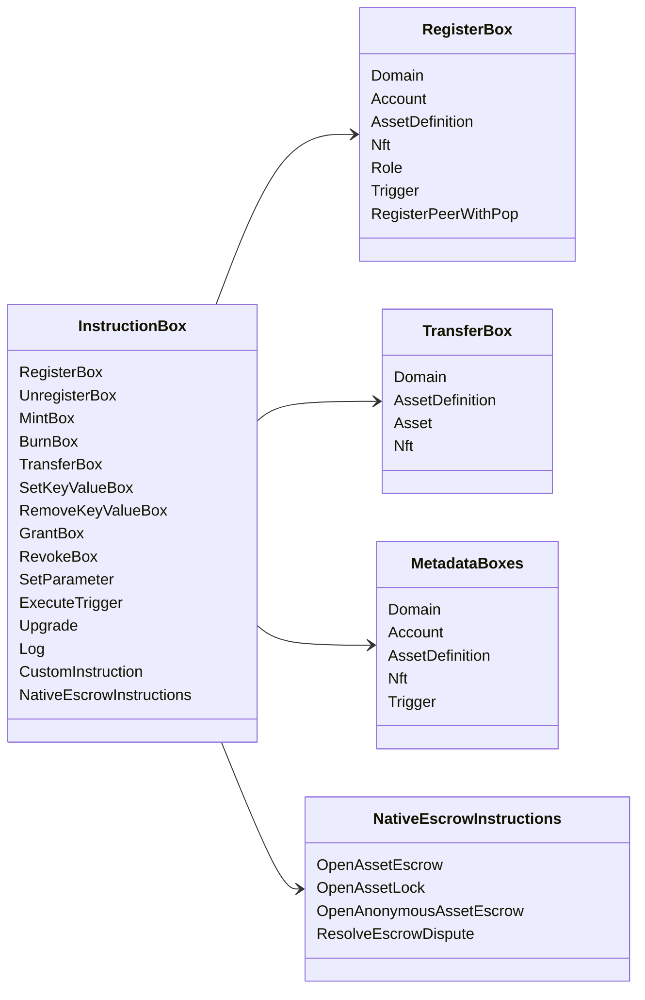

# Iroha Махсус күрһәтмәләр {#iroha-special-instructions}

Хәҙерге мәғлүмәттәр моделе был өйрәтеү ғаиләләрен асыҡлай:

|Уҡытыу |Варианттары |
| --- | --- |
| [`RegisterBox`](/ba/blockchain/instructions.md#un-register) | `Domain`, `Account`, `AssetDefinition`, `Nft`, `Role`, `Trigger`, `RegisterPeerWithPop` |
| [`UnregisterBox`](/ba/blockchain/instructions.md#un-register) | `Peer`, `Domain`, `Account`, `AssetDefinition`, `Nft`, `Role`, `Trigger` |
| [`MintBox`](/ba/blockchain/instructions.md#mint-burn) |цифрлы `Asset`, ҡабатлауҙар ҡуҙғатыу |
| [`BurnBox`](/ba/blockchain/instructions.md#mint-burn) |цифрлы `Asset`, ҡабатлауҙар ҡуҙғатыу |
| [`TransferBox`](/ba/blockchain/instructions.md#transfer) |`Domain`, `AssetDefinition`, һанлы `Asset`, `Nft` |
| [`SetKeyValueBox`](/ba/blockchain/instructions.md#setkeyvalue-removekeyvalue) | `Domain`, `Account`, `AssetDefinition`, `Nft`, `Trigger` метаданные |
| [`RemoveKeyValueBox`](/ba/blockchain/instructions.md#setkeyvalue-removekeyvalue) | `Domain`, `Account`, `AssetDefinition`, `Nft`, `Trigger` метаданные |
| [`GrantBox`](/ba/blockchain/instructions.md#grant-revoke) |`Permission` (`Grant<Permission, Account>`), `Role` (`Grant<RoleId, Account>`), `RolePermission` (`Grant<Permission, Role>`) |
| [`RevokeBox`](/ba/blockchain/instructions.md#grant-revoke) |`Permission` (`Revoke<Permission, Account>`), `Role` (`Revoke<RoleId, Account>`), `RolePermission` (`Revoke<Permission, Role>`) |
| [`SetParameter`](/ba/blockchain/instructions.md#setparameter) |сылбыр параметрҙарын яңыртыу |
| [`ExecuteTrigger`](/ba/blockchain/instructions.md#executetrigger) |башҡармаһын ҡуҙғатыу |
| [`Upgrade`](/ba/blockchain/instructions.md#other-instructions) |башҡарыусыны яңыртыу |
| [`Log`](/ba/blockchain/instructions.md#other-instructions) |башҡарыусы журналына инеү |
| [`CustomInstruction`](/ba/blockchain/instructions.md#other-instructions) |JSON башҡарыусыға ҡарата файҙалы йөкләмә |
| [Тыуған милке менән һаҡланған активтар](/ba/blockchain/escrow.md) | `OpenAssetEscrow`, `AcceptAssetEscrow`, `MarkEscrowPaymentSent`, `ReleaseAssetEscrow`, `CancelAssetEscrow`, `OpenEscrowDispute`, `ResolveEscrowDispute` |
| [Ғәҙәттәгесә, активты ябыу](/ba/blockchain/escrow.md#generic-asset-locks) |`OpenAssetLock`, `DrawdownAssetLock`, `CancelAssetLock`, `ExpireAssetLock` |
| [Аноним активтар иҫәбенә депозит](/ba/blockchain/escrow.md#anonymous-escrow) | `OpenAnonymousAssetEscrow`, `AcceptAnonymousAssetEscrow`, `MarkAnonymousEscrowPaymentSent`, `ReleaseAnonymousAssetEscrow`, `CancelAnonymousAssetEscrow`, `OpenAnonymousEscrowDispute`, `ResolveAnonymousEscrowDispute` |

Өҫтәмә Iroha 3 модулдәре инструкция реестры аша доменға ярашлы инструкциялар типтарын теркәй ала. Хәҙерге сығанаҡ ағастан барлыҡҡа килгән схема кимәле исемлеге өсөн ҡарағыҙ [Дан моделе схемаһы](./data-model-schema.md).

::: details Диаграмма: Ғаиләләргә төп белем биреү

:::
