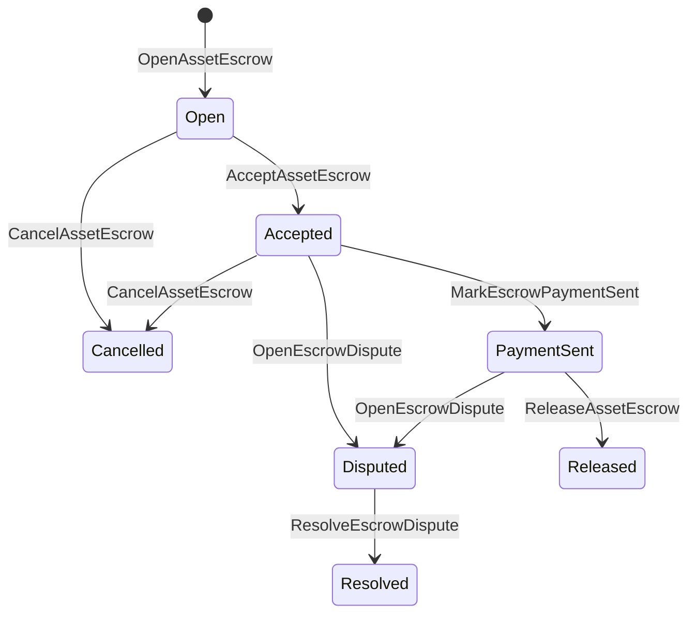

# Native Asset Escrow

Native escrow is a ledger-managed custody mechanism for numeric assets.
Instead of sending assets to an application-owned account and relying on
application code to protect that account, escrow ISIs move value into a
deterministic protocol custody account and record the escrow lifecycle in
world state.

Use native escrow for marketplace settlement, Aitai-style off-chain payment
coordination, milestone locks, and shielded escrow workflows that need
ledger-visible lifecycle state.

## Concepts

| Concept | Description |
| --- | --- |
| `EscrowId` | Caller-selected identifier wrapping a hash. It must be unique across transparent and anonymous escrows. |
| `AssetEscrowRecord` | Transparent numeric asset escrow or lock record. |
| `AnonymousAssetEscrowRecord` | Shielded escrow record backed by nullifiers, commitments, and proof attachments. |
| Custody account | Deterministic protocol account derived from chain ID, escrow ID, and asset definition. |
| Evidence hashes | Evidence hashes can identify invoices, judgments, messages, storage manifests, or other off-chain evidence. The evidence payload itself is not stored in the escrow record. |

Transparent records carry the seller, optional buyer, asset definition,
total amount, custody account, lifecycle status, behavior kind, remaining
amount, optional release authority, optional expiry timestamp, evidence
hashes, timestamps, and optional resolution details.

Escrow amounts must be positive numeric asset quantities and must match the
asset definition's numeric specification. While an escrow or lock is active,
generic asset transfers cannot drain the custody account; the custody exit
paths are the escrow ISIs described below.

## Marketplace Escrow

Marketplace escrow coordinates an on-chain asset release with an off-chain
payment or delivery workflow.



| ISI | Who submits it | Effect |
| --- | --- | --- |
| `OpenAssetEscrow` | Seller | Locks the seller's numeric asset in protocol custody and creates an `Open` marketplace record. |
| `AcceptAssetEscrow` | Buyer | Records the buyer and moves `Open` to `Accepted`. The seller cannot accept their own escrow. |
| `MarkEscrowPaymentSent` | Accepted buyer | Moves `Accepted` to `PaymentSent` after the buyer sends the off-chain payment. |
| `ReleaseAssetEscrow` | Seller | Moves `PaymentSent` to `Released` and transfers the full escrowed amount to the buyer. |
| `CancelAssetEscrow` | Seller | Moves `Open` or `Accepted` to `Cancelled` and refunds the seller before payment is marked. |
| `OpenEscrowDispute` | Seller or accepted buyer | Moves `Accepted` or `PaymentSent` to `Disputed` and appends evidence hashes. |
| `ResolveEscrowDispute` | Account with `CanResolveEscrowDispute` | Moves `Disputed` to `Resolved` and splits the amount between buyer and seller. |

Dispute resolution amounts must be non-negative, and
`buyer_amount + seller_amount` must equal the escrow amount. Zero-valued
legs are allowed, but the whole split must account for the locked balance.

### Rust Example

This example assumes the seller and buyer accounts already exist, the asset
definition is registered as numeric, and the seller has enough balance.

```rust
use iroha::{
    client::Client,
    data_model::{
        isi::escrow::{
            AcceptAssetEscrow, MarkEscrowPaymentSent, OpenAssetEscrow,
            ReleaseAssetEscrow,
        },
        prelude::*,
    },
};
use iroha_crypto::Hash;

fn release_marketplace_escrow(
    seller_client: &Client,
    buyer_client: &Client,
    asset_definition_id: AssetDefinitionId,
) -> eyre::Result<()> {
    let escrow_id = EscrowId::new(Hash::new("docs-marketplace-escrow-001"));

    seller_client.submit_blocking(OpenAssetEscrow::with_evidence_hashes(
        escrow_id,
        asset_definition_id,
        Numeric::from(40_u64),
        vec![Hash::new("invoice:2026-001")],
    ))?;

    buyer_client.submit_blocking(AcceptAssetEscrow::new(escrow_id))?;
    buyer_client.submit_blocking(MarkEscrowPaymentSent::new(escrow_id))?;
    seller_client.submit_blocking(ReleaseAssetEscrow::new(escrow_id))?;

    let record = seller_client.query_single(FindAssetEscrowById::new(escrow_id))?;
    assert_eq!(record.status, AssetEscrowStatus::Released);
    assert_eq!(record.remaining_amount, Numeric::zero());

    Ok(())
}
```

## Generic Asset Locks

Asset locks use the same custody record type, but they are not buyer-seller
offers. They lock funds for a destination account and optionally require a
separate release authority to draw funds down.

| ISI | Who submits it | Effect |
| --- | --- | --- |
| `OpenAssetLock` | Source account | Locks a positive amount, records the destination as the record buyer, and sets status to `Locked`. |
| `DrawdownAssetLock` | Release authority, or destination when no release authority is set | Transfers part or all of the remaining custody to the destination. |
| `CancelAssetLock` | Lock opener | Cancels an active lock and refunds the remaining amount to the opener. |
| `ExpireAssetLock` | Any transaction authority after the deadline | Expires a lock with `expires_at_ms` in the past and refunds the remaining amount to the opener. |

`DrawdownAssetLock` keeps the record in `Locked` while some amount remains.
When the remaining amount reaches zero, the status becomes `DrawnDown` and
the record is closed.

```rust
use iroha::{
    client::Client,
    data_model::{
        isi::escrow::{CancelAssetLock, DrawdownAssetLock, ExpireAssetLock, OpenAssetLock},
        prelude::*,
    },
};
use iroha_crypto::Hash;

fn drawdown_and_close_asset_locks(
    opener_client: &Client,
    destination_client: &Client,
    release_authority_client: &Client,
    asset_definition_id: AssetDefinitionId,
    destination: AccountId,
    release_authority: AccountId,
) -> eyre::Result<()> {
    let trusted_lock_id = EscrowId::new(Hash::new("docs-asset-lock-trusted"));

    opener_client.submit_blocking(OpenAssetLock::with_options(
        trusted_lock_id,
        asset_definition_id.clone(),
        destination.clone(),
        Numeric::from(40_u64),
        Some(release_authority),
        None,
        vec![Hash::new("milestone-plan-v1")],
    ))?;

    release_authority_client.submit_blocking(DrawdownAssetLock::new(
        trusted_lock_id,
        Numeric::from(15_u64),
    ))?;

    let partially_drawn =
        opener_client.query_single(FindAssetEscrowById::new(trusted_lock_id))?;
    assert_eq!(partially_drawn.status, AssetEscrowStatus::Locked);
    assert_eq!(partially_drawn.remaining_amount, Numeric::from(25_u64));

    opener_client.submit_blocking(CancelAssetLock::new(trusted_lock_id))?;
    let cancelled = opener_client.query_single(FindAssetEscrowById::new(trusted_lock_id))?;
    assert_eq!(cancelled.status, AssetEscrowStatus::Cancelled);

    let expiring_lock_id = EscrowId::new(Hash::new("docs-asset-lock-expiring"));
    opener_client.submit_blocking(OpenAssetLock::with_options(
        expiring_lock_id,
        asset_definition_id,
        destination,
        Numeric::from(10_u64),
        None,
        Some(0),
        Vec::new(),
    ))?;

    destination_client.submit_blocking(ExpireAssetLock::new(expiring_lock_id))?;
    let expired = opener_client.query_single(FindAssetEscrowById::new(expiring_lock_id))?;
    assert_eq!(expired.status, AssetEscrowStatus::Expired);

    Ok(())
}
```

Python currently exposes high-level helpers for generic locks:
`open_asset_lock`, `drawdown_asset_lock`, `cancel_asset_lock`, and
`expire_asset_lock`. For marketplace and anonymous escrow from Python, use
canonical `InstructionBox` JSON through the SDK's JSON escape hatch, or submit
through an SDK that exposes first-class escrow builders.

## Disputes

A marketplace escrow can enter dispute from `Accepted` or `PaymentSent`.
Only the recorded seller or buyer can open the dispute. Resolution requires
`CanResolveEscrowDispute`, either granted directly to the resolver account
or inherited through a role.

```rust
use iroha::{
    client::Client,
    data_model::{
        isi::escrow::{OpenEscrowDispute, ResolveEscrowDispute},
        prelude::*,
    },
};
use iroha_crypto::Hash;
use iroha_executor_data_model::permission::escrow::CanResolveEscrowDispute;

fn resolve_disputed_escrow(
    admin_client: &Client,
    buyer_client: &Client,
    court_client: &Client,
    court: AccountId,
    escrow_id: EscrowId,
) -> eyre::Result<()> {
    admin_client.submit_blocking(Grant::account_permission(
        Permission::from(CanResolveEscrowDispute),
        court,
    ))?;

    buyer_client.submit_blocking(OpenEscrowDispute::with_evidence_hashes(
        escrow_id,
        vec![Hash::new("buyer-payment-receipt")],
    ))?;

    court_client.submit_blocking(ResolveEscrowDispute::with_evidence_hashes(
        escrow_id,
        Numeric::from(30_u64),
        Numeric::from(10_u64),
        vec![Hash::new("court-judgement-001")],
    ))?;

    let record = admin_client.query_single(FindAssetEscrowById::new(escrow_id))?;
    assert_eq!(record.status, AssetEscrowStatus::Resolved);
    assert_eq!(
        record.resolution.as_ref().map(|resolution| resolution.buyer_amount.clone()),
        Some(Numeric::from(30_u64)),
    );

    Ok(())
}
```

## Anonymous Escrow

Anonymous escrow uses the same marketplace lifecycle, but the funding and
closing asset movement are shielded. The public record still stores seller,
buyer, status, evidence hashes, timestamps, and proof-linked movement
records. Amounts and recipients inside shielded notes are represented by
commitments, nullifiers, and proof attachments.

| Transparent ISI | Anonymous ISI |
| --- | --- |
| `OpenAssetEscrow` | `OpenAnonymousAssetEscrow` |
| `AcceptAssetEscrow` | `AcceptAnonymousAssetEscrow` |
| `MarkEscrowPaymentSent` | `MarkAnonymousEscrowPaymentSent` |
| `ReleaseAssetEscrow` | `ReleaseAnonymousAssetEscrow` |
| `CancelAssetEscrow` | `CancelAnonymousAssetEscrow` |
| `OpenEscrowDispute` | `OpenAnonymousEscrowDispute` |
| `ResolveEscrowDispute` | `ResolveAnonymousEscrowDispute` |

Wallet or prover tooling must build the proof attachment and public inputs.
Opening creates one escrow commitment. Release, cancellation, and anonymous
dispute resolution must spend exactly one escrow commitment and create the
buyer, seller, or split output commitments required by the action.

```rust
use iroha::{
    client::Client,
    data_model::{
        isi::escrow::{
            AcceptAnonymousAssetEscrow, MarkAnonymousEscrowPaymentSent,
            OpenAnonymousAssetEscrow,
        },
        prelude::*,
        proof::ProofAttachment,
    },
};
use iroha_crypto::Hash;

fn open_anonymous_escrow(
    seller_client: &Client,
    buyer_client: &Client,
    escrow_id: EscrowId,
    asset_definition_id: AssetDefinitionId,
    funding_nullifiers: Vec<[u8; 32]>,
    escrow_commitment: [u8; 32],
    proof: ProofAttachment,
    root_hint: Option<[u8; 32]>,
) -> eyre::Result<()> {
    seller_client.submit_blocking(OpenAnonymousAssetEscrow::with_evidence_hashes(
        escrow_id,
        asset_definition_id,
        funding_nullifiers,
        escrow_commitment,
        proof,
        root_hint,
        vec![Hash::new("shielded-invoice")],
    ))?;

    buyer_client.submit_blocking(AcceptAnonymousAssetEscrow::new(escrow_id))?;
    buyer_client.submit_blocking(MarkAnonymousEscrowPaymentSent::new(escrow_id))?;

    Ok(())
}
```

For the underlying shielded transaction model, see
[Anonymous Transactions](/blockchain/anonymous-transactions.md).

## SDK Usage

Escrow support is exposed differently across the SDKs. Rust has the canonical
typed data model. Python currently exposes generic asset-lock helpers.
JavaScript and TypeScript use Kotodama escrow host calls. Kotlin/JVM and Swift
provide typed payload builders for marketplace and anonymous escrow.

| SDK | Use this surface | Scope |
| --- | --- | --- |
| [Rust](#rust-sdk) | `iroha::data_model::isi::escrow` | Marketplace escrow, generic locks, anonymous escrow, queries, and events. |
| [Python](#python-asset-locks) | `Instruction.open_asset_lock`, `TransactionDraft.open_asset_lock`, and client `*_and_wait` helpers | Generic asset locks. Marketplace and anonymous escrow helpers are not first-class Python methods yet. |
| [JavaScript / TypeScript](#javascript-and-typescript-kotodama) | `compileKotodamaProgram` from `@iroha/iroha-js/kotodama-compiler` | Escrow host calls inside Kotodama contracts. |
| [Kotlin / JVM](#kotlin-and-jvm) | `InstructionTemplate` classes in `org.hyperledger.iroha.sdk.core.model.instructions` | Marketplace and anonymous escrow custom instruction templates. |
| [Swift / iOS](#swift-and-ios) | `NativeEscrowInstructionBuilders` and `IrohaSDK.build*Escrow*` helpers | Marketplace and anonymous escrow Norito JSON instruction payloads. |

The examples below focus on instruction construction. Account funding,
signature management, and transaction submission follow the normal flow for
each SDK.

### Rust SDK

Use the Rust SDK when you need full native coverage or query/event support.
The examples above show marketplace release, generic lock drawdown, dispute
resolution, and anonymous escrow construction with
`iroha::data_model::isi::escrow`.

```rust
use iroha::{
    client::Client,
    data_model::{isi::escrow::OpenAssetEscrow, prelude::*},
};
use iroha_crypto::Hash;

fn open_and_read(
    client: &Client,
    asset_definition_id: AssetDefinitionId,
) -> eyre::Result<AssetEscrowRecord> {
    let escrow_id = EscrowId::new(Hash::new("docs-rust-sdk-escrow"));

    client.submit_blocking(OpenAssetEscrow::new(
        escrow_id,
        asset_definition_id,
        Numeric::from(10_u64),
    ))?;

    client.query_single(FindAssetEscrowById::new(escrow_id))
}
```

### Python Asset Locks

The Python SDK exposes first-class helpers for generic asset locks. Use them
for milestone payments, drawdowns by a release authority, cancellation by the
opener, and expiry refunds.

```python
client.open_asset_lock_and_wait(
    chain_id="dev-chain",
    authority="<source-account-id>",
    private_key_hex="<source-private-key-hex>",
    escrow_id="merchant-lock-001",
    asset_definition_id="<asset-definition-base58>",
    destination="<destination-account-id>",
    amount="2500",
    release_authority="<trusted-release-account-id>",
    expires_at_ms=1_704_000_000_000,
)

client.drawdown_asset_lock_and_wait(
    chain_id="dev-chain",
    authority="<trusted-release-account-id>",
    private_key_hex="<trusted-release-private-key-hex>",
    escrow_id="merchant-lock-001",
    amount="1000",
)

client.expire_asset_lock_and_wait(
    chain_id="dev-chain",
    authority="<any-account-id>",
    private_key_hex="<any-private-key-hex>",
    escrow_id="merchant-lock-001",
)
```

For a two-party lock, omit `release_authority`; the destination account can
then submit `drawdown_asset_lock`.

### JavaScript and TypeScript Kotodama

The JavaScript SDK does not currently expose direct native escrow transaction
builders. For JavaScript or TypeScript applications that deploy Kotodama
contracts, compile escrow host calls with the Kotodama compiler.

Native escrow host calls require explicit access hints because the compiler
cannot derive narrower access sets for opaque escrow ISIs. Use wildcard hints on
exported entrypoints that call `escrow_*` builtins.

```js
import { compileKotodamaProgram } from "@iroha/iroha-js/kotodama-compiler";

const source = `
seiyaku MarketplaceEscrow {
  meta { abi_version: 1; }

  #[access(read="*", write="*")]
  kotoage fn run() permission(Admin) {
    let asset = asset_definition("62Fk4FPcMuLvW5QjDGNF2a4jAmjM");
    let offer = name("aitai_offer");
    let evidence = norito_bytes("00");

    call escrow_open_offer(offer, asset, 10, evidence);
    call escrow_accept(offer);
    call escrow_mark_payment_sent(offer);
    call escrow_release(offer);
  }
}
`;

const compiled = compileKotodamaProgram(source, {
  sourceName: "escrow.ko",
});

if (compiled.diagnostics.length > 0) {
  throw new Error(compiled.diagnostics.map((item) => item.message).join("\n"));
}
```

For disputes, use `escrow_open_dispute(offer, evidence)` and
`escrow_resolve_dispute(offer, buyer_amount, seller_amount, evidence)`.
Anonymous escrow host calls accept Norito request payload bytes, for example
`anonymous_escrow_open_offer(request)`.

### Kotlin and JVM

The Kotlin/JVM SDK models native escrow as custom instruction templates. Each
template validates required fields and exposes the canonical argument map used
by the transaction builder.

```kotlin
import org.hyperledger.iroha.sdk.core.model.escrow.NativeEscrowPermissions
import org.hyperledger.iroha.sdk.core.model.instructions.AcceptAssetEscrowInstruction
import org.hyperledger.iroha.sdk.core.model.instructions.MarkEscrowPaymentSentInstruction
import org.hyperledger.iroha.sdk.core.model.instructions.OpenAssetEscrowInstruction
import org.hyperledger.iroha.sdk.core.model.instructions.ReleaseAssetEscrowInstruction
import org.hyperledger.iroha.sdk.core.model.instructions.ResolveEscrowDisputeInstruction

val open = OpenAssetEscrowInstruction(
    escrowId = "escrow-hash",
    assetDefinition = "xor#wonderland",
    amount = "42.5",
    evidenceHashes = listOf("invoice-hash"),
)
val accept = AcceptAssetEscrowInstruction("escrow-hash")
val paid = MarkEscrowPaymentSentInstruction("escrow-hash")
val release = ReleaseAssetEscrowInstruction("escrow-hash")
val resolve = ResolveEscrowDisputeInstruction(
    escrowId = "escrow-hash",
    buyerAmount = "30",
    sellerAmount = "12.5",
    evidenceHashes = listOf("judgement-hash"),
)

println(open.arguments)
println(NativeEscrowPermissions.CAN_RESOLVE_ESCROW_DISPUTE)
```

Anonymous templates are available as
`OpenAnonymousAssetEscrowInstruction`, `AcceptAnonymousAssetEscrowInstruction`,
`MarkAnonymousEscrowPaymentSentInstruction`,
`ReleaseAnonymousAssetEscrowInstruction`,
`CancelAnonymousAssetEscrowInstruction`,
`OpenAnonymousEscrowDisputeInstruction`, and
`ResolveAnonymousEscrowDisputeInstruction`. Android Java callers can use the
matching `NativeEscrowInstructions.*` builders from the Android artifact.

### Swift and iOS

The Swift SDK builds escrow instructions as Norito JSON payloads. Use
`NativeEscrowInstructionBuilders` directly, or call the equivalent
`IrohaSDK.build*Escrow*` helper when your app already holds an `IrohaSDK`
instance.

```swift
import IrohaSwift

let open = try NativeEscrowInstructionBuilders.openAssetEscrow(
    escrowId: "escrow-hash",
    assetDefinition: "xor#wonderland",
    amount: "42.5",
    evidenceHashes: ["invoice-hash"]
)
let accept = try NativeEscrowInstructionBuilders.acceptAssetEscrow(
    escrowId: "escrow-hash"
)
let paid = try NativeEscrowInstructionBuilders.markEscrowPaymentSent(
    escrowId: "escrow-hash"
)
let release = try NativeEscrowInstructionBuilders.releaseAssetEscrow(
    escrowId: "escrow-hash"
)
let resolve = try NativeEscrowInstructionBuilders.resolveEscrowDispute(
    escrowId: "escrow-hash",
    buyerAmount: "30",
    sellerAmount: "12.5",
    evidenceHashes: ["judgement-hash"]
)
```

Anonymous Swift builders take nullifier lists, output commitment lists, a proof
dictionary, and optional `rootHint` values. The dispute resolver permission
token is available as `NativeEscrowPermissions.canResolveEscrowDispute`.

## Queries and Events

Use escrow queries for status pages, reconciliation jobs, and support tools:

| Query | Purpose |
| --- | --- |
| `FindAssetEscrowById` | Read one transparent escrow or lock by `EscrowId`. |
| `FindAssetEscrows` | List transparent escrow and lock records. |
| `FindAssetEscrowsBySeller` | List records opened by a seller or lock opener. |
| `FindAssetEscrowsByBuyer` | List marketplace escrows accepted by a buyer or locks targeting a destination. |
| `FindAssetEscrowsByStatus` | List records by `AssetEscrowStatus`. |
| `FindAnonymousAssetEscrowById` | Read one anonymous escrow by `EscrowId`. |
| `FindAnonymousAssetEscrows*` | List anonymous escrows by all records, seller, buyer, or status. |

`EscrowEventFilter` can subscribe to transparent native escrow and lock
events by escrow ID, seller, buyer, status, and event-set mask. The event
family includes `Opened`, `Accepted`, `PaymentSent`, `Released`,
`Cancelled`, `Expired`, `Disputed`, and `Resolved`. Anonymous escrow
records are inspected through the anonymous escrow queries.

## Operational Notes

- Store large invoices, chat logs, judgements, or audit bundles outside the
  escrow record and attach their hashes as evidence.
- Use stable `EscrowId` derivation in applications so retries cannot create
  duplicate escrows for the same offer.
- Grant `CanResolveEscrowDispute` only to accounts or roles that operate the
  dispute process.
- Treat off-chain payment verification as application policy. Iroha records
  custody and lifecycle transitions; it does not verify fiat or external
  payment rails by itself.
