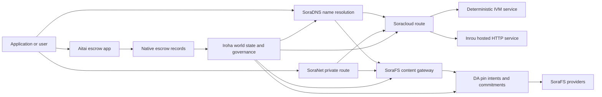

# SORA Nexus Services

SORA Nexus adds app-facing service planes around Iroha 3. These services
are not separate ledgers. They are anchored by Iroha world state, Norito
manifests, governance records, and Torii route families.

Availability depends on the node build and network profile. Use
[`/openapi.json`](/reference/torii-endpoints.md#app-and-sora-route-families)
to discover generated app-API routes on the target node. Public local
SoraFS CID and well-known routes are mounted outside that generated
document, so probe those routes directly when checking a deployment.

## Component Map

| Component              | Role                                                                                                                                        | Main surfaces                                                                            |
| ---------------------- | ------------------------------------------------------------------------------------------------------------------------------------------- | ---------------------------------------------------------------------------------------- |
| Soracloud              | Application deployment, hosted services, private model/runtime state, and service lifecycle control.                                        | `/v1/soracloud/*`, `/api/*`, `iroha app soracloud ...`                                   |
| Inrou                  | Soracloud hosted HTTP runtime for service revisions that need a live HTTP plane.                                                            | Soracloud runtime config, host capability adverts, replica runtime state                 |
| SoraNet                | Privacy and transport overlay for circuits, relay traffic, VPN, Connect sessions, and streaming routes.                                     | `/v1/connect/*`, `/v1/vpn/*`, SoraNet route metadata                                     |
| Data Availability (DA) | Availability evidence, commitment, and pin-intent layer for payloads that are referenced by Nexus lanes, SoraFS manifests, and proof flows. | `/v1/da/*`, `FindDaPinIntent*`, `[nexus.da]`                                             |
| SoraFS                 | Content-addressed storage fabric for manifests, CAR payloads, pinned content, gateway fetches, and proof-of-retrievability flows.           | `/v1/sorafs/*`, `/sorafs/*`, `FindSorafsProviderOwner`                                   |
| SoraDNS                | Deterministic naming and resolver-attestation layer for SORA-hosted services and content.                                                   | `/v1/soradns/*`, `/soradns/*`, resolver directory events                                 |
| Aitai                  | App-level fiat and asset settlement corridor backed by native escrow records, not by a separate ledger.                                     | `OpenAssetEscrow`, `FindAssetEscrow*`, `EscrowEventFilter`, Kotodama `escrow_*` builtins |



## Common Flows

### Hosted Split Application

A typical mixed-plane app uses all of the pieces together:

1. Static frontend assets are packaged and pinned through SoraFS.
2. The public host, for example `<app>.sora`, is registered through
   SoraDNS.
3. Soracloud routes `/api/v1/search` or `/api/v1/stream` to an Inrou HTTP
   service.
4. Soracloud routes `/api/auth` and `/api/v1/user` to deterministic IVM
   handlers.
5. Clients that need privacy can reach the same content or API route
   through a SoraNet circuit.

| Path              | Backing plane         | Why                                               |
| ----------------- | --------------------- | ------------------------------------------------- |
| `/`               | SoraFS static content | Reproducible content root and gateway caching     |
| `/assets/*`       | SoraFS static content | Content-addressed assets and manifest proofs      |
| `/api/auth*`      | Soracloud IVM         | Replay-safe auth and wallet challenge state       |
| `/api/v1/user*`   | Soracloud IVM         | Governance-sensitive state mutations              |
| `/api/v1/search*` | Soracloud Inrou       | Live HTTP service, cache, SSE, or collector state |

### Content Publication

SoraFS publication produces durable artifacts before a name points at them:

1. Build a payload or directory.
2. Pack it into a CAR archive and chunk plan.
3. Build a Norito manifest with pin policy and governance data.
4. Submit the manifest to Torii.
5. Record a DA pin intent or availability commitment when the target
   profile requires explicit evidence.
6. Bind the manifest to a SoraDNS name or Soracloud static frontend route.

### Private Fetch or Streaming Route

SoraNet can sit in front of SoraFS or Soracloud:

1. The client resolves the name or manifest.
2. A guard directory or route manifest chooses entry and exit relays.
3. Traffic is padded and sent through the SoraNet circuit.
4. The exit relay reaches the SoraFS gateway, Torii stream, or Soracloud
   route.

## Aitai

Aitai is the SORA app corridor for marketplace-style settlement where a
buyer and seller coordinate an off-chain payment while Iroha controls the
on-chain asset custody. It should use the native escrow instruction family
instead of a contract-owned escrow account for new numeric-asset custody
flows.

Native escrow keeps custody in the ledger. The seller opens an offer with
`OpenAssetEscrow`, the buyer accepts and marks off-chain payment with
`AcceptAssetEscrow` and `MarkEscrowPaymentSent`, and the seller releases
with `ReleaseAssetEscrow` or cancels before payment is marked. If buyer and
seller disagree, either party can open a dispute and a resolver with
`CanResolveEscrowDispute` can split the locked amount.

For the full lifecycle, generic asset locks, anonymous escrow, queries,
events, and Rust examples, see
[Native Asset Escrow](/blockchain/escrow.md).

| Aitai surface                                                                                                                                                 | Use it for                                                                                |
| ------------------------------------------------------------------------------------------------------------------------------------------------------------- | ----------------------------------------------------------------------------------------- |
| `OpenAssetEscrow`, `AcceptAssetEscrow`, `MarkEscrowPaymentSent`, `ReleaseAssetEscrow`, `CancelAssetEscrow`                                                    | Transparent numeric asset offers, including XOR-denominated settlement flows.             |
| `OpenAnonymousAssetEscrow`, `AcceptAnonymousAssetEscrow`, `MarkAnonymousEscrowPaymentSent`, `ReleaseAnonymousAssetEscrow`, `CancelAnonymousAssetEscrow`       | Shielded offers use proof attachments for funding and closing movements.                  |
| `OpenEscrowDispute`, `ResolveEscrowDispute`, `OpenAnonymousEscrowDispute`, `ResolveAnonymousEscrowDispute`                                                    | Dispute entry and court-style resolution.                                                 |
| `FindAssetEscrowById`, `FindAssetEscrowsBySeller`, `FindAssetEscrowsByBuyer`, `FindAssetEscrowsByStatus`                                                      | App status pages, reconciliation jobs, and support tooling.                               |
| `EscrowEventFilter`                                                                                                                                           | Live transparent escrow subscriptions by escrow id, seller, buyer, status, or event kind. |
| Kotodama `escrow_open_offer`, `escrow_accept`, `escrow_mark_payment_sent`, `escrow_release`, `escrow_cancel`, `escrow_open_dispute`, `escrow_resolve_dispute` | Kotodama contract calls backed by the V1 escrow syscalls.                                 |

For public Taira or Minamoto usage, treat the off-chain payment rail and
any support or court workflow as application policy. Iroha records the
custody state, lifecycle events, evidence hashes, and final asset movement;
it does not verify fiat settlement by itself.

## Check a Target Node

Before using examples from this page, confirm that the route family exists
on the node you are targeting:

```bash
export TORII_URL=https://taira.sora.org

curl -fsS "$TORII_URL/openapi.json" \
  | jq '.paths | keys[] | select(test("^/v1/(soracloud|sorafs|soradns|connect|vpn|da)/"))'

curl -fsS -H 'Accept: application/json' "$TORII_URL/status" | jq .
```

`/openapi.json` is the canonical OpenAPI endpoint. Exact route availability
depends on build features and network configuration. The document does not
enumerate the public local SoraFS CID and well-known routes; check those
endpoints directly as described below.

### Taira Read-Only Smoke Checks

The public Taira endpoint is useful for read-side checks, but do not use it
for mutating examples unless you are operating an authorized account and
intend to change public testnet state.

```bash
export TORII_URL=https://taira.sora.org

curl -fsS -H 'Accept: application/json' "$TORII_URL/status" \
  | jq '{version: .build.version, peers, blocks, lanes: (.teu_lane_commit | length)}'

curl -fsS "$TORII_URL/v1/vpn/profile" \
  | jq '{available, relay_endpoint, supported_exit_classes}'

curl -fsS "$TORII_URL/v1/sorafs/storage/peers?limit=4" \
  | jq '{gateway_base_url, pin_torii_urls}'

curl -fsS -H 'Accept: application/json' "$TORII_URL/v1/soracloud/status" \
  | jq '.control_plane | {service_count, services: [.services[] | {service_name, current_version}]}'
```

Taira may expose deployment-specific control-plane routes that are not
listed in the OpenAPI path map. Treat `/openapi.json` as the generated
contract for the routes it contains, then confirm deployment-specific and
public local SoraFS routes directly before documenting them as available.

## Soracloud

Soracloud is the SORA application control plane. It tracks deployment
bundles, service revisions, routing, rollout state, authoritative config
entries, encrypted service secrets, model registry records, private
inference sessions, and runtime receipts.

Soracloud uses two execution planes:

| Execution plane        | Runtime | Use it for                                                                                   |
| ---------------------- | ------- | -------------------------------------------------------------------------------------------- |
| `DeterministicService` | `Ivm`   | Auth, vault state, certified reads, ordered mailbox handlers, governance-sensitive mutations |
| `HttpService`          | `Inrou` | Live HTTP APIs, collector-heavy work, cache-backed services, SSE, browser-assisted flows     |

The control plane is authoritative. Deploy, upgrade, rollback, config,
secret, model, and status commands submit through Torii and read committed
world state; they do not rely on a separate CLI-local mirror. Public
routing is longest-prefix based, so one registered host can split traffic
between hosted HTTP routes and deterministic API routes.

### Scaffold a Split App

The split-app template creates a static frontend plus one hosted live API
and one deterministic vault/API service:

```bash
iroha soracloud app init \
  --template split-app \
  --app-name solswap_indexer \
  --app-version 0.1.0 \
  --public-host solswap-indexer.sora \
  --output-dir ./apps/solswap-indexer

iroha soracloud app plan \
  --manifest ./apps/solswap-indexer/app_manifest.json

iroha soracloud app doctor \
  --manifest ./apps/solswap-indexer/app_manifest.json
```

`plan` prints the route split, child service manifests, workspace script
paths, and the expected frontend publication mode. `doctor` validates the
local release contract before you involve Torii.

### Deploy and Inspect App State

Reuse one future SoraFS retention epoch for every retry of the release.
Because the split-app template contains an Inrou service, qualify its exact
artifact in the selected offline provider stores before the online
mutation:

```bash
export SORACLOUD_TORII_URL=https://<soracloud-enabled-torii>
export SORAFS_RETENTION_EPOCH=<future-unix-seconds>

iroha soracloud app preseed \
  --manifest ./apps/solswap-indexer/app_manifest.json \
  --sorafs-retention-epoch "$SORAFS_RETENTION_EPOCH" \
  --inrou-preseed-target <validator-account,peer-id,absolute-store-path> \
  --inrou-preseed-max-capacity-bytes <bytes> \
  --inrou-preseed-helper /absolute/path/to/sorafs-node \
  --inrou-preseed-helper-sha256 <lowercase-sha256> \
  --receipt-out /absolute/path/to/solswap-inrou-preseed.json

iroha soracloud app release \
  --manifest ./apps/solswap-indexer/app_manifest.json \
  --sorafs-retention-epoch "$SORAFS_RETENTION_EPOCH" \
  --inrou-preseed-receipt /absolute/path/to/solswap-inrou-preseed.json \
  --torii-url "$SORACLOUD_TORII_URL"

iroha soracloud app status \
  --manifest ./apps/solswap-indexer/app_manifest.json \
  --torii-url "$SORACLOUD_TORII_URL"
```

Repeat `--inrou-preseed-target` for every provider store required by the
deployment policy. `release` builds and synchronizes the manifests, runs
the app doctor, submits one canonical app-infrastructure mutation,
reconciles authoritative status, and verifies the declared live targets. A
preseed receipt is not optional when the app contains Inrou artifacts.

For an already deployed service, use service-scoped commands:

```bash
iroha soracloud service status \
  --service-name solswap_indexer_live \
  --torii-url "$SORACLOUD_TORII_URL"

iroha soracloud service rollback \
  --service-name solswap_indexer_live \
  --target-version 0.1.0 \
  --torii-url "$SORACLOUD_TORII_URL"
```

### Config and Secret Material

Soracloud config and secret entries are part of authoritative deployment
state. Deploy, upgrade, and rollback fail closed when required config or
secret bindings are missing or inconsistent with the active manifests.

```bash
iroha soracloud service config-set \
  --service-name solswap_indexer_live \
  --config-name indexer/public_config \
  --value-file ./config/public-config.json \
  --torii-url "$SORACLOUD_TORII_URL"

iroha soracloud service secret-set \
  --service-name solswap_indexer_live \
  --secret-name indexer/api_key \
  --secret-file ./secrets/api-key.envelope.json \
  --torii-url "$SORACLOUD_TORII_URL"
```

Use the CLI help for the exact credential flags required by your profile:

```bash
iroha soracloud service config-set --help
iroha soracloud service secret-set --help
```

## Inrou

Inrou is the hosted HTTP runtime used by Soracloud. An Iroha node with the
embedded Soracloud runtime projects admitted Soracloud state into a local
materialization plan, starts assigned hosted-service replicas as loopback
services, and reports replica runtime state back into the authoritative
model.

Use Inrou for workloads that need a live HTTP surface, such as
collector-heavy APIs, SSE streams, cache-backed handlers, or
browser-assisted services.

### Runtime Requirements

- Container manifest runtime must be `Inrou`.
- Service manifest execution plane must be `HttpService`.
- `HttpService + Inrou` requires exactly one `PersistentRootLeaseVolume`
  mounted at `/`.
- Replicated Inrou services also need shared service or confidential lease
  storage when they retain mutable shared state.
- Production hosting nodes should advertise real Inrou capacity instead of
  operating only as a proxy.

### Manifest Fragment

The example below shows the shape of the two manifests. It is a fragment,
not a complete deployment bundle.

```jsonc
// container_manifest.json
{
  "schema_version": 1,
  "runtime": { "runtime": "Inrou", "value": null },
  "bundle_path": "/bundles/solswap-indexer.inrou",
  "entrypoint": "/app/bin/launch-indexer.sh",
  "args": [],
  "env": {
    "RUST_LOG": "info",
  },
  "inrou": {
    "schema_version": 1,
    "guest_os": { "guest_os": "DebianSlim", "value": null },
    "guest_images": {
      "x86_64": {
        "kernel_image_path": "/inrou/x86_64/vmlinux",
        "rootfs_image_path": "/inrou/x86_64/rootfs.ext4",
        "initrd_image_path": null,
      },
      "aarch64": {
        "kernel_image_path": "/inrou/aarch64/vmlinux",
        "rootfs_image_path": "/inrou/aarch64/rootfs.ext4",
        "initrd_image_path": null,
      },
    },
  },
  "lifecycle": {
    "start_grace_secs": 60,
    "stop_grace_secs": 30,
    "healthcheck_path": "/api/indexer/v1/health",
  },
}
```

```jsonc
// service_manifest.json
{
  "schema_version": 1,
  "service_name": "solswap_indexer_live",
  "service_version": "0.1.0",
  "execution_plane": { "execution_plane": "HttpService", "value": null },
  "replicas": 2,
  "route": {
    "host": "solswap-indexer.sora",
    "path_prefix": "/api/v1/search",
    "service_port": 8080,
    "visibility": { "visibility": "Public", "value": null },
    "tls_mode": { "tls": "Required", "value": null },
  },
  "lease_volumes": [
    {
      "volume_name": "root_disk",
      "kind": {
        "lease_volume": "PersistentRootLeaseVolume",
        "value": null,
      },
      "storage_class": { "storage_class": "Warm", "value": null },
      "mount_path": "/",
      "max_total_bytes": 8589934592,
    },
    {
      "volume_name": "index_state",
      "kind": { "lease_volume": "ServiceLeaseVolume", "value": null },
      "storage_class": { "storage_class": "Warm", "value": null },
      "mount_path": "/var/lib/solswap-indexer",
      "max_total_bytes": 1073741824,
    },
  ],
}
```

At runtime, each mounted lease volume is exposed through environment
variables derived from the volume name:

```text
SORACLOUD_LEASE_VOLUME_ROOT_DISK_DIR
SORACLOUD_LEASE_VOLUME_ROOT_DISK_MOUNT_PATH
SORACLOUD_LEASE_VOLUME_INDEX_STATE_DIR
SORACLOUD_LEASE_VOLUME_INDEX_STATE_MOUNT_PATH
```

## SoraNet

SoraNet is the privacy and transport overlay. It provides relay-based
routes for traffic that should not connect directly to the target gateway
or service. The transport design uses entry, middle, and exit relay roles,
QUIC transport, a Noise-based hybrid handshake, capability negotiation,
relay directory metadata, and fixed-size padded cells.

In Nexus deployments, SoraNet can carry content fetches, gateway traffic,
VPN or Connect sessions, and Norito streaming routes. Directory entries can
mark relays that support `norito-stream`, which lets clients prefer routes
suitable for Torii RPC or streaming traffic.

### Streaming Configuration

The Nexus profile enables SoraNet provisioning for streaming routes:

```toml
[streaming]
feature_bits = 0b11

[streaming.soranet]
enabled = true
exit_multiaddr = "/dns/torii/udp/9443/quic"
padding_budget_ms = 25
access_kind = "authenticated"
provision_spool_dir = "./storage/streaming/soranet_routes"
provision_spool_max_bytes = 0
provision_window_segments = 4
provision_queue_capacity = 256
```

Use `access_kind = "read-only"` for content routes that do not require
viewer authentication. Use `authenticated` when the exit relay must enforce
tickets or viewer identity before bridging to Torii or a hosted service.

### SoraNet-Aware SoraFS Fetch

The SoraFS fetch CLI can emit a local proxy manifest and spool SoraNet
route metadata for browser extensions or SDK adapters. The orchestrator
JSON must define `local_proxy` with `"emit_browser_manifest": true`, and
the CLI must be built with `local-quic-proxy` support. On Taira, inspect
the admitted provider catalog at the public testnet root, then populate the
protected provider tuple issued for that provider:

```bash
export TAIRA_ROOT=https://taira.sora.org
curl -fsS "$TAIRA_ROOT/v1/sorafs/providers?limit=20" | jq '.providers'

: "${TAIRA_SORAFS_PROVIDER_ID:?set the admitted provider ID from Taira discovery}"
: "${TAIRA_SORAFS_GATEWAY_KEY:?set the provider gateway key}"
: "${TAIRA_SORAFS_PROVIDER_URL:?set the advertised provider base URL}"
: "${TAIRA_SORAFS_STREAM_TOKEN_FILE:?set the issued stream-token file}"

cargo run -p sorafs_orchestrator --features=local-quic-proxy --bin=sorafs_cli -- \
  fetch \
  --plan=artifacts/payload_plan.json \
  --manifest-id=<manifest-digest-hex> \
  --orchestrator-config=artifacts/orchestrator.json \
  --provider=name=taira,provider-id="$TAIRA_SORAFS_PROVIDER_ID",gateway-key="$TAIRA_SORAFS_GATEWAY_KEY",base-url="$TAIRA_SORAFS_PROVIDER_URL",stream-token="$(cat "$TAIRA_SORAFS_STREAM_TOKEN_FILE")" \
  --output=artifacts/payload.bin \
  --json-out=artifacts/fetch_summary.json \
  --local-proxy-manifest-out=artifacts/proxy_manifest.json \
  --local-proxy-mode=bridge \
  --local-proxy-norito-spool=storage/streaming/soranet_routes \
  --local-proxy-kaigi-spool=storage/streaming/soranet_routes \
  --local-proxy-kaigi-policy=authenticated \
  --max-peers=2 \
  --retry-budget=4
```

The summary records provider reports, chunk receipts, local proxy metadata,
and the effective route settings used for the fetch.

### Relay Incentive Verifier Roster

Relay incentive ingestion is fail-closed. When `incentives.enable` is true,
`incentives.trusted_verifier_ids` must contain at least one canonical
account ID. The roster must never exceed 64 entries, even while incentives
are disabled. The runtime stores it as a deterministic ordered set, and
rejects invalid roster geometry during relay startup.

Each `RelayBandwidthProofV1` is decoded under a fixed frame/allocation
budget and must consume the complete frame. The proof's verifier account
must be present in the configured roster, and
`RelayBandwidthProofV1::verify_signature()` must succeed, before the relay
locks or changes its performance accumulator. An untrusted signer or a
signature-invalid/tampered proof therefore contributes no measurement and
cannot produce an incentive snapshot.

## Data Availability (DA)

DA is the availability-evidence layer for payloads that are too large, too
privacy-sensitive, or too service-specific to place directly in world
state. It records deterministic commitments and retrieval obligations so
validators, gateways, and clients can agree on which bytes were promised,
which policy applies, and which evidence has been observed.

DA does not replace Kura or SoraFS:

- Kura stores the finalized block stream and consensus recovery data.
- SoraFS stores and serves content-addressed bytes, CAR payloads, and
  manifests.
- DA records commitments, proof policies, proof openings, and pin intents
  that let those bytes be scheduled, audited, and linked back to ledger
  state.

Use DA when an application or Nexus lane needs a ledger-visible promise
that off-chain data remains retrievable. Common examples include lane
payload commitments for settlement flows, SoraFS pin intents for published
content, proof bundles that must be retained for later verification, and
application artifacts whose public state should be a digest rather than the
full payload.

### Lifecycle

| Stage      | What is recorded                                                                                                                                      |
| ---------- | ----------------------------------------------------------------------------------------------------------------------------------------------------- |
| Intent     | A ticket, manifest reference, alias, lane/epoch/sequence reference, retention policy, or replication target.                                          |
| Commitment | Digest material that binds the manifest, lane payload, proof bundle, or content root to the ledger-visible record.                                    |
| Evidence   | Availability votes, proof openings, provider attestations, or other profile-specific evidence accepted by the target network.                         |
| Query      | Pin-intent lookups through `FindDaPinIntentByTicket`, `FindDaPinIntentByManifest`, `FindDaPinIntentByAlias`, or `FindDaPinIntentByLaneEpochSequence`. |

A typical DA-backed publication flow is:

1. Build or receive the payload outside the WSV, for example a SoraFS CAR
   file or Nexus lane payload.
2. Hash and describe the payload in a Norito manifest or route-specific
   commitment record.
3. Submit the manifest, pin intent, or commitment through `/v1/da/*` when
   that route family is enabled, or through the network's signed
   transaction path.
4. Let validators or availability providers collect the evidence required
   by the active proof policy.
5. Query the resulting pin intent or commitment before promoting an alias,
   settlement proof, or gateway route that depends on the payload.

### Algorithmic Model

DA turns a payload into a signed, replay-protected, block-indexed
commitment. The important algorithms are deterministic so validators and
gateways can recompute the same digests from the same bytes.

1. **Canonicalize the submitted payload.** Torii accepts an ingest request
   with `(lane_id, epoch, sequence)`, payload bytes, compression metadata,
   chunk size, erasure profile, retention policy, and submitter signature.
   The node decompresses gzip, deflate, or Zstandard payloads when
   requested, then verifies that the canonical byte length equals
   `total_size`.
2. **Validate lane and chunk parameters.** The lane must exist in the Nexus
   lane catalog. `chunk_size` must be a non-zero power of two, at least two
   bytes, and no larger than the configured maximum. The erasure profile
   must include data shards and at least two parity shards. The lane
   catalog selects the proof scheme, either `merkle_sha256` or
   `kzg_bls12_381`.
3. **Apply network policy.** The node enforces the configured replication
   and retention baseline for the blob class. Public metadata must stay
   plaintext; governance-only metadata is encrypted with the node's
   configured governance metadata key before it is written into the
   manifest.
4. **Chunk and commit.** The canonical payload is chunked with a fixed-size
   profile derived from `chunk_size`. Torii computes the payload digest,
   the proof-of-retrievability tree root, and per-chunk commitments. Data
   chunks carry BLAKE3 commitments over their bytes.
5. **Add erasure commitments.** Chunks are grouped into stripes of
   `data_shards`. Missing cells in the final stripe are zero padded for
   parity calculation. RS(16) parity creates row/global parity shards;
   optional `row_parity_stripes` add column-style stripe parity across the
   matrix. Parity shard commitments are BLAKE3 digests of little-endian
   `u16` symbols.
6. **Build the manifest.** `DaManifestV1` records the lane, epoch, blob
   class, codec, payload digest, chunk root, chunk size, erasure profile,
   retention policy, rent quote, chunk commitments, optional IPA
   commitment, metadata, and issue time. The storage ticket is
   deterministic: the node first hashes a manifest template with an empty
   ticket, then writes that fingerprint back as the final `storage_ticket`.
7. **Reject replay conflicts.** The replay key is
   `(lane_id, epoch, sequence, manifest_fingerprint)`. A duplicate with the
   same fingerprint is idempotent. A stale sequence or the same sequence
   with a different fingerprint is rejected.
8. **Emit signed artifacts.** Torii computes a PDP commitment, signs a
   `DaIngestReceipt`, builds a `DaCommitmentRecord`, and writes spool
   artifacts for the manifest, PDP commitment, commitment record,
   commitment schedule, pin intent, receipt file, and receipt log. The
   receipt cursor advances monotonically per `(lane_id, epoch)`.

Commitment records are what blocks carry. A record binds:

- lane, epoch, and sequence
- caller blob ID and canonical manifest hash
- lane proof scheme
- chunk root
- optional KZG commitment for KZG lanes
- PDP/proof digest
- retention class and storage ticket
- Torii DA acknowledgement signature

Before a block embeds DA records, the block assembly path validates the
bundle:

- `(lane_id, epoch, sequence)` must be unique inside the bundle.
- Manifest hashes must be non-zero and unique inside the bundle.
- The commitment proof scheme must match the configured lane policy.
- Merkle lanes reject KZG commitments; KZG lanes require a non-zero KZG
  commitment.
- Pin intents are canonicalized, sorted, and filtered by lane, manifest
  hash, storage ticket, owner account, and alias-collision rules.

The block header stores hashes for DA proof policies, commitments, and pin
intents. For membership proofs, the commitment bundle also exposes a Merkle
root whose leaves are hashes of canonical Norito-encoded
`DaCommitmentRecord` values. Parent nodes hash the concatenation of left
and right children; an odd leaf is promoted unchanged to the next layer.

### Proof Verification

`/v1/da/commitments/prove` can produce a proof for one commitment in a
block. The proof contains the commitment, block height, index in the
bundle, bundle hash, bundle length, Merkle root, and sibling path.
Verification checks:

1. The proof bundle hash matches the block header's DA commitment hash.
2. The proof block height matches the referenced block header.
3. The index is in bounds and the commitment equals the bundle entry at
   that index.
4. The lane proof policy accepts the commitment.
5. Folding the sibling path from the commitment leaf reconstructs the
   supplied root.
6. The reconstructed root equals the bundle root.

This proves that a specific availability commitment was included in a
specific block payload; it does not prove that every replica is currently
online. Live retrievability is checked separately through SoraFS provider
fetches, PDP/PoTR checks, or profile-specific availability evidence.

### Consensus Interaction

Consensus payload availability is mandatory, but it is not a second
finality protocol. The leader broadcasts a signed `PayloadManifest` to the
complete `3f + 1` committee. The first body and RS16 chunk occurrence
targets Set A, whose `2f + 1` members include the leader and proxy tail. A
bounded same-view retransmission expands body and chunk service to the
whole committee.

A manifest or partial shard set is not enough to vote. Before Prepare, each
validator must authenticate the chunks, reconstruct the complete canonical
body, verify its length, chunk root, and body hash, persist that body, and
finish deterministic block validation. The validator retains the exact body
through CommitQC application or certified recovery.

When a peer learns a certificate before it has the body, it first requests
authenticated chunks or the canonical body from certificate signers, then
expands recovery to the frozen committee. Every response remains bound to
the exact height context, proposal round, manifest, and body subject. The
block is applied only after the locally reconstructed body matches the
certificate.

### Operator Notes

Iroha 3 consensus profiles always include signed manifest and RS16 payload
dissemination, full-body-before-Prepare validation, DA bundle validation,
and bounded recovery telemetry. The layout and protocol bounds are frozen
into the signed height context; there is no local switch or timeout profile
that can disable or redefine them. Node-local block and queue bounds still
need to fit the deployment's signed layout and workload.

For route discovery, start with the node's OpenAPI document:

```bash
curl -fsS "$TORII_URL/openapi.json" \
  | jq '.paths | keys[] | select(startswith("/v1/da/"))'
```

Use the
[query reference](/reference/queries.md#nexus-data-availability-and-packages)
for the current DA query names, and the
[peer configuration template](/reference/peer-config/) for
application-level `[nexus.da]` ingest, sampling, audit, and recovery bounds
plus the local Sumeragi block and queue limits.

## SoraFS

SoraFS is the decentralized content-addressed storage fabric. It packages
bytes into deterministic chunks, CAR archives, and Norito manifests that
bind content roots, chunking profiles, pin policies, and governance
attestations. Storage providers advertise capacity and content
availability, while gateways verify manifests and chunk commitments before
serving content.

Typical SoraFS uses include static application assets, documentation
builds, zone bundles, model or artifact references, and governance evidence
bundles. The Iroha data model exposes SoraFS gateway events and a
[`FindSorafsProviderOwner`](/reference/queries.md#nexus-data-availability-and-packages)
query for provider ownership resolution.

### Taira Testnet Profile

Taira is the canonical public SoraFS testnet. Its checked-in validator
profile uses chain `fc56984b-2be7-431d-840e-21514d1883f0` and chain
discriminant `369`. The `NetworkId` below is the exact identity of the
current pinned Taira genesis. A Taira reset can change that hash while
retaining the chain label, so refresh it from the current signed deployment
profile and never derive it from the chain UUID. Taira's effective SoraFS
settings are:

- network ID:
  `hash:82531CE8EAE8BFF6BEECA4698BFD13A3BC8BEC5F0EE0D23D428C97FC17AB0F3B#3E94`
- gateway base URL: `https://taira.sora.org`
- pin Torii URLs: `https://taira-validator-1.sora.org` through
  `https://taira-validator-4.sora.org`
- discovery capabilities: `torii_gateway`, `chunk_range_fetch`, and
  `potr_mldsa`
- isolated content origin: `https://{cid}.sorafs.taira.sora.org/{path}`
- public pin policy: permissionless and fee-gated, with
  `require_council_signatures = false`

```toml
[sorafs.storage]
enabled = false
max_capacity_bytes = 13743895347

[sorafs.discovery]
discovery_enabled = true
known_capabilities = ["torii_gateway", "chunk_range_fetch", "potr_mldsa"]

[sorafs.discovery.admission]
envelopes_dir = "configs/soranexus/taira/sorafs_admission"
trusted_council_keys = ["REPLACE_WITH_TAIRA_SORAFS_COUNCIL_PUBLIC_KEY"]
signature_threshold = "REPLACE_WITH_TAIRA_SORAFS_COUNCIL_SIGNATURE_THRESHOLD"

[sorafs.discovery.publish]
gateway_base_url = "https://taira.sora.org"
pin_torii_urls = [
  "https://taira-validator-1.sora.org",
  "https://taira-validator-2.sora.org",
  "https://taira-validator-3.sora.org",
  "https://taira-validator-4.sora.org",
]

[sorafs.gateway]
require_manifest_envelope = true
enforce_admission = true
enforce_capabilities = true

[sorafs.gateway.untrusted_hosting]
enabled = true
path_gateway_redirect = true
redirect_html_only = true

[sorafs.gateway.untrusted_hosting.cid_host_suffixes]
live = "sorafs.sora.org"
taira = "sorafs.taira.sora.org"

[sorafs.repair]
enabled = false
claim_ttl_secs = 900
heartbeat_interval_secs = 60
max_attempts = 3
worker_concurrency = 4

[sorafs.gc]
enabled = false
interval_secs = 900
max_deletions_per_run = 500
retention_grace_secs = 86400

[gov.sorafs_pin_policy]
require_council_signatures = false
```

The three top-level gateway values are inherited fail-closed defaults; all
other values in the excerpt are explicit in Taira's checked-in profile. An
operator must replace the discovery-admission placeholders with the signed
deployment material. Every served request must carry a manifest envelope,
pass provider admission, and use an advertised capability.

The Taira validators have embedded SoraFS storage, repair, and garbage
collection disabled. Their configured capacity remains part of the
validator disk-budget check; it does not mean that the validator is a
storage provider. Use `GET /v1/sorafs/storage/peers?limit=4` to read the
current configured gateway and pin destinations before a test.

Taira's schema config accepts both the `live` and `taira` CID-host suffix
keys. Public-testnet manifests, origin checks, and browser tests should use
`sorafs.taira.sora.org` so their origin is visibly bound to Taira; do not
treat the accepted `live` key as a recommendation to publish testnet
content under a production-looking origin. Other deployments must use their
own network identity, governance keys, provider admission material, pin
endpoints, and capacity/repair policy.

### Public Local CID and Site Gateways

Every SoraFS-enabled Torii node mounts these anonymous public routes even
when the optional app API is not built:

| Method and endpoint                | Purpose                                                              |
| ---------------------------------- | -------------------------------------------------------------------- |
| `GET /.well-known/sorafs/manifest` | Return the manifest selected by the canonical request host           |
| `GET /v1/sorafs/cid/{cid}`         | Return bounded local manifest metadata and file entries for one CID  |
| `GET /sorafs/cid/{cid}`            | Serve the root document for one local content-addressed site         |
| `GET /sorafs/cid/{cid}/{*path}`    | Serve one normalized path, or one bounded byte range, under that CID |

These routes never accept `x-sorafs-stream-token` or `x-sorafs-token-id`.
Presence of either header is a bad request. A canonical manifest already
present in the node's authoritative local store is the public read
capability; a cache miss does not authorize remote-provider hydration.
Protected provider CAR and chunk routes remain separate authenticated
protocol surfaces.

Before reading bytes, Torii validates the local manifest's canonical
encoding, semantic constraints, digest, and root CID. It then requires the
authoritative local provider identity, governance admission, and governed
compliance for the manifest, CID, and provider. Gateway rate/ban policy
uses the effective client address, honoring forwarded addresses only
through configured trusted proxies. Missing policy, compliance, identity,
or admission state fails closed.

One request holds an end-to-end public-gateway permit; the process-wide
limit is 64 concurrent reads, with excess requests returning
`503 Service Unavailable` and `Retry-After: 1`. Manifest responses are
capped at 16 MiB, file listings default to 50 entries and return at most
500, and a full file or single byte range is capped at 8 MiB. Query parsing
depends on the build. The shipping `app_api` build accepts a decoded
unsigned 32-bit `limit`, ignores other query keys, lets the last repeated
`limit` win, and clamps the value into `1..=500`. A feature-minimal build
without `app_api` accepts only one canonical `limit=1..500` pair and
rejects unknown, repeated, percent-encoded, or non-canonical forms. Send
exactly one `limit=<1..500>` pair for behavior that is portable across
builds. CIDs, hosts, paths, and range headers remain canonical and
single-valued in both builds. Active HTML, CSS, JavaScript, SVG, XML, PDF,
or Wasm content is served only from a configured CID-derived isolated
origin (or redirected there), preventing a shared path-gateway origin from
executing untrusted content.

### Pack, Build, and Submit

The following mutation example uses the current pinned Taira `NetworkId`,
pin endpoint, replication floor, and governance policy. Use a funded
testnet account and a disposable owner-only key file. Taira admits
permissionless pins without council signatures, but still charges the
governed fee.

```bash
cargo run -p sorafs_orchestrator --bin sorafs_cli -- \
  car pack \
  --input=./dist \
  --car-out=artifacts/site.car \
  --plan-out=artifacts/site.chunk-plan.json \
  --summary-out=artifacts/site.car-summary.json

: "${TAIRA_AUTHORITY:?set a funded Taira I105 account}"
export TAIRA_NETWORK_ID='hash:82531CE8EAE8BFF6BEECA4698BFD13A3BC8BEC5F0EE0D23D428C97FC17AB0F3B#3E94'
export TAIRA_PIN_TORII_URL=https://taira-validator-1.sora.org
export TAIRA_PRIVATE_KEY_FILE="${TAIRA_PRIVATE_KEY_FILE:-./secrets/taira-authority.ed25519}"
export TAIRA_RETENTION_EPOCH=$(( $(date -u +%s) + 86400 ))

cargo run -p sorafs_orchestrator --bin sorafs_cli -- \
  manifest build \
  --summary=artifacts/site.car-summary.json \
  --manifest-out=artifacts/site.manifest.to \
  --manifest-json-out=artifacts/site.manifest.json \
  --pin-min-replicas=1 \
  --pin-storage-class=warm \
  --pin-retention-epoch="$TAIRA_RETENTION_EPOCH"

cargo run -p sorafs_orchestrator --bin sorafs_cli -- \
  manifest submit \
  --manifest=artifacts/site.manifest.to \
  --chunk-plan=artifacts/site.chunk-plan.json \
  --torii-url="$TAIRA_PIN_TORII_URL" \
  --network-id="$TAIRA_NETWORK_ID" \
  --authority="$TAIRA_AUTHORITY" \
  --private-key-file="$TAIRA_PRIVATE_KEY_FILE" \
  --summary-out=artifacts/site.manifest.submit.json \
  --response-out=artifacts/site.manifest.submit.body
```

`manifest submit` requires `/v1/sorafs/pin/register`. If the target node
does not route it, the command fails; the first-release CLI does not fall
back to the generic `/transaction` endpoint.

### Verify and Fetch

The protected fetch tuple is provider-specific. Obtain its provider ID and
advertised base URL from Taira's provider catalog, and obtain the gateway
key and stream token through that provider's admission flow. These values
are not validator-storage settings. The checked-in Taira validators have
embedded storage disabled, so do not substitute a validator pin URL for a
provider URL.

```bash
export TAIRA_ROOT=https://taira.sora.org
curl -fsS "$TAIRA_ROOT/v1/sorafs/providers?limit=20" | jq '.providers'

: "${TAIRA_SORAFS_PROVIDER_ID:?set the admitted provider ID from Taira discovery}"
: "${TAIRA_SORAFS_GATEWAY_KEY:?set the provider gateway key}"
: "${TAIRA_SORAFS_PROVIDER_URL:?set the advertised provider base URL}"
: "${TAIRA_SORAFS_STREAM_TOKEN_FILE:?set the issued stream-token file}"

cargo run -p sorafs_orchestrator --bin sorafs_cli -- \
  proof verify \
  --manifest=artifacts/site.manifest.to \
  --car=artifacts/site.car \
  --chunk-plan=artifacts/site.chunk-plan.json \
  --summary-out=artifacts/site.verify.json

cargo run -p sorafs_orchestrator --bin sorafs_cli -- \
  fetch \
  --plan=artifacts/site.chunk-plan.json \
  --manifest-id=<manifest-digest-hex> \
  --provider=name=taira,provider-id="$TAIRA_SORAFS_PROVIDER_ID",gateway-key="$TAIRA_SORAFS_GATEWAY_KEY",base-url="$TAIRA_SORAFS_PROVIDER_URL",stream-token="$(cat "$TAIRA_SORAFS_STREAM_TOKEN_FILE")" \
  --output=artifacts/site.fetch.tar \
  --json-out=artifacts/site.fetch.json
```

### Proof-of-Retrievability Checks

Operators can inspect, export, and report proof-of-retrievability results.
Challenges are scheduled by the network's proof pipeline; the CLI surfaces
their results.

```bash
cargo run -p sorafs_orchestrator --bin sorafs_cli -- \
  por status \
  --torii-url="$TAIRA_PIN_TORII_URL" \
  --manifest=<manifest-digest-hex> \
  --status=failed \
  --limit=20

cargo run -p sorafs_orchestrator --bin sorafs_cli -- \
  por report \
  --torii-url="$TAIRA_PIN_TORII_URL" \
  --week=<YYYY-Www> \
  --format=json
```

## SoraDNS

SoraDNS is the deterministic naming layer for SORA services and content. It
normalizes names, anchors resolver directory updates in Iroha, and
distributes signed zone or resolver bundles through SoraFS. Resolvers and
gateways verify resolver attestation documents before trusting discovery
metadata.

For browser access, SoraDNS derives gateway hosts from a registered FQDN.
The registered vanity host remains the canonical application origin, while
deployed gateway profiles expose browser and Torii fallback routes for that
origin.

### Host Forms

| Form                   | Example                                        | Purpose                                                   |
| ---------------------- | ---------------------------------------------- | --------------------------------------------------------- |
| Vanity origin          | `https://<fqdn>/<path>`                        | Canonical app URL recorded in manifests and release notes |
| Taira browser gateway  | `https://<fqdn>.mon.taira.sora.net/<path>`     | Public browser gateway for an active alias                |
| Torii fallback path    | `https://taira.sora.org/soradns/<fqdn>/<path>` | Torii debug and fallback route for an active alias        |
| Canonical hash gateway | `<base32(blake3(name))>.gw.sora.id`            | Deterministic gateway identity and GAR verification       |

The `/soradns/<alias>/...` fallback is not the preferred public URL.
Tooling, app manifests, and frontend configuration should prefer the vanity
host itself. If an alias is not active on Taira, the browser gateway or
fallback path can return `404` or fail TLS before application routing
starts.

### Derive Gateway Hosts

```ts
import {
  deriveSoradnsGatewayHosts,
  hostPatternsCoverDerivedHosts,
} from '@iroha/iroha-js'

const derived = deriveSoradnsGatewayHosts('docs.sora')
console.log(derived.canonicalHost)
console.log(derived.prettyHost)

const taira = deriveSoradnsGatewayHosts('solswap-indexer.sora', {
  prettySuffix: 'mon.taira.sora.net',
})
console.log(taira.prettyHost)

const patterns = [
  derived.canonicalHost,
  derived.canonicalWildcard,
  derived.prettyHost,
]
console.log(hostPatternsCoverDerivedHosts(patterns, derived))
```

GAR payloads should cover the canonical hash host, the canonical wildcard,
and the selected pretty host.

### Fetch a Resolver Directory Snapshot

```bash
curl -i "$TORII_URL/v1/soradns/directory/latest"

soradns_resolver directory fetch \
  --record-url "$TORII_URL/v1/soradns/directory/latest" \
  --directory-url https://gateway.example.org/soradns/directory/latest.car \
  --output ./state/soradns-directory

soradns_resolver rad verify \
  --rad ./state/soradns-directory/rad/resolver-a.norito
```

Gateways should reject resolvers whose resolver attestation document is
missing, expired, unsigned, or not anchored in the latest directory Merkle
root. On a network where no resolver directory has been published yet,
`/v1/soradns/directory/latest` can return `404` even though the route is
enabled.

### Public DNS Delegation

SoraDNS host derivation does not replace regular internet DNS delegation.
If a public DNS name should point at a SoraDNS gateway:

- for subdomains, publish a CNAME to the selected pretty host
- for apex names, use ALIAS/ANAME or A/AAAA records to the gateway anycast
  IPs
- keep the canonical hash host under the SoraDNS gateway domain for GAR
  checks

## FHE and UAID

FHE-related surfaces available to Nexus services include:

- `iroha_crypto::fhe_bfv` implements deterministic BFV support for scalar
  ciphertext evaluation. Identifier resolution uses
  `BfvIdentifierPublicParameters` and `BfvIdentifierCiphertext`, where slot
  0 stores the input byte length and later slots store one encrypted byte
  each.
- Soracloud state and job schemas model FHE ciphertext workloads with
  governance-managed parameter sets, execution policies, ciphertext
  commitments, query envelopes, and disclosure requests.

The BFV identifier path is used for privacy-preserving enrollment. A client
can submit an encrypted identifier to the Torii resolver. The resolver
evaluates it under the active identifier policy, derives an
`OpaqueAccountId`, and emits a receipt. `ClaimIdentifier` then binds that
receipt to the UAID attached to the target account.

The UAID is the identity and capability anchor around that flow. In the
data model, `UniversalAccountId` is hash-backed and displays as
`uaid:<hash>`. Parsers accept either `uaid:<hash>` or the raw 64-hex
digest. `Account` and `NewAccount` include optional `uaid` and `opaque_ids`
fields. Runtime registration enforces a one-to-one UAID-to-account index,
rejects duplicate or colliding opaque identifiers, and rejects opaque
identifiers without a UAID. Whenever a UAID account binding changes, the
runtime rebuilds Space Directory dataspace bindings for that UAID.

Space Directory manifests attach capabilities to a UAID. An
`AssetPermissionManifest` names the UAID, dataspace, activation and
optional expiry epoch, and ordered allow/deny entries scoped by dataspace,
program, method, asset, and AMX role. Evaluation is deny-wins: the first
matching deny rejects the request, otherwise the latest matching allow
candidate is checked against any amount limit. Publishing, expiring, and
revoking these manifests is guarded by `CanPublishSpaceDirectoryManifest`.

For Soracloud FHE state, the implemented schemas are:

| Schema                                    | What it controls                                                                                                            |
| ----------------------------------------- | --------------------------------------------------------------------------------------------------------------------------- |
| `SoraStateBindingV1` with `FheCiphertext` | Declares that values under a state key prefix are FHE ciphertexts.                                                          |
| `FheParamSetV1`                           | Names the scheme, backend, modulus chain, polynomial degree, slot count, security target, lifecycle, and parameter digest.  |
| `FheExecutionPolicyV1`                    | Bounds ciphertext size, plaintext size, input/output count, multiplication depth, rotations, bootstraps, and rounding mode. |
| `FheGovernanceBundleV1`                   | Couples one parameter set with one execution policy for admission validation.                                               |
| `FheJobSpecV1`                            | Describes deterministic `Add`, `Multiply`, `RotateLeft`, or `Bootstrap` work over ciphertext state keys and commitments.    |
| `CiphertextQuerySpecV1`                   | Queries ciphertext-only state by service, binding, key prefix, result limit, metadata level, and optional inclusion proof.  |
| `DecryptionRequestV1`                     | Requests disclosure for one ciphertext commitment under a decryption-authority policy.                                      |

`FheJobSpecV1::validate_for_execution` checks that the job, execution
policy, and parameter set agree before admission. It also enforces
operation-specific rules: add and multiply need at least two inputs, rotate
and bootstrap need exactly one input, and requested depth, rotation count,
bootstrap count, input count, payload bytes, and deterministic output size
must stay within policy bounds. Ciphertext query results must not return
plaintext rows.

UAID is not the ciphertext and not the FHE policy itself. It is the stable
account capability anchor used to find the account, opaque identifier
claims, and Space Directory bindings that authorize a service or dataspace
flow. FHE schemas govern encrypted payload admission and execution
separately through parameter sets, execution policies, ciphertext
commitments, and decryption authority policies.

Relevant Torii surfaces include:

- `/v1/identifier-policies`
- `/v1/identifiers/resolve`
- `/v1/accounts/{account_id}/identifiers/claim-receipt`
- `/v1/identifiers/receipts/{receipt_hash}`
- `/v1/accounts/{uaid}/portfolio`
- `/v1/space-directory/uaids/{uaid}`
- `/v1/space-directory/uaids/{uaid}/manifests`
- `/v1/soracloud/fhe/job/run`
- `/v1/soracloud/ciphertext/query`
- `/v1/soracloud/decrypt/request`

The public metadata boundary is explicit in the schemas: UAID bindings,
opaque identifier records, manifest lifecycle, state-key digests,
ciphertext sizes, ciphertext commitments, policy names, parameter-set
versions, job operations, output state keys, and disclosure request
metadata can be visible. Identifier plaintexts, decrypted state, model
inputs and outputs, and FHE secret keys are outside these public query
records.

## Operational Checklist

- Confirm generated service families with `/openapi.json` on the target
  Torii node, and probe public local SoraFS CID and well-known routes
  directly.
- Treat Soracloud deployment manifests, SoraFS manifests, SoraDNS resolver
  directory records, SoraNet relay directory records, and DA pin intents or
  availability commitments as governance-sensitive artifacts.
- Use the same SORA Nexus profile consistently across validators in one
  network.
- Keep Inrou root and shared lease volumes in manifests instead of relying
  on ad hoc node-local paths.
- Use SoraFS proof verification before promoting content aliases.
- Monitor SoraNet handshake failures, Sumeragi body state and
  missing-payload recovery, SoraFS gateway refusals, SoraDNS RAD freshness,
  and Soracloud rollout health.
- For public testnet usage, use the Taira profile and start with
  [Connect to SORA Nexus dataspaces](/get-started/sora-nexus-dataspaces.md).

See also:

- [Torii endpoints](/reference/torii-endpoints.md)
- [Data event filters](/blockchain/filters.md#data-event-filters)
- [Query reference](/reference/queries.md#nexus-data-availability-and-packages)
- [Canonical Taira validator configuration at the pinned commit](https://github.com/hyperledger-iroha/iroha/blob/0010c5a70039eac101a4846499ba9ceaf43eb65c/configs/soranexus/taira/config.toml)
