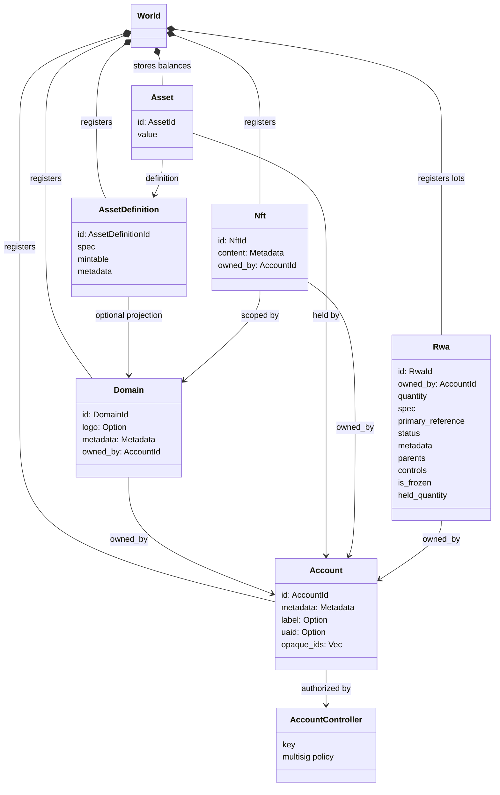
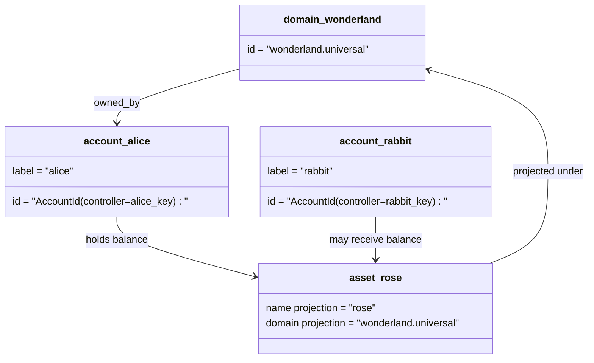

# གནད་སྡུད་གི་རྣམ་གཞག་ {#data-model}

Iroha གིས་ `World` ནང་གི་རྩིས་དེབ་ཀྱི་གནས་སྟངས་འདི་བཙུགསཔ་ཨིན། ཨང་དང་པ་ཐོན་པའི་ གནས་སྡུད་བཟོ་རྣམ་འདི་གིས་ འོག་གི་དབྱེ་བ་དང་མཐུན་རྐྱེན་ཚུ་ལག་ལེན་འཐབ་ཨིན།

- ཌའི་ཊ་ས་པི་སི་ནང་ ཁྱད་ཚད་ཡོད་པའི་མིང་ཐོ་ཚུ་ཨིན། དཔེར་ན་ `payments.universal`
- རྩིས་ཁྲ་ཚུ་ སྒྲིག་གཞི་དང་ ས་ཁོངས་མེད་ཨིན། རྩིས་ཁྲལ་ ID འདི་ རྩིས་ཁྲའི་འཛིན་སྐྱོང་པ་ལས་བཏོན་ཡོདཔ་ཨིན།
- རྒྱུ་དངོས་གི་འགྲེལ་བཤད་ཚུ་ནང་ལུ་ domain/name projection བཟོ་ཚུགས་རུང་ ཁོང་གི་ canonical text address འདི་ opaque Base58 identifier ཨིན།
- རྒྱུ་དངོས་ཚུ་ རང་བཞིན་གྱི་རྒྱུ་དངོས་གི་འགྲེལ་བཤད་ཀྱི་དོན་ལུ་རྩིས་ཁྲ་ནང་བཞག་མི་དངུལ་རྐྱང་ཨིན།
- NFTs འདི་ domain-qualified IDs དང་ metadata content ཡོད་པའི་རང་རྐྱང་གི་ཐོ་ཡིག་ཨིན།
- RWAs བཟོ་སྐྲུན་འབད་ཡོདཔ་-ID ལོཊ་ཚུ་ སྒྱུད་རྡོག་གི་ཕྱི་ཁར་ཡོད་མི་ རྒྱུ་དངོས་ཚུ་ཨིནམ་ད་ ད་ལྟོའི་ཇོ་བདག་, ཆེ་རིམ་, འབྱུང་ཁུངས་, metadata, holds, freezes, and lifecycle controls

## དཔེ་གཅིག་ {#example}

འདི་ནང་ལུ་ Iroha 3 མཐུན་རྐྱེན་ཚུ་ `wonderland.universal` འདི་ནང་ལུ་ domain `universal` ཌའི་ཊ་ས་པི་སི། འ་ནི་དཔེ་ནང་ལུ་ ཀན་ནོག་གི་རྩིས་ཚུ་ ཁོང་རའི་ལྡེ་མིག་ ཡང་ན་ སྲིད་བྱུས་ཚུ་གིས་ བསྒྱུར་བཅོས་འབད་དོ་ཡོདཔ་དང་ domainlessསྦེ་ code ཨིན་ I105 རྩིས་ཁྲ་ IDs. ཀློག་བཏུབ་པའི་ཡི་གུ་ཚུ་ དཔེར་ན་ `alice@wonderland.universal` འདི་ཚུ་དང་འབྲེལ་བ་ཡོད་པའི་ མིང་རྟགས་སོ་སོ་ཨིན། IDs. ལས་འགུལ་གྱི་རྒྱུ་དངོས་གི་འགྲེལ་བཤད་འདི་ ཧེ་མ་བཟུམ་སྦེ་ ཌོ་मेनདང་མིང་ནང་ལས་ བཟོ་ཚུགས་ནི་ཨིན། `rose` ནང་ `wonderland.universal`, གནད་དོན་དེའི་ཐད་ལུ་ བརྒྱུད་འཕྲིན་ནང་ལག་ལེན་འཐབ་མི་ ཀ་ནོ་ནི་ཀཱན་གྱི་ རྒྱུ་དངོས་གི་འགྲེལ་བཤད་ཁ་བྱང་འདི་ ཐོན་སྐྱེད་འབད་མི་ Base58 འི་ཁ་བྱང་ཨིན།

## མིང་རྟགས་ཚུ་ {#aliases}

མིང་མིང་འདི་ མི་གི་གདོང་ཁ་ལུ་ཡོད་མི་ མིང་མིང་ཨིན། འདི་ཚུ་ API, CLI, wallet, དང་ explorer boundaries ལུ་ཕན་ཐོགས་ཡོདཔ་ཨིན། ཨིན་རུང་ canonical IDs གིས་ དྭངས་གསལ་ཅན་གྱི་ ledger fields ནང་བཞག་མི་ stable identifier སྦེ་རང་གནས་ཡོདཔ་ཨིན།

|དམིགས་གཏད་ |Canonical དམིགས་གཏད་ |Alias ཚིག་ཡིག་ནང་ལུ་ |རྒྱབ་སྐྱོར་རྣམ་གཞག་ |
| -------------- | --------------------------------------------------- | ------------------------------------------------------ | ----------------------------------------------------------------------------- |
|ལག་ལེན་པ་གི་རྩིས་ཁྲ་ |domainless `AccountId` འདི་ I105 ཟེར་བའི་ཁ་བྱང་སྦེ་ code འབདཝ་ཨིན།|`name@domain.dataspace` ཡང་ན་ `name@dataspace` |`AccountAlias` དང་པོ་གི་མིང་འདི་ `Account.label`ཨིན་ དེ་ལས་ལྷག་པའི་མིང་འདི་ འབྲེལ་གཏོགས་འབད་ནི་ཨིན།|
|རྒྱུ་དངོས་གི་འགྲེལ་བཤད་ |`AssetDefinitionId` Base58གི་ཁ་བྱང་ |`name#domain.dataspace` ཡང་ན་ `name#dataspace` |`AssetDefinitionAlias` དངུལ་རྐྱང་གི་འགྲེལ་བཤད་ལུ་བཅའ་མར་གཏོགས་ཡོདཔ་ཨིན།|
|རིན་བསྡུར་འབད་ |ཀ་ནོ་ནི་ཀཱན་གྱི་ Bech32m `ContractAddress` |`name::domain.dataspace` ཡང་ན་ `name::dataspace` |`ContractAlias` གཞི་བཙུགས་འབད་ཡོད་པའི་ཡིག་ཚང་གི་ཁ་བྱང་ལུ་ བསྡམས་བཞག་ཡོདཔ་ཨིན། |
|ས་ཁོངས་མིང་ |`DomainId` ལུ་ `domain.dataspace` སྦེ་བཟོ་ཡོདཔ་ཨིན།|`domain.dataspace` |SNS `domain` མིང་གི་ས་ཁོངས་ནང་ཐོ་ཡིག་ |
|གནས་སྡུད་ཁ་གྲངས་གི་མིང་ |ཨང་གྲངས་ `DataSpaceId` ལས་འགུལ་ཅན་གྱི་ Nexus གི་ཐོ་ཡིག་ནང་ལས་ |ཌེ་ཊ་ས་པི་སི་གི་མིང་དཔེར་ན་ `universal`, `paynet`, ཡང་ན་ `zk`|SNS `dataspace` མིང་གི་ས་ཁོངས་ཀྱི་ཐོ་ཡིག་དང་འབྲེལ་བའི་ data spaces གི་ལག་ལེན་གྱི་ཐོ་ཡིག་ |

account aliases འདི་ user-facing account གི་མིང་ཨིན། ཁོང་གིས་ account སླར་ལོག་འབདཝ་ལས་ alias གིས་ active account ལུ་བཏོན་དོ་ཡོདཔ་ཨིན། ID འཛམ་གླིང་རྒྱལ་ཁབ་ཀྱི་ ཚད་འཛིན་དང་རྩིས་ཁྲ་གི་ཐོ་ཡིག་ཚུ་བརྒྱུད་དེ་ ལག་ལེན་འཐབ་ནི། `SetPrimaryAccountAlias` རྩིས་ཁྲ་གི་ གཞི་རྟེན་གྱི་མིང་ཐོ་བཀོད་འབད་ནིའི་དོན་ལུ་། `SetAccountAliasBinding` གཞི་རྟེན་ངོ་མ་མེན་པའི་ མིང་གཞན་ཚུ་གི་དོན་ལུ་དང་ `FindAccountByAlias` ཡང་ན་ `FindAliasesByAccountId` ཀློག་ཐེངས:རྩིས་ཁྲ་གི་མིང་རྟགས་འདི་ སྤྱིར་བཏང་ལུ་ فعالཅིག་ དགོཔ་ཨིན། SNS རྩིས་ཁྲ་གི་མིང་ཐོ་ལུ་ ཁང་གླ་སྤྲོད་ `AcquireAccountAliasLease` ཡང་བསྐྱར་གསོ་འབད་ཡོདཔ་ཨིན། `RenewAccountAliasLease`.

རྒྱུ་དངོས་གི་མིང་དང་རྩིས་ཁྲའི་མིང་ཚུ་ རང་རྐྱང་གི་རྩིས་ཁྲ་ལྷག་མ་ཚུ་མེན་པར་ མིང་གི་མིང་གི་མིང་ཚུ་ཨིན། རྒྱུ་དངོས་ཀྱི་མིང་དང་ ཆིངས་ཡིག་གི་མིང་ཚུ་ ཀློག་ཚུགས་པའི་མིང་ཅིག་ལས་ འགྱུར་བ་ཅན་གྱི་འདེམས་ངོ་ལུ་ ཐད་ཀར་དུ་བཅའ་མར་གཏོགས་དོ་ཡོདཔ་ཨིན། རྒྱུ་དངོས་ཀྱི་མིང་རྟགས་འདི་ `SetAssetDefinitionAlias` ལུ་ གཞི་སྒྲིག་འབདཝ་ཨིན། མིང་རྟགས་མཚན་གི་མིང་ཐོ་བཀོད་འབད་ཡོད་པའི་མིང་དང་ ཡང་ན་ གྲོས་འདེབས་འབད་ཡོད་པའི་ མིང་ཚིག་གི་མིང་ཚུ་ བསྡུ་སྒྲིག་འབད་དགོཔ་ཨིན། རིན་བསྡུར་གྱི་མིང་རྟགས་དེ་ `SetContractAlias` ལུ་ གཞི་བཙུགས་འབདཝ་ཨིན། མིང་རྟགས་ཀྱི་ཡིག་སྣོད་དེ་ ལས་བྱེདཔ་གི་ཁ་བྱང་ནང་ ཨེབ་གཏང་འབད་ཡོད་པའི་ཡིག་སྣོད་དང་གཅིག་ཁར་ མཐོངམ་འོང་། བསྡུ་སྒྲིག་གཉིས་ཆ་ར་གིས་ `lease_expiry_ms` འབག་འོང་ཚུགས། དུས་ཡུན་མཇུག་བསྡུ་བའི་ཤུལ་ལས་ ཁོང་སེལ་འཐུ་འབད་མ་བཏུབ་པའི་བསྒང་ལས་ Grace སྒོ་སྒྲིག་དེ་མཇུག་བསྡུ་ཞིནམ་ལས་ འཛམ་གླིང་རྒྱལ་ཁབ་ཀྱི་ཐོ་བཀོད་ཚུ་ནང་ལས་འཕྱོག་གཏང་འོང་།

ཌོ་मेनཚུ་ནང་ལུ་ `DomainAlias` འདྲ་མཉམ་མེད་ཡོདཔ་ཨིན། ཌོ་เมནསི་ངོ་རྟགས་འདི་ ཧེ་མ་ལས་ `payments.universal` འདི་བཟུམ་སྦེ་ ཌེ་ཊ་ས་ཁོངས་ནང་ ཁྱད་ཚད་ཅན་གྱི་མིང་ཨིན། SNS གིས་ `domain` གི་མིང་གི་ས་ཁོངས་ནང་ ཌེ་ཀྲ་ས་ཁོངས་ཀྱི་མིང་དང་ `dataspace` གི་མིང་གི་ ས་ཁོངས་ནང་གི་ མིང་གི་མིང་ཚུ་གི་དོན་ལུ་ རིན་བསྡུར་གྱི་དབང་འཛིན་བཟུང་འབད་འོང་། ཟུར་བཞག་ཡོད་པའི་ `universal` ཌེ་ཊ་ས་པི་སི་གི་མིང་འདི་ ངེས་གཏན་སྦེ་བཞག་དགོཔ་ཨིན།

## འབྲེལ་ཡོད་ཡིག་ཚང་ཚུ་ {#related-docs}

|གནད་དོན་འདི་|ག་ཏེ་འགྱོ་ནི་ཨིན་ན་|
| -------------------------------------- | ------------------------------------------- |
|ས་ཁོངས་ཚུ་ | [ས་ཁོངས་](/dz/blockchain/domains.md) |
|རྩིས་ཁྲ་ | [རྩིས་ཁྲ་](/dz/blockchain/accounts.md) |
|རྒྱུ་དངོས་ཚུ་ | [རྒྱུ་ཆ། ](/dz/blockchain/assets.md) |
|NFTs | [NFTs](/dz/blockchain/nfts.md) |
|གནས་སྟངས་ངོ་མ་གི་ རྒྱུ་དངོས་ཚུ་ | [གནས་སྟངས་ངོ་མ་གི་ རྒྱུ་དངོས་ཚུ་](/dz/blockchain/rwas.md) |
|གཞི་རྟེན་རྩིས་ཐོ་བཀོད་ | [metadata](/dz/blockchain/metadata.md) |
|ཐོ་བཀོད་དང་ བསྒྱུར་བཅོས་ཀྱི་བསླབ་བྱ་ཚུ་ | [ལམ་སྟོན་ཚུ་ ](/dz/blockchain/instructions.md) |
|འགྲུལ་སྐྱོད་དུས་ཚོད་གི་ཆོག་ཐམ་ | [ངོས་ལེན་ཚུ་](/dz/blockchain/permissions.md) |
|མིང་བཏགས་ཐངས་ཚུ་ | [མིང་བཏགས་ནི་གི་ལམ་ལུགས་](/dz/reference/naming.md) |
